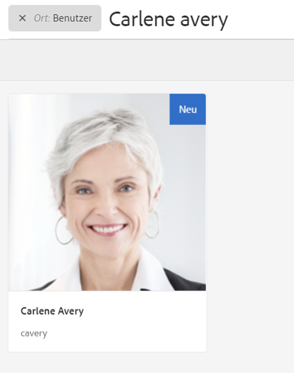

# Handhabung von DSGVO-bezogenen Anfragen in AEM Foundation{#handling-gdpr-requests-for-the-aem-foundation}

>[!IMPORTANT]
>
>Die DSGVO wird in den folgenden Abschnitten als Beispiel verwendet, die betroffenen Informationen gelten jedoch für alle Datenschutz- und Datenschutzbestimmungen. wie DSGVO, CCPA usw.

## AEM DSGVO-Unterstützung von Foundation {#aem-foundation-gdpr-support}

Auf AEM Foundation-Ebene sind die gespeicherten personenbezogenen Daten das Benutzerprofil. Dementsprechend wird in diesem Artikel in erster Linie erläutert, wie der Zugriff auf und das Löschen von Benutzerprofilen erfolgt, um DSGVO-bezogene Anfragen zum Datenzugriff bzw. zur Datenlöschung handzuhaben.

## Zugreifen auf Benutzerprofile {#accessing-a-user-profile}

### Manuelle Schritte {#manual-steps}

1. Öffnen Sie die Konsole Benutzerverwaltung , indem Sie zu **[!UICONTROL Einstellungen - Sicherheit - Benutzer]** oder direkt zu `https://<serveraddress>:<serverport>/libs/granite/security/content/useradmin.html`

   

1. Suchen Sie dann den jeweiligen Benutzer, indem Sie dessen Name in der Suchleiste oben auf der Seite eingeben:

   

1. Klicken Sie nun auf das Benutzerprofil, um es zu öffnen, und rufen Sie die Registerkarte **[!UICONTROL Details]** auf.

   

### -HTTP-API {#http-api}

Wie bereits ausgeführt, bietet Adobe APIs, mit denen der Zugriff auf Benutzerdaten automatisiert werden kann. Es stehen verschiedene Arten von APIs zur Verfügung:

**UserProperties-API**

```shell
curl -u user:password http://localhost:4502/libs/granite/security/search/profile.userproperties.json\?authId\=cavery
```

**Sling-API**

*Ermitteln der Benutzerstartseite:*

```xml
curl -g -u user:password 'http://localhost:4502/libs/granite/security/search/authorizables.json?query={"condition":[{"named":"cavery"}]}'
     {"authorizables":[{"type":"user","authorizableId_xss":"cavery","authorizableId":"cavery","name_xss":"Carlene Avery","name":"Carlene Avery","home":"/home/users/we-retail/DSCP-athB1NYLBXvdTuN"}],"total":1}
```

*Abrufen von Benutzerdaten*

Verwenden Sie dazu den Knotenpfad der über den vorangegangenen Befehl ausgegebenen Home-Eigenschaft der JSON-Payload:

```shell
curl -u user:password  'http://localhost:4502/home/users/we-retail/DSCP-athB1NYLBXvdTuN/profile.-1.json'
```

```shell
curl -u user:password  'http://localhost:4502/home/users/we-retail/DSCP-athB1NYLBXvdTuN/profiles.-1.json'
```

## Deaktivieren von Benutzern und Löschen der zugehörigen Profile {#disabling-a-user-and-deleting-the-associated-profiles}

### Deaktivieren von Benutzern {#disable-user}

1. Öffnen Sie die Konsole für die Benutzerverwaltung und suchen Sie nach dem entsprechenden Benutzer, wie oben beschrieben.
1. Bewegen Sie den Mauszeiger über den Benutzer und klicken Sie auf das Auswahlsymbol. Das ausgewählte Profil wird nun in grau angezeigt.

1. Klicken Sie auf die Schaltfläche Deaktivieren im oberen Menü, um den Benutzer zu deaktivieren:

   

1. Bestätigen Sie die Aktion, um den Vorgang abzuschließen:

   

   In der Benutzeroberfläche wird dann angezeigt, dass der Benutzer deaktiviert wurde, indem er ausgegraut wurde und der Profilkarte eine Sperre hinzufügt:

   

### Löschen von Benutzerprofilinformationen {#delete-user-profile-information}

1. Melden Sie sich bei CRXDE Lite an und suchen Sie dann nach der `[!UICONTROL userId]`:

   

1. Öffnen Sie den Benutzerknoten, der sich unter `[!UICONTROL /home/users]` standardmäßig:

   

1. Löschen Sie die Profilknoten und die ihnen zugehörigen untergeordneten Elemente. Abhängig von der AEM-Version liegen die Profilknoten in zwei unterschiedlichen Formaten vor:

   1. Das private Standardprofil unter `[!UICONTROL /profile]`
   1. `[!UICONTROL /profiles]`, für neue Profile, die mit AEM 6.5 erstellt wurden.

   

### -HTTP-API {#http-api-1}

Die folgenden Verfahren verwenden das Befehlszeilen-Tool `curl`, um zu veranschaulichen, wie die Benutzerin mit der `userId` **[!UICONTROL cavery]** deaktiviert und ihre Profile am Standardspeicherort gelöscht werden können.

* *Ermitteln der Benutzerstartseite*

```shell
curl -g -u user:password 'http://localhost:4502/libs/granite/security/search/authorizables.json?query={"condition":[{"named":"cavery"}]}'
     {"authorizables":[{"type":"user","authorizableId_xss":"cavery","authorizableId":"cavery","name_xss":"Carlene Avery","name":"Carlene Avery","home":"/home/users/we-retail/DSCP-athB1NYLBXvdTuN"}],"total":1}
```

* *Deaktivieren des Benutzers*

Verwenden Sie dazu den Knotenpfad der über den vorangegangenen Befehl ausgegebenen Home-Eigenschaft der JSON-Payload:

```shell
curl -X POST -u user:password -FdisableUser="describe the reasons for disabling this user (GDPR in this case)" 'http://localhost:4502/home/users/we-retail/DSCP-athB1NYLBXvdTuN.rw.userprops.html'
```

* *Löschen von Benutzerprofilen*

Verwenden Sie dazu den Knotenpfad der Home-Eigenschaft der JSON-Payload, der über den Befehl zur Ermittlung der Benutzerstartseite ausgegeben wurde, sowie die bekannten vorkonfigurierten Speicherorte des Profilknotens:

```shell
curl -X POST -u user:password -H "Accept: application/json,**/**;q=0.9" -d ':operation=delete' 'http://localhost:4502/home/users/we-retail/DSCP-athB1NYLBXvdTuN/profile'
```

```shell
curl -X POST -u user:password -H "Accept: application/json,**/**;q=0.9" -d ':operation=delete' 'http://localhost:4502/home/users/we-retail/DSCP-athB1NYLBXvdTuN/profile'
```
