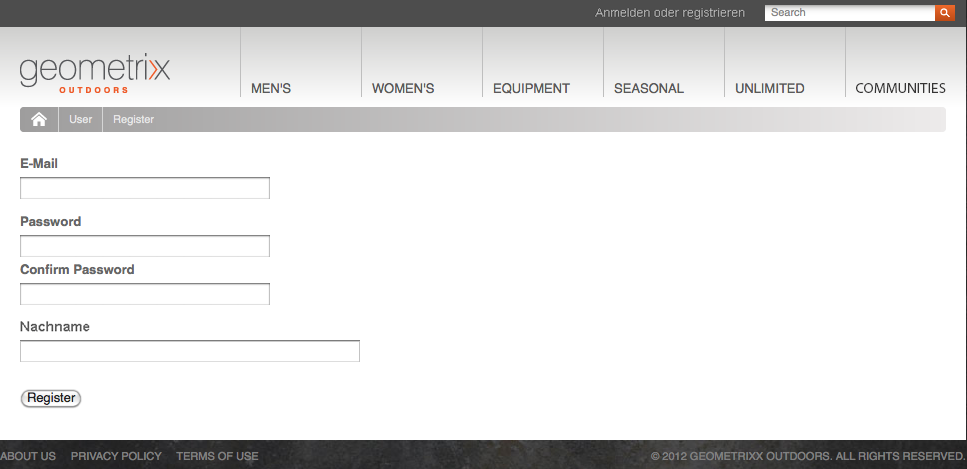
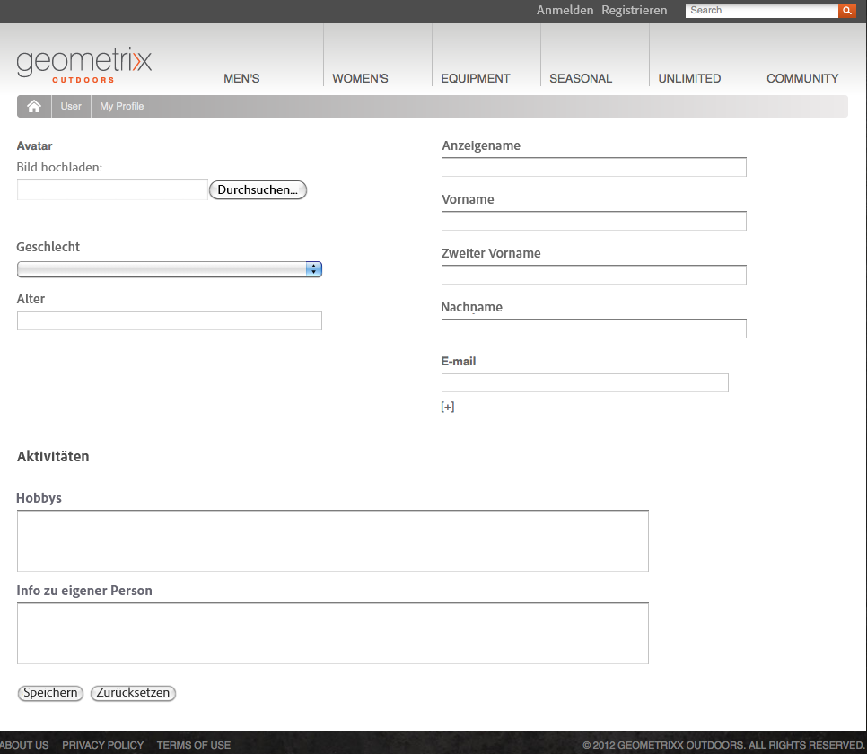
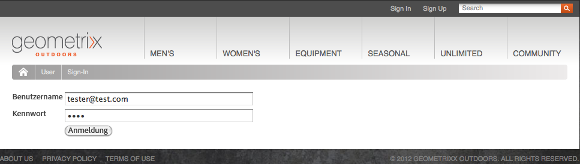
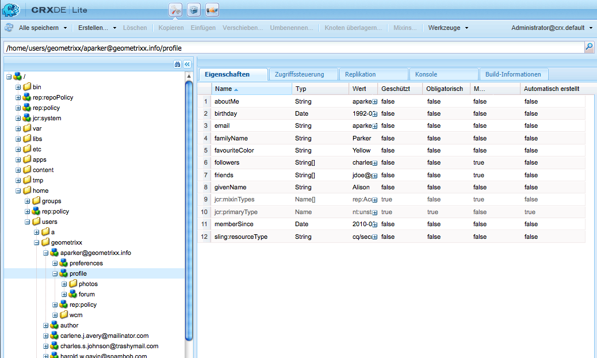
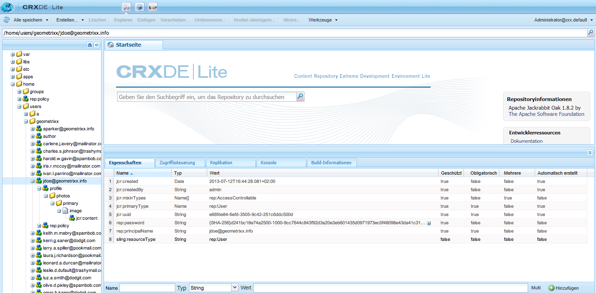
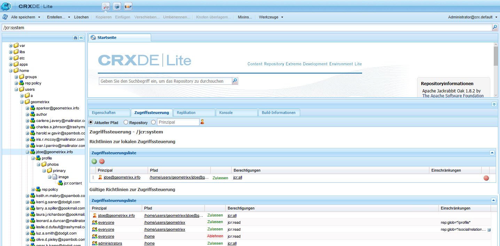
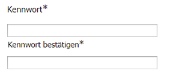
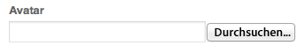
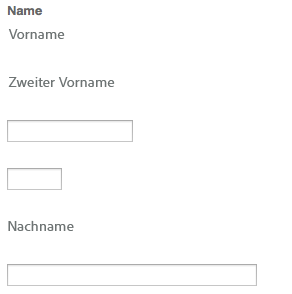

# Identitäts-Management{#identity-management}

Die einzelnen Besucher Ihrer Website können nur identifiziert werden, wenn Sie ihnen die Möglichkeit zum Anmelden bieten. Es gibt verschiedene Gründe, warum Sie eine Anmeldemöglichkeit bieten sollten:

* Besucher der [AEM Communities](/help/communities/overview.md)Website müssen sich anmelden, um Inhalte an die Community posten zu können.
* [Geschlossene Benutzergruppen](/help/sites-administering/cug.md)

   Möglicherweise müssen Sie den Zugriff auf Ihre Website (oder deren Bereiche) auf bestimmte Besucher beschränken.

* [](/help/sites-administering/personalization.md) PersonalisierungBesucher können bestimmte Aspekte des Zugriffs auf Ihre Website konfigurieren.

Die Anmelde (und Abmelde)-Funktion wird von einem [Konto mit einem **Profil**](#profiles-and-user-accounts) bereitgestellt, das zusätzliche Informationen über den registrierten Besucher (Benutzer) enthält. Die tatsächlichen Prozesse für die Registrierung und Autorisierung können abweichen:

* Selbstregistrierung auf der Website

   Eine [Community-Site](/help/communities/sites-console.md) kann so konfiguriert sein, dass Besucher sich selbst registrieren oder sich mit ihren Facebook- oder Twitter-Konten anmelden können.

* Antrag auf Registrierung auf der Website

   Bei einer geschlossenen Benutzergruppe können Sie Besuchern gestatten, eine Registrierung anzufordern, aber die Autorisierung mithilfe eines Workflows erzwingen.

* Registrieren Sie jedes Konto bei der Autoren-Umgebung

   Wenn Sie eine kleine Anzahl von Profilen haben, die ohnehin eine Autorisierung benötigen, können Sie sich entscheiden, diese direkt zu registrieren.

Eine Reihe von Komponenten und Formularen kann zum Erfassen der erforderlichen Identifikationsinformationen sowie danach der zusätzlichen (oft optionalen) Profilinformationen dienen, um den Besuchern die Registrierung zu ermöglichen. Nachdem sie sich registriert haben, sollten sie auch in der Lage sein, die Daten, die sie eingereicht haben, zu überprüfen und zu aktualisieren.

Zusätzliche Funktionalität kann konfiguriert oder entwickelt werden:

* Konfigurieren Sie jede Rückwärtsreplikation, die erforderlich ist.
* Ermöglichen Sie einem Benutzer das Entfernen seines Profils, indem Sie ein Formular zusammen mit einem Workflow entwickeln.

>[!NOTE]
>
>Die im Profil angegebenen Informationen können auch verwendet werden, um dem Benutzer über [Segmente](/help/sites-administering/campaign-segmentation.md) und [Kampagnen](/help/sites-classic-ui-authoring/classic-personalization-campaigns.md) zielgruppengerechte Inhalte bereitzustellen.

## Registrierungsformulare {#registration-forms}

Ein [Formular](/help/sites-authoring/default-components.md#form-component) kann verwendet werden, um die Registrierungsinformationen zu erfassen und dann das neue Konto und das Profil anzulegen.

Beispielsweise können Benutzer über die Geometrixx-Seite ein neues Profil anfordern.
`http://localhost:4502/content/geometrixx-outdoors/en/user/register.html`



Nach dem Übermitteln der Anfrage wird die Profilseite geöffnet. Auf dieser kann der Benutzer persönliche Daten bereitstellen.



Das neue Konto ist auch in der [Benutzerkonsole](/help/sites-administering/security.md) sichtbar.

## Anmeldung {#login}

Die Anmeldekomponente kann zum Erfassen der Anmeldeinformationen und dann zur Aktivierung des Login-Verfahrens verwendet werden.

Sie stellt dem Besucher die Standardfelder **Benutzername** und **Kennwort** bereit, sowie ferner eine Schaltfläche **Anmelden** zum Aktivieren des Login-Verfahrens bei Eingabe der Anmeldedaten.

Benutzer können sich beispielsweise entweder anmelden oder mithilfe der Option **Anmelden** in der Geometrixx-Symbolleiste ein neues Konto erstellen, welches folgende Seite nutzt:

`http://localhost:4502/content/geometrixx-outdoors/en/user/sign-in.html`



## Abmelden {#logging-out}

Da ein Anmeldemechanismus vorhanden ist, ist auch ein Abmeldemechanismus erforderlich. Dieser ist als Option **Abmelden** in Geometrixx verfügbar.

## Anzeigen und Aktualisieren eines Profils {#viewing-and-updating-a-profile}

Je nach Ihrem Registrierungsformular kann der Benutzer die registrierten Informationen in seinem Profil haben. Sie sollten in der Lage sein, diese Informationen zu einem späteren Zeitpunkt anzuzeigen und/oder zu aktualisieren. Dies kann mit einem ähnlichen Formular erfolgen. zum Beispiel in Geometrixx:

```
http://localhost:4502/content/geometrixx-outdoors/en/user/profile.html
```

Um die Details Ihres Profils anzuzeigen, klicken Sie auf **Mein Profil** oben rechts auf einer Seite. zum Beispiel mit dem Konto `admin`:
`http://localhost:4502/home/users/a/admin/profile.form.html/content/geometrixx-outdoors/en/user/profile.html.`

Sie können mit dem [ClientContext](/help/sites-administering/client-context.md) (in der Autorenumgebung und mit ausreichend Berechtigungen) ein anderes Profil anzeigen:

1. Öffnen Sie eine Seite. z. B. Geometrixx:

   `http://localhost:4502/cf#/content/geometrixx/en.html`

1. Klicken Sie in der oberen rechten Ecke auf **Mein Profil**. Sie werden das Profil Ihres aktuellen Kontos sehen; beispielsweise vom Administrator.
1. Drücken Sie **Strg-Alt-C**, um den ClientContext zu öffnen.
1. Klicken Sie in der oberen linken Ecke des ClientContext auf die Schaltfläche **Profil laden**.

   

1. Wählen Sie ein anderes Profil aus der Dropdown-Liste im Dialogfeld; z. B. **Alison Parker**.
1. Klicken Sie auf **OK**.
1. Klicken Sie erneut auf **Mein Profil**. Das Formular wird mit Alisons Daten aktualisiert.

   

1. Sie können die Daten nun mit der Option **Profil bearbeiten** oder **Kennwort ändern** aktualisieren.

## Hinzufügen von Feldern zur Profildefinition  {#adding-fields-to-the-profile-definition}

Sie können der Profildefinition Felder hinzufügen. Beispielsweise zum Hinzufügen eines Felds „Lieblingsfarbe“ zum Geometrixx-Profil:

1. Navigieren Sie von der Websites-Konsole zu „Geometrixx Outdoors Site“ > „Deutsch“ > „Benutzer“ > „Mein Profil“.
1. Doppelklicken Sie auf die Seite **Mein Profil**, um sie zur Bearbeitung zu öffnen.
1. Erweitern Sie in der Registerkarte **Komponenten** des Sidekicks den Abschnitt **Formular**.
1. Ziehen Sie eine **Dropdown-Liste** aus dem Sidekick in das Formular, direkt unter das Feld **Info zu eigener Person**.
1. Doppelklicken Sie auf die Komponente **Dropdown-Liste**, um das Dialogfeld für die Konfiguration zu öffnen, und geben Sie Folgendes ein:

   * **Elementname** - `favoriteColor`
   * **Titel** - `Favorite Color`
   * **Elemente** – Fügen Sie mehrere Farben als Elemente hinzu

   Klicken Sie zum Speichern auf **OK**.

1. Schließen Sie die Seite. Kehren Sie zur **Websites-Konsole** zurück und aktivieren Sie die Seite „Mein Profil“.

   Bei der nächsten Ansicht eines Profils können Sie eine Lieblingsfarbe auswählen:

   

   Das Feld wird unter dem Abschnitt **Profil** des relevanten Benutzerkontos gespeichert:

   

## Profilstatus {#profile-states}

Es gibt eine Reihe von Anwendungsfällen, die wissen müssen, ob sich ein Benutzer (oder vielmehr sein Profil) in einem *spezifischen Status* befindet.

Dazu müssen Sie eine geeignete Eigenschaft im Benutzerprofil in einer Weise definieren, die:

* sichtbar und für den Benutzer zugänglich ist
* zwei Status für jede Eigenschaft definiert
* das Umschalten zwischen den beiden definierten Status gestattet

Dies geschieht mithilfe von:

* [Statusanbieter](#state-providers)

   Zum Verwalten der beiden Zustände einer bestimmten Eigenschaft und der Transitionen zwischen den beiden.

* [Workflows](#workflows)

   Zum Verwalten von statusbezogenen Aktionen.

Es können mehrere Status definiert werden; in Geometrixx umfassen diese beispielsweise:

* das Abonnieren (oder das Aufheben des Abonnements) von Benachrichtigungen zu Newslettern oder Kommentar-Threads
* Das Hinzufügen und Entfernen einer Verknüpfung zu einem Freund

### Statusanbieter {#state-providers}

Ein Statusanbieter verwaltet den aktuellen Status der betreffenden Eigenschaft zusammen mit den Übergängen zwischen den beiden möglichen Status.

Statusanbieter werden als Komponenten implementiert und können so für Ihr Projekt individuell angepasst werden. In Geometrixx umfassen diese u. a.:

* Forum abonnieren/kündigen (Thema)
* Freund hinzufügen/entfernen

### Workflows {#workflows}

Statusanbieter verwalten eine Profileigenschaft sowie deren Status.

Ein Workflow ist erforderlich, um die statusbezogenen Aktionen zu implementieren. Beispiel: Beim Abonnieren von Benachrichtigungen handhabt der Workflow die tatsächliche Abonnementaktion; bei der Aufhebung des Benachrichtigungsabonnements handhabt der Workflow das Entfernen des Benutzers von der Abonnementliste.

## Profile und Benutzerkonten {#profiles-and-user-accounts}

Profil werden im Content Repository als Teil des [Benutzerkontos](/help/sites-administering/user-group-ac-admin.md) gespeichert.

Das Profil befindet sich unter `/home/users/geometrixx`:



Bei einer Standardinstallation (Autor oder Veröffentlichen), hat jeder Lesezugriff auf die gesamten Profilinformationen aller Benutzer. Jeder ist eine *Integrierte Gruppe, die automatisch alle vorhandenen Benutzer und Gruppen enthält. Die Mitgliederliste kann nicht bearbeitet werden*.

Diese Zugriffsrechte werden durch die folgende Platzhalter-ACL definiert:

/home Alle zulassen jcr:read rep:glob = */Profil*

Dadurch ist Folgendes möglich:

* Forum, Kommentare oder Blog-Posts, um Informationen (z. B. Symbol oder vollständiger Name) aus dem entsprechenden Profil anzuzeigen
* Verknüpfung mit Geometrixx-Profilseiten

Wenn ein solcher Zugriff für Ihre Installation nicht geeignet ist, können Sie diese Standardeinstellungen ändern.

Dies kann mithilfe der Registerkarte **[Zugriffskontrolle](/help/sites-administering/user-group-ac-admin.md#access-right-management)** durchgeführt werden:



## Profilkomponenten {#profile-components}

Ein Bereich von Profilkomponenten zum Definieren der Profilanforderungen für Ihre Website ist ebenfalls vorhanden.

### Geprüftes Kennwort-Feld  {#checked-password-field}

Diese Komponente bietet Ihnen zwei Felder für:

* die Eingabe eines Kennworts
* eine Überprüfung, um sicherzustellen, dass das Kennwort richtig eingegeben wurde.

Die Standardeinstellungen der Komponente werden folgendermaßen angezeigt:



### Profil-Avatar-Foto {#profile-avatar-photo}

Diese Komponente bietet dem Benutzer die Möglichkeit, eine Avatar-Fotodatei auszuwählen und hochzuladen.



### Profil – Genauer Name {#profile-detailed-name}

Diese Komponente ermöglicht es dem Benutzer, einen detaillierten Namen einzugeben.



### Profil-Geschlecht {#profile-gender}

Diese Komponente ermöglicht dem Benutzer die Eingabe seines Geschlechts.


