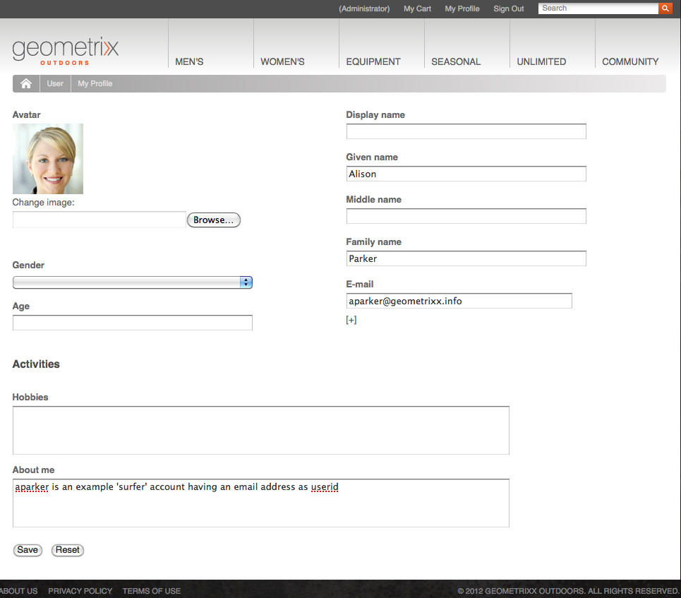

# Identitäts-Management{#identity-management}

Einzelne Besucherinnen bzw. Besucher Ihrer Website können nur identifiziert werden, wenn Sie ihnen die Möglichkeit geben, sich anzumelden. Es gibt verschiedene Gründe, warum Sie eine Anmeldemöglichkeit bieten sollten:

* Besuchende der [AEM Communities](/help/communities/overview.md)-Website müssen sich anmelden, um Inhalte an die Community posten zu können.
* [Geschlossene Benutzergruppen](/help/sites-administering/cug.md)

  Sie können den Zugang zu Ihrer Website (oder Abschnitten davon) ggf. auf bestimmte Besuchende beschränken.

* [Personalisierung](/help/sites-administering/personalization.md) ermöglicht Besuchenden die Konfiguration bestimmter Aspekte des Zugriffs auf Ihre Website.

Die Anmelde- (und Abmelde)-Funktion wird von einem [Konto mit einem **Profil**](#profiles-and-user-accounts) bereitgestellt, das zusätzliche Informationen über registrierte Besuchende (Benutzende) enthält. Die tatsächlichen Prozesse für die Registrierung und Autorisierung können abweichen:

* Selbstregistrierung über die Website

  Eine [Community-Website](/help/communities/sites-console.md) kann so konfiguriert werden, dass Besuchenden die Selbstregistrierung oder die Anmeldung mit ihrem Facebook- oder Twitter-Konto möglich ist.

* Antrag auf Registrierung über die Website

  Für eine geschlossene Benutzergruppe können Sie Besuchenden einen Antrag auf Registrierung gestatten, die Autorisierung jedoch mithilfe eines Workflows zwangsweise durchsetzen.

* Registrieren jedes Kontos über die Authoring-Umgebung

  Wenn Sie nur über eine geringe Anzahl von Profilen verfügen, die ohnehin autorisiert werden müssen, können Sie diese auch direkt registrieren.

Damit sich Besuchende registrieren können, können eine Reihe von Komponenten und Formularen verwendet werden, um die erforderlichen Identifizierungsinformationen und dann die zusätzlichen (oft optionalen) Profilinformationen zu erfassen. Nachdem sie sich registriert haben, sollten sie auch in der Lage sein, die von ihnen übermittelten Details zu überprüfen und zu aktualisieren.

Zusätzliche Funktionen können konfiguriert oder entwickelt werden:

* Konfigurieren Sie alle erforderlichen Rückwärtsreplikationen.
* Ermöglichen Sie Benutzenden das Entfernen deren Profile, indem Sie ein Formular zusammen mit einem Workflow entwickeln.

>[!NOTE]
>
>Die im Profil angegebenen Informationen können auch verwendet werden, um den Benutzenden über [Segmente](/help/sites-administering/campaign-segmentation.md) und [Kampagnen](/help/sites-classic-ui-authoring/classic-personalization-campaigns.md) gezielte Inhalte zu liefern.

## Registrierungsformulare {#registration-forms}

Ein [Formular](/help/sites-authoring/default-components.md#form-component) kann verwendet werden, um die Registrierungsinformationen zu erfassen und dann das neue Konto und Profil zu generieren.

Benutzerinnen und Benutzer können beispielsweise mithilfe der folgenden Geometrixx-Seite ein neues Profil anfordern:
`http://localhost:4502/content/geometrixx-outdoors/en/user/register.html`


Nach dem Übermitteln der Anfrage wird die Profilseite geöffnet. Auf dieser kann der Benutzer oder die Benutzerin persönliche Daten bereitstellen.


Das neue Konto ist auch in der [Benutzerkonsole](/help/sites-administering/security.md) sichtbar.

## Anmeldung {#login}

Die Anmeldungskomponente kann verwendet werden, um die Anmeldeinformationen zu erfassen und den Anmeldeprozess zu aktivieren.

Sie stellt dem Besucher bzw. der Besucherin die Standardfelder **Benutzername** und **Kennwort** bereit, sowie ferner eine Schaltfläche **Anmelden** zum Aktivieren des Login-Verfahrens bei Eingabe der Anmeldedaten.

Beispielsweise können sich Benutzer entweder mit dem **Anmelden** -Option in der Geometrixx-Symbolleiste, die die Seite verwendet:

`http://localhost:4502/content/geometrixx-outdoors/en/user/sign-in.html`


## Abmelden {#logging-out}

Da es einen Anmeldemechanismus gibt, ist auch ein Abmeldemechanismus erforderlich. Dieser ist als Option **Abmelden** in Geometrixx verfügbar.

## Anzeigen und Aktualisieren eines Profils {#viewing-and-updating-a-profile}

Je nach Ihrem Registrierungsformular können die Besuchenden registrierte Informationen in ihren Profilen haben. Sie sollten in der Lage sein, dies zu einem späteren Zeitpunkt anzuzeigen und/oder zu aktualisieren. Dies kann mithilfe eines ähnlichen Formulars erfolgen, beispielsweise in Geometrixx:

```
http://localhost:4502/content/geometrixx-outdoors/en/user/profile.html
```

Um die Details Ihres Profils anzuzeigen, klicken Sie auf **Mein Profil** in der oberen rechten Ecke einer beliebigen Seite, z. B. mit der `admin` Konto:
`http://localhost:4502/home/users/a/admin/profile.form.html/content/geometrixx-outdoors/en/user/profile.html.`

Sie können mit dem [ClientContext](/help/sites-administering/client-context.md) (in der Authoring-Umgebung und mit ausreichend Berechtigungen) ein anderes Profil anzeigen:

1. Öffnen Sie eine Seite, z. B. die Geometrixx-Seite:

   `http://localhost:4502/cf#/content/geometrixx/en.html`

1. Klicken Sie auf **Mein Profil** in der oberen rechten Ecke. Sie sehen das Profil Ihres aktuellen Kontos, z. B. den Administrator.
1. Drücken Sie **Strg+Alt+C**, um den Client-Kontext zu öffnen.
1. Klicken Sie in der oberen linken Ecke des Client-Kontextes auf die Schaltfläche **Profil laden**.

   

1. Wählen Sie ein anderes Profil aus der Dropdown-Liste im Dialogfeld aus, z. B.: **Alison Parker**.
1. Klicken Sie auf **OK**.
1. Klicken Sie erneut auf **Mein Profil**. Das Formular wird mit den Details von Alina aktualisiert.

   

1. Sie können nun **Profil bearbeiten** oder **Kennwort ändern** verwenden, um die Details zu aktualisieren.

## Hinzufügen von Feldern zur Profildefinition {#adding-fields-to-the-profile-definition}

Sie können der Profildefinition Felder hinzufügen. So fügen Sie dem Geometrixx beispielsweise das Feld &quot;Lieblingsfarbe&quot;hinzu:

1. Navigieren Sie von der Websites-Konsole zu „Geometrixx Outdoors Site“ > „Deutsch“ > „Benutzer“ > „Mein Profil“.
1. Doppelklicken Sie auf die **Mein Profil** Seite, um sie zur Bearbeitung zu öffnen.
1. Erweitern Sie in der Registerkarte **Komponenten** des Sidekicks den Abschnitt **Formular**.
1. Ziehen Sie eine **Dropdown-Liste** aus dem Sidekick in das Formular, direkt unter das Feld **Info zu eigener Person**.
1. Doppelklicken Sie auf die Komponente **Dropdown-Liste**, um das Dialogfeld für die Konfiguration zu öffnen, und geben Sie Folgendes ein:

   * **Elementname** - `favoriteColor`
   * **Titel** - `Favorite Color`
   * **Elemente** – Fügen Sie mehrere Farben als Elemente hinzu

   Klicken Sie zum Speichern auf **OK**.

1. Schließen Sie die Seite. Kehren Sie zur **Websites-Konsole** zurück und aktivieren Sie die Seite „Mein Profil“.

   Bei der nächsten Ansicht eines Profils können Sie eine Lieblingsfarbe auswählen:

   

   Das Feld wird unter dem Abschnitt **Profil** des relevanten Benutzerkontos gespeichert:

   

## Profilstatus {#profile-states}

Es gibt verschiedene Anwendungsfälle, bei denen es erforderlich ist zu wissen, ob sich ein Benutzer (oder eher sein Profil) in einem *spezifischer Status* oder nicht.

Dazu gehört das Definieren einer entsprechenden Eigenschaft im Benutzerprofil auf eine Weise, die:

* für den Benutzer sichtbar und zugänglich ist
* zwei Status für jede Eigenschaft definiert
* Umschalten zwischen den beiden definierten Status

Dies geschieht mithilfe von:

* [Statusanbieter](#state-providers)

  Zum Verwalten der beiden Status einer speziellen Eigenschaft sowie der Übergänge zwischen beiden.

* [Workflows](#workflows)

  Zum Verwalten von statusbezogenen Aktionen.

Es können mehrere Status definiert werden. In Geometrixx umfassen diese beispielsweise:

* das Abonnieren (oder das Aufheben des Abonnements) von Benachrichtigungen zu Newslettern oder Kommentar-Threads
* Das Hinzufügen und Entfernen einer Verknüpfung zu einem Freund bzw. einer Freundin

### Statusanbieter {#state-providers}

Ein Statusanbieter verwaltet den aktuellen Status der betreffenden Eigenschaft zusammen mit den Übergängen zwischen den beiden möglichen Status.

Statusanbieter werden als Komponenten implementiert und können daher für Ihr Projekt angepasst werden. In Geometrixx umfassen diese Folgendes:

* Forumthema abonnieren/kündigen
* Freund bzw. Freundin hinzufügen/entfernen

### Workflows {#workflows}

Statusanbieter verwalten eine Profileigenschaft und deren Status.

Ein Workflow ist erforderlich, um die statusbezogenen Aktionen zu implementieren. Beispiel: Beim Abonnieren von Benachrichtigungen handhabt der Workflow die tatsächliche Abonnementaktion; bei der Aufhebung des Benachrichtigungsabonnements handhabt der Workflow das Entfernen des Benutzers bzw. der Benutzerin von der Abonnementliste.

## Profile und Benutzerkonten {#profiles-and-user-accounts}

Profile werden im Content-Repository als Teil des [Benutzerkontos](/help/sites-administering/user-group-ac-admin.md) gespeichert.

Das Profil ist unter `/home/users/geometrixx` zu finden:


Bei einer Standardinstallation (Author oder Publish) hat jeder Lesezugriff auf die gesamten Profilinformationen aller Benutzenden. Jeder ist eine „*Integrierte Gruppe, die automatisch alle vorhandenen Benutzenden und Gruppen enthält. Die Mitgliederliste kann nicht bearbeitet werden*“.

Diese Zugriffsberechtigungen werden durch die folgende Platzhalter-ACL definiert:

/home everyone allow jcr:read rep:glob = &#42;/profile&#42;

Dies ermöglicht Folgendes:

* Forum, Kommentare oder Blog-Beiträge zur Anzeige von Informationen (wie Symbol oder vollständiger Name) aus dem entsprechenden Profil
* Links zu Geometrixx-Profilseiten

Wenn dieser Zugriff für Ihre Installation nicht geeignet ist, können Sie diese Standardeinstellungen ändern.

Verwenden Sie dazu die Registerkarte **[Zugriffskontrolle](/help/sites-administering/user-group-ac-admin.md#access-right-management)**:


## Profilkomponenten {#profile-components}

Es stehen auch verschiedene Profilkomponenten zur Definition der Profilanforderungen für Ihre Site zur Verfügung.

### Feld für die Kennwortüberprüfung {#checked-password-field}

Diese Komponente bietet Ihnen zwei Felder für:

* die Eingabe eines Passworts
* eine Überprüfung, um sicherzustellen, dass das Passwort korrekt eingegeben wurde.

Mit den Standardeinstellungen wird die Komponente wie folgt angezeigt:


### Profil – Avatar-Foto {#profile-avatar-photo}

Diese Komponente bietet den Benutzenden einen Mechanismus zum Auswählen und Hochladen einer Avatar-Fotodatei.


### Profil – Genauer Name {#profile-detailed-name}

Mit dieser Komponente können die Benutzenden einen detaillierten Namen eingeben.


### Profil – Geschlecht {#profile-gender}

Mit dieser Komponente können die Benutzenden ihr Geschlecht eingeben.


