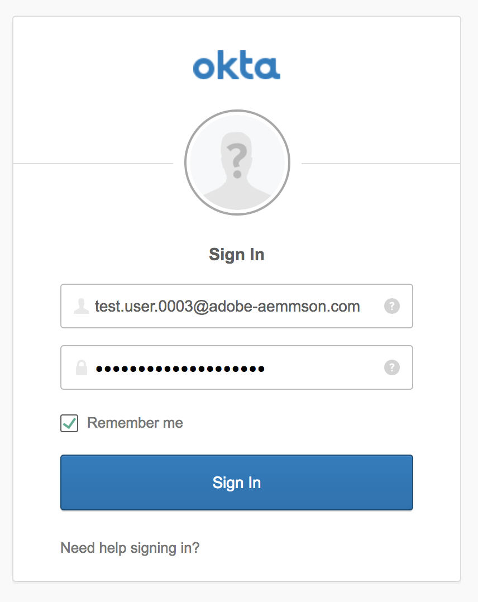

# Adobe IMS Authentication and [!DNL Admin Console] Support for AEM Managed Services {#adobe-ims-authentication-and-admin-console-support-for-aem-managed-services}

>[!NOTE]
>
>Beachten Sie, dass diese Funktion nur für Kunden von Adobe Managed Services verfügbar ist.

## Einführung {#introduction}

AEM 6.4.3.0 introduces [!DNL Admin Console] support for AEM instances and Adobe IMS(Identity Management System) based authentication for **AEM Managed Services** customers.

AEM onboarding to the [!DNL Admin Console] will allow AEM Managed Services customers to manage all Experience Cloud users in one console. Benutzer und Gruppen können Produktinstanzen zugewiesen werden, die mit AEM-Instanzen verknüpft sind, sodass sie sich bei einer bestimmten Instanz anmelden können.

## Wichtige Highlights {#key-highlights}

* Die Unterstützung der AEM-IMS-Authentifizierung wird nur für AEM-Autoren, Administratoren oder Entwickler unterstützt, nicht für externe Endbenutzer der Kunden-Site (z. B. Site-Besucher).
* The [!DNL Admin Console] will represent AEM Managed Services customers as IMS Organizations and their Instances as Product Contexts. Kundensystem- und Produktadministratoren können den Zugriff auf Instanzen verwalten.
* AEM Managed Services synchronisiert Kundentopologien mit der [!DNL Admin Console]. There will be one instance of AEM Managed Services Product Context per Instance in the [!DNL Admin Console].
* Product Profiles in [!DNL Admin Console] will determine which instances a user can access
* Federated Authentication über den SAML 2-konformen Identitäts-Provider des Kunden wird unterstützt.
* Nur Enterprise IDs oder Federated IDs (für Single Sign-On beim Kunden) werden unterstützt, jedoch keine persönlichen Adobe IDs.
* [!DNL User Management](in Adobe [!DNL Admin Console]) weiterhin im Eigentum der Kundenadministratoren stehen.

## Architektur {#architecture}

Die IMS-Authentifizierung verwendet das OAuth-Protokoll zwischen AEM und dem Adobe IMS-Endpunkt. Wenn Benutzer zu IMS hinzugefügt wurden und eine Adobe ID haben, können sie sich mit den IMS-Anmeldeinformationen bei AEM Managed Services-Instanzen anmelden.

Die Schritte zur Benutzeranmeldung werden unten gezeigt. Der Benutzer wird zu IMS und optional zum Kunden-IDP für die SSO-Validierung und anschließend zurück zu AEM weitergeleitet.

## Einrichtung {#how-to-set-up}

### Onboarding Organizations to [!DNL Admin Console] {#onboarding-organizations-to-admin-console}

The customer onboarding to [!DNL Admin Console] is a pre-requisite to using Adobe IMS for AEM authentication.

Als ersten Schritt sollten Kunden eine Organisation in Adobe IMS bereitstellen. Adobe Enterprise customers are represented as IMS Organizations in the [Adobe [!DNL Admin Console]](https://helpx.adobe.com/enterprise/using/admin-console.html).

AEM Managed Services customers should already have an organization provisioned, and as part of the IMS provisioning, the customer instances will be made available in the [!DNL Admin Console] for managing user entitlements and access.

Der Wechsel zu IMS zur Benutzerauthentifizierung ist eine gemeinsame Maßnahme zwischen AMS und Kunden, wobei jede Seite eigene Workflows abschließen muss.

Sobald ein Kunde als „IMS-Organisation“ existiert und AMS die Bereitstellung des Kunden für IMS abgeschlossen hat, lautet die Zusammenfassung der erforderlichen Konfigurationsschritte wie folgt:

1. The designated System Admin receives an invite to log in to the [!DNL Admin Console]
1. Die Systemadministrator beansprucht die Domäne, um die Eigentümerschaft der Domäne zu bestätigen (in diesem Beispiel acme.com).
1. Der Systemadministrator richtet die Benutzerverzeichnisse ein.
1. The System Admin configures the Identity Provider (IDP) in the [!DNL Admin Console] for SSO setup.
1. Der AEM-Administrator verwaltet die lokalen Gruppen, Berechtigungen und Zugriffsrechte wie gewohnt. Siehe Benutzer- und Gruppensynchronisierung

>[!NOTE]
>
>Weitere Informationen zu den Grundlagen zur Identitätsverwaltung von Adobe, einschließlich der IDP-Konfiguration, finden Sie [auf dieser Seite](https://helpx.adobe.com/enterprise/using/set-up-identity.html).
>
>For more info about the Enterprise Administration and [!DNL Admin Console] see the article [this page](https://helpx.adobe.com/enterprise/managing/user-guide.html).

### Onboarding Users to the [!DNL Admin Console] {#onboarding-users-to-the-admin-console}

Je nach der Größe des Kunden und den bevorzugten Einstellungen gibt es drei Möglichkeiten, Benutzer hinzuzufügen:

1. Manually create users and groups in [!DNL Admin Console]
1. Hochladen einer CSV-Datei mit Benutzern
1. Synchronisieren von Benutzern und Gruppen aus dem Active Directory des Kunden

#### Manuelles Hinzufügen über die [!DNL Admin Console] Benutzeroberfläche {#manual-addition-through-admin-console-ui}

Users and Groups can be manually created in the [!DNL Admin Console] UI. Diese Methode kann verwendet werden, wenn nur wenige Benutzer verwaltet werden müssen, z. B. weniger als 50 AEM-Benutzer.

Benutzer können auch manuell erstellt werden, wenn der Kunde diese Methode bereits zur Verwaltung anderer Adobe-Produkte wie Analytics, Target oder Creative Cloud-Applikationen verwendet.

#### Datei-Upload in der [!DNL Admin Console] Benutzeroberfläche {#file-upload-in-the-admin-console-ui}

Zur einfachen Handhabung der Benutzererstellung können Sie eine CSV-Datei hochladen, um eine große Anzahl von Benutzern hinzuzufügen:

#### Tool zur Benutzersynchronisierung {#user-sync-tool}

Das Tool zur Benutzersynchronisierung (User Sync Tool, kurz UST) ermöglicht es Unternehmenskunden, Adobe-Benutzer mithilfe von Active Directory und anderen getesteten OpenLDAP-Verzeichnisdiensten zu erstellen und zu verwalten. Die Zielbenutzer sind IT-Identitätsadministratoren (Enterprise-Verzeichnis- und Systemadministratoren), die das Tool installieren und konfigurieren können. Das Open Source-Tool ist anpassbar, sodass Entwickler beim Kunden das Tool an die eigenen Anforderungen anpassen können.

Wenn die Benutzersynchronisierung ausgeführt wird, ruft das Tool eine Liste der Benutzer aus dem Active Directory des Unternehmens (oder einer anderen kompatiblen Datenquelle) ab und vergleicht sie mit der Liste der Benutzer in der [!DNL Admin Console]. It then calls the Adobe [!DNL User Management] API so that the [!DNL Admin Console] is synchronized with the organization’s directory. The change flow is entirely one-way; any edits made in the [!DNL Admin Console] do not get pushed out to the directory.

The tool allows the system admin to map user groups in the customer’s directory with product configuration and user groups in the [!DNL Admin Console], the new UST version also allows dynamic creation of user groups in the [!DNL Admin Console].

To set up User Sync, the organization needs to create a set of credentials in the same way they would use the [[!DNL User Management] API](https://www.adobe.io/apis/cloudplatform/usermanagement/docs/setup.html).

Das UST steht über das Adobe Github-Repository an diesem Speicherort zur Verfügung:

[https://github.com/adobe-apiplatform/user-sync.py/releases/latest](https://github.com/adobe-apiplatform/user-sync.py/releases/latest)

Note that a pre-release version 2.4RC1 is available with dynamic group creation support and can be found here: [https://github.com/adobe-apiplatform/user-sync.py/releases/tag/v2.4rc1](https://github.com/adobe-apiplatform/user-sync.py/releases/tag/v2.4rc1)

The major features for this release are the ability to dynamically map new LDAP groups for user membership in the [!DNL Admin Console], as well as dynamic user group creation.

Weitere Informationen zu den neuen Gruppenfunktionen finden Sie hier:

[https://github.com/adobe-apiplatform/user-sync.py/blob/v2/docs/en/user-manual/advanced_configuration](https://github.com/adobe-apiplatform/user-sync.py/blob/v2/docs/en/user-manual/advanced_configuration.md#additional-group-options)

>[!NOTE]
>
>Weitere Informationen zum User Sync Tool finden Sie auf der [Dokumentationsseite](https://adobe-apiplatform.github.io/user-sync.py/en/).
>
>
>Das User Sync Tool muss mit dem [hier](https://adobe-apiplatform.github.io/umapi-documentation/en/UM_Authentication.html) beschriebenen Verfahren als Adobe I/O-Client-UMAPI registriert werden.
>
>Die Dokumentation zur Adobe I/O-Konsole finden Sie [hier](https://www.adobe.io/apis/cloudplatform/console.html).
>
>
>The [!DNL User Management] API that is used by the User Sync Tool is covered at this [location](https://www.adobe.io/apis/cloudplatform/umapi-new.html).

>[!NOTE]
>
>Die AEM-IMS-Konfiguration wird vom Adobe Managed Services-Team durchgeführt. Der Kundenadministrator kann sie jedoch gemäß den eigenen Anforderungen ändern (z. B. die automatische Gruppenmitgliedschaft oder die Gruppenzuordnung). Der IMS-Client wird auch von Ihrem Managed Services-Team registriert.

## Verwendung {#how-to-use}

### Managing Products and User Access in [!DNL Admin Console] {#managing-products-and-user-access-in-admin-console}

When the customer Product Administrator logs in to [!DNL Admin Console], they will see multiple instances of the AEM Managed Services Product Context as shown below:

In diesem Beispiel hat die Organisation *AEM-MS-Onboard* 32 Instanzen mit unterschiedlichen Topologien und Umgebungen wie Staging, Produktion usw.

Sie können die Instanzdetails überprüfen, um die Instanz zu identifizieren:

Unter jeder Produktkontextinstanz ist ein zugehöriges Produktprofil vorhanden. Dieses Produktprofil wird zum Zuweisen der Zugriffsrechte für Benutzer und Gruppen verwendet.

Alle unter diesem Produktprofil hinzugefügten Benutzer und Gruppen können sich wie im Beispiel unten gezeigt bei dieser Instanz anmelden:

### Anmelden bei AEM {#logging-into-aem}

#### Lokale Administratoranmeldung {#local-admin-login}

AEM kann lokale Anmeldungen für Administratoren weiterhin unterstützen, da der Anmeldebildschirm eine Option zur lokalen Anmeldung bietet:

#### IMS-basierte Anmeldung {#ims-based-login}

Für andere Benutzer kann die IMS-basierte Anmeldung verwendet werden, sobald IMS für die Instanz konfiguriert wurde. Benutzer klicken wie unten gezeigt auf die Schaltfläche **Mit Adobe anmelden**:

Anschließend werden sie zum IMS-Anmeldebildschirm weitergeleitet und geben ihre Anmeldeinformationen ein:

If a federated IDP is configured during initial [!DNL Admin Console] setup, then the user will be redirected to the customer IDP for SSO.

Im folgenden Beispiel ist Okta der IDP:

Sobald die Authentifizierung abgeschlossen ist, wird der Benutzer zurück zu AEM weitergeleitet und angemeldet:

### Migrieren vorhandener Benutzer {#migrating-existing-users}

Für vorhandene AEM-Instanzen, die eine andere Authentifizierungsmethode verwenden und jetzt zu IMS migriert werden, muss ein Migrationsschritt durchgeführt werden.

Vorhandene Benutzer im AEM-Repository (lokal über LDAP oder SAML bezogen) können migriert werden, um mithilfe des Benutzermigrationsprogramms auf IMS als IDP zu verweisen.

Dieses Dienstprogramm wird von Ihrem AMS-Team im Rahmen der IMS-Bereitstellung ausgeführt.

### Verwalten von Berechtigungen und ACLs in AEM {#managing-permissions-and-acls-in-aem}

Zugriffssteuerung und Zugriffsberechtigungen werden weiterhin in AEM verwaltet. Dies kann mithilfe separater Benutzergruppen aus IMS erreicht werden (z. B. AEM-GRP-008 im Beispiel unten), sowie durch lokale Gruppen, in denen die Berechtigungen und Zugriffsrechte definiert sind. Die von IMS synchronisierten Benutzergruppen können lokalen Gruppen zugewiesen werden und die Berechtigungen erben.

Im Beispiel unten werden der lokalen Gruppe *Dam_Users* synchronisierte Gruppen hinzugefügt.

Here, a user has also been assigned to a few groups in the [!DNL Admin Console]. ( Please note that the users and groups can be synced from LDAP using the user sync tool or created locally, please see the section **Onboarding Users to the[!DNL Admin Console]**above).

&amp;ast;Beachten Sie, dass Benutzergruppen nur synchronisiert werden, wenn sich die Benutzer bei der Instanz anmelden. Für Kunden mit einer großen Anzahl von Benutzern und Gruppen kann ein Dienstprogramm zur Gruppensynchronisierung von AMS ausgeführt werden, um Gruppen für die oben beschriebene Zugriffskontrolle- und Berechtigungsverwaltung vorab abzurufen.

Der Benutzer ist Teil der folgenden Gruppen in IMS:

Wenn sich der Benutzer anmeldet, werden die Gruppenmitgliedschaften wie unten dargestellt synchronisiert:

In AEM können die aus IMS synchronisierten Benutzergruppen vorhandenen lokalen Gruppen (z. B. DAM-Benutzern) als Mitglieder hinzugefügt werden.

Wie unten gezeigt, erbt die Gruppe *AEM-GRP_008* die Berechtigungen und Zugriffsrechte von DAM-Benutzern. Dies ist eine effektive Möglichkeit zur Verwaltung von Berechtigungen für synchronisierte Gruppen und wird häufig auch in LDAP-basierten Authentifizierungsmethoden verwendet.

