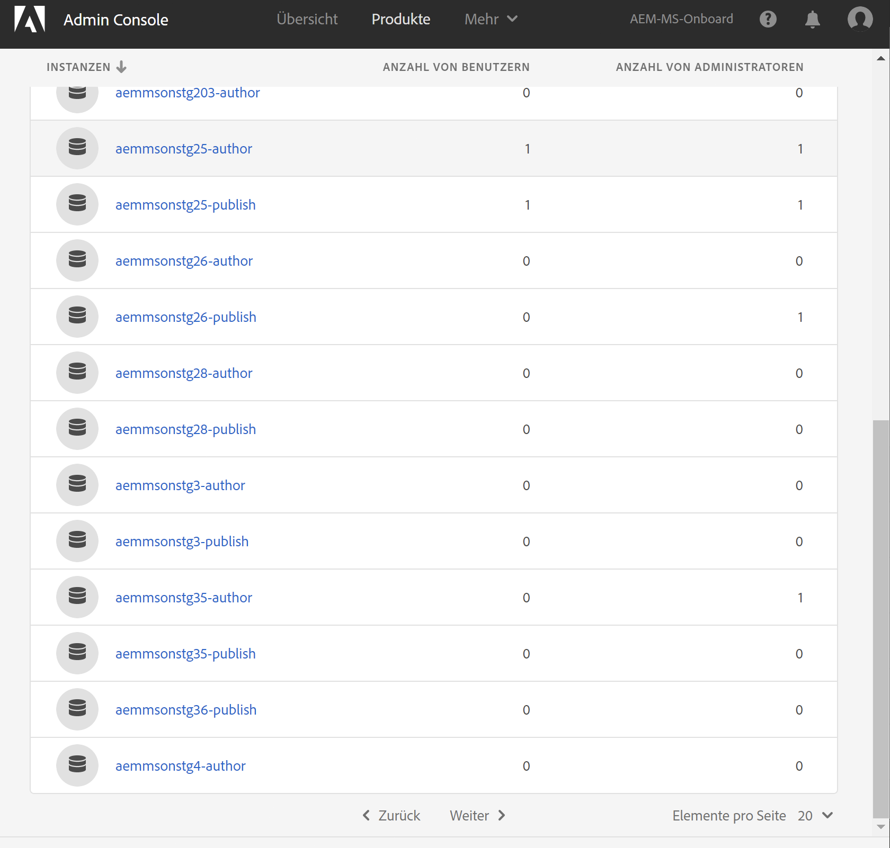

# Adobe IMS-Authentifizierung und [!DNL Admin Console] Unterstützung für AEM Managed Services {#adobe-ims-authentication-and-admin-console-support-for-aem-managed-services}

>[!NOTE]
>
>Beachten Sie, dass diese Funktion nur für Kunden von Adobe Managed Services verfügbar ist.

## Einführung {#introduction}

AEM 6.4.3.0 bietet [!DNL Admin Console] Unterstützung für AEM Instanzen und Adobe IMS(Identity Management System)-basierte Authentifizierung für **AEM Managed Services**-Kunden.

AEM Einstieg in das [!DNL Admin Console] ermöglicht es AEM Managed Services-Kunden, alle Experience Cloud-Benutzer in einer Konsole zu verwalten. Benutzer und Gruppen können Produktinstanzen zugeordnet werden, die AEM Instanzen zugeordnet sind, sodass sie sich bei einer bestimmten Instanz anmelden können.

## Wichtige Highlights {#key-highlights}

* Die Unterstützung der AEM-IMS-Authentifizierung wird nur für AEM-Autoren, Administratoren oder Entwickler unterstützt, nicht für externe Endbenutzer der Kunden-Site (z. B. Site-Besucher).
* Die [!DNL Admin Console] repräsentiert AEM Managed Services-Kunden als IMS-Organisationen und ihre Instanzen als Kontexte. Kundensystem- und Produktadministratoren können den Zugriff auf Instanzen verwalten.
* AEM Managed Services synchronisiert Kundentopologien mit der [!DNL Admin Console]. Es wird eine Instanz AEM Managed Services Product Context per Instance in [!DNL Admin Console] geben.
* Die Profil in [!DNL Admin Console] bestimmen, auf welche Instanzen ein Benutzer zugreifen kann.
* Federated Authentication über den SAML 2-konformen Identitäts-Provider des Kunden wird unterstützt.
* Nur Enterprise IDs oder Federated IDs (für Single Sign-On beim Kunden) werden unterstützt, jedoch keine persönlichen Adobe IDs.
* [!DNL User Management] (in Adobe  [!DNL Admin Console]) weiterhin im Eigentum der Kundenadministratoren stehen.

## Architektur {#architecture}

Die IMS-Authentifizierung verwendet das OAuth-Protokoll zwischen AEM und dem Adobe IMS-Endpunkt. Wenn Benutzer zu IMS hinzugefügt wurden und eine Adobe ID haben, können sie sich mit den IMS-Anmeldeinformationen bei AEM Managed Services-Instanzen anmelden.

Die Schritte zur Benutzeranmeldung werden unten gezeigt. Der Benutzer wird zu IMS und optional zum Kunden-IDP für die SSO-Validierung und anschließend zurück zu AEM weitergeleitet.

## Einrichtung {#how-to-set-up}

### Interne Organisationen nach [!DNL Admin Console] {#onboarding-organizations-to-admin-console}

Der Kunde, der [!DNL Admin Console] einsteigert, ist eine Voraussetzung für die Verwendung von Adobe IMS zur AEM Authentifizierung.

Als ersten Schritt sollten Kunden eine Organisation in Adobe IMS bereitstellen. Adobe Enterprise-Kunden werden als IMS-Organisationen in der [Adobe [!DNL Admin Console]](https://helpx.adobe.com/de/enterprise/using/admin-console.html) repräsentiert.

AEM Managed Services-Kunden sollten bereits über eine Organisation verfügen. Im Rahmen der IMS-Bereitstellung werden die Kundeninstanzen im [!DNL Admin Console] zur Verwaltung von Benutzerberechtigungen und zum Zugriff bereitgestellt.

Der Wechsel zu IMS zur Benutzerauthentifizierung ist eine gemeinsame Maßnahme zwischen AMS und Kunden, wobei jede Seite eigene Workflows abschließen muss.

Sobald ein Kunde als „IMS-Organisation“ existiert und AMS die Bereitstellung des Kunden für IMS abgeschlossen hat, lautet die Zusammenfassung der erforderlichen Konfigurationsschritte wie folgt:

1. Der festgelegte Systemadministrator erhält eine Einladung zum Anmelden beim [!DNL Admin Console]
1. Die Systemadministrator beansprucht die Domäne, um die Eigentümerschaft der Domäne zu bestätigen (in diesem Beispiel acme.com).
1. Der Systemadministrator richtet die Benutzerverzeichnisse ein.
1. Der Systemadministrator konfiguriert den Identitäts-Provider (IDP) im [!DNL Admin Console] für die SSO-Einrichtung.
1. Der AEM-Administrator verwaltet die lokalen Gruppen, Berechtigungen und Zugriffsrechte wie gewohnt. Siehe Benutzer- und Gruppensynchronisierung

>[!NOTE]
>
>Weitere Informationen zu den Grundlagen zur Identitätsverwaltung von Adobe, einschließlich der IDP-Konfiguration, finden Sie [auf dieser Seite](https://helpx.adobe.com/de/enterprise/using/set-up-identity.html).
>
>Weitere Informationen zur Unternehmensverwaltung und zu [!DNL Admin Console] finden Sie im Artikel [diese Seite](https://helpx.adobe.com/de/enterprise/managing/user-guide.html).

### Einstieg in Benutzer in [!DNL Admin Console] {#onboarding-users-to-the-admin-console}

Je nach der Größe des Kunden und den bevorzugten Einstellungen gibt es drei Möglichkeiten, Benutzer hinzuzufügen:

1. Benutzer und Gruppen manuell in [!DNL Admin Console] erstellen
1. Hochladen einer CSV-Datei mit Benutzern
1. Synchronisieren von Benutzern und Gruppen aus dem Active Directory des Kunden

#### Manuelles Hinzufügen über [!DNL Admin Console] UI {#manual-addition-through-admin-console-ui}

Benutzer und Gruppen können manuell in der [!DNL Admin Console]-Benutzeroberfläche erstellt werden. Diese Methode kann verwendet werden, wenn nur wenige Benutzer verwaltet werden müssen, z. B. weniger als 50 AEM-Benutzer.

Benutzer können auch manuell erstellt werden, wenn der Kunde diese Methode bereits zur Verwaltung anderer Adobe-Produkte wie Analytics, Target oder Creative Cloud-Applikationen verwendet.

#### Datei-Upload in der [!DNL Admin Console]-Benutzeroberfläche {#file-upload-in-the-admin-console-ui}

Zur einfachen Handhabung der Benutzererstellung können Sie eine CSV-Datei hochladen, um eine große Anzahl von Benutzern hinzuzufügen:

#### Tool zur Benutzersynchronisierung {#user-sync-tool}

Das Tool zur Benutzersynchronisierung (User Sync Tool, kurz UST) ermöglicht es Unternehmenskunden, Adobe-Benutzer mithilfe von Active Directory und anderen getesteten OpenLDAP-Verzeichnisdiensten zu erstellen und zu verwalten. Die Zielbenutzer sind IT-Identitätsadministratoren (Enterprise-Verzeichnis- und Systemadministratoren), die das Tool installieren und konfigurieren können. Das Open Source-Tool ist anpassbar, sodass Entwickler beim Kunden das Tool an die eigenen Anforderungen anpassen können.

Wenn die Benutzersynchronisierung ausgeführt wird, ruft das Tool eine Liste der Benutzer aus dem Active Directory des Unternehmens (oder einer anderen kompatiblen Datenquelle) ab und vergleicht sie mit der Liste der Benutzer in der [!DNL Admin Console]. Anschließend wird die API der Adobe [!DNL User Management] aufgerufen, damit [!DNL Admin Console] mit dem Unternehmensverzeichnis synchronisiert wird. Der Änderungsfluss ist einseitig; Änderungen, die in [!DNL Admin Console] vorgenommen wurden, werden nicht in den Ordner verschoben.

Das Tool ermöglicht es dem Systemadministrator, Benutzergruppen im Kundenverzeichnis mit Produktkonfiguration und Benutzergruppen im [!DNL Admin Console] zuzuordnen. Die neue UST-Version ermöglicht auch die dynamische Erstellung von Benutzergruppen im [!DNL Admin Console].

Um die Benutzersynchronisierung einzurichten, muss das Unternehmen einen Berechtigungssatz auf dieselbe Weise erstellen, wie sie [[!DNL User Management] API](https://www.adobe.io/apis/cloudplatform/usermanagement/docs/setup.html) verwenden würden.

Das zur Benutzersynchronisierung steht über das Adobe Github-Repository an diesem Speicherort zur Verfügung:

[https://github.com/adobe-apiplatform/user-sync.py/releases/latest](https://github.com/adobe-apiplatform/user-sync.py/releases/latest)

Beachten Sie, dass die Vorabversion 2.4RC1 mit Unterstützung der dynamischen Gruppenbildung verfügbar ist und finden Sie hier: [https://github.com/adobe-apiplatform/user-sync.py/releases/tag/v2.4rc1](https://github.com/adobe-apiplatform/user-sync.py/releases/tag/v2.4rc1)

Die Hauptfunktionen dieser Version sind die Möglichkeit, neue LDAP-Gruppen dynamisch für die Benutzermitgliedschaft in der [!DNL Admin Console] zuzuordnen, sowie die dynamische Erstellung von Benutzergruppen.

Weitere Informationen zu den neuen Gruppenfunktionen finden Sie hier:

[https://github.com/adobe-apiplatform/user-sync.py/blob/v2/docs/en/user-manual/advanced_configuration](https://github.com/adobe-apiplatform/user-sync.py/blob/v2/docs/en/user-manual/advanced_configuration.md#additional-group-options)

>[!NOTE]
>
>Weitere Informationen zum User Sync Tool finden Sie auf der [Dokumentationsseite](https://adobe-apiplatform.github.io/user-sync.py/en/).
>
>
>Das User Sync Tool muss mit dem [hier](https://adobe-apiplatform.github.io/umapi-documentation/en/UM_Authentication.html) beschriebenen Verfahren als Adobe I/O-Client-UMAPI registriert werden.
>
>Die Dokumentation zur Adobe I/O-Konsole finden Sie [hier](https://www.adobe.io/apis/cloudplatform/console.html).
>
>
>Die [!DNL User Management]-API, die vom User Sync Tool verwendet wird, wird an diesem [Speicherort](https://www.adobe.io/apis/cloudplatform/umapi-new.html) behandelt.

>[!NOTE]
>
>Die AEM-IMS-Konfiguration wird vom Adobe Managed Services-Team durchgeführt. Der Kundenadministrator kann sie jedoch gemäß den eigenen Anforderungen ändern (z. B. die automatische Gruppenmitgliedschaft oder die Gruppenzuordnung). Der IMS-Client wird auch von Ihrem Managed Services-Team registriert.

## Verwendung {#how-to-use}

### Verwalten von Produkten und Benutzerzugriff in [!DNL Admin Console] {#managing-products-and-user-access-in-admin-console}

Wenn sich der Produktadministrator des Kunden bei [!DNL Admin Console] anmeldet, sehen sie mehrere Instanzen des AEM Managed Services-Produktkontexts wie unten dargestellt:

In diesem Beispiel hat die Organisation *AEM-MS-Onboard* 32 Instanzen mit unterschiedlichen Topologien und Umgebungen wie Staging, Produktion usw.

Sie können die Instanzdetails überprüfen, um die Instanz zu identifizieren:

Unter jeder Produktkontextinstanz ist ein zugehöriges Produktprofil vorhanden. Dieses Produktprofil wird zum Zuweisen der Zugriffsrechte für Benutzer und Gruppen verwendet.

Alle unter diesem Produktprofil hinzugefügten Benutzer und Gruppen können sich wie im Beispiel unten gezeigt bei dieser Instanz anmelden:

### Anmelden bei AEM {#logging-into-aem}

#### Lokale Administratoranmeldung {#local-admin-login}

AEM kann lokale Anmeldungen für Administratoren weiterhin unterstützen, da der Anmeldebildschirm eine Option zur lokalen Anmeldung bietet:

#### IMS-basierte Anmeldung {#ims-based-login}

Für andere Benutzer kann die IMS-basierte Anmeldung verwendet werden, sobald IMS für die Instanz konfiguriert wurde. Benutzer klicken wie unten gezeigt auf die Schaltfläche **Mit Adobe anmelden**:

Anschließend werden sie zum IMS-Anmeldebildschirm weitergeleitet und geben ihre Anmeldeinformationen ein:

Wenn während der anfänglichen [!DNL Admin Console]-Einrichtung ein Federated IDP konfiguriert wurde, wird der Benutzer zur einmaligen Anmeldung an den Kunden-IDP weitergeleitet.

Im folgenden Beispiel ist Okta der IDP:

Sobald die Authentifizierung abgeschlossen ist, wird der Benutzer zurück zu AEM weitergeleitet und angemeldet:

### Migrieren vorhandener Benutzer {#migrating-existing-users}

Für vorhandene AEM-Instanzen, die eine andere Authentifizierungsmethode verwenden und jetzt zu IMS migriert werden, muss ein Migrationsschritt durchgeführt werden.

Vorhandene Benutzer im AEM Repository (lokal über LDAP oder SAML bezogen) können migriert werden, um mithilfe des Benutzermigrationsprogramms auf IMS als IDP zu verweisen.

Dieses Dienstprogramm wird von Ihrem AMS-Team im Rahmen der IMS-Bereitstellung ausgeführt.

### Verwalten von Berechtigungen und ACLs in AEM {#managing-permissions-and-acls-in-aem}

Zugriffssteuerung und Zugriffsberechtigungen werden weiterhin in AEM verwaltet. Dies kann mithilfe separater Benutzergruppen aus IMS erreicht werden (z. B. AEM-GRP-008 im Beispiel unten), sowie durch lokale Gruppen, in denen die Berechtigungen und Zugriffsrechte definiert sind. Die von IMS synchronisierten Benutzergruppen können lokalen Gruppen zugewiesen werden und die Berechtigungen erben.

Im Beispiel unten werden der lokalen Gruppe *Dam_Users* synchronisierte Gruppen hinzugefügt.

Hier wurde ein Benutzer auch einigen Gruppen im [!DNL Admin Console] zugewiesen. (Bitte beachten Sie, dass die Benutzer und Gruppen mit dem Benutzersynchronisierungstool aus LDAP synchronisiert oder lokal erstellt werden können. Lesen Sie hierzu den Abschnitt **Einsteigende Benutzer bis[!DNL Admin Console]** oben).

>[!NOTE]
>
>Benutzergruppen werden nur synchronisiert, wenn sich die Benutzer bei der Instanz anmelden.

Der Benutzer ist Teil der folgenden Gruppen in IMS:

Wenn sich der Benutzer anmeldet, werden die Gruppenmitgliedschaften wie unten dargestellt synchronisiert:

In AEM können die aus IMS synchronisierten Benutzergruppen vorhandenen lokalen Gruppen (z. B. DAM-Benutzern) als Mitglieder hinzugefügt werden.

Wie unten gezeigt, erbt die Gruppe *AEM-GRP_008* die Berechtigungen und Zugriffsrechte von DAM-Benutzern. Dies ist eine effektive Möglichkeit zur Verwaltung von Berechtigungen für synchronisierte Gruppen und wird häufig auch in LDAP-basierten Authentifizierungsmethoden verwendet.

