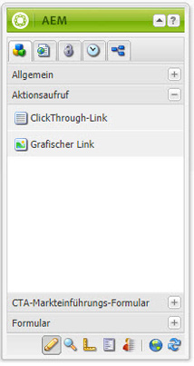
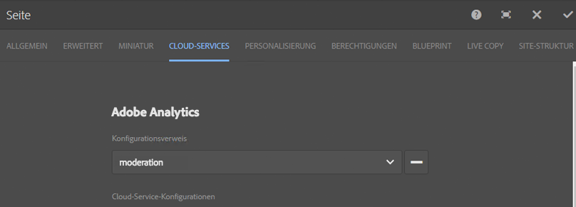

# Integrieren von Einstiegsseiten in Adobe Analytics{#integrating-landing-pages-with-adobe-analytics}

AEM hat die Landingpage-Lösung mit [Adobe Analytics](https://www.omniture.com/en/products/analytics/sitecatalyst) integriert, indem die folgenden Aktionsaufruf-Komponenten (CTA) verwendet werden:

1. Click Through-Komponente
1. Grafischer Link

Diese Komponenten legen bestimmte Attribute offen, die über Adobe Analytics-Variablen (Traffic- und Konversionsvariablen) und Erfolgsereignisse zugeordnet werden können, um Informationen an Adobe Analytics zu senden.

## Voraussetzungen {#prerequisites}

Adobe empfiehlt, die [vorhandene AEM-Adobe Analytics-Integration](/help/sites-administering/adobeanalytics.md) durchzugehen, um zu verstehen, wie diese Integration funktioniert.

## Verfügbare Komponenten für die Zuordnung {#components-available-for-mapping}

In AEM können die Komponenten **Aktionsaufruf** - **ClickThroughLink** und **GraphicalLink** - die hier im Sidekick angezeigt werden, Adobe Analytics-Variablen zugeordnet werden.

### Zuordnen von Einstiegsseitenkomponenten zu Adobe Analytics {#mapping-landing-page-components-to-adobe-analytics}

Sie können wie folgt Einstiegsseitenkomponenten zu Adobe Analytics zuordnen:

1. Nachdem Sie die Adobe Analytics-Konfiguration erstellt und ein neues Framework erstellt haben, wählen Sie die entsprechende Report Suite aus dem Dropdown-Menü aus. Hierdurch erfolgt das Abrufen der Adobe Analytics-Variablen und ihre Anzeige in der Inhaltssuche.
1. Ziehen Sie Aktionsaufrufkomponenten bei Bedarf vom Sidekick in den Zuordnungsbereich in der Mitte der Seite und legen Sie sie dort ab.

<table>
 <tbody>
  <tr>
   <td><strong>Komponentenname</strong></td>
   <td><strong>Angegebene Attribute</strong></td>
   <td><strong>Bedeutung des Attributs</strong></td>
  </tr>
  <tr>
   <td><strong>CTA-Click-Through-Link</strong></td>
   <td><i>eventdata.clickthroughLinkLabel</i>   </td>
   <td>Titel des Links oder Text des Links </td>
  </tr>
  <tr>
   <td>  </td>
   <td><i>eventdata.clickthroughLinkTarget</i>   </td>
   <td>Das Ziel, an dem Sie beim Klicken auf den Link gelangt sind </td>
  </tr>
  <tr>
   <td>  </td>
   <td><i>eventdata.events.clickthroughLinkClick</i>   </td>
   <td>Das Klickereignis </td>
  </tr>
  <tr>
   <td><strong>CTA-Grafiklink</strong></td>
   <td><i>eventdata.clicktroughImageLabel</i>   </td>
   <td>Der Titel des CTA-Bildes </td>
  </tr>
  <tr>
   <td>  </td>
   <td><i>eventdata.clicktroughImageTarget</i>   </td>
   <td>Das Ziel, das aufgerufen wird, wenn Sie auf das Bild mit Link klicken</td>
  </tr>
  <tr>
   <td>  </td>
   <td><i>eventdata.clicktroughImageAsset</i>   </td>
   <td>Der Pfad zum Bild-Asset im Repository </td>
  </tr>
  <tr>
   <td>  </td>
   <td><i>eventdata.events.clicktroughImageClick</i>   </td>
   <td>Das Klickereignis</td>
  </tr>
 </tbody>
</table>

1. Weisen Sie diese offengelegten Attribute beliebigen Adobe Analytics-Variablen aus der Inhaltssuche zu. Das Framework ist nun einsatzbereit.
1. Sie können jetzt eine neue Landingpage erstellen oder eine vorhandene Landingpage mit vorhandenen CTA-Komponenten öffnen und im Sidekick auf die Registerkarte **Cloud Services** in **Seiteneigenschaften** klicken (in der Touch-optimierten Benutzeroberfläche wählen Sie **Eigenschaften öffnen** aus und klicken Sie auf **Cloud Services**) und konfigurieren Sie das für die Landingpage zu verwendende Framework. Wählen Sie das Framework aus der Dropdown-Liste aus.

   

1. Nach dem Konfigurieren des Frameworks für die Einstiegsseite können Sie nun die instrumentierten Komponenten verwenden. Sämtliche Klicks auf den Aktionsaufrufen werden dann in Adobe Analytics aufgezeichnet.
