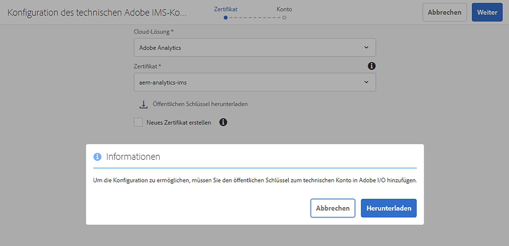
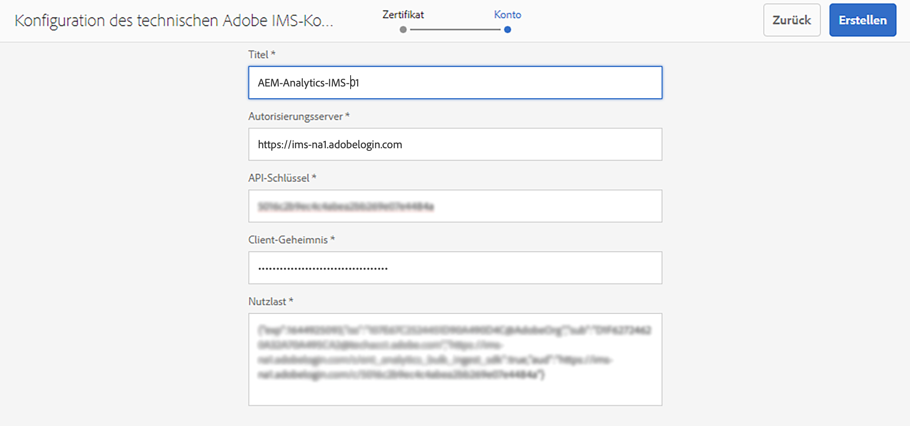

# Integration mit Adobe Analytics mithilfe von IMS {#integration-with-adobe-analytics-using-ims}

Die Integration von AEM mit Adobe Analytics über die Analytics Standard-API erfordert die Konfiguration von Adobe IMS (Identity Management-System) mithilfe der Adobe-Entwicklerkonsole.

>[!NOTE]
>
>Die Unterstützung für die Adobe Analytics Standard API 2.0 ist neu in AEM 6.5.12.0. Diese API-Version unterstützt die IMS-Authentifizierung.
>
>Die Verwendung der Adobe Analytics Classic API 1.4 in AEM wird aus Gründen der Abwärtskompatibilität weiterhin unterstützt. Die [Analytics Classic-API verwendet die Authentifizierung mit Benutzeranmeldeinformationen](/help/sites-administering/adobeanalytics-connect.md).
>
>Die API-Auswahl wird von der Authentifizierungsmethode gesteuert, die für die AEM/Analytics-Integration verwendet wird.
>
>Weitere Informationen finden Sie unter [Migration zu den 2.0-APIs](https://developer.adobe.com/analytics-apis/docs/2.0/guides/migration/).

## Voraussetzungen {#prerequisites}

Bevor Sie mit diesem Verfahren beginnen:

* Der [Adobe-Support](https://helpx.adobe.com/de/contact/enterprise-support.ec.html) muss Ihr Konto für Folgendes bereitstellen:

   * Adobe Console
   * Adobe-Entwicklerkonsole
   * Adobe Analytics und
   * Adobe IMS (Identity Management System)

* Der bzw. die Systemadmin Ihres Unternehmens sollte die Admin Console verwenden, um die erforderlichen Entwicklerinnen und Entwickler in Ihrem Unternehmen den relevanten Produktprofilen hinzuzufügen.

   * Dadurch erhalten diese Entwicklerinnen und Entwickler die Berechtigung, Integrationen in der Adobe-Entwicklerkonsole zu aktivieren.
   * Weitere Informationen finden Sie unter [Verwalten von Entwicklern](https://helpx.adobe.com/de/enterprise/admin-guide.html/enterprise/using/manage-developers.ug.html).

## Konfigurieren einer IMS-Konfiguration – Generieren eines öffentlichen Schlüssels {#configuring-an-ims-configuration-generating-a-public-key}

Der erste Schritt der Konfiguration besteht darin, in AEM eine IMS-Konfiguration zu erstellen und den öffentlichen Schlüssel zu generieren.

1. Öffnen Sie in AEM das Menü **Tools**.
1. Wählen Sie im Abschnitt **Sicherheit** die Option **Adobe IMS-Konfigurationen** aus.
1. Wählen Sie **Erstellen** aus, um **Technische Kontokonfiguration für Adobe IMS** zu öffnen.
1. Wählen Sie über die Dropdown-Liste unter **Cloud-Konfiguration** die Option **Adobe Analytics** aus.
1. Aktivieren Sie **Neues Zertifikat erstellen** und geben Sie einen neuen Alias ein.
1. Bestätigen Sie mit **Zertifikat erstellen**.

   

1. Wählen Sie **Herunterladen** (oder **Öffentlichen Schlüssel herunterladen**) aus, um die Datei auf Ihr lokales Laufwerk herunterzuladen, damit sie einsatzbereit ist, wenn Sie [IMS für die Adobe Analytics-Integration mit AEM konfigurieren](#configuring-ims-for-adobe-analytics-integration-with-aem).

   >[!CAUTION]
   >
   >Lassen Sie diese Konfiguration geöffnet. Sie wird beim [Abschließen der IMS-Konfiguration in AEM](#completing-the-ims-configuration-in-aem) erneut benötigt.

   

## Konfigurieren von IMS für die Adobe Analytics-Integration mit AEM {#configuring-ims-for-adobe-analytics-integration-with-aem}

Mithilfe der Adobe-Entwicklerkonsole müssen Sie ein Projekt (Integration) mit Adobe Analytics erstellen (zur Verwendung durch AEM) und dann die erforderlichen Berechtigungen zuweisen.

### Erstellen des Projekts {#creating-the-project}

Öffnen Sie die Adobe-Entwicklerkonsole, um ein Projekt mit Adobe Analytics zu erstellen, das AEM verwenden wird:

1. Öffnen Sie die Adobe-Entwicklerkonsole für Projekte:

   [https://developer.adobe.com/console/projects](https://developer.adobe.com/console/projects)

1. Alle vorhandenen Projekte werden angezeigt. Wählen Sie **Neues Projekt erstellen** aus. Position und Verwendung hängen von Folgendem ab:

   * Wenn Sie noch kein Projekt haben, wird **Neues Projekt erstellen** unten in der Mitte angezeigt.
      
   * Wenn Sie bereits über vorhandene Projekte verfügen, werden diese aufgelistet und **Neues Projekt erstellen** wird oben rechts angezeigt.
      

1. Wählen Sie **Zum Projekt hinzufügen** und dann **API** aus:

   

1. Wählen Sie **Adobe Analytics** und dann **Weiter** aus:

   >[!NOTE]
   >
   >Wenn Sie Adobe Analytics abonniert haben, es jedoch nicht aufgeführt ist, sollten Sie die [Voraussetzungen](#prerequisites) überprüfen.

   

1. Wählen Sie **Dienstkonto (JWT)** als Authentifizierungstyp aus und setzen Sie den Vorgang mit **Weiter** fort:

   

1. **Laden Sie Ihren öffentlichen Schlüssel hoch** und setzen Sie den Vorgang anschließend mit **Weiter** fort:

   

1. Überprüfen Sie die Anmeldeinformationen und setzen Sie den Vorgang mit **Weiter** fort:

   

1. Wählen Sie die erforderlichen Produktprofile aus und setzen Sie den Vorgang mit **Konfigurierte API speichern** fort:

   

1. Die Konfiguration wird bestätigt.

### Zuweisen von Berechtigungen zur Integration {#assigning-privileges-to-the-integration}

Sie müssen der Integration jetzt die erforderlichen Berechtigungen zuweisen:

1. Öffnen Sie die Adobe **Admin Console**:

   * [https://adminconsole.adobe.com](https://adminconsole.adobe.com/)

1. Navigieren Sie zu **Produkte** (obere Symbolleiste) und wählen Sie **Adobe Analytics - &lt;*Ihre-Mandanten-ID*>** (im linken Bereich) aus.
1. Wählen Sie **Produktprofile** und dann den gewünschten Arbeitsbereich aus der angezeigten Liste aus. Beispielsweise den Standardarbeitsbereich.
1. Wählen Sie **API-Anmeldeinformationen** und dann die erforderliche Integrationskonfiguration aus.
1. Wählen Sie **Editor** als **Produktrolle** aus anstelle von **Beobachter**.

## Für das Integrationsprojekt in der Adobe-Entwicklerkonsole gespeicherte Details {#details-stored-for-the-ims-integration-project}

In der Adobe-Entwicklerkonsole wird eine Liste aller Integrationsprojekte angezeigt:

* [https://developer.adobe.com/console/projects](https://developer.adobe.com/console/projects)

Wählen Sie einen bestimmten Projekteintrag aus, um weitere Details zur Konfiguration anzuzeigen. Dazu gehören:

* Projektübersicht
* Insights
* Berechtigungen
   * Dienstkonto (JWT)
      * Details zu Anmeldedaten
      * JWT generieren
* APIs
   * Beispiel: Adobe Analytics

Einige davon benötigen Sie, um die Integration von Adobe Analytics mit AEM abzuschließen.

## Abschließen der IMS-Konfiguration in AEM {#completing-the-ims-configuration-in-aem}

Zurück in AEM können Sie die IMS-Konfiguration abschließen, indem Sie erforderliche Werte aus dem Integrationsprojekt für Analytics hinzufügen:

1. Kehren Sie zur [in AEM geöffneten IMS-Konfiguration](#configuring-an-ims-configuration-generating-a-public-key) zurück.
1. Wählen Sie **Weiter** aus.

1. Hier können Sie die [für das Integrationsprojekt in der Adobe-Entwicklerkonsole gespeicherten Details](#details-stored-for-the-ims-integration-project) verwenden:

   * **Titel**: Ihr Text.
   * **Autorisierungsserver**: Übernehmen Sie dies per Kopieren und Einfügen aus der `aud`-Zeile im Abschnitt **Payload** unten, z. B. `https://ims-na1.adobelogin.com`.
   * **API-Schlüssel**: Kopieren Sie dies aus dem Abschnitt **Anmeldedaten** in der [Projektübersicht](#details-stored-for-the-ims-integration-project).
   * **Client-Geheimnis**: Generieren Sie dies auf der [Registerkarte „Client-Geheimnis“ im Abschnitt „Dienstkonto (JWT)“](#details-stored-for-the-ims-integration-project) und kopieren Sie es.
   * **Payload**: Kopieren Sie dies von der [Registerkarte „JWT generieren“ im Abschnitt „Dienstkonto (JWT)“](#details-stored-for-the-ims-integration-project).

   

1. Bestätigen Sie mit **Erstellen**.

1. Ihre Adobe Analytics-Konfiguration wird in der AEM-Konsole angezeigt.

   

## Überprüfen der IMS-Konfiguration {#confirming-the-ims-configuration}

So überprüfen Sie, ob die Konfiguration erwartungsgemäß funktioniert:

1. Öffnen Sie:

   * `https://localhost<port>/libs/cq/adobeims-configuration/content/configurations.html`

   Beispiel:

   * `https://localhost:4502/libs/cq/adobeims-configuration/content/configurations.html`

1. Wählen Sie Ihre Konfiguration aus.
1. Wählen **Konsistenzprüfung** auf der Symbolleiste aus, gefolgt von **Überprüfen**.

   

1. Bei erfolgreicher Ausführung wird eine Bestätigungsmeldung angezeigt.

## Konfigurieren des Adobe Analytics Cloud-Dienstes {#configuring-the-adobe-analytics-cloud-service}

Die Konfiguration kann nun referenziert werden, damit ein Cloud Service die Analytics Standard-API verwenden kann:

1. Öffnen Sie das Menü **Tools**. Wählen Sie dann im Abschnitt **Cloud Services** den Eintrag **Ältere Cloud Services** aus.
1. Scrollen Sie nach unten zu **Adobe Analytics** und wählen Sie **Jetzt konfigurieren** aus.

   Das Dialogfeld **Konfiguration erstellen** wird geöffnet.

1. Geben Sie einen **Titel** und, falls gewünscht, einen **Namen** ein. (Wenn Sie das Feld leer lassen, wird der Name aus dem Titel generiert.)

   Sie können auch die gewünschte Vorlage auswählen (wenn mehrere Vorlagen verfügbar sind).

1. Bestätigen Sie mit **Erstellen**.

   Das Dialogfeld **Komponente bearbeiten** wird geöffnet.

1. Geben Sie die Details auf der Registerkarte **Analytics-Einstellungen** ein:

   * **Authentifizierung**: IMS

   * **IMS-Konfiguration**: Name der IMS-Konfiguration

1. Klicken Sie auf **Verbindung zu Analytics herstellen**, um die Verbindung mit Adobe Analytics zu initialisieren.

   Wenn die Verbindungsherstellung erfolgreich war, wird die Meldung **Die Verbindung wurde hergestellt** angezeigt.

1. Wählen Sie in der Meldung **OK** aus.

1. Füllen Sie ggf. weitere Parameter aus und bestätigen Sie die Konfiguration im Dialogfeld mit **OK**.

1. Sie können jetzt [ein Analytics-Framework hinzufügen](/help/sites-administering/adobeanalytics-connect.md), um Parameter zu konfigurieren, die an Adobe Analytics gesendet werden.
