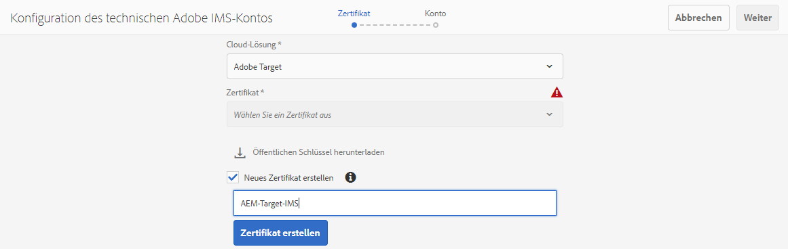
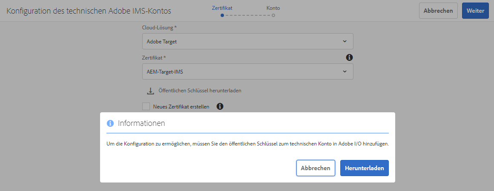
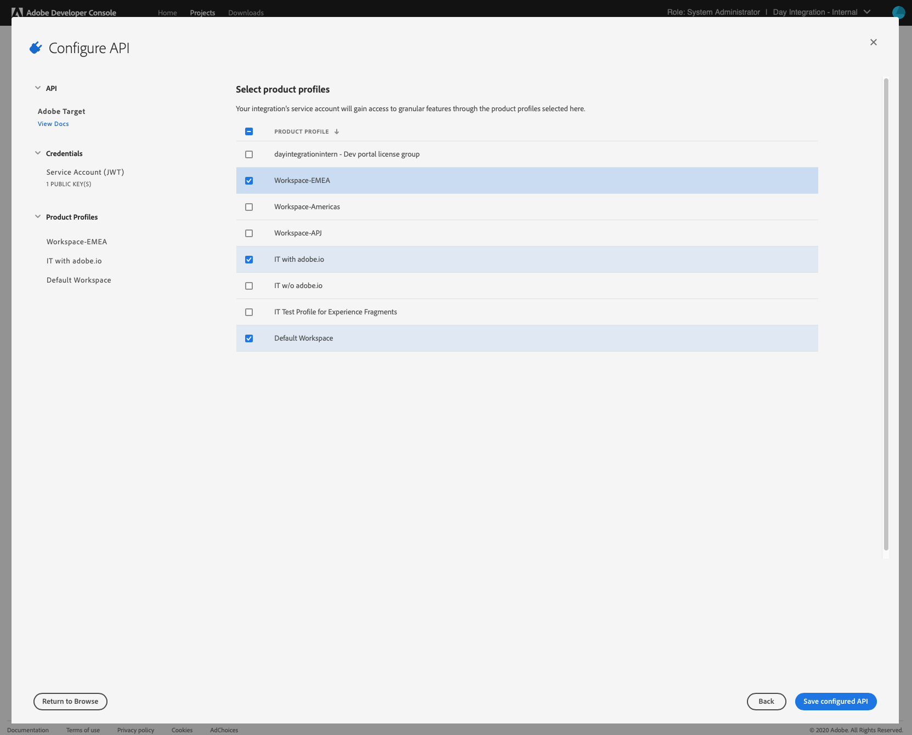
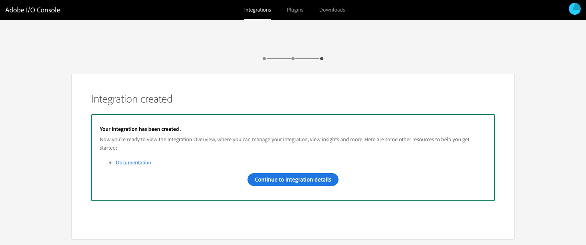
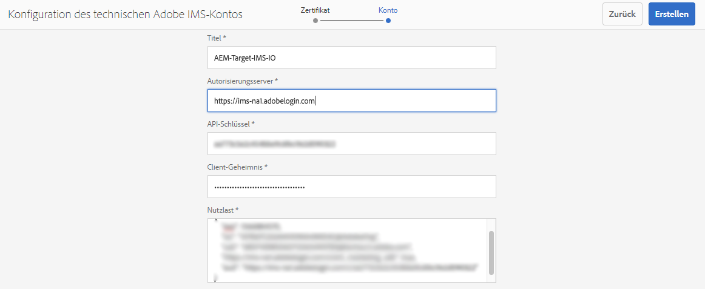
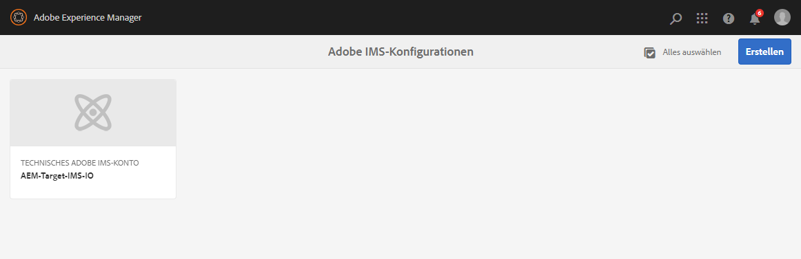
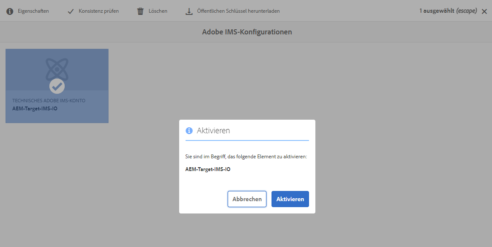
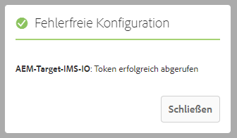

# Integration mit Adobe Target über Adobe I/O{#integration-with-adobe-target-using-adobe-i-o}

Die Integration von AEM mit Adobe Target über die Target Standard-API erfordert die Konfiguration von Adobe IMS (Identity Management-System) und Adobe I/O.

>[!NOTE]
>
>Die Unterstützung für die Adobe Target Standard-API ist in AEM 6.5 neu. Die Target Standard-API verwendet die IMS-Authentifizierung.
>
>Die Verwendung der Adobe Target Classic-API in AEM wird aus Gründen der Abwärtskompatibilität weiterhin unterstützt. Die [Die Target Classic-API verwendet die Authentifizierung von Benutzeranmeldeinformationen](/help/sites-administering/target-configuring.md#manually-integrating-with-adobe-target).
>
>Die API-Auswahl wird von der Authentifizierungsmethode gesteuert, die für die AEM/Target-Integration verwendet wird.
>Siehe auch [Mandanten-ID und Client-Code](#tenant-client) Abschnitt.

## Voraussetzungen {#prerequisites}

Bevor Sie mit diesem Verfahren beginnen:

* [Adobe-Support](https://helpx.adobe.com/de/contact/enterprise-support.ec.html) muss Ihr Konto für Folgendes bereitstellen:

   * Adobe Console
   * Adobe I/O
   * Adobe Target und
   * Adobe IMS (Identity Management System)

* Der Systemadministrator Ihres Unternehmens sollte die Admin Console verwenden, um die erforderlichen Entwickler in Ihrem Unternehmen den relevanten Produktprofilen hinzuzufügen.

   * Dadurch erhalten die spezifischen Entwickler Berechtigungen, Integrationen in Adobe I/O zu aktivieren.
   * Weitere Informationen finden Sie unter [Verwalten von Entwicklern](https://helpx.adobe.com/enterprise/admin-guide.html/enterprise/using/manage-developers.ug.html).

## Konfigurieren einer IMS-Konfiguration - Generieren eines öffentlichen Schlüssels {#configuring-an-ims-configuration-generating-a-public-key}

Der erste Schritt der Konfiguration besteht darin, eine IMS-Konfiguration in AEM zu erstellen und den öffentlichen Schlüssel zu generieren.

1. Öffnen Sie AEM **Instrumente** Menü.
1. Im **Sicherheit** Abschnittsauswahl **Adobe IMS-Konfigurationen**.
1. Auswählen **Erstellen** , um **Technische Kontokonfiguration für Adobe IMS**.
1. Verwenden der Dropdown-Liste unter **Cloud-Konfiguration** auswählen **Adobe Target**.
1. Aktivieren **Neues Zertifikat erstellen** und geben Sie einen neuen Alias ein.
1. Bestätigen mit **Zertifikat erstellen**.

   

1. Auswählen **Download** (oder **Öffentlichen Schlüssel herunterladen**), um die Datei auf Ihr lokales Laufwerk herunterzuladen, damit sie einsatzbereit ist, wenn [Konfigurieren der Adobe I/O für die Adobe Target-Integration mit AEM](#configuring-adobe-i-o-for-adobe-target-integration-with-aem).

   >[!CAUTION]
   >
   >Lassen Sie diese Konfiguration geöffnet. Sie wird bei [Abschließen der IMS-Konfiguration in AEM](#completing-the-ims-configuration-in-aem).

   

## Adobe I/O für Adobe Target-Integration mit AEM konfigurieren {#configuring-adobe-i-o-for-adobe-target-integration-with-aem}

Sie müssen das Adobe I/O Project (Integration) mit Adobe Target erstellen, das AEM verwenden wird, und dann die erforderlichen Berechtigungen zuweisen.

### Erstellen des Projekts {#creating-the-project}

Öffnen Sie die Adobe I/O Console, um ein I/O-Projekt mit Adobe Target zu erstellen, das AEM verwenden wird:

>[!NOTE]
>
>Siehe auch [Adobe I/O-Tutorials](https://www.adobe.io/apis/experienceplatform/home/tutorials/alltutorials.html).

1. Öffnen Sie die Projektekonsole der Adobe I/O:

   [https://console.adobe.io/projects](https://console.adobe.io/projects)

1. Alle Projekte, die Sie haben, werden angezeigt. Auswählen **Neues Projekt erstellen** - Ort und Nutzung hängen von Folgendem ab:

   * Wenn Sie noch kein Projekt haben, **Neues Projekt erstellen** wird zentriert sein, unten.
      
   * Wenn Sie bereits über vorhandene Projekte verfügen, werden diese aufgelistet und **Neues Projekt erstellen** oben rechts.
      

1. Auswählen **Zum Projekt hinzufügen** gefolgt von **API**:

   

1. Auswählen **Adobe Target**, dann **Nächste**:

   >[!NOTE]
   >
   >Wenn Sie Adobe Target abonniert haben, es jedoch nicht aufgeführt sehen, sollten Sie die Option [Voraussetzungen](#prerequisites).

   

1. **Öffentlichen Schlüssel hochladen** und nach Abschluss des Vorgangs mit **Nächste**:

   

1. Überprüfen Sie die Anmeldeinformationen und fahren Sie mit **Nächste**:

   

1. Wählen Sie die erforderlichen Produktprofile aus und fahren Sie mit **Konfigurierte API speichern**:

   >[!NOTE]
   >
   >Welche Produktprofile mit angezeigt werden, hängt davon ab, ob Sie über Folgendes verfügen:
   >
   >* Adobe Target Standard - nur **Standardarbeitsbereich** ist verfügbar
   >* Adobe Target Premium - alle verfügbaren Arbeitsbereiche werden aufgelistet, wie unten dargestellt

   

1. Die Erstellung wird bestätigt.

<!--
1. The creation will be confirmed, you can now **Continue to integration details**; these are needed for [Completing the IMS Configuration in AEM](#completing-the-ims-configuration-in-aem).

   
-->

### Zuweisen von Berechtigungen zur Integration {#assigning-privileges-to-the-integration}

Sie müssen der Integration jetzt die erforderlichen Berechtigungen zuweisen:

1. Adobe öffnen **Admin Console**:

   * [https://adminconsole.adobe.com](https://adminconsole.adobe.com/)

1. Navigieren Sie zu **Produkte** (obere Symbolleiste) und wählen Sie **Adobe Target - &lt;*your-tenant-id*>** (im linken Bereich).
1. Auswählen **Produktprofile**, dann den gewünschten Arbeitsbereich aus der angezeigten Liste. Beispiel: Standardarbeitsbereich.
1. Auswählen **Integrationen**, dann die erforderliche Integrationskonfiguration.
1. Auswählen **Editor** als **Produktrolle**; anstelle von **Beobachter**.

## Für das Adobe I/O Integration Project gespeicherte Details {#details-stored-for-the-adobe-io-integration-project}

In der Adobe I/O-Projektekonsole wird eine Liste aller Integrationsprojekte angezeigt:

* [https://console.adobe.io/projects](https://console.adobe.io/projects)

Auswählen **Ansicht** (rechts neben einem bestimmten Projekteintrag), um weitere Details zur Konfiguration anzuzeigen. Dazu gehören:

* Projektübersicht
* Insights
* Berechtigungen
   * Dienstkonto (JWT)
      * Details zu Berechtigungen
      * JWT generieren
* APIS
   * Beispiel: Adobe Target

Einige davon müssen Sie in AEM die Adobe I/O-Integration für Target abschließen.

## Abschließen der IMS-Konfiguration in AEM {#completing-the-ims-configuration-in-aem}

Kehren Sie zu AEM zurück und Sie können die IMS-Konfiguration abschließen, indem Sie erforderliche Werte aus der Adobe I/O-Integration für Target hinzufügen:

1. Kehren Sie zu [IMS-Konfiguration geöffnet in AEM](#configuring-an-ims-configuration-generating-a-public-key).
1. Wählen Sie **Weiter** aus.

1. Hier können Sie die [Details von Adobe I/O](#details-stored-for-the-adobe-io-integration-project):

   * **Titel**: Ihr Text.
   * **Autorisierungsserver**: Kopieren/Einfügen Sie dies aus dem `"aud"` der **Nutzlast** unten, z. B. `"https://ims-na1.adobelogin.com"` im Beispiel unten
   * **API-Schlüssel**: Kopieren Sie dies aus dem [Übersicht](#details-stored-for-the-adobe-io-integration-project) Abschnitt der Adobe I/O-Integration für Target
   * **Client Secret**: Generieren Sie dies im [Übersicht](#details-stored-for-the-adobe-io-integration-project) Abschnitt der Adobe I/O-Integration für Target erstellen und kopieren
   * **Nutzlast**: Kopieren Sie dies aus dem [JWT generieren](#details-stored-for-the-adobe-io-integration-project) Abschnitt der Adobe I/O-Integration für Target

   

1. Bestätigen Sie mit **Erstellen**.

1. Ihre Adobe Target-Konfiguration wird in der AEM Console angezeigt.

   

## IMS-Konfiguration bestätigen {#confirming-the-ims-configuration}

So überprüfen Sie, ob die Konfiguration erwartungsgemäß funktioniert:

1. Öffnen Sie:

   * `https://localhost<port>/libs/cq/adobeims-configuration/content/configurations.html`

   Beispiel:

   * `https://localhost:4502/libs/cq/adobeims-configuration/content/configurations.html`

1. Wählen Sie Ihre Konfiguration aus.
1. Auswählen **Konsistenzprüfung** aus der Symbolleiste, gefolgt von **Überprüfen**.

   

1. Bei erfolgreicher Ausführung wird die Meldung angezeigt:

   

## Konfigurieren des Adobe Target-Cloud Service {#configuring-the-adobe-target-cloud-service}

Auf die Konfiguration kann nun verwiesen werden, damit ein Cloud Service die Target Standard-API verwenden kann:

1. Öffnen Sie die **Instrumente** Menü. Anschließend innerhalb der **Cloud Services** Bereich, wählen Sie **Ältere Cloud Services**.
1. Scrollen Sie nach unten zu **Adobe Target** und wählen Sie **Jetzt konfigurieren**.

   Die **Konfiguration erstellen** wird geöffnet.

1. Geben Sie einen **Titel** und, falls gewünscht, ein **Name** (Wenn Sie das Feld leer lassen, wird dies aus dem Titel generiert.)

   Sie können auch die gewünschte Vorlage auswählen (wenn mehrere Vorlagen verfügbar sind).

1. Bestätigen Sie mit **Erstellen**.

   Die **Komponente bearbeiten** wird geöffnet.

1. Geben Sie die Details im **Adobe Target-Einstellungen** tab:

   * **Authentifizierung**: IMS
   * **Mandanten-ID**: die Adobe IMS-Mandantenkennung. Siehe auch [Mandanten-ID und Client-Code](#tenant-client) Abschnitt.

      >[!NOTE]
      >
      >Für IMS muss dieser Wert aus Target selbst übernommen werden. Sie können sich bei Target anmelden und die Mandantenkennung aus der URL extrahieren.
      >
      >Wenn die URL beispielsweise:
      >
      >`https://experience.adobe.com/#/@yourtenantid/target/activities`
      >
      >Dann würden Sie `yourtenantid`.
   * **Clientcode**: Siehe [Mandanten-ID und Client-Code](#tenant-client) Abschnitt.
   * **IMS-Konfiguration**: den Namen der IMS-Konfiguration auswählen
   * **API-Typ**: REST
   * **A4T-Analyse-Cloud-Konfiguration**: Wählen Sie die Analyse-Cloud-Konfiguration aus, die für Target-Aktivitätsziele und -metriken verwendet wird. Sie benötigen sie, wenn Sie Adobe Analytics als Quelle für die Berichterstellung für bestimmte Inhalte verwenden. Wenn Ihre Cloud-Konfiguration nicht angezeigt wird, finden Sie weitere Informationen unter [Konfigurieren der A4T-Analytics Cloud-Konfiguration](/help/sites-administering/target-configuring.md#configuring-a-t-analytics-cloud-configuration).
   * **Verwenden des präzisen Targetings**: Standardmäßig ist dieses Kontrollkästchen aktiviert. Bei Aktivierung dieser Option wird für die Cloud Service-Konfiguration gewartet, bis das Laden des Kontexts erfolgt ist, bevor der Inhalt geladen wird. Siehe Hinweis unten.
   * **Segmente aus Adobe Target synchronisieren**: Wählen Sie diese Option aus, um in Target definierte Segmente herunterzuladen und in AEM zu verwenden. Sie müssen diese Option auswählen, wenn die Eigenschaft „API-Typ“ auf „REST“ festgelegt ist, da Inline-Segmente nicht unterstützt werden und Sie immer Segmente aus Target verwenden müssen. (Beachten Sie, dass der AEM-Begriff „Segment“ hier dem Target-Begriff „Zielgruppe“ entspricht.)
   * **Client-Bibliothek**: Wählen Sie aus, ob die AT.js-Client-Bibliothek oder mbox.js (veraltet) verwendet werden soll.
   * **Verwenden des Tag Management Systems zur Bereitstellung der Client-Bibliothek**: Verwenden Sie DTM (nicht mehr unterstützt), Adobe Launch oder ein anderes Tag-Management-System.
   * **Benutzerdefinierte at.js**: Lassen Sie das Feld leer, wenn Sie das Kontrollkästchen Tag-Management aktiviert haben oder die standardmäßige at.js-Datei verwenden möchten. Alternativ hierzu können Sie Ihre benutzerdefinierte Datei „AT.js“ hochladen. Sie wird nur angezeigt, wenn Sie „AT.js“ ausgewählt haben.

   >[!NOTE]
   >
   >[Konfiguration eines Cloud Service zur Verwendung der Target Classic-API](/help/sites-administering/target-configuring.md#manually-integrating-with-adobe-target) ist veraltet (verwendet die Registerkarte Adobe Recommendations-Einstellungen ).
1. Klicken **Verbindung mit Target herstellen** , um die Verbindung mit Adobe Target zu initialisieren.

   Wenn die Verbindung erfolgreich hergestellt wurde, wird die Meldung **Verbindung erfolgreich** angezeigt.

1. Auswählen **OK** auf die Nachricht, gefolgt von **OK** im Dialogfeld, um die Konfiguration zu bestätigen.
1. Sie können jetzt fortfahren [Hinzufügen eines Target-Frameworks](/help/sites-administering/target-configuring.md#adding-a-target-framework) zum Konfigurieren von ContextHub- oder ClientContext-Parametern, die an Target gesendet werden. Beachten Sie, dass dies möglicherweise nicht für den Export AEM Experience Fragments in Target erforderlich ist.

### Mandanten-ID und Client-Code {#tenant-client}

Mit [Adobe Experience Manager 6.5.8.0](/help/release-notes/release-notes.md), wurde das Feld Client-Code zum Target-Konfigurationsfenster hinzugefügt.

Beachten Sie beim Konfigurieren der Felder Mandanten-ID und Client-Code Folgendes:

1. Für die meisten Kunden sind die Mandanten-ID und der Clientcode identisch. Das bedeutet, dass beide Felder die gleichen Werte enthalten. Achten Sie darauf, dass Sie die Mandanten-ID in beide Felder eingeben.
2. Sollten Sie über ältere Werte verfügen, können Sie auch verschiedene Werte in die Felder „Mandanten-ID“ und „Clientcode“ eingeben.

Beachten Sie in beiden Fällen Folgendes:

* Standardmäßig wird der Clientcode (wenn er zuerst eingegeben wird) automatisch in das Feld „Mandanten-ID“ kopiert.
* Sie haben die Möglichkeit, den Standardwert für die Mandanten-ID zu ändern.
* Dementsprechend basieren die Backend-Target-Aufrufe auf der Mandanten-ID und die Client-seitigen Target-Aufrufe auf dem Clientcode.

Wie bereits erwähnt, ist der erste Fall der häufigste Fall für AEM 6.5. Achten Sie in beiden Fällen darauf, **both** -Felder enthalten die richtigen Informationen entsprechend Ihren Anforderungen.

>[!NOTE]
>
> Wenn Sie eine bestehende Target-Konfiguration ändern möchten:
>
> 1. Geben Sie die Mandanten-ID erneut ein.
> 2. Stellen Sie zu Target eine neue Verbindung her.
> 3. Speichern Sie die Konfiguration.

