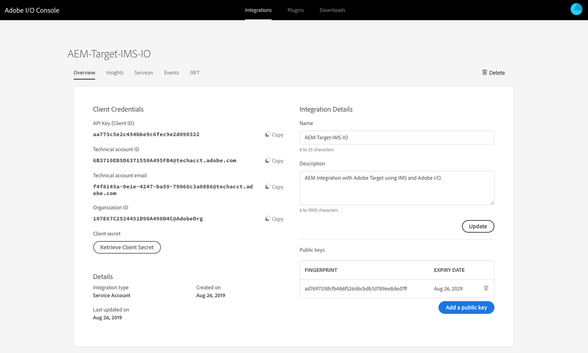

# Integration mit Adobe Target mit Adobe I/O{#integration-with-adobe-target-using-adobe-i-o}

Die Integration von AEM mit Adobe Target über die Target Standard-API erfordert die Konfiguration von Adobe IMS (Identity Management System) und Adobe I/O.

>[!NOTE]
>
>Die Unterstützung für die Adobe Target Standard-API ist neu in AEM 6.5. Die Target Standard-API verwendet die IMS-Authentifizierung.
>
>Die Verwendung der Adobe Target Classic-API in AEM wird aus Gründen der Abwärtskompatibilität weiterhin unterstützt. Die [Target Classic-API verwendet die Authentifizierung](/help/sites-administering/target-configuring.md#manually-integrating-with-adobe-target)mit Benutzeranmeldeinformationen.
>
>Die API-Auswahl wird von der für die AEM/Target-Integration verwendeten Authentifizierungsmethode gesteuert.

## Voraussetzungen {#prerequisites}

Bevor Sie dieses Verfahren starten, muss [Adobe Support](https://helpx.adobe.com/contact/enterprise-support.ec.html) Ihr Konto für Folgendes bereitstellen:

* Adobe Console
* Adobe I/O
* Adobe Target und
* Adobe IMS (Identity Management System)

## Konfigurieren einer IMS-Konfiguration - Generieren eines öffentlichen Schlüssels {#configuring-an-ims-configuration-generating-a-public-key}

Der erste Schritt der Konfiguration besteht darin, eine IMS-Konfiguration in AEM zu erstellen und den öffentlichen Schlüssel zu generieren.

1. Öffnen Sie in AEM das Menü **Tools** .
1. Wählen Sie im Abschnitt **Sicherheit** die Option **Adobe IMS-Konfigurationen**.
1. Wählen Sie **Erstellen** , um die **Adobe IMS-Konfiguration** für das technische Konto zu öffnen.
1. Wählen Sie mithilfe der Dropdownliste unter **Cloud-Konfiguration****Adobe Target**.
1. Aktivieren Sie **Neues Zertifikat** erstellen und geben Sie einen neuen Alias ein.
1. Bestätigen Sie mit **Zertifikat** erstellen.

   

1. Wählen Sie &quot; **Herunterladen** &quot;(oder &quot;Öffentlichen **Schlüssel** herunterladen&quot;), um die Datei auf Ihr lokales Laufwerk herunterzuladen, damit sie bei der [Konfiguration der Adobe-E/A für die Adobe Target-Integration mit AEM](#configuring-adobe-i-o-for-adobe-target-integration-with-aem)verwendet werden kann.

   >[!CAUTION]
   >
   >Lassen Sie diese Konfiguration geöffnet, wird sie beim [Abschluss der IMS-Konfiguration in AEM](#completing-the-ims-configuration-in-aem)erneut benötigt.

   

## Konfigurieren der Adobe-E/A-Integration für Adobe Target mit AEM {#configuring-adobe-i-o-for-adobe-target-integration-with-aem}

Sie müssen die Adobe-E/A-Integration mit Adobe Target erstellen, die AEM verwenden wird, und dann die erforderlichen Berechtigungen zuweisen.

### Integration erstellen {#creating-the-integration}

Öffnen Sie die Adobe I/O-Konsole, um eine E/A-Integration mit Adobe Target zu erstellen, die AEM verwenden wird:

>[!NOTE]
>
>Siehe auch die [Adobe-E/A-Lehrgänge](https://www.adobe.io/apis/experienceplatform/home/tutorials/alltutorials.html).

1. Öffnen Sie die Adobe I/O-Konsole für Integrationen:

   * [https://console.adobe.io/integrations](https://console.adobe.io/integrations)

1. Wählen Sie **Neue Integration**:

   >[!NOTE]
   >
   >Wenn Sie bereits über vorhandene Integrationen verfügen, werden diese aufgelistet und die Schaltfläche **Neue Integration** wird oben rechts angezeigt.

   

1. Wählen Sie **Zugriff auf eine API** und anschließend **Fortfahren**:

   

1. Wählen Sie **Adobe Target** und dann **Weiter**:

   

1. Fügen Sie die erforderlichen Details für die Integrationskonfiguration hinzu:

   * **Name**

      Geben Sie den Namen ein.

   * **Beschreibung**

      Eine Beschreibung ist optional.

   * **Zertifikat mit öffentlichem Schlüssel**

      Laden Sie die Datei mit dem öffentlichen Schlüssel hoch. wie unter [Konfigurieren einer IMS-Konfiguration - Generieren eines öffentlichen Schlüssels](#configuring-an-ims-configuration-generating-a-public-key)generiert.

      Nach dem Laden wird das Zertifikat unter **Zertifikate** aufgeführt.

   * **Produktprofile**

      Produktprofile entsprechen den Arbeitsbereichen in Target, die AEM für den Inhaltsexport und die Angebotserstellung verwenden kann. Standardmäßig ist der Target-Standardarbeitsbereich ausgewählt. Wählen Sie alle anderen Profile/Arbeitsbereiche aus, die in AEM als Exportziele verfügbar gemacht werden sollen.
   Beispiel:

   

1. Bestätigen Sie mit **Integration** erstellen.
1. Die Erstellung wird bestätigt. Sie können jetzt **mit den Integrationsdetails** fortfahren. diese werden zum [Abschließen der IMS-Konfiguration in AEM](#completing-the-ims-configuration-in-aem)benötigt.

   

### Berechtigungen der Integration zuweisen {#assigning-privileges-to-the-integration}

Sie müssen der Integration jetzt die erforderlichen Berechtigungen zuweisen:

1. Öffnen Sie die Adobe **Admin-Konsole**:

   * [https://adminconsole.adobe.com](https://adminconsole.adobe.com/)

1. Navigieren Sie zu **Produkte** (obere Symbolleiste) und wählen Sie **Adobe Target - &lt;*Ihre Mandanten-ID*>** (aus dem linken Bereich).
1. Wählen Sie **Produktprofile** und dann den gewünschten Arbeitsbereich aus der angezeigten Liste. Beispiel: Standardarbeitsbereich.
1. Wählen Sie **Integrationen** und dann die erforderliche Integrationskonfiguration.
1. Wählen Sie **Editor** als **Produktrolle** aus; anstatt **Beobachter**.

## Für die Adobe I/O-Integration gespeicherte Details {#details-stored-for-the-adobe-i-o-integration}

In der Adobe I/O Integrations-Konsole können Sie eine Liste aller Integrationen anzeigen:

* [https://console.adobe.io/integrations](https://console.adobe.io/integrations)

Wählen Sie **Ansicht** (rechts neben einem bestimmten Integrationseintrag), um weitere Details zur Konfiguration anzuzeigen. Dazu gehören:

* Überblick
* Einblicke
* Dienste
* Ereignisse
* JWT (JSON Web Token)

Einige davon müssen Sie die Adobe-E/A-Integration für Target in AEM abschließen.

1. **Überblick**:

   

1. **JWT**:

   

## Abschluss der IMS-Konfiguration in AEM {#completing-the-ims-configuration-in-aem}

Bei Rückkehr zu AEM können Sie die IMS-Konfiguration abschließen, indem Sie erforderliche Werte aus der Adobe I/O-Integration für Target hinzufügen:

1. Kehren Sie zur [IMS-Konfiguration zurück, die in AEM](#configuring-an-ims-configuration-generating-a-public-key)geöffnet ist.
1. Wählen Sie **Weiter**.

1. Hier können Sie die [Details von Adobe I/O](#details-stored-for-the-adobe-i-o-integration)verwenden:

   * **Titel**: Ihr Text.
   * **Autorisierungsserver**: Kopieren/fügen Sie dies aus der `"aud"` Zeile im Abschnitt **Nutzlast** unten ein, z.B. `"https://ims-na1.adobelogin.com"` im Beispiel unten
   * **API-Schlüssel**: Kopieren Sie dies aus dem Abschnitt [Übersicht](#details-stored-for-the-adobe-i-o-integration) der Adobe-E/O-Integration für Target
   * **geheim**: Erstellen Sie dies im Abschnitt [Übersicht](#details-stored-for-the-adobe-i-o-integration) der Adobe-E/A-Integration für Target und kopieren Sie
   * **Nutzlast**: Kopieren Sie dies aus dem [JWT](#details-stored-for-the-adobe-i-o-integration) -Abschnitt der Adobe I/O-Integration für Target
   

1. Bestätigen Sie mit **Erstellen**.

1. Ihre Adobe Target-Konfiguration wird in der AEM-Konsole angezeigt.

   

## IMS-Konfiguration bestätigen {#confirming-the-ims-configuration}

So bestätigen Sie, dass die Konfiguration erwartungsgemäß funktioniert:

1. Öffnen Sie:

   * `https://localhost<port>/libs/cq/adobeims-configuration/content/configurations.html`
   Beispiel:

   * `https://localhost:4502/libs/cq/adobeims-configuration/content/configurations.html`

1. Wählen Sie Ihre Konfiguration aus.
1. Wählen Sie in der Symbolleiste die Option **Gesundheit** prüfen, gefolgt von **Prüfung**.

   

1. Bei erfolgreichem Abschluss wird folgende Meldung angezeigt:

   

## Adobe Target Cloud-Dienst konfigurieren {#configuring-the-adobe-target-cloud-service}

Auf die Konfiguration kann nun verwiesen werden, damit ein Cloud-Dienst die Target Standard-API verwenden kann:

1. Open the **Tools** menu. Wählen Sie dann im Abschnitt **Cloud-Dienste** die Option **Legacy-Cloud-Dienste**.
1. Blättern Sie nach unten zu **Adobe Target** und wählen Sie Jetzt **konfigurieren**.

   The **Create Configuration** dialog will open.

1. Geben Sie einen **Titel** und, falls gewünscht, einen **Namen** ein (leer gelassen, wird dieser aus dem Titel generiert).

   Sie können auch die gewünschte Vorlage auswählen (wenn mehrere Vorlagen verfügbar sind).

1. Bestätigen Sie mit **Erstellen**.

   Das Dialogfeld Komponente **bearbeiten** wird geöffnet.

1. Geben Sie die Details in die Registerkarte **Adobe Target-Einstellungen** ein:

   * **Client-Code**: Adobe IMS Tenant ID

      >[!CAUTION]
      >
      >Die Adobe IMS Tenant ID muss in das Feld Client Code eingegeben werden.

   * **Authentifizierung**: IMS
   * **IMS-Konfiguration**: den Namen der IMS-Konfiguration auswählen
   * **API-Typ**: REST
   * **A4T-Analyse-Cloud-Konfiguration**: Wählen Sie die Analyse-Cloud-Konfiguration aus, die für Target-Aktivitätsziele und -metriken verwendet wird. Sie benötigen sie, wenn Sie Adobe Analytics als Quelle für die Berichterstellung für bestimmte Inhalte verwenden. If you do not see your cloud configuration, see note in [Configuring A4T Analytics Cloud Configuration](/help/sites-administering/target-configuring.md#configuring-a-t-analytics-cloud-configuration).
   * **Verwenden Sie genaues Targeting**: Standardmäßig ist dieses Kontrollkästchen aktiviert. Bei Aktivierung dieser Option wird für die Cloud Service-Konfiguration gewartet, bis das Laden des Kontexts erfolgt ist, bevor der Inhalt geladen wird. Siehe Hinweis unten.
   * **Segmente aus Adobe Target** synchronisieren: Wählen Sie diese Option, um Segmente herunterzuladen, die in Target definiert sind, um sie in AEM zu verwenden. Sie müssen diese Option auswählen, wenn die Eigenschaft „API-Typ“ auf „REST“ festgelegt ist, da Inline-Segmente nicht unterstützt werden und Sie immer Segmente aus Target verwenden müssen. (Beachten Sie, dass der AEM-Begriff „Segment“ hier dem Target-Begriff „Zielgruppe“ entspricht.)
   * **Client-Bibliothek**: Wählen Sie aus, ob die AT.js-Client-Bibliothek oder mbox.js (nicht mehr unterstützt) verwendet werden soll.
   * **Verwenden Sie das Tag-Management-System zur Bereitstellung der Client-Bibliothek**: Verwenden Sie DTM (nicht mehr unterstützt), Adobe Launch oder ein anderes Tag-Management-System.
   * **Benutzerspezifische AT.js**: Lassen Sie das Feld Tag-Management leer, wenn Sie das Feld Tag-Management markiert haben oder die standardmäßige Version von AT.js verwenden. Alternativ hierzu können Sie Ihre benutzerdefinierte Datei „AT.js“ hochladen. Sie wird nur angezeigt, wenn Sie „AT.js“ ausgewählt haben.
   >[!NOTE]
   >
   >[Die Konfiguration eines Cloud-Dienstes zur Verwendung der Target Classic-API](/help/sites-administering/target-configuring.md#manually-integrating-with-adobe-target) wurde eingestellt (verwendet die Registerkarte Adobe Recommendations-Einstellungen).

   Beispiel:

   

1. Click **Connect to Target** to initialize the connection with Adobe Target.

   If the connection is successful, the message **Connection successful** is displayed.

1. Wählen Sie in der Nachricht **OK** und anschließend im Dialogfeld **OK** , um die Konfiguration zu bestätigen.
1. Sie können jetzt mit dem [Hinzufügen eines Target-Frameworks](/help/sites-administering/target-configuring.md#adding-a-target-framework) fortfahren, um ContextHub- oder ClientContext-Parameter zu konfigurieren, die an Target gesendet werden. Beachten Sie, dass dies möglicherweise nicht erforderlich ist, um AEM Experience Fragments in Target zu exportieren.

