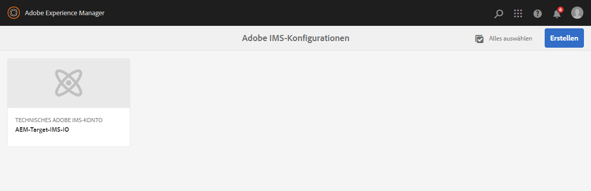

# Integration mit Adobe Target mithilfe von IMS{#integration-with-adobe-target-using-ims}

Die Integration von AEM mit Adobe Target über die Target Standard-API erfordert die Konfiguration von Adobe IMS (Identity Management-System) mithilfe der Adobe Developer-Konsole.

>[!NOTE]
>
>Die Unterstützung für die Adobe Target Standard-API ist in AEM 6.5 neu. Die Target Standard-API verwendet die IMS-Authentifizierung.
>
>Die Verwendung der Adobe Target Classic-API in AEM wird aus Gründen der Abwärtskompatibilität weiterhin unterstützt. Die [Target Classic-API verwendet die Authentifizierung mit Benutzeranmeldeinformationen](/help/sites-administering/target-configuring.md#manually-integrating-with-adobe-target).
>
>Die API-Auswahl wird von der Authentifizierungsmethode gesteuert, die für die AEM/Target-Integration verwendet wird.
>Siehe auch den Abschnitt [Mandanten-ID und Client-Code](#tenant-client).

## Voraussetzungen {#prerequisites}

Bevor Sie mit diesem Verfahren beginnen:

* Der [Adobe-Support](https://experienceleague.adobe.com/?lang=de&amp;support-solution=General&amp;support-tab=home#support) muss Ihr Konto für Folgendes bereitstellen:

   * Adobe Console
   * Adobe-Entwicklerkonsole
   * Adobe Target und
   * Adobe IMS (Identity Management System)

* Der Systemadministrator Ihres Unternehmens sollte die Admin Console verwenden, um die erforderlichen Entwickler in Ihrem Unternehmen den relevanten Produktprofilen hinzuzufügen.

   * Dadurch erhalten diese Entwicklerinnen und Entwickler die Berechtigung, Integrationen in der Adobe-Entwicklerkonsole zu aktivieren.
   * Siehe [Verwalten von Entwicklern](https://helpx.adobe.com/de/enterprise/using/manage-developers.html).

## Konfigurieren einer IMS-Konfiguration – Generieren eines öffentlichen Schlüssels {#configuring-an-ims-configuration-generating-a-public-key}

Der erste Schritt der Konfiguration besteht darin, in AEM eine IMS-Konfiguration zu erstellen und den öffentlichen Schlüssel zu generieren.

1. Öffnen Sie in AEM das Menü **Tools**.
1. Im **Sicherheit** Bereich, wählen Sie **Adobe IMS-Konfigurationen**.
1. Wählen Sie **Erstellen** aus, um **Technische Kontokonfiguration für Adobe IMS** zu öffnen.
1. Dropdown-Liste unter **Cloud-Konfiguration** auswählen **Adobe Target**.
1. Aktivieren Sie **Neues Zertifikat erstellen** und geben Sie einen neuen Alias ein.
1. Bestätigen Sie mit **Zertifikat erstellen**.

   

1. Wählen Sie **Herunterladen** (oder **Öffentlichen Schlüssel herunterladen**) aus, um die Datei auf Ihr lokales Laufwerk herunterzuladen, damit sie einsatzbereit ist, wenn Sie [IMS für die Adobe Target-Integration mit AEM konfigurieren](#configuring-ims-for-adobe-target-integration-with-aem).

   >[!CAUTION]
   >
   >Lassen Sie diese Konfiguration geöffnet. Sie wird erneut benötigt, wenn [Abschließen der IMS-Konfiguration in AEM](#completing-the-ims-configuration-in-aem).

   

## Konfigurieren von IMS für die Adobe Target-Integration mit AEM {#configuring-ims-for-adobe-target-integration-with-aem}

Erstellen Sie mithilfe der Adobe Developer-Konsole ein Projekt (Integration) mit Adobe Target, das AEM verwenden können, und weisen Sie dann die erforderlichen Berechtigungen zu.

### Erstellen des Projekts {#creating-the-project}

Um ein Projekt mit Adobe Target zu erstellen, das AEM verwenden können, öffnen Sie die Adobe Developer-Konsole:

>[!CAUTION]
>
>Derzeit unterstützt Adobe nur das **Dienstkonto (JWT)** Berechtigungstyp.
>
>Verwenden Sie nicht das **OAuth Server-zu-Server** Berechtigungstyp, der in Zukunft unterstützt wird.

1. Öffnen Sie die Adobe-Entwicklerkonsole für Projekte:

   [https://developer.adobe.com/console/projects](https://developer.adobe.com/console/projects)

1. Alle Projekte, die Sie haben, werden angezeigt. Auswählen **Neues Projekt erstellen** - Ort und Nutzung hängen von Folgendem ab:

   * Wenn Sie noch kein Projekt haben, **Neues Projekt erstellen** ist zentriert, unten.
     
   * Wenn Sie bereits über vorhandene Projekte verfügen, werden diese aufgelistet und **Neues Projekt erstellen** oben rechts.
     

1. Wählen Sie **Zum Projekt hinzufügen** und dann **API** aus:

   

1. Wählen Sie **Adobe Target** aus und klicken Sie dann auf **Weiter**:

   >[!NOTE]
   >
   >Wenn Sie Adobe Target abonniert haben, es jedoch nicht aufgeführt sehen, sollten Sie die [Voraussetzungen](#prerequisites) überprüfen.

   

1. **Laden Sie Ihren öffentlichen Schlüssel hoch** und setzen Sie den Vorgang anschließend mit **Weiter** fort:

   

1. Überprüfen Sie die Anmeldeinformationen und setzen Sie den Vorgang mit **Weiter** fort:

   

1. Wählen Sie die erforderlichen Produktprofile aus und setzen Sie den Vorgang mit **Konfigurierte API speichern** fort:

   >[!NOTE]
   >
   >Welche Produktprofile angezeigt werden, hängt von folgenden Voraussetzungen ab:
   >
   >* Adobe Target Standard – nur **Standardarbeitsbereich** ist verfügbar
   >* Adobe Target Premium – alle verfügbaren Arbeitsbereiche werden aufgelistet, wie unten dargestellt

   

1. Die Erstellung wird bestätigt.

<!--
1. The creation is confirmed, you can now **Continue to integration details**; these are needed for [Completing the IMS Configuration in AEM](#completing-the-ims-configuration-in-aem).

   
-->

### Zuweisen von Berechtigungen zur Integration {#assigning-privileges-to-the-integration}

Weisen Sie der Integration jetzt die erforderlichen Berechtigungen zu:

1. Öffnen Sie die Adobe **Admin Console**:

   * [https://adminconsole.adobe.com](https://adminconsole.adobe.com/)

1. Navigieren Sie zu **Produkte** (obere Symbolleiste) und wählen Sie **Adobe Target - &lt;*Ihre-Mandanten-ID*>** (im linken Bereich) aus.
1. Wählen Sie **Produktprofile** und dann den gewünschten Arbeitsbereich aus der angezeigten Liste aus. Beispielsweise den Standardarbeitsbereich.
1. Wählen Sie **API-Anmeldeinformationen** und dann die erforderliche Integrationskonfiguration aus.
1. Wählen Sie **Editor** als **Produktrolle** aus anstelle von **Beobachter**.

## Für das Integrationsprojekt in der Adobe-Entwicklerkonsole gespeicherte Details {#details-stored-for-the-ims-integration-project}

In der Adobe-Entwicklerkonsole wird eine Liste aller Integrationsprojekte angezeigt:

* [https://developer.adobe.com/console/projects](https://developer.adobe.com/console/projects)

Um weitere Details zur Konfiguration anzuzeigen, wählen Sie **Ansicht** (rechts neben einem bestimmten Projekteintrag). Dazu gehören:

* Projektübersicht
* Insights
* Berechtigungen
   * Dienstkonto (JWT)
      * Details zu Anmeldedaten
      * JWT generieren
* APIs
   * Beispiel: Adobe Target

Einige davon müssen Sie die Integration von Adobe Target in AEM auf der Basis von IMS abschließen.

## Abschließen der IMS-Konfiguration in AEM {#completing-the-ims-configuration-in-aem}

Um zur AEM zurückzukehren, können Sie die IMS-Konfiguration abschließen, indem Sie die erforderlichen Werte aus der Adobe Developer Console-Integration für Target hinzufügen:

1. Kehren Sie zur [in AEM geöffneten IMS-Konfiguration](#configuring-an-ims-configuration-generating-a-public-key) zurück.
1. Wählen Sie **Weiter** aus.

1. Hier können Sie die [Details aus der Projektkonfiguration in der Adobe-Entwicklerkonsole](#details-stored-for-the-ims-integration-project) verwenden:

   * **Titel**: Ihr Text.
   * **Autorisierungs-Server**: Übernehmen Sie diese Angabe per Kopieren und Einfügen aus der `aud`-Zeile im Abschnitt **Payload** unten, z. B. `https://ims-na1.adobelogin.com` im nachstehenden Beispiel.
   * **API-Schlüssel**: Kopieren Sie dies aus dem Abschnitt [Übersicht](#details-stored-for-the-ims-integration-project).
   * **Client-Geheimnis**: Generieren Sie dies im Abschnitt [Übersicht](#details-stored-for-the-ims-integration-project) und kopieren Sie es.
   * **Payload**: Kopieren Sie diese aus dem Abschnitt [JWT generieren](#details-stored-for-the-ims-integration-project)

   

1. Bestätigen Sie mit **Erstellen**.

1. Ihre Adobe Target-Konfiguration wird in der AEM Console angezeigt.

   

## Überprüfen der IMS-Konfiguration {#confirming-the-ims-configuration}

So überprüfen Sie, ob die Konfiguration erwartungsgemäß funktioniert:

1. Öffnen Sie:

   * `https://localhost<port>/libs/cq/adobeims-configuration/content/configurations.html`

   Beispiel:

   * `https://localhost:4502/libs/cq/adobeims-configuration/content/configurations.html`

1. Wählen Sie Ihre Konfiguration aus.
1. Wählen **Konsistenzprüfung** auf der Symbolleiste aus, gefolgt von **Überprüfen**.

   

1. Bei erfolgreicher Ausführung wird die Meldung angezeigt:

   

## Konfigurieren des Adobe Target Cloud-Dienstes {#configuring-the-adobe-target-cloud-service}

Die Konfiguration kann nun referenziert werden, damit ein Cloud Service die Target Standard-API verwenden kann:

1. Öffnen Sie das Menü **Tools**. Wählen Sie dann im Abschnitt **Cloud Services** den Eintrag **Ältere Cloud Services** aus.
1. Scrollen Sie nach unten zu **Adobe Target** und wählen Sie **Jetzt konfigurieren** aus.

   Die **Konfiguration erstellen** wird geöffnet.

1. Geben Sie einen **Titel** und, falls gewünscht, ein **Name** (Wenn das Feld leer gelassen wird, wird es aus dem Titel generiert.)

   Sie können auch die gewünschte Vorlage auswählen (wenn mehrere Vorlagen verfügbar sind).

1. Bestätigen Sie mit **Erstellen**.

   Die **Komponente bearbeiten** wird geöffnet.

1. Geben Sie die Details auf der Registerkarte **Adobe Target-Einstellungen** ein:

   * **Authentifizierung**: IMS

   * **Mandanten-ID**: die Adobe IMS-Mandanten-ID. Siehe auch den Abschnitt [Mandanten-ID und Client-Code](#tenant-client).

     >[!NOTE]
     >
     >Für IMS muss dieser Wert aus Target selbst übernommen werden. Sie können sich bei Target anmelden und die Mandanten-ID aus der URL extrahieren.
     >
     >Wenn die URL beispielsweise wie folgt aussieht:
     >
     >`https://experience.adobe.com/#/@yourtenantid/target/activities`
     >
     >Dann ist `yourtenantid` die Mandanten-ID.

   * **Client-Code**: siehe den Abschnitt [Mandanten-ID und Client-Code](#tenant-client).

   * **IMS-Konfiguration**: Name der IMS-Konfiguration

   * **API-Typ:** REST

   * **A4T-Analytics-Cloud-Konfiguration**: Wählen Sie die Analytics Cloud-Konfiguration aus, die für Target-Aktivitätsziele und -metriken verwendet wird. Sie benötigen sie, wenn Sie Adobe Analytics als Quelle für das Reporting für bestimmte Inhalte verwenden. Wenn Ihre Cloud-Konfiguration nicht angezeigt wird, lesen Sie den Hinweis unter [Konfigurieren der A4T-Analytics Cloud-Konfiguration](/help/sites-administering/target-configuring.md#configuring-a-t-analytics-cloud-configuration).

   * **Präzises Targeting verwenden**: Dieses Kontrollkästchen ist standardmäßig aktiviert. Wenn diese Option aktiviert ist, wartet die Cloud-Service-Konfiguration auf das Laden des Kontexts, bevor der Inhalt geladen wird. Siehe folgenden Hinweis.

   * **Segmente aus Adobe Target synchronisieren**: Wählen Sie diese Option aus, damit Sie in Target definierte Segmente herunterladen und in AEM verwenden können. Wählen Sie diese Option aus, wenn die Eigenschaft &quot;API-Typ&quot;REST ist, da Inline-Segmente nicht unterstützt werden und Sie immer Segmente aus Target verwenden müssen. (Der AEM-Begriff „Segment“ ist gleichbedeutend mit dem Target-Begriff „Zielgruppe“.)

   * **Client-Bibliothek**: Wählen Sie aus, ob die AT.js-Client-Bibliothek oder mbox.js (veraltet) verwendet werden soll.

   * **Tag Management System zum Bereitstellen der Client-Bibliothek verwenden**: Verwenden Sie DTM (nicht mehr unterstützt), Adobe Launch oder ein anderes Tag-Management-System.

   * **Benutzerdefinierte AT.js**: Lassen Sie dieses Feld leer, wenn Sie das Feld „Tag Management“ aktiviert haben oder die standardmäßige Datei „AT.js“ verwenden möchten. Alternativ hierzu können Sie Ihre benutzerdefinierte Datei „AT.js“ hochladen. Es wird nur angezeigt, wenn Sie „AT.js“ ausgewählt haben.

   >[!NOTE]
   >
   >[Konfiguration eines Cloud-Service zur Verwendung der Target Classic-API](/help/sites-administering/target-configuring.md#manually-integrating-with-adobe-target) ist veraltet (verwendet die Registerkarte Adobe Recommendations-Einstellungen ).

1. Klicken Sie auf **Mit Target verbinden**, um die Verbindung mit Adobe Target zu initialisieren.

   Wenn die Verbindungsherstellung erfolgreich war, wird die Meldung **Die Verbindung wurde hergestellt** angezeigt.

1. Auswählen **OK** auf die Nachricht, gefolgt von **OK** im Dialogfeld, damit Sie die Konfiguration bestätigen können.

1. Sie können jetzt fortfahren [Hinzufügen eines Target-Frameworks](/help/sites-administering/target-configuring.md#adding-a-target-framework) zum Konfigurieren von ContextHub- oder ClientContext-Parametern, die an Target gesendet werden. Beachten Sie, dass dies möglicherweise nicht für den Export von AEM Experience Fragments nach Target erforderlich ist.

### Mandanten-ID und Client-Code {#tenant-client}

Mit [Adobe Experience Manager 6.5.8.0](/help/release-notes/release-notes.md) wurde das Feld „Client-Code“ zum Target-Konfigurationsfenster hinzugefügt.

Beachten Sie beim Konfigurieren der Felder Mandanten-ID und Client-Code Folgendes:

1. Für die meisten Kunden sind die Mandanten-ID und der Clientcode identisch. Das bedeutet, dass beide Felder die gleichen Werte enthalten. Achten Sie darauf, dass Sie die Mandanten-ID in beide Felder eingeben.
2. Sollten Sie über ältere Werte verfügen, können Sie auch verschiedene Werte in die Felder „Mandanten-ID“ und „Clientcode“ eingeben.

Beachten Sie in beiden Fällen Folgendes:

* Standardmäßig wird der Clientcode (wenn er zuerst eingegeben wird) automatisch in das Feld „Mandanten-ID“ kopiert.
* Sie können optional den standardmäßigen Mandanten-ID-Satz ändern.
* Daher basieren die Backend-Aufrufe an Target auf der Mandanten-ID und die clientseitigen Aufrufe an Target auf dem Client-Code.

Wie bereits erwähnt, ist der erste Fall der häufigste AEM 6.5. Stellen Sie in beiden Fällen sicher, dass **both** -Felder enthalten die richtigen Informationen entsprechend Ihren Anforderungen.

>[!NOTE]
>
>Wenn Sie eine bestehende Target-Konfiguration ändern möchten:
>
>1. Geben Sie die Mandanten-ID erneut ein.
>2. Stellen Sie zu Target eine neue Verbindung her.
>3. Speichern Sie die Konfiguration.
