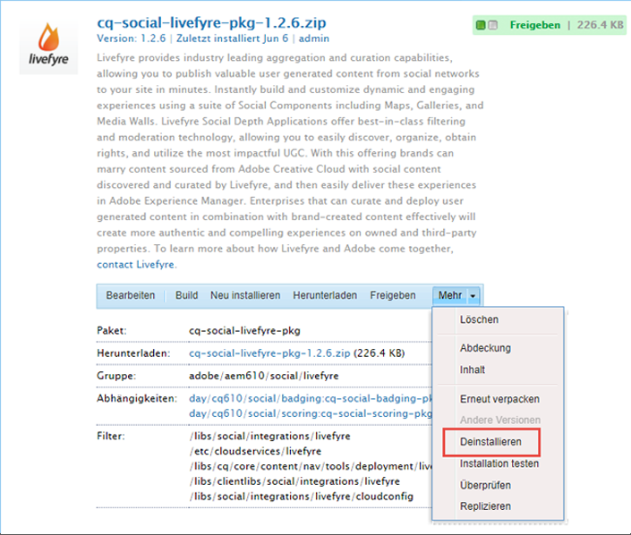
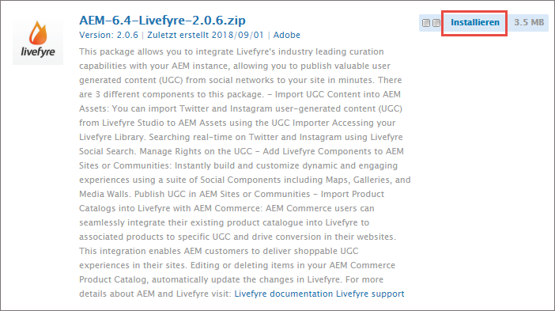
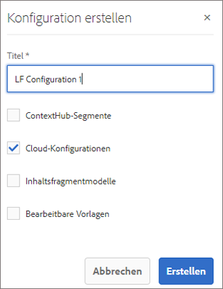
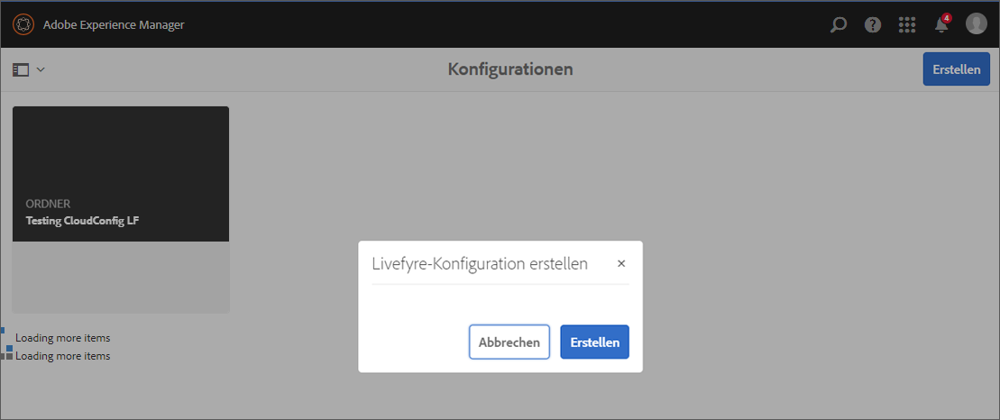
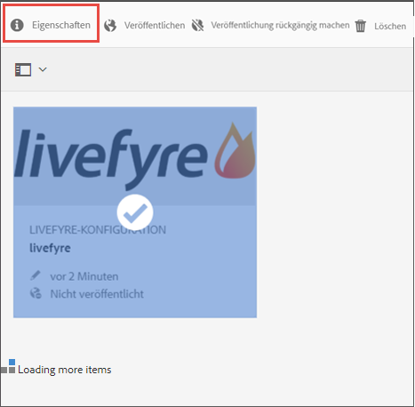
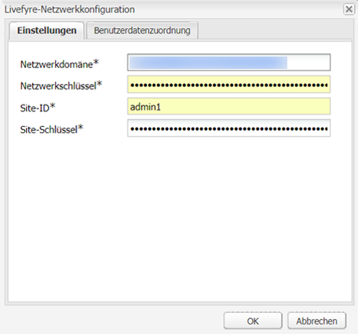
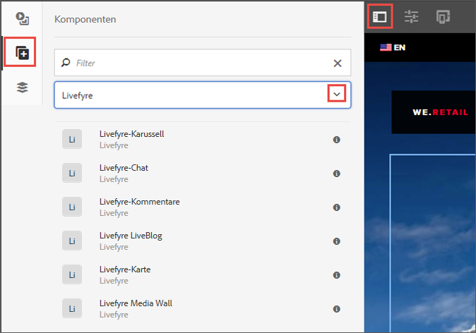
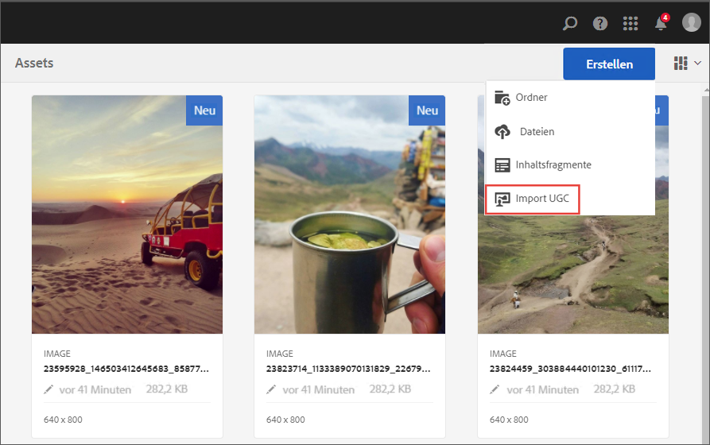
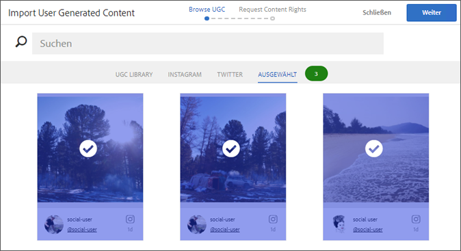

# Integrieren mit Livefyre{#integrating-with-livefyre}

Erfahren Sie, wie Sie die branchenführenden Kuratierungsfunktionen von Livefyre in Ihre AEM 6.5-Instanz integrieren und so wertvollen benutzergenerierten Inhalt aus sozialen Netzwerken innerhalb von Minuten auf Ihrer Site veröffentlichen können.

## Erste Schritte {#getting-started}

### Installieren des Livefyre-Pakets für AEM {#install-livefyre-package-for-aem}

In AEM 6.5 ist das Livefyre-Feature Pack 1.2.6 vorinstalliert. Dieses Paket beinhaltet nur die eingeschränkte Livefyre-Integration in AEM Sites und muss vor der Installation eines aktualisierten Pakets deinstalliert werden. Das neueste Paket ermöglicht eine vollständige Integration von Livefyre in AEM, einschließlich Sites, Assets und Commerce.

>[!NOTE]
>
>Einige Funktionen des AEM-LF-Pakets hängen vom Social Component Framework (SCF) ab. Wenn Sie das Livefyre-Feature Pack als Teil einer Website verwenden, die keine Communities-Site ist, müssen Sie *cq.social.scf* als eine Abhängigkeit in den clientlibs vom Typ „author“ der Website deklarieren. Wenn Sie das LF-Feature Pack als Teil einer Communities-Website verwenden, sollte diese Abhängigkeit bereits deklariert sein.

1. Klicken Sie auf der AEM auf die **Instrumente** in der linken Leiste.
1. Navigieren Sie zu **Bereitstellung > Pakete**.
1. Scrollen Sie im Package Manager, bis das vorinstallierte Livefyre-Feature-Paket angezeigt wird, und klicken Sie dann auf den Pakettitel **cq-social-livefyre-pkg-1.2.6.zip** , um die Optionen zu erweitern.
1. Klicken **Mehr > Deinstallieren**.

   

1. Livefyre-Paket herunterladen von [Softwareverteilung](https://experience.adobe.com/#/downloads/content/software-distribution/en/aem.html).

1. Installieren Sie im Package Manager das heruntergeladene Paket. Siehe [Arbeiten mit Paketen](/help/sites-administering/package-manager.md) Weitere Informationen zur Verwendung von Softwareverteilung und -paketen in AEM

   

   Ihr Livefyre-AEM-Paket ist jetzt installiert. Vor Nutzung der Integrationsfunktionen müssen Sie AEM für Livefyre konfigurieren.

   Weitere Informationen und Versionshinweise zu Feature Packs finden Sie unter [Feature Packs](https://experienceleague.adobe.com/docs/experience-manager-65/release-notes/home.html).

### AEM für die Verwendung von Livefyre konfigurieren: Erstellen eines Konfigurationsordners {#configure-aem-to-use-livefyre-create-a-configuration-folder}

1. Klicken Sie auf der AEM auf die **Instrumente** Symbol in der linken Leiste und navigieren Sie dann zu **Allgemein > Konfigurationsbrowser**.
   * Weitere Informationen finden Sie in der Dokumentation zum [Konfigurationsbrowser](/help/sites-administering/configurations.md).
1. Klicken Sie auf **Erstellen**, um das Dialogfeld „Konfiguration erstellen“ zu öffnen.
1. Benennen Sie Ihre Konfiguration und überprüfen Sie die **Cloud-Konfigurationen** aktivieren.

   Dadurch wird ein Ordner unter **Tools > Bereitstellung > Livefyre-Konfiguration** mit dem angegebenen Namen.

   

### Konfigurieren von AEM für Livefyre: Erstellen einer Livefyre-Konfiguration {#configure-aem-to-use-livefyre-create-a-livefyre-configuration}

Konfigurieren Sie AEM so, dass die Livefyre-Lizenzinformationen Ihrer Organisation verwendet werden, um eine Kommunikation zwischen Livefyre und AEM zu ermöglichen.

1. Klicken Sie auf der AEM auf die **Instrumente** Symbol in der linken Leiste und navigieren Sie dann zu **Bereitstellung > Livefyre-Konfiguration**.
1. Wählen Sie den Konfigurationsordner aus, in dem eine neue Livefyre-Konfiguration erstellt werden soll. Klicken Sie dann auf **Erstellen**.

   

   >[!NOTE]
   >
   >Für Ordner müssen Cloud-Konfigurationen in ihren Eigenschaften aktiviert sein, damit sie über Livefyre-Konfigurationen verfügen können. Konfigurationsordner werden im [Konfigurations-Browser.](/help/sites-administering/configurations.md)
   >
   >Sie können eine Konfiguration nicht benennen – auf sie wird durch den Ordnerpfad verwiesen, unter dem sie sich befindet. Pro Ordner ist nur eine Konfiguration zulässig.

1. Wählen Sie die neu erstellte Livefyre-Konfigurationskarte aus und klicken Sie dann auf **Eigenschaften**.

   

1. Geben Sie die Livefyre-Anmeldeinformationen Ihres Unternehmens ein und klicken Sie auf **OK**.

   

   Um auf diese Informationen zuzugreifen, öffnen Sie das Livefyre-Studio und navigieren Sie zu **Einstellungen > Integrationseinstellungen > Berechtigungen**.

   Ihre AEM-Instanz ist nun für Livefyre konfiguriert und Sie können die Integrationsfunktionen nutzen.

### Anpassen der Single-Sign-On-Integration {#customize-single-sign-on-integration}

Das Paket „Livefyre for AEM“ bietet eine Standardintegration zwischen AEM Communities-Profilen und dem Livefyre-SSO-Dienst.

Mit der Anmeldung auf Ihrer AEM-Site melden sich Benutzer gleichzeitig bei den Social-Media-Komponenten von Livefyre an. Wenn ein abgemeldeter Benutzer versucht, eine Livefyre-Komponentenfunktion zu verwenden, für die eine Authentifizierung erforderlich ist (beispielsweise zum Hochladen eines Fotos), initiiert die Livefyre-Komponente eine Benutzerauthentifizierung.

Die integrierte Standardauthentifizierung ist ggf. nicht für alle Sites ideal geeignet. Für einen optimal Ihren Site-Vorlagen entsprechenden Authentifizierungablauf und zur Erfüllung Ihrer Anforderungen können Sie den standardmäßige Livefyre-Authentifizierungsdelegaten außer Kraft setzen. Führen Sie die folgenden Schritte aus:

1. Mit CRXDE Lite kopieren */libs/social/integrations/livefyre/components/authorizablecomponent/authclientlib* nach */apps/social/integrations/livefyre/components/authorizablecomponent/authclientlib*.
1. Bearbeiten und Speichern */apps/social/integrations/livefyre/components/authorizablecomponent/authclientlib/auth.js* , um einen Livefyre-Auth-Delegaten zu implementieren, der Ihren Anforderungen entspricht.

   Weitere Informationen zum Anpassen eines Authentifizierungsdelegats finden Sie unter [Identitätsintegration](https://answers.livefyre.com/developers/identity-integration/).

   Weitere Informationen zu AEM Clientlibs finden Sie unter [Verwenden Client-seitiger Bibliotheken](https://experienceleague.adobe.com/docs/experience-manager-65/developing/introduction/clientlibs.html).

## Verwenden von Livefyre mit AEM Sites {#use-livefyre-with-aem-sites}

### Hinzufügen von Livefyre-Komponenten zu einer Seite {#add-livefyre-components-to-a-page}

Bevor Sie Livefyre-Komponenten einer Seite in Sites hinzufügen, müssen Sie Livefyre für die Seite aktivieren, indem Sie entweder eine Livefyre-Cloud-Konfiguration von einer übergeordneten Seite übernehmen oder indem Sie der Seite die Konfiguration direkt hinzufügen. Sie können Ihrer Implementierung entnehmen, wie Cloud-Services für Ihre Site aufgenommen werden.

Sobald Livefyre für die Seite aktiviert ist, müssen Container so konfiguriert werden, dass Livefyre-Komponenten zugelassen werden. Siehe [Konfigurieren von Komponenten im Designmodus](https://experienceleague.adobe.com/docs/experience-manager-65/authoring/siteandpage/default-components-designmode.html) für Anweisungen zum Aktivieren verschiedener Komponenten.

>[!NOTE]
>
>Apps, für die Authentifizierung zum Posten erforderlich ist, funktionieren erst, wenn die Authentifizierung unter Anpassen der Single-Sign-on-Integration konfiguriert wurde.

1. Aus dem **Komponenten** Seitenbereich im Designmodus auswählen **Livefyre** aus dem Menü, um die Liste auf verfügbare Livefyre-Komponenten zu beschränken.

   

1. Wählen Sie eine Livefyre Komponente aus und ziehen Sie sie an die gewünschte Stelle auf Ihrer Seite.
1. Legen Sie fest, ob Sie eine neue Livefyre-App erstellen oder eine bereits vorhandene App integrieren möchten.

   Beim Integrieren einer bereits vorhandenen App fordert AEM Sie zur Auswahl der App auf. Beim Erstellen einer neuen App muss die App aufgefüllt werden, damit Inhalt angezeigt wird. Die App wird auf der Livefyre-Site erstellt; das Netzwerk wird beim Aktivieren der Livefyre-Cloud-Konfiguration für die Seite ausgewählt.

   Weitere Informationen zum Einfügen von Komponenten finden Sie unter [Bearbeiten des Seiteninhalts](https://experienceleague.adobe.com/docs/experience-manager-65/authoring/authoring/editing-content.html).

### Bearbeiten von Livefyre-Komponenten für eine AEM-Seite {#edit-a-livefyre-component-for-an-aem-page}

Sie können Livefyre-Komponenten nur in Livefyre Studio konfigurieren und bearbeiten. Gehen Sie in AEM wie folgt vor:

1. Klicken Sie auf die zu konfigurierende Livefyre-Komponente.
1. Klicken Sie auf **Konfigurieren** (Schraubenschlüssel), um das Konfigurationsdialogfeld zu öffnen.
1. Klicken **Um diese Komponente zu bearbeiten, gehen Sie zu Livefyre Studio**.
1. Bearbeiten Sie die App in Livefyre Studio.

## Verwenden von Livefyre mit AEM Assets {#use-livefyre-with-aem-assets}

### Anfordern von Rechten und Importieren von benutzergeneriertem Inhalt in AEM Assets {#request-rights-and-import-ugc-into-aem-assets}

Sie können benutzergenerierten Twitter- und Instagram-Inhalt mit dem Importtool für benutzergenerierten Inhalt aus Livefyre Studio in AEM Assets importieren. Nach Auswahl des zu importierenden Inhalts müssen Sie die Rechte an dem Inhalt anfordern, um den Import abschließen zu können.

>[!NOTE]
>
>Bevor Sie mit Assets benutzergenerierten Inhalt importieren können, müssen Sie in Livefyre Studio Konten für Social Media und zur Anforderung von Rechten einrichten. Siehe [Einstellung: Berechtigungsanfragen](https://docs.adobe.com/content/help/en/livefyre/using/rights-requests/c-how-requesting-rights-works.html) für weitere Informationen.

So importieren Sie benutzergenerierten Inhalt in AEM Assets:

1. Navigieren Sie auf der AEM-Homepage zu **Assets > Dateien**.
1. Klicken **Erstellen** Klicken Sie auf **Importieren Sie benutzergenerierte Inhalte.**

   

1. Suchen Sie nach Inhalt:

   * Für Livefyre-Inhalt klicken Sie auf die Registerkarte „Bibliothek mit benutzergenerierten Inhalt“. Suchen Sie mithilfe der Filter und Suchfunktion nach Inhalt aus der Bibliothek mit benutzergeneriertem Inhalt.
   * Für Twitter- und Instagram-Inhalt klicken Sie auf die Registerkarte „Twitter“ oder „Instagram“. Suchen Sie mithilfe der Suchfunktion und Filter nach Inhalt.

1. Wählen Sie die zu importierenden Assets aus. Die ausgewählten Assets werden automatisch gezählt und unter dem **Ausgewählt** Registerkarte.
1. **Optional**: Klicken Sie auf **Ausgewählt** und überprüfen Sie Ihren ausgewählten UGC-Inhalt, den Sie importieren möchten.
1. Klicken Sie auf **Weiter**.

   

1. Wählen Sie zum Anfordern von Rechten eine der folgenden Optionen für jedes Asset aus:

   Für Instagram:

   * **Rechte manuell anfordern** um eine Nachricht zu erhalten, die kopiert, eingefügt und manuell über Instagram an die Inhaltseigentümer gesendet werden kann.
   * **Manuelles Attribut von Inhaltsrechten** , um die Rechte für einzelne Assets zu überschreiben.

   >[!NOTE]
   >
   >Aufgrund von Aktualisierungen, die sich auf die Aggregation von Inhalten von Benutzerkonten außerhalb von Unternehmen auswirken, können wir keine Kommentare mehr in Ihrem Namen posten oder automatisch nach Antworten des Autors suchen. [Klicken Sie hier, um mehr zu erfahren](https://developers.facebook.com/blog/post/2018/04/04/facebook-api-platform-product-changes/).

   

   Für Twitter:

   * Wählen Sie **Nachricht an Autor senden**, um eine Nachricht an den Inhaltsinhaber zu senden, der Rechte für das Asset anfordert.
   * **Manuelles Attribut von Inhaltsrechten** , um die Rechte für einzelne Assets zu überschreiben.

1. Wählen Sie **Importieren**.

   Wenn Sie eine Rechteanforderung für Twitter senden, sieht der Inhaltsinhaber die entsprechende Nachricht in seinem Konto:

   

   >[!NOTE]
   >
   >In Twitter ist die Anzahl identischer Anforderungen von ein und demselben Konto begrenzt. Wenn Sie eine größere Anzahl von Assets importieren, ändern Sie die einzelnen Nachrichten ab, um eine Kennzeichnung zu vermeiden.

1. Klicken **Fertig** in der oberen rechten Ecke, um den Workflow &quot;Rechteanforderung&quot;abzuschließen.

   Sie können den Status ausstehender Rechteanforderungen für Assets in Livefyre Studio sehen. Steht eine Rechteanforderung für Inhalt aus, wird das Asset erst dann in AEM Assets angezeigt, wenn die entsprechenden Rechte erteilt wurden. Das Asset wird automatisch in AEM Assets angezeigt, wenn eine Rechteanforderung gewährt wurde.

   Für Instagram müssen Sie die Antwort des Inhaltsinhabers nachverfolgen und Rechte manuell gewähren, wenn Ihnen die Rechte für den Inhalt erteilt wurden.

## Verwenden von Livefyre mit AEM Commerce {#use-livefyre-with-aem-commerce}

### Importieren von Produktkatalogen in Livefyre mit AEM Commerce {#import-product-catalogs-into-livefyre-with-aem-commerce}

AEM Commerce-Benutzer können ihren vorhandenen Produktkatalog nahtlos in Livefyre integrieren, um die Benutzerinteraktion in den Visualisierungsapps von Livefyre zu fördern.

Nach dem Import des Produktkatalogs werden die Produkte in Echtzeit in Ihrer Livefyre-Instanz angezeigt. Wenn Sie Elemente in Ihrem AEM Commerce-Produktkatalog bearbeiten oder löschen, werden die Änderungen automatisch in Livefyre widergespiegelt.

1. Stellen Sie sicher, dass auf Ihrer AEM-Instanz das neueste Livefyre für AEM Paket installiert ist.
1. Navigieren Sie auf der AEM-Homepage zu **AEM Commerce**.
1. Erstellen Sie eine neue Sammlung oder verwenden Sie eine vorhandene Sammlung.
1. Bewegen Sie den Mauszeiger über die Sammlung und klicken Sie auf **Sammlungseigenschaften** (Bleistiftsymbol).
1. Überprüfen **Mit Livefyre synchronisieren**.
1. Ausfüllen **Livefyre-Seitenpräfix** , um diese Sammlung mit einer bestimmten Seite in AEM zu verknüpfen.

   Das Seitenpräfix definiert das Stammverzeichnis in Ihrer Umgebung, also den Ort, wo die Suche nach Produktseiten beginnt. Livefyre wählt die erste Seite mit einer Verknüpfung zum entsprechenden Produkt. Um verschiedene Seiten für verschiedene Produkte zu erhalten, sind mehrere Sammlungen erforderlich.

## AEM-Support-Matrix für Livefyre-Apps {#aem-support-matrix-for-livefyre-apps}

| Livefyre-Apps | AEM 6.1 | AEM 6.2 | AEM 6.3 | AEM 6.4 |
|---|---|---|---|---|
| Karussell | X | X | X | X |
| Chat | X | X | X | X |
| Kommentare | X | X | X | X |
| Filmstrip |  | X | X | X |
| LiveBlog | X | X | X | X |
| Map | X | X | X | X |
| Media Wall | X | X | X | X |
| Mosaic | X | X | X | X |
| Poll |  | X | X | X |
| Reviews |  | X | X | X |
| Single Card | X | X | X | X |
| Storify 2 |  | X | X | X |
| Trending |  | X | X | X |
| Hochladen-Schaltfläche |  | X | X | X |
