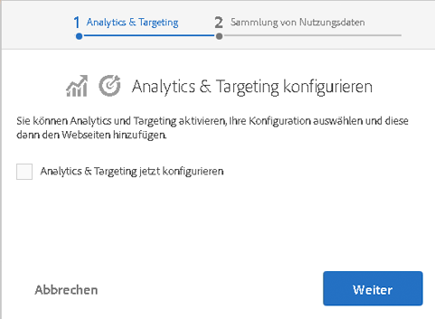

# Integrieren mit Adobe Marketing Cloud{#integrating-with-the-adobe-marketing-cloud}

[Adobe Marketing Cloud](https://www.adobe.com/solutions/digital-marketing.html) enthält leistungsstarke Produkte für die Web-Analyse und Website-Optimierung, die Ihnen verwertbare Echtzeitdaten und Einblicke liefern, damit Sie Online-Initiativen erfolgreich gestalten können. Sie erhalten eine integrierte und offene Plattform für die Optimierung Ihres Online-Business. Die Cloud besteht aus integrierten Anwendungen, mit denen Kundeneinblicke gesammelt werden können, die sehr nützlich sind, um die Kundenakquise, Konversions- und Bindungsmaßnahmen sowie die Erstellung und Verteilung von Inhalten zu optimieren.

Mit Adobe Experience Manager (AEM) können Sie die nahtlose Integration mit folgenden Produkten von Adobe Marketing Cloud durchführen:

* Über Adobe Analytics erhalten Marketing-Experten in Echtzeit verwertbare Daten zu Online-Strategien und Marketing-Initiativen.
* Mit Adobe Target haben Marketing-Experten die Möglichkeit, die Relevanz ihrer Online-Inhalte für Kunden immer weiter zu erhöhen, und dies führt zu einer größeren Zahl von Konversionen.
* Mithilfe von Adobe Dynamic Media Classic wird die Medienverwaltung automatisiert, die Webveröffentlichung optimiert und die Weboberfläche erweitert – alles innerhalb einer gehosteten Umgebung.
* Adobe Dynamic Tag Management bietet Marketing-Experten intuitive Tools zum schnellen und einfachen Verwalten einer unbegrenzten Zahl von Adobe- und Drittanbieter-Tags.
<!-- Search&Promote is end of life as of September 1, 2022 * Adobe Search&Promote gives marketers the ability to control and optimize the search results on their sites. -->
* Mit Adobe Campaign können Sie den Inhalt von E-Mail-Bereitstellungen direkt in Adobe Experience Manager verwalten.

[Außerdem können Sie AEM mit Creative Cloud](/help/assets/aem-cc-integration-best-practices.md) und mit [Drittanbieterdiensten](/help/sites-administering/third-party-services.md) integrieren.

## Integration mit Adobe Analytics {#integrating-with-adobe-analytics}

[Adobe Analytics](https://www.omniture.com/de/products/analytics/sitecatalyst) ist eine branchenführende Lösung, mit der Experten für Digital Marketing integrierte Daten aller Online-Initiativen über mehrere Marketing-Kanäle hinweg messen, analysieren und optimieren können. Die Lösung ermöglicht Marketing-Experten die Web-Analyse in Echtzeit und mit verwertbaren Ergebnissen für digitale Strategien und Marketing-Initiativen. Adobe Analytics unterstützt Marketing-Experten dabei, schnell die profitabelsten Pfade einer Website zu ermitteln, Traffic zu segmentieren, um wertvolle Webbesucher zu identifizieren, herauszufinden, wohin Besucher die Website verlassen, und entscheidende Erfolgsmetriken für Online-Marketing-Kampagnen zu finden.

Sie können Adobe Analytics nutzen, um Daten Ihrer Website zu analysieren.

Die Integration mit Adobe Analytics bietet Ihnen folgende Möglichkeiten:

* Aktivieren von Analytics-Benutzer-Tracking
* Zuweisen von Ausführungsmodi (z. B. Erstellen, Veröffentlichen) zu unterschiedlichen Report Suites
* Übermitteln von Client-Kontextvariablen als Konversionsvariablen oder Traffic-Eigenschaften
* Verwenden von vordefinierten Variablenzuweisungen
* Konfigurieren von gesamten Websiteabschnitten auf einmal
* Nachverfolgen von benutzerdefinierten Ereignissen

Weitere Informationen zur Integration von AEM mit Analytics finden Sie unter [Integrieren mit Adobe Analytics](/help/sites-administering/adobeanalytics.md).

Der [Opt-in-Assistent](/help/sites-administering/opt-in.md) erleichtert die Durchführung der Integration.

## Integrieren mit Adobe Target {#integrating-with-adobe-target}

[Adobe Target wird von Marketing-Experten genutzt, um Online-Tests zu entwerfen und auszuführen, in kurzer Zeit Zielgruppensegmente zu erstellen (anhand des Verhaltens) und das Targeting für Inhalte und Online-Erlebnisse zu automatisieren.](https://www.omniture.com/de/products/conversion/test-and-target)

Die Wünsche der Onlinekunden entwickeln sich ständig weiter und für die Vielzahl von Websites und Inhaltsquellen, die zur Auswahl stehen, werden relevante und auch personalisierte Inhalte erwartet. Um eine Online-Zielgruppe zu erreichen, ist es wichtig, dass Experten für Online-Marketing schnell identifizieren, welche Angebote und Inhalte für ihre Zielgruppen relevant und interessant sind. Basierend auf diesem Wissen müssen Marketing-Experten die Möglichkeit haben, ihre Website ständig weiterzuentwickeln und die entsprechenden Inhalte auf unterschiedliche Zielgruppen auszurichten.

Unter [Integrieren mit Adobe Target](/help/sites-administering/target.md) wird beschrieben, wie Sie Ihre Website mit Target integrieren.

Der [Opt-in-Assistent](/help/sites-administering/opt-in.md) erleichtert die Durchführung der Integration.

## Opt-in für Analytics und Target {#opting-in-to-analytics-and-target}

AEM verfügt über ein einfaches Opt-in-Verfahren für die Integration mit Adobe Analytics und Adobe Target. Wenn Sie sich als Administrator anmelden und zur Projektekonsole navigieren, wird ein Opt-in-Assistent angezeigt.

Führen Sie den Opt-in für die Integration mit Analytics bzw. Target durch, um die Nutzung der Funktionen für das Seiten-Tracking und die Analyse sowie für die Personalisierung zu ermöglichen. Für den Opt-in müssen Sie Ihre Benutzerkontoinformationen und die nachverfolgten Seiten angeben.

Weitere Informationen finden Sie unter [Opt-in für Adobe Analytics und Target](/help/sites-administering/opt-in.md).

## Integration mit Adobe Dynamic Media Classic {#integrating-with-scene}

Adobe Dynamic Media Classic ist eine gehostete Lösung zum Veröffentlichen, Verwalten, Verbessern und Bereitstellen von Assets für dynamisches Marketing und umfassendes visuelles Merchandising für die Bereiche Web, Mobile, E-Mail, soziale Medien, Internet-Anzeigen und Print.

In Adobe Experience Manager können Sie digitale Assets direkt aus Adobe Experience Manager in Dynamic Media Classic veröffentlichen und umgekehrt.

Darüber hinaus können Sie in Dynamic Media Classic veröffentlichte Adobe Experience Manager-Assets in verschiedenen Viewern anzeigen, z. B. Basic Zoom und Video.

Weitere Informationen zur Integration von Adobe Experience Manager mit Dynamic Media Classic finden Sie in der Dokumentation [Integration mit Dynamic Media Classic](/help/sites-administering/scene7.md).

## Integrieren mit Adobe Dynamic Tag Management {#integrating-with-adobe-dynamic-tag-management}

[Adobe Dynamic Tag Management bietet Marketing-Experten intuitive Tools zum schnellen und einfachen Verwalten einer unbegrenzten Zahl von Adobe- und Drittanbieter-Tags. ](https://www.adobe.com/de/solutions/digital-marketing/dynamic-tag-management.html) Sie haben mehr Kontrolle und Flexibilität, um nahezu alles online zu optimieren – und reduzieren damit gleichzeitig auch Ihre Abhängigkeit von IT-Ressourcen.

[Integrieren Sie Adobe Dynamic Tag Management](/help/sites-administering/dtm.md) mit AEM, sodass Sie Ihre Dynamic Tag Management-Webeigenschaften für das Tracking von AEM Sites verwenden können.

## Integrieren mit Adobe Audience Manager {#integrating-with-adobe-audience-manager}

Die Audience Manager-Integration wurde in AEM 6.3 entfernt.

<!-- Search&Promote is end of life as of September 1, 2022 ## Integrating with Search&Promote {#integrating-with-search-promote} -->

<!-- Search&Promote is end of life as of September 1, 2022 Adobe Search&Promote enables marketers to optimizehow visitors browse, find, compare, and select relevant products and content on web and mobile sites. Businesses can easily promote priority items based on business objectives and visitor intent, as well as automate merchandising and promotions activity via KPI-based triggers or metrics. -->

<!-- Search&Promote is end of life as of September 1, 2022 Adobe Search&Promote is a reliable and scalable hosted site search application, capable of scaling to millions of pages or products, for heavily visited online businesses ranging from retail to news sites. It offers unprecedented levels of marketer control and metrics-based relevance. -->

<!-- Search&Promote is end of life as of September 1, 2022 For information about integrating AEM and Search&Promote, see [Integrating with Adobe Search&Promote](/help/sites-administering/search-and-promote.md). -->

## Integrieren mit Adobe Campaign {#integrating-with-adobe-campaign}

Mit [Adobe Campaign](https://www.adobe.com/de/solutions/campaign-management.html) können Sie den Inhalt von E-Mail-Bereitstellungen direkt in Adobe Experience Manager verwalten.

Weitere Informationen zur Integration von AEM mit Adobe Campaign finden Sie unter [Integrieren mit Adobe Campaign](/help/sites-administering/campaignstandard.md).

## Integrieren mit Livefyre {#integrating-with-livefyre}

Informationen zu AEM und Livefyre:

* [Erste Schritte mit Livefyre](https://answers.livefyre.com/developers/getting-started)

* [Livefyre und AEM](https://answers.livefyre.com/product/livefyre-for-adobe-experience-manager-aem/livefyre-for-adobe-experience-manager/)
