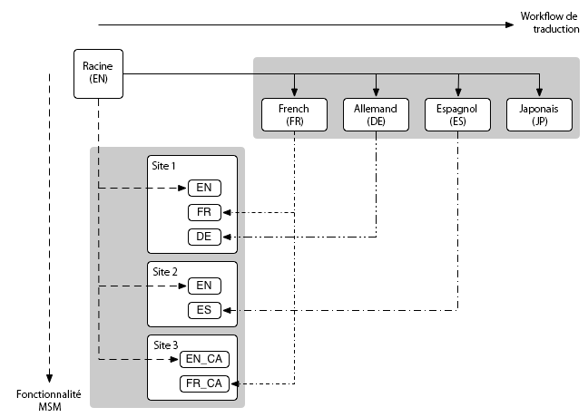

# Website-Administration{#website-administration}

Die folgenden Administrationstools sind für die Verwaltung von Websites und Seiten verfügbar:

* Multi Site Manager (MSM) ermöglicht Ihnen die Verwendung derselben Website-Inhalte an mehreren Stellen und lässt gleichzeitig Varianten zu:

   * [Wiederverwenden von Inhalten: Multi-Site-Manager und Live Copy](/help/sites-administering/msm.md)

* Die Übersetzungsfunktion ermöglicht Ihnen die Automatisierung der Übersetzung von Seiteninhalten, Assets und benutzergenerierten Inhalten, um mehrsprachige Websites zu erstellen und zu pflegen:

   * [Übersetzen von Inhalten für mehrsprachige Sites](/help/sites-administering/translation.md)

* Diese beiden Funktionen können kombiniert und für [internationale, mehrsprachige](#multinational-and-multilingual-sites) Websites eingesetzt werden.

## Internationale, mehrsprachige Sites {#multinational-and-multilingual-sites}

Sie können durch den kombinierten Einsatz von Multi Site Manager und Übersetzungs-Workflow auf effiziente Weise Inhalte für internationale, mehrsprachige Sites erstellen. Erstellen Sie eine Master-Website in einer Sprache und für ein bestimmtes Land und verwenden Sie diese Inhalte als Grundlage für die anderen Sites, wobei Sie bei Bedarf Übersetzungen einsetzen:

* [Übersetzen](/help/sites-administering/translation.md) Sie die Master-Website in verschiedene Sprachen.

* Verwenden Sie [Multi Site Manager](/help/sites-administering/msm.md) für Folgendes:

   * Verwenden Sie die Inhalte von der Master-Website sowie die Übersetzungen wieder, um Sites für andere Länder und Kulturen zu erstellen.
   * Achten Sie darauf, die Verwendung von Multi Site Manager auf Inhalte in einer Sprache zu begrenzen, z. B. englische Master-Website -> englische Sprachzweige auf Länder-Websites, französische Master-Website -> französische Sprachzweige auf Länder-Websites.
   * Trennen Sie bei Bedarf Elemente von den Live Copies, um Lokalisierungsdetails hinzuzufügen.

Das folgende Diagramm veranschaulicht, wie die Hauptkonzepte sich überschneiden (es sind jedoch nicht alle beteiligten Ebenen/Elemente dargestellt):

>[!NOTE]
>
>Bei diesem und vergleichbaren Szenarien verwaltet MSM nicht die verschiedenen Sprachversionen als solche.
>
>* [MSM](/help/sites-administering/msm.md) verwaltet die Bereitstellung der übersetzten Inhalte von einem Blueprint (z. B. einem globalen Master) in die Live Copies (z. B. die lokalen Sites) innerhalb der Grenzen einer Sprache.
>* Die AEM-Integrationsfunktionen zur [Übersetzung](/help/sites-administering/translation.md) verwalten kombiniert mit Übersetzungsmanagementdiensten von Drittanbietern die Sprachen und die Übersetzung der Inhalte in diese verschiedenen Sprachen.
>
>Bei noch komplexeren Nutzungsszenarien kann MSM auch über Sprach-Master hinweg eingesetzt werden.

>[!NOTE]
>
>Bei allen Nutzungsszenarien wird empfohlen, die folgenden Best Practices zu lesen:
>
>* [Best Practices für MSM](/help/sites-administering/msm-best-practices.md) – insbesondere:
>
>   * [Erstellen einer Website](/help/sites-administering/msm-best-practices.md#create-site)
>   * [MSM und mehrsprachige Websites](/help/sites-administering/msm-best-practices.md#msm-and-multilingual-websites)
>
>* [Best Practices für die Übersetzung](/help/sites-administering/tc-bp.md)

