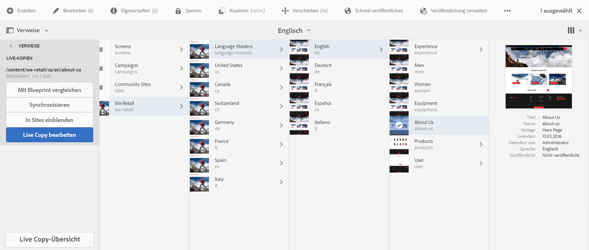
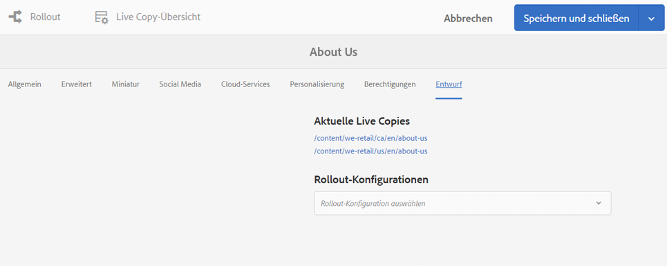
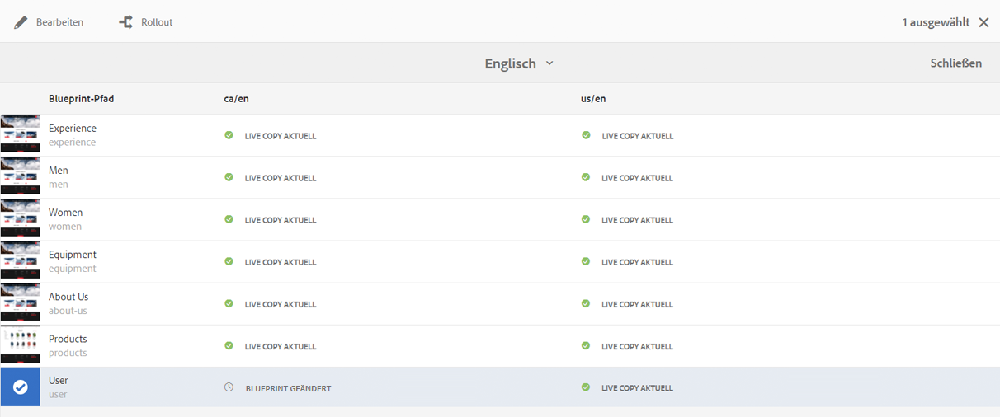
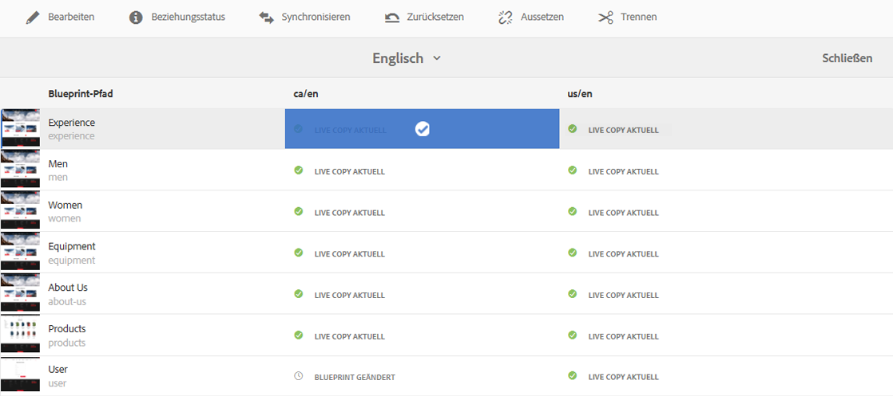
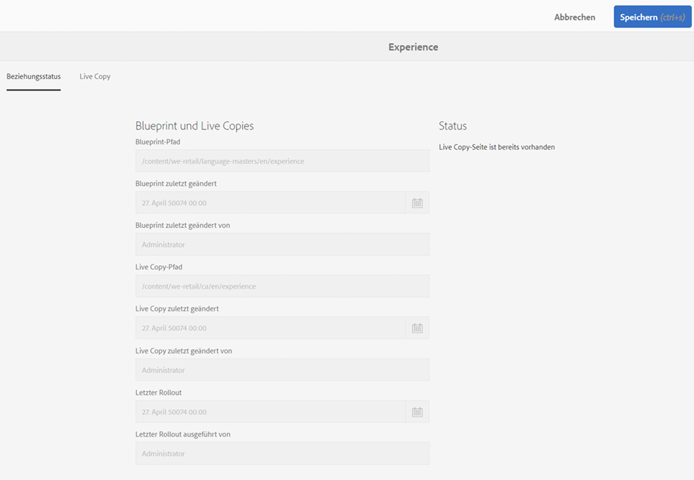
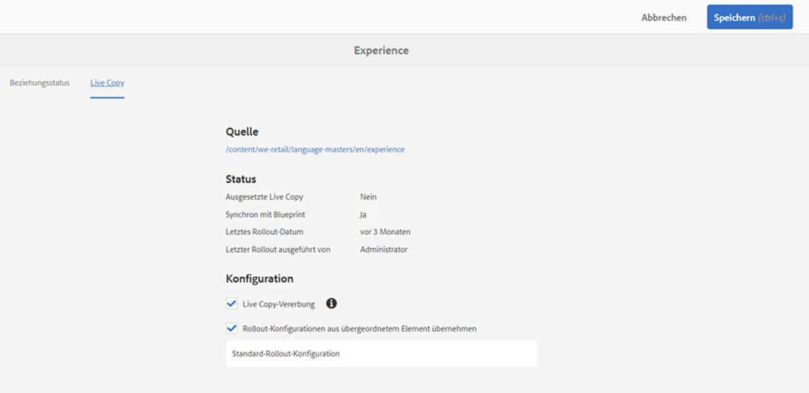

# Konsole „Live Copy-Übersicht“{#live-copy-overview-console}

Über die **Live Copy-Übersicht** können Sie folgende Vorgänge durchführen:

* Anzeigen/Verwalten der Vererbung einer Site:

   * Anzeigen der Blueprint-Struktur und entsprechenden Live Copy-Struktur samt Vererbungsstatus
   * Ändern des Vererbungsstatus, z. B. „Aussetzen“, „Fortsetzen“
   * Anzeigen von Blueprint- und Live Copy-Eigenschaften

* Durchführen von Rollout-Aktionen

## Öffnen der Live Copy-Übersicht {#opening-the-live-copy-overview}

Sie können die Live Copy-Übersicht wie folgt öffnen:

* [über das seitliche Bedienfeld „Verweise“ einer Blueprint-Seite (Sites-Konsole);](#opening-live-copy-overview-references-for-a-blueprint-page)
* [über die Eigenschaften der Blueprint-Seite.](#opening-live-copy-overview-properties-of-a-blueprint-page)

### Öffnen der Live Copy-Übersicht – Verweise für eine Blueprint-Seite  {#opening-live-copy-overview-references-for-a-blueprint-page}

Die **Übersicht über die Live-Kopie** kann über das Seitenbedienfeld **Verweise** der Konsole **Sites** geöffnet werden:

1. Navigieren Sie in der **Sites-Konsole** [zu Ihrer Blueprint-Seite und wählen Sie diese aus](/help/sites-authoring/basic-handling.md#viewing-and-selecting-resources).
1. Öffnen Sie das Bedienfeld **[Verweise](/help/sites-authoring/basic-handling.md#references)** und wählen Sie **Live Copies** aus.

   

   >[!NOTE]
   >
   >Sie können auch zuerst die Verweise öffnen und dann die Blueprint-Seite auswählen.

1. Wählen Sie **Live Copy-Übersicht** aus, um eine Übersicht aller Live Copies mit Bezug zur ausgewählten Blueprint-Seite anzuzeigen und zu verwenden.
1. Verwenden Sie **Schließen**, um den Vorgang zu beenden, und kehren Sie zur **Sites-Konsole** zurück.

### Öffnen der Live Copy-Übersicht – Eigenschaften einer Blueprint-Seite  {#opening-live-copy-overview-properties-of-a-blueprint-page}

Die **Live Copy-Übersicht** kann beim Anzeigen der Eigenschaften einer Blueprint-Seite geöffnet werden:

1. Öffnen Sie **Eigenschaften** für die entsprechende Blueprint-Seite.
1. Öffnen Sie die Registerkarte **Blueprint**; die Option **Live Copy-Übersicht** wird in der oberen Symbolleiste angezeigt:

   

1. Wählen Sie **Live Copy-Übersicht** aus, um eine Übersicht aller Live Copies mit Bezug zur aktuellen Blueprint-Seite anzuzeigen und zu verwenden.

   >[!NOTE]
   >
   >Weitere Informationen finden Sie im Knowledgebase-Artikel [Livecopy status message – Up-to-date/Green/In Sync](https://helpx.adobe.com/de/experience-manager/kb/livecopy-status-message---up-to-date-green-in-sync.html).

1. Verwenden Sie **Schließen**, um den Vorgang zu beenden, und kehren Sie zur **Sites-Konsole** zurück.

## Verwenden der Live Copy-Übersicht  {#using-the-live-copy-overview}

Mit der **Live Copy-Übersicht** können auch Aktionen für die Live Copy durchgeführt werden:

1. Öffnen Sie die **Live Copy-Übersicht**.
1. Wählen Sie die erforderliche Blueprint- oder Live Copy-Seite aus; die Symbolleiste wird mit den verfügbaren Aktionen aktualisiert. Die verfügbaren [Aktionen](/help/sites-administering/msm.md#terms-used) hängen davon ab, ob Sie eine [Blueprint](#actions-for-a-blueprint-page)- oder [Live Copy](#actions-for-a-live-copy-page)-Seite auswählen:

### Aktionen für Blueprint-Seiten  {#actions-for-a-blueprint-page}

Bei Auswahl einer Blueprint-Seite sind die folgenden Aktionen verfügbar:

* Bearbeiten

   * Öffnet die Blueprint-Seite zum Bearbeiten.

* [Rollout](/help/sites-administering/msm.md#rollout-and-synchronize)

   * Führt einen Rollout durch, um Änderungen von der Quelle auf die Live Copy zu pushen.

### Aktionen für eine Live Copy-Seite  {#actions-for-a-live-copy-page}

Bei Auswahl einer Live Copy-Seite sind die folgenden Aktionen verfügbar:

* Bearbeiten

   * Öffnet die Live Copy-Seite zum Bearbeiten.

* [Beziehungsstatus](#relationship-status)

   * Zeigt Informationen zum Status und zur Vererbung an.

* [Synchronisieren](/help/sites-administering/msm.md#rollout-and-synchronize)

   * Synchronisiert eine Live Copy, um Änderungen von der Quelle per Pull auf die Live Copy zu übertragen.

* [Zurücksetzen](/help/sites-administering/msm-livecopy.md#resetting-a-live-copy-page)

   * Setzt eine Live Copy-Seite zurück, um alle abgebrochenen Vererbungsvorgänge zu entfernen und die Seite wieder in denselben Status wie die Quellseite zu versetzen.

* [Aussetzen](/help/sites-administering/msm.md#suspending-and-cancelling-inheritance-and-synchronization)

   * Deaktiviert vorübergehend die Live-Beziehung zwischen einer Live Copy und der zugehörigen Blueprint-Seite.

* [Fortsetzen](/help/sites-administering/msm-livecopy.md#resuming-inheritance-for-a-page)

   * Reaktiviert eine ausgesetzte Beziehung.

* [Trennen](/help/sites-administering/msm.md#detaching-a-live-copy)

   * Entfernt dauerhaft die Live-Beziehung zwischen einer Live Copy und der zugehörigen Blueprint-Seite.

## Beziehungsstatus  {#relationship-status}

Die Konsole **Beziehungsstatus** verfügt über zwei Registerkarten mit verschiedenen Funktionen:

* [Informationen zum Beziehungsstatus](#relationship-status-information)
* [Informationen zur Live Copy](#live-copy-information)

### Informationen zum Beziehungsstatus  {#relationship-status-information}

Diese Registerkarte liefert detaillierte Informationen zum Status der Beziehung zwischen Blueprint und Live Copy:

### Informationen zur Live Copy {#live-copy-information}

Auf dieser Registerkarte können Sie die Live Copy-Konfiguration anzeigen und bearbeiten:

