# Erstellen und Synchronisieren von Live Copies{#creating-and-synchronizing-live-copies}

Sie können eine Live Copy von einer Seite oder Blueprint-Konfiguration erstellen und dann die Vererbung und Synchronisierung verwalten.

## Verwalten von Blueprint-Konfigurationen {#managing-blueprint-configurations}

Eine Blueprint-Konfiguration identifiziert eine vorhandene Website, die als Quelle für eine oder mehrere Live Copy-Seiten verwendet werden soll.

>[!NOTE]
>
>Mit Blueprint-Konfigurationen können Sie Inhaltsänderungen in Live Copies pushen. Siehe [Live Copies – Quelle, Blueprints und Blueprint-Konfigurationen](/help/sites-administering/msm.md#source-blueprints-and-blueprint-configurations).

Wählen Sie beim Erstellen einer Blueprint-Konfiguration eine Vorlage aus, die die interne Blueprint-Struktur definiert. Die standardmäßige Blueprint-Vorlage geht davon aus, dass die Quell-Website folgende Merkmale aufweist:

* Die Website verfügt über eine Stammseite.
* Die unmittelbar untergeordneten Seiten der Stammseite sind Sprachzweige der Website. Beim Erstellen einer Live Copy werden die Sprachen als optionaler Inhalt angezeigt, der in die Live Copy eingeschlossen werden soll.
* Der Stamm jedes Sprachzweigs hat mindestens eine untergeordnete Seite. Bei Erstellen einer Live Copy werden die untergeordneten Seiten als Kapitel angezeigt, die in die Live Copy eingeschlossen werden können.

>[!NOTE]
>
>Verschiedene Strukturen bedürfen unterschiedlicher Blueprint-Vorlagen.

Nachdem Sie die Blueprint-Konfiguration erstellt haben, können Sie die folgenden Eigenschaften konfigurieren:

* **Name**: Name der Blueprint-Konfiguration.
* **Quellpfad**: Pfad der Stammseite der Site, der als Quelle (Blueprint) verwendet wird.
* **Beschreibung**. (Optional) Beschreibung der Blueprint-Konfiguration. Die Beschreibung wird in der Liste der Blueprint-Konfigurationen angezeigt, die beim Erstellen einer Site zur Auswahl stehen.

Wird Ihre Blueprint-Konfiguration verwendet, können Sie sie mit einer Rollout-Konfiguration verknüpfen, die bestimmt, wie die Live Copies der Quelle/Blueprint synchronisiert werden. Siehe [Angeben der zu verwendenden Rollout-Konfigurationen](/help/sites-administering/msm-sync.md#specifying-the-rollout-configurations-to-use).

### Erstellen von Blueprint-Konfigurationen  {#creating-a-blueprint-configuration}

So erstellen Sie eine Blueprint-Konfiguration:

1. [Navigieren](/help/sites-authoring/basic-handling.md#global-navigation) Sie zum Menü **Tools** und wählen Sie das Menü **Sites** aus.
1. Wählen Sie **Blueprints** aus, um die Konsole **Blueprint-Konfigurationen** zu öffnen:

   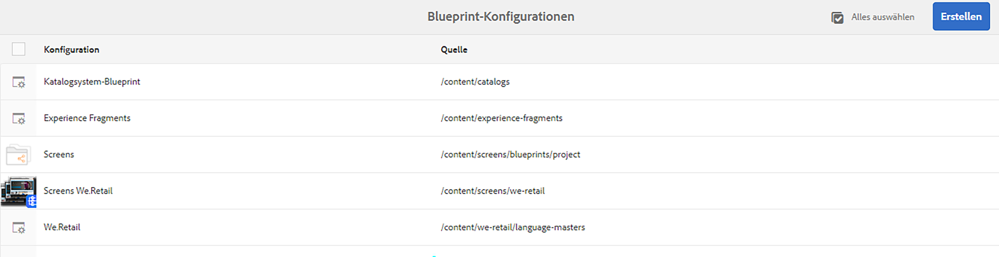

1. Wählen Sie **Erstellen**.
1. Wählen Sie die Blueprint-Vorlage aus und dann **Weiter**, um fortzufahren.
1. Wählen Sie die als Blueprint zu verwendende Quellseite aus und dann **Weiter**, um fortzufahren.
1. Definieren Sie Folgendes:

   * **Titel**: obligatorischer Blueprint-Titel
   * **Beschreibung**: optionale Beschreibung zur Angabe zusätzlicher Details

1. Mit **Erstellen** wird die Blueprint-Konfiguration basierend auf Ihren Angaben erstellt.

### Bearbeiten oder Löschen von Blueprint-Konfigurationen  {#editing-or-deleting-a-blueprint-configuration}

Sie können eine vorhandene Blueprint-Konfiguration bearbeiten oder löschen:

1. [Navigieren](/help/sites-authoring/basic-handling.md#global-navigation) Sie zum Menü **Tools** und wählen Sie das Menü **Sites** aus.
1. Wählen Sie **Blueprints** aus, um die Konsole **Blueprint-Konfigurationen** zu öffnen:

   

1. Wählen Sie die erforderliche Blueprint-Konfiguration aus – die entsprechenden Aktionen werden in der Symbolleiste verfügbar:

   * **Eigenschaften**: Hierüber können Sie die Eigenschaften der Konfiguration anzeigen und bearbeiten.
   * **Löschen**

## Erstellen von Live Copies {#creating-a-live-copy}

### Erstellen von Live Copies einer Seite {#creating-a-live-copy-of-a-page}

Sie können eine Live Copy einer Seite oder eines Zweigs erstellen. Beim Erstellen der Live Copy können Sie die für die Inhaltssynchronisierung zu verwendenden Rollout-Konfigurationen angeben:

* Die ausgewählten Rollout-Konfigurationen gelten für die Live Copy-Seite und ihre untergeordneten Seiten.
* Wenn Sie keine Rollout-Konfigurationen angeben, legt MSM die zu verwendenden Rollout-Konfigurationen fest. Siehe [Angeben der zu verwendenden Rollout-Konfiguration](/help/sites-administering/msm-sync.md#specifying-the-rollout-configurations-to-use).

Sie können Live Copies für beliebige Seite erstellen:

* Seiten, auf die eine [Blueprint-Konfiguration](#creating-a-blueprint-configuration) verweist.
* Seiten ohne verbundene Konfiguration.
* AEM unterstützt zudem die Erstellung einer Live Copy innerhalb der Seiten einer anderen Live Copy.

Der einzige Unterschied besteht darin, dass die Verfügbarkeit des Befehls **Rollout** auf den Quell-/Blueprint-Seiten davon abhängig ist, ob die Quelle von einer Blueprint-Konfiguration referenziert wird:

* Wenn Sie die Live Copy von einer Quellseite erstellen, die von einer Blueprint-Konfiguration referenziert **wird**, dann ist der Befehl „Rollout“ auf der oder den Quell-/Blueprint-Seite(n) verfügbar.
* Wenn Sie die Live Copy von einer Quellseite erstellen, die **nicht** von einer Blueprint-Konfiguration referenziert wird, dann ist der Befehl „Rollout“ auf der oder den Quell-/Blueprint-Seite(n) nicht verfügbar.

So erstellen Sie eine Live Copy:

1. Wählen Sie in der **Sites-Konsole** zuerst **Erstellen** und dann **Live Copy**.

   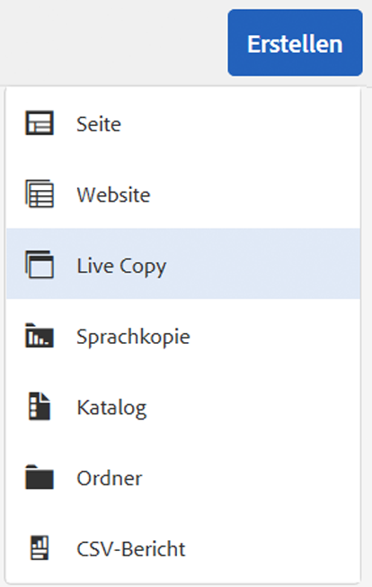

1. Wählen Sie die Quellseite aus und klicken oder tippen Sie auf **Weiter**. Beispiel:

   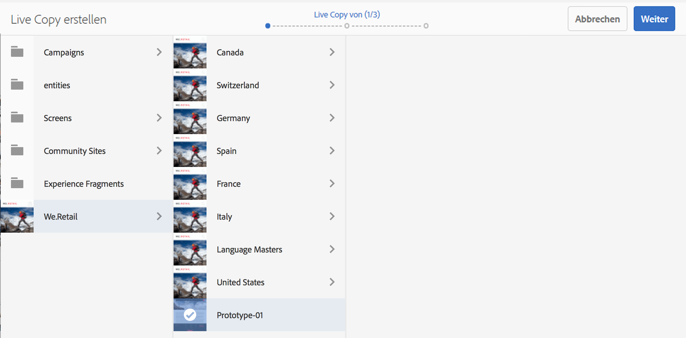

1. Geben Sie den Zielpfad der Live Copy an (öffnen Sie den übergeordneten Ordner/die übergeordnete Seite der Live Copy) und klicken oder tippen Sie dann auf **Weiter**.

   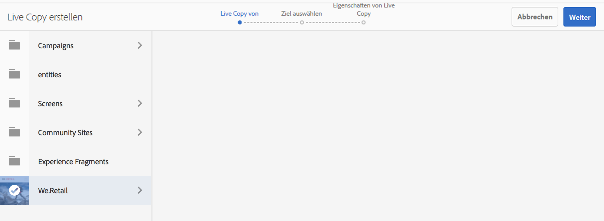

   >[!NOTE]
   >
   >Der Zielpfad darf sich nicht innerhalb des Quellpfads befinden.

1. Geben Sie Folgendes ein:

   * einen **Titel** für die Seite;
   * einen **Namen**, der in der URL verwendet wird.

   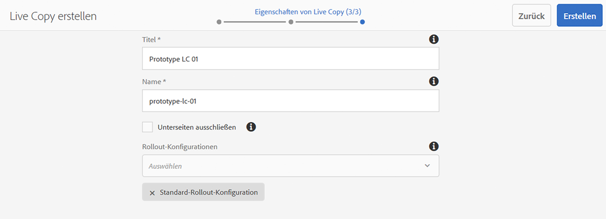

1. Verwenden Sie das Kontrollkästchen **Unterseiten ausschließen**:

   * Bei Aktivierung wird nur eine Live Copy der ausgewählten Seite erstellt (flache Live Copy).
   * Nicht ausgewählt: eine Live-Kopie erstellen, die alle untergeordneten Elemente der ausgewählten Seite enthält (Deep Live Copy)

1. (Optional) Um eine oder mehrere Rollout-Konfigurationen für die Live Copy anzugeben, wählen Sie diese über die Dropdown-Liste **Rollout-Konfigurationen** aus. Ausgewählte Konfigurationen werden unter der Dropdown-Auswahl angezeigt.
1. Klicken oder tippen Sie auf **Erstellen**. Eine Bestätigungsmeldung wird angezeigt. Hierüber können Sie entweder **Öffnen** oder **Fertig** auswählen.

### Erstellen von Live Copies einer Site über eine Blueprint-Konfiguration  {#creating-a-live-copy-of-a-site-from-a-blueprint-configuration}

Erstellen Sie eine Live Copy mit einer Blueprint-Konfiguration, um eine Site basierend auf dem Blueprint(Quell)-Inhalt anzulegen. Wenn Sie eine Live Copy über eine Blueprint-Konfiguration erstellen, wählen Sie einen oder mehrere Sprachzweige der zu kopierenden Blueprint-Quelle aus. Wählen Sie dann die Kapitel aus, aus denen die Sprachzweige kopiert werden sollen. Siehe [Erstellen einer Blueprint-Konfiguration](/help/sites-administering/msm-livecopy.md#creating-a-blueprint-configuration).

Wenn Sie einige Sprachverzweigungen oder Kapitel aus der Live-Kopie weglassen, können Sie diese später hinzufügen. Siehe [Erstellen einer Live Copy in einer Live Copy (Blueprint-Konfiguration)](#creating-a-live-copy-inside-a-live-copy-blueprint-configuration).

>[!CAUTION]
>
>Wenn die Blueprint-Quelle Links und Verweise zu einem Absatz in einem anderen Zweig enthält, werden die Ziele nicht auf den Live Copy-Seiten aktualisiert, sondern sie verweisen nach wie vor auf das ursprüngliche Ziel.

Geben Sie beim Erstellen der Site Werte für die folgenden Eigenschaften an:

* **Anfangssprachen**: Sprachzweige der Blueprint-Quelle, die in die Live Copy eingeschlossen werden sollen.
* **Anfangskapitel**: Untergeordnete Seiten der Blueprint-Sprachzweige, die in die Live Copy eingeschlossen werden sollen.
* **Zielpfad**: Verzeichnis der Stammseite der Live Copy-Site.
* **Titel**: Titel der Stammseite der Live Copy-Site.
* **Name**: (Optional) Name des JCR-Knotens, in dem die Stammseite der Live Copy gespeichert wird. Der Standardwert basiert auf dem Titel.
* **Website-Besitzer**: (Optional)
* **Live Copy**: Wählen Sie diese Option aus, um eine Live-Beziehung zur Quell-Site herzustellen. Wenn Sie diese Option nicht auswählen, wird zwar eine Blueprint-Kopie erstellt, aber sie wird nachfolgend nicht mit der Quelle synchronisiert.
* **Rollout-Konfigurationen**: (Optional) Wählen Sie eine oder mehrere Rollout-Konfigurationen für die Synchronisierung der Live Copy aus. Standardmäßig werden die Rollout-Konfigurationen vom Blueprint übernommen. Weitere Informationen finden Sie unter [Festlegen der zu verwendenden Rollout-Konfigurationen](/help/sites-administering/msm-sync.md#specifying-the-rollout-configurations-to-use).

So erstellen Sie die Live Copy einer Site über eine Blueprint-Konfiguration:

1. Wählen Sie in der **Sites-Konsole** die Option **Erstellen** und dann aus der Dropdown-Auswahl die Option **Website** aus.
1. Wählen Sie die als Quelle der Live Copy zu verwendende Blueprint-Konfiguration aus und fahren Sie mit **Weiter** fort:

   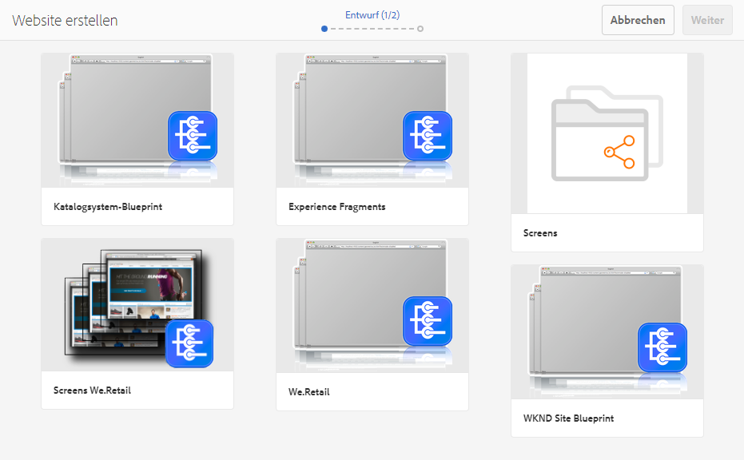

1. Geben Sie über die Auswahl **Anfangssprachen** die Sprache(n) der Blueprint-Site an, die für die Live Copy verwendet werden soll(en).

   Alle verfügbaren Sprachen sind standardmäßig ausgewählt. Um eine Sprache zu entfernen, klicken oder tippen Sie auf **X** neben der Sprache.

   Beispiel:

   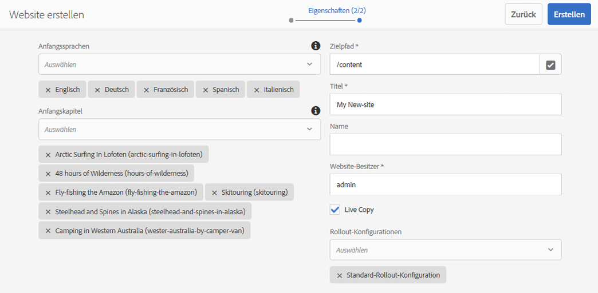

1. Wählen Sie die in die Live Copy einzuschließenden Blueprint-Abschnitte über das Dropdown-Menü **Anfangskapitel** aus. Wieder sind alle verfügbaren Kapitel standardmäßig enthalten; sie können aber entfernt werden.
1. Geben Sie Werte für die übrigen Eigenschaften ein und wählen Sie dann **Erstellen**. Wählen Sie im Bestätigungsdialogfeld die Option **Fertig** aus, um zur **Sites-Konsole** zurückzukehren, oder wählen Sie **Site öffnen** aus, um die Stammseite der Site zu öffnen.

### Erstellen von Live Copies in einer Live Copy (Blueprint-Konfiguration)  {#creating-a-live-copy-inside-a-live-copy-blueprint-configuration}

Wenn Sie eine Live Copy in der bereits vorhandenen (mit einer Blueprint-Konfiguration angelegten) Live Copy erstellen, können Sie beliebige Sprachkopien oder Kapitel einfügen, die bei der ursprünglichen Erstellung der Live Copy nicht einbezogen wurden.

## Überwachen Ihrer Live Copy  {#monitoring-your-live-copy}

### Anzeigen des Status einer Live Copy {#seeing-the-status-of-a-live-copy}

Die Eigenschaften einer Live Copy-Seite zeigen die folgenden Informationen zur Live Copy an:

* **Quelle**: Quellseite der Live Copy-Seite.
* **Status**: Synchronisierungsstatus der Live Copy. Der Status beinhaltet, ob die Live Copy dem aktuellen Stand der Quelle entspricht sowie wann und von wem die letzte Synchronisierung durchgeführt wurde.
* **Konfiguration**:

   * Angabe, ob die Seite nach wie vor einer Live Copy-Vererbung unterliegt.
   * Angabe, ob die Konfiguration von der übergeordneten Seite vererbt wurde.
   * Angabe etwaiger Rollout-Konfigurationen, die von der Live Copy verwendet werden.

So zeigen Sie die Eigenschaften an:

1. Wählen Sie in der **Sites-Konsole** die Live Copy-Seite aus und öffnen Sie die Eigenschaften.
1. Wählen Sie die Registerkarte **Live Copy** aus.

   Beispiel:

   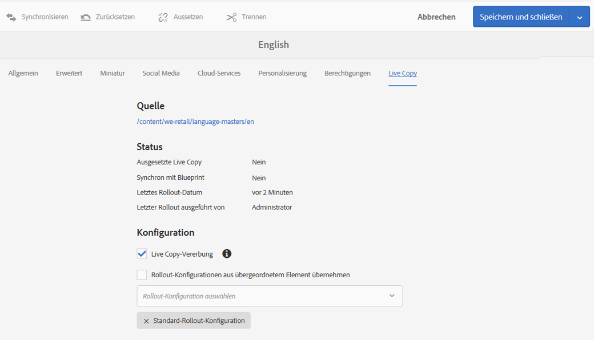

   >[!NOTE]
   >
   >Weitere Informationen finden Sie im Knowledgebase-Artikel [Livecopy status message – Up-to-date/Green/In Sync](https://helpx.adobe.com/de/experience-manager/kb/livecopy-status-message---up-to-date-green-in-sync.html).

### Anzeigen der Live Copies einer Blueprint-Seite  {#seeing-the-live-copies-of-a-blueprint-page}

Mit Blueprint-Seiten (auf die in einer Blueprint-Konfiguration verwiesen wird) erhalten Sie eine Liste der Live Copy-Seiten, die die aktuelle (Blueprint-)Seite als Quelle verwenden. Verfolgen Sie die Live Copies über diese Liste nach. Die Liste wird auf der Registerkarte **Blueprint** der [Seiteneigenschaften](/help/sites-authoring/editing-page-properties.md) angezeigt.

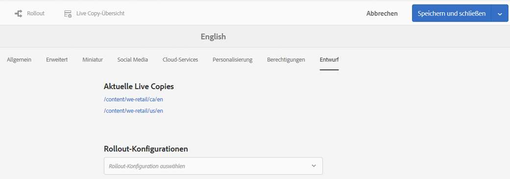

## Synchronisieren Ihrer Live Copy {#synchronizing-your-live-copy}

### Durchführen von Blueprint-Rollouts {#rolling-out-a-blueprint}

Führen Sie den Rollout für eine Blueprint-Seite durch, um Inhaltsänderungen auf Live Copies zu pushen. Mit einer **Rollout**-Aktion werden die Rollout-Konfigurationen ausgeführt, die den Auslöser [Bei Rollout](/help/sites-administering/msm-sync.md#rollout-triggers) verwenden.

>[!NOTE]
>
>Konflikte können auftreten, wenn neue Seiten mit demselben Seitennamen sowohl in der Blueprint-Verzweigung als auch in einer abhängigen Live Copy-Verzweigung erstellt werden.
>
>Solche [Konflikte müssen beim Rollout gehandhabt und aufgelöst werden](/help/sites-administering/msm-rollout-conflicts.md).

#### Durchführen von Blueprint-Rollouts über Seiteneigenschaften  {#rolling-out-a-blueprint-from-page-properties}

1. Wählen Sie in der **Sites-Konsole** die Seite aus und öffnen Sie die Eigenschaften.
1. Öffnen Sie die Registerkarte **Blueprint**.
1. Wählen Sie **Rollout** aus.

   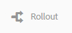

1. Geben Sie die Seiten und alle Unterseiten an und bestätigen Sie dann mit dem Häkchen:

   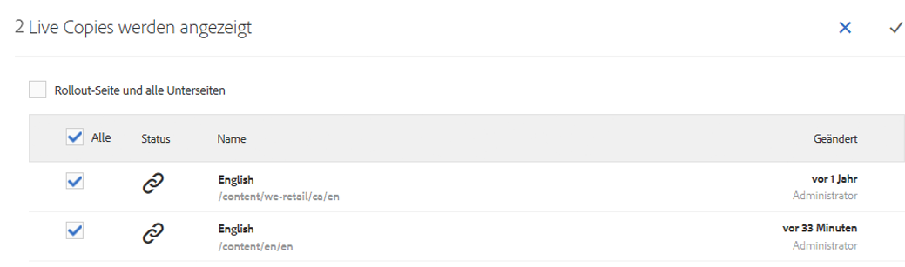

1. Geben Sie an, ob der Rollout-Auftrag sofort (**Jetzt**) oder zu einem anderen Datum/einer anderen Uhrzeit (**Später**) ausgeführt werden soll.

   

Rollouts werden als asynchrone Aufträge verarbeitet und können im Dashboard [**Async-Auftragsstatus** unter **Globale Navigation** -> **Tools** -> **Vorgänge** -> **Aufträge** geprüft werden.](asynchronous-jobs.md#monitor-the-status-of-asynchronous-operations)

>[!NOTE]
>
>Für die asynchrone Rollout-Verarbeitung ist AEM 6.5.3.0 oder höher erforderlich. In früheren Versionen wurden Seiten sofort und synchron verarbeitet.

#### Durchführen von Blueprint-Rollouts über die Verweisleiste {#roll-out-a-blueprint-from-the-reference-rail}

1. Wählen Sie in der Konsole **Sites** die Seite in der Live-Kopie aus und öffnen Sie das Bedienfeld **[Referenzen](/help/sites-authoring/basic-handling.md#references)** (aus der Symbolleiste).
1. Wählen Sie die Option **Blueprint** aus der Liste, um die mit dieser Seite verbundenen Blueprints anzuzeigen.
1. Wählen Sie den erforderlichen Blueprint aus der Liste aus.
1. Klicken oder tippen Sie auf **Rollout**.
1. Sie werden zum Bestätigen der Rollout-Details aufgefordert:

   * **Rollout-Umfang**:

      Geben Sie an, ob der Bereich nur für die ausgewählte Seite gelten soll oder Unterseiten enthalten sein sollen.

   * **Zeitplan**:

      Geben Sie an, ob der Rollout-Auftrag sofort (**Jetzt**) oder zu einem späteren Zeitpunkt (**Später**) ausgeführt werden soll.

      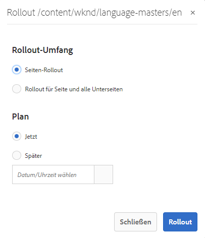

1. Wählen Sie nach Bestätigung dieser Details die Option **Rollout** aus, um die Aktion durchzuführen.

Rollouts werden als asynchrone Aufträge verarbeitet und können im Dashboard [**Async-Auftragsstatus** unter **Globale Navigation** -> **Tools** -> **Vorgänge** -> **Aufträge** geprüft werden.](asynchronous-jobs.md#monitor-the-status-of-asynchronous-operations)

>[!NOTE]
>
>Für die asynchrone Rollout-Verarbeitung ist AEM 6.5.3.0 oder höher erforderlich. In früheren Versionen wurden Seiten sofort und synchron verarbeitet, es sei denn, die Option **Hintergrundaktualisierung** wurde aktiviert.

#### Durchführen von Blueprint-Rollouts über die Live Copy-Übersicht {#roll-out-a-blueprint-from-the-live-copy-overview}

Die [Rollout-Aktion ist auch über die Live Copy-Übersicht verfügbar](/help/sites-administering/msm-livecopy-overview.md#using-the-live-copy-overview), wenn eine Blueprint-Seite ausgewählt wird.

1. Öffnen Sie die [Live Copy-Übersicht](/help/sites-administering/msm-livecopy-overview.md#using-the-live-copy-overview) und wählen Sie eine Blueprint-Seite aus.
1. Wählen Sie in der Symbolleiste die Option **Rollout** aus.
1. Geben Sie die Seiten und alle Unterseiten an und bestätigen Sie dann mit dem Häkchen:

   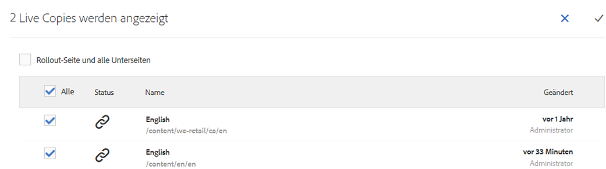

1. Geben Sie an, ob der Rollout-Auftrag sofort (**Jetzt**) oder zu einem anderen Datum/einer anderen Uhrzeit (**Später**) ausgeführt werden soll.

   

Rollouts werden als asynchrone Aufträge verarbeitet und können im Dashboard [**Async-Auftragsstatus** unter **Globale Navigation** -> **Tools** -> **Vorgänge** -> **Aufträge** geprüft werden.](asynchronous-jobs.md#monitor-the-status-of-asynchronous-operations)

>[!NOTE]
>
>Für die asynchrone Rollout-Verarbeitung ist AEM 6.5.3.0 oder höher erforderlich. In früheren Versionen wurden Seiten sofort und synchron verarbeitet.

### Synchronisieren von Live Copies {#synchronizing-a-live-copy}

Synchronisieren Sie eine Live Copy-Seite, um Änderungen von der Quelle per Pull auf die Live Copy zu übertragen.

#### Synchronisieren von Live Copies über Seiteneigenschaften {#synchronize-a-live-copy-from-page-properties}

Synchronisieren Sie eine Live Copy, um Änderungen von der Quelle per Pull auf die Live Copy zu übertragen.

>[!NOTE]
>
>Durch eine Synchronisierung werden die Rollout-Konfigurationen ausgeführt, die den Auslöser [Bei Rollout](/help/sites-administering/msm-sync.md#rollout-triggers) verwenden.

1. Wählen Sie in der **Sites-Konsole** die Live Copy-Seite aus und öffnen Sie die Eigenschaften.
1. Öffnen Sie die Registerkarte **Live Copy**.
1. Klicken oder tippen Sie auf **Synchronisieren**.

   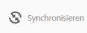

   Sie werden zur Bestätigung aufgefordert. Verwenden Sie **Sync**, um fortzufahren.

#### Synchronisieren von Live Copies über die Live Copy-Übersicht  {#synchronize-a-live-copy-from-the-live-copy-overview}

Die [Synchronisierungsaktion ist auch über die Live Copy-Übersicht verfügbar](/help/sites-administering/msm-livecopy-overview.md#using-the-live-copy-overview), wenn eine Live Copy-Seite ausgewählt wird.

1. Öffnen Sie die [Live Copy-Übersicht](/help/sites-administering/msm-livecopy-overview.md#using-the-live-copy-overview) und wählen Sie eine Live Copy-Seite aus.
1. Wählen Sie in der Symbolleiste die Option **Synchronisieren** aus.
1. Bestätigen Sie die Aktion **Rollout** im Dialogfeld, nachdem Sie angegeben haben, ob Folgendes enthalten sein soll:

   * **Seite und Unterseiten**
   * **Nur Seite**

   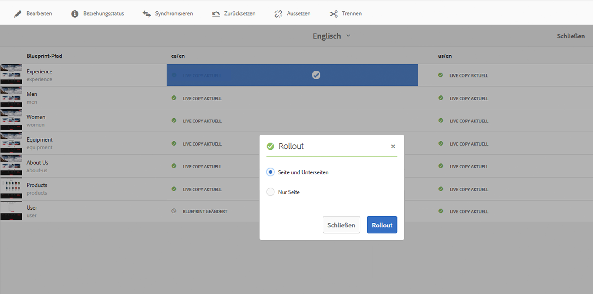

## Ändern von Live Copy-Inhalt {#changing-live-copy-content}

Zum Ändern von Live Copy-Inhalt haben Sie folgende Möglichkeiten:

* hinzufügen Absätze auf der Seite.
* Aktualisieren von vorhandenem Inhalt durch Unterbrechen der Live Copy-Vererbung für eine beliebige Seite oder Komponente

>[!NOTE]
>
>Wenn Sie eine neue Seite manuell in der Live Copy erstellen, liegt diese für die Live Copy lokal vor. Sie verfügt also über keine entsprechende Quellseite zum Anfügen.
>
>Es hat sich bewährt, eine lokale Seite, die Teil der Beziehung ist, quellseitig zu erstellen und einen (tiefen) Rollout durchzuführen. Hierdurch wird die Seite lokal als Live Copy erstellt.

>[!NOTE]
>
>Konflikte können auftreten, wenn neue Seiten mit demselben Seitennamen sowohl in der Blueprint-Verzweigung als auch in einer abhängigen Live Copy-Verzweigung erstellt werden.
>
>Solche [Konflikte müssen beim Rollout gehandhabt und aufgelöst werden](/help/sites-administering/msm-rollout-conflicts.md).

### Hinzufügen von Komponenten zu einer Live Copy-Seite  {#adding-components-to-a-live-copy-page}

Sie können einer Live Copy-Seite jederzeit Komponenten hinzufügen. Der Vererbungsstatus der Live-Kopie und des zugehörigen Absatzsystems hat keine Kontrolle über Ihre Fähigkeit, Komponenten hinzuzufügen.

Wenn die Live Copy-Seite mit der Quellseite synchronisiert wird, bleiben die hinzugefügten Komponenten unverändert. Siehe auch [Ändern der Komponentenanordnung auf einer Live Copy-Seite](#changing-the-order-of-components-on-a-live-copy-page).

>[!NOTE]
>
>Lokale Änderungen an einer als Container markierten Komponente werden bei einem Rollout nicht vom Blueprint-Inhalt überschrieben. Weitere Informationen finden Sie in den [Best Practices für MSM](/help/sites-administering/msm-best-practices.md#components-and-container-synchronization).

### Aussetzen der Vererbung für Seiten {#suspending-inheritance-for-a-page}

Wenn Sie eine Live Copy erstellen, wird die Live Copy-Konfiguration auf der Stammseite der kopierten Seiten gespeichert. Alle untergeordneten Seiten der Stammseite übernehmen die Live Copy-Konfigurationen. Die Komponenten auf den Live Copy-Seiten übernehmen ebenfalls die Live Copy-Konfiguration.

Sie können die Live Copy-Vererbung für eine Live Copy-Seite aussetzen, damit Sie Seiteneigenschaften und Komponenten ändern können. Wenn Sie die Vererbung aussetzen, werden die Seiteneigenschaften und Komponenten nicht mehr mit der Quelle synchronisiert.

>[!NOTE]
>
>Sie können auch [eine Live Copy von ihrem Blueprint trennen](#detaching-a-live-copy), um alle Verbindungen zu entfernen. Die Trennaktion ist dauerhaft und kann nicht rückgängig gemacht werden.

>[!NOTE]
>
>Wenn die Komponente als Container markiert ist, gelten die Aktionen zum Abbrechen und Aussetzen nicht für die untergeordneten Komponenten. Weitere Informationen finden Sie unter [MSM Best Practices](/help/sites-administering/msm-best-practices.md#components-and-container-synchronization).

#### Aussetzen der Vererbung über Seiteneigenschaften {#suspending-inheritance-from-page-properties}

So setzen Sie die Vererbung auf einer Seite aus:

1. Öffnen Sie die Eigenschaften der Live Copy-Seite entweder über den Befehl **Eigenschaften anzeigen** der **Sites-Konsole** oder über das Symbol **Seiteninformationen** der Seitensymbolleiste.
1. Klicken oder tippen Sie auf die Registerkarte **Live Copy**.
1. Wählen Sie in der Symbolleiste die Option **Aussetzen** aus. Sie können dann eine der folgenden Optionen auswählen:

   * **Aussetzen**: nur die aktuelle Seite
   * **Aussetzen mit untergeordneten Elementen**: aktuelle Seite mit etwaigen untergeordneten Seiten

1. Wählen Sie im Bestätigungsdialogfeld die Option **Aussetzen** aus.

#### Aussetzen der Vererbung über die Live Copy-Übersicht {#suspending-inheritance-from-the-live-copy-overview}

Die [Aussetzungsaktion ist auch über die Live Copy-Übersicht verfügbar](/help/sites-administering/msm-livecopy-overview.md#using-the-live-copy-overview), wenn eine Live Copy-Seite ausgewählt wird.

1. Öffnen Sie die [Live Copy-Übersicht](/help/sites-administering/msm-livecopy-overview.md#using-the-live-copy-overview) und wählen Sie eine Live Copy-Seite aus.
1. Wählen Sie in der Symbolleiste die Option **Aussetzen** aus.
1. Wählen Sie die entsprechende Option aus:

   * **Aussetzen**
   * **Aussetzen mit untergeordneten Elementen**

   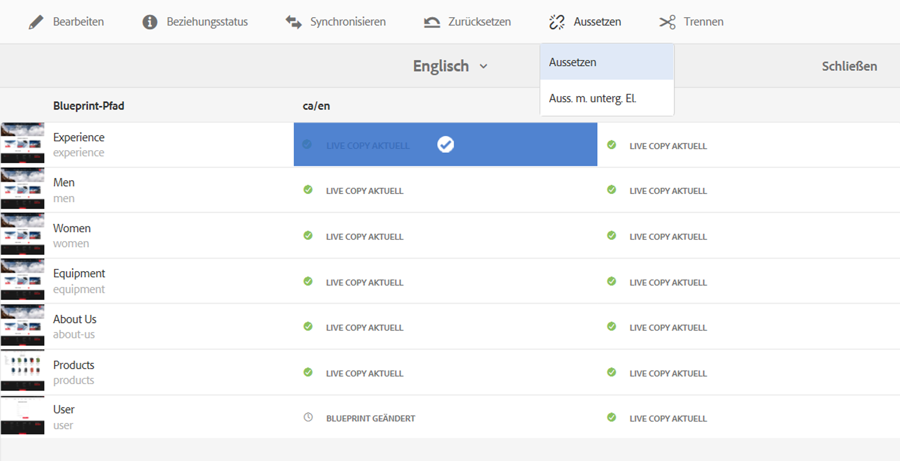

1. Bestätigen Sie die Aktion **Aussetzen** im Dialogfeld **Live Copy aussetzen**:

   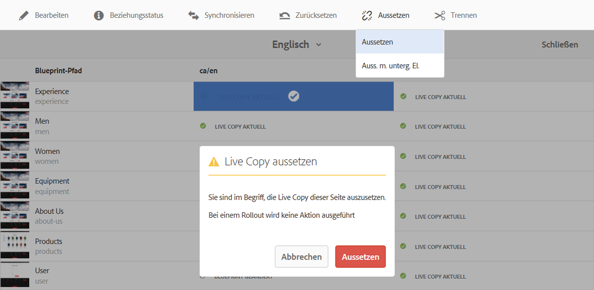

### Fortsetzen der Vererbung für Seiten {#resuming-inheritance-for-a-page}

Das Aussetzen der Live Copy-Vererbung für eine Seite ist eine vorübergehende Aktion. Nach dem Aussetzen wird die Aktion **Fortsetzen** verfügbar, über die Sie die Live-Beziehung reaktivieren können.

Wenn Sie die Vererbung erneut aktivieren, wird die Seite nicht automatisch mit der Quelle synchronisiert. Sie können ggf. eine Synchronisierung anfordern, und zwar entweder:

* im Dialogfeld **Fortsetzen**/**Zurück zur letzten Version**, z. B.:

   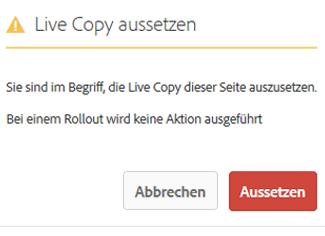

* später durch manuelle Auswahl der Synchronisierungsaktion.

>[!CAUTION]
>
>Wenn Sie die Vererbung erneut aktivieren, wird die Seite nicht automatisch mit der Quelle synchronisiert. Sie können ggf. manuell eine Synchronisierung anfordern, und zwar entweder zum Zeitpunkt der Fortsetzung oder später.

#### Fortsetzen der Vererbung über Seiteneigenschaften  {#resuming-inheritance-from-page-properties}

Nach dem [Aussetzen](#suspending-inheritance-from-page-properties) wird die Aktion **Fortsetzen** in der Symbolleiste der Seiteneigenschaften verfügbar:

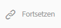

Bei Auswahl wird das entsprechende Dialogfeld angezeigt. Sie können bei Bedarf eine Synchronisierung auswählen und dann die Aktion bestätigen.

#### Fortsetzen von Live Copy-Seiten über die Live Copy-Übersicht {#resume-a-live-copy-page-from-the-live-copy-overview}

Die [Fortsetzungsaktion ist auch über die Live Copy-Übersicht verfügbar](/help/sites-administering/msm-livecopy-overview.md#using-the-live-copy-overview), wenn eine Live Copy-Seite ausgewählt wird.

1. Öffnen Sie die [Live Copy-Übersicht](/help/sites-administering/msm-livecopy-overview.md#using-the-live-copy-overview) und wählen Sie eine ausgesetzte Live Copy-Seite aus. Für diese wird **VERERBUNG ABGEBROCHEN** angezeigt.
1. Wählen Sie in der Symbolleiste die Option **Fortsetzen** aus.
1. Geben Sie an, ob Sie die Seite nach dem Zurücksetzen der Vererbung synchronisieren möchten, und bestätigen Sie dann die Aktion **Fortsetzen** im Dialogfeld **Live Copy fortsetzen**.

### Ändern der Vererbungstiefe (flach/tief) {#changing-inheritance-depth-shallow-deep}

Sie können bei einer vorhandenen Live Copy die Tiefe für eine Seite ändern, d. h., ob untergeordnete Seiten eingeschlossen werden sollen.

* Wechseln zu einer flachen Live Copy:

   * Dieser Vorgang wirkt sich direkt aus und kann nicht rückgängig gemacht werden.

      * Untergeordnete Seiten werden von der Live Copy getrennt. Weitere Änderungen bei untergeordneten Elementen können bei Rückgängigmachung nicht beibehalten werden.

      * Alle untergeordneten `LiveRelationships` werden entfernt, selbst wenn es sich um geschachtelte `LiveCopies` handelt.

* Wechseln zu einer tiefen Live Copy:

   * Untergeordnete Seiten bleiben hiervon unberührt.
   * Um sich ein Bild von der Wirkung des Wechsels zu machen, können Sie einen Rollout durchführen. Sämtliche Inhaltsänderungen werden gemäß der Rollout-Konfiguration angewendet.

* Wechseln zu einer flachen und dann wieder zu einer tiefen Live Copy:

   * Alle untergeordneten Elemente der (ehemals) flachen Live-Kopie werden so behandelt, als wären sie manuell erstellt worden und werden daher mit `[oldname]_msm_moved name` entfernt.

So geben Sie die Tiefe an oder ändern diese:

1. Öffnen Sie die Eigenschaften der Live Copy-Seite entweder über den Befehl **Eigenschaften anzeigen** der **Sites-Konsole** oder über das Symbol **Seiteninformationen** der Seitensymbolleiste.
1. Klicken oder tippen Sie auf die Registerkarte **Live Copy**.
1. Aktivieren oder deaktivieren Sie im Abschnitt **Konfiguration** die Option **Live Copy-Vererbung** abhängig davon, ob untergeordnete Seiten eingeschlossen sind:

   * Aktivierung bei einer tiefen Live Copy (untergeordnete Seiten eingeschlossen)
   * Deaktivierung bei einer flachen Live Copy (untergeordnete Seiten ausgeschlossen)

   >[!CAUTION]
   >
   >Der Wechsel zu einer flachen Live Copy wirkt sich direkt aus und kann nicht rückgängig gemacht werden.
   >
   >Weitere Informationen finden Sie unter [Live Copies – Komposition](/help/sites-administering/msm.md#live-copies-composition).

1. Klicken oder tippen Sie auf **Speichern**, um Updates beizubehalten.

### Abbrechen der Vererbung für Komponenten  {#cancelling-inheritance-for-a-component}

Brechen Sie die Live Copy-Vererbung für eine Komponente ab, sodass die Komponente nicht länger mit der Quellkomponente synchronisiert wird. Sie können die Vererbung ggf. zu einem späteren Zeitpunkt aktivieren.

>[!NOTE]
>
>Wenn die Komponente als Container markiert ist, gelten die Aktionen zum Abbrechen und Aussetzen nicht für die untergeordneten Komponenten. Weitere Informationen finden Sie unter [MSM Best Practices](/help/sites-administering/msm-best-practices.md#components-and-container-synchronization).

>[!NOTE]
>
>Wenn Sie die Vererbung erneut aktivieren, wird die Komponente nicht automatisch mit der Quelle synchronisiert. Sie können ggf. manuell eine Synchronisierung anfordern.

Brechen Sie die Vererbung ab, um den Komponenteninhalt zu ändern oder die Komponente zu löschen:

1. Klicken oder tippen Sie auf die Komponente, für die die Vererbung abgebrochen werden soll.

   

1. Klicken oder tippen Sie in der Symbolleiste „Komponente“ auf das Symbol **Vererbung abbrechen**.

   

1. Bestätigen Sie die Aktion im Dialogfeld „Vererbung abbrechen“ mit **Ja**.

   Die Symbolleiste „Komponente“ wird um alle (entsprechenden) Bearbeitungsbefehle aktualisiert.

### Erneutes Aktivieren der Vererbung für eine Komponente  {#re-enabling-inheritance-for-a-component}

Um die Vererbung für eine Komponente zu aktivieren, klicken oder tippen Sie auf das Symbol **Vererbung erneut aktivieren** in der Komponenten-Symbolleiste.

### Ändern der Komponentenanordnung auf einer Live Copy-Seite {#changing-the-order-of-components-on-a-live-copy-page}

Wenn eine Live Copy Komponenten enthält, die zu einem Absatzsystem gehören, werden bei der Vererbung dieses Absatzsystems die folgenden Regeln befolgt:

* Die Komponentenanordnung in einem vererbten Absatzsystem kann geändert werden, selbst bei bestehender Vererbung 
* Beim Rollout wird die Komponentenanordnung anhand des Blueprints wiederhergestellt. Wenn der Live Copy vor dem Rollout neue Komponenten hinzugefügt wurden, werden sie mit den Komponenten, über denen sie eingefügt wurden, neu angeordnet.
* Wird die Vererbung des Absatzsystems abgebrochen, wird die Komponentenanordnung beim Rollout nicht wiederhergestellt und bleibt gegenüber der Live Copy unverändert.

>[!NOTE]
>
>Wird eine abgebrochene Vererbung bei einem Absatzsystem wiederhergestellt, wird die Komponentenanordnung **nicht automatisch anhand des Blueprints zurückgesetzt** Sie können ggf. manuell eine Synchronisierung anfordern.

Verwenden Sie das folgende Verfahren, um die Vererbung des Absatzsystems abzubrechen.

1. Öffnen Sie die Live Copy-Seite.
1. Ziehen Sie eine bereits vorhandene Komponente an eine neue Position auf der Seite.
1. Bestätigen Sie die Aktion im Dialogfeld **Vererbung abbrechen** mit **Ja**.

### Außerkraftsetzen der Eigenschaften einer Live Copy-Seite  {#overriding-properties-of-a-live-copy-page}

Die Seiteneigenschaften einer Live Copy-Seite werden standardmäßig von der Quellseite übernommen (und sind nicht bearbeitbar).

Sie können die Vererbung für eine Eigenschaft abbrechen, wenn Sie den Eigenschaftswert für die Live Copy ändern müssen. Über ein Verknüpfungssymbol wird angegeben, dass die Vererbung für die Eigenschaft aktiviert ist.

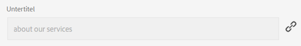

Wenn Sie die Vererbung abbrechen, können Sie den Eigenschaftswert ändern. Ein Symbol „Fehlerhafte Verknüpfung“ gibt an, dass die Vererbung abgebrochen wurde.

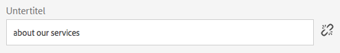

Sie können später ggf. die Vererbung für eine Eigenschaft erneut aktivieren.

>[!NOTE]
>
>Wenn Sie die Vererbung erneut aktivieren, wird die Eigenschaft der Live Copy-Seite nicht automatisch mit der Quelleigenschaft synchronisiert. Sie können ggf. manuell eine Synchronisierung anfordern.

1. Öffnen Sie die Eigenschaften der Live-Kopierseite entweder mit der Option **Eigenschaften der Ansicht** der Konsole **Sites** oder mit dem Symbol **Seiteninformationen** in der Seitensymbolleiste.
1. Um die Vererbung einer Eigenschaft abzubrechen, klicken oder tippen Sie auf das Verknüpfungssymbol rechts neben der Eigenschaft.

   

1. Klicken oder tippen Sie im Bestätigungsdialogfeld **Vererbung abbrechen** auf **Ja**.

### Wiederherstellen der Eigenschaften einer Live Copy-Seite  {#revert-properties-of-a-live-copy-page}

Um die Vererbung für eine Eigenschaft zu aktivieren, klicken oder tippen Sie auf das Symbol **Vererbung zurücksetzen**, das neben der Eigenschaft angezeigt wird.

### Zurücksetzen von Live Copy-Seiten {#resetting-a-live-copy-page}

Setzen Sie eine Live Copy-Seite zurück, um:

* alle abgebrochenen Vererbungsvorgänge zu entfernen und
* die Seite in denselben Status wie die Quellseite zurückzuversetzen.

Eine Rücksetzung wirkt sich auf die von Ihnen durchgeführten Änderungen an den Seiteneigenschaften, am Absatzsystem und an den Komponenten aus.

#### Zurücksetzen von Live Copy-Seiten über die Seiteneigenschaften  {#reset-a-live-copy-page-from-the-page-properties}

1. Wählen Sie in der **Sites-Konsole** die Live Copy-Seite und dann **Eigenschaften anzeigen** aus.
1. Öffnen Sie die Registerkarte **Live Copy**.
1. Wählen Sie in der Symbolleiste die Option **Zurücksetzen** aus.

   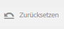

1. Bestätigen Sie den Vorgang im Dialogfeld **Live Copy zurücksetzen** mit **Zurücksetzen**.

#### Zurücksetzen von Live Copy-Seiten über die Live Copy-Übersicht  {#reset-a-live-copy-page-from-the-live-copy-overview}

Die [Rücksetzungsaktion ist auch über die Live Copy-Übersicht verfügbar](/help/sites-administering/msm-livecopy-overview.md#using-the-live-copy-overview), wenn eine Live Copy-Seite ausgewählt wird.

1. Öffnen Sie die [Live Copy-Übersicht](/help/sites-administering/msm-livecopy-overview.md#using-the-live-copy-overview) und wählen Sie eine Live Copy-Seite aus.
1. Wählen Sie in der Symbolleiste die Option **Zurücksetzen** aus.
1. Bestätigen Sie die Aktion **Zurücksetzen** im Dialogfeld **Live Copy zurücksetzen**:

   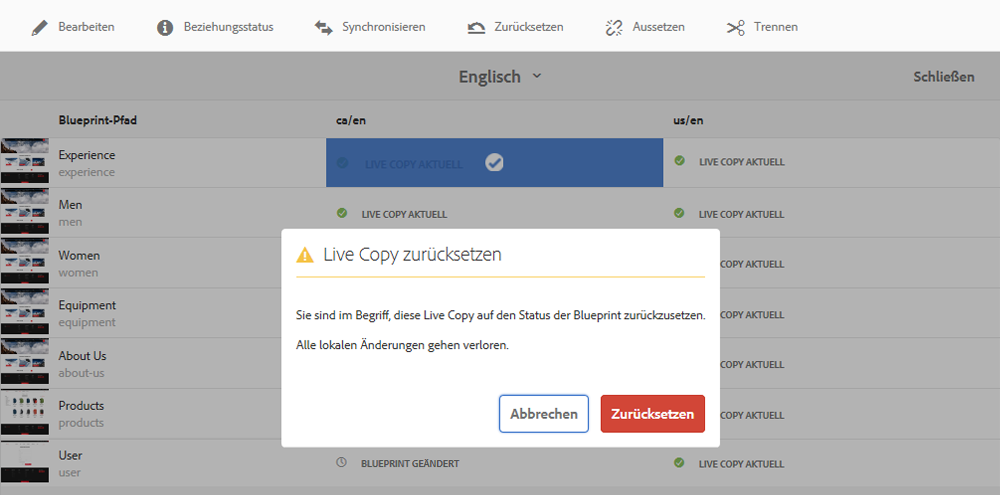

## Vergleichen von Live Copy-Seiten mit Blueprint-Seiten {#comparing-a-live-copy-page-with-a-blueprint-page}

Um die vorgenommenen Änderungen zu verfolgen, können Sie die Blueprint-Seite in **References** Ansicht und mit der Live-Kopierseite vergleichen:

1. Navigieren Sie in der **Sites-Konsole** [zu einer Blueprint- oder Live Copy-Seite und wählen Sie diese aus](/help/sites-authoring/basic-handling.md#viewing-and-selecting-resources).
1. Öffnen Sie das Bedienfeld **[Verweise](/help/sites-authoring/basic-handling.md#references)** und wählen Sie aus den folgenden Optionen:

   * **Blueprint**  (wenn eine Live Copy-Seite ausgewählt ist)
   * **Live Copies**  (bei Auswahl einer Blueprint-Seite)

1. Wählen Sie eine bestimmte Live Copy aus und aktivieren Sie dann eine der folgenden Optionen:

   * **Mit Blueprint vergleichen** (bei Auswahl einer Live Copy-Seite)
   * **Mit Live Copy**  vergleichen (wenn eine Blueprint-Seite ausgewählt ist)

   Beispiel:

   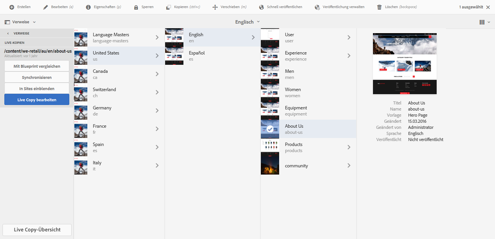

1. Die beiden Seiten (Live Copy und Blueprint) werden nebeneinander geöffnet.

   Vollständige Informationen zur Verwendung dieser Funktion finden Sie unter [Seitenvergleich](/help/sites-authoring/page-diff.md).

## Trennen von Live Copies  {#detaching-a-live-copy}

Beim Trennen wird die Live-Beziehung zwischen einer Live Copy und der zugehörigen Quell-/Blueprint-Seite dauerhaft entfernt. Alle MSM-bezogenen Eigenschaften werden aus der Live Copy entfernt und die Live Copy-Seiten werden zu einer eigenständigen Kopie.

>[!CAUTION]
>
>Sie können die Live-Beziehung reaktivieren, nachdem Sie die Live Copy getrennt haben.
>
>Um die Live-Beziehung mit der Möglichkeit einer späteren Reaktivierung zu entfernen, können Sie die [Live Copy-Vererbung für die Seite abbrechen](#suspending-inheritance-for-a-page).

Je nachdem, wo innerhalb der Struktur die Option **Trennen** verwendet wird, ist dies mit unterschiedlichen Folgen verbunden:

* **Trennen auf der Stammseite einer Live Copy**

   Wenn dieser Vorgang auf der Stammseite einer Live Copy durchgeführt wird, wird die Live-Beziehung zwischen allen Seiten des Blueprints und seiner Live Copy entfernt.

   Weitere Änderungen an Seiten im (bisherigen) Blueprint wirken sich **nicht** auf die (bisherige) Live Copy aus.

* **Trennen auf einer Unterseite einer Live Copy**

   Wenn dieser Vorgang auf einer Unterseite (oder im Zweig) in einer Live Copy durchgeführt wird:

   * wird die Live-Beziehung für diese Unterseite (oder diesen Zweig) entfernt
   * und die (Unter-)Seiten im Live Copy-Zweig werden so behandelt, als wären sie manuell erstellt worden.

   *Allerdings* sind die Unterseiten weiterhin der Live-Beziehung des übergeordneten Zweigs unterworfen, sodass bei einem weiteren Rollout der Blueprint-Seite(n) Folgendes geschieht:

   1. Die getrennten Seite(n) werden umbenannt:

      * Der Grund: MSM betrachtet die Seiten als manuell erstellte Seiten, die einen Konflikt verursachen, da sie denselben Namen aufweisen wie die zu erstellenden Live Copy-Seiten.
   1. Es wird eine neue (Live Copy-)Seite mit dem ursprünglichen Namen und den Änderungen vom Rollout erstellt.

   >[!NOTE]
   >
   >Details für solche Situationen finden Sie unter [MSM-Rollout-Konflikte](/help/sites-administering/msm-rollout-conflicts.md).

### Trennen von Live Copy-Seiten über Seiteneigenschaften {#detach-a-live-copy-page-from-the-page-properties}

So trennen Sie eine Live Copy:

1. Wählen Sie in der **Sites-Konsole** die Live Copy-Seite aus und klicken oder tippen Sie auf **Eigenschaften anzeigen**.
1. Öffnen Sie die Registerkarte **Live Copy**.
1. Wählen Sie in der Symbolleiste die Option **Trennen** aus.

   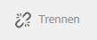

1. Wählen Sie im daraufhin angezeigten Bestätigungsdialogfeld die Option **Trennen** aus, um die Aktion abzuschließen.

### Trennen von Live Copy-Seiten über die Live Copy-Übersicht  {#detach-a-live-copy-page-from-the-live-copy-overview}

Die [Trennaktion ist auch über die Live Copy-Übersicht verfügbar](/help/sites-administering/msm-livecopy-overview.md#using-the-live-copy-overview), wenn eine Live Copy-Seite ausgewählt wird.

1. Öffnen Sie die [Live Copy-Übersicht](/help/sites-administering/msm-livecopy-overview.md#using-the-live-copy-overview) und wählen Sie eine Live Copy-Seite aus.
1. Wählen Sie in der Symbolleiste die Option **Trennen** aus.
1. Bestätigen Sie die Aktion **Detach** im Dialogfeld **Live Copy entfernen**:

   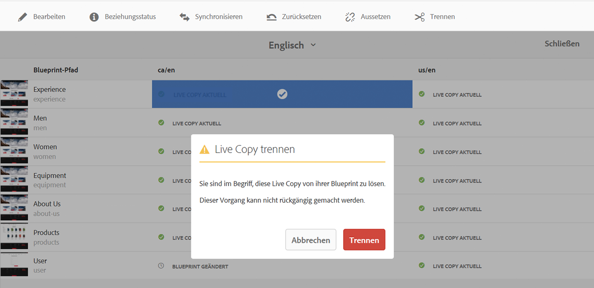
