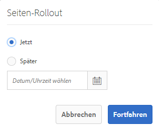

# Erstellen und Synchronisieren von Live Copies{#creating-and-synchronizing-live-copies}

Sie können eine Live Copy aus einer Seiten- oder Blueprint-Konfiguration erstellen und dann Vererbung und Synchronisierung verwalten.

## Verwalten von Blueprint-Konfigurationen {#managing-blueprint-configurations}

Eine Blueprint-Konfiguration identifiziert eine vorhandene Website, die Sie als Quelle für eine oder mehrere Live Copy-Seiten verwenden möchten.

>[!NOTE]
>
>Mit Blueprint-Konfigurationen können Sie Inhaltsänderungen in Live Copies pushen. Siehe [Live Copies – Quelle, Blueprints und Blueprint-Konfigurationen](/help/sites-administering/msm.md#source-blueprints-and-blueprint-configurations).

Wenn Sie eine Blueprint-Konfiguration erstellen, wählen Sie eine Vorlage aus, die die interne Struktur des Blueprints definiert. Die standardmäßige Blueprint-Vorlage geht davon aus, dass die Quell-Website folgende Merkmale aufweist:

* Die Website verfügt über eine Stammseite.
* Die unmittelbar untergeordneten Seiten der Stammseite sind Sprachzweige der Website. Beim Erstellen einer Live Copy werden die Sprachen als optionaler Inhalt angezeigt, der in die Kopie eingefügt werden soll.
* Der Stamm jedes Sprachzweigs hat mindestens eine untergeordnete Seite. Beim Erstellen einer Live Copy werden untergeordnete Seiten als Kapitel angezeigt, die Sie in die Live Copy aufnehmen können.

>[!NOTE]
>
>Eine andere Struktur erfordert eine andere Blueprint-Vorlage.

Nachdem Sie die Blueprint-Konfiguration erstellt haben, können Sie die folgenden Eigenschaften konfigurieren:

* **Name**: Der Name der Blueprint-Konfiguration.
* **Quellpfad**: Der Pfad der Stammseite der Site, die Sie als Quelle (Blueprint) verwenden.
* **Beschreibung**. (Optional) Eine Beschreibung der Blueprint-Konfiguration. Die Beschreibung wird in der Liste der Blueprint-Konfigurationen angezeigt, aus denen Sie beim Erstellen einer Site wählen können.

Wird Ihre Blueprint-Konfiguration verwendet, können Sie sie mit einer Rollout-Konfiguration verknüpfen, die bestimmt, wie die Live Copies der Quelle/Blueprint synchronisiert werden. Siehe [Angeben der zu verwendenden Rollout-Konfigurationen](/help/sites-administering/msm-sync.md#specifying-the-rollout-configurations-to-use).

### Erstellen von Blueprint-Konfigurationen {#creating-a-blueprint-configuration}

So erstellen Sie eine Blueprint-Konfiguration:

1. [Navigieren](/help/sites-authoring/basic-handling.md#global-navigation) Sie zum Menü **Tools** und wählen Sie dann das Menü **Sites** aus.
1. Wählen Sie **Blueprints**, um die Konsole **Blueprint-Konfigurationen** zu öffnen:

   

1. Wählen Sie **Erstellen**.
1. Wählen Sie die Blueprint-Vorlage und dann **Weiter**, um fortzufahren.
1. Wählen Sie die Quellseite aus, die als Blueprint verwendet werden soll, und fahren Sie mit **Weiter** fort.
1. Definieren Sie:

   * Den **Titel**: obligatorischer Titel für den Blueprint
   * Die **Beschreibung**: eine optionale Beschreibung, um weitere Details anzugeben.

1. Mit **Erstellen** wird die Blueprint-Konfiguration basierend auf Ihren Angaben erstellt.

### Lokales Bearbeiten oder Löschen {#editing-or-deleting-a-blueprint-configuration}

Sie können eine vorhandene Blueprint-Konfiguration bearbeiten oder löschen:

1. [Navigieren](/help/sites-authoring/basic-handling.md#global-navigation) Sie zum Menü **Tools** und wählen Sie dann das Menü **Sites** aus.
1. Wählen Sie **Blueprints**, um die Konsole **Blueprint-Konfigurationen** zu öffnen:

   

1. Wählen Sie die erforderliche Blueprint-Konfiguration aus. Die entsprechenden Aktionen werden daraufhin in der Symbolleiste verfügbar sein:

   * **Eigenschaften**; Sie können dies verwenden, um die Eigenschaften der Konfiguration anzuzeigen und zu bearbeiten.
   * **Löschen**

## Erstellen von Live Copies {#creating-a-live-copy}

### Erstellen von Live Copies einer Seite {#creating-a-live-copy-of-a-page}

Sie können eine Live Copy einer beliebigen Seite oder Verzweigung erstellen. Beim Erstellen der Live Copy können Sie die Rollout-Konfigurationen angeben, die zum Synchronisieren des Inhalts verwendet werden sollen:

* Die ausgewählten Rollout-Konfigurationen gelten für die Live Copy-Seite und ihre untergeordneten Seiten.
* Wenn Sie keine Rollout-Konfigurationen angeben, bestimmt MSM, welche Rollout-Konfigurationen verwendet werden sollen. Siehe [Angeben der zu verwendenden Rollout-Konfigurationen](/help/sites-administering/msm-sync.md#specifying-the-rollout-configurations-to-use).

Sie können Live Copies für beliebige Seite erstellen:

* Seiten, auf die eine [Blueprint-Konfiguration](#creating-a-blueprint-configuration) verweist.
* Seiten ohne verbundene Konfiguration.
* AEM unterstützt auch das Erstellen einer Live Copy auf den Seiten einer anderen Live Copy.

Der einzige Unterschied besteht darin, dass die Verfügbarkeit des Befehls **Rollout** auf den Quell-/Blueprint-Seiten davon abhängig ist, ob die Quelle von einer Blueprint-Konfiguration referenziert wird:

* Wenn Sie eine Live Copy aus einer Quellseite erstellen, die **is** in einer Blueprint-Konfiguration referenziert wird, ist der Rollout-Befehl auf den Quell-/Blueprint-Seiten verfügbar.
* Wenn Sie eine Live Copy aus einer Quellseite erstellen, die **ist nicht** in einer Blueprint-Konfiguration referenziert wird, ist der Befehl &quot;Rollout&quot;auf den Quell-/Blueprint-Seiten nicht verfügbar.

So erstellen Sie eine Live Copy:

1. Wählen Sie in der **Sites-Konsole** zuerst **Erstellen** und dann **Live Copy**.

   

1. Wählen Sie die Quellseite aus und klicken Sie auf **Nächste**. Beispiel:

   

1. Geben Sie den Zielpfad der Live Copy an (öffnen Sie den übergeordneten Ordner/die Seite der Live Copy) und klicken Sie dann auf **Nächste**.

   

   >[!NOTE]
   >
   >Der Zielpfad darf sich nicht im Quellpfad befinden.

1. Geben Sie ein:

   * einen **Titel** für die Seite;
   * einen **Namen**, der in der URL verwendet wird.

   

1. Verwenden Sie das Kontrollkästchen **Unterseiten ausschließen**:

   * Ausgewählt: Erstellen Sie nur eine Live Copy der ausgewählten Seite (flache Live Copy)
   * Bei Deaktivierung wird eine Live Copy mit allen Nachfolgeelementen der ausgewählten Seite erstellt (tiefe Live Copy).

1. (Optional) Um eine oder mehrere Rollout-Konfigurationen für die Live Copy anzugeben, verwenden Sie die **Rollout-Konfigurationen** Dropdown-Liste, um sie auszuwählen. Ausgewählte Konfigurationen werden unter der Dropdown-Auswahl angezeigt.
1. Klicken Sie auf **Erstellen**. Eine Bestätigungsmeldung wird angezeigt. Hier können Sie entweder **Öffnen** oder **Fertig** auswählen.

### Erstellen von Live Copies einer Site über eine Blueprint-Konfiguration {#creating-a-live-copy-of-a-site-from-a-blueprint-configuration}

Erstellen Sie eine Live Copy mit einer Blueprint-Konfiguration, um eine Site basierend auf dem Blueprint (Quelle)-Inhalt zu erstellen. Wenn Sie eine Live Copy aus einer Blueprint-Konfiguration erstellen, wählen Sie mindestens einen Sprachzweig der zu kopierenden Blueprint-Quelle aus und wählen Sie dann die Kapitel aus, die aus den Sprachzweigen kopiert werden sollen. Siehe [Erstellen von Blueprint-Konfigurationen](/help/sites-administering/msm-livecopy.md#creating-a-blueprint-configuration).

Wenn Sie einige Sprachverzweigungen oder Kapitel aus der Live Copy auslassen, können Sie diese später hinzufügen. Siehe [Erstellen von Live Copies in einer Live Copy (Blueprint-Konfiguration)](#creating-a-live-copy-inside-a-live-copy-blueprint-configuration).

>[!CAUTION]
>
>Wenn die Blueprint-Quelle Links enthält und auf einen Absatz in einem anderen Zweig verweist, werden die Ziele nicht auf den Live Copy-Seiten aktualisiert, sondern bleiben auf das ursprüngliche Ziel verweisen.

Geben Sie beim Erstellen der Site Werte für die folgenden Eigenschaften an:

* **Anfangssprachen**: Sprachzweige der Blueprint-Quelle, die in die Live Copy eingeschlossen werden sollen.
* **Erste Kapitel**: Die untergeordneten Seiten der Blueprint-Sprachzweige, die in die Live Copy aufgenommen werden sollen.
* **Zielpfad**: Der Speicherort der Stammseite der Live Copy-Site.
* **Titel**: Der Titel der Stammseite der Live Copy-Site.
* **Name**: (Optional) Der Name des JCR-Knotens, der die Stammseite der Live Copy speichert. Der Standardwert basiert auf dem Titel.
* **Site-Inhaber**: (Optional)
* **Live Copy**: Wählen Sie diese Option, um eine Live-Beziehung zur Quell-Site herzustellen. Wenn Sie diese Option nicht auswählen, wird eine Kopie des Blueprints erstellt, aber sie wird anschließend nicht mit der Quelle synchronisiert.
* **Rollout-Konfigurationen**: (Optional) Wählen Sie eine oder mehrere Rollout-Konfigurationen für die Synchronisierung der Live Copy aus. Standardmäßig werden die Rollout-Konfigurationen von der Blueprint-Konfiguration vererbt. Weitere Informationen finden Sie unter [Angeben der zu verwendenden Rollout-Konfigurationen](/help/sites-administering/msm-sync.md#specifying-the-rollout-configurations-to-use).

So erstellen Sie eine Live Copy einer Site aus einer Blueprint-Konfiguration:

1. Wählen Sie in der **Sites**-Konsole die Option **Erstellen** und dann aus der Dropdown-Auswahl die Option **Site** aus.
1. Wählen Sie die als Quelle der Live Copy zu verwendende Blueprint-Konfiguration aus und fahren Sie mit **Nächste**:

   

1. Verwenden Sie die **Ausgangssprachen** Auswahl, um die Sprachen der Blueprint-Site anzugeben, die für die Live Copy verwendet werden soll.

   Alle verfügbaren Sprachen sind standardmäßig ausgewählt. Um eine Sprache zu entfernen, klicken Sie auf die **X** neben der Sprache angezeigt.

   Beispiel:

   

1. Verwenden Sie die **Erste Kapitel** Dropdown, um die Abschnitte des Blueprints auszuwählen, die in die Live Copy aufgenommen werden sollen. Auch hier sind alle verfügbaren Kapitel standardmäßig enthalten, können jedoch entfernt werden.
1. Geben Sie Werte für die verbleibenden Eigenschaften an und wählen Sie dann **Erstellen**. Wählen Sie im Bestätigungsdialogfeld **Fertig**, um zur **Sites-Konsole** zurückzukehren, oder **Site öffnen**, um die Stammseite der Site zu öffnen.

### Erstellen von Live Copies in einer Live Copy (Blueprint-Konfiguration) {#creating-a-live-copy-inside-a-live-copy-blueprint-configuration}

Wenn Sie eine Live Copy innerhalb der vorhandenen Live Copy erstellen (die mithilfe einer Blueprint-Konfiguration erstellt wurde), können Sie eine beliebige Sprachkopie oder Kapitel einfügen, die bei der ursprünglichen Erstellung der Live Copy nicht enthalten waren.

## Überwachen Ihrer Live Copy {#monitoring-your-live-copy}

### Anzeigen des Status einer Live Copy {#seeing-the-status-of-a-live-copy}

Die Eigenschaften einer Live Copy-Seite zeigen die folgenden Informationen zur Live Copy an:

* **Quelle**: Die Quellseite der Live Copy-Seite.
* **Status**: Der Synchronisierungsstatus der Live Copy. Der Status umfasst, ob die Live Copy mit der Quelle auf dem neuesten Stand ist, wann die letzte Synchronisierung stattgefunden hat und wer die Synchronisierung durchgeführt hat.
* **Konfiguration**:

   * Gibt an, ob die Seite noch einer Live Copy-Vererbung unterliegt.
   * Angabe, ob die Konfiguration von der übergeordneten Seite vererbt wurde.
   * Alle Rollout-Konfigurationen, die die Live Copy verwendet.

So zeigen Sie die Eigenschaften an:

1. Wählen Sie in der **Sites-Konsole** die Live Copy-Seite aus und öffnen Sie die Eigenschaften.
1. Wählen Sie die Registerkarte **Live Copy**.

   Beispiel:

   

   >[!NOTE]
   >
   >Weitere Informationen finden Sie im Knowledge Base-Artikel . [Livecopy-Statusmeldung - Aktuell/Grün/In Sync](https://helpx.adobe.com/de/experience-manager/kb/livecopy-status-message---up-to-date-green-in-sync.html).

### Anzeigen der Live Copies einer Blueprint-Seite {#seeing-the-live-copies-of-a-blueprint-page}

Blueprint-Seiten (die in einer Blueprint-Konfiguration referenziert werden) bieten eine Liste der Live Copy-Seiten, die die aktuelle (Blueprint-)Seite als Quelle verwenden. Verfolgen Sie die Live Copies über diese Liste nach. Die Liste wird auf der Registerkarte **Blueprint** der [Seiteneigenschaften](/help/sites-authoring/editing-page-properties.md) angezeigt.

## Synchronisieren Ihrer Live Copy {#synchronizing-your-live-copy}

### Durchführen von Blueprint-Rollouts {#rolling-out-a-blueprint}

Führen Sie den Rollout für eine Blueprint-Seite durch, um Inhaltsänderungen auf Live Copies zu pushen. Mit einer **Rollout**-Aktion werden die Rollout-Konfigurationen ausgeführt, die den Auslöser [Bei Rollout](/help/sites-administering/msm-sync.md#rollout-triggers) verwenden.

>[!NOTE]
>
>Konflikte sind möglich, wenn neue Seiten mit demselben Seitennamen im Blueprint-Zweig und in einer abhängigen Live Copy-Verzweigung erstellt werden.
>
>Solche [Konflikte müssen beim Rollout gehandhabt und aufgelöst werden](/help/sites-administering/msm-rollout-conflicts.md).
>

#### Durchführen von Blueprint-Rollouts über Seiteneigenschaften {#rolling-out-a-blueprint-from-page-properties}

1. Wählen Sie in der **Sites-Konsole** die Seite aus und öffnen Sie die Eigenschaften.
1. Öffnen Sie die Registerkarte **Blueprint**.
1. Wählen Sie **Rollout** aus.

   

1. Geben Sie die Seiten und etwaigen Unterseiten an und bestätigen Sie den Vorgang durch Setzen eines Häkchens:

   

1. Geben Sie an, ob der Rollout-Vorgang sofort (**Jetzt**) oder zu einem anderen Datum/einer anderen Uhrzeit (**Später**) ausgeführt werden soll.

   

Rollouts werden als asynchrone Aufträge verarbeitet und können im [**Status asynchroner Aufträge** Dashboard](asynchronous-jobs.md#monitor-the-status-of-asynchronous-operations) at **Globale Navigation** > **Instrumente** > **Aktivitäten** > **Aufträge**

>[!NOTE]
>
>Die asynchrone Rollout-Verarbeitung erfordert AEM 6.5.3.0 oder höher. In früheren Versionen wurden Seiten sofort und synchron verarbeitet.

#### Durchführen von Blueprint-Rollouts über die Verweisleiste {#roll-out-a-blueprint-from-the-reference-rail}

1. Wählen Sie in der **Sites**-Konsole die Seite in der Live Copy aus und öffnen Sie das Bedienfeld **[Referenzen](/help/sites-authoring/basic-handling.md#references)** (in der Symbolleiste).
1. Wählen Sie die Option **Blueprint** aus der Liste, um die mit dieser Seite verbundenen Blueprints anzuzeigen.
1. Wählen Sie die erforderliche Blueprint aus der Liste aus.
1. Klicken Sie auf **Rollout**.
1. Sie werden zum Bestätigen der Rollout-Details aufgefordert:

   * **Rollout-Umfang**:

     Geben Sie an, ob sich der Umfang nur auf die ausgewählte Seite erstreckt oder Unterseiten einschließen soll.

   * **Zeitplan**:

     Geben Sie an, ob der Rollout-Vorgang sofort (**Jetzt**) oder zu einem späteren Zeitpunkt (**Später**) ausgeführt werden soll.

     

1. Wählen Sie nach Bestätigung dieser Details die Option **Rollout** aus, um die Aktion durchzuführen.

Rollouts werden als asynchrone Aufträge verarbeitet und können im [**Status asynchroner Aufträge** Dashboard](asynchronous-jobs.md#monitor-the-status-of-asynchronous-operations) at **Globale Navigation** > **Instrumente** > **Aktivitäten** > **Aufträge**

>[!NOTE]
>
>Die asynchrone Rollout-Verarbeitung erfordert AEM 6.5.3.0 oder höher. In früheren Versionen wurden Seiten sofort und synchron verarbeitet, es sei denn, die Option **Rollout im Hintergrund** wurde aktiviert.

#### Durchführen von Blueprint-Rollouts über die Live Copy-Übersicht {#roll-out-a-blueprint-from-the-live-copy-overview}

Die [Rollout-Aktion ist auch über die Live Copy-Übersicht verfügbar](/help/sites-administering/msm-livecopy-overview.md#using-the-live-copy-overview), wenn eine Blueprint-Seite ausgewählt wird.

1. Öffnen Sie die [Live Copy-Übersicht](/help/sites-administering/msm-livecopy-overview.md#using-the-live-copy-overview) und wählen Sie eine Blueprint-Seite aus.
1. Wählen Sie in der Symbolleiste die Option **Rollout** aus.
1. Geben Sie die Seiten und etwaigen Unterseiten an und bestätigen Sie den Vorgang durch Setzen eines Häkchens:

   

1. Geben Sie an, ob der Rollout-Vorgang sofort (**Jetzt**) oder zu einem anderen Datum/einer anderen Uhrzeit (**Später**) ausgeführt werden soll.

   

Rollouts werden als asynchrone Aufträge verarbeitet und können im [**Status asynchroner Aufträge** Dashboard](asynchronous-jobs.md#monitor-the-status-of-asynchronous-operations) at **Globale Navigation** > **Instrumente** > **Aktivitäten** > **Aufträge**

>[!NOTE]
>
>Die asynchrone Rollout-Verarbeitung erfordert AEM 6.5.3.0 oder höher. In früheren Versionen wurden Seiten sofort und synchron verarbeitet.

### Synchronisieren von Live Copies {#synchronizing-a-live-copy}

Synchronisieren Sie eine Live Copy-Seite, um Inhaltsänderungen von der Quelle an die Live Copy zu ziehen.

#### Synchronisieren von Live Copies über Seiteneigenschaften {#synchronize-a-live-copy-from-page-properties}

Synchronisieren Sie eine Live-Kopie, um Änderungen aus der Quelle in die Live-Kopie zu übernehmen.

>[!NOTE]
>
>Durch eine Synchronisierung werden die Rollout-Konfigurationen ausgeführt, die den Auslöser [Bei Rollout](/help/sites-administering/msm-sync.md#rollout-triggers) verwenden.

1. Wählen Sie in der **Sites-Konsole** die Live Copy-Seite aus und öffnen Sie die Eigenschaften.
1. Öffnen Sie die Registerkarte **Live Copy**.
1. Klicks **Synchronisieren**.

   

   Sie werden zur Bestätigung aufgefordert. Verwenden Sie **Sync**, um fortzufahren.

#### Synchronisieren von Live Copies über die Live Copy-Übersicht {#synchronize-a-live-copy-from-the-live-copy-overview}

Die [Synchronisierungsaktion ist auch über die Live Copy-Übersicht verfügbar](/help/sites-administering/msm-livecopy-overview.md#using-the-live-copy-overview), wenn eine Live Copy-Seite ausgewählt wird.

1. Öffnen Sie die [Live Copy-Übersicht](/help/sites-administering/msm-livecopy-overview.md#using-the-live-copy-overview) und wählen Sie eine Live Copy-Seite aus.
1. Wählen Sie in der Symbolleiste die Option **Synchronisieren** aus.
1. Bestätigen Sie die **Rollout**-Aktion im Dialogfeld, nachdem Sie angegeben haben, ob Folgendes eingeschlossen werden soll:

   * **Seite und Unterseiten**
   * **Nur Seite**

   

## Ändern von Live Copy-Inhalt {#changing-live-copy-content}

Um den Live Copy-Inhalt zu ändern, haben Sie folgende Möglichkeiten:

* Hinzufügen von Absätzen zur Seite
* Aktualisieren Sie vorhandenen Inhalt, indem Sie die Live Copy-Vererbung für jede Seite oder Komponente unterbrechen.

>[!NOTE]
>
>Wenn Sie eine Seite manuell in der Live Copy erstellen, ist sie lokal für die Live Copy, d. h. sie verfügt nicht über eine entsprechende Quellseite, an die sie angehängt werden kann.
>
>Die Best Practice zum Erstellen einer lokalen Seite, die Teil der Beziehung ist, besteht darin, sie in der Quelle zu erstellen und einen (tiefen) Rollout durchzuführen. Dadurch wird die Seite lokal als Live Copies erstellt.

>[!NOTE]
>
>Konflikte sind möglich, wenn neue Seiten mit demselben Seitennamen im Blueprint-Zweig und in einer abhängigen Live Copy-Verzweigung erstellt werden.
>
>Solche [Konflikte müssen beim Rollout gehandhabt und aufgelöst werden](/help/sites-administering/msm-rollout-conflicts.md).
>

### Hinzufügen von Komponenten zu einer Live Copy-Seite {#adding-components-to-a-live-copy-page}

Fügen Sie einer Live Copy-Seite jederzeit Komponenten hinzu. Der Vererbungsstatus der Live Copy und ihres Absatzsystems hat keinen Einfluss auf Ihre Fähigkeit, Komponenten hinzuzufügen.

Wenn die Live Copy-Seite mit der Quellseite synchronisiert wird, bleiben die hinzugefügten Komponenten unverändert. Siehe auch [Ändern der Komponentenanordnung auf einer Live Copy-Seite](#changing-the-order-of-components-on-a-live-copy-page).

>[!NOTE]
>
>Lokale Änderungen an einer als Container markierten Komponente werden bei einem Rollout nicht vom Blueprint-Inhalt überschrieben. Weitere Informationen finden Sie in den [Best Practices für MSM](/help/sites-administering/msm-best-practices.md#components-and-container-synchronization).

### Aussetzen der Vererbung für Seiten {#suspending-inheritance-for-a-page}

Wenn Sie eine Live Copy erstellen, wird die Live Copy-Konfiguration auf der Stammseite der kopierten Seiten gespeichert. Alle untergeordneten Seiten der Stammseite übernehmen die Live Copy-Konfigurationen. Die Komponenten auf den Live Copy-Seiten übernehmen auch die Live Copy-Konfiguration.

Sie können die Live Copy-Vererbung für eine Live Copy-Seite aussetzen, damit Sie Seiteneigenschaften und -komponenten ändern können. Wenn Sie die Vererbung aussetzen, werden die Seiteneigenschaften und Komponenten nicht mehr mit der Quelle synchronisiert.

>[!NOTE]
>
>Sie können auch [eine Live Copy von ihrer Blueprint trennen](#detaching-a-live-copy), um alle Verbindungen zu entfernen. Die Trennung ist dauerhaft und kann nicht rückgängig gemacht werden.

>[!NOTE]
>
>Wenn die Komponente als Container markiert ist, gelten die Abbruch- und Aussetzungsaktionen nicht für ihre untergeordneten Komponenten. Weitere Informationen finden Sie in den [Best Practices für MSM](/help/sites-administering/msm-best-practices.md#components-and-container-synchronization).

#### Aussetzen der Vererbung über Seiteneigenschaften {#suspending-inheritance-from-page-properties}

So setzen Sie die Vererbung auf einer Seite aus:

1. Öffnen Sie die Eigenschaften der Live Copy-Seite, indem Sie entweder die **Eigenschaften anzeigen** des **Sites** Konsole oder Verwendung **Seiteninformationen** in der Seitensymbolleiste.
1. Klicken Sie auf **Live Copy** Registerkarte.
1. Wählen Sie in der Symbolleiste die Option **Aussetzen** aus. Sie können dann eine der folgenden Optionen auswählen:

   * **Aussetzen**: nur die aktuelle Seite
   * **Aussetzen mit untergeordneten Elementen**: aktuelle Seite mit etwaigen untergeordneten Seiten

1. Wählen Sie im Bestätigungsdialogfeld die Option **Aussetzen** aus.

#### Aussetzen der Vererbung über die Live Copy-Übersicht {#suspending-inheritance-from-the-live-copy-overview}

Die [Aussetzungsaktion ist auch über die Live Copy-Übersicht verfügbar](/help/sites-administering/msm-livecopy-overview.md#using-the-live-copy-overview), wenn eine Live Copy-Seite ausgewählt wird.

1. Öffnen Sie die [Live Copy-Übersicht](/help/sites-administering/msm-livecopy-overview.md#using-the-live-copy-overview) und wählen Sie eine Live Copy-Seite aus.
1. Wählen Sie in der Symbolleiste die Option **Aussetzen** aus.
1. Wählen Sie die entsprechende Option aus:

   * **Aussetzen**
   * **Aussetzen mit untergeordneten Elementen**

   

1. Bestätigen Sie die Aktion **Aussetzen** im Dialogfeld **Live Copy aussetzen**:

   

### Fortsetzen der Vererbung für Seiten {#resuming-inheritance-for-a-page}

Das Aussetzen der Live Copy-Vererbung für eine Seite ist eine temporäre Aktion. Nach dem Aussetzen wird die Aktion **Fortsetzen** verfügbar, über die Sie die Live-Beziehung reaktivieren können.

Wenn Sie die Vererbung erneut aktivieren, wird die Seite nicht automatisch mit der Quelle synchronisiert. Sie können auch eine Synchronisierung anfordern, wenn diese erforderlich ist:

* Im Dialog **Fortsetzen**/**Wiederherstellen**; zum Beispiel:

  

* Später durch manuelle Auswahl der Synchronisierungsaktion.

>[!CAUTION]
>
>Wenn Sie die Vererbung erneut aktivieren, wird die Seite nicht automatisch mit der Quelle synchronisiert. Sie können bei Bedarf eine Synchronisierung manuell anfordern, entweder zum Zeitpunkt der Wiederaufnahme oder zu einem späteren Zeitpunkt.

#### Fortsetzen der Vererbung über Seiteneigenschaften {#resuming-inheritance-from-page-properties}

Nach dem [Aussetzen](#suspending-inheritance-from-page-properties) wird die Aktion **Fortsetzen** in der Symbolleiste der Seiteneigenschaften verfügbar:

Wenn diese Option ausgewählt ist, wird das Dialogfeld angezeigt. Sie können bei Bedarf eine Synchronisierung auswählen und die Aktion bestätigen.

#### Fortsetzen von Live Copy-Seiten über die Live Copy-Übersicht {#resume-a-live-copy-page-from-the-live-copy-overview}

Die [Fortsetzungsaktion ist auch über die Live Copy-Übersicht verfügbar](/help/sites-administering/msm-livecopy-overview.md#using-the-live-copy-overview), wenn eine Live Copy-Seite ausgewählt wird.

1. Öffnen Sie die [Live Copy-Übersicht](/help/sites-administering/msm-livecopy-overview.md#using-the-live-copy-overview) und wählen Sie eine ausgesetzte Live Copy-Seite aus. Sie wird wie folgt angezeigt: **VERERBUNG ABGEBROCHEN**.
1. Wählen Sie in der Symbolleiste die Option **Fortsetzen** aus.
1. Geben Sie an, ob die Seite nach Wiederherstellung der Vererbung synchronisiert werden soll. Bestätigen Sie dann die Aktion **Fortsetzen** im Dialogfeld **Live Copy fortsetzen**.

### Ändern der Vererbungstiefe (flach/tief) {#changing-inheritance-depth-shallow-deep}

Bei einer vorhandenen Live Copy können Sie die Tiefe einer Seite ändern, d. h., ob untergeordnete Seiten einbezogen werden.

* Wechseln zu einer flachen Live Copy:

   * Dieser Vorgang wirkt sich sofort aus und kann nicht rückgängig gemacht werden.

      * Untergeordnete Seiten werden explizit von der Live Copy getrennt. Weitere Änderungen bei untergeordneten Elementen können bei einer Rückgängigmachung nicht beibehalten werden.

      * Alle untergeordneten `LiveRelationships` werden entfernt, selbst wenn es sich um verschachtelte `LiveCopies` handelt.

* Wechseln zu einer tiefen Live Copy:

   * Untergeordnete Seiten bleiben hiervon unberührt.
   * Um sich ein Bild von der Wirkung des Wechsels zu machen, können Sie einen Rollout durchführen. Sämtliche Inhaltsänderungen werden gemäß der Rollout-Konfiguration angewendet.

* Wechseln zu einer flachen Live Copy und dann zurück zu &quot;Deep&quot;:

   * Alle untergeordneten Elemente der (ehemals) flachen Live Copy werden so behandelt, als wären sie manuell erstellt worden und werden daher mit `[oldname]_msm_moved name` entfernt.

So geben Sie die Tiefe an oder ändern diese:

1. Öffnen Sie die Eigenschaften der Live Copy-Seite, indem Sie entweder die **Eigenschaften anzeigen** des **Sites** Konsole oder Verwendung **Seiteninformationen** in der Seitensymbolleiste.
1. Klicken Sie auf **Live Copy** Registerkarte.
1. Aktivieren oder deaktivieren Sie im Abschnitt **Konfiguration** die Option **Live Copy-Vererbung**, je nachdem, ob untergeordnete Seiten enthalten sind:

   * aktiviert - eine Deep-Live Copy (die untergeordneten Seiten sind enthalten)
   * clear - eine flache Live Copy (untergeordnete Seiten werden ausgeschlossen)

   >[!CAUTION]
   >
   >Der Wechsel zu einer flachen Live Copy hat sofortige Wirkung und kann nicht rückgängig gemacht werden.
   >
   >Weitere Informationen finden Sie unter [Live Copies – Komposition](/help/sites-administering/msm.md#live-copies-composition).

1. Klicks **Speichern** um Ihre Aktualisierungen beizubehalten.

### Abbrechen der Vererbung für Komponenten {#cancelling-inheritance-for-a-component}

Brechen Sie die Live Copy-Vererbung für eine Komponente ab, damit die Komponente nicht mehr mit der Quellkomponente synchronisiert wird. Sie können die Vererbung bei Bedarf zu einem späteren Zeitpunkt aktivieren.

>[!NOTE]
>
>Wenn die Komponente als Container markiert ist, gelten die Abbruch- und Aussetzungsaktionen nicht für ihre untergeordneten Komponenten. Weitere Informationen finden Sie in den [Best Practices für MSM](/help/sites-administering/msm-best-practices.md#components-and-container-synchronization).

>[!NOTE]
>
>Wenn Sie die Vererbung erneut aktivieren, wird die Komponente nicht automatisch mit der Quelle synchronisiert. Sie können ggf. manuell eine Synchronisierung anfordern.

Vererbung abbrechen, um den Komponenteninhalt zu ändern oder die Komponente zu löschen:

1. Klicken Sie auf die Komponente, deren Vererbung Sie abbrechen möchten.

   

1. Klicken Sie in der Komponenten-Symbolleiste auf die **Vererbung abbrechen** Symbol.

   

1. Bestätigen Sie die Aktion im Dialogfeld „Vererbung abbrechen“ mit **Ja**.

   Die Komponenten-Symbolleiste wird aktualisiert und enthält alle (entsprechenden) Bearbeitungsbefehle.

### Erneutes Aktivieren der Vererbung für eine Komponente {#re-enabling-inheritance-for-a-component}

Um die Vererbung für eine Komponente zu aktivieren, klicken Sie auf die **Vererbung erneut aktivieren** in der Komponenten-Symbolleiste.

### Ändern der Komponentenanordnung auf einer Live Copy-Seite {#changing-the-order-of-components-on-a-live-copy-page}

Wenn eine Live Copy Komponenten enthält, die zu einem Absatzsystem gehören, werden bei der Vererbung dieses Absatzsystems die folgenden Regeln befolgt:

* Die Komponentenanordnung in einem vererbten Absatzsystem kann selbst bei bestehender Vererbung geändert werden.
* Beim Rollout wird die Komponentenanordnung anhand der Blueprint wiederhergestellt. Wenn der Live Copy vor dem Rollout neue Komponenten hinzugefügt wurden, werden sie mit den Komponenten, über denen sie eingefügt wurden, neu angeordnet.
* Wird die Vererbung des Absatzsystems abgebrochen, wird die Komponentenanordnung beim Rollout nicht wiederhergestellt und bleibt gegenüber der Live Copy unverändert.

>[!NOTE]
>
>Wird eine abgebrochene Vererbung bei einem Absatzsystem wiederhergestellt, wird die Komponentenanordnung **nicht automatisch anhand der Blueprint zurückgesetzt** Sie können ggf. manuell eine Synchronisierung anfordern.

Gehen Sie wie folgt vor, um die Vererbung des Absatzsystems abzubrechen.

1. Öffnen Sie die Live Copy-Seite.
1. Ziehen Sie eine vorhandene Komponente an eine neue Position auf der Seite.
1. Bestätigen Sie die Aktion im Dialogfeld **Vererbung abbrechen** mit **Ja**.

### Außerkraftsetzen der Eigenschaften einer Live Copy-Seite {#overriding-properties-of-a-live-copy-page}

Die Seiteneigenschaften einer Live Copy-Seite werden standardmäßig von der Quellseite übernommen (und sind nicht bearbeitbar).

Sie können die Vererbung für eine Eigenschaft abbrechen, wenn Sie den Eigenschaftswert für die Live Copy ändern müssen. Über ein Verknüpfungssymbol wird angegeben, dass die Vererbung für die Eigenschaft aktiviert ist.

Wenn Sie die Vererbung abbrechen, können Sie den Eigenschaftswert ändern. Ein Symbol für einen fehlerhaften Link zeigt an, dass die Vererbung abgebrochen wurde.

Sie können die Vererbung für eine Eigenschaft später bei Bedarf erneut aktivieren.

>[!NOTE]
>
>Wenn Sie die Vererbung erneut aktivieren, wird die Eigenschaft der Live Copy-Seite nicht automatisch mit der Quelleigenschaft synchronisiert. Sie können ggf. manuell eine Synchronisierung anfordern.

1. Öffnen Sie die Eigenschaften der Live Copy-Seite entweder über die Option **Eigenschaften anzeigen** der **Sites-Konsole** oder über das Symbol **Seiteninformationen** der Seitensymbolleiste.
1. Um die Vererbung einer Eigenschaft abzubrechen, klicken Sie auf das Verknüpfungssymbol rechts neben der Eigenschaft.

   

1. Im **Vererbung abbrechen** Bestätigungsdialogfeld, klicken Sie auf **Ja**.

### Wiederherstellen der Eigenschaften einer Live Copy-Seite {#revert-properties-of-a-live-copy-page}

Um die Vererbung für eine Eigenschaft zu aktivieren, klicken Sie auf die **Vererbung wiederherstellen** neben der Eigenschaft angezeigt.

### Zurücksetzen von Live Copy-Seiten {#resetting-a-live-copy-page}

Zurücksetzen einer Live Copy-Seite auf:

* alle abgebrochenen Vererbungsvorgänge zu entfernen und
* die Seite in denselben Status wie die Quellseite zurückzuversetzen.

Das Zurücksetzen wirkt sich auf Änderungen aus, die Sie an den Seiteneigenschaften, am Absatzsystem und an den Komponenten vorgenommen haben.

#### Zurücksetzen von Live Copy-Seiten über die Seiteneigenschaften {#reset-a-live-copy-page-from-the-page-properties}

1. Im **Sites** Konsole, wählen Sie die Live Copy-Seite aus und wählen Sie **Eigenschaften anzeigen**.
1. Öffnen Sie die Registerkarte **Live Copy**.
1. Wählen Sie in der Symbolleiste die Option **Zurücksetzen** aus.

   

1. Bestätigen Sie den Vorgang im Dialogfeld **Live Copy zurücksetzen** mit **Zurücksetzen**.

#### Zurücksetzen von Live Copy-Seiten über die Live Copy-Übersicht {#reset-a-live-copy-page-from-the-live-copy-overview}

Die [Rücksetzungsaktion ist auch über die Live Copy-Übersicht verfügbar](/help/sites-administering/msm-livecopy-overview.md#using-the-live-copy-overview), wenn eine Live Copy-Seite ausgewählt wird.

1. Öffnen Sie die [Live Copy-Übersicht](/help/sites-administering/msm-livecopy-overview.md#using-the-live-copy-overview) und wählen Sie eine Live Copy-Seite aus.
1. Wählen Sie in der Symbolleiste die Option **Zurücksetzen** aus.
1. Bestätigen Sie die Aktion **Zurücksetzen** im Dialogfeld **Live Copy zurücksetzen**:

   

## Vergleichen von Live Copy-Seiten mit Blueprint-Seiten {#comparing-a-live-copy-page-with-a-blueprint-page}

Zum Nachverfolgen der von Ihnen durchgeführten Änderungen können Sie die Blueprint-Seite unter **Verweise** anzeigen und mit der zugehörigen Live Copy-Seite vergleichen:

1. Im **Sites** Konsole, [Navigieren zu einer Blueprint- oder Live Copy-Seite und wählen Sie sie aus](/help/sites-authoring/basic-handling.md#viewing-and-selecting-resources).
1. Öffnen Sie die **[Verweise](/help/sites-authoring/basic-handling.md#references)** und wählen Sie:

   * **Blueprint** (bei Auswahl einer Live Copy-Seite)
   * **Live Copies** (bei Auswahl einer Blueprint-Seite)

1. Wählen Sie dann Ihre spezifische Live Copy aus:

   * **Mit Blueprint vergleichen** (wenn eine Live Copy-Seite ausgewählt ist)
   * **Mit Live Copy vergleichen** (bei Auswahl einer Blueprint-Seite)

   Beispiel:

   

1. Die beiden Seiten (Live Copy und Blueprint) werden nebeneinander geöffnet.

   Vollständige Informationen zur Verwendung der Vergleichsfunktion finden Sie unter [Seitenvergleich](/help/sites-authoring/page-diff.md).

## Trennen von Live Copies {#detaching-a-live-copy}

Durch das Trennen wird die Live-Beziehung zwischen einer Live Copy und ihrer Quell-/Blueprint-Seite dauerhaft entfernt. Alle MSM-bezogenen Eigenschaften werden aus der Live Copy entfernt und die Live Copy-Seiten werden zu einer eigenständigen Kopie.

>[!CAUTION]
>
>Sie können die Live-Beziehung nicht erneut aktivieren, nachdem Sie die Live Copy getrennt haben.
>
>Um die Live-Beziehung mit der Option zu entfernen, sie später erneut zu aktivieren, können Sie [Live Copy-Vererbung abbrechen](#suspending-inheritance-for-a-page) für die Seite.

Je nachdem, wo innerhalb der Struktur die Option **Trennen** verwendet wird, ist dies mit unterschiedlichen Folgen verbunden:

* **Trennen auf einer Stammseite einer Live Copy**

  Wenn dieser Vorgang auf der Stammseite einer Live Copy durchgeführt wird, wird die Live-Beziehung zwischen allen Seiten der Blueprint und ihrer Live Copy entfernt.

  Weitere Änderungen an Seiten in der (bisherigen) Blueprint wirken sich **nicht** auf die (bisherige) Live Copy aus.

* **Trennen auf einer Unterseite einer Live Copy**

  Wenn dieser Vorgang auf einer Unterseite (oder einem Zweig) in einer Live Copy ausgeführt wird:

   * die Live-Beziehung für diese Unterseite (oder Verzweigung) entfernt wird
   * und die (Unter-)Seiten im Live Copy-Zweig werden so behandelt, als wären sie manuell erstellt worden.

  *Jedoch*, unterliegen die Unterseiten weiterhin der Live-Beziehung des übergeordneten Zweigs, sodass ein weiterer Rollout der Blueprint-Seite(n) beides beinhaltet:

   1. Die getrennten Seite(n) werden umbenannt:

      * Dies liegt daran, dass MSM sie als manuell erstellte Seiten betrachtet, die einen Konflikt verursachen, da sie denselben Namen wie die Live Copy-Seiten haben, die erstellt werden sollen.

   1. Erstellen Sie eine (Live Copy-)Seite mit dem ursprünglichen Namen, die die Änderungen aus dem Rollout enthält.

  >[!NOTE]
  >
  >Details für solche Situationen finden Sie unter [MSM-Rollout-Konflikte](/help/sites-administering/msm-rollout-conflicts.md).

### Trennen von Live Copy-Seiten über Seiteneigenschaften {#detach-a-live-copy-page-from-the-page-properties}

So trennen Sie eine Live Copy:

1. Im **Sites** Konsole, wählen Sie die Live Copy-Seite aus und klicken Sie auf **Eigenschaften anzeigen**.
1. Öffnen Sie die Registerkarte **Live Copy**.
1. Wählen Sie in der Symbolleiste die Option **Trennen** aus.

   

1. Ein Bestätigungsdialogfeld wird angezeigt, wählen Sie **Trennen** , um die Aktion abzuschließen.

### Trennen von Live Copy-Seiten über die Live Copy-Übersicht {#detach-a-live-copy-page-from-the-live-copy-overview}

Die [Trennaktion ist auch über die Live Copy-Übersicht verfügbar](/help/sites-administering/msm-livecopy-overview.md#using-the-live-copy-overview), wenn eine Live Copy-Seite ausgewählt wird.

1. Öffnen Sie die [Live Copy-Übersicht](/help/sites-administering/msm-livecopy-overview.md#using-the-live-copy-overview) und wählen Sie eine Live Copy-Seite aus.
1. Wählen Sie in der Symbolleiste die Option **Trennen** aus.
1. Bestätigen Sie die Aktion **Trennen** im Dialogfeld **Live Copy trennen**:

   
