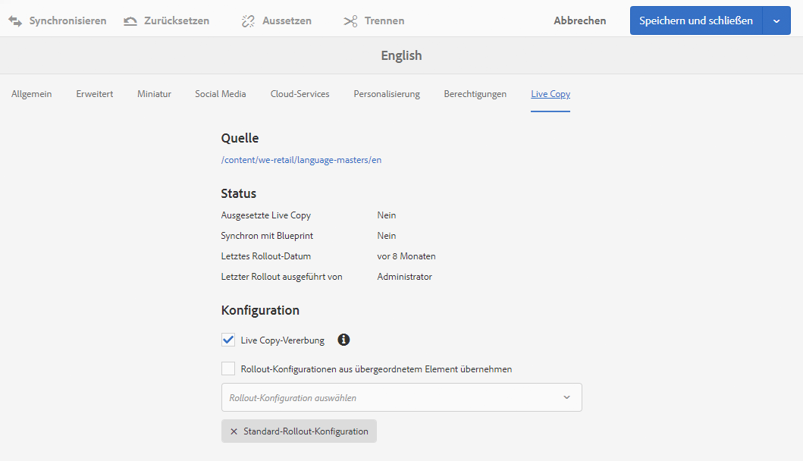
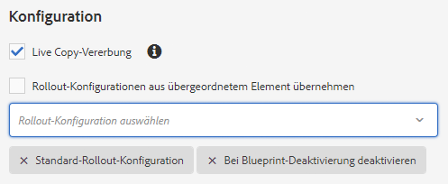

# Konfigurieren der Synchronisierung von Live Copies{#configuring-live-copy-synchronization}

Führen Sie die folgenden Schritte durch, um zu steuern, wie und wann Live Copies mit ihren Quellinhalten synchronisiert werden sollen.

* Entscheiden Sie, ob vorhandene Rollout-Konfigurationen Ihren Anforderungen entsprechen oder ob Sie neue Konfigurationen erstellen müssen.
* Legen Sie fest, welche Rollout-Konfigurationen für Ihre Live Copies verwendet werden sollen.

## Installierte und benutzerdefinierte Rollout-Konfigurationen {#installed-and-custom-rollout-configurations}

In diesem Abschnitt finden Sie Informationen zu den installierten Rollout-Konfigurationen und den von ihnen verwendeten Synchronisierungsaktionen. Außerdem erfahren Sie, wie Sie bei Bedarf benutzerdefinierte Konfigurationen erstellen.

>[!CAUTION]
>
>Das Aktualisieren oder Ändern einer vordefinierten (installierten) Rollout-Konfiguration wird **nicht** empfohlen. Wenn eine benutzerdefinierte Live-Aktion erforderlich ist, sollte sie in einer benutzerdefinierten Rollout-Konfiguration hinzugefügt werden.

### Rollout-Auslöser {#rollout-triggers}

Jede Rollout-Konfiguration nutzt einen Rollout-Auslöser, der den Rollout auslöst. Rollout-Konfigurationen können einen der folgenden Auslöser verwenden:

* **Bei Rollout**: Der Befehl **Rollout** wird auf der Blueprint-Seite genutzt oder der Befehl **Synchronisieren** wird auf der Live Copy-Seite verwendet.

* **Bei Modifizierung**: Die Quellseite wird bearbeitet.

* **Bei Aktivierung**: Die Quellseite wird aktiviert.

* **Bei Deaktivierung**: Die Quellseite wird deaktiviert.

>[!NOTE]
>
>Die Verwendung des Auslösers Bei Modifizierung kann die Leistung beeinträchtigen. Weitere Informationen finden Sie in den [Best Practices für MSM](/help/sites-administering/msm-best-practices.md#onmodify).

### Installierte Rollout-Konfigurationen  {#installed-rollout-configurations}

In der folgenden Tabelle sind die Rollout-Konfigurationen aufgeführt, die mit AEM installiert werden. Auslöser und Synchronisierungsaktionen jeder Rollout-Konfigurationen werden ebenfalls angegeben. Wenn die Aktionen der installierten Rollout-Konfigurationen Ihre Anforderungen nicht erfüllen, können Sie [eine neue Rollout-Konfiguration erstellen](#creating-a-rollout-configuration).

<table>
 <tbody>
  <tr>
   <th>Name</th>
   <th>Beschreibung</th>
   <th>Auslöser</th>
   <th>Synchronisierungsaktionen    siehe <a href="#installed-synchronization-actions">Installierte Synchronisierungsaktionen</a></th>
  </tr>
  <tr>
   <td>Standard-Rollout-Konfiguration</td>
   <td>Standard-Rollout-Konfiguration, die den Start des Rollout-Prozesses bei Rollout-Auslösern ermöglicht und Aktionen ausführt: Erstellen, Aktualisieren, Löschen von Inhalten und Sortierung untergeordneter Knoten.</td>
   <td>Bei Rollout</td>
   <td>contentUpdate  contentCopy  contentDelete  referencesUpdate  productUpdate  orderChildren</td>
  </tr>
  <tr>
   <td>Bei Blueprint-Aktivierung aktivieren</td>
   <td>Veröffentlicht die Live Copy, wenn die Quelle veröffentlicht wird.</td>
   <td>Bei Aktivierung</td>
   <td>targetActivate</td>
  </tr>
  <tr>
   <td>Bei Blueprint-Deaktivierung deaktivieren</td>
   <td>Deaktiviert die Live Copy, wenn die Quelle deaktiviert wird.</td>
   <td>Bei Deaktivierung</td>
   <td>targetDeactivate  </td>
  </tr>
  <tr>
   <td>Push bei Bearbeitung</td>
   <td>
Pusht die Inhalte zur Live Copy, wenn die Quelle bearbeitet wird.
 
Nutzen Sie diese Rollout-Konfiguration möglichst selten, da sie den Auslöser „Bei Modifizierung“ verwendet.
 </td>
   <td>Bei Modifizierung</td>
   <td>contentUpdate  contentCopy  contentDelete  referencesUpdate  orderChildren  </td>
  </tr>
  <tr>
   <td>Push bei Bearbeitung (leicht)</td>
   <td>
Pusht Inhalte bei einer Änderung der Blueprint-Seite zur Live Copy, ohne die Verweise zu aktualisieren (z. B. für leichte Kopien).
 
Nutzen Sie diese Rollout-Konfiguration möglichst selten, da sie den Auslöser „Bei Modifizierung“ verwendet.
 </td>
   <td>Bei Modifizierung</td>
   <td>contentUpdate  contentCopy  contentDelete  orderChildren</td>
  </tr>
  <tr>
   <td>Launch bewerben</td>
   <td>Standard-Rollout-Konfigurationen zur Veröffentlichung von Startseiten.</td>
   <td>Bei Rollout</td>
   <td>contentUpdate  contentCopy  contentDelete  referencesUpdate  orderChildren  markLiveRelationship</td>
  </tr>
  <tr>
   <td>Rollout-Konfiguration für Inhalt der Katalogseite</td>
   <td>Wendet Seitenvorlagen aus einer Katalog-Blueprint an.</td>
   <td>Bei Rollout</td>
   <td>contentUpdate  contentCopy  contentDelete  referencesUpdate  productCreateUpdate  orderChildren</td>
  </tr>
  <tr>
   <td>Rollout-Konfiguration für Aktualisierung der Katalogseite</td>
   <td>Wendet die Zieleigenschaften eines Katalog-Blueprints an. Muss nach „Rollout-Konfiguration für Inhalt der Katalogseite“ ausgeführt werden.</td>
   <td>Bei Rollout</td>
   <td>catalogRolloutHooks</td>
  </tr>
  <tr>
   <td>DPS-Rollout-Konfiguration für Veröffentlichungen</td>
   <td>DPS-Rollout-Konfiguration, die den Start eines Rollout-Prozesses auf den Rollout-Auslöser hin ermöglicht, während FolioProducer-Bindungseigenschaften beim anfänglichen Rollout ausgeschlossen werden.</td>
   <td>Bei Rollout</td>
   <td>contentUpdate  contentCopy  contentDelete  referencesUpdate  orderChildren  dpsMetadataFilter</td>
  </tr>
  <tr>
   <td>Veraltete (5.6.0) Katalog-Rollout-Konfiguration</td>
   <td>Entfernt. Verwenden Sie für Katalog-Rollouts Catalog Generator anstelle von MSM.</td>
   <td>Bei Rollout</td>
   <td>editProperties</td>
  </tr>
 </tbody>
</table>

### Installierte Synchronisierungsaktionen  {#installed-synchronization-actions}

In der folgenden Tabelle sind die Synchronisierungsaktionen aufgeführt, die mit AEM installiert werden. Wenn die installierten Aktionen nicht Ihren Anforderungen entsprechen, können Sie [eine neue Synchronisierungsaktion ](/help/sites-developing/extending-msm.md#creating-a-new-synchronization-action) erstellen.

<table>
 <tbody>
  <tr>
   <th>Aktionsname</th>
   <th>Beschreibung</th>
   <th>Eigenschaften  </th>
  </tr>
  <tr>
   <td>contentCopy</td>
   <td>Wenn Knoten der Quelle in der Live Copy nicht vorhanden sind, kopieren Sie die Knoten in die Live Copy. <a href="#excluding-properties-and-node-types-from-synchronization">Konfigurieren Sie den Service CQ MSM Content Copy Action</a>, um die Knotentypen, Absatzelemente und Seiteneigenschaften zu definieren, die ausgeschlossen werden sollen.   </td>
   <td> </td>
  </tr>
  <tr>
   <td>contentDelete</td>
   <td>
Löscht Knoten der Live Copy, die nicht in der Quelle vorhanden sind. <a href="#excluding-properties-and-node-types-from-synchronization">Konfigurieren Sie den Service CQ MSM Content Delete Action</a>, um die Knotentypen, Absatzelemente und Seiteneigenschaften zu definieren, die ausgeschlossen werden sollen. 
 </td>
   <td> </td>
  </tr>
  <tr>
   <td>contentUpdate</td>
   <td>Aktualisiert den Live Copy-Inhalt mit den Änderungen in der Quelle. <a href="#excluding-properties-and-node-types-from-synchronization">Konfigurieren Sie den Service CQ MSM Content Update Action</a>, um die Knotentypen, Absatzelemente und Seiteneigenschaften zu definieren, die ausgeschlossen werden sollen.   </td>
   <td> </td>
  </tr>
  <tr>
   <td>editProperties</td>
   <td>
Bearbeitet die Eigenschaften der Live Copy. Die editMap-Eigenschaft bestimmt, welche Eigenschaften bearbeitet werden, und legt ihren Wert fest. Der Wert der editMap-Eigenschaft muss das folgende Format verwenden:
 
<code>[property_name_1]#[current_value]#</code>[new_value],  <code>[property_name_2]#[current_value]#</code>[new_value],  ... ,  <code>[property_name_n]#[current_value]#</code>[new_value]
 
Die Elemente <code>current_value</code> und <code>new_value</code> sind reguläre Ausdrücke.   
 
Betrachten Sie beispielsweise den folgenden Wert für editMap:
 
<code>sling:resourceType#/</code>(contentpage|homepage)#/  mobilecontentpage,  cq:template#/contentpage#/mobilecontentpage
 
Dieser Wert bearbeitet die Eigenschaften der Live Copy-Knoten wie folgt:

    <ul>
     <li>Die <code>sling:resourceType</code>-Eigenschaften, die entweder auf <code>contentpage</code> oder auf <code>homepage</code> festgelegt sind, werden auf <code>mobilecontentpage.</code></li>
     <li>Die <code>cq:template</code>-Eigenschaften, die auf <code>contentpage</code> festgelegt sind, sind auf <code>mobilecontentpage.</code></li>
    </ul> </td>
   <td>
 
 
editMap: (String) Identifiziert die Eigenschaft, den aktuellen Wert und den neuen Wert. Weitere Informationen finden Sie in der Beschreibung.  
 </td>
  </tr>
  <tr>
   <td>Benachrichtigen</td>
   <td>Sendet ein Seitenereignis, dass das Rollout der Seite erfolgt ist. Um Benachrichtigungen zu erhalten, müssen Benutzer zunächst Rollout-Ereignisse abonnieren.</td>
   <td> </td>
  </tr>
  <tr>
   <td>orderChildren</td>
   <td>Auf der Live Copy werden die untergeordneten Elemente (Knoten) basierend auf der Reihenfolge im Blueprint sortiert  </td>
   <td> </td>
  </tr>
  <tr>
   <td>referencesUpdate</td>
   <td>
Auf der Live Copy  aktualisiert diese Synchronisationsaktion Referenzen wie Links. Sie sucht in den Live Copy-Seiten Pfade, die auf eine Ressource im Blueprint verweisen. Wenn sie solch einen Pfad gefunden hat, wird er so aktualisiert, dass er auf die zugehörige Ressource in der Live Copy (statt im Blueprint) verweist. Verweise, die Ziele außerhalb des Blueprints aufweisen, werden nicht geändert.
 
<a href="#excluding-properties-and-node-types-from-synchronization">Konfigurieren Sie den Service CQ MSM References Update Action</a>, um die Knotentypen, Absatzelemente und Seiteneigenschaften zu definieren, die ausgeschlossen werden sollen. 
 </td>
   <td> </td>
  </tr>
  <tr>
   <td>targetVersion</td>
   <td>
Erstellt eine Version der Live Copy.
 
Diese Aktion muss die einzige Synchronisierungsaktion in einer Rollout-Konfiguration sein.
 </td>
   <td> </td>
  </tr>
  <tr>
   <td>targetActivate</td>
   <td>
Aktiviert die Live Copy.
 
Diese Aktion muss die einzige Synchronisierungsaktion in einer Rollout-Konfiguration sein.
 </td>
   <td> </td>
  </tr>
  <tr>
   <td>targetDeactivate</td>
   <td>
Deaktiviert die Live Copy.
 
Diese Aktion muss die einzige Synchronisierungsaktion in einer Rollout-Konfiguration sein.
 </td>
   <td> </td>
  </tr>
  <tr>
   <td> Workflow</td>
   <td>
Startet den Workflow, der durch die Zieleigenschaft definiert ist (nur für Seiten), und nutzt die Live Copy als Nutzlast.
 
Der Zielpfad ist der Pfad des Modellknotens.
 </td>
   <td>target: (String) Der Pfad zum Workflow-Modell.  </td>
  </tr>
  <tr>
   <td>mandatory</td>
   <td>
Legt die Berechtigungen mehrerer ACLs auf der Live Copy-Seite für eine bestimmte Benutzergruppe auf Schreibzugriff fest. Die folgenden ACLs sind konfiguriert:

    <ul>
     <li>ActionSet.ACTION_NAME_REMOVE</li>
     <li>ActionSet.ACTION_NAME_SET_PROPERTY</li>
     <li>ActionSet.ACTION_NAME_ACL_MODIFY</li>
    </ul> 
Nutzen Sie diese Aktion nur für Seiten.
 </td>
   <td>target: (String) Die ID der Gruppe, für die Sie Berechtigungen festlegen.   </td>
  </tr>
  <tr>
   <td>mandatoryContent</td>
   <td>
Legt die Berechtigungen mehrerer ACLs auf der Live Copy-Seite für eine bestimmte Benutzergruppe auf Schreibzugriff fest. Die folgenden ACLs sind konfiguriert:

    <ul>
     <li>ActionSet.ACTION_NAME_SET_PROPERTY</li>
     <li>ActionSet.ACTION_NAME_ACL_MODIFY</li>
    </ul> 
Nutzen Sie diese Aktion nur für Seiten.
 </td>
   <td>target: (String) Die ID der Gruppe, für die Sie Berechtigungen festlegen. </td>
  </tr>
  <tr>
   <td>mandatoryStructure</td>
   <td>Legt die Berechtigung der ACL ActionSet.ACTION_NAME_REMOVE auf der Live Copy-Seite für eine bestimmte Benutzergruppe auf Schreibzugriff fest. Nutzen Sie diese Aktion nur für Seiten.</td>
   <td>target: (String) Die ID der Gruppe, für die Sie Berechtigungen festlegen. </td>
  </tr>
  <tr>
   <td>VersionCopyAction</td>
   <td>Wenn der Blueprint/die Quellseite mindestens einmal veröffentlicht wurde, wird eine Live Copy-Seite basierend auf der veröffentlichten Version erstellt. Anmerkung: Diese Aktion ist nur für das Erstellen einer Live Copy-Seite auf der Grundlage einer veröffentlichten Quellseite verfügbar, nicht für das Aktualisieren einer vorhandenen Live Copy-Seite. </td>
   <td> </td>
  </tr>
  <tr>
   <td>PageMoveAction</td>
   <td>
PageMoveAction gilt, wenn eine Seite in den Blueprint verschoben wurde.
 
Die Aktion kopiert (nicht: verschiebt) die zugehörige Live Copy-Seite vom Ort vor dem Verschieben zum Ort nach dem Verschieben.
 
Die Aktion PageMoveAction ändert dabei die Live Copy-Seite am Ort vor dem Verschieben nicht. Für die nachfolgenden Rollout-Konfigurationen weist diese Seite daher den Status der Live-Beziehung ohne Blueprint auf.
 
<a href="#excluding-properties-and-node-types-from-synchronization">Konfigurieren Sie den Service CQ MSM Page Move Action</a>, um die Knotentypen, Absatzelemente und Seiteneigenschaften festzulegen, die ausgeschlossen werden sollen. 
 
Diese Aktion muss die einzige Synchronisierungsaktion in einer Rollout-Konfiguration sein.
 </td>
   <td>
prop_referenceUpdate: (boolescher Wert) Aktualisiert bei „true“ die Verweise. Der Standardwert ist „true“.
 
 
 </td>
  </tr>
  <tr>
   <td>productCreateUpdate</td>
   <td>Erstellt oder aktualisiert Produktressourcen in einem Katalog. Diese Aktion soll in einer der folgenden Situationen verwendet werden:
    <ul>
     <li>Erstellung oder Veröffentlichung eines Katalogs (oder Katalogabschnitts)</li>
     <li>Ein Benutzer stellt die Synchronisierungsvererbung für eine Produktkomponente wieder her.</li>
    </ul> </td>
   <td> </td>
  </tr>
  <tr>
   <td>markLiveRelationship</td>
   <td>Gibt an, dass eine Live-Beziehung für Inhalt vorhanden ist, der für den Launch erstellt wurde.</td>
   <td> </td>
  </tr>
  <tr>
   <td>catalogRolloutHooks</td>
   <td>Führt Rollout-Hooks aus, die speziell für die Katalogerstellung ausgelegt sind. Ruft die Methoden executePageRolloutHooks und executeProductRolloutHooks vom Catalog Generator ab.  Siehe com.adobe.cq.commerce.pim.api.CatalogGenerator in den AEM-Javadocs.</td>
   <td> </td>
  </tr>
  <tr>
   <td>productUpdate</td>
   <td>Aktualisiert Produktseiten in einer Live Copy eines Produktkatalogs</td>
   <td> </td>
  </tr>
 </tbody>
</table>

### Erstellen einer Rollout-Konfiguration {#creating-a-rollout-configuration}

Sie können [eine Rollout-Konfiguration erstellen](/help/sites-developing/extending-msm.md#creating-a-new-rollout-configuration), wenn die installierten Rollout-Konfigurationen Ihre Anwendungsanforderungen nicht erfüllen:

* [Erstellen Sie die Rollout-Konfiguration.](/help/sites-developing/extending-msm.md#create-the-rollout-configuration)
* [Fügen Sie Synchronisierungsaktionen zur Rollout-Konfiguration hinzu](/help/sites-developing/extending-msm.md#add-synchronization-actions-to-the-rollout-configuration).

Die neue Rollout-Konfiguration steht dann zur Verfügung, wenn Sie die Rollout-Konfigurationen auf einem Blueprint oder einer Live Copy-Seite festlegen.

### Ausschließen von Eigenschaften und Knotentypen von der Synchronisierung {#excluding-properties-and-node-types-from-synchronization}

Sie können mehrere OSGi-Services konfigurieren, die die entsprechenden Synchronisierungsaktionen unterstützen, sodass sie sich nicht auf bestimmte Knotentypen und Eigenschaften auswirken. So sollten beispielsweise viele Eigenschaften und Unterknoten, die mit der internen Funktionstüchtigkeit von AEM zusammenhängen, nicht in einer Live Copy enthalten sein. Nur Inhalte, die für Benutzer der Seite relevant sind, sollten kopiert werden.

Bei der Verwendung von AEM gibt es mehrere Methoden zur Verwaltung der Konfigurationseinstellungen für solche Services. Weitere Informationen und empfohlene Praktiken finden Sie unter [Konfigurieren von OSGi](/help/sites-deploying/configuring-osgi.md).

In der folgenden Tabelle sind die Synchronisierungsaktionen aufgeführt, von denen Sie Knoten ausschließen können. Die Tabelle führt die Namen der Services an, die mit der Web-Konsole und der PID mit Repository-Knoten konfiguriert werden.

| Synchronisierungsaktion | Service-Name in der Web-Konsole | Service-PID |
|---|---|---|
| contentCopy | CQ MSM Content Copy Action | com.day.cq.wcm.msm.impl.actions.ContentCopyActionFactory |
| contentDelete | CQ MSM Content Delete Action | com.day.cq.wcm.msm.impl.actions.ContentDeleteActionFactory |
| contentUpdate | CQ MSM Content Update Action | com.day.cq.wcm.msm.impl.actions.ContentUpdateActionFactory |
| PageMoveAction | CQ MSM Page Move Action | com.day.cq.wcm.msm.impl.actions.PageMoveActionFactory |
| referencesUpdate | CQ MSM References Update Action | com.day.cq.wcm.msm.impl.actions.ReferencesUpdateActionFactory |

In der folgenden Tabelle werden die Eigenschaften beschrieben, die Sie konfigurieren können:

<table>
 <tbody>
  <tr>
   <th>Web-Konsoleneigenschaft/OSGi-Eigenschaft</th>
   <th>Beschreibung</th>
  </tr>
  <tr>
   <td>
Ausgeschlossene Knotentypen
 
cq.wcm.msm.action.excludednodetypes
 </td>
   <td>Ein regulärer Ausdruck, der die Knotentypen abgleicht, die von der Synchronisierungsaktion ausgeschlossen werden sollen.</td>
  </tr>
  <tr>
   <td>
Ausgeschlossene Absatzelemente
 
cq.wcm.msm.action.excludedparagraphitems
 </td>
   <td>Ein regulärer Ausdruck, der die Absatzelemente abgleicht, die von der Synchronisierungsaktion ausgeschlossen werden sollen.</td>
  </tr>
  <tr>
   <td>
Ausgeschlossene Seiteneigenschaften
 
cq.wcm.msm.action.excludedprops
 </td>
   <td>Ein regulärer Ausdruck, der die Seiteneigenschaften abgleicht, die von der Synchronisierungsaktion ausgeschlossen werden sollen.</td>
  </tr>
  <tr>
   <td>
Ignorierte Mixin-Knotentypen
 
cq.wcm.msm.action.ignoredMixin
 </td>
   <td>Nur für CQ MSM Content Update Action verfügbar. Ein regulärer Ausdruck, der die Namen von Mixin-Knotentypen abgleicht, die von der Synchronisierungsaktion ausgeschlossen werden sollen.</td>
  </tr>
 </tbody>
</table>

>[!NOTE]
>
>In der klassischen Benutzeroberfläche spiegelt das Schlosssymbol, das im Dialogfeld „Seiteneigenschaften“ für Live Copy-Seiten angezeigt wird, nicht die Konfiguration der Eigenschaft „Ausgeschlossene Seiteneigenschaften“ wider. Dieses Symbol wird auch für Eigenschaften angezeigt, die von der Synchronisierungsaktion ausgeschlossen sind.

>[!NOTE]
>
>Informationen zur Touch-optimierten Benutzeroberfläche finden Sie unter [Konfigurieren von MSM-Sperren für Seiteneigenschaften (Touch-optimierte Benutzeroberfläche)](/help/sites-developing/extending-msm.md#configuring-msm-locks-on-pagep-roperties-touch-optimized-ui).

#### CQ MSM Content Update Action – Ausschlüsse {#cq-msm-content-update-action-exclusions}

Einige Eigenschaften und Knotentypen sind standardmäßig ausgeschlossen. Sie sind in der OSGi-Konfiguration der Aktion **CQ MSM Content Update Action** unter **Ausgeschlossene Seiteneigenschaften** definiert.

Standardmäßig werden Eigenschaften, die mit den folgenden regulären Ausdrücken übereinstimmen, beim Rollout ausgeschlossen (d. h. nicht aktualisiert):

Sie können die Ausdrücke, die die Ausschlussliste definieren, bei Bedarf ändern.

Wenn Sie beispielsweise möchten, dass die Seite **Title** bei den Änderungen enthalten sein soll, die beim Rollout berücksichtigt werden, entfernen Sie `jcr:title` von den Ausschlüssen, z. B. mit dem regulären Ausdruck:

`jcr:(?!(title)$).*`

### Konfigurieren der Synchronisierung für die Aktualisierung von Verweisen {#configuring-synchronization-for-updating-references}

Sie können mehrere OSGi-Services konfigurieren, die die entsprechenden Synchronisierungsaktionen im Zusammenhang mit der Aktualisierung von Verweisen unterstützen.

Bei der Verwendung von AEM gibt es mehrere Methoden zur Verwaltung der Konfigurationseinstellungen für solche Services. Weitere Informationen und empfohlene Praktiken finden Sie unter [Konfigurieren von OSGi](/help/sites-deploying/configuring-osgi.md).

In der folgenden Tabelle sind die Synchronisierungsaktionen aufgeführt, für die Sie die Verweisaktualisierung festlegen können. Die Tabelle führt die Namen der Services an, die mit der Web-Konsole und der PID mit Repository-Knoten konfiguriert werden.

<table>
 <tbody>
  <tr>
   <th>Web-Konsoleneigenschaft/OSGi-Eigenschaft</th>
   <th>Beschreibung</th>
  </tr>
  <tr>
   <td>
Referenz über verschachtelte Live Copies aktualisieren
 
cq.wcm.msm.impl.action.referencesupdate.prop_updateNested
 </td>
   <td>Nur verfügbar für die Aktualisierungsaktion "CQ MSM References". Wählen Sie diese Option (Web-Konsole) oder legen Sie diese boolesche Eigenschaft auf "true"(Repository-Konfiguration) fest, um Verweise zu ersetzen, die auf eine Ressource abzielen, die sich im Zweig der obersten Live Copy befindet.</td>
  </tr>
  <tr>
   <td>
Verweisende Seiten aktualisieren
 
cq.wcm.msm.impl.actions.pagemove.prop_referenceUpdate
 </td>
   <td>Nur für CQ MSM Page Move Action verfügbar. Wählen Sie diese Option (Web-Konsole) oder legen Sie diese boolesche Eigenschaft auf <code>true</code> (Repository-Konfiguration) fest, um alle Verweise zu aktualisieren, sodass die Originalseite verwendet wird, um stattdessen auf die LiveCopy-Seite zu verweisen.</td>
  </tr>
 </tbody>
</table>

## Festlegen der zu verwendenden Rollout-Konfigurationen {#specifying-the-rollout-configurations-to-use}

Bei MSM können Sie Sätze von Rollout-Konfigurationen festlegen, die allgemein genutzt werden, und sie bei Bedarf für bestimmte Live Copies überschreiben. MSM bietet mehrere Orte, an denen Sie die zu verwendenden Rollout-Konfigurationen festlegen können. Der Ort bestimmt, ob eine Konfiguration für eine bestimmte Live Copy gilt.

Die folgende Liste der Orte, unter denen Sie die zu verwendenden Rollout-Konfigurationen festlegen können, beschreibt, wie MSM bestimmt, welche Rollout-Konfigurationen für eine Live Copy genutzt werden:

* **[Eigenschaften der Live Copy-Seite](/help/sites-administering/msm-sync.md#setting-the-rollout-configurations-for-a-live-copy-page):** Wenn eine Live Copy-Seite so konfiguriert ist, dass sie mindestens eine Rollout-Konfiguration verwenden soll, nutzt MSM diese Rollout-Konfigurationen.
* **[Eigenschaften der Blueprint-Seiten](/help/sites-administering/msm-sync.md#setting-the-rollout-configuration-for-a-blueprint-page):** Wenn eine Live Copy auf einem Blueprint basiert und die Live Copy-Seite nicht mit einer Rollout-Konfiguration konfiguriert ist, wird die Rollout-Konfiguration genutzt, die mit der Blueprint-Quellseite verknüpft ist.
* **Eigenschaften der übergeordneten Live Copy-Seite:**  Wenn weder die Live Copy-Seite noch die Blueprint-Quellseite mit einer Rollout-Konfiguration konfiguriert sind, wird die Rollout-Konfiguration verwendet, die für die übergeordnete Seite der Live Copy-Seite gilt.
* **[Systemstandard](/help/sites-administering/msm-sync.md#setting-the-system-default-rollout-configuration):** Wenn die Rollout-Konfiguration der übergeordneten Seite der Live Copy nicht ermittelt werden kann, wird die standardmäßige Rollout-Konfiguration des Systems verwendet.

Beispielsweise nutzt ein Blueprint die We.Retail-Referenzwebsite als Quellinhalt. Aus dem Blueprint wird eine Website erstellt. Jedes Element der folgenden Liste beschreibt ein anderes Szenario hinsichtlich der Nutzung von Rollout-Konfigurationen:

* Keine Blueprint-Seiten oder Live Copy-Seiten sind für eine Rollout-Konfiguration konfiguriert. MSM nutzt die standardmäßige Rollout-Konfiguration für alle Live Copy-Seiten.
* Die Stammseite der We.Retail-Referenzwebsite ist für mehrere Rollout-Konfigurationen konfiguriert. MSM nutzt diese Rollout-Konfigurationen für alle Live Copy-Seiten.
* Die Stammseite der Referenz-Site &quot;We.Retail&quot;ist mit mehreren Rollout-Konfigurationen konfiguriert und die Stammseite der Live Copy-Site wird mit einem anderen Satz von Rollout-Konfigurationen konfiguriert. MSM nutzt die Rollout-Konfigurationen, die auf der Stammseite der Live Copy-Website konfiguriert sind.

### Festlegen der Rollout-Konfigurationen für eine Live Copy-Seite {#setting-the-rollout-configurations-for-a-live-copy-page}

Konfigurieren Sie eine Live Copy-Seite mit den Rollout-Konfigurationen, die beim Rollout der Quellseite genutzt werden sollen. Untergeordnete Seiten erben diese Konfiguration standardmäßig. Wenn Sie die zu verwendende Rollout-Konfiguration konfigurieren, überschreiben Sie die Konfiguration, die die Live Copy-Seite von der übergeordneten Seite erbt.

Sie können die Rollout-Konfigurationen für eine Live Copy-Seite auch konfigurieren, wenn Sie [die Live Copy erstellen](/help/sites-administering/msm-livecopy.md#creating-a-live-copy-of-a-page).

1. Wählen Sie über die **Sites-Konsole** die Live Copy-Seite aus.
1. Wählen Sie in der Symbolleiste **Eigenschaften** aus.
1. Öffnen Sie die Registerkarte **Live Copy**.

   Im Bereich **Konfigurationen** werden die Rollout-Konfigurationen angezeigt, die die Seite erbt.

   

1. Passen Sie bei Bedarf die Markierung **Live Copy-Vererbung** an. Bei Auswahl dieser Option gilt die Life Copy-Konfiguration für alle untergeordneten Elemente.

1. Löschen Sie die Eigenschaft **Rollout-Konfiguration aus übergeordnetem Element übernehmen** und wählen Sie dann mindestens eine Rollout-Konfiguration aus der Liste aus.

   Die ausgewählten Rollout-Konfigurationen werden unter der Dropdown-Liste angezeigt.

   

1. Klicken oder tippen Sie auf **Speichern**.

### Festlegen der Rollout-Konfiguration für eine Blueprint-Seite {#setting-the-rollout-configuration-for-a-blueprint-page}

Konfigurieren Sie eine Blueprint-Seite mit den Rollout-Konfigurationen, die beim Rollout der Blueprint-Seite genutzt werden sollen.

Beachten Sie, dass die untergeordneten Seiten der Blueprint-Seite die Konfiguration erben. Wenn Sie die zu verwendende Rollout-Konfiguration konfigurieren, überschreiben Sie die Konfiguration, die die Seite von der übergeordneten Seite erbt.

1. Wählen Sie über die **Sites-Konsole** die Stammseite des Blueprints aus.
1. Wählen Sie in der Symbolleiste **Eigenschaften** aus.
1. Öffnen Sie die Registerkarte **Blueprint**.
1. Wählen Sie mit dem Dropdown-Selektor mindestens eine **Rollout-Konfigurationen** aus.
1. Übernehmen Sie die Aktualisierungen mit **Speichern**.

### Festlegen der standardmäßigen Rollout-Konfiguration {#setting-the-system-default-rollout-configuration}

Legen Sie eine Rollout-Konfiguration fest, die als Systemstandard genutzt werden soll. Um die Standardkonfiguration festzulegen, konfigurieren Sie den OSGi-Dienst:

* **Day CQ WCM Live Relationship Manager**  Die Dienst-PID ist . 
`com.day.cq.wcm.msm.impl.LiveRelationshipManagerImpl`

Konfigurieren Sie den Dienst entweder über die [Web-Konsole](/help/sites-deploying/configuring-osgi.md#osgi-configuration-with-the-web-console) oder einen [Repository-Knoten](/help/sites-deploying/configuring-osgi.md#osgi-configuration-in-the-repository).

* In der Web-Konsole ist der Name der zu konfigurierenden Eigenschaft Standardmäßige Rollout-Konfiguration.
* Bei Verwendung eines Repository-Knotens ist der Name der zu konfigurierenden Eigenschaft `liverelationshipmgr.relationsconfig.default`.

Legen Sie diesen Eigenschaftswert auf den Pfad der Rollout-Konfiguration fest, die als Systemstandard genutzt werden soll. Der Standardwert ist `/libs/msm/wcm/rolloutconfigs/default`, was der **Standard-Rollout-Konfiguration** entspricht.
