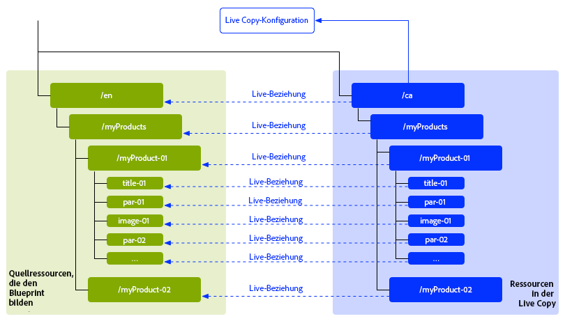
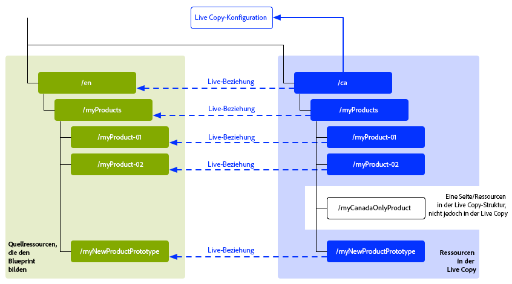
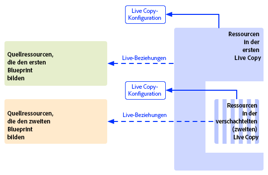
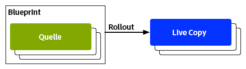

# Wiederverwenden von Inhalten: Multi Site Manager und Live Copy{#reusing-content-multi-site-manager-and-live-copy}

Multi Site Manager (MSM) ermöglicht Ihnen die Verwendung derselben Website-Inhalte an mehreren Orten.  MSM verwendet seine Live Copy-Funktion, um Folgendes zu erreichen:

* Mit MSM können Sie:

   * Inhalte einmalig erstellen und diese
   * in andere Bereiche derselben Site oder anderer Sites kopieren und wiederverwenden ([Live Copies](#live-copies)).

* MSM behält dann die (Live-)Beziehungen zwischen Ihren Quellinhalten und deren Live Copies bei, sodass:

   * die Quelle und die Live Copies synchronisiert werden, wenn Sie Änderungen an den Quellinhalten vornehmen (um diese Änderungen auch auf die Live Copies anzuwenden).
   * Sie Anpassungen am Inhalt der Live Copies vornehmen können, indem Sie die Live-Beziehung zu einzelnen Unterseiten und/oder Komponenten oder zu beidem trennen.  Hierdurch werden Änderungen an der Quelle nicht mehr auf die Live Copy angewendet.

Die entsprechenden Themen werden auf dieser Seite sowie auf den folgenden Seiten behandelt:

* [Erstellen und Synchronisieren von Live Copies](/help/sites-administering/msm-livecopy.md)
* [Konsole „Live Copy-Übersicht“](/help/sites-administering/msm-livecopy-overview.md)
* [Konfigurieren der Synchronisierung von Live Copies](/help/sites-administering/msm-sync.md)
* [MSM-Rollout-Konflikte](/help/sites-administering/msm-rollout-conflicts.md)
* [Best Practices für MSM](/help/sites-administering/msm-best-practices.md)

## Mögliche Szenarien {#possible-scenarios}

Es gibt viele Nutzungsszenarios für MSM und Live Copies. Einige der Szenarios umfassen Folgendes:

* **Multinational: von globalen zu lokalen Unternehmen**

  Ein typisches Anwendungsbeispiel, das von MSM unterstützt wird, ist die Wiederverwendung von Inhalten auf mehreren multinationalen Sites mit derselben Sprache. Dies ermöglicht die Wiederverwendung der Kerninhalte und lässt gleichzeitig Abweichungen für verschiedene Länder zu.

  So wurde zum Beispiel der englische Abschnitt der We.Retail-Referenzsite für Kundinnen und Kunden in den USA erstellt.  Die meisten Inhalte auf dieser Site können auch für andere We.Retail-Sites verwendet werden, die sich an englischsprachige Kundinnen und Kunden aus verschiedenen Ländern und Kulturkreisen richten.  Der Kerninhalt bleibt auf allen Sites gleich, wobei regionale Anpassungen vorgenommen werden können.

  Die folgende Struktur kann für Sites in den Vereinigten Staaten, Großbritannien, Kanada und Australien verwendet werden:

  ```xml
  /content
      |- we.retail
          |- language-masters
              |- en
      |- we.retail
          |- us
              |- en
      |- we.retail
          |- gb
              |- en
      |- we.retail
          |- ca
              |- en
      |- we.retail
          |- au
              |- en
  ```

  >[!NOTE]
  >
  >MSM übersetzt die Inhalte nicht. Er wird zur Erstellung der erforderlichen Struktur und zur Bereitstellung von Inhalten verwendet.
  >
  >
  >Unter [Übersetzen von Inhalten für mehrsprachige Sites](/help/sites-administering/translation.md) finden Sie weitere Informationen zu einem solchen Beispiel.

* **National – Zentrale zu Zweigstellen**

  Alternativ dazu wünscht sich ein Unternehmen mit einem Händlernetzwerk vielleicht separate Websites für seine einzelnen Verkaufsvertretungen, von denen jede eine Variante der von der Zentrale bereitgestellten Haupt-Site darstellt. Dies kann für ein einziges Unternehmen mit mehreren regionalen Niederlassungen oder für ein landesweites Franchise-System mit einem zentralen Franchise-Geber und mehreren lokalen Franchise-Nehmern eingesetzt werden.

  Die Zentrale kann die Kerninformationen bereitstellen und die regionalen Standorte können lokale Informationen wie Kontaktdetails, Geschäftszeiten und Veranstaltungen ergänzen.

  ```xml
  /content
      |- head-office-Berlin
      |- branch-Hamburg
      |- branch-Stuttgart
      |- branch-Munich
      |- branch-Frankfurt
  ```

* **Mehrere Versionen**

  Sie können MSM auch verwenden, um Versionen einer bestimmten Unterverzweigung zu erstellen. Beispielsweise kann eine Unter-Website für den Support Details zu den verschiedenen Versionen eines bestimmten Produkts enthalten, wobei die Basisinformationen konstant bleiben und nur die aktualisierten Funktionen geändert werden müssen:

  ```xml
  /content
      |- support
          |- product X
              |- v5.0
              |- v4.0
              |- v3.0
              |- v2.0
              |- v1.0
  ```

  >[!NOTE]
  >
  >Bei einem solchen Szenario stellt sich immer die Frage, ob eine direkte Kopie erstellt oder Live Copies verwendet werden sollen:
  >
  >Hierbei muss abgewogen werden:
  >
  >  * welcher Anteil des Kerninhalts über die diversen Versionen hinweg aktualisiert werden muss
  >
  >und
  >
  >  * welcher Anteil der einzelnen Kopien angepasst werden muss.

## MSM über die Benutzeroberfläche {#msm-from-the-ui}

Auf MSM kann mithilfe verschiedener Optionen der jeweiligen Konsole direkt über die Benutzeroberfläche zugegriffen werden. Um eine Einführung bereitzustellen, werden im Folgenden die Hauptstandorte aufgeführt:

* **Website erstellen** (**Sites**)

   * MSM unterstützt Sie bei der Verwaltung mehrerer Websites, die gemeinsame Inhalte enthalten. Zum Beispiel werden Websites für internationale Zielgruppen oft so bereitgestellt, dass die meisten Inhalte für alle Länder gleich sind und eine Teilmenge der Inhalte sich speziell auf die einzelnen Länder bezieht.  MSM ermöglicht Ihnen die [Erstellung von Live Copies, die automatisch eine oder mehrere Sites basierend auf Ihrer Quell-Site aktualisieren](/help/sites-administering/msm-livecopy.md#creating-a-live-copy-of-a-site-from-a-blueprint-configuration). Dies hilft Ihnen auch dabei, eine gemeinsame Basisstruktur zu erzwingen, die gemeinsamen Inhalte auf mehreren Sites zu nutzen, ein gemeinsames Erscheinungsbild zu erreichen und die Maßnahmen auf die Verwaltung derjenigen Inhalte zu konzentrieren, die sich auf den verschiedenen Sites tatsächlich unterscheiden.
   * Für die Angabe der Quelle ist eine vordefinierte Blueprint-Konfiguration erforderlich.
   * Es wird eine Live Copy der (vordefinierten) Quelle erstellt.
   * Sie bietet den Benutzenden die **Rollout**-Schaltfläche.

* **Erstellen einer Live Copy** (**Sites**)

   * MSM ermöglicht Ihnen die [Erstellung ad hoc (einmalig) einer Live Copy der einzelnen Seite oder der Unterverzweigung einer Website](/help/sites-administering/msm-livecopy.md#creating-a-live-copy-of-a-page), wie zum Beispiel das Duplizieren einer Unterverzweigung zur Bereitstellung von Informationen über eine neue/aktualisierte Version eines Produkts.
   * Erstellt eine Live Copy ad hoc (keine Blueprint-Konfiguration erforderlich).
   * Kann verwendet werden, um (sofort) eine Live Copy einer beliebigen Seite/Verzweigung zu erstellen.
   * Erfordert die Option **Synchronisieren** (die **Rollout**-Schaltfläche wird nicht bereitgestellt).

* **Eigenschaften anzeigen** (**Sites**)

   * Bei Bedarf hilft Ihnen diese Option bei der [Überwachung Ihrer Live Copy](/help/sites-administering/msm-livecopy.md#monitoring-your-live-copy) durch Bereitstellung von Informationen zur zugehörigen **Live Copy** oder zur **Blueprint**.

* **Verweise** (**Sites**)

   * Die Leiste [Verweise](/help/sites-authoring/basic-handling.md#references) stellt Ihnen Informationen zu den **Live Copies** sowie den Zugriff auf die entsprechenden Aktionen bereit.

* **Live Copy-Übersicht** (**Sites**)

   * Diese Konsole ermöglicht Ihnen die [Ansicht und Verwaltung Ihres Blueprints und dessen Live Copies](/help/sites-administering/msm-livecopy-overview.md).

* **Blueprints** (**Tools** – **Sites**)

   * Diese Konsole ermöglicht Ihnen die [Erstellung und Verwaltung Ihrer Blueprint-Konfigurationen](/help/sites-administering/msm-livecopy.md#creating-a-blueprint-configuration).

>[!NOTE]
>
>MSM kann sowohl mit Seiten als auch mit [Experience Fragments](/help/sites-authoring/experience-fragments.md) da diese Fragmente Teil eines Erlebnisses (Seite) sind.

>[!NOTE]
>
>Aspekte der MSM-Funktionalität werden in mehreren anderen Adobe Experience Manager(AEM)-Funktionen verwendet (z. B. Launches, Katalog). In diesen Fällen wird die Live Copy von dieser Funktion verwaltet.

### Verwendete Begriffe {#terms-used}

Zur Einführung bietet die folgende Tabelle einen Überblick über die wichtigsten MSM-Begriffe. Diese werden in den folgenden Abschnitten und auf den folgenden Seiten detaillierter erläutert:

<table>
 <tbody>
  <tr>
   <td><strong>Begriff</strong></td>
   <td><strong>Definition</strong></td>
   <td><strong>Weitere Einzelheiten</strong></td>
  </tr>
  <tr>
   <td><strong>Quelle</strong></td>
   <td>Die Originalseiten.</td>
   <td>Synonym für Blueprints und/oder Blueprint-Seiten.</td>
  </tr>
  <tr>
   <td><strong>Live Copy</strong></td>
   <td>Die Kopie (der Quelle), die wie durch die Rollout-Konfigurationen definiert von Synchronisierungsaktionen aufrechterhalten wird. </td>
   <td> </td>
  </tr>
  <tr>
   <td><strong>Live Copy-Konfiguration</strong></td>
   <td>Festlegen der Konfigurationsdetails für eine Live Copy.</td>
   <td> </td>
  </tr>
  <tr>
   <td><strong>Live-Beziehung</strong><br /> </td>
   <td>Effektive Definition der Vererbung für eine bestimmte Ressource, d. h. die Verbindungen zwischen der Quelle und den Live Copies.<br /> </td>
   <td>Stellt sicher, dass Änderungen an der Quelle mit der Live Copy synchronisiert werden.</td>
  </tr>
  <tr>
   <td><strong>Blueprint</strong></td>
   <td>Synonym für Quelle.</td>
   <td>Kann durch eine Blueprint-Konfiguration definiert werden.</td>
  </tr>
  <tr>
   <td><strong>Blueprint-Konfiguration</strong></td>
   <td>Vordefinierte Konfiguration, die einen Quellpfad angibt.</td>
   <td>Wenn in einer Blueprint-Konfiguration auf eine Blueprint-Seite verwiesen wird, wird der Rollout-Befehl verfügbar.</td>
  </tr>
  <tr>
   <td><strong>Synchronisierung</strong></td>
   <td>Der allgemeine Begriff für die Synchronisierung von Inhalten zwischen der Quelle und den Live Copies (sowohl durch <strong>Rollout</strong> als auch <strong>Synchronisieren</strong>).</td>
   <td> </td>
  </tr>
  <tr>
   <td><strong>Rollout</strong><br /> </td>
   <td>Synchronisiert die Live Copy mit der Quelle.<br />Wird von einer Autorin bzw. einem Autor (auf einer Blueprint-Seite) oder von einem Systemereignis (wie durch die Rollout-Konfiguration definiert) ausgelöst.</td>
   <td> </td>
  </tr>
  <tr>
   <td><strong>Rollout-Konfiguration</strong></td>
   <td>Regeln, die bestimmen, welche Eigenschaften wie und wann synchronisiert werden.</td>
   <td> </td>
  </tr>
  <tr>
   <td><strong>Synchronisieren</strong></td>
   <td>Eine manuelle Anforderung einer Synchronisierung, die über die Live Copy-Seiten erfolgt.</td>
   <td> </td>
  </tr>
  <tr>
   <td><strong>Vererbung</strong></td>
   <td>Eine Live Copy-Seite/-Komponente übernimmt bei einer Synchronisierung Inhalte von der Quellseite/-komponente.</td>
   <td> </td>
  </tr>
  <tr>
   <td><strong>Aussetzen</strong></td>
   <td>Entfernt vorübergehend die Live-Beziehung zwischen einer Live Copy und der zugehörigen Blueprint-Seite.</td>
   <td> </td>
  </tr>
  <tr>
   <td><strong>Trennen</strong></td>
   <td>Entfernt dauerhaft die Live-Beziehung zwischen einer Live Copy und der zugehörigen Blueprint-Seite.</td>
   <td> </td>
  </tr>
  <tr>
   <td><strong>Zurücksetzen</strong></td>
   <td><p>Zurücksetzen einer Live Copy-Seite, um:</p>
    <ul>
     <li>alle abgebrochenen Vererbungsvorgänge zu entfernen und<br /> </li>
     <li>die Seite in denselben Status wie die Quellseite zurückzuversetzen.</li>
    </ul> <p>Eine Rücksetzung wirkt sich auf alle von Ihnen durchgeführten Änderungen an den Seiteneigenschaften, am Absatzsystem und an den Komponenten aus.</p> </td>
   <td> </td>
  </tr>
  <tr>
   <td><strong>Flach</strong></td>
   <td>Eine Live Copy einer einzelnen Seite.</td>
   <td> </td>
  </tr>
  <tr>
   <td><strong>Tief</strong></td>
   <td>Eine Live Copy einer Seite zusammen mit ihren untergeordneten Seiten.</td>
   <td> </td>
  </tr>
 </tbody>
</table>

>[!NOTE]
>
>Unter [Überblick über die Java™-API](/help/sites-developing/extending-msm.md#overview-of-the-java-api) finden Sie die Objektnamen.

## Live Copies {#live-copies}

Eine MSM-Live Copy ist eine Kopie spezifischer Site-Inhalte, die eine Live-Beziehung mit der Originalquelle beibehalten:

* Die Live Copy übernimmt Inhalte aus ihrer Quelle.
* Die Synchronisierung führt die tatsächliche Übertragung von Inhalten durch, wenn Änderungen an der Quelle vorgenommen werden.
* Eine Live Copy kann folgendermaßen betrachtet werden:

   * Flach: eine einzelne Seite
   * Tief: die Seite mit ihren untergeordneten Seiten

* Synchronisierungsregeln – sogenannte Rollout-Konfigurationen – bestimmen, welche Eigenschaften synchronisiert werden und wann die Synchronisierung erfolgt.

Im vorherigen Beispiel ist `/content/we-retail/language-masters/en` die globale primäre Site in englischer Sprache. Zur Wiederverwendung des Inhalts dieser Site werden MSM-Live Copies erstellt:

* Der Inhalt unter `/content/we-retail/language-masters/en` ist die Quelle.

* Der Inhalt unter `/content/we-retail/language-masters/en` wird unter die Knoten `/content/we-retail/us/en/`, `/content/we-retail/gb/en`, `/content/we-retail/ca/en` und `/content/we-retail/au/en` kopiert. Dies sind die Live Copies.

* Autorinnen und Autoren können die Seiten unterhalb von `/content/we-retail/language-masters/en` ändern.
* Nach der Auslösung synchronisiert MSM diese Änderungen mit den Live Copies.

### Live Copies – Komposition {#live-copies-composition}

>[!NOTE]
>
>Die Diagramme und Beschreibungen in diesem Abschnitt stellen Momentaufnahmen der potenziellen Live Copies dar. Sie erheben keinen Anspruch auf Vollständigkeit, stellen jedoch einen Überblick bereit, um bestimmte Merkmale hervorzuheben.

Beim erstmaligen Erstellen einer Live Copy werden die ausgewählten Quellseiten 1:1 in der Live Copy wiedergegeben. Danach können neue Ressourcen (Seiten und/oder Absätze) auch direkt innerhalb der Live Copy erstellt werden. Daher ist es hilfreich, sich dieser Varianten und ihrer Auswirkungen auf die Synchronisierung bewusst zu sein. Mögliche Kompositionen umfassen:

* [Live Copy mit Live Copy-fremden Seiten](#live-copy-with-non-live-copy-pages)
* [Verschachtelte Live Copies](#nested-live-copies)

Die grundlegende Form einer Live Copy verfügt über:

* Live Copy-Seiten, die die ausgewählten Quellseiten 1:1 wiedergeben
* eine Konfigurationsdefinition
* eine für jede Ressource definierte Live-Beziehung, die Folgendes bewerkstelligt:

   * Verknüpft die Live Copy-Ressource mit ihrer Blueprint/Quelle
   * Wird bei der Umsetzung von Vererbung und Rollout verwendet.

* Abhängig von den Anforderungen können Änderungen [synchronisiert](/help/sites-administering/msm-livecopy.md#synchronizing-your-live-copy) werden.



#### Live Copy mit Live Copy-fremden Seiten {#live-copy-with-non-live-copy-pages}

Wenn Sie in AEM eine Live Copy erstellen, können Sie die Live Copy-Verzweigung sehen sowie durch diese navigieren und normale AEM-Funktionen auf der Live Copy-Verzweigung verwenden. Dies bedeutet, dass Sie (oder ein Prozess) neue Ressourcen (Seiten und/oder Absätze) innerhalb der Live Copy-Verzweigung erstellen können. Zum Beispiel: `myCanadaOnlyProduct`.

* Solche Ressourcen verfügen über keine Live-Beziehung zu Quell-/Blueprint-Seiten und werden nicht synchronisiert.
* Es können Szenarien auftreten, die das MSM als Spezialfälle behandelt. Ein Beispiel hierfür wäre, wenn Sie (oder ein Prozess) eine Seite mit der gleichen Position und dem gleichen Namen sowohl in der Quelle/Blueprint als auch in den Live Copy-Zweigen erstellen. Bei solchen Situationen finden Sie unter [MSM-Rollout-Konflikte](/help/sites-administering/msm-rollout-conflicts.md) weitere Informationen.



#### Verschachtelte Live Copies {#nested-live-copies}

Wenn Sie (oder ein Prozess) eine [neue Seite innerhalb einer vorhandenen Live Copy](#live-copy-with-non-live-copy-pages) erstellen, kann diese neue Seite auch als Live Copy eines anderen Blueprints eingerichtet werden. Dies wird als verschachtelte Live Copy bezeichnet. Hier wird das Verhalten der zweiten (inneren) Live Copy durch die zweite (äußere) Live Copy auf folgende Weise beeinflusst:

* Ein tiefes Rollout, das für die Live Copy der obersten Ebene ausgelöst wurde, kann in einer verschachtelten Live Copy fortgeführt werden (zum Beispiel bei übereinstimmendem Auslöser).
* Alle Links zwischen den Quellen werden innerhalb der Live Copies neu geschrieben.

  Es werden zum Beispiel Links vom zweiten auf den ersten Blueprint neu als Links von der verschachtelten/zweiten Live Copy auf die erste Live Copy geschrieben.



>[!NOTE]
>
>Wenn Sie eine Seite innerhalb der Live Copy-Verzweigung verschieben/umbenennen, wird dies (intern) als verschachtelte Live Copy behandelt, um AEM die Rückverfolgung der Beziehungen zu ermöglichen.

#### Gestapelte Live Copies {#stacked-live-copies}

Eine Live Copy wird als gestapelte Live Copy bezeichnet, wenn sie als untergeordnetes Element einer flachen Live Copy erstellt wird. Sie verhält sich auf die gleiche Weise wie eine [verschachtelte Live Copy](#nested-live-copies).

### Quelle, Blueprints und Blueprint-Konfigurationen {#source-blueprints-and-blueprint-configurations}

Jede Seite oder Verzweigung von Seiten kann als Quelle einer Live Copy verwendet werden.

MSM ermöglicht Ihnen allerdings auch die Definition einer Blueprint-Konfiguration, die einen Quellpfad angibt.  Eine Blueprint-Konfiguration hat die folgenden Vorteile:

* Der Autor kann für eine Blueprint die Option **Rollout** verwenden und so (explizit) Änderungen an Live Copies pushen, die von dieser Blueprint erben.
* Der Autor kann **Website erstellen** nutzen, wodurch der Benutzer einfach Sprachen auswählen und die Struktur der Live Copy konfigurieren kann;
* Sie definiert eine standardmäßige Rollout-Konfiguration für Live Copies, die über eine Beziehung mit der Blueprint verfügen.

Bei der Quelle einer Live Copy kann es sich entweder um reguläre Seiten handeln oder um Seiten, die von einer Blueprint-Konfiguration abgedeckt sind. Beide sind gültige Anwendungsfälle.

Die Quelle bildet die Blueprint für die Live Copy. Die Blueprint wird durch eine der folgenden Maßnahmen definiert:

* [Erstellen einer Blueprint-Konfiguration](/help/sites-administering/msm-livecopy.md#creating-a-blueprint-configuration)

  Die Konfiguration definiert (vorab) die zur Erstellung der Live Copy zu verwendenden Seiten.

* [Erstellen von Live Copies einer Seite](/help/sites-administering/msm-livecopy.md#creating-a-live-copy-of-a-page)

  Die zum Erstellen der Live Copy (der Quellseiten) verwendeten Seiten sind Blueprint-Seiten.

  Die Quellseite kann von einer Blueprint-Konfiguration referenziert werden oder nicht.

### Rollout und Synchronisieren {#rollout-and-synchronize}

Ein Rollout ist die zentrale MSM-Aktion, die Live Copies mit ihrer Quelle synchronisiert. Sie können Rollouts manuell ausführen oder sie werden automatisch durchgeführt:

* Es kann eine [Rollout-Konfiguration](#rollout-configurations) definiert werden, sodass spezifische [Ereignisse](/help/sites-administering/msm-sync.md#rollout-triggers) eine automatische Ausführung eines Rollouts bewirken.
* Beim Bearbeiten einer Blueprint-Seite pushen Sie mit dem Befehl [Rollout](/help/sites-administering/msm-livecopy.md#rolling-out-a-blueprint) Änderungen auf die Live Copy.

  Der Befehl **Rollout** ist auf einer Blueprint-Seite verfügbar, die von einer Blueprint-Konfiguration referenziert wird.

  

* Beim Bearbeiten einer Live Copy-Seite übertragen Sie mit dem Befehl [Synchronisieren](/help/sites-administering/msm-livecopy.md#synchronizing-a-live-copy) Änderungen von der Quelle auf die Live Copy.

  Der Befehl **Synchronisieren** ist auf der Live Copy-Seite immer verfügbar (unabhängig davon, ob die Quelle/Blueprint-Seite von einer Blueprint-Konfiguration abgedeckt ist).

  

### Rollout-Konfigurationen {#rollout-configurations}

Eine Rollout-Konfiguration definiert, wann und wie eine Live Copy mit dem Quellinhalt synchronisiert wird. Eine Rollout-Konfiguration besteht aus einem Auslöser und mindestens einer Synchronisierungsaktion:

* **Auslöser**

  Ein Auslöser ist ein Ereignis, das die Live-Aktionssynchronisierung bewirkt, wie zum Beispiel die Aktivierung einer Quellseite. MSM definiert die Auslöser, die Sie verwenden können.

* **Synchronisierungsaktionen**

  Synchronisierungsaktionen werden mit der Live Copy ausgeführt, um diese mit der Quelle zu synchronisieren. Beispiele für Aktionen sind das Kopieren von Inhalten, das Anordnen von Unterknoten und das Aktivieren der Live Copy-Seite. MSM stellt eine Reihe von Synchronisierungsaktionen bereit.

  >[!NOTE]
  >
  >Mithilfe der Java™-API können Sie benutzerdefinierte Aktionen für Ihre Instanz erstellen.

Rollout-Konfigurationen können wiederverwendet werden, sodass mehr als eine Live Copy dieselbe Rollout-Konfiguration verwendet. Mehrere [Rollout-Konfigurationen](/help/sites-administering/msm-sync.md#installed-rollout-configurations) sind in einer Standardinstallation enthalten.

### Rollout-Konflikte {#rollout-conflicts}

Rollouts können kompliziert werden, vor allem wenn Autorinnen und Autoren Inhalte sowohl in der Quelle als auch in der Live Copy bearbeiten. Es ist also hilfreich zu wissen, wie AEM [Konflikte handhabt, die während des Rollouts auftreten](/help/sites-administering/msm-rollout-conflicts.md).

### Aussetzen und Abbrechen der Vererbung und Synchronisierung {#suspending-and-cancelling-inheritance-and-synchronization}

Jede Seite und jede Komponente in einer Live Copy ist über eine Live-Beziehung mit ihrer Quellseite und -komponente verknüpft. Die Live-Beziehung konfiguriert die Synchronisierung des Live Copy-Inhalts der Quelle.

Sie können die Live Copy-Vererbung für eine Live Copy-Seite **aussetzen**, um Seiteneigenschaften und Komponenten zu ändern. Wenn Sie die Vererbung aussetzen, werden die Seiteneigenschaften und Komponenten nicht mehr mit der Quelle synchronisiert.

Bei der Bearbeitung einer einzelnen Seite können Autoren für eine Komponente die **Vererbung abbrechen**. Wird die Vererbung abgebrochen, wird die Live-Beziehung unterbrochen und für diese Komponente findet keine Synchronisierung statt. Das Abbrechen der Vererbung und Synchronisierung ist nützlich, wenn Unterabschnitte des Inhalts angepasst werden müssen.

### Trennen von Live Copies {#detaching-a-live-copy}

Sie können auch [eine Live Copy von ihrer Blueprint trennen](/help/sites-administering/msm-livecopy.md#detaching-a-live-copy), um alle Verbindungen zu entfernen.

>[!CAUTION]
>
>Die Trennung ist dauerhaft und kann nicht rückgängig gemacht werden.

Trennen entfernt die Live-Beziehung zwischen einer Live Copy und der zugehörigen Blueprint-Seite dauerhaft. Alle MSM-bezogenen Eigenschaften werden aus der Live Copy entfernt, und die Live Copy-Seiten werden zu einer eigenständigen Kopie.

>[!NOTE]
>
>Die vollständigen Details, einschließlich der damit verbundenen Auswirkungen auf Unterseiten und übergeordnete Seiten, finden Sie unter [Trennen von Live Copies](/help/sites-administering/msm-livecopy.md#detaching-a-live-copy).

## Standardschritte zur Verwendung von MSM {#standard-steps-for-using-msm}

Die folgenden Schritte beschreiben die standardmäßige Vorgehensweise für die Verwendung von MSM zur Wiederverwendung von Inhalten und zur Synchronisierung von Änderungen an den Live Copies.

1. Entwickeln Sie die Inhalte der Quellseite.
1. Legen Sie die zu verwendende Rollout-Konfiguration fest.

   1. MSM [installiert mehrere Rollout-Konfigurationen](/help/sites-administering/msm-sync.md#installed-rollout-configurations), die sich für eine Reihe von Nutzungsszenarien eignen.
   1. Optional können Sie [eine Rollout-Konfiguration erstellen](/help/sites-administering/msm-sync.md#creating-a-rollout-configuration), falls nötig.

1. Stellen Sie fest, wo Sie [die zu verwendenden Rollout-Konfigurationen spezifizieren](/help/sites-administering/msm-sync.md#specifying-the-rollout-configurations-to-use) müssen und konfigurieren Sie sie nach Bedarf.
1. [Erstellen Sie gegebenenfalls eine Blueprint-Konfiguration](/help/sites-administering/msm-livecopy.md#creating-a-blueprint-configuration), die den Quellinhalt der Live Copy identifiziert.
1. [Erstellen Sie eine Live Copy](/help/sites-administering/msm-livecopy.md#creating-a-live-copy).
1. Ändern Sie den Quellinhalt bei Bedarf. Wenden Sie den normalen, von Ihrer Organisation etablierten Inhaltsprüfungs- und Genehmigungsprozess an.
1. Führen Sie ein [Rollout](/help/sites-administering/msm-livecopy.md#rolling-out-a-blueprint) der Blueprint durch oder [synchronisieren Sie die Live Copy](/help/sites-administering/msm-livecopy.md#synchronizing-a-live-copy) mit den Änderungen.

## Anpassen von MSM {#customizing-msm}

MSM stellt Tools bereit, damit Ihre Implementierung sich an die außergewöhnlichen Komplexitäten anpasst, die bei der Freigabe von Inhalten auftreten können:

* **Benutzerdefinierte Rollout-Konfigurationen**
  [Erstellen Sie eine Rollout-Konfiguration](/help/sites-administering/msm-sync.md#creating-a-rollout-configuration), wenn die installierten Rollout-Konfigurationen Ihre Anforderungen nicht erfüllen. Sie können jeden verfügbaren Rollout-Auslöser und jede verfügbare Synchronisierungsaktion verwenden.

* **Benutzerdefinierte Synchronisierungsaktionen**
  Wenn die installierten Aktionen Ihre spezifischen Anwendungsanforderungen nicht erfüllen, können Sie [eine Synchronisierungsaktion erstellen](/help/sites-developing/extending-msm.md#creating-a-new-synchronization-action). MSM stellt eine Java™-API für die Erstellung einer benutzerdefinierten Synchronisierungsaktion bereit.

## Best Practices {#best-practices}

Die Seite [Best Practices für MSM](/help/sites-administering/msm-best-practices.md) enthält wichtige Informationen zur Implementierung.
