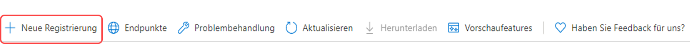

# Konfigurieren von E-Mail-Benachrichtigungen{#configuring-email-notification}

AEM sendet E-Mail-Benachrichtigungen an Benutzer, die:

* Seitenereignisse wie Änderungen oder Replikationen abonniert haben. Im Abschnitt [Benachrichtigungs-Posteingang](/help/sites-classic-ui-authoring/author-env-inbox.md#subscribing-to-notifications) ist beschrieben, wie solche Ereignisse abonniert werden können.

* Forenereignisse abonniert haben.
* einen Schritt innerhalb eines Workflows durchführen müssen. Im Abschnitt [Teilnehmer-Schritt](/help/sites-developing/workflows-step-ref.md#participant-step) ist beschreiben, wie E-Mail-Benachrichtigungen in einem Workflow ausgelöst werden können.

Voraussetzungen:

* Benutzer müssen über eine in ihrem Profil festgelegte, gültige E-Mail-Adresse verfügen.
* Der **Day CQ Mail Service** muss ordnungsgemäß konfiguriert sein.

Wenn ein Benutzer benachrichtigt wird, erhält er eine E-Mail in der Sprache, die in seinem Profil festgelegt ist. Jede Sprache verfügt über eine eigene, anpassbare Vorlage. Für neue Sprachen können neue E-Mail-Vorlagen hinzugefügt werden.

>[!NOTE]
>
>Beim Arbeiten mit AEM sind mehrere Methoden zum Verwalten der Konfigurationseinstellungen für solche Dienste verfügbar. Weitere Informationen und empfohlene Verfahren finden Sie unter [Konfigurieren von OSGi](/help/sites-deploying/configuring-osgi.md).

## Konfigurieren des E-Mail-Diensts {#configuring-the-mail-service}

Damit AEM E-Mails versenden kann, muss der **Day CQ Mail Service** ordnungsgemäß konfiguriert sein. Sie können die Konfiguration in der Web-Konsole anzeigen. Beim Arbeiten mit AEM sind mehrere Methoden zum Verwalten der Konfigurationseinstellungen für solche Dienste verfügbar. Weitere Informationen und empfohlene Verfahren finden Sie unter [Konfigurieren von OSGi](/help/sites-deploying/configuring-osgi.md).

Es gelten die folgenden Beschränkungen:

* Der **SMTP-Server-Anschluss** muss 25 oder höher sein.

* Der Hostname des **SMTP-Servers** darf nicht leer sein.
* Die **„Von“-Adresse** darf nicht leer sein.

Zum Debuggen eines Problems mit dem **Day CQ Mail Service** können Sie die Protokolle des Diensts betrachten:

`com.day.cq.mailer.DefaultMailService`

Die Konfiguration sieht in der Web-Konsole wie folgt aus:


## Konfigurieren des E-Mail-Benachrichtigungskanals {#configuring-the-email-notification-channel}

Wenn Sie entweder Benachrichtigungen zu Seiten- oder Forenereignissen abonniert haben, ist die „Von“-E-Mail-Adresse standardmäßig auf `no-reply@acme.com` eingestellt. Sie können diesen Wert durch die Konfiguration des Diensts **Benachrichtigungs-E-Mail-Kanal** in der Web-Konsole ändern.

Fügen Sie zum Konfigurieren der „Von“-E-Mail-Adresse einen `sling:OsgiConfig`-Knoten zum Repository hinzu. Verwenden Sie das folgende Verfahren, um den Knoten direkt mithilfe von CRXDE Lite hinzuzufügen:

1. Fügen Sie in CRXDE Lite einen Ordner mit dem Namen `config` unter Ihrem Anwendungsordner hinzu.
1. Fügen Sie im Konfigurationsordner einen Knoten mit dem Namen hinzu:

   `com.day.cq.wcm.notification.email.impl.EmailChannel` vom Typ `sling:OsgiConfig`

1. Fügen Sie dem Knoten `email.from` eine `String` -Eigenschaft hinzu. Legen Sie zu dem Wert die E-Mail-Adresse fest, die Sie verwenden möchten.

1. Klicken Sie auf **Alle speichern**.

Gehen Sie wie folgt vor, um den Knoten in den Inhaltspaketen Ihrer Quellordner festzulegen:

1. Erstellen Sie in `jcr_root/apps/*app_name*/config folder` eine Datei mit dem Namen `com.day.cq.wcm.notification.email.impl.EmailChannel.xml`

1. Fügen Sie die folgende XML für den Knoten hinzu:

   `<?xml version="1.0" encoding="UTF-8"?> <jcr:root xmlns:sling="https://sling.apache.org/jcr/sling/1.0" xmlns:jcr="https://www.jcp.org/jcr/1.0" jcr:primaryType="sling:OsgiConfig" email.from="name@server.com"/>`
1. Ersetzen Sie den Wert des Attributs `email.from` (`name@server.com`) durch Ihre E-Mail-Adresse.

1. Speichern Sie die Datei.

## Konfigurieren des Workflow-E-Mail-Benachrichtigungsdiensts  {#configuring-the-workflow-email-notification-service}

Wenn Sie Workflow-E-Mail-Benachrichtigungen erhalten, sind beide „Von“-E-Mail-Adressen und das Host-URL-Präfix auf Standardwerte eingestellt. Sie können diese Werte ändern, indem Sie den **Day CQ Workflow Email Notification Service** in der Web-Konsole konfigurieren. Wenn Sie dies tun, wird empfohlen, die Änderung im Repository beizubehalten.

Die Standardkonfiguration sieht in der Web-Konsole wie folgt aus:


### E-Mail-Vorlagen für die Seitenbenachrichtigung {#email-templates-for-page-notification}

E-Mail-Vorlagen für die Seitenbenachrichtigungen sind zu finden unter:

`/etc/notification/email/default/com.day.cq.wcm.core.page`

Die standardmäßige englische Vorlage (`en.txt`) wird wie folgt definiert:

```xml
subject=[CQ Page Event Notification]: Page Event

header=-------------------------------------------------------------------------------------\n \
Time: ${time}\n \
User: ${userFullName} (${userId})\n \
-------------------------------------------------------------------------------------\n\n

message=The following pages were affected by the event: \n \
 \n \
${modifications} \n \
 \n\n
footer=\n \
-------------------------------------------------------------------------------------\n \
This is an automatically generated message. Please do not reply.
```

#### Anpassen von E-Mail-Vorlagen für die Seitenbenachrichtigung {#customizing-email-templates-for-page-notification}

Die englische E-Mail-Vorlage für die Seitenbenachrichtigung können Sie wie folgt anpassen:

1. Öffnen Sie in CRXDE die Datei:

   `/etc/notification/email/default/com.day.cq.wcm.core.page/en.txt`

1. Passen Sie die Datei an Ihre Anforderungen an.
1. Speichern Sie die Änderungen.

Die Vorlage muss folgendes Format aufweisen:

```
 subject=<text_1>
 header=<text_2>
 message=<text_3>
 footer=<text_4>
```

Dabei kann &lt;text_x> ein Mix von statischem Text und dynamischen Stringvariablen sein. Die folgenden Variablen können innerhalb der E-Mail-Vorlage für Seitenbenachrichtigungen verwendet werden:

* `${time}`, Datum und Uhrzeit des Ereignisses.

* `${userFullName}`, der vollständige Name des Benutzers, der das Ereignis ausgelöst hat.

* `${userId}`, die ID des Benutzers, der das Ereignis ausgelöst hat.
* `${modifications}`beschreibt den Typ des Seitenereignisses und den Seitenpfad im folgenden Format:

   &lt;page event=&quot;&quot; type=&quot;&quot;> =>  &lt;page path=&quot;&quot;>

   Beispiel:

   PageModified => /content/geometrixx/en/products

### E-Mail-Vorlagen für die Forumsbenachrichtigung {#email-templates-for-forum-notification}

E-Mail-Vorlagen für die Forumsbenachrichtigungen sind zu finden unter:

`/etc/notification/email/default/com.day.cq.collab.forum`

Die standardmäßige englische Vorlage (`en.txt`) wird wie folgt definiert:

```xml
subject=[CQ Forum Notification]

header=-------------------------------------------------------------------------------------\n \
Time: Time: ${time}\n \
Forum Page Path: ${forum.path}\n \
-------------------------------------------------------------------------------------\n\n

message=Page: ${host.prefix}${forum.path}.html\n

footer=\n \
-------------------------------------------------------------------------------------\n \
This is an automatically generated message. Please do not reply.
```

#### Anpassen von E-Mail-Vorlagen für die Forumsbenachrichtigung {#customizing-email-templates-for-forum-notification}

Die englische E-Mail-Vorlage für die Forumsbenachrichtigung können Sie wie folgt anpassen:

1. Öffnen Sie in CRXDE die Datei:

   `/etc/notification/email/default/com.day.cq.collab.forum/en.txt`

1. Passen Sie die Datei an Ihre Anforderungen an.
1. Speichern Sie die Änderungen.

Die Vorlage muss folgendes Format aufweisen:

```
 subject=<text_1>
 header=<text_2>
 message=<text_3>
 footer=<text_4>
```

Dabei kann `<text_x>` eine Mischung aus statischem Text und dynamischen Zeichenfolgenvariablen sein.

Die folgenden Variablen können innerhalb der E-Mail-Vorlage für Forumsbenachrichtigungen verwendet werden:

* `${time}`, Datum und Uhrzeit des Ereignisses.

* `${forum.path}`, der Pfad zur Forumsseite.

### E-Mail-Vorlagen für die Workflow-Benachrichtigung {#email-templates-for-workflow-notification}

Die (englische) Vorlage für die Workflow-Benachrichtigungen befindet sich unter:

`/etc/workflow/notification/email/default/en.txt`

Sie wird wie folgt definiert:

```xml
subject=Workflow notification: ${event.EventType}

header=-------------------------------------------------------------------------------------\n \
Time: ${event.TimeStamp}\n \
Step: ${item.node.title}\n \
User: ${participant.name} (${participant.id})\n \
Workflow: ${model.title}\n \
-------------------------------------------------------------------------------------\n\n

message=Content: ${host.prefix}${payload.path.open}\n

footer=\n \
-------------------------------------------------------------------------------------\n \
View the overview in your ${host.prefix}/aem/inbox\n \
-------------------------------------------------------------------------------------\n \
This is an automatically generated message. Please do not reply.
```

#### Anpassen von E-Mail-Vorlagen für die Workflow-Benachrichtigung  {#customizing-email-templates-for-workflow-notification}

Die englische E-Mail-Vorlage für die Benachrichtigung über ein Workflow-Ereignis können Sie wie folgt anpassen:

1. Öffnen Sie in CRXDE die Datei:

   `/etc/workflow/notification/email/default/en.txt`

1. Passen Sie die Datei an Ihre Anforderungen an.
1. Speichern Sie die Änderungen.

Die Vorlage muss folgendes Format aufweisen:

```
subject=<text_1>
 header=<text_2>
 message=<text_3>
 footer=<text_4>
```

>[!NOTE]
>
>Dabei kann `<text_x>` eine Mischung aus statischem Text und dynamischen Zeichenfolgenvariablen sein. Jede Zeile eines Elements `<text_x>` muss mit einem umgekehrten Schrägstrich ( `\`) enden, mit Ausnahme der letzten Instanz, wenn das Fehlen des umgekehrten Schrägstrichs das Ende der String-Variable `<text_x>` anzeigt.
>
>Weitere Informationen zum Vorlagenformat werden von der Methode [javadocs der Properties.load()](https://docs.oracle.com/javase/8/docs/api/java/util/Properties.html#load-java.io.InputStream-)-Methode bereitgestellt.

Die Methode `${payload.path.open}` zeigt den Pfad zur Payload des Arbeitselements an. Für eine Seite in Sites wäre `payload.path.open` beispielsweise `/bin/wcmcommand?cmd=open&path=…` ähnlich wie .; Dies ist ohne den Servernamen, weshalb der Vorlage `${host.prefix}` vorangestellt wird.

Die folgenden Variablen können innerhalb der E-Mail-Vorlage verwendet werden:

* `${event.EventType}`, Ereignistyp
* `${event.TimeStamp}`, Datum und Uhrzeit des Ereignisses
* `${event.User}`, der Benutzer, der das Ereignis ausgelöst hat
* `${initiator.home}`, den Initiator-Knotenpfad

* `${initiator.name}`, den Namen des Initiators

* `${initiator.email}`, die E-Mail-Adresse des Initiators
* `${item.id}`, die ID des Arbeitselements
* `${item.node.id}`, ID des Knotens innerhalb des Workflow-Modells, das mit diesem Arbeitselement verknüpft ist
* `${item.node.title}`, Titel des Arbeitselements
* `${participant.email}`, E-Mail-Adresse des Teilnehmers
* `${participant.name}`, Name des Teilnehmers
* `${participant.familyName}`, Familienname des Teilnehmers
* `${participant.id}`, der Teilnehmerkennung
* `${participant.language}`, die Teilnehmersprache
* `${instance.id}`, die Workflow-ID
* `${instance.state}`, den Workflow-Status
* `${model.title}`, Titel des Workflow-Modells
* `${model.id}`, die ID des Workflow-Modells

* `${model.version}`, die Version des Workflow-Modells
* `${payload.data}`, die Payload

* `${payload.type}`, der Payload-Typ
* `${payload.path}`, Pfad der Payload
* `${host.prefix}`, Host-Präfix, z. B. http://localhost:4502

### Hinzufügen einer E-Mail-Vorlage in einer neuen Sprache {#adding-an-email-template-for-a-new-language}

Sie können wie folgt eine Vorlage in einer neuen Sprache hinzufügen:

1. Fügen Sie in CRXDE eine Datei `<language-code>.txt` unten hinzu:

   * `/etc/notification/email/default/com.day.cq.wcm.core.page` : für Seitenbenachrichtigungen
   * `/etc/notification/email/default/com.day.cq.collab.forum` : für Forumsbenachrichtigungen
   * `/etc/workflow/notification/email/default` : für Workflow-Benachrichtigungen

1. Passen Sie die Datei an die Sprache an.
1. Speichern Sie die Änderungen.

>[!NOTE]
>
>`<language-code>`, der als Dateiname für die E-Mail-Vorlage verwendet wird, muss ein aus zwei Buchstaben bestehender untergeordneter Sprachcode sein, der von AEM erkannt wird. AEM nutzt die Sprachcodes gemäß ISO-639-1.

## Konfigurieren von E-Mail-Benachrichtigungen für AEM Assets {#assetsconfig}

Wenn Sammlungen in AEM Assets freigegeben werden oder ihre Freigabe aufgehoben wird, können Benutzer E-Mail-Benachrichtigungen von AEM erhalten. Um E-Mail-Benachrichtigungen zu konfigurieren, führen Sie diese Schritte aus.

1. Konfigurieren Sie den E-Mail-Dienst, wie oben unter [Konfigurieren des E-Mail-Diensts](/help/sites-administering/notification.md#configuring-the-mail-service) beschrieben.
1. Melden Sie sich in AEM als Administrator an. Klicken Sie auf **Tools**> **Vorgänge**> **Web-Konsole**, um die Konfiguration der Web-Konsole zu öffnen.
1. Bearbeiten Sie das **Day CQ DAM-Ressourcensammlungs-Servlet**. Wählen Sie **E-Mail senden**. Klicken Sie auf **Speichern**.

## Einrichten von OAuth {#setting-up-oauth}

AEM bietet OAuth2-Unterstützung für seinen integrierten Mailer-Service, damit Unternehmen die E-Mail-Anforderungen erfüllen können.

Sie können OAuth für mehrere E-Mail-Anbieter konfigurieren, wie unten beschrieben.

### Gmail {#gmail}

1. Erstellen Sie Ihr Projekt unter `https://console.developers.google.com/projectcreate`
1. Wählen Sie Ihr Projekt aus und navigieren Sie zu **APIs &amp; Services** - **Dashboard - Credentials**
1. Konfigurieren des OAuth-Einverständnisbildschirms entsprechend Ihren Anforderungen
1. Fügen Sie im folgenden Bildschirm &quot;Aktualisieren&quot;die beiden Bereiche hinzu:
   * `https://mail.google.com/`
   * `https://www.googleapis.com//auth/gmail.send`
1. Nachdem Sie die Bereiche hinzugefügt haben, gehen Sie im linken Menü zurück zu **Credentials** und gehen Sie dann zu **Create Credentials** - **OAuth Client ID** - **Desktop App**
1. Daraufhin wird ein neues Fenster mit der Client-ID und dem Client-Geheimnis geöffnet.
1. Speichern Sie diese Anmeldeinformationen.

**AEM Seitenkonfigurationen**

>[!NOTE]
>
>Adobe Managed Service-Kunden können diese Änderungen gemeinsam mit ihrem Customer Service Engineer an Produktionsumgebungen vornehmen.

Konfigurieren Sie zunächst den E-Mail-Dienst:

1. Öffnen Sie die AEM Web-Konsole, indem Sie zu `http://serveraddress:serverport/system/console/configMgr` navigieren.
1. Suchen Sie nach **Day CQ Mail Service** und klicken Sie auf
1. Fügen Sie die folgenden Einstellungen hinzu:
   * SMTP-Server-Hostname: `smtp.gmail.com`
   * SMTP Server Port: `25` oder `587`, je nach Anforderungen
   * Markieren Sie die Tickboxes für **SMPT und verwenden Sie StarTLS** und **SMTP erfordert StarTLS**
   * Markieren Sie **OAuth flow** und klicken Sie auf **Save**.

Konfigurieren Sie anschließend Ihren SMTP-OAuth-Provider wie unten beschrieben:

1. Öffnen Sie die AEM Web-Konsole, indem Sie zu `http://serveraddress:serverport/system/console/configMgr` navigieren.
1. Suchen Sie nach und klicken Sie auf **CQ Mailer SMTP OAuth2 Provider**
1. Füllen Sie die erforderlichen Informationen wie folgt aus:
   * Autorisierungs-URL: `https://accounts.google.com/o/oauth2/auth`
   * Token-URL: `https://accounts.google.com/o/oauth2/token`
   * Bereiche: `https://www.googleapis.com/auth/gmail.send` und `https://mail.google.com/`. Sie können mehr als einen Bereich hinzufügen, indem Sie auf die Schaltfläche **+** rechts von jedem konfigurierten Bereich klicken.
   * Client-ID und Client-Geheimnis: konfigurieren Sie diese Felder mit den Werten, die Sie wie im obigen Absatz beschrieben abgerufen haben.
   * URL für aktualisierten Token: `https://accounts.google.com/o/oauth2/token`
   * Token-Ablauf aktualisieren: never
1. Klicken Sie auf **Speichern**.

<!-- clarify refresh token expiry, currrently not present in the UI -->

Nach der Konfiguration sollten die Einstellungen wie folgt aussehen:


Aktivieren Sie jetzt die OAuth-Komponenten. Gehen Sie dazu wie folgt vor:

1. Rufen Sie die Komponentenkonsole auf, indem Sie diese URL aufrufen: `http://serveraddress:serverport/system/console/components`
1. Suchen Sie nach den folgenden Komponenten
   * `com.day.cq.mailer.oauth.servlets.handler.OAuthCodeGenerateServlet`
   * `com.day.cq.mailer.oauth.servlets.handler.OAuthCodeAccessTokenGenerator`
1. Drücken Sie links neben den Komponenten das Symbol Wiedergabe .

   

Bestätigen Sie abschließend die Konfiguration durch:

1. Wechseln Sie zur Adresse der Veröffentlichungsinstanz und melden Sie sich als Administrator an.
1. Öffnen Sie eine neue Registerkarte im Browser und gehen Sie zu `http://serveraddress:serverport/services/mailer/oauth2/authorize`. Dadurch werden Sie zur Seite Ihres SMTP-Anbieters weitergeleitet, in diesem Fall Gmail.
1. Anmelden und Einverständnis zur Erteilung der erforderlichen Berechtigungen
1. Nach der Zustimmung wird das Token im Repository gespeichert. Sie können unter `accessToken` darauf zugreifen, indem Sie direkt auf diese URL in Ihrer Veröffentlichungsinstanz zugreifen: `http://serveraddress:serverport/crx/de/index.jsp#/conf/global/settings/mailer/oauth2 `
1. Wiederholen Sie die obigen Schritte für jede Veröffentlichungsinstanz

<!-- clarify if the ip/server address in the last procedure is that of the publish instance -->

### Microsoft Outlook {#microsoft-outlook}

1. Gehen Sie zu [https://portal.azure.com/](https://portal.azure.com/) und melden Sie sich an.
1. Suchen Sie in der Suchleiste nach **Azure Active Directory** und klicken Sie auf das Ergebnis. Alternativ können Sie direkt zu [https://portal.azure.com/#blade/Microsoft_AAD_IAM/ActiveDirectoryMenuBlade/Overview](https://portal.azure.com/#blade/Microsoft_AAD_IAM/ActiveDirectoryMenuBlade/Overview) navigieren
1. Klicken Sie auf **App Registration** - **Neue Registrierung**

   

1. Füllen Sie die Informationen entsprechend Ihren Anforderungen aus und klicken Sie dann auf **Registrieren**
1. Wechseln Sie zur neu erstellten App und wählen Sie **API-Berechtigungen** aus.
1. Gehen Sie zu **Berechtigung hinzufügen** - **Diagrammberechtigungen** - **Delegierte Berechtigungen**
1. Wählen Sie die folgenden Berechtigungen für Ihre App aus und klicken Sie dann auf **Berechtigung hinzufügen**:
   * `SMTP.Send`
   * `Mail.Read`
   * `Mail.Send`
   * `openid`
   * `offline_access`
1. Gehen Sie zu **Authentifizierung** - **Plattform** - **Web** hinzufügen und fügen Sie im Abschnitt **Umleitungs-URL** die folgende URL für die Umleitung des OAuth-Codes hinzu und drücken Sie dann **Konfigurieren**:
   * `http://localhost:4503/services/mailer/oauth2/token`
1. Wiederholen Sie die obigen Schritte für jede Veröffentlichungsinstanz
1. Konfigurieren Sie die Einstellungen entsprechend Ihren Anforderungen.
1. Gehen Sie dann zu **Zertifikate und Geheimnisse**, klicken Sie auf **Neues Client-Geheimnis** und führen Sie die Schritte auf dem Bildschirm aus, um ein Geheimnis zu erstellen. Notieren Sie sich dieses Geheimnis für die spätere Verwendung
1. Drücken Sie **Overview** im linken Bereich und kopieren Sie die Werte für **Application (client) ID** und **Directory (tenant) ID** zur späteren Verwendung.

Um eine Neukodifizierung vorzunehmen, müssen Sie die folgenden Informationen eingeben, um OAuth2 für den Mailer-Dienst auf der AEM zu konfigurieren:

* Die Auth-URL, die mit der Mandanten-ID erstellt wird. Sie hat folgendes Formular: `https://login.microsoftonline.com/<tenantID>/oauth2/v2.0/authorize`
* Die Token-URL, die mit der Mandanten-ID erstellt wird. Sie hat folgendes Formular: `https://login.microsoftonline.com/<tenantID>/oauth2/v2.0/token`
* Die Aktualisieren-URL, die mit der Mandanten-ID erstellt wird. Sie hat folgendes Formular: `https://login.microsoftonline.com/<tenantID>/oauth2/v2.0/token`
* Die Client-ID
* Client Secret

**AEM Seitenkonfigurationen**

Integrieren Sie anschließend Ihre OAuth2-Einstellungen in AEM:

1. Navigieren Sie zur Web-Konsole Ihrer lokalen Instanz, indem Sie zu `http://serveraddress:serverport/system/console/configMgr` navigieren.
1. Suchen Sie nach **Day CQ Mail Service** und klicken Sie darauf
1. Fügen Sie die folgenden Einstellungen hinzu:
   * SMTP-Server-Hostname: `smtp.office365.com`
   * SMTP-Benutzer: Ihr Benutzername im E-Mail-Format
   * &quot;Von&quot;: Die E-Mail-Adresse, die im Feld &quot;Von:&quot; verwendet werden soll, wenn die vom Mailer gesendeten Nachrichten
   * SMTP Server Port: `25` oder `587` je nach Anforderungen
   * Markieren Sie die Tickboxes für **SMPT und verwenden Sie StarTLS** und **SMTP erfordert StarTLS**
   * Markieren Sie **OAuth flow** und klicken Sie auf **Save**.
1. Suchen Sie nach und klicken Sie auf **CQ Mailer SMTP OAuth2 Provider**
1. Füllen Sie die erforderlichen Informationen wie folgt aus:
   * Füllen Sie die URL für Autorisierungs-URL, Token-URL und Aktualisierungstoken aus, indem Sie sie wie unter [Ende dieses Verfahrens](#microsoft-outlook) erstellen.
   * Client-ID und Client-Geheimnis: konfigurieren Sie diese Felder mit den Werten, die Sie wie oben beschrieben abgerufen haben.
   * Fügen Sie der Konfiguration die folgenden Perimeter hinzu:
      * openid
      * offline_access
      * `https://outlook.office365.com/Mail.Send`
      * `https://outlook.office365.com/Mail.Read`
      * `https://outlook.office365.com/SMTP.Send`
   * AuthCode-Umleitungs-URL: `http://localhost:4503/services/mailer/oauth2/token`
   * Aktualisieren der Token-URL: sollte denselben Wert wie die Token-URL oben haben.
1. Klicken Sie auf **Speichern**.

Nach der Konfiguration sollten die Einstellungen wie folgt aussehen:


Aktivieren Sie jetzt die OAuth-Komponenten. Gehen Sie dazu wie folgt vor:

1. Rufen Sie die Komponentenkonsole auf, indem Sie diese URL aufrufen: `http://serveraddress:serverport/system/console/components`
1. Suchen Sie nach den folgenden Komponenten
   * `com.day.cq.mailer.oauth.servlets.handler.OAuthCodeGenerateServlet`
   * `com.day.cq.mailer.oauth.servlets.handler.OAuthCodeAccessTokenGenerator`
1. Drücken Sie links neben den Komponenten das Symbol Wiedergabe .


Bestätigen Sie abschließend die Konfiguration durch:

1. Wechseln Sie zur Adresse der Veröffentlichungsinstanz und melden Sie sich als Administrator an.
1. Öffnen Sie eine neue Registerkarte im Browser und gehen Sie zu `http://serveraddress:serverport/services/mailer/oauth2/authorize`. Dadurch werden Sie zur Seite Ihres SMTP-Anbieters weitergeleitet, in diesem Fall Gmail.
1. Anmelden und Einverständnis zur Erteilung der erforderlichen Berechtigungen
1. Nach der Zustimmung wird das Token im Repository gespeichert. Sie können unter `accessToken` darauf zugreifen, indem Sie direkt auf diese URL in Ihrer Veröffentlichungsinstanz zugreifen: `http://serveraddress:serverport/crx/de/index.jsp#/conf/global/settings/mailer/oauth2 `