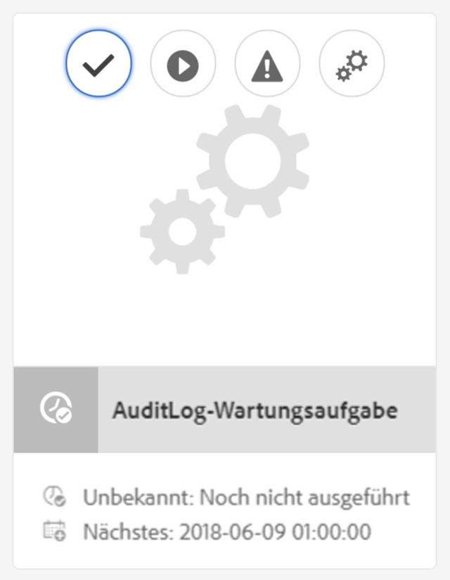

# Auditprotokollwartung in AEM 6{#audit-log-maintenance-in-aem}

AEM-Ereignisse, die sich für die Auditprotokollierung qualifizieren, generieren eine große Menge archivierter Daten. Diese Datenmenge kann im Laufe der Zeit aufgrund von Replikationen, Asset-Uploads und anderen Systemaktivitäten schnell anwachsen.

Die Auditprotokollwartung beinhaltet mehrere Funktionsbestandteile, die die Auditprotokollwartung gemäß spezifischen Richtlinien automatisieren können.

Sie werden als konfigurierbare wöchentliche Wartungsaufgabe implementiert und sind über die Überwachungskonsole des Vorgangs-Dashboard verfügbar.

Weitere Informationen finden Sie in der [Dokumentation zum Vorgangs-Dashboard](/help/sites-administering/operations-dashboard.md).

Es gibt drei Arten von Optionen zur Auditprotokolllöschung:

1. [Seiten-Auditprotokolllöschung](/help/sites-administering/operations-audit-log.md#configure-page-audit-log-purging)
1. [DAM-Auditprotokolllöschung](/help/sites-administering/operations-audit-log.md#configure-dam-audit-log-purging)
1. [Replikations-Auditprotokolllöschung](/help/sites-administering/operations-audit-log.md#configure-replication-audit-log-purging)

Jede der Optionen kann durch Erstellen von Regeln in der Web-Konsole von AEM konfiguriert werden. Nachdem sie konfiguriert wurden, können Sie sie auslösen, indem Sie zu **Tools > Vorgänge > Wartung > Wöchentliches Wartungsfenster** wechseln und die **AuditLog-Wartungsaufgabe** ausführen.

## Konfigurieren der Seiten-Auditprotokolllöschung {#configure-page-audit-log-purging}

Führen Sie zum Konfigurieren der Auditprotokolllöschung die folgenden Schritte aus:

1. Gehen Sie zum Admin der Web-Konsole, indem Sie über den Browser `http://localhost:4502/system/console/configMgr/` aufrufen.

1. Suchen Sie nach einem Element namens **Pages audit Log Purge rule** und klicken Sie darauf.

   

1. Konfigurieren Sie als Nächstes den Löschungsplaner gemäß Ihren Anforderungen. Folgende Optionen sind verfügbar:

   * **Rule name:** der Name der Auditrichtlinienregel
   * **Content path:** der Inhalts-Pfad, auf den die Regel angewandt wird;
   * **Minimum age:** die Zeit in Tagen, für die die Auditprotokolle aufbewahrt werden müssen
   * **Audit log type:** der Typ des zu löschenden Auditprotokolls

   >[!NOTE]
   >
   >Der Inhalts-Pfad gilt nur für untergeordnete Elemente des Knotens `/var/audit/com.day.cq.wcm.core.page` im Repository.

1. Speichern Sie die Regel.
1. Die gerade von Ihnen erstellte Regel muss im Vorgangs-Dashboard vorhanden sein, um ausgeführt werden zu können. Gehen Sie hierzu über den AEM-Begrüßungsbildschirm zu **Tools > Vorgänge > Wartung**.

1. Klicken Sie auf die Karte **Wöchentliches Wartungsfenster**.

1. Die Wartungsaufgabe ist bereits auf der Karte **AuditLog-Wartungsaufgabe** vorhanden.

   

1. Sie können entweder das Datum der nächsten Ausführung ermitteln, es konfigurieren oder es durch das Drücken der Wiedergabetaste manuell ausführen.

Wenn das Fenster zur geplanten Wartung in AEM 6.3 geschlossen wird, bevor die Aufgabe zur Auditprotokolllöschung abgeschlossen werden konnte, wird die Aufgabe automatisch angehalten. Sie wird fortgesetzt, wenn das nächste Wartungsfenster beginnt.

**Mit AEM 6.5** können Sie eine aktuell ausgeführte Aufgabe zur Auditprotokolllöschung manuell anhalten, indem Sie auf das **Stopp**-Symbol klicken. Bei der nächsten Ausführung wird die Aufgabe auf sichere Art und Weise wiederaufgenommen.

>[!NOTE]
>
>Das Anhalten der Wartungsaufgabe bedeutet, dass ihre Ausführung verschoben wird, ohne den Überblick über den aktuell bereits ausgeführten Auftrag zu verlieren.

## Konfigurieren der DAM-Auditprotokolllöschung {#configure-dam-audit-log-purging}

1. Navigieren Sie unter *https://&lt;Server-Adresse>:&lt;Serverport>/system/console/configMgr* zur Systemkonsole.
1. Suchen Sie nach **DAM audit Log Purge rule** und klicken Sie auf das Ergebnis.
1. Konfigurieren Sie im nächsten Fenster Ihre Regel entsprechend: Die Optionen sind:

   * **Rule name:** der Name der Auditrichtlinienregel
   * **Content path:** der Inhalts-Pfad, auf den die Regel angewandt wird
   * **Minimum age:** die Zeit in Tagen, für die die Auditprotokolle aufbewahrt werden müssen
   * **Audit Log Dam event types:** der Typ der zu löschenden DAM-Prüfereignisse

1. Klicken Sie auf **Speichern**, um Ihre Konfiguration zu speichern.

## Konfigurieren der Replikations-Auditprotokolllöschung  {#configure-replication-audit-log-purging}

1. Navigieren Sie unter *https://&lt;Server-Adresse>:&lt;Serverport>/system/console/configMgr* zur Systemkonsole.
1. Suchen Sie nach **Replication audit Log Purge Scheduler** und klicken Sie auf das Ergebnis.
1. Konfigurieren Sie im nächsten Fenster Ihre Regel entsprechend: Die Optionen sind:

   * **Rule name:** der Name der Auditrichtlinienregel
   * **Content path:** der Inhalts-Pfad, auf den die Regel angewandt wird
   * **Minimum age:** die Zeit in Tagen, für die die Auditprotokolle aufbewahrt werden müssen
   * **Audit log Replication event types:** der Typ der zu löschenden Replikationsprüfereignisse

1. Klicken Sie auf **Speichern**, um Ihre Konfiguration zu speichern.
