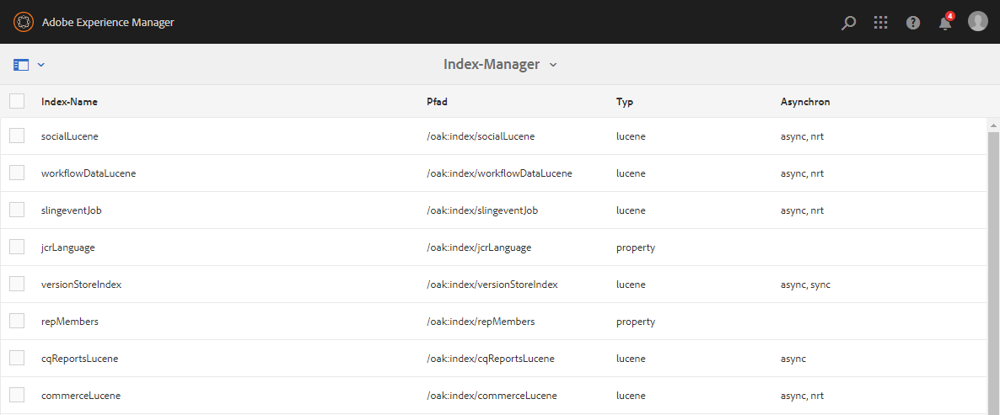
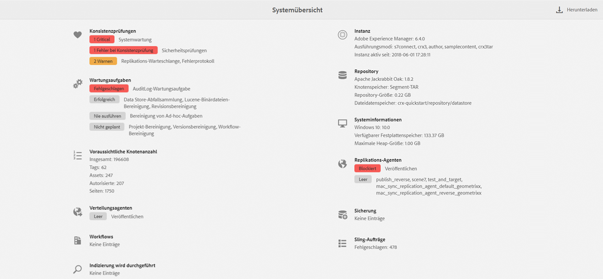

# Vorgangs-Dashboard {#operations-dashboard}

## Einführung {#introduction}

Mit dem Vorgangs-Dashboard in AEM 6 können Systemoperatoren auf einen Blick die AEM-Systemkonsistenz berwachen. Es bietet außerdem automatisch generierte Diagnoseinformationen zu relevanten Aspekten der AEM und ermöglicht die Konfiguration und Ausführung der eigenständigen Wartungsautomatisierung, um Projektvorgänge und Supportfälle erheblich zu reduzieren. Sie können das Vorgangs-Dashboard durch benutzerdefinierte Konsistenzprüfungen und Wartungsaufgaben erweitern. Und über JMX können Sie von externen Überwachungstools auf die Daten des Vorgangs-Dashboards zugreifen.

**Das Vorgangs-Dashboard:**

* bietet mit einem Mausklick Informationen zum Systemstatus, um die Effizienz der Betriebsabteilung zu erhöhen
* stellt einen zentralen Überblick über die Systemkonsistenz bereit
* verringert den Zeitaufwand für das Erkennen, Analysieren und Beheben von Fehlern
* bietet eigenständige Wartungsautomatisierung, die die Projektbetriebskosten deutlich senkt

Sie können darauf zugreifen, indem Sie auf dem AEM Willkommensbildschirm **Tools** - **Vorgänge** aufrufen.

>[!NOTE]
>
>Um auf das Vorgangs-Dashboard zugreifen zu können, muss der angemeldete Benutzer zur Benutzergruppe „Operatoren“ gehören. Weitere Informationen finden Sie in der Dokumentation zu [Verwaltung von Benutzern, Gruppen und Zugriffsrechten](/help/sites-administering/user-group-ac-admin.md).

## Konsistenzberichte {#health-reports}

Das Konsistenzberichtssystem stellt Informationen zum Zustand einer AEM-Instanz durch Sling-Konsistenzprüfungen bereit. Dies erfolgt entweder über OSGi-, JMX- oder HTTP-Abfragen (über JSON) oder über die Touch-optimierte Benutzeroberfläche. Das System bietet Messungen und Schwellenwerte bestimmter konfigurierbarer Zähler und stellt in einigen Fällen Informationen zur Fehlerbehebung bereit.

Es umfasst mehrere Funktionen, die unten beschrieben werden.

## Konsistenzprüfungen {#health-checks}

Die **Konsistenzberichte** sind ein System von Karten, die einen guten oder einen schlechten Zustand im Hinblick auf einen bestimmten Produktbereich anzeigen. Diese Karten sind Visualisierungen der Sling-Konsistenzprüfung, die Daten von JMX und anderen Quellen aggregiert und verarbeitete Daten wieder als MBeans freigibt. Diese MBeans können Sie auch in der [JMX-Web-Konsole](/help/sites-administering/jmx-console.md) unter der Domäne **org.apache.sling.healthcheck** überprüfen.

Der Zugriff auf die Benutzeroberfläche von Gesundheitsberichten erfolgt über das Menü **Tools** - **Vorgänge** - **Gesundheitsberichte** auf dem AEM Begrüßungsbildschirm oder direkt über die folgende URL:

`https://<serveraddress>:port/libs/granite/operations/content/healthreports/healthreportlist.html`


Das Kartensystem umfasst drei mögliche Status: **OK**, **WARNUNG** und **KRITISCH**. Diese Statusanzeigen sind das Ergebnis von Regeln und Schwellenwerten. Um diese zu konfigurieren, bewegen Sie den Mauszeiger über die Karte und klicken Sie auf das Zahnradsymbol in der Aktionsleiste:


### Konsistenzprüfungsarten {#health-check-types}

Es gibt zwei Arten von Konsistenzprüfungen in AEMٔ 6:

1. Individuelle Konsistenzprüfungen
1. Verbund-Konsistenzprüfungen

Eine **individuelle Konsistenzprüfung** ist eine einzelne Konsistenzprüfung, die einer Statuskarte entspricht. Individuelle Konsistenzprüfungen können mit Regeln oder Schwellenwerten konfiguriert werden und einen oder mehrere Hinweise und Links zum Beheben erkannter Konsistenzprobleme bereitstellen. Nehmen wir die Prüfung „Fehlerprotokoll“ als Beispiel: Wenn in den Instanzenprotokollen FEHLER-Einträge vorliegen, werden sie auf der Detailseite der Konsistenzprüfung angezeigt. Oben auf der Seite finden Sie einen Link zum Protokollmeldungs-Analyzer im Diagnosetools-Bereich. Damit können Sie diese Fehler detailliert analysieren und die Logger neu konfigurieren.

Eine **Verbund-Konsistenzprüfung** ist eine Prüfung, die Daten von mehreren individuellen Prüfungen zusammenführt.

Verbund-Konsistenzprüfungen können Sie mit Hilfe von **Filter-Tags** konfigurieren. Im Wesentlichen werden alle einzelnen Prüfungen, die dasselbe Filter-Tag aufweisen, als Verbund-Konsistenzprüfung gruppiert. Eine Verbund-Konsistenzprüfung weist nur dann den Status „OK“ auf, wenn alle individuellen Prüfungen, von denen sie Daten bezieht, ebenfalls diesen Status aufweisen.

### Erstellen von Konsistenzprüfungen {#how-to-create-health-checks}

Im Vorgangs-Dashboard können Sie die Ergebnisse von individuellen wie Verbund-Konsistenzprüfung visuell darstellen.

### Erstellen einer individuellen Konsistenzprüfung {#creating-an-individual-health-check}

Zum Erstellen einer individuellen Konsistenzprüfung sind zwei Schritte nötig: das Implementieren einer Sling-Konsistenzprüfung und das Hinzufügen eines Eintrags für die Konsistenzprüfung in den Konfigurationsknoten des Dashboards.

1. Um eine Sling-Konsistenzprüfung zu erstellen, müssen Sie eine OSGi-Komponente erstellen, die die Sling-Konsistenzprüfungs-Schnittstelle implementiert. Sie fügen diese Komponente innerhalb eines Bundles hinzu. Die Eigenschaften der Komponente identifizieren die Konsistenzprüfung vollständig. Nach der Installation der Komponente wird automatisch ein JMX-MBean für die Konsistenzprüfung erstellt. Weitere Informationen finden Sie in der [Dokumentation zu Sling-Konsistenzprüfungen](https://sling.apache.org/documentation/bundles/sling-health-check-tool.html).

   Beispiels einer Sling-Konsistenzprüfungs-Komponente, mit OSGi-Dienstkomponenten-Anmerkungen geschrieben:

   ```java
   @Component(service = HealthCheck.class,
   property = {
       HealthCheck.NAME + "=Example Check",
       HealthCheck.TAGS + "=example",
       HealthCheck.TAGS + "=test",
       HealthCheck.MBEAN_NAME + "=exampleHealthCheckMBean"
   })
    public class ExampleHealthCheck implements HealthCheck {
       @Override
       public Result execute() {
           // health check code
       }
    }
   ```

   >[!NOTE]
   >
   >Die Eigenschaft `MBEAN_NAME` definiert den Namen des MBean, die für diese Konsistenzprüfung erstellt wird.

1. Nach dem Erstellen der Konsistenzprüfung müssen Sie einen neuen Konfigurationsknoten erstellen, damit die Konsistenzprüfung in der Oberfläche des Vorgangs-Dashboards verfügbar ist. Für diesen Schritt müssen Sie den JMX-MBean-Namen der Konsistenzprüfung kennen (die Eigenschaft `MBEAN_NAME`). Um eine Konfiguration für die Konsistenzprüfung zu erstellen, öffnen Sie CRXDE und fügen Sie einen neuen Knoten (des Typs **nt:unstructured**) unter dem folgenden Pfad hinzu: `/apps/settings/granite/operations/hc`

   Legen Sie die folgenden Eigenschaften für den neuen Knoten fest:

   * **Name:** `sling:resourceType`

      * **Typ:** `String`
      * **Wert:** `granite/operations/components/mbean`
   * **Name:** `resource`

      * **Typ:** `String`
      * **Wert:** `/system/sling/monitoring/mbeans/org/apache/sling/healthcheck/HealthCheck/exampleHealthCheck`

   >[!NOTE]
   >
   >Der obige Ressourcenpfad wird wie folgt erstellt: Wenn der MBean-Name Ihrer Konsistenzprüfung &quot;test&quot;ist, fügen Sie &quot;test&quot;am Ende des Pfads `/system/sling/monitoring/mbeans/org/apache/sling/healthcheck/HealthCheck` hinzu.
   >
   >Der endgültige Pfad lautet also:
   >
   >`/system/sling/monitoring/mbeans/org/apache/sling/healthcheck/HealthCheck/test`

   >[!NOTE]
   >
   >Stellen Sie sicher, dass für den Pfad `/apps/settings/granite/operations/hc` die folgenden Eigenschaften auf &quot;true&quot;festgelegt sind:
   >
   >
   >`sling:configCollectionInherit`
   >
   >`sling:configPropertyInherit`
   >
   >
   >Dadurch wird der Konfigurationsmanager angewiesen, die neuen Konfigurationen mit den vorhandenen von `/libs` zusammenzuführen.

### Erstellen einer Verbund-Konsistenzprüfung {#creating-a-composite-health-check}

Die Aufgabe einer Verbund-Konsistenzprüfung besteht darin, mehrere individuelle Konsistenzprüfung zu aggregieren, die einige Funktionen gemeinsam nutzen. So gruppiert beispielsweise die Sicherheits-Verbund-Konsistenzprüfung alle individuellen Konsistenzprüfung, die sicherheitsbezogene Prüfungen durchführen. Um eine Verbund-Zustandsprüfung zu erstellen, müssen Sie zunächst eine neue OSGi-Konfiguration hinzufügen. Für die Anzeige im Vorgangs-Dashboard müssen Sie einen neuen Konfigurationsknoten hinzufügen, wie für die einfache Prüfung beschrieben.

1. Wechseln Sie zum Web-Konfigurationsmanager in der OSGi-Konsole. Sie können dies durch Zugriff auf `https://serveraddress:port/system/console/configMgr` tun.
1. Suchen Sie den Eintrag namens **Apache Sling Composite Health Check**. Unter diesem Eintrag sind bereits zwei Konfigurationen vorhanden: eine für die Systemprüfungen, eine andere für die Sicherheitsprüfungen.
1. Um eine neue Konfiguration zu erstellen, klicken Sie auf das Pluszeichen (+) rechts neben der Konfiguration. Ein neues Fenster wird geöffnet, wie unten abgebildet:

   

1. Erstellen Sie eine Konfiguration und speichern Sie sie. Ein MBean wird mit der neuen Konfiguration erstellt.

   Der Zweck jeder Konfigurationseigenschaft ist wie folgt:

   * **Name (hc.name):** Der Name der Verbund-Konsistenzprüfung. Ein aussagekräftiger Name ist empfehlenswert.
   * **Tags (hc.tags):** Die Tags für diese Konsistenzprüfung. Wenn diese Verbund-Konsistenzprüfung Teil einer weiteren Verbund-Konsistenzprüfung sein soll (z. B. in einer Hierarchie an Konsistenzprüfungen), fügen Sie die Tags hinzu, zu denen diese Prüfung gehört.
   * **MBean-Name (hc.mbean.name):** Der Name des MBeans, das an das JMX-MBean dieser Verbund-Konsistenzprüfung übergeben wird.
   * **Filter-Tags (filter.tags):** Diese Eigenschaft ist speziell für Verbund-Konsistenzprüfung. Dies sind die Tags, die die Verbund-Zustandsprüfung aggregieren soll. Die Verbund-Konsistenzprüfung aggregiert unter ihrer Gruppe alle Konsistenzprüfungen mit Tags, die einem der Filter-Tags dieser Verbund-Konsistenzprüfung entsprechen. Beispielsweise aggregiert eine Verbund-Konsistenzprüfung mit den Filter-Tags **test** und **check** alle individuellen und Verbund-Konsistenzprüfungen, die einen der Tags **test** und **check** in ihrer tags-Eigenschaft aufweisen ( `hc.tags`).

   >[!NOTE]
   >
   >Ein neues JMX-MBean wird für jede neue Konfiguration des Apache Sling Composite Health Checks erstellt.**

1. Zuletzt müssen Sie den Eintrag der gerade erstellten Verbund-Konsistenzprüfung in den Konfigurationsknoten des Vorgangs-Dashboards hinzufügen. Das Verfahren hierfür entspricht dem der individuellen Konsistenzprüfungen: Ein Knoten vom Typ **nt:unstructured** muss unter `/apps/settings/granite/operations/hc` erstellt werden. Die Ressourceneigenschaft des Knotens wird durch den Wert **hc.mean.name** in der OSGi-Konfiguration definiert.

   Wenn Sie beispielsweise eine Konfiguration erstellt und den Wert **hc.mbean.name** auf **diskusage** festgelegt haben, sehen die Konfigurationsknoten wie folgt aus:

   * **Name:** `Composite Health Check`

      * **Typ:** `nt:unstructured`

   Mit den folgenden Eigenschaften:

   * **Name:** `sling:resourceType`

      * **Typ:** `String`
      * **Wert:** `granite/operations/components/mbean`
   * **Name:** `resource`

      * **Typ:** `String`
      * **Wert:** `/system/sling/monitoring/mbeans/org/apache/sling/healthcheck/HealthCheck/diskusage`

   >[!NOTE]
   >
   >Wenn Sie individuelle Konsistenzprüfungen erstellen, die logisch zu einer Verbund-Konsistenzprüfung gehören, die bereits standardmäßig im Dashboard vorhanden ist, werden sie automatisch erfasst und unter der entsprechenden Verbund-Konsistenzprüfung gruppiert. Daher müssen Sie keinen neuen Konfigurationsknoten für diese Prüfungen erstellen.
   >
   >Wenn Sie beispielsweise eine individuelle Sicherheits-Konsistenzprüfung erstellen, müssen Sie ihr lediglich das Tag **Sicherheit** zuweisen. Nach der Installation wird sie automatisch unter der Verbund-Konsistenzprüfung im Vorgangs-Dashboard angezeigt.

### Im Lieferumfang von AEM enthaltene Konsistenzprüfungen {#health-checks-provided-with-aem}

<table>
 <tbody>
  <tr>
   <td><strong>Name der Konsistenzprüfung</strong></td>
   <td><strong>Beschreibung</strong></td>
  </tr>
  <tr>
   <td>Abfrageleistung</td>
   <td><p>Diese Konsistenzprüfung wurde in AEM 6.4</strong> vereinfacht und überprüft jetzt das kürzlich überarbeitete <code>Oak QueryStats</code> MBean, genauer gesagt das <code>SlowQueries </code>Attribut. <strong> Wenn die Statistik eine langsame Abfrage enthält, gibt die Konsistenzprüfung eine Warnung zurück. Andernfalls meldet sie den Status „OK“.<br /> </strong></p> <p>Das MBean für diese Konsistenzprüfung ist <a href="http://localhost:4502/system/console/jmx/org.apache.sling.healthcheck%3Aname%3DqueriesStatus%2Ctype%3DHealthCheck">org.apache.sling.healthcheck:name=queriesStatus,type=HealthCheck</a>.</p> </td>
  </tr>
  <tr>
   <td>Länge der Überwachungswarteschlange</td>
   <td><p>Die Länge der Beobachtungswarteschlange wird über alle Ereignis-Listener und Hintergrundbeobachter iteriert, vergleicht ihre <code>queueSize </code>mit ihrer <code>maxQueueSize</code> und:</p>
    <ul>
     <li>gibt den Status "Kritisch"zurück, wenn der Wert <code>queueSize</code> den Wert <code>maxQueueSize</code> überschreitet (d. h. wenn Ereignisse gelöscht werden)</li>
     <li>gibt eine Warnung zurück, wenn der Wert <code>queueSize</code> über dem Wert <code>maxQueueSize * WARN_THRESHOLD</code> liegt (der Standardwert ist 0,75) </li>
    </ul> <p>Die Höchstlänge jeder Warteschlange wird in separaten Konfigurationen (Oak und AEM) festgelegt und kann nicht über diese Konsistenzprüfung konfiguriert werden. Das MBean für diese Konsistenzprüfung ist <a href="http://localhost:4502/system/console/jmx/org.apache.sling.healthcheck%3Aname%3DObservationQueueLengthHealthCheck%2Ctype%3DHealthCheck">org.apache.sling.healthcheck:name=ObservationQueueLengthHealthCheck,type=HealthCheck</a>.</p> </td>
  </tr>
  <tr>
   <td>Abfrage-Ausnahmelimits</td>
   <td><p>Query Traversal Limits überprüft das <code>QueryEngineSettings</code> MBean, genauer gesagt die Attribute <code>LimitInMemory</code> und <code>LimitReads</code> und gibt den folgenden Status zurück:</p>
    <ul>
     <li>gibt den Warnungsstatus zurück, wenn eines der Limits gleich oder höher als das <code>Integer.MAX_VALUE</code></li>
     <li>den Warnungsstatus, wenn eines der Limits kleiner als 10.000 (die empfohlene Einstellung von Oak) ist</li>
     <li>gibt den Status "Kritisch"zurück, wenn <code>QueryEngineSettings</code> oder eines der Limits nicht abgerufen werden kann</li>
    </ul> <p>Das MBean für diese Konsistenzprüfung ist <a href="http://localhost:4502/system/console/jmx/org.apache.sling.healthcheck%3Aname%3DqueryTraversalLimitsBundle%2Ctype%3DHealthCheck">org.apache.sling.healthcheck:name=queryTraversalLimitsBundle,type=HealthCheck</a>.</p> </td>
  </tr>
  <tr>
   <td>Synchronisierte Uhren</td>
   <td><p>Diese Prüfung ist nur für <a href="https://github.com/apache/sling-old-svn-mirror/blob/4df9ab2d6592422889c71fa13afd453a10a5a626/bundles/extensions/discovery/oak/src/main/java/org/apache/sling/discovery/oak/SynchronizedClocksHealthCheck.java">document nodestore clusters</a> relevant. Sie gibt den folgenden Status zurück:</p>
    <ul>
     <li>den Warnungsstatus, wenn die Instanzuhren nicht mehr synchronisiert sind und einen vorab definierten unteren Schwellenwert übersteigen</li>
     <li>den Status „Kritisch“, wenn die Instanzuhren nicht mehr synchronisiert sind und einen vorab definierten oberen Schwellenwert übersteigen</li>
    </ul> <p>Das MBean für diese Konsistenzprüfung ist <a href="http://localhost:4502/system/console/jmx/org.apache.sling.healthcheck%3Aname%3DslingDiscoveryOakSynchronizedClocks%2Ctype%3DHealthCheck">org.apache.sling.healthcheck:name=slingDiscoveryOakSynchronizedClocks,type=HealthCheck</a>.</p> </td>
  </tr>
  <tr>
   <td>Asynchrone Indexizes</td>
   <td><p>Die Prüfung auf asynchrone Indizes</p>
    <ul>
     <li>gibt den Status „Kritisch“ zurück, wenn mindestens eine Indizierungsspur fehlschlägt</li>
     <li>überprüft das <code>lastIndexedTime</code> für alle Indizierungsspuren und:
      <ul>
       <li>gibt den Status „Kritisch“ zurück, wenn die Zeit mehr als 2 Stunden zurückliegt </li>
       <li>gibt den Warnungsstatus zurück, wenn sie zwischen 2 Stunden und 45 Minuten zurückliegt </li>
       <li>gibt den Status „OK“ zurück, wenn sie weniger als 45 Minuten zurückliegt </li>
      </ul> </li>
     <li>gibt den Status „OK“ zurück, wenn keine dieser Bedingungen zutrifft</li>
    </ul> <p>Die Schwellenwerte für „Kritisch“ und „Warnung“ sind konfigurierbar. Das MBean für diese Konsistenzprüfung ist <a href="http://localhost:4502/system/console/jmx/org.apache.sling.healthcheck%3Aname%3DasyncIndexHealthCheck%2Ctype%3DHealthCheck">org.apache.sling.healthcheck:name=asyncIndexHealthCheck,type=HealthCheck</a>.</p> <p><strong>Hinweis:  </strong>Diese Konsistenzprüfung ist in AEM 6.4 verfügbar und wurde auf AEM 6.3.0.1 zurückportiert.</p> </td>
  </tr>
  <tr>
   <td>Große Lucene-Indizes</td>
   <td><p>Bei dieser Prüfung werden die Daten verwendet, die vom MBean <code>Lucene Index Statistics</code> verfügbar gemacht werden, um große Indizes zu identifizieren, und es werden folgende Daten zurückgegeben:</p>
    <ul>
     <li>gibt einen Warnungsstatus zurück, wenn es einen Index mit mehr als 1 Mrd. Dokumenten gibt</li>
     <li>gibt den Status „Kritisch“ zurück, wenn es einen Index mit mehr als 1,5 Mrd. Dokumenten gibt</li>
    </ul> <p>Die Schwellenwerte sind konfigurierbar und das MBean für die Konsistenzprüfung ist <a href="http://localhost:4502/system/console/jmx/org.apache.sling.healthcheck%3Aname%3DlargeIndexHealthCheck%2Ctype%3DHealthCheck">org.apache.sling.healthcheck:name=largeIndexHealthCheck,type=HealthCheck.</a></p> <p><strong>Hinweis: </strong>Diese Prüfung ist in AEM 6.4 und als Backport in AEM 6.3.2.0 verfügbar.</p> </td>
  </tr>
  <tr>
   <td>Systemwartung</td>
   <td><p>Die Systemwartung ist eine Verbund-Zustandsprüfung, die den Status „OK“ zurückgibt, wenn alle Wartungsaufgaben wie konfiguriert ausgeführt werden. Bedenken Sie Folgendes:</p>
    <ul>
     <li>jede Wartungsaufgabe mit einer zugehörigen Konsistenzprüfung</li>
     <li>Wenn eine Aufgabe nicht zu einem Wartungsfenster hinzugefügt wird, gibt ihre Konsistenzprüfung „Kritisch“ zurück.</li>
     <li>Sie müssen die Wartungsaufgaben „Auditprotokoll“ und „Workflow-Bereinigung“ konfigurieren oder aus den Wartungsfenstern entfernen. Wenn diese Aufgaben nicht konfiguriert sind, schlagen sie beim Ausführungsversuch fehl, sodass die Systemwartungsprüfung den Status „Kritisch“ zurückgibt.</li>
     <li><strong>In AEM 6.4</strong> gibt es auch eine Prüfung für die Aufgabe <a href="/help/sites-administering/operations-dashboard.md#automated-maintenance-tasks">Lucene Binaries Maintenance</a>.</li>
     <li>In AEM 6.2 und früher gibt die Systemwartungsprüfung einen Warnungsstatus direkt nach dem Start aus, da die Aufgaben nie ausgeführt werden. Ab Version 6.3 wird der Status „OK“ zurückgegeben, wenn das erste Wartungsfenster noch nicht erreicht wurde.</li>
    </ul> <p>Das MBean für diese Konsistenzprüfung ist <a href="http://localhost:4502/system/console/jmx/org.apache.sling.healthcheck%3Aname%3Dsystemchecks%2Ctype%3DHealthCheck">org.apache.sling.healthcheck:name=systemchecks,type=HealthCheck</a>.</p> </td>
  </tr>
  <tr>
   <td>Replikations-Warteschlange</td>
   <td><p>Diese Prüfung wird bei den Replikationsagenten durchgeführt und prüft deren Warteschlangen. Beim vordersten Element in der Warteschlange ermittelt die Prüfung, wie häufig der Agent die Replikation versucht hat. Wenn diese Anzahl größer ist als der Wert des Parameters <code>numberOfRetriesAllowed</code>, wird eine Warnung zurückgegeben. Der Parameter <code>numberOfRetriesAllowed</code> kann konfiguriert werden. </p> <p>Das MBean für diese Konsistenzprüfung ist <a href="http://localhost:4502/system/console/jmx/org.apache.sling.healthcheck%3Aname%3DreplicationQueue%2Ctype%3DHealthCheck" target="_blank">org.apache.sling.healthcheck:name=replicationQueue,type=HealthCheck</a>.</p> </td>
  </tr>
  <tr>
   <td>Sling Jobs</td>
   <td>
    <div>
      Sling-Aufträge überprüfen die Anzahl der Aufträge in der Warteschlange im JobManager, gleichen sie mit der
     <code>maxNumQueueJobs</code> und
    </div>
    <ul>
     <li>gibt "Kritisch"zurück, wenn sich mehr als die <code>maxNumQueueJobs</code> in der Warteschlange befinden</li>
     <li>gibt den Status „Kritisch“ zurück, wenn es aktive Aufträge gibt, die seit mehr als einer Stunde ausgeführt werden</li>
     <li>gibt den Status „Kritisch“ zurück, wenn es Aufträge in der Warteschlange gibt und der letzte abgeschlossene Auftrag länger als 1 Stunde zurückliegt</li>
    </ul> <p>Nur der Parameter für die Höchstzahl an Aufträgen in der Warteschlange ist konfigurierbar. Sein Standardwert ist 1.000.</p> <p>Das MBean für diese Konsistenzprüfung ist <a href="http://localhost:4502/system/console/jmx/org.apache.sling.healthcheck%3Aname%3DslingJobs%2Ctype%3DHealthCheck" target="_blank">org.apache.sling.healthcheck:name=slingJobs,type=HealthCheck</a>.</p> </td>
  </tr>
  <tr>
   <td>Anforderungsleistung</td>
   <td><p>Diese Prüfung untersucht die <code>granite.request.metrics.timer</code> <a href="http://localhost:4502/system/console/slingmetrics" target="_blank">Sling-Metrik </a>und:</p>
    <ul>
     <li>gibt den Status „Kritisch“ zurück, wenn der 75. Perzentilwert über dem Schwellenwert für „Kritisch“ liegt (der Standardwert beträgt 500 Millisekunden)</li>
     <li>gibt eine Warnung zurück, wenn der 75. Perzentilwert über dem Warnungs-Schwellenwert liegt (der Standardwert beträgt 200 Millisekunden)</li>
    </ul> <p>Das MBean für diese Konsistenzprüfung ist<em> </em><a href="http://localhost:4502/system/console/jmx/org.apache.sling.healthcheck%3Aname%3DrequestsStatus%2Ctype%3DHealthCheck" target="_blank">org.apache.sling.healthcheck:name=requestsStatus,type=HealthCheck</a>.</p> </td>
  </tr>
  <tr>
   <td>Fehlerprotokoll</td>
   <td><p>Diese Prüfung gibt eine Warnung zurück, wenn Fehler im Protokoll vorliegen.</p> <p>Das MBean für diese Konsistenzprüfung ist <a href="http://localhost:4502/system/console/jmx/org.apache.sling.healthcheck%3Aname%3DlogErrorHealthCheck%2Ctype%3DHealthCheck" target="_blank">org.apache.sling.healthcheck:name=logErrorHealthCheck,type=HealthCheck</a>.</p> </td>
  </tr>
  <tr>
   <td>Festplattenspeicher</td>
   <td><p>Die Prüfung "Festplattenspeicher"untersucht das MBean <code>FileStoreStats</code>, ruft die Größe des Knotenspeichers und die Menge des verfügbaren Festplattenspeichers auf der Node Store-Partition ab und:</p>
    <ul>
     <li>gibt eine Warnung zurück, wenn das Verhältnis zwischen verfügbarem Festplatten-Speicherplatz und Repository-Größe unter dem Warnungs-Schwellenwert liegt (der Standardwert ist 10)</li>
     <li>gibt den Status „Kritisch“ zurück, wenn das Verhältnis zwischen verfügbarem Festplatten-Speicherplatz und Repository-Größe unter dem Schwellenwert für „Kritisch“ liegt (der Standardwert ist 2)</li>
    </ul> <p>Beide Werte sind konfigurierbar. Die Prüfung funktioniert nur auf Instanzen mit einem Segmentspeicher.</p> <p>Das MBean für diese Konsistenzprüfung ist <a href="http://localhost:4502/system/console/jmx/org.apache.sling.healthcheck%3Aname%3DDiskSpaceHealthCheck%2Ctype%3DHealthCheck" target="_blank">org.apache.sling.healthcheck:name=DiskSpaceHealthCheck,type=HealthCheck</a>.</p> </td>
  </tr>
  <tr>
   <td>Scheduler-Konsistenzprüfung</td>
   <td><p>Diese Prüfung gibt eine Warnung zurück, wenn auf der Instanz länger als 60 Sekunden ein Quartz-Auftrag ausgeführt wird. Der Schwellenwert für die zulässige Dauer ist konfigurierbar.</p> <p>Das MBean für diese Konsistenzprüfung ist <a href="http://localhost:4502/system/console/jmx/org.apache.sling.healthcheck%3Aname%3DslingCommonsSchedulerHealthCheck%2Ctype%3DHealthCheck" target="_blank">org.apache.sling.healthcheck:name=slingCommonsSchedulerHealthCheck,type=HealthCheck</a><em>.</em></p> </td>
  </tr>
  <tr>
   <td>Sicherheitsprüfungen</td>
   <td><p>Die Sicherheitsprüfung ist eine Verbundprüfung, die die Ergebnisse mehrerer sicherheitsbezogener Prüfungen aggregiert. Diese individuellen Konsistenzprüfungen behandeln unterschiedliche Probleme aus der Sicherheitscheckliste, die auf der Dokumentationsseite <a href="/help/sites-administering/security-checklist.md">Sicherheitscheckliste verfügbar ist.</a> Die Prüfung ist als Feuerprobe beim Start der Instanz nützlich. </p> <p>Das MBean für diese Konsistenzprüfung ist <a href="http://localhost:4502/system/console/jmx/org.apache.sling.healthcheck%3Aname%3Dsecuritychecks%2Ctype%3DHealthCheck" target="_blank">org.apache.sling.healthcheck:name=securityChecks,type=HealthCheck</a></p> </td>
  </tr>
  <tr>
   <td>Aktive Bundles</td>
   <td><p>Diese Prüfung untersucht den Status aller Bundles und:</p>
    <ul>
     <li>gibt eine Warnung zurück, wenn eines der Bundles nicht aktiv ist oder (gerade startet, mit Lazy-Aktivierung)</li>
     <li>ignoriert den Status von Bundles aus der Ignorieren-Liste</li>
    </ul> <p>Der Parameter der Ignorieren-Liste ist konfigurierbar.</p> <p>Das MBean für diese Konsistenzprüfung ist <a href="http://localhost:4502/system/console/jmx/org.apache.sling.healthcheck%3Aname%3DinactiveBundles%2Ctype%3DHealthCheck" target="_blank">org.apache.sling.healthcheck:name=inactiveBundles,type=HealthCheck</a>.</p> </td>
  </tr>
  <tr>
   <td>Code-Cache-Prüfung</td>
   <td><p>Diese Konsistenzprüfung überprüft mehrere JVM-Bedingungen, die einen Code-Cache-Bug in Java 7 auslösen können, und:</p>
    <ul>
     <li>gibt eine Warnung zurück, wenn die Instanz auf Java 7 mit aktiviertem Code-Cache-Flushing ausgeführt wird</li>
     <li>gibt eine Warnung zurück, wenn die Instanz auf Java 7 ausgeführt wird und der reservierte Code-Cache einen Mindestschwellenwert unterschreitet (der Standardwert liegt bei 90 MB)</li>
    </ul> <p>Der Schwellenwert <code>minimum.code.cache.size</code> kann konfiguriert werden. Weitere Informationen zum Fehler finden Sie auf dieser Seite <a href="https://bugs.java.com/bugdatabase/view_bug.do?bug_id=8012547">check</a><a href="https://bugs.java.com/bugdatabase/view_bug.do?bug_id=8012547"></a><a href="https://bugs.java.com/bugdatabase/view_bug.do?bug_id=8012547"></a><a href="https://bugs.java.com/bugdatabase/view_bug.do?bug_id=8012547">.</a></p> <p>Das MBean für diese Konsistenzprüfung ist <a href="http://localhost:4502/system/console/jmx/org.apache.sling.healthcheck%3Aname%3DcodeCacheHealthCheck%2Ctype%3DHealthCheck" target="_blank">org.apache.sling.healthcheck:name=codeCacheHealthCheck,type=HealthCheck</a>.</p> </td>
  </tr>
  <tr>
   <td>Ressourcen-Suchpfad-Fehler</td>
   <td><p>Prüft, ob Ressourcen im Pfad <code>/apps/foundation/components/primary</code> vorhanden sind und:</p>
    <ul>
     <li>gibt eine Warnung zurück, wenn untergeordnete Knoten unter <code>/apps/foundation/components/primary</code></li>
    </ul> <p>Das MBean für diese Konsistenzprüfung ist <a href="http://localhost:4502/system/console/jmx/org.apache.sling.healthcheck%3Aname%3DresourceSearchPathErrorHealthCheck%2Ctype%3DHealthCheck" target="_blank">org.apache.sling.healthcheck:name=resourceSearchPathErrorHealthCheck,type=HealthCheck</a>.</p> </td>
  </tr>
 </tbody>
</table>

## Überwachung mit Nagios  {#monitoring-with-nagios}

Das Konsistenzprüfungs-Dashboard ist über die Granite JMX-MBeans mit Nagios integrierbar. Das nachfolgende Beispiel zeigt, wie Sie eine Prüfung hinzufügen, die verwendeten Speicher auf dem Server anzeigt, auf dem AEM ausgeführt wird.

1. Installieren und konfigurieren Sie Nagios auf dem Überwachungsserver.
1. Installieren Sie anschließend den Nagios Remote Plugin Executor (NRPE).

   >[!NOTE]
   >
   >Informationen zur Installation von Nagios und NRPE auf Ihrem System finden Sie in der [Nagios-Dokumentation](https://library.nagios.com/library/products/nagioscore/manuals/).

1. Fügen Sie eine Hostdefinition hinzu. Dies ist mit dem Konfigurationsmanager der Nagios XI-Weboberfläche möglich:

   1. Öffnen Sie einen Browser und rufen Sie den Nagios-Server auf.
   1. Klicken Sie im oberen Menü auf die Schaltfläche **** Konfigurieren.
   1. Klicken Sie in der linken Spur unter **Erweiterte Konfiguration** auf **Core-Konfigurationsmanager**.
   1. Drücken Sie den Link **Hosts** unter dem Abschnitt **Überwachung** .
   1. Fügen Sie die Hostdefinition hinzu:

   

   Nachfolgend finden Sie ein Beispiel einer Host-Konfigurationsdatei unter Verwendung von Nagios Core:

   ```xml
   define host {
      address 192.168.0.5
      max_check_attempts 3
      check_period 24x7
      check-command check-host-alive
      contacts admin
      notification_interval 60
      notification_period 24x7
   }
   ```

1. Installieren Sie Nagios und NRPE auf dem AEM-Server.
1. Installieren Sie das Plug-in [check_http_json](https://github.com/phrawzty/check_http_json) auf beiden Servern.
1. Definieren Sie einen generischen JSON-Prüfbefehl auf beiden Servern:

   ```xml
   define command{
   
       command_name    check_http_json-int
   
       command_line    /usr/lib/nagios/plugins/check_http_json --user "$ARG1$" --pass "$ARG2$" -u 'https://$HOSTNAME$:$ARG3$/$ARG4$' -e '$ARG5$' -w '$ARG6$' -c '$ARG7$'
   
   }
   ```

1. Fügen Sie einen Dienst für verwendeten Speicher auf dem AEM-Server hinzu:

   ```xml
   define service {
   
       use generic-service
   
       host_name my.remote.host
   
       service_description AEM Author Used Memory
   
       check_command  check_http_json-int!<cq-user>!<cq-password>!<cq-port>!system/sling/monitoring/mbeans/java/lang/Memory.infinity.json!{noname}.mbean:attributes.HeapMemoryUsage.mbean:attributes.used.mbean:value!<warn-threshold-in-bytes>!<critical-threshold-in-bytes>
   
       }
   ```

1. Überprüfen Sie, ob das Nagios-Dashboard den neu erstellten Dienst anzeigt:

   

## Diagnosetools {#diagnosis-tools}

Das Vorgangs-Dashboard bietet auch Zugriff auf Diagnosetools, mit denen Sie die Ursachen der Warnmeldungen vom Konsistenzprüfungs-Dashboard ermitteln und beheben können. Systemoperatoren finden hier außerdem wichtige Debugging-Informationen.

Zu den wichtigsten Funktionen gehören:

* ein Protokollmeldungs-Analyzer
* Zugriff auf Stapel- und Thread-Sicherheitskopien
* Leistungs-Analyzer für Anforderungen und Abfragen

Auf den Bildschirm „Diagnose-Tools“ können Sie über den AEM-Begrüßungsbildschirm über **Tools > Vorgänge > Diagnose** zugreifen. Sie können auch direkt auf den Bildschirm zugreifen, indem Sie auf die folgende URL zugreifen: `https://serveraddress:port/libs/granite/operations/content/diagnosis.html`


### Protokollmeldungen {#log-messages}

Die Protokollmeldungs-Benutzeroberfläche zeigt standardmäßig alle FEHLER-Meldungen an. Wenn Sie mehr Protokollmeldungen anzeigen möchten, müssen Sie einen Logger mit der entsprechenden Protokollebene konfigurieren.

Die Protokollmeldungen nutzen einen In-Memory-Protokoll-Appender und hängen daher nicht mit den Protokolldateien zusammen. Eine weitere Konsequenz ist, dass Änderungen an den Protokollebenen in dieser Benutzeroberfläche die Informationen, die in den klassischen Protokolldateien aufgezeichnet werden, nicht ändern. Das Hinzufügen und Entfernen von Loggern wirkt sich nur auf den In-Memory-Logger aus. Beachten Sie außerdem, dass Änderungen der Logger-Konfigurationen in der Zukunft in den In-Memory-Loggern widergespiegelt werden. Die Einträge, die bereits protokolliert und nicht mehr relevant sind, werden nicht gelöscht, aber ähnliche Einträge werden zukünftig nicht protokolliert.

Was protokolliert wird, können Sie konfigurieren, indem Sie über die Zahnrad-Schaltfläche oben links in der Benutzeroberfläche Logger-Konfigurationen angeben. Hier können Sie Logger-Konfigurationen hinzufügen, entfernen oder aktualisieren. Eine Logger-Konfiguration besteht aus einer **Protokollebene** (WARNUNG/INFO/DEBUGGING) und einem **Filternamen**. Der **Filtername** filtert die Quelle der protokollierten Protokollmeldungen. Wenn ein Logger alle Protokollmeldungen für eine festgelegte Ebene erfassen soll, wählen Sie alternativ als Filtername **root** aus. Das Festlegen der Ebene eines Loggers löst die Erfassung aller Meldungen der festgelegten Ebene oder höher aus.

Beispiele:

* Wenn Sie alle **FEHLER**-Meldungen erfassen möchten, ist keine Konfiguration erforderlich. Alle FEHLER-Meldungen werden standardmäßig erfasst.
* Wenn Sie alle **FEHLER**-, **WARNUNG**- und **INFO**-Meldungen erfassen möchten, legen Sie den Logger-Namen auf **root** und die Loggerebene auf **INFO** fest.

* Wenn Sie alle Meldungen von einem bestimmten Paket (z. B. com.adobe.granite) erfassen möchten, legen Sie den Logger-Namen auf „com.adobe.granite“ fest und die Logger-Ebene auf **DEBUGGING** (dadurch werden alle **FEHLER**-, **WARNUNG**-, **INFO**- und **DEBUGGING**-Meldungen erfasst), wie in nachfolgender Grafik abgebildet.


>[!NOTE]
>
>Sie können einen Logger-Namen nicht so festlegen, dass er nur FEHLER-Meldungen über einen festgelegten Filter erfasst. Standardmäßig werden alle FEHLER-Meldungen erfasst. 

>[!NOTE]
>
>Die Protokollmeldungs-Benutzeroberfläche spiegelt nicht das tatsächliche Fehlerprotokoll wider. Sofern Sie keinen anderen Typen an Protokollmeldungen in der Benutzeroberfläche konfigurieren, werden nur FEHLER-Meldungen angezeigt. Anleitungen zum Anzeigen bestimmter Protokollmeldungen finden Sie oben.

>[!NOTE]
>
>Die Einstellungen auf der Diagnoseseite wirken sich nicht darauf aus, was in den Protokolldateien protokolliert wird, und umgekehrt. Wenn das Fehlerprotokoll also INFO-Meldungen erfasst, werden sie möglicherweise nicht in der Protokollmeldungs-Benutzeroberfläche angezeigt. Über die Benutzeroberfläche ist es auch möglich, DEBUGGING-Meldungen von bestimmten Paketen zu erfassen, ohne das Fehlerprotokoll zu beeinflussen. Weitere Informationen zum Konfigurieren der Protokolldateien finden Sie unter [Protokollierung](/help/sites-deploying/configure-logging.md).

>[!NOTE]
>
>**Mit AEM 6.4** werden Wartungsaufgaben standardmäßig in einem informationsreicheren Format auf INFO-Ebene protokolliert. Dieser Ansatz ermöglicht bessere Einblicke in den Status der Wartungsaufgaben.
>
>Wenn Sie Drittanbietertools (wie Splunk) verwenden, um die Wartungsaufgaben-Aktivität zu überwachen und darauf zu reagieren, können Sie die folgenden Protokollanweisungen nutzen:

```
Log level: INFO
DATE+TIME [MaintanceLogger] Name=<MT_NAME>, Status=<MT_STATUS>, Time=<MT_TIME>, Error=<MT_ERROR>, Details=<MT_DETAILS>
```

### Anforderungsleistung  {#request-performance}

Die Anforderungsleistungsseite ermöglicht die Analyse der langsamsten verarbeiteten Seitenabfragen. Nur Inhaltsabfragen werden auf dieser Seite registriert. Genauer gesagt, werden die folgenden Abfragen erfasst:

1. Anforderungen, die auf Ressourcen unter `/content` zugreifen
1. Anforderungen, die auf Ressourcen unter `/etc/design` zugreifen
1. Anforderungen mit der Erweiterung `".html"`


Die Seite zeigt Folgendes an:

* die Zeit, zu der die Abfrage erfolgt ist
* die URL und die Methode der Abfrage
* die Dauer in Millisekunden

Standardmäßig werden die langsamsten 20 Seitenabfragen erfasst. Diesen Wert können Sie aber im Konfigurationsmanager ändern.

### Abfrageleistung {#query-performance}

Die Abfrageleistungsseite ermöglicht die Analyse der langsamsten vom System durchgeführten Abfragen. Diese Informationen werden vom Repository in einem JMX-MBean bereitgestellt. In Jackrabbit stellt das JMX-MBean `com.adobe.granite.QueryStat` diese Daten bereit, im Oak-Repository werden sie von `org.apache.jackrabbit.oak.QueryStats.` geliefert.

Die Seite zeigt Folgendes an:

* die Zeit, zu der die Abfrage erfolgt ist
* die Sprache der Abfrage
* die Anzahl, wie häufig die Abfrage herausgegeben wurde
* die Anweisung der Abfrage
* die Dauer in Millisekunden


### Abfrage erläutern {#explain-query}

Bei jeder Abfrage versucht Oak, die beste Ausführungsmethode zu ermitteln, basierend auf den Oak-Indizes, die im Repository unter dem Knoten **oak-index** definiert sind. Je nach Abfrage kann Oak verschiedene Indizes auswählen. Der erste Schritt für die Abfrageoptimierung besteht darin, zu verstehen, wie Oak eine Abfrage ausführt.

„Abfrage erläutern“ ist ein Tool, das erklärt, wie Oak eine Abfrage ausführt. Um auf das Tool zuzugreifen, klicken Sie auf dem AEM-Begrüßungsbildschirm unter **Tools > Vorgänge > Diagnose** auf **Abfrageleistung**. Wechseln Sie dann zur Registerkarte **Abfrage erläutern**.

**Funktionen**

* Unterstützung der Abfragesprachen Xpath, JCR-SQL und JCR-SQL2
* Meldung der tatsächlichen Ausführungszeit der genannten Abfrage
* Erkennung langsamer Abfragen und Warnungen zu Abfragen, die möglicherweise langsam ausfallen könnten
* Meldung des Oak-Index, der zur Ausführung der Abfrage genutzt wird
* Anzeige der Erklärung der tatsächlichen Oak-Abfrage-Engine
* Bereitstellung einer Liste der langsamen und häufigen Abfragen, die auf Mausklick geladen wird

In der Benutzeroberfläche von „Abfrage erläutern“ müssen Sie einfach nur die Abfrage eingeben und auf die Schaltfläche **Erläutern** klicken:


Der erste Eintrag im Bereich „Abfrage-Erläuterung“ ist die eigentliche Erklärung. Diese Erklärung gibt den Indextyp an, der zur Ausführung der Abfrage genutzt wurde.

Der zweite Eintrag ist der Ausführungsplan.

Wenn Sie vor dem Ausführen der Abfrage das Kontrollkästchen **Ausführungsdauer einschließen** aktivieren, wird auch die Zeitdauer angezeigt, in der die Abfrage ausgeführt wurde. So erhalten Sie mehr Informationen, die Sie zur Optimierung der Indizes für Ihre Anwendung oder Bereitstellung nutzen können.


### Der Index-Manager {#the-index-manager}

Der Index-Manager soll die Indexverwaltung vereinfachen, beispielsweise die Pflege der Indizes oder die Statusanzeige.

Sie können darauf zugreifen, indem Sie auf dem Begrüßungsbildschirm zu &quot;Tools&quot;- &quot;Vorgänge&quot;- &quot;Diagnose&quot;> navigieren und dann auf die Schaltfläche **Index Manager** klicken.

Er kann auch direkt unter dieser URL aufgerufen werden: `https://serveraddress:port/libs/granite/operations/content/diagnosistools/indexManager.html`



Über die Benutzeroberfläche können Sie Indizes filtern. Geben Sie dazu die Filterkriterien in das Suchfeld in der linken oberen Ecke des Bildschirms ein.

### Status-ZIP herunterladen {#download-status-zip}

Dies löst den Download einer ZIP-Datei aus, die nützliche Informationen zum Systemstatus und zur Systemkonfiguration enthält. Das Archiv enthält Instanzkonfigurationen, eine Liste von Bundles, OSGI, Sling-Metriken und Statistiken, was zu einer großen Datei führen kann. Mithilfe des Fensters **Status-ZIP herunterladen** können Sie die Auswirkungen großer Statusdateien verringern. Auf das Fenster können Sie zugreifen:**AEM > Werkzeuge > Vorgänge > Diagnose > Status-ZIP herunterladen.**

In diesem Fenster können Sie auswählen, was exportiert werden soll (Protokolldateien oder andere Thread-Sicherheitskopien) und wie viele Tage von Protokollen im Download im Verhältnis zum aktuellen Datum enthalten sein sollen.


### Thread-Sicherheitskopie herunterladen {#download-thread-dump}

Dies löst den Download einer ZIP-Datei aus, die Informationen zu den Threads enthält, die im System vorhanden sind. Es werden Daten zu jedem Thread bereitgestellt, z. B. zum Status, Classloader und Stacktrace.

### Heap-Sicherheitskopie herunterladen  {#download-heap-dump}

Sie können auch eine Momentaufnahme des Heaps herunterladen, um ihn zu einem späteren Zeitpunkt besser analysieren zu können. Beachten Sie, dass dadurch der Download einer großen Datei ausgelöst wird, die mehrere hundert MB umfassen kann.

## Automatisierte Wartungsaufgaben  {#automated-maintenance-tasks}

Auf der Seite „Automatisierte Wartungsaufgaben“ können Sie empfohlene Wartungsaufgaben, für die die regelmäßige Ausführung geplant ist, anzeigen und nachverfolgen. Die Aufgaben sind im Konsistenzprüfungssystem integriert. Sie können die Aufgaben auch manuell über die Benutzeroberfläche ausführen.

Um die Wartungsseite im Vorgangs-Dashboard aufzurufen, gehen Sie auf dem AEM-Begrüßungsbildschirm zu **Tools > Vorgänge > Dashboard > Wartung** oder nutzen Sie den folgenden Link:

`https://serveraddress:port/libs/granite/operations/content/maintenance.html`

Die folgenden Aufgaben sind im Vorgangs-Dashboard verfügbar:

1. die Aufgabe **Revisionsbereinigung**, zu finden im Menü **Tägliches Wartungsfenster**
1. Die Aufgabe **Lucene-Binärdateien-Bereinigung** befindet sich im Menü **Tägliches Wartungsfenster** .
1. die Aufgabe **Workflow-Bereinigung**, zu finden im Menü **Wöchentliches Wartungsfenster**
1. Die Aufgabe **Datenspeicherbereinigung** befindet sich im Menü **Wöchentliches Wartungsfenster** .
1. Die Aufgabe **Auditprotokoll-Wartung** befindet sich im Menü **Wöchentliches Wartungsfenster**.
1. Die Aufgabe **Versionsbereinigung** befindet sich im Menü **Wöchentliches Wartungsfenster** .

Die Standardzeit für das tägliche Wartungsfenster ist 02:00 bis 05:00 Uhr. Die Aufgaben, die für das Zeitfenster der wöchentlichen Wartung konfiguriert sind, werden an Samstagen zwischen 01:00 und 02:00 Uhr ausgeführt.

Sie können diese Zeiten auch konfigurieren. Klicken Sie dazu auf das Zahnradsymbol auf einer der beiden Wartungskarten:


>[!NOTE]
>
>Seit AEM 6.1 können Sie die vorhandenen Wartungsfenster auch für die monatliche Ausführung konfigurieren.

### Revisionsbereinigung  {#revision-clean-up}

Weitere Informationen zur Durchführung der Revisionsbereinigung in AEM [finden Sie in diesem speziellen Artikel](/help/sites-deploying/revision-cleanup.md).

### Lucene-Binärdateien-Bereinigung {#lucene-binaries-cleanup}

Mit dieser Aufgabe können Sie Lucene-Binärdateien bereinigen und die Anforderungen an die Größe des ausgeführten Datenspeichers verringern. Dies liegt daran, dass die Binärabwanderung des Lucene täglich anstelle der früheren Abhängigkeit von einer erfolgreichen Ausführung der [Datenspeicherbereinigung](/help/sites-administering/data-store-garbage-collection.md) erneut beansprucht wird.

Zwar wurde die Wartungsaufgabe entwickelt, um Lucene-Revisions-Garbage zu verringern, aber ihre Ausführung verbessert auch allgemein die Effizienz:

* Die wöchentliche Ausführung der Datenspeicherbereinigung wird schneller abgeschlossen.
* Es kann auch die Gesamtleistung der AEM leicht verbessern

Sie können auf die Aufgabe Lucene-Binärdateien-Bereinigung zugreifen: **AEM > Tools > Vorgänge > Wartung > Tägliches Wartungsfenster > Lucene-Binärdateien-Bereinigung**.

### Datenspeicherbereinigung {#data-store-garbage-collection}

Detaillierte Informationen zur Datenspeicherbereinigung finden Sie auf der entsprechenden [Dokumentationsseite](/help/sites-administering/data-store-garbage-collection.md).

### Workflow-Bereinigung {#workflow-purge}

Sie können Workflows auch über das Wartungs-Dashboard bereinigen. Führen Sie dazu folgende Schritte durch:

1. Klicken Sie auf die Seite **Wöchentliches Wartungsfenster**.
1. Klicken Sie auf der folgenden Seite auf die Schaltfläche **Wiedergabe** auf der Karte **Workflow-Bereinigung**.

>[!NOTE]
>
>Weitere Informationen zur Workflow-Wartung finden Sie [auf dieser Seite](/help/sites-administering/workflows-administering.md#regular-purging-of-workflow-instances).

### Auditprotokoll-Wartung {#audit-log-maintenance}

Informationen zur Auditprotokoll-Wartung finden Sie auf der entsprechenden [Dokumentationsseite](/help/sites-administering/operations-audit-log.md).

### Versionsbereinigung {#version-purge}

Sie können die Wartungsaufgabe zur Versionsbereinigung planen, um alte Versionen automatisch zu löschen. Dadurch wird die manuelle Verwendung der [Tools zur Versionsbereinigung](/help/sites-deploying/version-purging.md) minimiert. Sie können die Versionsbereinigungsaufgabe planen und konfigurieren, indem Sie auf **Tools > Vorgänge > Wartung > Wöchentliches Wartungsfenster** zugreifen und die folgenden Schritte ausführen:

1. Klicken Sie auf die Schaltfläche **Hinzufügen** .
1. Wählen Sie **Versionsbereinigung** aus dem Dropdown-Menü aus.

   

1. Um die Versionsbereinigungsaufgabe zu konfigurieren, klicken Sie auf das Symbol **Gänge** auf der neu erstellten Versionsbereinigungs-Wartungskarte.

   

**In AEM 6.4** können Sie die Versionsbereinigung wie folgt anhalten:

* Automatisch – Wenn das geplante Wartungsfenster abläuft, bevor die Aufgabe abgeschlossen ist, wird die Aufgabe automatisch beendet. Sie wird fortgesetzt, wenn das nächste Wartungsfenster beginnt.
* Manuell - Um die Aufgabe manuell anzuhalten, klicken Sie auf der Wartungskarte &quot;Versionsbereinigung&quot;auf das Symbol **Stopp**. Bei der nächsten Ausführung wird die Aufgabe sicher fortgesetzt.

>[!NOTE]
>
>Das Anhalten der Wartungsaufgabe bedeutet, dass ihre Ausführung verschoben wird, ohne den Überblick über den aktuell bereits ausgeführten Auftrag zu verlieren.

>[!CAUTION]
>
>Um die Größe des Repositorys zu optimieren, sollten Sie die Aufgabe zur Versionsbereinigung regelmäßig ausführen. Die Aufgabe sollte außerhalb der Geschäftszeiten geplant werden, wenn der Netzwerkverkehr begrenzt ist.

## Benutzerdefinierte Wartungsaufgaben {#custom-maintenance-tasks}

Sie können benutzerdefinierte Wartungsaufgaben als OSGi-Dienste implementieren. Da die Infrastruktur der Wartungsaufgaben auf der Auftragsverarbeitung von Apache Sling basiert, muss eine Wartungsaufgabe die Java-Schnittstelle ` [org.apache.sling.event.jobs.consumer.JobExecutor](https://sling.apache.org/apidocs/sling7/org/apache/sling/event/jobs/consumer/JobExecutor.html)` implementieren. Um als Wartungsaufgabe erkannt zu werden, muss sie zusätzlich mehrere Dienstregistrierungseigenschaften festlegen, wie nachfolgend aufgeführt:

<table>
 <tbody>
  <tr>
   <td><strong>Diensteigenschaftsname</strong><br /> </td>
   <td><strong>Beschreibung</strong></td>
   <td><strong>Beispiel</strong><br /> </td>
   <td><strong>Typ</strong></td>
  </tr>
  <tr>
   <td>granite.maintenance.isStoppable</td>
   <td>Boolesches Attribut, das definiert, ob die Aufgabe vom Benutzer angehalten werden kann. Wenn eine Aufgabe festlegt, dass sie angehalten werden kann, muss sie während ihrer Ausführung prüfen, ob sie angehalten wurde, und dann entsprechend agieren. Der Standard lautet „false“.</td>
   <td>true</td>
   <td>Optional</td>
  </tr>
  <tr>
   <td>granite.maintenance.mandatory</td>
   <td>Boolesches Attribut, das definiert, ob eine Aufgabe obligatorisch ist und regelmäßig ausgeführt werden muss. Wenn eine Aufgabe verpflichtend ist, sich aber aktuell in keinem aktiven Planungsfenster befindet, meldet eine Konsistenzprüfung dies als Fehler. Der Standard lautet „false“.</td>
   <td>true</td>
   <td>Optional</td>
  </tr>
  <tr>
   <td>granite.maintenance.name</td>
   <td>Ein eindeutiger Name für die Aufgabe - wird verwendet, um auf die Aufgabe zu verweisen. Dies ist normalerweise ein einfacher Name.</td>
   <td>MyMaintenanceTask</td>
   <td>Erforderlich</td>
  </tr>
  <tr>
   <td>granite.maintenance.title</td>
   <td>Ein Titel für diese Aufgabe wird angezeigt</td>
   <td>Meine besondere Wartungsaufgabe</td>
   <td>Erforderlich</td>
  </tr>
  <tr>
   <td>job.topics</td>
   <td>Dies ist ein einzigartiges Thema der Wartungsaufgabe.<br /> Die Apache Sling-Auftragsverarbeitung startet einen Auftrag mit genau diesem Thema, um die Wartungsaufgabe auszuführen, und wenn die Aufgabe für dieses Thema registriert wird, wird sie ausgeführt.<br /> Das Thema muss mit  <i>com/adobe/granite/maintenance/job/ beginnen</i></td>
   <td>com/adobe/granite/maintenance/job/MyMaintenanceTask</td>
   <td>Erforderlich</td>
  </tr>
 </tbody>
</table>

Neben den oben genannten Diensteigenschaften muss die `process()`-Methode der `JobConsumer`-Schnittstelle implementiert werden, indem der Code hinzugefügt wird, der für die Wartungsaufgabe ausgeführt werden soll. Mit dem bereitgestellten `JobExecutionContext` können Sie Statusinformationen ausgeben, prüfen, ob der Auftrag vom Benutzer angehalten wurde, und ein Ergebnis erstellen (Erfolg oder Fehler).

In Situationen, in denen eine Wartungsaufgabe nicht auf allen Installationen ausgeführt werden sollte (z. B. nur auf der Veröffentlichungsinstanz), können Sie den Dienst so konfigurieren, dass er eine Konfiguration erfordert, um aktiv zu sein, indem Sie `@Component(policy=ConfigurationPolicy.REQUIRE)` hinzufügen. Anschließend können Sie die entsprechende Konfiguration im Repository als abhängig vom Ausführungsmodus markieren. Weitere Informationen finden Sie unter [Konfigurieren von OSGi](/help/sites-deploying/configuring-osgi.md#creating-the-configuration-in-the-repository).

Unten sehen Sie ein Beispiel einer benutzerdefinierten Wartungsaufgabe, die Dateien aus einem konfigurierbaren temporären Verzeichnis löscht, die in den letzten 24 Stunden bearbeitet wurden:

src/main/java/com/adobe/granite/samples/maintenance/impl/DeleteTempFilesTask.java

<table>
 <tbody>
  <tr>
   <td><p> </p> <p><code>/*</code></p> <p><code> * #%L</code></p> <p><code> * sample-maintenance-task</code></p> <p><code> * %%</code></p> <p><code> * Copyright (C) 2014 Adobe</code></p> <p><code> * %%</code></p> <p><code> * Licensed under the Apache License, Version 2.0 (the "License");</code></p> <p><code> * you may not use this file except in compliance with the License.</code></p> <p><code> * You may obtain a copy of the License at</code></p> <p><code> * </code></p> <p><code> * <a href="https://www.apache.org/licenses/LICENSE-2.0">https://www.apache.org/licenses/LICENSE-2.0</a></code></p> <p><code> * </code></p> <p><code> * Unless required by applicable law or agreed to in writing, software</code></p> <p><code> * distributed under the License is distributed on an "AS IS" BASIS,</code></p> <p><code> * WITHOUT WARRANTIES OR CONDITIONS OF ANY KIND, either express or implied.</code></p> <p><code> * See the License for the specific language governing permissions and</code></p> <p><code> * limitations under the License.</code></p> <p><code> * #L%</code></p> <p><code> */</code></p> <p><code> </code></p> <p><code>package com.adobe.granite.samples.maintenance.impl;</code></p> <p><code> </code></p> <p><code>import java.io.File;</code></p> <p><code>import java.util.Calendar;</code></p> <p><code>import java.util.Collection;</code></p> <p><code>import java.util.Map;</code></p> <p><code> </code></p> <p><code>import org.apache.commons.io.FileUtils;</code></p> <p><code>import org.apache.commons.io.filefilter.IOFileFilter;</code></p> <p><code>import org.apache.commons.io.filefilter.TrueFileFilter;</code></p> <p><code>import org.apache.felix.scr.annotations.Activate;</code></p> <p><code>import org.apache.felix.scr.annotations.Component;</code></p> <p><code>import org.apache.felix.scr.annotations.Properties;</code></p> <p><code>import org.apache.felix.scr.annotations.Property;</code></p> <p><code>import org.apache.felix.scr.annotations.Service;</code></p> <p><code>import org.apache.sling.commons.osgi.PropertiesUtil;</code></p> <p><code>import org.apache.sling.event.jobs.Job;</code></p> <p><code>import org.apache.sling.event.jobs.consumer.JobConsumer;</code></p> <p><code>import org.apache.sling.event.jobs.consumer.JobExecutionContext;</code></p> <p><code>import org.apache.sling.event.jobs.consumer.JobExecutionResult;</code></p> <p><code>import org.apache.sling.event.jobs.consumer.JobExecutor;</code></p> <p><code>import org.slf4j.Logger;</code></p> <p><code>import org.slf4j.LoggerFactory;</code></p> <p><code> </code></p> <p><code>import com.adobe.granite.maintenance.MaintenanceConstants;</code></p> <p><code> </code></p> <p><code>@Component(metatype = true,</code></p> <p><code> label = "Delete Temp Files Maintenance Task",</code></p> <p><code> description = "Maintatence Task which deletes files from a configurable temporary directory which have been modified in the last 24 hours.")</code></p> <p><code>@Service</code></p> <p><code>@Properties({</code></p> <p><code> @Property(name = MaintenanceConstants.PROPERTY_TASK_NAME, value = "DeleteTempFilesTask", propertyPrivate = true),</code></p> <p><code> @Property(name = MaintenanceConstants.PROPERTY_TASK_TITLE, value = "Delete Temp Files", propertyPrivate = true),</code></p> <p><code> @Property(name = JobConsumer.PROPERTY_TOPICS, value = MaintenanceConstants.TASK_TOPIC_PREFIX</code></p> <p><code> + "DeleteTempFilesTask", propertyPrivate = true) })</code></p> <p><code>public class DeleteTempFilesTask implements JobExecutor {</code></p> <p><code> </code></p> <p><code> private static final Logger log = LoggerFactory.getLogger(DeleteTempFilesTask.class);</code></p> <p><code> </code></p> <p><code> @Property(label = "Temporary Directory", description="Temporary Directory. Defaults to the java.io.tmpdir system property.")</code></p> <p><code> private static final String PROP_TEMP_DIR = "temp.dir";</code></p> <p><code> </code></p> <p><code> private File tempDir;</code></p> <p><code> </code></p> <p><code> @Activate</code></p> <p><code> private void activate(Map&lt;string, object=""&gt; properties) {</code></p> <p><code> this.tempDir = new File(PropertiesUtil.toString(properties.get(PROP_TEMP_DIR),</code></p> <p><code> System.getProperty("java.io.tmpdir")));</code></p> <p><code> }</code></p> <p><code> </code></p> <p><code> @Override</code></p> <p><code> public JobExecutionResult process(Job job, JobExecutionContext context) {</code></p> <p><code> log.info("Deleting old temp files from {}.", tempDir.getAbsolutePath());</code></p> <p><code> Collection&lt;file&gt; files = FileUtils.listFiles(tempDir, new LastModifiedBeforeYesterdayFilter(),</code></p> <p><code> TrueFileFilter.INSTANCE);</code></p> <p><code> int counter = 0;</code></p> <p><code> for (File file : files) {</code></p> <p><code> log.debug("Deleting file {}.", file.getAbsolutePath());</code></p> <p><code> counter++;</code></p> <p><code> file.delete();</code></p> <p><code> // TODO - capture the output of delete() and do something useful with it</code></p> <p><code> }</code></p> <p><code> return context.result().message(String.format("Deleted %s files.", counter)).succeeded();</code></p> <p><code> }</code></p> <p><code> </code></p> <p><code> /**</code></p> <p><code> * IOFileFilter which filters out files which have been modified in the last 24 hours.</code></p> <p><code> *</code></p> <p><code> */</code></p> <p><code> private static class LastModifiedBeforeYesterdayFilter implements IOFileFilter {</code></p> <p><code> </code></p> <p><code> private final long minTime;</code></p> <p><code> </code></p> <p><code> private LastModifiedBeforeYesterdayFilter() {</code></p> <p><code> Calendar cal = Calendar.getInstance();</code></p> <p><code> cal.add(Calendar.DATE, -1);</code></p> <p><code> this.minTime = cal.getTimeInMillis();</code></p> <p><code> }</code></p> <p><code> </code></p> <p><code> @Override</code></p> <p><code> public boolean accept(File dir, String name) {</code></p> <p><code> // this method is never actually called.</code></p> <p><code> return false;</code></p> <p><code> }</code></p> <p><code> </code></p> <p><code> @Override</code></p> <p><code> public boolean accept(File file) {</code></p> <p><code> return file.lastModified() <= this.minTime;</code></p> <p><code> }</code></p> <p><code> }</code></p> <p><code> </code></p> <p><code>}</code></p> <p><code>&lt;file&gt;&lt;/string,&gt;</code></p> <p> </p> </td>
  </tr>
 </tbody>
</table>

[experiencemanager-java-maintenance-etask-sample](https://github.com/Adobe-Marketing-Cloud/experiencemanager-java-maintenancetask-sample) -  [src/main/java/com/adobe/granite/samples/maintenance/impl/DeleteTempFilesTask.java](https://github.com/Adobe-Marketing-Cloud/experiencemanager-java-maintenancetask-sample/blob/master/src/main/java/com/adobe/granite/samples/maintenance/impl/DeleteTempFilesTask.java)

Nachdem der Dienst bereitgestellt wurde, wird er der Benutzeroberfläche des Vorgangs-Dashboards angezeigt. Sie können ihn zu einem der verfügbaren Wartungszeitpläne hinzufügen:


Dadurch wird eine entsprechende Ressource unter /apps/granite/operations/config/maintenance/`schedule`/`taskname` hinzugefügt. Wenn die Aufgabe vom Ausführungsmodus abhängig ist, müssen Sie die Eigenschaft granite.operations.conditions.runmode auf diesem Knoten auf die Werte der Ausführungsmodi festlegen, die für diese Wartungsaufgabe aktiv sein müssen.

## Systemübersicht {#system-overview}

Das **System Overview Dashboard** zeigt einen allgemeinen Überblick über die Konfiguration, Hardware und den Zustand der AEM Instanz. Der Status der Systemkonsistenz ist also transparent und alle entsprechenden Daten werden auf einem zentralen Dashboard zusammengeführt.

>[!NOTE]
>
>Sie können sich auch [dieses Video](https://video.tv.adobe.com/v/21340) ansehen, um eine Einführung in das Dashboard &quot;Systemübersicht&quot;zu erhalten.

### Zugriff {#how-to-access}

Um auf das Dashboard &quot;Systemübersicht&quot;zuzugreifen, navigieren Sie zu **Tools > Vorgänge > Systemübersicht**.



### Erläuterung zum Systemübersicht-Dashboard {#system-overview-dashboard-explained}

In der nachfolgenden Tabelle werden alle Informationen beschrieben, die im Systemübersicht-Dashboard angezeigt werden. Beachten Sie dabei: Wenn es keine relevanten anzuzeigenden Informationen gibt (wenn z. B. kein Backup durchgeführt wird, gibt es keine kritischen Konsistenzprüfungen), wird im entsprechenden Bereich die Meldung „Keine Einträge“ angezeigt.

Sie können auch eine `JSON`-Datei herunterladen, die die Dashboard-Informationen zusammenfasst, indem Sie auf die Schaltfläche **Download** oben rechts im Dashboard klicken. Der `JSON`-Endpunkt ist `/libs/granite/operations/content/systemoverview/export.json` und er kann in einem `curl`-Skript für die externe Überwachung verwendet werden.

<table>
 <tbody>
  <tr>
   <td><strong>Abschnitt</strong></td>
   <td><strong>Angezeigte Informationen</strong></td>
   <td><strong>Wann liegt ein kritischer Status vor</strong></td>
   <td><strong>Ist verknüpft mit</strong></td>
  </tr>
  <tr>
   <td>Konsistenzprüfungen</td>
   <td>
    <ul>
     <li>eine Liste der Prüfungen mit dem Status „kritisch“</li>
     <li>eine Liste der Prüfungen mit dem Status „Warnung“</li>
    </ul> </td>
   <td>Visueller Hinweis:<br />
    <ul>
     <li>ein rotes Tag für den Status „kritisch“</li>
     <li>ein orangefarbenes Tag für den Status „Warnung“</li>
    </ul> </td>
   <td>
    <ul>
     <li>Seite „Konsistenzberichte“</li>
    </ul> </td>
  </tr>
  <tr>
   <td>Wartungsaufgaben</td>
   <td>
    <ul>
     <li>eine Liste der fehlgeschlagenen Aufgaben</li>
     <li>eine Liste der Aufgaben, die gerade ausgeführt werden</li>
     <li>eine Liste der Aufgaben, deren letzte Ausführung erfolgreich war</li>
     <li>eine Liste der Aufgaben, die nie ausgeführt wurden</li>
     <li>eine Liste der Aufgaben, die nicht geplant sind</li>
    </ul> </td>
   <td><p>Visueller Hinweis:</p>
    <ul>
     <li>ein rotes Tag für fehlgeschlagene Aufgaben</li>
     <li>ein orangefarbenes Tag für Aufgaben, die gerade ausgeführt werden (da sie die Leistung beeinträchtigen könnten)</li>
     <li>graue Tags für alle anderen Status</li>
    </ul> </td>
   <td>
    <ul>
     <li>Seite „Wartungsaufgaben“</li>
    </ul> </td>
  </tr>
  <tr>
   <td>System</td>
   <td>
    <ul>
     <li>Betriebssystem und Version des Betriebssystems (z. B. Mac OS X)</li>
     <li>durchschnittliche Systemlast, abgerufen von <a href="https://docs.oracle.com/javase/8/docs/api/java/lang/management/OperatingSystemMXBean.html#getSystemLoadAverage--">OperatingSystemMXBeanusable</a></li>
     <li>Festplattenspeicherplatz (auf der Partition, auf der sich das Basisverzeichnis befindet)</li>
     <li>maximaler Heap, wie von <a href="https://docs.oracle.com/javase/8/docs/api/java/lang/management/MemoryMXBean.html#getHeapMemoryUsage--">MemoryMXBean</a> zurückgegeben</li>
    </ul> </td>
   <td>Nicht zutreffend</td>
   <td>Nicht zutreffend</td>
  </tr>
  <tr>
   <td>Instanz</td>
   <td>
    <ul>
     <li>AEM-Version</li>
     <li>Liste der Ausführungsmodi</li>
     <li>Datum, an dem die Instanz gestartet wurde</li>
    </ul> </td>
   <td>Nicht zutreffend</td>
   <td>Nicht zutreffend</td>
  </tr>
  <tr>
   <td>Repository</td>
   <td>
    <ul>
     <li>Oak-Version</li>
     <li>Typ des NodeStores („Segment-TAR“ oder „Dokument“)
      <ul>
       <li>Beim Typ „Dokument“ wird der Typ des Dokumentenspeichers angezeigt (RDB oder Mongo)</li>
      </ul> </li>
     <li>Wenn ein benutzerdefinierter Datenspeicher vorhanden ist:
      <ul>
       <li>Bei einem Dateidatenspeicher wird der Pfad angezeigt</li>
       <li>Bei einem S3-Datenspeicher wird der Name des S3-Buckets angezeigt.</li>
       <li>Bei einem freigegebenen S3-Datenspeicher wird der Name des S3-Buckets angezeigt.</li>
       <li>Bei einem Azure-Datenspeicher wird der Container angezeigt</li>
      </ul> </li>
     <li>Wenn es keinen benutzerdefinierten externen Datenspeicher gibt, wird eine entsprechende Meldung angezeigt.</li>
    </ul> </td>
   <td>Nicht zutreffend</td>
   <td>Nicht zutreffend</td>
  </tr>
  <tr>
   <td>Verteilungsagenten</td>
   <td>
    <ul>
     <li>eine Liste der Agenten mit gesperrten Warteschlangen</li>
     <li>eine Liste der falsch konfigurierten Agenten („Konfigurationsfehler“)</li>
     <li>eine Liste der Agenten, bei denen die Warteschlangenverarbeitung angehalten wurde</li>
     <li>eine Liste der inaktiven Agenten</li>
     <li>eine Liste der ausgeführten Agenten (die gerade Einträge verarbeiten)</li>
    </ul> </td>
   <td><p>Visueller Hinweis:</p>
    <ul>
     <li>ein rotes Tag für gesperrte Agenten oder Konfigurationsfehler</li>
     <li>ein orangefarbenes Tag für pausierte Agenten</li>
     <li>ein graues Tag für pausierte, inaktive oder ausgeführte Agenten<br /> </li>
    </ul> </td>
   <td>Seite „Verteilung“<br /> </td>
  </tr>
  <tr>
   <td>Replikationsagenten</td>
   <td>
    <ul>
     <li>eine Liste der Agenten mit gesperrten Warteschlangen</li>
     <li>eine Liste der inaktiven Agenten</li>
     <li>eine Liste der ausgeführten Agenten (die gerade Einträge verarbeiten)</li>
    </ul> </td>
   <td><p>Visueller Hinweis:<br /> </p>
    <ul>
     <li>ein rotes Tag für gesperrte Agenten</li>
     <li>ein graues Tag für pausierte Agenten</li>
    </ul> </td>
   <td>Seite „Replikation“</td>
  </tr>
  <tr>
   <td>Workflows</td>
   <td>
    <ul>
     <li>Workflow-Aufträge:
      <ul>
       <li>Anzahl an fehlgeschlagenen Workflow-Aufträgen (falls vorhanden)</li>
       <li>Anzahl der abgebrochenen Workflow-Aufträge (falls vorhanden)</li>
      </ul> </li>
    </ul>
    <ul>
     <li>Workflow-Zählungen - Anzahl der Workflows in einem bestimmten Status (falls vorhanden):
      <ul>
       <li>wird ausgeführt</li>
       <li>fehlgeschlagen</li>
       <li>unterbrochen</li>
       <li>abgebrochen</li>
      </ul> </li>
    </ul> <p>Für jeden der o. g. Status wird eine Abfrage durchgeführt, mit einem Limit von 400 Millisekunden. Bei 400 Millisekunden wird die Anzahl der bis dahin erfassten Einträge angezeigt.</p> </td>
   <td><p>Nicht interpretiert:</p>
    <ul>
     <li>Der Benutzer muss eine Untersuchung vornehmen, wenn ein unerwarteter Status bei Workflows und Aufträgen vorliegt.</li>
    </ul> </td>
   <td>Seite „Workflow-Fehler“</td>
  </tr>
  <tr>
   <td>Sling-Aufträge</td>
   <td><p>Anzahl an Sling-Aufträgen – Anzahl an Aufträgen in einem bestimmten Status (falls vorhanden):</p>
    <ul>
     <li>fehlgeschlagen</li>
     <li>in der Warteschlange</li>
     <li>abgebrochen</li>
     <li>aktiv</li>
    </ul> </td>
   <td><p>Nicht interpretiert:</p>
    <ul>
     <li>Der Benutzer muss eine Untersuchung vornehmen, wenn ein unerwarteter Status bei Aufträgen vorliegt oder eine hohe Anzahl angezeigt wird.</li>
    </ul> </td>
   <td>Nicht zutreffend</td>
  </tr>
  <tr>
   <td>Voraussichtliche Knotenanzahl</td>
   <td><p>Voraussichtliche Anzahl an:</p>
    <ul>
     <li>Seiten</li>
     <li>Assets</li>
     <li>Tags</li>
     <li>Autorisierte</li>
     <li>Gesamtzahl an Knoten<br /> </li>
    </ul> <p>Die Gesamtanzahl der Knoten wird vom nodeCounterMBean abgerufen, während der Rest der Statistiken von IndexInfoService abgerufen wird.</p> </td>
   <td>Nicht zutreffend</td>
   <td>Nicht zutreffend</td>
  </tr>
  <tr>
   <td>Sicherung</td>
   <td>Zeigt ggf. „Online-Sicherung wird ausgeführt“ an.</td>
   <td>Nicht zutreffend</td>
   <td>Nicht zutreffend</td>
  </tr>
  <tr>
   <td>Indizierung</td>
   <td><p>Displays:</p>
    <ul>
     <li>„Indizierung wird ausgeführt“</li>
     <li>„Abfrage wird durchgeführt“</li>
    </ul> <p>Wenn ein Indizierungs- oder Abfrage-Thread in der Thread-Sicherheitskopie vorhanden ist</p> </td>
   <td>Nicht zutreffend</td>
   <td>Nicht zutreffend</td>
  </tr>
 </tbody>
</table>
