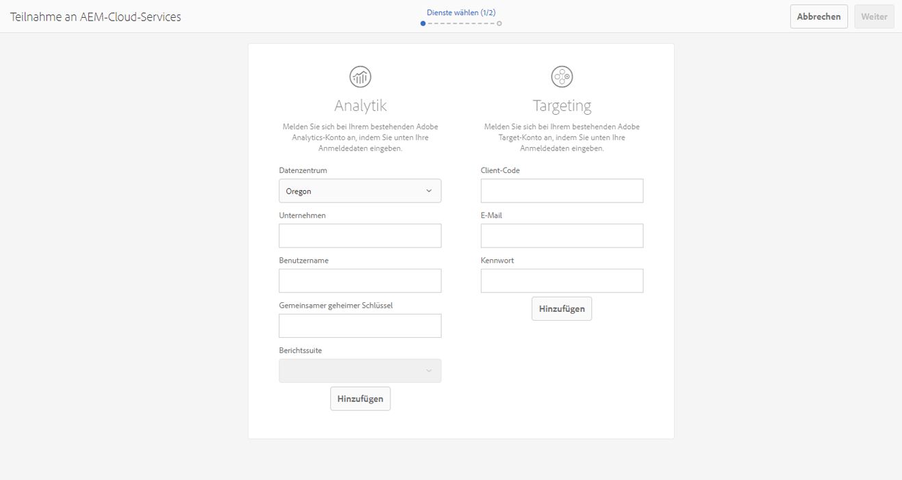
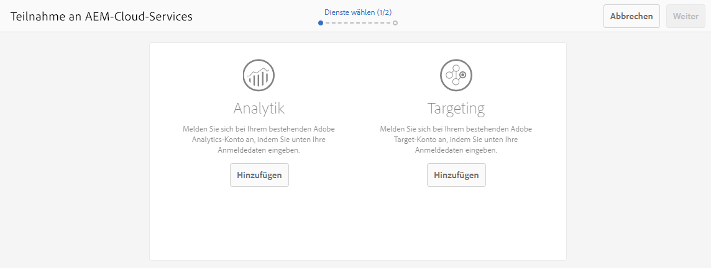

# Opt-in für Adobe Analytics und Adobe Target{#opting-into-adobe-analytics-and-adobe-target}

AEM verfügt über ein Opt-in-Verfahren, das Ihnen die Durchführung der Integration mit Adobe Analytics und Adobe Target erleichtert. Es ist als vorab geladene Aufgabe, die der Administratorbenutzergruppe zugewiesen ist, im Lieferumfang enthalten.

Wenn Sie sich als Administrator anmelden, ist diese Aufgabe (**Analytics &amp; Targeting konfigurieren**) über den [Posteingang](/help/sites-authoring/inbox.md#out-of-the-box-administrative-tasks) verfügbar. Basierend auf den von Ihnen angegebenen Anmeldeinformationen erhalten Sie Hilfe beim Konfigurieren und Integrieren dieser Dienste.

Sie haben für die Konfiguration der Integration folgende Optionen:

* Konfigurieren Sie die Integration über die Aufgabe.

   Sie können dies sofort oder später erledigen. Die Aufgabe verbleibt im Posteingang, bis eine Aktion durchgeführt wird. In beiden Fällen kann die Konfiguration direkt in der Benutzeroberfläche oder mit der Verwendung einer vordefinierten `.properties`-Datei durchgeführt werden.

* Lehnen Sie die Integration ab.

   Erwägen Sie die Verwendung dieser Option, falls Sie es vorziehen, [die Integration manuell zu konfigurieren](/help/sites-administering/marketing-cloud.md). Siehe auch [Integrieren von AEM in Adobe Target und Adobe Analytics mithilfe von DTM](https://helpx.adobe.com/de/experience-manager/using/integrate-digital-marketing-solutions.html).

* Konfigurieren Sie das Setup und die Bereitstellung, indem Sie ein Skript verwenden.

## Konfigurieren der Integration {#configuring-the-integration}

Führen Sie den Opt-in für folgende Integrationen durch:

* Analytics, um die Verwendung der Funktionen für Seiten-Tracking und Analyse zu aktivieren
* Target, um die Verwendung der Personalisierungsfunktionen zu aktivieren 

Für beide Optionen müssen Sie die Benutzerkontoinformationen und die nachzuverfolgenden Seiten angeben.

>[!NOTE]
>
>Optional können Sie die Analytics- und Target-Kontoinformationen mit einer Eigenschaftendatei angeben, die beim Serverstart gelesen wird. Weitere Informationen finden Sie unter [Angeben von Kontoinformationen mit einer Eigenschaftendatei](/help/sites-administering/opt-in.md#providing-account-information-using-a-properties-file).

Beim Opt-in für die Integration werden von AEM die folgenden Aufgaben durchgeführt:

* Erstellen der Cloud-Konfigurationen, die die Verbindungsherstellung mit Analytics und Target ermöglichen
* Erstellen der Frameworks zur Ermittlung der nachzuverfolgenden Daten
* Konfigurieren der Webseiten für die Nutzung dieser Dienste

>[!NOTE]
>
>„AT.js“ ist die standardmäßige Client-Bibliothek. Dies wird über die [Target-Cloud-Service-Konfiguration](/help/sites-administering/target-configuring.md#creating-a-target-cloud-configuration) festgelegt.
>
>Adobe empfiehlt, „AT.js“ als Client-Bibliothek zu verwenden.

Gehen Sie wie folgt vor, um den Opt-in über die vorab geladene Standardaufgabe durchzuführen:

1. Wählen Sie im [Posteingang über **Öffnen** die Aufgabe „Analytics &amp; Targeting konfigurieren“](/help/sites-authoring/inbox.md#taking-action-on-an-item) aus.

   

1. Für Analytics:

   1. Geben Sie die Benutzerkontoinformationen für Analytics ein und klicken Sie dann auf die Schaltfläche **Hinzufügen**.
   1. Die entsprechenden Anmeldeinformationen werden authentifiziert.
   1. Nachdem das Analytics-Konto authentifiziert wurde, können Sie die gewünschte Analytics-Report Suite auswählen. AEM ruft diese Analytics-Report Suites ab. Der Status wird in **Hinzugefügt** geändert.

1. Für Target:

   1. Geben Sie die Benutzerkontoinformationen für Target ein und klicken Sie dann auf die Schaltfläche **Hinzufügen**.
   1. Die entsprechenden Anmeldeinformationen werden authentifiziert. Der Status wird in **Hinzugefügt** geändert.

1. Wählen Sie **Weiter** aus.
1. Wählen Sie die Websites aus, für die Analytics bzw. Target verwendet werden soll.

1. Wählen Sie **Fertig**, um den Vorgang abzuschließen.

   >[!CAUTION]
   >
   >Nachdem Sie den Opt-in für die Konfiguration durchgeführt haben, müssen Sie die betroffenen Websites/Seiten veröffentlichen, um diese Änderungen auf Ihrer Veröffentlichungsinstanz zu replizieren.

## Durchführen des Opt-outs für die Integration {#opting-out-of-the-integration}

Sie können in folgenden Fällen einen Opt-out für die Integration in Analytics und Target durchführen:

* Sie wünschen keine Integration mit diesen Produkten.
* Sie ziehen es vor, die Integrationen manuell zu konfigurieren.

   Informationen zur manuellen Konfiguration der Integrationen finden Sie unter [Integrieren mit Adobe Analytics](/help/sites-administering/adobeanalytics.md) und [Integrieren mit Adobe Target](/help/sites-administering/target.md).

Für den Opt-out müssen Sie die vorab geladene Aufgabe durchführen:

* Wählen Sie im [Posteingang die Option zum **Durchführen** der Aufgabe „Analytics &amp; Targeting konfigurieren“](/help/sites-authoring/inbox.md#taking-action-on-an-item).

## Angeben von Kontoinformationen mit einer Eigenschaftendatei {#providing-account-information-using-a-properties-file}

Installieren Sie eine Eigenschaftendatei, die von AEM beim Serverstart gelesen wird, um die Kontoeigenschaften für die Integration mit Analytics und Target zu konfigurieren. Bei Verwendung der Eigenschaftendatei nutzt der Opt-in-Assistent automatisch die Eigenschaften aus der Datei und die Cloud-Konfiguration wird entsprechend erstellt.

Die Eigenschaftendatei ist eine Textdatei mit dem Namen „marketingcloud.properties“, die Sie im von AEM verwendeten Arbeitsverzeichnis speichern (normalerweise in demselben Verzeichnis wie die JAR-Datei). Die Datei enthält die folgenden Eigenschaften:

* analytics.server: Die URL des von Ihnen genutzten Analytics-Rechenzentrums.
* analytics.company: Das Unternehmen, das Ihrem Analytics-Benutzerkonto zugeordnet ist.
* analytics.username: Ihr Analytics-Benutzername.
* analytics.secret: Das Geheimnis, das Ihrem Analytics-Benutzernamen zugeordnet ist.
* analytics.reportsuite: Der Name der verwendeten Analytics-Report Suite.
* target.clientcode: Der Clientcode, der Ihrem Target-Konto zugeordnet ist.
* target.email: Die E-Mail-Adresse, die Sie zum Authentifizieren Ihres Target-Kontos verwenden.
* target.password: Das Kennwort, das Ihrer E-Mail-Adresse zugeordnet ist.

Eigenschaften und Werte sind jeweils durch ein Gleichheitszeichen (=) voneinander getrennt. Die Analytics-Eigenschaften haben das Präfix `analytics` und die Target-Eigenschaften das Präfix `target`. Geben Sie zum Konfigurieren eines Diensts Werte für alle Eigenschaften des Diensts an. Falls Sie keinen Dienst konfigurieren möchten, geben Sie einfach keine Werte für den Dienst an.

Im folgenden Beispiel enthält die Datei `.properties` die Eigenschaftenwerte zum Erstellen einer Cloud-Konfiguration für Analytics:

```xml
analytics.server=https://test.omniture.com/login/
analytics.company=MyCompany
analytics.username=sbroders
analytics.secret=12345678
analytics.reportsuite=myreportsuite
target.clientcode=
target.email=
target.password=
```

Im folgenden Verfahren wird beschrieben, wie Sie den Opt-in für die Integration mit der Eigenschaftendatei durchführen.

1. Erstellen Sie die Datei `marketingcloud.properties` in dem Arbeitsverzeichnis, das für den AEM-Prozess verwendet wird (Autoreninstanz).

   >[!NOTE]
   >
   >Das Arbeitsverzeichnis ist normalerweise das Verzeichnis, in dem sich die JAR- oder `license.properties`-Datei befindet.
   >
   >Es kann aber auch von der Systemeigenschaft als absoluter Pfad definiert werden:
   >
   >`mac.provisioning.file.container`

1. Fügen Sie die Eigenschaftswerte gemäß Ihren Analytics- bzw. Target-Konten hinzu.
1. Starten Sie den Server bzw. starten Sie ihn neu und melden Sie sich dann mit einem Administratorkonto an.
1. Öffnen Sie die Aufgabe „Analytics &amp; Targeting konfigurieren“, wie unter [Konfigurieren der Integration](/help/sites-administering/opt-in.md#configuring-the-integration) beschrieben. Anstatt Ihre Kontoinformationen anzufordern, verwendet der Assistent die Werte aus der Datei `.properties`.

   Wählen Sie **Hinzufügen** für den entsprechenden Dienst und fahren Sie anschließend mit dem Assistenten fort.

   

## Informationen zu Cloud-Konfigurationen {#about-the-cloud-configurations}

Wenn Sie die Integration mit Analytics und Target konfigurieren, erstellt AEM automatisch die erforderlichen Cloud-Konfigurationen und Frameworks. Die Analytics-Cloud-Konfiguration wird beispielsweise als bereitgestelltes Analytics-Konto bezeichnet.

Es ist nicht notwendig, die Cloud-Konfigurationen zu ändern. Sie können aber die Frameworks wie gewünscht konfigurieren. (Siehe [Zuordnen von Komponentendaten zu Adobe Analytics-Eigenschaften](/help/sites-administering/adobeanalytics-mapping.md) und [Hinzufügen einem Zielgruppe-Framework](/help/sites-administering/target.md).)

>[!NOTE]
>
>Wenn Sie den Opt-in für den Adobe Target-Konfigurationsassistenten durchführen, wird die „präzise Zielgruppenerfassung“ aktiviert.
>
>Präzise Zielgruppenerfassung bedeutet, dass für die Cloud Service-Konfiguration gewartet wird, bis das Laden des Kontexts erfolgt ist, bevor der Inhalt geladen wird. Daher kann es in Bezug auf die Leistung bei der präzisen Zielgruppenerfassung zu einer Verzögerung von einigen Millisekunden kommen, bevor das Laden des Inhalts erfolgt.
>
>Die präzise Zielgruppenerfassung ist auf der Autoreninstanz immer aktiviert. Auf der Veröffentlichungsinstanz können Sie die präzise Zielgruppenerfassung aber global deaktivieren, indem Sie in der Cloud Service-Konfiguration das Häkchen neben „Präzise Zielgruppenerfassung“ entfernen (**http://localhost:4502/etc/cloudservices.html**). Außerdem können Sie die präzise Zielgruppenerfassung unabhängig von Ihrer Einstellung in der Cloud Service-Konfiguration auch für einzelne Komponenten ein- oder ausschalten.
>
>Wenn Sie Komponenten als Ziel ***bereits*** angegeben haben und diese Einstellung dann ändern, wirken sich Ihre Änderungen nicht auf diese Komponenten aus. Sie müssen alle Änderungen an dieser Komponente direkt vornehmen.

>[!CAUTION]
>
>Wenn Sie den Opt-in für die Analytics-Konfiguration durchführen und eine bestimmte `reportsuite` ausgewählt ist, wird das Framework auf den Ausführungsmodus für die Veröffentlichung beschränkt. Dies bedeutet, dass das Tracking nur für die Veröffentlichungsinstanz funktioniert.
>
>Falls das Tracking auch für eine Autoreninstanz benötigt wird, sollte der Wert in `all` geändert werden.

## Konfigurieren des Setups und der Bereitstellung per Skript {#configuring-the-setup-and-provisioning-via-script}

Es kann sein, dass Sie als Administrator das Setup und die Bereitstellung per Skript auslösen möchten, anstatt manuell den Assistenten durchlaufen zu müssen. Dies erreichen Sie wie folgt:

* Senden Sie eine POST-Anforderung mit den erforderlichen Parametern an **/libs/cq/cloudservicesprovisioning/content/autoprovisioning.json**.

Es hängt von Folgendem ab, welche Parameter Sie senden müssen:

* Wenn Sie die Datei **marketingcloud.properties** verwenden möchten, in die alle erforderlichen Anmeldeinformationen eingefügt sind, müssen Sie die folgenden Parameter senden:

   * `automaticProvisioning`= `true`
   * `servicename`=  `analytics|target`
   * `path`=Pfad zu einer AEM-Seite, um die erstellten Cloud Service-Konfigurationen anzufügen

   Eine Curl-Anforderung, mit der sowohl die Analytics- als auch die Target-Konfiguration erstellt und an die Seite „we-retail“ angefügt wird, lautet beispielsweise wie folgt:

   ```shell
   curl -v -u admin:admin -X POST -d"automaticProvisioning=true&servicename=target&servicename=analytics&path=/content/we-retail" http://localhost:4502/libs/cq/cloudservicesprovisioning/content/autoprovisioning.json
   ```

* Wenn Sie die Datei **marketingcloud.properties** nicht verwenden möchten, müssen Sie die Anmeldeinformationen sowie die Parameter senden. Beispiel:

   * automateProvisioning= `true`
   * servicename= `analytics|target`
   * path=Pfad zu einer AEM-Seite, um die erstellten Cloud Service-Konfigurationen anzufügen; es können mehrere Pfade definiert werden
   * analytics.server= `https://servername`
   * analytics.Firma= `Name of company`
   * analytics.username= `me`
   * analytics.secret= `secret`
   * analytics.reportsuite= `we-retail`
   * Zielgruppe.clientcode= `mycompany`
   * Zielgruppe.email= `me@adobe.com`
   * Zielgruppe.password= `password`

   In diesem Fall würde die Curl-Anforderung, mit der die Analytics- und Target-Konfiguration erstellt und an die Seite „we-retail“ angefügt wird, wie folgt lauten:

   ```shell
   curl -v -u admin:admin -X POST -d"automaticProvisioning=false&servicename=target&servicename=analytics&path=/content/we-retail&analytics.server=https://servername/&analytics.company=Name of company&analytics.username=me&analytics.secret=secret&analytics.reportsuite=weretail&target.clientcode=mycompany&target.email=me@adobe.com&target.password=password" http://localhost:4502/libs/cq/cloudservicesprovisioning/content/autoprovisioning.json
   ```

