# Arbeiten mit Paketen{#how-to-work-with-packages}

Pakete bieten Ihnen die Möglichkeit, Repository-Inhalte zu importieren und zu exportieren. Sie können Pakete beispielsweise verwenden, um neue Funktionen zu installieren, Inhalte zwischen Instanzen auszutauschen und Repository-Inhalte zu sichern.

Sie können von den folgenden Seiten aus auf Pakete zugreifen und/oder Pakete verwalten:

* [Package Manager](#package-manager), mit dessen Hilfe Sie die Pakete auf der lokalen AEM-Instanz verwalten.

* [Package Share](#package-share), einem zentralen Server, auf dem sowohl öffentlich verfügbare Pakete als auch private Pakete Ihrer Firma gespeichert sind. Die öffentlichen Pakete können Hotfixes, neue Funktionen, Dokumentationen usw. enthalten.

Sie können Pakete zwischen Package Manager, Package Share und Ihrem Dateisystem übertragen.

## Was sind Pakete? {#what-are-packages}

Ein Paket ist eine Zip-Datei mit Repository-Inhalten in Form einer Dateisystem-Serialisierung (auch „Vault“-Serialisierung genannt). Dies ermöglicht eine benutzerfreundliche und einfach zu bearbeitende Darstellung der Dateien und Ordner.

Pakete enthalten sowohl Seiteninhalte als auch projektspezifische Inhalte, die mithilfe von Filtern ausgewählt werden.

Ein Paket enthält auch Vault-Metadaten, einschließlich der Filterdefinitionen und Import-Konfigurationsinformationen. Zusätzliche Inhaltseigenschaften (die nicht für die Paketextrahierung verwendet werden) können in das Paket eingeschlossen werden, z. B. eine Beschreibung, ein visuelles Bild oder ein Symbol. Diese Eigenschaften dienen nur dem Benutzer des Inhaltspakets und nur zu Informationszwecken.

>[!NOTE]
>
>Pakete repräsentieren die aktuelle Version der Inhalte zum Zeitpunkt der Erstellung des Pakets. Sie umfassen keine früheren Versionen der Inhalte, die AEM im Repository speichert.

Sie können die folgenden Aktionen hinsichtlich der Pakete ausführen:

* Neue Pakete erstellen und dabei Paketeinstellungen und Filter nach Bedarf definieren
* Paketinhalte in einer Vorschau anzeigen (vor der Erstellung)
* Pakete erstellen
* Paketinformationen anzeigen
* Inhalte des Pakets anzeigen (nach der Erstellung)
* Definition vorhandener Pakete ändern
* Vorhandene Pakete neu erstellen
* Pakete neu eingliedern
* Pakete von AEM in das Dateisystem herunterladen
* Hochladen von Paketen aus Ihrem Dateisystem in Ihre lokale AEM-Instanz
* Validieren von Paketinhalten vor der Installation
* Führen Sie eine Trockenausführungsinstallation durch
* Pakete installieren (AEM installiert Pakete nach dem Hochladen nicht automatisch)
* Pakete löschen
* Pakete wie Hotfixes aus der Package Share-Bibliothek herunterladen
* Pakete in den firmeninternen Bereich der Package Share-Bibliothek hochladen

## Paketinformationen {#package-information}

Eine Paketdefinition umfasst verschiedene Arten von Informationen:

* [Paketeinstellungen](#package-settings)
* [Paketfilter](#package-filters)
* [Paket-Screenshots](#package-screenshots)
* [Paketsymbole](#package-icons)

### Paketeinstellungen {#package-settings}

Sie können eine Vielzahl von Paketeinstellungen bearbeiten, um Aspekte wie die Paketbeschreibung, verwandte Fehler, Abhängigkeiten und Anbieterinformationen zu definieren.

Rufen Sie das Dialogfeld **Paketeinstellungen** über die Schaltfläche **Bearbeiten** auf, wenn Sie ein Paket [erstellen](#creating-a-new-package) oder [bearbeiten](#viewing-and-editing-package-information). Es enthält drei zur Konfiguration dienende Registerkarten. Klicken Sie nach dem Vornehmen der Änderungen auf **OK**, um diese Einstellungen zu speichern.

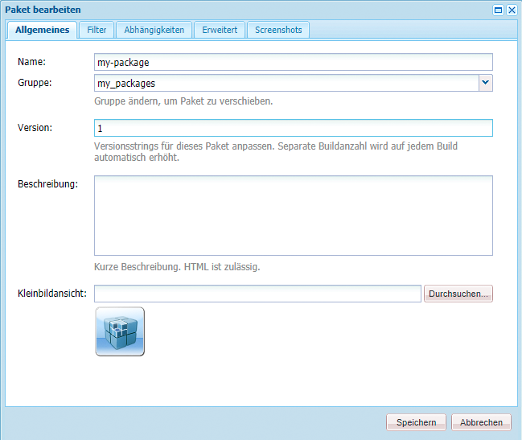

| **Feld** | **Beschreibung** |
|---|---|
| Name | Der Name des Pakets. |
| Gruppe | Der Name der Gruppe, der das Paket hinzugefügt werden soll, um Pakete zu organisieren. Geben Sie den Namen für eine neue Gruppe ein oder wählen Sie eine vorhandene Gruppe aus. |
| Version | Für die benutzerdefinierte Version zu verwendender Text. |
| Beschreibung | Eine kurze Beschreibung des Pakets. HTML-Markup kann zum Formatieren verwendet werden. |
| Miniatur | Das Symbol, das mit der Paketliste angezeigt wird. Klicken Sie auf „Durchsuchen“, um eine lokale Datei auszuwählen. |

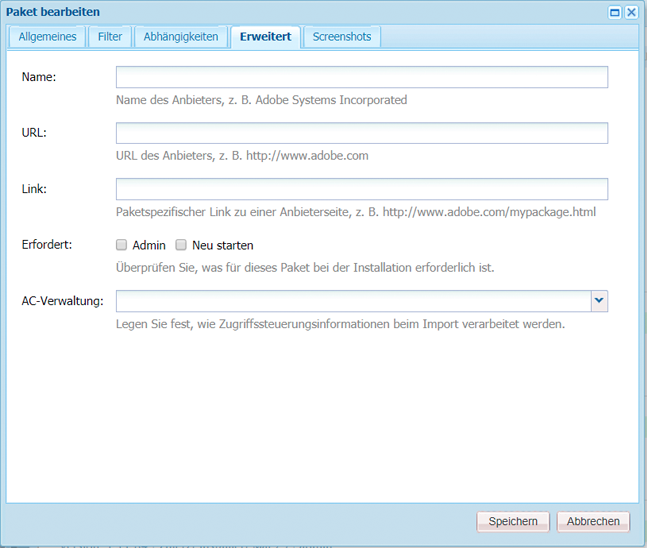

<table>
 <tbody>
  <tr>
   <th><strong>Feld</strong></th>
   <th><strong>Beschreibung</strong></th>
   <th><strong>Format/Beispiel</strong></th>
  </tr>
  <tr>
   <td>Name</td>
   <td>Name des Anbieters.</td>
   <td><em>AEM Geometrixx<br /> </em></td>
  </tr>
  <tr>
   <td>URL</td>
   <td>URL des Anbieters.</td>
   <td><em>https://www.aem-geometrixx.com</em></td>
  </tr>
  <tr>
   <td>Verknüpfung</td>
   <td>Paketspezifischer Link zu einer Anbieterseite.</td>
   <td><em>https://www.aem-geometrixx.com/mypackage.html</em></td>
  </tr>
  <tr>
   <td>Erfordert<br /> </td>
   <td>
    <ul>
     <li>Admin: Wählen Sie diese Option aus, wenn das Paket nur von einem Konto mit Administratorrechten installiert werden kann.</li>
     <li>Neu starten: Wählen Sie diese Option aus, wenn der Server nach der Installation des Pakets neu gestartet werden muss.</li>
    </ul> </td>
   <td> </td>
  </tr>
  <tr>
   <td>AC-Verwaltung</td>
   <td><p>Legen Sie fest, wie die im Paket definierten Zugriffssteuerungsinformationen beim Importieren des Pakets verarbeitet werden:</p>
    <ul>
     <li><strong>Groß-/Kleinschreibung</strong></li>
     <li><strong>Überschreiben</strong></li>
     <li><strong>Zusammenführen</strong></li>
     <li><strong>Clear</strong></li>
     <li><strong>Zusammenführung beibehalten</strong></li>
    </ul> <p>Der Standardwert lautet <strong>Ignorieren</strong>.</p> </td>
   <td>
    <ul>
     <li><strong>Ignorieren</strong>: Die ACLs werden im Repository beibehalten.</li>
     <li><strong>Überschreiben</strong>: Die ACLs werden im Repository überschrieben.</li>
     <li><strong>Zusammenführen</strong>: Beide ACL-Sätze werden zusammengeführt.</li>
     <li><strong>Entfernen</strong>: Die ACLs werden entfernt.</li>
     <li><strong>Zusammenführung beibehalten</strong>: Die Zugriffssteuerung im Inhalt wird mit der im Paket zusammengeführt, indem die Zugriffssteuerungseinträge von Prinzipalen, die nicht im Inhalt vorhanden sind, hinzugefügt werden.</li>
    </ul> </td>
  </tr>
 </tbody>
</table>

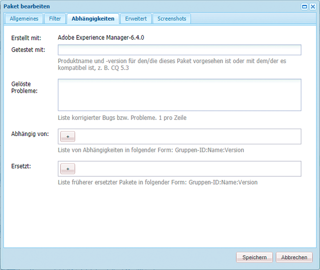

| **Feld** | **Beschreibung** | **Format/Beispiel** |
|---|---|---|
| Testen mit | Der Produktname und die Version, auf die dieses Paket ausgerichtet ist oder mit der es kompatibel ist. | *AEM 6* |
| Behobene Fehler/Probleme | Ein Textfeld, mit dem Sie Details zu Fehlern auflisten können, die mit diesem Paket behoben wurden. Listen Sie die einzelnen Fehler in separaten Zeilen auf. | bug-nr-Zusammenfassung |
| Abhängig von | Listet Abhängigkeitsinformationen auf, die beachtet werden müssen, wenn andere Pakete benötigt werden, damit das aktuelle Paket erwartungsgemäß ausgeführt werden kann. Dieses Feld ist bei Verwendung von Hotfixes wichtig. | groupId:name:version |
| Ersetzungen | Eine Liste veralteter Pakete, die dieses Paket ersetzt. Überprüfen Sie vor der Installation, ob dieses Paket alle erforderlichen Inhalte von den veralteten Paketen beinhaltet, sodass keine Inhalte überschrieben werden. | groupId:name:version |

### Paketfilter {#package-filters}

Filter identifizieren die Repository-Knoten, die in das Paket eingeschlossen werden sollen. Eine **Filterdefinition** legt die folgenden Informationen fest:

* Den **Stammpfad** der einzufügenden Inhalte
* **Regeln** , die bestimmte Knoten unterhalb des Stammpfads einschließen oder ausschließen.

Filter können keine oder mehrere Regeln enthalten. Wenn keine Regeln definiert sind, enthält das Paket alle Inhalte unter dem Stammpfad.

Sie können eine oder mehrere Filterdefinitionen für ein Paket definieren. Verwenden Sie mehr als einen Filter, um Inhalte aus mehreren Stammpfaden einzuschließen.

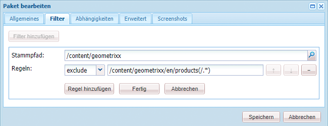

In der folgenden Tabelle sind diese Regeln und einige Beispiele beschrieben:

<table>
 <tbody>
  <tr>
   <th> Regeltyp</th>
   <th>Beschreibung </th>
   <th>Beispiel </th>
  </tr>
  <tr>
   <td> include</td>
   <td>Sie können einen Pfad definieren oder einen regulären Ausdruck verwenden, um alle Knoten anzugeben, die Sie einschließen möchten.<br /> <br /> Wird ein Verzeichnis eingeschlossen:
    <ul>
     <li>werden dieses Verzeichnis <i>und</i> alle Dateien und Ordner in diesem Verzeichnis (d. h. die gesamte Unterstruktur) eingeschlossen</li>
     <li>werden andere Dateien oder Ordner unter dem angegebenen Stammpfad <strong>nicht</strong> eingeschlossen</li>
    </ul> </td>
   <td>/libs/sling/install(/.*)? </td>
  </tr>
  <tr>
   <td> exclude</td>
   <td>Sie können einen Pfad angeben oder einen regulären Ausdruck verwenden, um alle Knoten anzugeben, die Sie ausschließen möchten.<br /> <br /> Wird ein Verzeichnis ausgeschlossen, werden dieses Verzeichnis <i>und</i> alle Dateien und Ordner in diesem Verzeichnis (d. h. die gesamte Unterstruktur) ausgeschlossen.<br /> </td>
   <td>/libs/wcm/foundation/components(/.*)?</td>
  </tr>
 </tbody>
</table>

>[!NOTE]
>
>Ein Paket kann mehrere Filterdefinitionen enthalten, sodass sich Knoten von verschiedenen Orten einfach in einem Paket kombinieren lassen.

Paketfilter werden in den meisten Fällen bei der [Erstellung des Pakets](#creating-a-new-package) definiert, sie können aber auch zu einem späteren Zeitpunkt bearbeitet werden (anschließend sollte das Paket neu erstellt werden).

### Paket-Screenshots {#package-screenshots}

Sie können Screenshots an das Paket anhängen, um eine visuelle Darstellung vom Erscheinungsbild der Inhalte bereitzustellen. So können Sie beispielsweise Screenshots von neuen Funktionen bereitstellen.

### Paketsymbole {#package-icons}

Sie können auch ein Symbol an das Paket anhängen, um eine schnelle visuelle Darstellung von dem bereitzustellen, was im Paket enthalten ist. Dieses wird dann in der Paketliste angezeigt und ermöglicht Ihnen, das Paket oder die Klasse des Pakets auf einfache Weise zu identifizieren.

Da ein Paket ein Symbol enthalten kann, gelten folgende Konventionen für offizielle Pakete:

>[!NOTE]
>
>Um Verwirrungen zu vermeiden, sollten Sie ein aussagekräftiges Symbol für das Paket und keines der offiziellen Symbole verwenden.

Offizielles Hotfix-Paket:


Offizielles AEM-Installations- oder AEM-Erweiterungspaket:

Offizielle Funktionspakete:


## Package Manager {#package-manager}

Der Package Manager verwaltet die Pakete auf der lokalen AEM-Installation. Nachdem Sie [die erforderlichen Berechtigungen zugewiesen haben,](#permissions-needed-for-using-the-package-manager) können Sie den Package Manager für verschiedene Aktionen, u. a. zum Konfigurieren, Erstellen, Herunterladen und Installieren von Paketen, verwenden. Folgende wichtige Elemente sind zu konfigurieren:

* [Paketeinstellungen](#package-settings)
* [Paketfilter](#package-filters)

### Für die Verwendung des Package Manager erforderlichen Berechtigungen {#permissions-needed-for-using-the-package-manager}

Wenn Sie Benutzern das Recht zum Erstellen, Ändern, Hochladen und Installieren von Paketen gewähren wollen, müssen Sie ihnen die entsprechenden Berechtigungen für die folgenden Orte zuweisen:

* **/etc/packages** (umfassende Rechte außer „Löschen“)
* den Knoten, der die Paketinhalte beinhaltet

Weitere Informationen zum Ändern von Berechtigungen finden Sie in [Festlegen von Berechtigungen](/help/sites-administering/security.md#setting-page-permissions).

### Erstellen eines neuen Pakets {#creating-a-new-package}

So erstellen Sie eine neue Paketdefinition:

1. On the AEM Welcome screen, click **Packages** (or from the **Tools** console double-click on **Packages**).

1. Wählen Sie dann **Package Manager** aus.
1. Klicken Sie auf **Paket erstellen**.

   >[!NOTE]
   >
   >Wenn Ihre Instanz über viele Pakete verfügt, ist möglicherweise eine Ordnerstruktur vorhanden, sodass Sie vor der Erstellung des neuen Pakets zum erforderlichen Zielordner navigieren können.

1. Im Dialogfeld:

   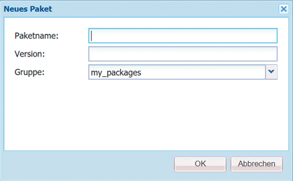

   Geben Sie Folgendes ein:

   * **Gruppenname**

      Der Name der Zielgruppe (oder des Ordners). Gruppen sind für die Organisation Ihrer Pakete vorgesehen.

      Das System legt einen Ordner für die Gruppe an, sollte sie noch nicht vorhanden sein. Wenn Sie keinen Gruppennamen eingeben, wird das Paket in der Hauptpaketliste („Startseite“ > „Pakete“) erstellt.

   * **Paket-Name**

      Der Name des neuen Pakets. Wählen Sie einen beschreibenden Namen aus, über den Sie (und andere) die Inhalte des Pakets leicht identifizieren können.

   * **Version**

      Ein Textfeld zur Eingabe einer Version. Diese wird an den Paketnamen angehängt, um den Namen der ZIP-Datei zu bilden.
   Klicken Sie auf **OK**, um das Paket zu erstellen.

1. AEM listet das neue Paket im entsprechenden Gruppenordner auf.

   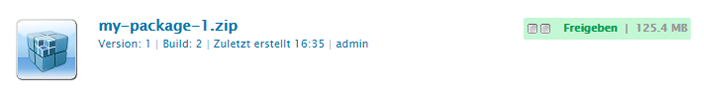

   Klicken Sie auf das Symbol oder den Paketnamen, um es zu öffnen.

   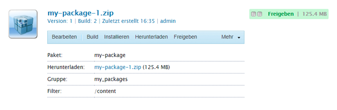

   >[!NOTE]
   >
   >Sie können ggf. zu einem späteren Zeitpunkt zu dieser Seite zurückkehren.

1. Klicken Sie auf **Bearbeiten**, um die [Paketeinstellungen](#package-settings) zu bearbeiten.

   Hier können Sie Informationen hinzufügen und/oder bestimmte Einstellungen festlegen. Dazu gehören z. B. eine Beschreibung, das [Symbol](#package-icons), verwandte Fehler und das Hinzufügen von Anbieterdetails.

   Klicken Sie auf **OK**, wenn Sie mit der Bearbeitung der Einstellungen fertig sind.

1. Fügen Sie dem Paket bei Bedarf **[Screenshots](#package-screenshots)**hinzu. Eine Instanz ist verfügbar, wenn das Paket erstellt wurde. Fügen Sie weitere hinzu, falls dies erforderlich sein sollte, indem Sie die Option **Paket-Screenshot**im Sidekick verwenden.

   Fügen Sie das Ist-Bild hinzu, indem Sie auf die Bildkomponente im Bereich **Screenshots** doppelklicken, ein Bild hinzufügen und auf **OK** klicken.

1. Definieren Sie die **[Paketfilter](#package-filters)**, indem Sie die Instanzen der **Filterdefinition**aus dem Sidekick ziehen und dann darauf doppelklicken, um sie zur Bearbeitung zu öffnen:

   

   Geben Sie Folgendes an:

   * **Stammpfad** Die zu packenden Inhalte. Dabei kann es sich um den Stamm einer Unterstruktur handeln.
   * **Regeln** Regeln sind optional. Bei einfachen Paketdefinitionen ist es nicht notwendig, Regeln zum Ein- oder Ausschließen festzulegen.

      Bei Bedarf können Sie Regeln zum [**Einschließen **oder** Ausschließen **](#package-filters)definieren, um die Paketinhalte genau festzulegen.

      Fügen Sie Regeln mithilfe des **+**-Symbols hinzu und entfernen Sie Regeln mithilfe des **-**-Symbols. Regeln werden entsprechend ihrer Reihenfolge angewendet. Positionieren Sie sie daher mit den Schaltflächen **Nach oben** und **Nach unten** wie gewünscht.
   Klicken Sie dann auf **OK**, um den Filter zu speichern.

   >[!NOTE]
   >
   >Sie können so viele Filterdefinitionen verwenden, wie Sie brauchen. Achten Sie jedoch darauf, dass sie nicht in Konflikt miteinander stehen. Vergewissern Sie sich mithilfe der **Vorschau**, welche Inhalte im Paket enthalten sind.

1. Sie können mithilfe der **Vorschau** feststellen, welche Inhalte im Paket enthalten sind. Bei Auswahl dieser Option wird der Erstellungsprozess in einem Probelauf durchgeführt und anschließend alles aufgelistet, was zum Paket hinzugefügt wird, wenn es tatsächlich erstellt wird.
1. [Sie können nun das Paket ](#building-a-package)erstellen.

   >[!NOTE]
   >
   >Es ist nicht zwingend erforderlich, das Paket an diesem Punkt zu erstellen, Sie können dies auch zu einem späteren Zeitpunkt tun.

### Erstellen eines Pakets {#building-a-package}

In den meisten Fällen wird das Paket erstellt, wenn [die Paketdefinition erstellt wird](#creating-a-new-package), Sie können aber auch zu einem späteren Zeitpunkt zurückkehren, um das Paket entweder zu erstellen oder neu zu erstellen. Dies ist beispielsweise dann nützlich, wenn sich die Inhalte innerhalb des Repositorys geändert haben.

>[!NOTE]
>
>Bevor Sie das Paket erstellen, kann es hilfreich sein, die Inhalte des Pakets in einer Vorschau anzuzeigen. Klicken Sie dazu auf **Vorschau**.

1. Öffnen Sie die Paketdefinition im **Package Manager** (klicken Sie auf das Paketsymbol oder den Paketnamen).

1. Klicken Sie auf **Erstellen**. Es wird ein Dialogfeld mit der Aufforderung zur Bestätigung angezeigt, dass Sie das Paket erstellen wollen.

   >[!NOTE]
   >
   >Dies ist insbesondere dann wichtig, wenn Sie ein Paket neu erstellen, da die Paketinhalte dabei überschrieben werden.

1. Klicken Sie auf **OK**. AEM erstellt das Paket und listet währenddessen alle Inhalte auf, die dem Paket hinzugefügt werden. Nachdem der Vorgang abgeschlossen ist, zeigt AEM eine Bestätigung an, dass das Paket erstellt wurde. Zudem aktualisiert AEM die Paketlisteninformationen (wenn Sie das Dialogfeld schließen).

### Neueingliedern eines Pakets {#rewrapping-a-package}

Nach der Erstellung kann das Paket bei Bedarf neu eingegliedert werden.

Bei einer Neueingliederung werden die Paketinformationen *ohne* Änderung der Paketinhalte geändert. Zu den Paketinformationen gehören die Miniaturansicht, die Beschreibung usw., d. h. alle Informationen, die Sie im Dialogfeld **Paketeinstellungen** bearbeiten können (klicken Sie zum Öffnen des Dialogfelds auf **Bearbeiten**).

Hauptsächlich wird die Neueingliederungsfunktion bei der Vorbereitung eines Pakets für Package Share eingesetzt. Es könnte beispielsweise sein, dass Sie ein vorhandenes Paket haben, das Sie für andere freigeben möchten. Bevor Sie dies tun, möchten Sie eine Miniaturansicht und eine Beschreibung hinzufügen. Anstatt das gesamte Paket mit allen Funktionen neu zu erstellen (was möglicherweise einige Zeit in Anspruch nimmt und das Risiko birgt, dass das Paket nicht mit dem Original identisch ist), können Sie es neu eingliedern und nur die Miniaturansicht und die Beschreibung hinzufügen.

1. Öffnen Sie die Paketdefinition im **Package Manager** (klicken Sie auf das Paketsymbol oder den Paketnamen).

1. Klicken Sie auf **Bearbeiten** und aktualisieren Sie die **[Paketeinstellungen](#package-settings)**nach Bedarf. Klicken Sie zum Speichern auf **OK**.

1. Klicken Sie auf **Erneut verpacken**. Daraufhin wird ein Bestätigungsdialogfeld angezeigt.

### Anzeigen und Bearbeiten von Paketinformationen {#viewing-and-editing-package-information}

So zeigen Sie Informationen zu einer Paketdefinition an oder bearbeiten sie:

1. Navigieren Sie im Package Manager zum anzuzeigenden Paket.
1. Klicken Sie auf das Paketsymbol des anzuzeigenden Pakets. Daraufhin wird die Paketseite aufgerufen, auf der Informationen zur Paketdefinition aufgelistet sind:

   

   >[!NOTE]
   >
   >Sie können das Paket über diese Seite auch bearbeiten und bestimmte Aktionen hinsichtlich des Pakets durchführen.
   >
   >Welche Schaltflächen verfügbar sind, hängt davon ab, ob das Paket bereits erstellt wurde oder nicht.

1. **Wurde das Paket bereits erstellt, klicken Sie auf „Inhalte“, woraufhin ein Fenster mit einer Liste der gesamten Inhalte des Pakets geöffnet wird:**

### Anzeigen von Paketinhalten und Testen der Installation {#viewing-package-contents-and-testing-installation}

Nach der Erstellung eines Pakets können Sie dessen Inhalte anzeigen:

1. Navigieren Sie im Package Manager zum anzuzeigenden Paket.
1. Klicken Sie auf das Paketsymbol des anzuzeigenden Pakets. Daraufhin wird die Paketseite aufgerufen, auf der Informationen zur Paketdefinition aufgelistet sind.

1. Klicken Sie zum Anzeigen der Inhalte auf **Inhalte**, woraufhin ein Fenster mit einer Liste der gesamten Inhalte des Pakets geöffnet wird:

   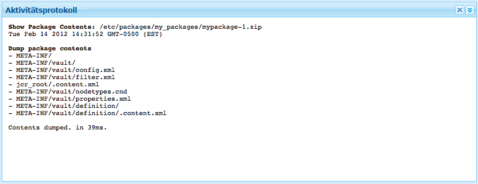

1. Klicken Sie auf **Testinstallation**, um einen Probedurchlauf der Installation durchzuführen. Nachdem Sie die Aktion bestätigt haben, wird ein Fenster geöffnet, in dem die Ergebnisse wie bei einer echten Installation angezeigt werden:

   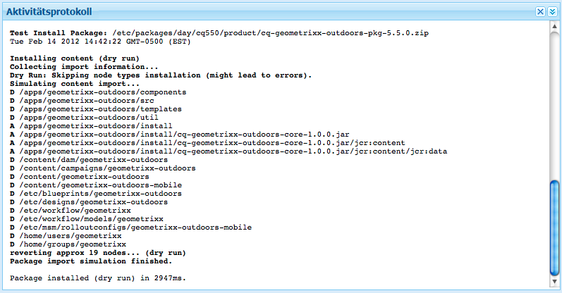

### Herunterladen von Paketen in das Dateisystem {#downloading-packages-to-your-file-system}

In diesem Abschnitt wird beschrieben, wie Sie mit dem **Package Manager** ein Paket von AEM in das Dateisystem herunterladen.

>[!NOTE]
>
>Informationen zum Herunterladen von Hotfixes, Funktionspaketen sowie Paketen aus dem öffentlichen Bereich und dem firmeninternen Bereich von Package Share finden Sie in [Package Share](#package-share).
>
>Sie können von Package Share aus:
>
>* Pakete von [Package Share direkt in die lokale AEM-Instanz herunterladen](#downloading-and-installing-packages-from-package-share).
   >  Nach dem Download wird das Paket in das Repository importiert. Anschließend können Sie es mithilfe des **Package Managers** sofort auf der lokalen Instanz installieren. Diese Pakete enthalten Hotfixes und andere gemeinsame Pakete.
   >
   >
* Pakete von [Package Share in das Dateisystem herunterladen](#downloading-packages-to-your-file-system-from-package-share).
>


1. On the AEM Welcome screen, click **Packages**, then select **Package Manager**.
1. Navigieren Sie zum Paket, das Sie herunterladen möchten.

   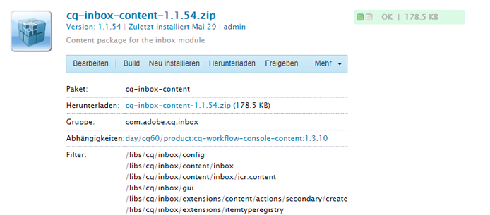

1. Klicken Sie auf den Link, der sich aus dem Namen der ZIP-Datei (unterstrichen) für das Paket ergibt, das Sie herunterladen möchten. Beispiel: `export-for-offline.zip`.

   AEM lädt das Paket auf Ihren Computer herunter (mit einem standardmäßigen Browser-Downloaddialogfeld).

### Hochladen von Paketen von dem Dateisystem {#uploading-packages-from-your-file-system}

Beim Hochladen von Paketen können Sie ein Paket aus Ihrem Dateisystem in den AEM Package Manager hochladen.

>[!NOTE]
>
>See [Uploading packages to the company-internal Package Share](#uploading-packages-to-the-company-internal-package-share) to upload a package to your company&#39;s private area of Package Share.

So laden Sie ein Paket hoch:

1. Navigieren Sie zum **Package Manager**. Klicken Sie dann auf den Gruppenordner, in den Sie das Paket hochladen wollen.

   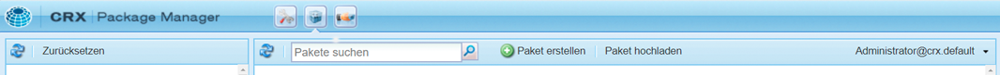

1. Klicken Sie auf **Paket hochladen**.

   

   * **File**

      **Sie können entweder den Dateinamen direkt eingeben oder die** Durchsuchen... , um das gewünschte Paket aus Ihrem lokalen Dateisystem auszuwählen (nach Auswahl klicken Sie auf **OK**).

   * **Hochladen erzwingen**

      Wenn bereits ein Paket mit diesem Namen vorhanden ist, können Sie auf dieses klicken, um das Hochladen zu erzwingen (und das vorhandene Paket zu überschreiben).
   Klicken Sie auf **OK**, damit das neue Paket hochgeladen und in der Package Manager-Liste angezeigt wird.

   >[!NOTE]
   >
   >Denken Sie daran, [das Paket zu installieren](#installing-packages), damit die Inhalte in AEM verfügbar sind.

### Validieren von Paketen {#validating-packages}

Vor der Installation eines Pakets sollten Sie seinen Inhalt überprüfen. Because packages can modify overlaid files under `/apps` and/or add, modify, and remove ACLs, it is often useful to validate these changes before installing.

#### Validierungsoptionen {#validation-options}

Der Validierungsmechanismus kann folgende Merkmale des Pakets überprüfen:

* OSGi-Paketimporte
* Überlagerungen
* ACLs

Diese Optionen werden nachfolgend beschrieben.

* **OSGi-Paketimporte validieren**

   **Prüfumfang**

   Diese Validierung prüft das Paket auf JAR-Dateien (OSGi-Bundles), extrahiert deren `manifest.xml`-Datei (die die versionierten Abhängigkeiten enthält, die für das OSGi-Bundle erforderlich sind) und stellt sicher, dass die AEM-Instanz die Abhängigkeiten mit den richtigen Versionen exportiert.

   **Berichterstellung**

   Any versioned dependencies that cannot be satisfied by the AEM instance are listed in the **Activity Log** of the Package Manager.

   **Fehlerstatus**

   Sind die Abhängigkeiten nicht erfüllt, werden die OSGi-Bundles im Paket mit diesen Abhängigkeiten nicht gestartet. Dies führt zu einer fehlerhaften Anwendungsbereitstellung, da alle auf dem nicht gestarteten OSGi-Bundle basierenden Prozesse nicht ordnungsgemäß funktionieren.

   **Fehlerbehebung**

   Um die Fehler zu beheben, die auf OSGi-Bundles mit nicht erfüllten Abhängigkeiten basieren, muss die Abhängigkeitsversion in diesen Bundles angepasst werden.

* **Überlagerungen bestätigen**

   **Prüfumfang**

   Diese Validierung ermittelt, ob das zu installierende Paket eine Datei enthält, die bereits in der AEM-Zielinstanz überlagert ist.

   For example, given an existing overlay at `/apps/sling/servlet/errorhandler/404.jsp`, a package that contains `/libs/sling/servlet/errorhandler/404.jsp`, such that it will change the existing file at `/libs/sling/servlet/errorhandler/404.jsp`.

   **Berichterstellung**

   Solche Überlagerungen werden im **Aktivitätsprotokoll** von Package Manager beschrieben.

   **Fehlerstatus**

   Ein Fehlerstatus bedeutet, dass das Paket versucht, eine bereits überlagerte Datei bereitzustellen. Die Änderungen im Paket werden somit durch die Überlagerung überschrieben (und „ausgeblendet“) und nicht umgesetzt.

   **Fehlerbehebung**

   To resolve this issue, the maintainer of the of the overlay file in `/apps` must review the changes to the overlaid file in `/libs` and incorporate the changes as needed into the overlay ( `/apps`), and redeploy the overlaid file.

   >[!NOTE]
   >
   >Beachten Sie, dass der Überprüfungsmechanismus nicht miteinander in Einklang gebracht werden kann, wenn der überlagerte Inhalt ordnungsgemäß in die Überlagerungsdatei integriert wurde. Daher berichtet diese Validierung auch weiterhin über Konflikte, selbst wenn die erforderlichen Änderungen vorgenommen wurden.

* **ACLs bestätigen**

   **Prüfumfang**

   Diese Validierung prüft, welche Berechtigungen hinzugefügt werden, wie diese verarbeitet werden (zusammenführen/ersetzen) und ob sie sich auf aktuelle Berechtigungen auswirken.

   **Berichterstellung**

   Die Berechtigungen werden im **Aktivitätsprotokoll** von Package Manager beschrieben.

   **Fehlerstatus**

   Die Angabe von expliziten Fehlern ist nicht möglich. Die Validierung gibt lediglich an, ob durch Installieren des Pakets neue ACL-Berechtigungen hinzugefügt oder aktuelle beeinträchtigt werden.

   **Fehlerbehebung**

   Anhand der von der Validierung bereitgestellten Informationen können die betroffenen Knoten in CRXDE überprüft und die ACLs nach Bedarf im Paket angepasst werden.

   >[!CAUTION]
   >
   >Als Best Practice wird empfohlen, dass Pakete keine Auswirkungen auf von AEM bereitgestellte ACLs haben sollten, da dies möglicherweise zu unerwartetem Produktverhalten führen kann.

#### Durchführen der Validierung {#performing-validation}

Die Validierung von Paketen kann auf zweierlei Weise erfolgen:

* Über die Benutzeroberfläche von Package Manager
* Über HTTP POST-Anfragen, wie z. B. mit cURL

>[!NOTE]
>
>Führen Sie die Validierung stets nach dem Hochladen und vor dem Installieren eines Pakets durch.

**Paketvalidierung über Package Manager**

1. Open the Package Manager at `https://<server>:<port>/crx/packmgr`
1. Select the package in the list and then select **More** dropdown from the heading and then **Validate** from the drop-down menu.

   >[!NOTE]
   >
   >Führen Sie diesen Schritt nach dem Hochladen des Inhaltspakets aber vor seiner Installation aus.

1. Aktivieren Sie im angezeigten modalen Dialogfeld das Kontrollkästchen des gewünschten Validierungstyps und starten Sie die Validierung durch Klicken auf **Überprüfen**. Alternativ können Sie auf **Abbrechen** klicken.

1. Die ausgewählten Validierungen werden ausgeführt. Die Ergebnisse werden im Aktivitätsprotokoll von Package Manager angezeigt.

**Paketvalidierung über HTTP POST-Anfrage**

Die POST-Anfrage hat folgendes Format.

```
https://<host>:<port>/crx/packmgr/service.jsp?cmd=validate&type=osgiPackageImports,overlays,acls
```

>[!NOTE]
>
>Der Parameter `type` kann eine ungeordnete und durch Kommas getrennte Liste aus folgenden Elementen sein:
>
>* `osgiPackageImports`
>* `overlays`
>* `acls`
>
>
The value of `type` defaults to `osgiPackageImports` if not passed.

Im Folgenden finden Sie ein Beispiel für die Verwendung von cURL zur Ausführung einer Paketvalidierung.

1. Wenn Sie cURL verwenden, führen Sie eine Anweisung ähnlich der folgenden aus:

   ```shell
   curl -v -X POST --user admin:admin -F file=@/Users/SomeGuy/Desktop/core.wcm.components.all-1.1.0.zip 'http://localhost:4502/crx/packmgr/service.jsp?cmd=validate&type=osgiPackageImports,overlays,acls'
   ```

1. Die gewünschte Validierung wird ausgeführt und die Antwort als JSON-Objekt zurückgesendet.

>[!NOTE]
>
>Die Antwort auf eine HTTP POST-Anfrage ist ein JSON-Objekt mit den Ergebnissen der Validierung.

### Installieren von Paketen {#installing-packages}

Nachdem Sie ein Paket hochgeladen haben, müssen Sie dessen Inhalte installieren. Damit die Paketinhalte installiert und verwendet werden können, müssen sie:

* loaded into AEM (either [uploaded from your filesystem](#uploading-packages-from-your-file-system) or [downloaded from package share](#downloading-and-installing-packages-from-package-share))

* installiert werden.

>[!CAUTION]
>
>Beim Installieren eines Pakets können vorhandene Inhalte überschrieben oder gelöscht werden. Laden Sie ein Paket nur hoch, wenn Sie sich sicher sind, dass dadurch keine benötigten Inhalte gelöscht oder überschrieben werden.
>
>Um die Inhalte oder Auswirkungen eines Pakets anzuzeigen, können Sie:
>
>* Führen Sie eine Testinstallation des Pakets durch, ohne den Inhalt zu ändern:
   >  Öffnen Sie das Paket (klicken Sie auf das Symbol oder den Namen des Pakets) und klicken Sie auf **Installation** testen.
   >
   >
* Siehe Liste der Paketinhalte:
   >  Öffnen Sie das Paket und klicken Sie auf **Inhalt**.
>


>[!NOTE]
>
>Unmittelbar vor der Installation des Pakets wird ein Snapshot-Paket erstellt, das die Inhalte enthält, die überschrieben werden.
>
>Dieser Snapshot wird wieder installiert, wenn Sie das Paket deinstallieren.

>[!CAUTION]
>
>Wenn Sie digitale Assets installieren, müssen Sie:
>
>* als Erstes den WorkflowLauncher deaktivieren.
   >  Verwenden Sie die Menüoption „Komponenten“ der OSGi-Konsole zur Deaktivierung der Option `com.day.cq.workflow.launcher.impl.WorkflowLauncherImpl`.
   >
   >
* als Nächstes den WorkflowLauncher reaktivieren, wenn die Installation abgeschlossen ist.
>
>
Die Deaktivierung des WorkflowLauncher gewährleistet, dass die Assets nach der Installation nicht (versehentlich) vom Asset-Importer-Framework verändert werden.

1. Navigieren Sie im Package Manager zum Paket, das Sie installieren wollen.

   Die Schaltfläche **Installieren** wird neben den Paketen angezeigt, die noch nicht installiert wurden.

   >[!NOTE]
   >
   >Alternativ können Sie das Paket öffnen, indem Sie auf das zugehörige Symbol klicken und dann auf die Schaltfläche **Installieren** zugreifen.

1. Klicken Sie auf **Installieren**, um die Installation zu starten. Es wird ein Dialogfeld mit einer Liste aller vorgenommenen Änderungen und der Aufforderung zur Bestätigung angezeigt. Wenn Sie fertig sind, klicken Sie im Dialogfeld auf **Schließen**.

   Das Wort **Installiert** wird neben dem Paket angezeigt, nachdem es installiert wurde.

### Dateisystem-basierte(r) Upload und Installation {#file-system-based-upload-and-installation}

Es gibt eine alternative Methode, um Pakete auf Ihre Instanz hochzuladen und dort zu installieren. In your file system, you have a `crx-quicksart` folder alongside with your jar and `license.properties` file. You need to create a folder named `install` under `crx-quickstart`. Dann haben Sie so etwas: `<aem_home>/crx-quickstart/install`

In diesem „install“-Ordner können Sie die Pakete direkt hinzufügen. Sie werden automatisch auf Ihre Instanz hochgeladen und dort installiert. Anschließend können Sie die Pakete im Package Manager sehen.

Wird Ihre Instanz ausgeführt und Sie fügen dem `install`-Ordner ein Paket hinzu, werden der Upload und die Installation direkt auf der Instanz gestartet. Wird Ihre Instanz nicht ausgeführt, werden die von Ihnen dem `install`-Ordner hinzugefügten Pakete beim Start in alphabetischer Reihenfolge installiert.

>[!NOTE]
>
>Sie können dies auch tun, bevor Sie die Instanz das erste Mal starten. Dazu müssen Sie zunächst den Ordner `crx-quickstart` manuell erstellen, dann unter diesem Ordner den Ordner `install` erstellen und die Pakete dort speichern. Wenn Sie dann Ihre Instanz das erste Mal starten, werden die Pakete in alphabetischer Reihenfolge installiert.

### Deinstallieren von Paketen {#uninstalling-packages}

Mit AEM können Sie Pakete deinstallieren. Durch diese Aktion werden die Inhalte des Repositorys zurückgesetzt, die im Snapshot enthalten sind, der unmittelbar vor der Paketinstallation erstellt wurde.

>[!NOTE]
>
>Nach der Installation wird ein Snapshot-Paket erstellt, das die Inhalte enthält, die überschrieben werden.
>
>Dieses Paket wird wieder installiert, wenn Sie das Paket deinstallieren.

1. Navigieren Sie im Package Manager zum Paket, das Sie deinstallieren wollen.
1. Klicken Sie auf das Paketsymbol des Pakets, das Sie deinstallieren wollen.
1. Klicken Sie auf **Deinstallieren**, um die Inhalte dieses Pakets aus dem Repository zu entfernen. Es wird ein Dialogfeld mit einer Liste aller vorgenommenen Änderungen und der Aufforderung zur Bestätigung angezeigt. Wenn Sie fertig sind, klicken Sie im Dialogfeld auf **Schließen**.

### Löschen von Paketen {#deleting-packages}

So löschen Sie ein Paket aus der/den Package Manager-Liste(n):

>[!NOTE]
>
>Die installierten Dateien/Knoten aus dem Paket werden **nicht** gelöscht.

1. In the **Tools** console, expand the **Packages** folder to show your package in the right-hand pane.

1. Klicken Sie auf das zu löschende Paket, um es zu markieren, und:

   * Click **Delete** in the toolbar menu.
   * Klicken Sie mit der rechten Maustaste und wählen Sie **Löschen** aus.
   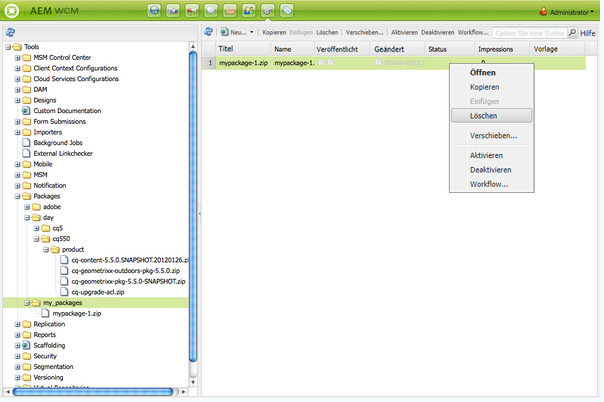

1. AEM fragt nach der Bestätigung, dass Sie das Paket löschen möchten. Klicken Sie auf **OK**, um den Löschvorgang zu bestätigen.

>[!CAUTION]
>
>Falls dieses Paket bereits installiert wurde, werden die *installierten* Inhalte **nicht** gelöscht.

### Replizieren von Paketen {#replicating-packages}

Replizieren Sie die Inhalte eines Pakets, um sie auf der veröffentlichten Instanz zu installieren:

1. Navigieren Sie im **Package Manager** zu dem Paket, das Sie replizieren möchten.

1. Klicken Sie auf das Symbol oder den Namen des Pakets, das Sie replizieren möchten, um es zu erweitern.
1. Wählen Sie in der Symbolleiste das Dropdown-Menü **Mehr** und dann die Option **Replizieren** aus.

## Package Share {#package-share}

Package Share ist ein zentraler Server, der öffentlich zugänglich ist, um Inhaltspakete auszutauschen.

Mithilfe von Package Share können Sie diese Pakete herunterladen, die offizielle Hotfixes, Funktionen, Updates oder von anderen Benutzern erstellte Beispielinhalte enthalten können.

Sie können auch Pakete hochladen und innerhalb Ihres Unternehmens austauschen.

### Zugreifen auf Package Share {#access-to-package-share}

Ein anonymer Zugriff auf Package Share ist nicht möglich, d. h. nur registrierte Benutzer können Pakete anzeigen, herunterladen und hochladen.

Unsere Partner und Kunden können auf Package Share zugreifen. Dazu müssen Registrierungsdetails übermittelt werden, damit Zugriffsrechte zugewiesen werden können.

So erhalten Sie Zugriff auf Package Share:

* Verwenden Sie die [Anmeldeseite](#signing-in-to-package-share).
* Beim erstmaligen Aufruf der Anmeldeseite müssen Sie:

   * [sich registrieren, um eine Adobe ID zu erhalten,](#registering-for-package-share) und/oder [Ihre vorhandene Adobe ID validieren,](#validating-your-adobe-id)
   * damit Ihr [Package Share-Konto](#package-share-account) erstellt werden kann.

>[!NOTE]
>
>Jeder Package Share-Benutzer, der noch keinem Kunden zugewiesen wurde, muss Mitglied einer Community werden, um diese Ressourcen sehen zu können, indem er auf **Beitreten** neben der Package Share-Anmeldung klickt.

#### Anmelden bei Package Share {#signing-in-to-package-share}

1. On the AEM Welcome screen, click **Tools**.
1. Wählen Sie dann **Package Share** aus. Sie werden aufgefordert, entweder:

   * sich mit Ihrer Adobe ID anzumelden oder
   * [eine Adobe ID zu erstellen](#registering-for-package-share).
   >[!NOTE]
   >
   >Bei der ersten Anmeldung mit Ihrer Adobe ID müssen Sie [Ihre E-Mail-Adresse validieren](#validating-your-adobe-id).

   >[!NOTE]
   >
   >Sollten Sie Ihr Kennwort vergessen haben, verwenden Sie den Link [Hilfeseiten](https://enterprise-dev.adobe.com/content/edev/en/registration/account.html) (dieser ist auch im Dialogfeld „Anmelden“ zu finden).

#### Validieren der Adobe ID {#validating-your-adobe-id}

Bei der ersten Anmeldung bei Package Share mit Ihrer Adobe ID wird Ihre E-Mail-Adresse validiert.

1. Sie erhalten eine E-Mail mit einem Link.
1. Sie müssen auf diesen Link klicken.
1. Daraufhin wird eine Webseite geöffnet.

   Durch das Öffnen der Webseite haben Sie die E-Mail validiert.

1. Der Anmeldevorgang wird fortgesetzt.

1. Sie erhalten eine E-Mail mit einem Link.
1. Sie müssen auf diesen Link klicken.
1. Daraufhin wird eine Webseite geöffnet. Durch das Öffnen der Webseite haben Sie die E-Mail validiert.
1. Der Anmeldevorgang wird fortgesetzt.

#### Registrieren für Package Share {#registering-for-package-share}

Wenn Sie auf Package Share zugreifen wollen, müssen Sie sich für eine Adobe ID registrieren:

* Auf der [Package Share-Anmeldeseite](#signing-in-to-package-share) befindet sich ein Link zur Registrierung einer Adobe ID.
* Sie können sich auch über bestimmte Adobe-Desktop-Softwareprogramme für eine Adobe ID registrieren.
* Alternativ können Sie sich online auf der [Adobe-Anmeldeseite](https://www.adobe.com/cfusion/membership/index.cfm?nf=1&nl=1) registrieren.

Eine Adobe ID kann erstellt werden, wenn Sie Folgendes bereitstellen:

* Ihre E-Mail-Adresse
* ein Kennwort Ihrer Wahl
* einige weitere Informationen wie beispielsweise Ihren Namen und das Land Ihres Wohnsitzes

#### Package Share-Konto {#package-share-account}

Die Gültigkeit Ihrer Anwendung wird überprüft, bevor:

* Ihr Benutzerkonto mit den erforderlichen/gestatteten Berechtigungen erstellt wird;
* Ihr Konto zur Gruppe Ihres Unternehmens hinzugefügt wird.

>[!NOTE]
>
>Ein Benutzer von einem unserer Partnerunternehmen kann auch ein Mitglied seiner Kundengruppen sein.

#### Netzwerkhinweise {#network-considerations}

**IPv6**

Möglicherweise kann es zu Problemen kommen, wenn Sie versuchen, von einer reinen IPv6-Umgebung aus auf Package Share zuzugreifen.

Der Grund dafür ist, dass Package Share ein auf einem Server gehosteter Service ist. Dies bedeutet, dass Ihre Verbindung über zahlreiche Netzwerke im Internet hergestellt wird. Dadurch kann nicht sichergestellt werden, dass alle angeschlossenen Netzwerke IPv6 unterstützen. Ist dies nicht der Fall, schlägt der Verbindungsaufbau fehl.

Zur Vermeidung dieses Problems können Sie über ein IPv4-Netzwerk auf Package Share zugreifen, das Paket herunterladen und es dann in die IPv6-Umgebung hochladen.

**HTTP-Proxy**

Package Share ist derzeit nicht verfügbar, wenn Ihr Unternehmen einen HTTP-Proxy verwendet, der eine Authentifizierung erfordert.

Package Share ist nur verfügbar, wenn Ihr AEM-Server ohne Authentifizierung auf das Internet zugreifen kann. Verwenden Sie zur Konfiguration des Proxys für alle Dienste, die den HTTP-Client verwenden (einschließlich Package Share), die [OSGi-Konfiguration des Day Commons HTTP Client 3.1-Bundles](/help/sites-deploying/osgi-configuration-settings.md).

### Innerhalb von Package Share {#inside-package-share}

Pakete werden in Package Share in einer Struktur mit Unterstrukturen angeordnet:

* Von Adobe bereitgestellte Adobe-Pakete
* Freigegebene Pakete, die von anderen Unternehmen bereitgestellt und von Adobe veröffentlicht wurden
* Ihre privaten Unternehmenspakte

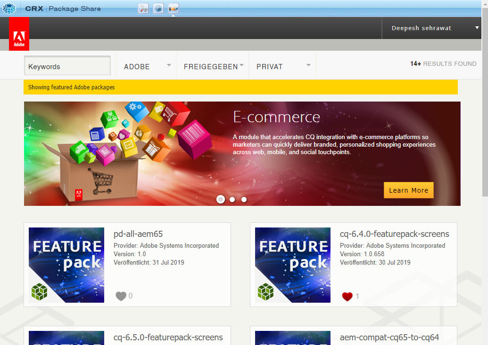

### Suchen nach und Filtern von Paketen {#searching-and-filtering-packages}

Package Share verfügt über eine Suchleiste, über die Sie nach bestimmten Keywords (Suchbegriffen) oder/und Tags suchen können. Keywords und Tags unterstützen mehrere Werte.

* Wenn Sie nach mehreren Keywords suchen wollen, müssen Sie die einzelnen Keywords durch ein Leerzeichen trennen.
* Um nach mehreren Tags zu suchen, müssen Sie jedes Tag in den Paketstrukturen auswählen.

Sie können auf der rechten Seite der Filterübersichtsleiste auch den Konditionaloperator von ODER in UND ändern.

### Herunterladen und Installieren von Paketen von Package Share {#downloading-and-installing-packages-from-package-share}

Zum Herunterladen von Paketen von Package Share und Installieren dieser Pakete auf der lokalen Instanz ist es einfacher, von Ihrer AEM-Instanz aus auf Package Share zuzugreifen. Auf diese Weise wird das Paket heruntergeladen und sofort im Package Manager registriert, von wo aus es installiert werden kann.

1. Klicken Sie im AEM-Willkommensbildschirm auf **Tools** und wählen Sie dann **Package Share**, um die Package Share-Seite zu öffnen.
1. Melden Sie sich mithilfe Ihrer Kontodetails bei Package Share an. Die Einstiegsseite (Landingpage) wird mit dem Ordner „Adobe“, dem Ordner „Freigegeben“ und einem unternehmensspezifischen Ordner angezeigt.

   >[!NOTE]
   >
   >Vergewissern Sie sich vor dem Herunterladen von Paketen von Package Share, dass Sie über die [erforderlichen Zugriffsrechte](#access-to-package-share) verfügen.

1. Navigieren Sie zum Paket, das Sie herunterladen möchten, und klicken Sie auf **Herunterladen**.

1. Kehren Sie zurück oder navigieren Sie zum **Package Manager** auf Ihrer AEM-Instanz. Navigieren Sie dann zu dem gerade heruntergeladenen Paket.

   >[!NOTE]
   >
   >Folgen Sie demselben Pfad wie in Package Share, um die heruntergeladene Datei zu finden. Wenn Sie beispielsweise ein Paket unter dem folgenden Pfad in Package Share heruntergeladen haben:
   >
   >**Pakete** > **Öffentlich** > **Hotfixes**
   Dann wird das Paket im Package Manager auf Ihrer lokalen Instanz auch unter folgendem Pfad angezeigt:
   **Pakete** > **Öffentlich** > **Hotfixes**

1. Klicken Sie auf **Installieren**, um das Paket auf der lokalen AEM-Installation zu installieren.

   >[!NOTE]
   Falls das Paket bereits auf der Instanz installiert wurde, wird anstatt der Schaltfläche **Installieren** die Anzeige **Installiert** neben dem Paket angezeigt.

   >[!CAUTION]
   Durch die Installation eines Pakets können vorhandene Inhalte im Repository überschrieben werden. Daher empfehlen wir, zunächst die Option **Installation testen** auszuführen. So können Sie überprüfen, ob die Inhalte im Paket mit den vorhandenen Inhalten in Konflikt stehen.

### Herunterladen von Paketen in Ihr Dateisystem von Package Share {#downloading-packages-to-your-file-system-from-package-share}

[Herunterladen und Installieren](#downloading-and-installing-packages-from-package-share) ist sehr bequem, aber Sie können das Paket bei Bedarf auch herunterladen und in Ihrem lokalen Dateisystem speichern:

1. Klicken Sie in Package Share auf das Paketsymbol oder den Paketnamen.
1. Klicken Sie auf die Registerkarte **Assets**.
1. Klicken Sie auf **Auf Festplatte herunterladen**.

### Hochladen von Paketen {#uploading-a-package}

Mithilfe von Package Share können Sie Pakete in den unternehmensinternen Bereich von Package Share hochladen. Dadurch können sie innerhalb des Unternehmens geteilt werden.

Diese Pakete sind *nicht* der allgemeinen AEM-Community zugänglich, aber sie sind für alle bei Ihrem Unternehmen registrierten Benutzer verfügbar.

So laden Sie Pakete in den unternehmensinternen Bereich von Package Share hoch:

>[!CAUTION]
Zum Hochladen eines Pakets in Package Share müssen Sie zuerst einen nach Ihrem Unternehmen benannten Gruppenordner im lokalen Package Manager erstellen. Beispielsweise „geometrixx“. Alle Pakete, die zum Freigeben hochgeladen werden sollen, müssen in diesem Gruppenordner platziert werden.
Pakete in der Package Manager-Startseitenliste oder in anderen Ordnern können nicht freigegeben werden.

1. Öffnen Sie den **Package Manager** und navigieren Sie zu dem Paket, das Sie hochladen wollen.

1. Klicken Sie zum Öffnen auf das Paketsymbol.
1. Klicken Sie auf **Freigeben**, um das Dialogfeld zum Hochladen des Pakets in Package Share zu öffnen.
1. Wenn Sie noch nicht bei Package Share angemeldet sind, müssen Sie Ihre Anmeldedaten eingeben.

   Sind Sie bereits angemeldet, zeigt AEM die Details des hochzuladenden Pakets an:

   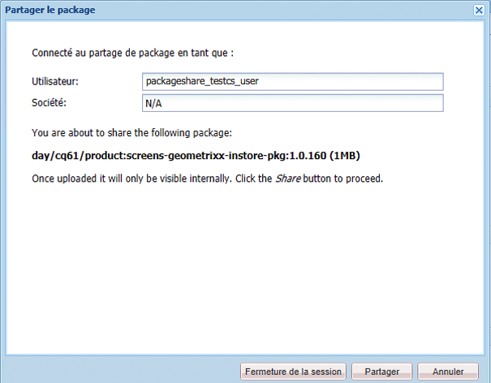

1. Klicken Sie auf **Freigeben**, um das Paket in den unternehmensinternen Bereich von Package Share hochzuladen.

   AEM zeigt den Status und den Zeitpunkt an, an dem das Hochladen des Pakets abgeschlossen ist. Anschließend können Sie auf das **x** (oben rechts) klicken, um das Fenster **Paket freigeben** zu verlassen.

1. Nachdem der Hochladevorgang abgeschlossen ist, können Sie zum internen Ordner Ihres Unternehmens navigieren, um das gerade von Ihnen freigegebene Paket anzuzeigen.

>[!NOTE]
Zum Ändern eines in Package Share verfügbaren Pakets müssen Sie es herunterladen, neu erstellen und dann erneut in Package Share hochladen.

### Löschen eines Pakets {#deleting-a-package}

Sie können Pakete, die Sie hochgeladen haben, nur wie folgt löschen:

1. Markieren Sie in der Unternehmensstruktur die Paketgruppe, die das Paket enthält.
1. Klicken Sie auf das Paket.
1. Klicken Sie auf die Schaltfläche „Löschen“.

   

1. Click **Delete** to confirm you want to delete the package.

### Erstellen von halbprivaten Paketen {#making-packages-semi-private}

Sie können Pakete freigeben, sodass sie außerhalb Ihrer Organisation, aber nicht öffentlich zugänglich sind. Diese Pakete sind halbprivate Pakete. Um diese halbprivaten Pakete freizugeben, benötigen Sie Hilfe vom Adobe-Support. Erstellen Sie daher ein Ticket für den Adobe Support mit der Aufforderung, ein Paket außerhalb Ihrer Organisation zugänglich zu machen. Sie werden Sie um eine Liste der Adobe-IDs bitten, die Sie für Ihre Pakete verwenden möchten.

## Softwareverteilung (Beta) {#software-distribution-beta}

[Software Distribution](https://downloads.experiencecloud.adobe.com) ist die neue Benutzeroberfläche, die die Suche und den Download von AEM Packages vereinfacht. Es befindet sich derzeit im Beta-Status und ist nur für Adobe Managed Services- und AEM-Kunden als Cloud-Service sowie für Adobe-Mitarbeiter verfügbar.

>[!NOTE]
* [Package Share](#package-share) bleibt solange im Betrieb, bis alle Kunden Zugriff auf die Softwareverteilung haben.
* Alle Pakete sind sowohl von Package Share als auch von der Software Distribution verfügbar.


>[!CAUTION]
AEM Package Manager kann derzeit nicht mit Software Distribution verwendet werden. Sie laden Ihre Pakete auf Ihre lokale Festplatte herunter.

