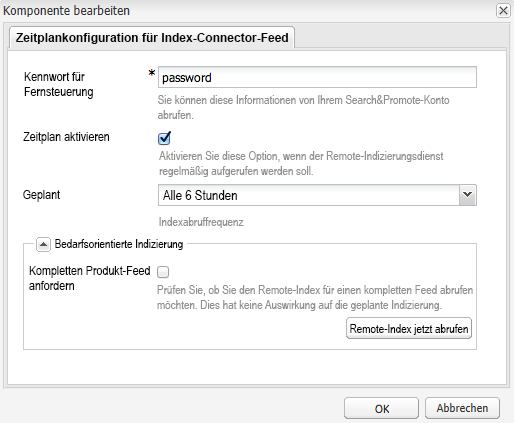

# Produkt-Feed {#product-feed}

AEM Integration mit [Search&amp;Promote](https://www.adobe.com/solutions/testing-targeting/searchandpromote.html) und ermöglicht Ihnen Folgendes:

* Verwenden der eCommerce-API, unabhängig von der zugrunde liegenden Repository-Struktur und Commerce-Plattform
* Nutzen der Index-Connector-Funktion von Search&amp;Promote zur Bereitstellung eines Produkt-Feeds im XML-Format
* Nutzen der Fernsteuerungsfunktion von Search&amp;Promote zur bedarfsabhängigen bzw. planmäßigen Durchführung von Anfragen des Produkt-Feeds
* Erstellen von Feeds für verschiedene Search&amp;Promote-Konten, konfiguriert als Cloud Service-Konfigurationen

Sie müssen über ein gültiges Konto verfügen und [die Verbindung zu Search&amp;Promote](/help/sites-administering/search-and-promote.md#configuring-the-connection-to-search-promote) konfigurieren. Sie müssen außerdem sicherstellen, dass Sie das richtige [Rechenzentrum](/help/sites-administering/search-and-promote.md#configuring-the-data-center) verwenden und sicherstellen, dass der **Remote-Server-URI* konfiguriert ist.

## Einrichten des Produkt-Feeds {#set-up-the-product-feed}

Zuallererst müssen Sie einen Website-Stamm und ein ID-Attribut eingeben. Gehen Sie hierfür wie folgt vor:

1. Navigieren Sie zur Search&amp;Promote-Konfiguration.
1. Klicken Sie auf **[!UICONTROL Bearbeiten]**.
1. Klicken Sie auf die Registerkarte **[!UICONTROL Konfiguration für Index-Connector-Feed]**.
1. Geben Sie das **[!UICONTROL Website-Stammverzeichnis]** und das **[!UICONTROL Bezeichnerattribut]** ein.

   >[!NOTE]
   >
   >Der **[!UICONTROL Website-Stamm]** ist der Stamm Ihrer eCommerce-Website, z. B. `/content/geometrixx-outdoors/en`.
   >
   >Das **[!UICONTROL Identifier-Attribut]** ist eine JCR-Eigenschaft, die das Produkt eindeutig identifiziert: `identifier`.

1. Klicken Sie auf **[!UICONTROL OK]**.

Dann müssen Sie auch zwei Konfigurationen in der Web-Konsole bearbeiten, bevor Sie Produkt-Feeds generieren können.

### Konfigurieren der Day CQ-Search&amp;Promote-Produktcrawler-Implementierung für Geometrixx  {#configuring-the-day-cq-search-promote-products-crawler-implementation-for-geometrixx}

1. Gehen Sie zu [http://localhost:4502/system/console/configMgr](http://localhost:4502/system/console/configMgr).
1. Klicken Sie auf **[!UICONTROL Day CQ-Search&amp;Promote-Produktcrawler-Implementierung für Geometrixx]**.
1. Geben Sie die Search&amp;Promote-Kontonummer an, mit der dieser Crawler verknüpft ist. Sie wird verwendet, um die Cloud Service-Konfiguration nachzuschlagen, die von diesem Crawler verwendet wird.
1. Klicken Sie auf **[!UICONTROL Speichern]**.

### Konfigurieren des Day CQ-Search&amp;Promote-Produkt-Feed-Generators für Geometrixx  {#configuring-the-day-cq-search-promote-products-feed-generator-for-geometrixx}

1. Gehen Sie zu [http://localhost:4502/system/console/configMgr](http://localhost:4502/system/console/configMgr).
1. Klicken Sie auf **[!UICONTROL Day CQ-Search&amp;Promote-Produkt-Feed-Generator für Geometrixx]**.
1. Geben Sie die Search&amp;Promote-Kontonummer an, mit der dieser Generator verknüpft ist. Sie wird verwendet, um die Cloud Service-Konfiguration nachzuschlagen, die von diesem Generator verwendet wird.
1. Klicken Sie auf **[!UICONTROL Speichern]**.

## Planen des Produkt-Feeds  {#schedule-the-product-feed}

Zur Aktivierung der geplanten Feed-Erstellung müssen Sie dafür einen Planer konfigurieren.
Ein Planer wird als untergeordnete Konfiguration Ihrer eigenen Search&amp;Promote-Cloud Service-Konfiguration konfiguriert.

1. Navigieren Sie zur Search&amp;Promote-Konfiguration.
1. Klicken Sie neben **[!UICONTROL Planerkonfiguration]** auf das **[!UICONTROL +]**.
1. Geben Sie einen **[!UICONTROL Titel]** ein, der für Seitenautoren erkennbar ist, und einen eindeutigen **[!UICONTROL Namen]**.
1. Klicken Sie auf **[!UICONTROL Erstellen]**. Ein Dialogfeld wird geöffnet.

   

1. Geben Sie das **[!UICONTROL Remote Control Password]** ein. Hierbei handelt es sich um das Kennwort, das Sie in Ihrem Search&amp;Promote-Konto konfiguriert haben.

   >[!NOTE]
   >
   >Es ist aber nicht das Kennwort Ihres Search&amp;Promote-Kontos. Sie können dieses Kennwort finden und ändern, indem Sie sich bei Ihrem Search&amp;Promote-Konto anmelden und zu **[!UICONTROL Index]** und dann zu **[!UICONTROL Remote Control]** navigieren.

1. Aktivieren Sie das Kontrollkästchen **[!UICONTROL Zeitplan aktivieren]**.
1. Wählen Sie einen **[!UICONTROL Zeitplan]** aus. Hierbei handelt es sich um den eigentlichen Zeitplan für die Feed-Generierung.
1. Sie können die **[!UICONTROL Bedarfsorientierte Indizierung]** aktivieren. Diese Funktion wird verwendet, um den Search&amp;Promote-Index manuell aufzurufen. Wenn **[!UICONTROL Vollständigen Produkt-Feed anfordern]** aktiviert ist, fordert Search&amp;Promote einen vollständigen Produkt-Feed an. Andernfalls wird ein mehrstufiger Produkt-Feed aufgefordert.

   >[!NOTE]
   >
   >Die bedarfsgesteuerte Indizierungsfunktion nutzt die Fernsteuerungsfunktion von Search&amp;Promote. Wenn eine Remote-Indizierung aufgerufen wird, beginnt die Indizierung nicht sofort. Stattdessen wird mithilfe der Fernsteuerungsfunktion zuerst eine Indizierungsanforderung an Search&amp;Promote gesendet.

1. Klicken Sie auf **[!UICONTROL OK]**.

Nachdem Sie alles konfiguriert haben, können Sie eine XML-Seite sehen, die alle Produkte unter dem konfigurierten Website-Stamm enthält: [http://localhost:4502/etc/commerce/searchpromote/feed/full](http://localhost:4502/etc/commerce/searchpromote/feed/full).
