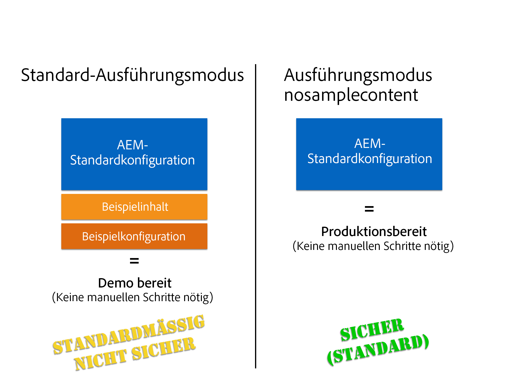

# Ausführung von AEM im produktionsbereiten Modus{#running-aem-in-production-ready-mode}

Mit AEM 6.1 führt Adobe den neuen Ausführungsmodus `"nosamplecontent"` ein, der die erforderlichen Schritte zur Vorbereitung einer AEM-Instanz für die Bereitstellung in einer Produktionsumgebung automatisieren soll.

Der neue Ausführungsmodus konfiguriert nicht nur automatisch die Instanz, um die in der Sicherheitsprüfliste beschriebenen Best Practices für die Sicherheit einzuhalten, sondern entfernt darüber hinaus alle Geometrixx-Beispielsanwendungen und -konfigurationen innerhalb des Prozesses.

>[!NOTE]
>
>Da der produktionsbereite Modus von AEM aus praktischen Gründen nur einen Großteil der für die Sicherung einer Instanz erforderlichen Aufgaben abdeckt, empfehlen wir Ihnen dringend, vor dem tatsächlichen Einsatz der Produktionsumgebung die [Sicherheitsprüfliste](/help/sites-administering/security-checklist.md) durchzugehen.
>
>Beachten Sie außerdem, dass durch die Ausführung von AEM im produktionsbereiten Modus CRXDE Lite effektiv deaktiviert wird. Wenn Sie es zum Debuggen benötigen, finden Sie unter [Aktivieren von CRXDE Lite in AEM](/help/sites-administering/enabling-crxde-lite.md) weitere Informationen.



Um AEM im produktionsbereiten Modus auszuführen, müssen Sie nur den `nosamplecontent` über den `-r` Runmode-Switch zu Ihren vorhandenen Startargumenten hinzufügen:

```shell
java -jar aem-quickstart.jar -r nosamplecontent
```

Beispielsweise können Sie den produktionsbereiten Modus zum Starten einer Autoreninstanz mit MongoDB-Persistenz verwenden:

```shell
java -jar aem-quickstart.jar -r author,crx3,crx3mongo,nosamplecontent -Doak.mongo.uri=mongodb://remoteserver:27017 -Doak.mongo.db=aem-author
```

## Ändern eines Teils des produktionsbereiten Modus {#changes-part-of-the-production-ready-mode}

Genauer gesagt werden die folgenden Konfigurationsveränderungen durchgeführt, wenn AEM im produktionsbereiten Modus ausgeführt wird:

1. Das **CRXDE-Support-Bundle** (`com.adobe.granite.crxde-support`) ist im produktionsbereiten Modus standardmäßig deaktiviert. Es kann jederzeit über das öffentliche Maven-Repository installiert werden. Für AEM 6.1. ist Version 3.0.0 erforderlich.

1. Das Bundle **Apache Sling Simple WebDAV Access to repositories** (`org.apache.sling.jcr.webdav`) ist nur für **Autoreninstanzen** verfügbar.

1. Neu erstellte Benutzer müssen das Passwort bei der ersten Anmeldung ändern. Dies gilt nicht für den Admin-Benutzer.
1. **Debug-Informationen** für den  **Apache Sling Java Script Handler** generieren deaktiviert.

1. **Die Funktionen zum zugeordneten Inhalt** und **zum Erzeugen von Debug-Informationen** sind für den **Apache Sling Jsp Script Handler** deaktiviert.

1. Der **Day CQ WCM-Filter** ist auf `edit` bei der **Autoreninstanz** und auf `disabled` bei der **Veröffentlichungsinstanz** eingestellt.

1. Der **Adobe Granite HTML Library Manager** wird mit den folgenden Einstellungen konfiguriert:

   1. **Minify:** `enabled`
   1. **Debug:** `disabled`
   1. **Gzip:** `enabled`
   1. **Zeit:** `disabled`

1. Das **Apache Sling Get Servlet** ist so eingestellt, dass es sichere Konfigurationen standardmäßig unterstützt, so zum Beispiel wie folgt:

| **Konfiguration** | **Autor** | **Veröffentlichen** |
|---|---|---|
| TXT-Ausgabe | disabled | disabled |
| HTML-Ausgabe | disabled | disabled |
| JSON-Ausgabe | enabled | enabled |
| XML-Ausgabe | disabled | disabled |
| json.maximumresults | 1000 | 100 |
| Auto-Index | disabled | disabled |
