# Berichterstellung {#reporting}

Um Ihnen bei der Überwachung und Analyse des Status Ihrer Instanz zu helfen, stellt AEM eine Auswahl an Standardberichten bereit, die für Ihre individuellen Anforderungen konfiguriert werden können:

* [Komponentenbericht](#component-report)
* [Speichernutzung](#disk-usage)
* [Konsistenzprüfung](#health-check)
* [Seitenaktivitätsbericht](#page-activity-report)
* [Bericht für benutzergenerierte Inhalte](#user-generated-content-report)
* [Benutzerbericht](#user-report)
* [Bericht der Workflow-Instanz](#workflow-instance-report)
* [Workflow-Bericht](#workflow-report)

Über die Konsole **Tools** kann auf alle Berichte zugegriffen werden. Wählen Sie im linken Bereich **Berichte** aus und doppelklicken Sie dann im rechten Bereich auf den benötigten Bericht, um ihn zur Anzeige und/oder Konfiguration zu öffnen.

Neue Instanzen eines Berichts können auch über die Konsole **Tools** erstellt werden. Wählen Sie im linken Bereich **Berichte** aus und anschließend **Neu...** in der Symbolleiste. Legen Sie **Titel** und **Name** fest, wählen Sie den benötigten Berichtstyp aus und klicken Sie dann auf **Erstellen**. Ihre neue Berichtsinstanz wird in der Liste angezeigt. Doppelklicken Sie darauf, um Sie zu öffnen und ziehen Sie dann eine Komponente aus dem Sidekick, um die erste Spalte zu erstellen und mit der Berichtsdefinition zu beginnen.

>[!NOTE]
>
>Zusätzlich zu den standardmäßigen AEM-Berichten können Sie auch [Ihren eigenen (vollständig neuen) Bericht entwickeln](/help/sites-developing/dev-reports.md).

## Die Grundlagen der Berichtsanpassung.  {#the-basics-of-report-customization}

Es stehen verschiedene Berichtsformate zur Verfügung. Die folgenden Berichte nutzen alle Spalten, die wie in den folgenden Abschnitten beschrieben angepasst werden können.

* [Komponentenbericht](#component-report)
* [Seitenaktivitätsbericht](#page-activity-report)
* [Bericht für benutzergenerierte Inhalte](#user-generated-content-report)
* [Benutzerbericht](#user-report)
* [Bericht der Workflow-Instanz](#workflow-instance-report)

>[!NOTE]
>
>Die folgenden Berichte verfügen alle über ihr eigenes Format und ihre eigene Anpassung:
>
>
>* Die [Konsistenzprüfung](#health-check) nutzt Auswahlfelder, um die Daten anzugeben, zu denen Sie einen Bericht erstellen möchten.
>* Die [Speichernutzung](#disk-usage) verwendet Verknüpfungen für einen Drilldown durch die Repository-Struktur.
>* Der [Workflow-Bericht](/help/sites-administering/reporting.md#workflow-report) bietet einen Überblick über die Workflows, die auf Ihrer Instanz ausgeführt werden.

>
>
Die folgenden Verfahren zur Spaltenkonfiguration sind also nicht geeignet. Weitere Informationen finden Sie in den Beschreibungen der einzelnen Berichte.

### Auswählen und Positionieren der Datenspalten  {#selecting-and-positioning-the-data-columns}

Spalten können in allen Berichten hinzugefügt, neu positioniert oder entfernt werden – sowohl in standardmäßigen als auch in angepassten Berichten.

Auf der Registerkarte **Komponenten** des Sidekicks (verfügbar auf der Berichtsseite) sind alle Kategorien von Daten aufgeführt, die als Spalten ausgewählt werden können.

Zum Ändern der Datenauswahl gehen Sie wie folgt vor:

* Ziehen Sie zum Hinzufügen einer neuen Spalte die erforderliche Komponente aus dem Sidekick und legen Sie sie in der gewünschten Position ab.

   * Ein grünes Häkchen zeigt an, wenn die Position gültig ist, und zwei Pfeile zeigen genau an, wo die Platzierung erfolgen wird.
   * Ein rotes Kreuzsymbol zeigt an, wenn die Position ungültig ist.

* Um eine Spalte zu verschieben, klicken Sie auf die Kopfzeile, halten Sie sie gedrückt und ziehen Sie sie an die neue Position.
* Um eine Spalte zu entfernen, klicken Sie auf den Spaltentitel, halten Sie ihn gedrückt und ziehen Sie ihn nach oben in den Bereich der Berichtskopfzeile (ein rotes Minussymbol zeigt an, dass die Position gültig ist) und lassen Sie die Maustaste los. Das Dialogfeld „Komponente(n) löschen“ fordert Sie nun auf, die Löschung der Spalte zu bestätigen.

### Dropdown-Menü der Spalte  {#column-drop-down-menu}

Jede Spalte des Berichts verfügt über ein Dropdown-Menü. Es wird angezeigt, wenn der Mauszeiger über die Zelle mit dem Spaltentitel bewegt wird.

Ganz rechts neben der Zelle mit dem Titel wird eine Pfeilspitze angezeigt (die nicht mit der Pfeilspitze direkt rechts neben dem Titeltext verwechselt werden sollte, die den [aktuellen Sortiermechanismus](#sorting-the-data) anzeigt).

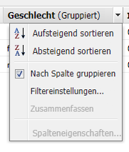

Die im Menü verfügbaren Optionen hängen von der (während der Projektentwicklung vorgenommenen) Konfiguration der Spalte ab. Alle ungültigen Optionen werden ausgegraut.

### Sortieren der Daten {#sorting-the-data}

Die Daten können mithilfe folgender Möglichkeiten nach einer bestimmten Spalte angezeigt werden:

* Durch das Klicken auf die jeweilige Spaltenkopfzeile wechselt die Sortierung von einer aufsteigenden zu einer absteigenden Sortierung, was durch eine Pfeilspitze direkt neben dem Titeltext angezeigt wird.
* Verwenden Sie das [Dropdown-Menü der Spalte](#column-drop-down-menu), um zwischen **Aufsteigend sortieren** und **Absteigend sortieren** auszuwählen. Dies wird erneut durch eine Pfeilspitze direkt neben dem Titeltext angezeigt.

### Gruppen und das aktuelle Datendiagramm  {#groups-and-the-current-data-chart}

In geeigneten Spalten können Sie **Nach Spalte gruppieren** im [Dropdown-Menü der Spalte](#column-drop-down-menu) auswählen. Hierdurch werden die Daten nach jedem einzelnen Wert innerhalb dieser Spalte gruppiert. Sie können mehrere Spalten für die Gruppierung auswählen. Die Option werden ausgegraut, wenn in der Spalte nicht geeignete Daten vorhanden sind, d. h. wenn jeder Eintrag einzeln zu betrachten und einzigartig ist, sodass keine Gruppen gebildet werden können. Dies gilt zum Beispiel für die Spalte mit der Benutzer-ID im Benutzerbericht.

Nach der Gruppierung mindestens einer Spalte wird auf Grundlage dieser Gruppierung ein Tortendiagramm der **aktuellen Daten** generiert. Wenn mehrere Spalten gruppiert werden, wird dies ebenfalls im Diagramm angegeben.

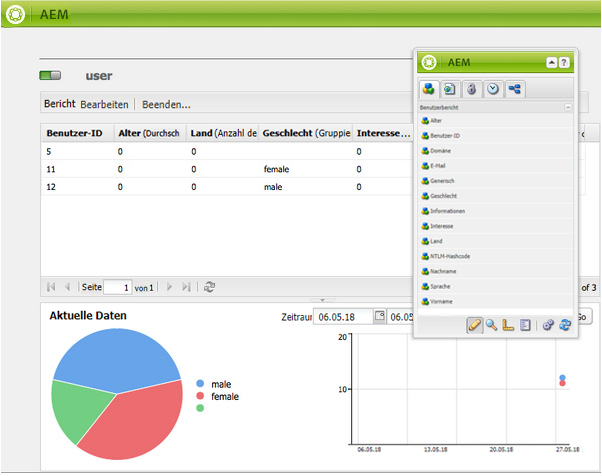

Wenn Sie Ihren Mauszeiger über das Tortendiagramm bewegen, wird der zusammengefasste Wert zum entsprechenden Segment angezeigt. Hierbei wird die aktuell zu der Spalte festgelegte Zusammenfassung verwendet, so zum Beispiel Anzahl, Minimum oder Durchschnitt.

### Filter und Zusammenfassungen {#filters-and-aggregates}

In geeigneten Spalten können Sie außerdem die **Filtereinstellungen** und/oder **Zusammenfassungen** im [Dropdown-Menü der Spalte](#column-drop-down-menu) konfigurieren.

#### Filter  {#filters}

Mithilfe der Filtereinstellungen können Sie die Kriterien für anzuzeigende Einträge festlegen. Die verfügbaren Operatoren lauten:

* `contains`
* `equals`

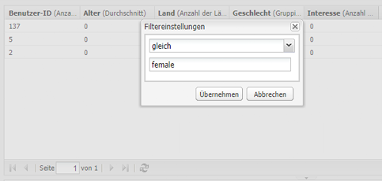

Sie können wie folgt einen Filter festlegen:

1. Wählen Sie den gewünschten Operator aus der Dropdown-Liste aus.
1. Geben Sie den Text ein, nach dem gefiltert werden soll.
1. Klicken Sie auf **Übernehmen**.

Sie können den Filter wie folgt deaktivieren:

1. Entfernen Sie den Filtertext.
1. Klicken Sie auf **Übernehmen**.

#### Zusammenfassungen  {#aggregates}

Sie können auch eine Zusammenfassungsmethode auswählen (diese können je nach ausgewählter Spalte variieren):

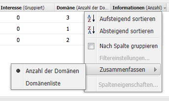

### Spalteneigenschaften {#column-properties}

Diese Option ist nur verfügbar, wenn die [Generische Spalte](#generic-column) im [Benutzerbericht](#user-report) verwendet wurde.

### Frühere Daten {#historic-data}

Ein Diagramm zu den Änderungen an Ihren Daten im Zeitverlauf kann unter **Frühere Daten** angezeigt werden. Dieses wird aus in regelmäßigen Intervallen aufgenommenen Momentaufnahmen abgeleitet.

Die Daten werden:

* Wenn verfügbar von der ersten sortierten Spalte erfasst bzw. andernfalls von der ersten (nicht gruppierten) Spalte
* Nach der entsprechenden Spalte sortiert

Der Bericht kann wie folgt generiert werden:

1. Legen Sie zur erforderlichen Spalte **Gruppierung** fest.
1. **Bearbeiten** Sie die Konfiguration, um festzulegen, wie häufig Momentaufnahmen erstellt werden sollten – stündlich oder täglich.
1. **Beenden...** Sie die Definition, um die Sammlung von Momentaufnahmen zu starten.

   Die roten/grünen Reglerschaltflächen oben links zeigen an, wenn Momentaufnahmen erfasst werden.

Das daraus resultierende Diagramm wird unten rechts angezeigt:

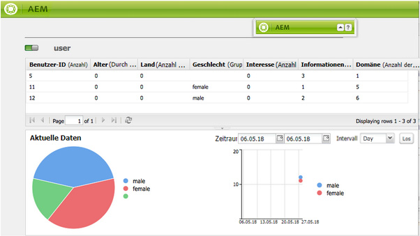

Sobald die Datenerfassung begonnen hat, können Sie Folgendes auswählen:

* **Zeitraum**

   Sie können zwischen den und den Datumsangaben für die anzuzeigenden Berichtsdaten wählen.

* **Intervall**

   Monat, Woche, Tag, Stunde können für die Skalierung und Aggregation des Berichts ausgewählt werden.

   Wenn zum Beispiel für Februar 2011 tägliche Momentaufnahmen verfügbar sind:

   * Wenn das Intervall auf `Day` eingestellt ist, wird jeder Schnappschuss als einzelner Wert im Diagramm angezeigt.
   * Wenn das Intervall auf `Month` festgelegt ist, werden alle Snapshots für Februar in einem einzelnen Wert zusammengefasst (der im Diagramm als einzelner &quot;Punkt&quot;angezeigt wird).

Wählen Sie Ihre Anforderungen aus und klicken Sie dann auf **Los**, um sie auf den Bericht anzuwenden. Um die Anzeige nach der Anfertigung weiterer Momentaufnahmen zu aktualisieren, klicken Sie erneut auf **Los**.

Wenn die Momentaufnahmen erfasst werden, können Sie:

* **Beenden...** verwenden, um die Sammlung erneut zu initialisieren.

   Durch **Beenden** wird die Berichtsstruktur (d. h. die dem Bericht zugewiesenen Spalten und welche gruppiert, sortiert, gefiltert sind usw.) „eingefroren“ und es wird mit dem Anfertigen von Momentaufnahmen begonnen.

* Öffnen Sie das Dialogfeld **Bearbeiten**, um **Keine Datenmomentaufnahmen** auszuwählen und die Sammlung zu beenden, bis sie erforderlich ist.

   Durch **Bearbeiten** wird lediglich das Anfertigen von Momentaufnahmen ein- oder ausgeschaltet. Wenn das Anfertigen von Momentaufnahmen erneut eingeschaltet wird, wird der Status des Berichts bei dessen letzter Fertigstellung zum Anfertigen weiterer Momentaufnahmen verwendet.

>[!NOTE]
>
>Schnappschüsse werden unter `/var/reports/...` gespeichert, wobei der Rest des Pfads den Pfad des jeweiligen Berichts und der ID spiegelt, die beim Abschluss des Berichts erstellt wurden.
>
>
>Alte Momentaufnahmen können manuell gelöscht werden, wenn Sie vollkommen sicher sind, dass Sie diese Instanzen nicht mehr benötigen.

>[!NOTE]
>
>Die vorkonfigurierten Berichte sind nicht leistungsintensiv, es wird jedoch empfohlen, tägliche Snapshots auf einer Produktions-Umgebung zu verwenden. Führen Sie diese täglichen Schnappschüsse nach Möglichkeit zu einer Tageszeit aus, zu der Ihre Website nicht viel Aktivität aufweist; dies kann mit dem Parameter `Daily snapshots (repconf.hourofday)` für **Day CQ Berichte Configuration** definiert werden; Weitere Informationen zum Konfigurieren finden Sie unter [OSGI-Konfiguration](/help/sites-deploying/configuring-osgi.md).

#### Anzeigelimits {#display-limits}

Die Darstellung des Berichts zu den früheren Daten kann sich aufgrund von festlegbaren Beschränkungen auch leicht ändern – je nach der Anzahl der Ergebnisse zum ausgewählten Zeitraum.

Jede horizontale Zeile ist als eine Reihe bekannt (und entspricht einem Eintrag in der Diagrammlegende) und jede vertikale Spalte von Punkten stellt die aggregierten Momentaufnahmen dar.

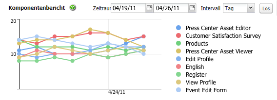

Damit das Diagramm über längere Zeiträume hinweg aufgeräumt bleibt, können Beschränkungen festgelegt werden. Für die Standardberichte sind dies:

* horizontale Reihe – sowohl Standard als auch Systemmaximum ist `9`

* vertikale aggregierte Momentaufnahmen – Standardwert ist `35` (pro horizontaler Reihe)

Wenn die entsprechenden Beschränkungen überschritten werden:

* werden die Punkte nicht angezeigt
* zeigt die Legende zu den früheren Daten gegebenenfalls eine andere Anzahl an Einträgen als das aktuelle Datendiagramm

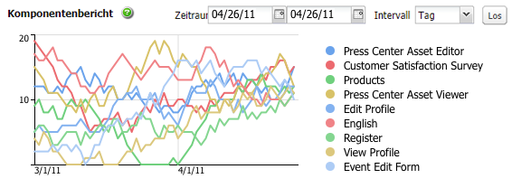

In benutzerspezifischen Berichten kann auch der Wert **Insgesamt** für die ganze Reihe angezeigt werden. Dies wird als eine Reihe angezeigt (horizontale Linie und Eintrag in der Legende).

>[!NOTE]
>
>Für benutzerspezifische Berichte können die Beschränkungen anders festgelegt werden.

### Bearbeiten (Bericht) {#edit-report}

Über die Schaltfläche **Bearbeiten** wird das Dialogfeld **Bericht bearbeiten** geöffnet.

Dies ist ein Speicherort, an dem der Zeitraum für die Erfassung [früherer Daten](#historic-data) festgelegt wird. Es können jedoch auch diverse andere Einstellungen festgelegt werden:

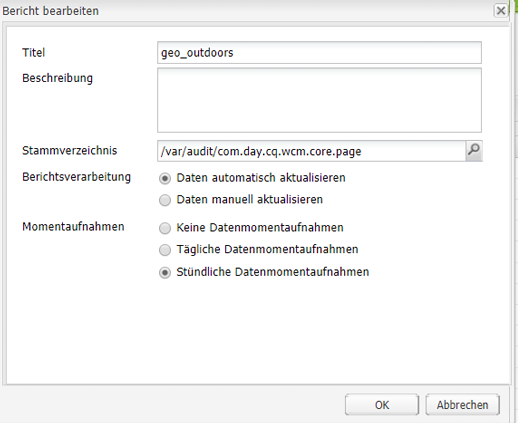

* **Titel**

   Sie können einen eigenen Titel definieren.

* **Beschreibung**

   Sie können eine eigene Beschreibung definieren.

* **Stammpfad**  (*nur aktiv für bestimmte Berichte*)

   Verwenden Sie diese Option, um den Bericht auf einen (Unter-)Abschnitt des Repositorys zu beschränken.

* **Berichtsverarbeitung**

   * **Daten automatisch aktualisieren**

      Die Berichtsdaten werden bei jeder Aktualisierung der Berichtsdefinition aktualisiert.

   * **Daten manuell aktualisieren**

      Diese Option kann verwendet werden, um Verzögerungen zu vermeiden, die durch automatische Aktualisierungsvorgänge bei einer großen Datenmenge verursacht werden.

      Diese Auswahl zeigt an, dass die Berichtsdaten manuell aktualisiert werden müssen, wenn sich ein beliebiger Aspekt der Berichtskonfiguration verändert hat. Außerdem bedeutet dies, dass die Berichtstabelle bei jeder Änderung eines Aspekts der Konfiguration ausgeblendet wird.

       Wenn dies ausgewählt ist, wird die Schaltfläche **[Daten laden](#load-data)** (neben **Bearbeiten** im Bericht) angezeigt. Mithilfe von **Daten laden** werden die Daten geladen und die angezeigten Berichtsdaten werden aktualisiert.

* **Momentaufnahmen** Sie können festlegen, wie oft Momentaufnahmen angefertigt werden sollen: täglich, stündlich oder gar nicht.

### Daten laden {#load-data}

Die Schaltfläche **Daten laden** wird nur angezeigt, wenn **Daten manuell aktualisieren** unter **[Bearbeiten](#edit-report)** ausgewählt wurde.

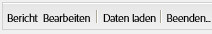

Durch das Klicken auf **Daten laden** werden die Daten neu geladen und der angezeigte Beicht wird erneut geladen.

Die Auswahl von „Daten manuell aktualisieren“ bedeutet Folgendes:

1. Sobald Sie die Berichtskonfiguration ändern, wird die Tabelle der Berichtsdaten entfernt.

   Wenn Sie beispielsweise den Sortiermechanismus einer Spalte ändern, werden die Daten nicht angezeigt.

1. Wenn Sie möchten, dass die Berichtsdaten erneut angezeigt werden, müssen Sie zum erneuten Laden der Daten auf **Daten laden** klicken.

### Beenden (Bericht)  {#finish-report}

Wenn Sie den Bericht **beenden**, geschieht Folgendes:

* Die Berichtsdefinition *ab diesem Zeitpunkt* wird für die Aufnahme von Momentaufnahmen verwendet (anschließend können Sie weiter an einer Berichtsdefinition arbeiten, da sie dann separat von den Momentaufnahmen erfolgt).
* Alle vorhandenen Momentaufnahmen werden entfernt.
* Für [Frühere Daten](#historic-data) werden neue Momentaufnahmen erfasst.

Mit diesem Dialogfeld können Sie Ihren eigenen Titel und Ihre eigene Beschreibung für den resultierenden Bericht definieren oder aktualisieren.

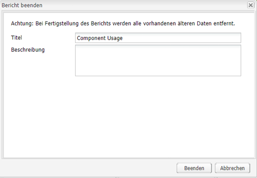

## Berichttypen {#report-types}

### Komponentenbericht {#component-report}

Der Komponentenbericht stellt Informationen dazu bereit, wie Ihre Website die Komponenten verwendet.

[Spalten mit Informationen](#selecting-and-positioning-the-data-columns) zu:

* Autor
* Komponentenpfad
* Komponententyp
* Letzte Änderung
* Seite 

Bedeutet, dass Sie zum Beispiel Folgendes sehen können:

* Welche Komponenten wo verwendet werden

   Dies ist beispielsweise bei Tests nützlich.

* Wie Instanzen einer bestimmten Komponente verteilt sind

   Dies kann interessant sein, wenn bei bestimmten Seiten (d. h. „umfangreichen Seiten“) Leistungsprobleme auftreten.

* Teile der Website mit häufigen/weniger häufigen Veränderungen
* Wie ein Seiteninhalt sich im Laufe der Zeit verändert

Alle Komponenten werden als Produktstandard und projektspezifisch einbezogen. Mithilfe des Dialogfelds **Bearbeiten** kann der Benutzer auch ein **Stammverzeichnis** festlegen, das den Startpunkt des Berichts definiert. Alle Komponenten unter diesem Stammverzeichnis werden für den Bericht berücksichtigt.

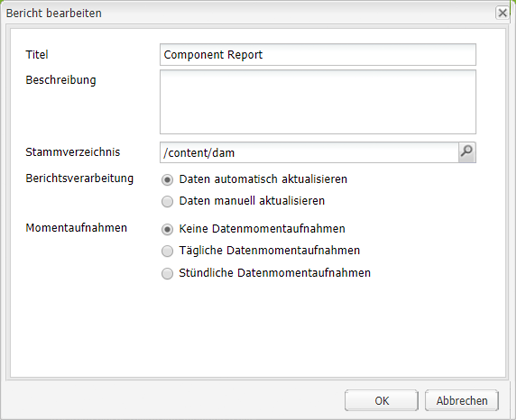 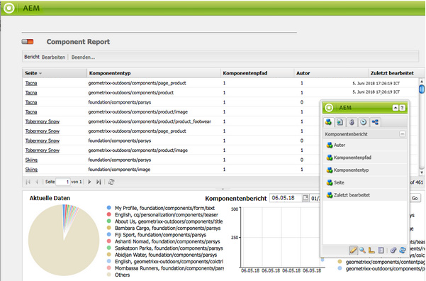

### Speichernutzung {#disk-usage}

Der Bericht zur Speichernutzung zeigt Informationen zu den innerhalb Ihres Repositorys gespeicherten Daten an.

Der Bericht beginnt im Stamm ( / ) des Repositorys. Durch das Klicken auf einen bestimmten Zweig können Sie innerhalb des Repositorys einen Drilldown durchführen (der aktuelle Pfad wird im Berichtstitel wiedergegeben).

### Konsistenzprüfung {#health-check}

Dieser Bericht analysiert das aktuelle Anforderungsprotokoll:

`<cq-installation-dir>/crx-quickstart/logs/request.log`
, um Ihnen bei der Ermittlung der teuersten Anforderung(en) innerhalb eines bestimmten Zeitraums zu helfen.

Zum Generieren des Berichts können Sie Folgendes Festlegen:

* **Zeitraum (Stunden)**

   Die Anzahl der zu analysierenden Stunden (Vergangenheit).

   Default: `24`

* **max. Ergebnisse**

   Maximale Anzahl der Ausgabelinien.

   Standard: `50`

* **max. Anforderungen**

   Maximale Anzahl der zu analysierenden Anforderungen.

   Standard: `-1` (alle)

* **E-Mail-Adresse**

   Senden Sie die Ergebnisse an eine E-Mail-Adresse.

   Optional; Standard: leer

* **Täglich ausführen um (hh:mm)**

   Geben Sie an, wie lange der Bericht täglich automatisch ausgeführt werden soll.

   Optional; Standard: leer

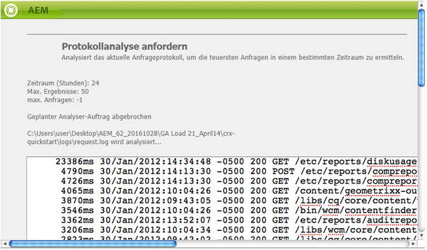

### Seitenaktivitätsbericht {#page-activity-report}

Im Seitenaktivitätsbericht werden die Seiten und die auf ihnen vorgenommenen Aktionen aufgeführt.

[Spalten mit Informationen](#selecting-and-positioning-the-data-columns) zu:

* Seite 
* Zeit
* Typ
* User

Bedeutet, dass Sie Folgendes überwachen können:

* Die neuesten Änderungen
* Autoren, die an spezifischen Seiten arbeiten
* Seiten, die in letzter Zeit nicht geändert wurden und daher gegebenenfalls eine Aktion erfordern
* Seiten, die am häufigsten/seltensten geändert wurden
* Aktivste/am wenigsten aktive Benutzer

Der Seitenaktivitätsbericht bezieht alle Informationen aus dem Auditprotokoll. Standardmäßig ist der Stammpfad für das Prüfprotokoll unter `/var/audit/com.day.cq.wcm.core.page` konfiguriert.

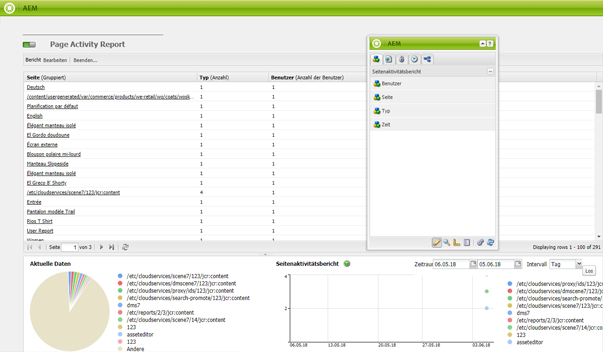

### Bericht für benutzergenerierte Inhalte {#user-generated-content-report}

Dieser Bericht stellt Informationen zu benutzergenerierten Inhalten bereit – seien es Kommentare, Bewertungen oder Foren.

[Spalten mit Informationen](#selecting-and-positioning-the-data-columns) zu:

* Datum 
* IP-Adresse
* Seite 
* Referrer
* Typ
* Benutzerkennung

Damit können Sie:

* Sehen, welche Seiten die meisten Kommentare erhalten
* Einen Überblick über alle Kommentare gewinnen, die bestimmte Besucher der Website hinterlassen, und ob die Themen miteinander zusammenhängen
* Beurteilen, ob neue Inhalte Kommentare zur Folge haben, indem überwacht wird, wann Kommentare auf einer Seite vorgenommen werden

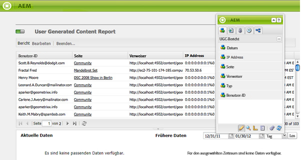

### Benutzerbericht {#user-report}

Dieser Bericht bietet Informationen zu allen Benutzern, die sich mit einem Konto und/oder Profil registriert haben. Dies umfasst sowohl Autoren innerhalb Ihrer Organisation als auch externe Besucher

[Spalten mit Informationen](#selecting-and-positioning-the-data-columns) (sofern verfügbar) zu:

* Alter
* Land
* Domain
* E-Mail
* Familienname
* Geschlecht
* [Generisch](#generic-column)
* Vorname
* Info
* Interesse
* Sprache
* NTLM-Hashcode
* Benutzer-ID

Damit können Sie:

* Die demografische Verteilung Ihrer Benutzer anzeigen
* Berichte zu benutzerdefinierten Feldern erstellen, die Sie den Profilen hinzugefügt haben

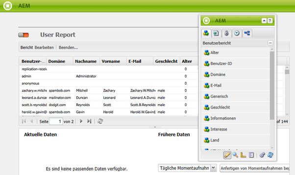

#### Generische Spalte {#generic-column}

Die **Generische Spalte** ist im Benutzerbericht verfügbar, sodass Sie auf benutzerdefinierte Informationen zugreifen können – in der Regel über die [Benutzerprofile](/help/sites-administering/identity-management.md#profiles-and-user-accounts), wie zum Beispiel [Lieblingsfarbe. Dies erfolgt, wie unter „Hinzufügen von Feldern zur Profildefinition“ erläutert](/help/sites-administering/identity-management.md#adding-fields-to-the-profile-definition).

Das Dialogfeld „Generische Spalte“ wird geöffnet, wenn Sie entweder:

* Die Komponente „Generisch“ vom Sidekick in den Bericht ziehen
* Die Spalteneigenschaften zu einer vorhandenen generischen Spalte auswählen

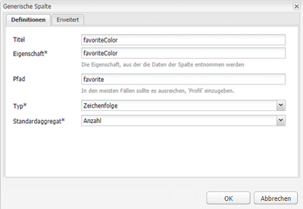

Über die Registerkarte **Definitionen** können Sie Folgendes festlegen:

* **Titel**

   Ihr eigener Titel für die generische Spalte.

* **Eigenschaft**

   Der Eigenschaftsname, wie er im Repository gespeichert ist, normalerweise im Profil des Benutzers.

* **Pfad**

   Normalerweise wird die Eigenschaft von `profile` genommen.

* **Typ**

   Wählen Sie den Feldtyp aus `String`, `Number`, `Integer`, `Date`.

* **Standard-Aggregat**

   Dies definiert das standardmäßig verwendete Aggregat, wenn die Gruppierung in einem Bericht mit mindestens einer gruppierten Spalte aufgehoben wird. Wählen Sie das gewünschte Aggregat aus `Count`, `Minimum`, `Average`, `Maximum`, `Sum`.

   Beispielsweise bedeutet *Count* für ein `String`-Feld, dass die Anzahl der eindeutigen `String`-Werte für die Spalte im aggregierten Status angezeigt wird.

In der Spalte **Erweitert** können Sie außerdem die verfügbaren Zusammenfassungen und Filter festlegen:

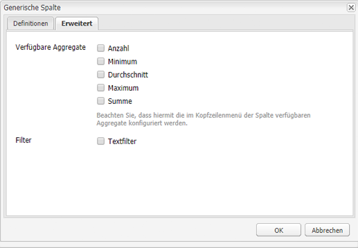

### Bericht der Workflow-Instanz {#workflow-instance-report}

Dies bietet Ihnen einen knappen Überblick und stellt Ihnen Informationen zu den einzelnen Instanzen der Workflows bereit – sowohl zu den laufenden als auch zu den abgeschlossenen.

[Spalten mit Informationen](#selecting-and-positioning-the-data-columns) zu:

* Abgeschlossen
* Dauer
* Initiator
* Modell
* Payload
* Gestartet
* Status

Dies bedeutet, dass Sie:

* die durchschnittliche Dauer der Workflows überwachen können. Wenn dies regelmäßig passiert, können Probleme innerhalb des Workflows hervorgehoben werden.

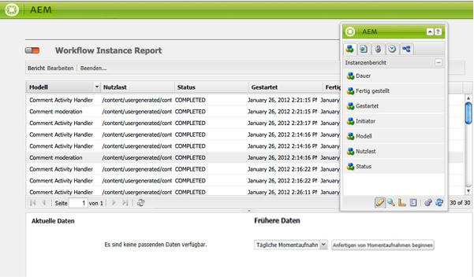

### Workflow-Bericht {#workflow-report}

Dies stellt wichtige Statistiken zu den auf Ihrer Instanz ausgeführten Workflows bereit.

## Verwenden von Berichten in einer Veröffentlichungsumgebung {#using-reports-in-a-publish-environment}

Sobald Sie die Berichte für Ihre spezifischen Anforderungen konfiguriert haben, können Sie sie für die Übertragung der Konfiguration in die Veröffentlichungsumgebung aktivieren.

>[!CAUTION]
>
>Wenn Sie **frühere Daten** für die Veröffentlichungsumgebung möchten, **beenden** Sie vor dem Aktivieren der Seite den Bericht in der Autorenumgebung.

Der entsprechende Bericht wird dann unter

`/etc/reports`

Der Bericht für benutzergenerierte Inhalte ist beispielsweise hier zu finden:

`http://localhost:4503/etc/reports/ugcreport.html`

In dem Bericht sind Daten enthalten, die aus einer Veröffentlichungsumgebung erfasst wurden.

Da in der Veröffentlichungsumgebung keine Berichtskonfiguration zulässig ist, sind die Schaltflächen **Bearbeiten** und **Fertigstellen** nicht verfügbar. Sie können allerdings den **Zeitraum** und das **Intervall** für die Berichte zu **früheren Daten** auswählen, wenn Momentaufnahmen erfasst werden.

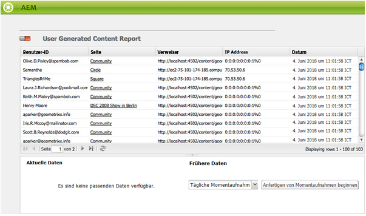

>[!CAUTION]
>
>Der Zugang zu diesen Berichten kann ein Sicherheitsproblem sein. Daher empfehlen wir Ihnen, den Dispatcher so zu konfigurieren, dass `/etc/reports` nicht für externe Besucher verfügbar ist. Weitere Informationen finden Sie unter [Sicherheitscheckliste](security-checklist.md).

## Für die Ausführung von Berichten benötigte Berechtigungen {#permissions-needed-for-running-reports}

Die benötigten Berechtigungen hängen von der Aktion ab:

* Berichtsdaten werden in der Regel mithilfe der Berechtigungen des aktuellen Benutzers erfasst.
* Frühere Daten werden mithilfe der Berechtigungen des Benutzers erfasst, der den Bericht fertiggestellt hat.

In einer standardmäßigen AEM-Installation werden die folgenden Berechtigungen für die Berichte voreingestellt:

* **Benutzerbericht**

   `user administrators` - Lesen und Schreiben

* **Seitenaktivitätsbericht**

   `contributors` - Lesen und Schreiben

* **Komponentenbericht**

   `contributors` - Lesen und Schreiben

* **Bericht für benutzergenerierte Inhalte**

   `contributors` - Lesen und Schreiben

* **Bericht der Workflow-Instanz**

   `workflow-users` - Lesen und Schreiben

Alle Mitglieder der Gruppe `administrators` verfügen über die erforderlichen Rechte zur Erstellung neuer Berichte.
