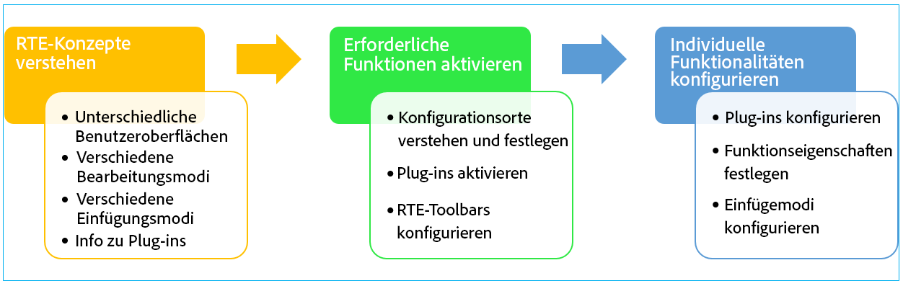
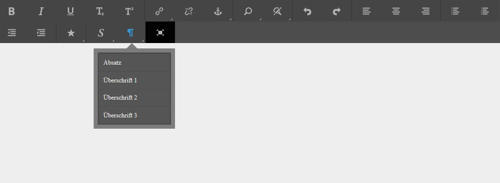
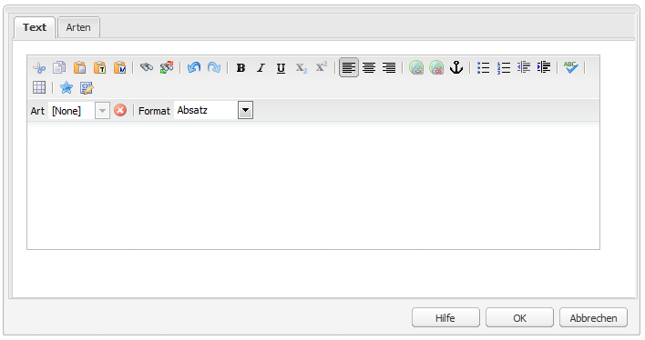
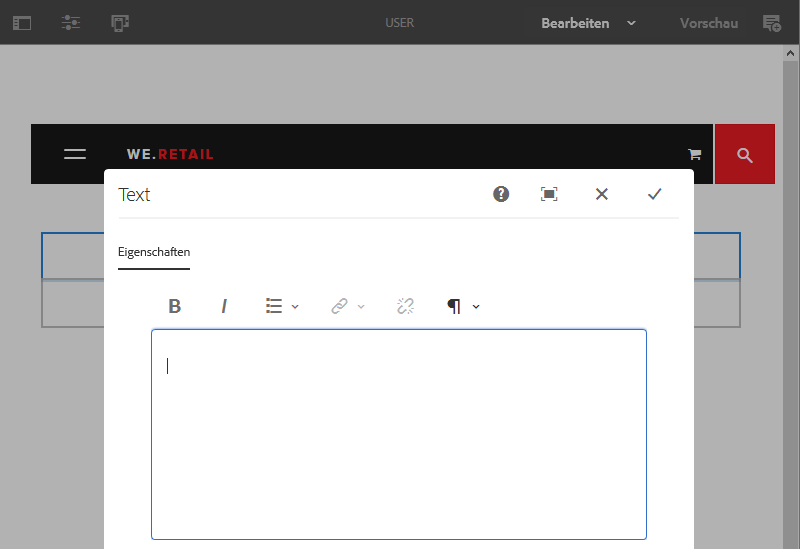

# Konfigurieren des Rich-Text-Editors {#configure-the-rich-text-editor}

Der Rich-Text-Editor (RTE) bietet Autoren eine große Bandbreite an Funktionen zum Bearbeiten von Textinhalten. Symbole, Auswahlfelder, Symbolleiste und Menüs werden für eine WYSIWYG-Textbearbeitung bereitgestellt.

Informationen zur Verwendung der Authoring-Funktionen des RTE finden Sie unter [Verwenden des Rich-Text-Editors für das Authoring](/help/sites-authoring/rich-text-editor.md). Der RTE kann konfiguriert werden, um die in den Authoring-Komponenten verfügbaren Funktionen zu aktivieren, zu deaktivieren und zu erweitern. Der folgende Workflow zeigt die empfohlene Reihenfolge zum Abschließen der RTE-Konfigurationsaufgaben in Experience Manager.



*Abbildung: Sequenz von Schritten zum Konfigurieren des RTE*

## Grundlegendes zur Touch-optimierten und klassischen Benutzeroberfläche {#understand-touch-enabled-ui-and-classic-ui}

Die Touch-optimierte Benutzeroberfläche ist die Standard-Benutzeroberfläche für Experience Manager. Mit der Adobe wurde die Touch-optimierte Benutzeroberfläche mit [responsivem Design](/help/sites-authoring/responsive-layout.md) für die Authoring-Umgebung eingeführt. Die Touch-optimierte Benutzeroberfläche wurde für Touch- und Desktop-Geräte entwickelt. Die Benutzeroberfläche unterscheidet sich erheblich von der ursprünglichen klassischen Benutzeroberfläche.



*Abbildung: Rich-Text-Editor-Symbolleiste in der Touch-optimierten Benutzeroberfläche*



*Abbildung: Rich-Text-Editor-Symbolleiste in der klassischen Benutzeroberfläche*

>[!MORELIKETHIS]
>
>* [Empfehlungen für die Benutzeroberfläche.](/help/sites-deploying/ui-recommendations.md)
* Informationen zur Einstellung der klassischen Benutzeroberfläche finden Sie unter [Experience Manager 6.5 - Versionshinweise](/help/release-notes/deprecated-removed-features.md)
* Informationen zum Unterschied zwischen den Benutzeroberflächen finden Sie unter [Touch-Benutzeroberfläche und klassische Benutzeroberfläche](https://aemcq5pedia.wordpress.com/2018/01/05/touch-enabled-ui-aem6-3/)
* Ausführliche Informationen zur Touch-optimierten Benutzeroberfläche finden Sie unter [Konzepte der Touch-optimierten Benutzeroberfläche von Experience Manager](/help/sites-developing/touch-ui-concepts.md)


## Verschiedene Bearbeitungsmodi {#editingmodes}

Autoren können Textinhalte in Experience Manager mithilfe der verschiedenen Komponentenmodi erstellen und bearbeiten. Die Symbolleistenoptionen für das Erstellen und Formatieren von Inhalten und das Benutzererlebnis von RTE-aktivierten Komponenten in verschiedenen Bearbeitungsmodi variieren je nach RTE-Konfiguration.

| Bearbeitungsmodus | Bearbeitungsbereich | Für die Aktivierung empfohlene Funktionen | Touch-optimierte Benutzeroberfläche | Klassische Benutzeroberfläche |
|--- |--- |--- |--- |--- |
| Inline | Bearbeitung im Kontext für schnelle, geringfügige Änderungen; Formatieren ohne Öffnen eines Dialogfelds | Minimale RTE-Funktionen | J | J |
| RTE-Vollbildschirm | Füllt die gesamte Seite aus | Alle erforderlichen RTE-Funktionen | J | N |
| Dialogfeld | Dialogfeld, das oberhalb des Seiteninhalts angezeigt wird, jedoch nicht die gesamte Seite einnimmt | Alle erforderlichen RTE-Funktionen in der klassischen Benutzeroberfläche; Funktionen sollten in der Touch-optimierten Benutzeroberfläche umsichtig aktiviert werden | J | J |
| Dialogfeld-Vollbildmodus | Wie im Vollbildmodus; enthält neben dem RTE Felder des Dialogfelds | Alle erforderlichen RTE-Funktionen | J | N |

>[!NOTE]
Die Quellbearbeitungsfunktion ist im Inline-Bearbeitungsmodus in der Touch-optimierten Benutzeroberfläche nicht verfügbar. Im Vollbildmodus können Sie Bilder nicht per Drag-and-Drop verschieben. Alle anderen Funktionen sind in allen Modi verfügbar.

### Inline-Bearbeitung {#inline-editing}

Beim Öffnen (durch langsames Doppeltippen/Doppelklicken) kann der Inhalt innerhalb der Seite bearbeitet werden. Dazu steht Ihnen eine kompakte Symbolleiste mit sehr grundlegenden Optionen zur Verfügung.


*Abbildung: Inline-Bearbeitung mit einfacher Symbolleiste in der Touch-optimierten Benutzeroberfläche*

In der klassischen Benutzeroberfläche ermöglicht ein langsamer Doppelklick auf die Komponente die Inline-Bearbeitung. Eine orangefarbene Kontur markiert dann den Inhalt. Wenn der Content Finder geöffnet ist, wird oben im Fenster eine Symbolleiste mit den verfügbaren RTE-Formatierungsoptionen angezeigt. Ist der Content Finder nicht geöffnet, werden die Formatierungsoptionen nicht angezeigt und Sie können nur grundlegende Textbearbeitungen vornehmen.

### Bearbeitung im Vollbildmodus {#full-screen-editing}

Experience Manager-Komponenten können im Vollbildmodus geöffnet werden. Dabei wird der Seiteninhalt ausgeblendet und der gesamte Bildschirm ausgefüllt. Die Bearbeitung im Vollbildmodus ist quasi eine detaillierte Version der Inline-Bearbeitung, da sie die meisten Bearbeitungsmöglichkeiten bietet. Wenn Sie sich im Inline-Bearbeitungsmodus befinden, kann sie durch Klicken auf  in der kompakten Symbolleiste geöffnet werden.

Im Dialogfeld-Vollbildmodus stehen neben einer detaillierten RTE-Symbolleiste auch die in einem Dialogfeld verfügbaren Optionen und Komponenten zur Verfügung. Dies gilt nur für ein Dialogfeld, das neben anderen Komponenten einen RTE enthält.


*Abbildung: Die detaillierte RTE-Symbolleiste bei der Bearbeitung im Vollbildmodus in der Touch-optimierten Benutzeroberfläche*

### Bearbeitung in einem Dialogfeld {#dialog-editing}

Wenn Sie auf eine Komponente doppelklicken, öffnet sich ein Dialogfeld zur Bearbeitung des Inhalts. Das Dialogfeld öffnet sich oben auf der jeweiligen Seite. In bestimmten Fällen kann dieses Dialogfeld auch als Popup-Fenster geöffnet werden. Dies ist beispielsweise der Fall, wenn eine Textkomponente Teil einer Spalte in einem mehrspaltigen Seitenlayout ist und zu wenig Platz für die Anzeige des Dialogfelds vorhanden ist.



*Abbildung: Dialogbearbeitungsmodus in der Touch-optimierten Benutzeroberfläche*


*Abbildung: Dialogfeld in der klassischen Benutzeroberfläche mit detaillierter Symbolleiste zur Bearbeitung*

## Wissenswertes über RTE-Plug-ins und die zugehörigen Funktionen {#aboutplugins}

Die Funktionen werden über eine Reihe von Plug-ins zur Verfügung gestellt, jeweils mit:

* Eine `features` -Eigenschaft:

   * zur Aktivierung oder Deaktivierung der grundlegenden Funktionalität des jeweiligen Plug-ins verwendet werden kann
   * die über ein standardisiertes Verfahren konfiguriert werden kann;

* weiteren Eigenschaften und Optionen, die eine spezielle Konfiguration erfordern.

Die grundlegenden RTE-Funktionen werden durch den Wert der Eigenschaft `features` in einem Knoten aktiviert oder deaktiviert, der spezifisch für das entsprechende Plug-in ist.

In der folgenden Tabelle sind die aktuellen Plug-ins und Folgendes aufgeführt:

* Plug-in-IDs mit einem Link zur API-Dokumentation. Die ID wird bei [Aktivierung eines Plug-ins](/help/sites-administering/configure-rich-text-editor-plug-ins.md#activateplugin) als Knotenname verwendet.
* Zulässige Werte für die Eigenschaft `features`.
* Eine Beschreibung der vom Plug-in bereitgestellten Funktion.

| Plug-in-ID | Funktionen | Beschreibung |
|--- |--- |--- |
| edit | cut copy paste-default paste-plaintext paste-wordhtml | [Ausschneiden, Kopieren und drei Einfügemodi](/help/sites-administering/configure-rich-text-editor-plug-ins.md#textstyles) |
| [findreplace](https://helpx.adobe.com/experience-manager/6-5/sites/developing/using/reference-materials/widgets-api/index.html?class=CQ.form.rte.plugins.FindReplacePlugin) | find replace | Suchen und Ersetzen. |
| [format](https://helpx.adobe.com/experience-manager/6-5/sites/developing/using/reference-materials/widgets-api/index.html?class=CQ.form.rte.plugins.FormatPlugin) | bold italic underline | [Grundlegende Textformatierung](/help/sites-administering/configure-rich-text-editor-plug-ins.md#textstyles) |
| [image](https://helpx.adobe.com/experience-manager/6-5/sites/developing/using/reference-materials/widgets-api/index.html?class=CQ.form.rte.plugins.ImagePlugin) | image | Grundlegende Bildunterstützung (aus den Inhalten oder dem Content Finder ziehen). Nutzungsverhalten für Autoren kann je nach verwendetem Browser variieren |
| [keys](https://helpx.adobe.com/experience-manager/6-5/sites/developing/using/reference-materials/widgets-api/index.html?class=CQ.form.rte.plugins.KeyPlugin) |  | Informationen zum Definieren dieses Werts finden Sie unter [Registerkarten-Größe](/help/sites-administering/configure-rich-text-editor-plug-ins.md#tabsize). |
| [justify](https://helpx.adobe.com/experience-manager/6-5/sites/developing/using/reference-materials/widgets-api/index.html?class=CQ.form.rte.plugins.JustifyPlugin) | justifyleft justifycenter justifyright | Absatzausrichtung |
| [links](https://helpx.adobe.com/experience-manager/6-5/sites/developing/using/reference-materials/widgets-api/index.html?class=CQ.form.rte.plugins.LinkPlugin) | modifylink unlink anchor | [Hyperlinks und Anker](/help/sites-administering/configure-rich-text-editor-plug-ins.md#linkstyles) |
| [Listen](https://helpx.adobe.com/experience-manager/6-5/sites/developing/using/reference-materials/widgets-api/index.html?class=CQ.form.rte.plugins.ListPlugin) | ordered unordered indent outdent | Über dieses Plug-in werden [Einzüge und Listen](/help/sites-administering/configure-rich-text-editor-plug-ins.md#indentmargin) gesteuert, einschließlich verschachtelter Listen. |
| [misctools](https://helpx.adobe.com/experience-manager/6-5/sites/developing/using/reference-materials/widgets-api/index.html?class=CQ.form.rte.plugins.MiscToolsPlugin) | specialchars sourceedit | Verschiedene Tools gestatten es Autoren, [Sonderzeichen](/help/sites-administering/configure-rich-text-editor-plug-ins.md#spchar) einzugeben oder die HTML-Quelle zu bearbeiten. Außerdem können Sie [zahlreiche Sonderzeichen](/help/sites-administering/configure-rich-text-editor-plug-ins.md#definerangechar) hinzufügen, wenn Sie Ihre eigene Liste definieren möchten. |
| Paraformat | paraformat | Folgende Standard-Absatzformate sind verfügbar: „Absatz“, „Überschrift 1“, „Überschrift 2“ und „Überschrift 3“ (`<p>`, `<h1>`, `<h2>` und `<h3>`). Sie können [weitere Absatzformate](/help/sites-administering/configure-rich-text-editor-plug-ins.md#paraformats) hinzufügen oder die Liste erweitern. |
| spellcheck | checktext | [Rechtschreibprüfung mit Spracherkennung](/help/sites-administering/configure-rich-text-editor-plug-ins.md#adddict). |
| styles | styles | Unterstützung für das Styling mithilfe einer CSS-Klasse. [Fügen Sie neue Textstile hinzu](/help/sites-administering/configure-rich-text-editor-plug-ins.md#textstyles), wenn Sie eigene Stile zur Verwendung mit Text hinzufügen oder erweitern möchten. |
| subsuperscript | subscript superscript | Erweiterung der grundlegenden Formatierungsoptionen um die Optionen „Hochgestellt“ und „Tiefgestellt“. |
| table | table removetable insertrow removerow insertcolumn removecolumn cellprops mergecells splitcell selectrow selectcolumns | Weitere Informationen zum Hinzufügen eigener Stile für komplette Tabellen oder einzelne Zellen finden Sie unter [Konfigurieren von Tabellenstilen](/help/sites-administering/configure-rich-text-editor-plug-ins.md#tablestyles). |
| undo | undo redo | Verlaufsgröße zu Vorgängen zum [Rückgängigmachen oder Wiederholen](/help/sites-administering/configure-rich-text-editor-plug-ins.md#undohistory). |

>[!NOTE]
Das Plug-in für den Vollbildmodus wird im Dialogfeldmodus nicht unterstützt. Verwenden Sie die Einstellung `dialogFullScreen` , um die Symbolleiste für den Vollbildmodus zu konfigurieren.

## Grundlegendes zu den Konfigurationspfaden und -speicherorten {#understand-the-configuration-paths-and-locations}

Der [RTE-Bearbeitungsmodus (und die Benutzeroberfläche)](#editingmodes), den Sie Ihren Autoren bereitstellen, legt den Speicherort für die Konfigurationsdetails fest, wenn Sie [die RTE-Plug-ins aktivieren](/help/sites-administering/configure-rich-text-editor-plug-ins.md#activateplugin):

| Bearbeitungsmodus | Speicherort für die Touch-optimierte Benutzeroberfläche | Speicherort für die klassische Benutzeroberfläche |
|---|---|---|
| Inline | `cq:editConfig/cq:inplaceEditing` | `cq:editConfig/cq:inplaceEditing` |
| Vollbild | `cq:editConfig/cq:inplaceEditing` | Nicht zutreffend |
| Dialogfeld | `cq:dialog` | `dialog` |
| Dialogfeld im Vollbildmodus | `cq:dialog` | Nicht zutreffend |

>[!NOTE]
Benennen Sie den Knoten unter `cq:inplaceEditing` nicht mit `config`. Definieren Sie unter dem Knoten `cq:inplaceEditing` die folgenden Eigenschaften:
* **Name**: `configPath`
* **Typ**: `String`
* **Wert**: Pfad des Knotens, der die tatsächliche Konfiguration enthält

Benennen Sie den RTE-Konfigurationsknoten nicht mit `config`. Andernfalls treten die RTE-Konfigurationen nur für die Administratoren und nicht für die Benutzer in der Gruppe `content-author` in Kraft.

Konfigurieren Sie die folgenden Eigenschaften, die nur im Dialogfeld-Bearbeitungsmodus in der Touch-optimierten Benutzeroberfläche verfügbar sind:

* `useFixedInlineToolbar`: Legen Sie diese boolesche Eigenschaft, die im RTE-Knoten (einer mit „sling:resourceType=`cq/gui/components/authoring/dialog/richtext`“) definiert ist, auf `True` fest, um die RTE-Symbolleiste zu fixieren.

   Wenn diese Eigenschaft auf „true“ gesetzt ist, wird die Rich-Text-Bearbeitung standardmäßig beim Ereignis „foundation-contentloaded“ gestartet.

   Um dies zu verhindern, setzen Sie die Eigenschaft `customStart` auf `True` und lösen Sie das Ereignis „rte-start“ zum Starten der RTE-Bearbeitung aus. Wenn diese Eigenschaft auf „true“ gesetzt ist, funktioniert das Standardverhalten, d. h. das Starten des RTE bei Klicken, nicht.

* `customStart`: Setzen Sie diese boolesche Eigenschaft, die im RTE-Knoten definiert ist, auf `True`, um den RTE-Startzeitpunkt zu steuern, indem Sie das Ereignis `rte-start` auslösen.

* `rte-start`: Lösen Sie dieses Ereignis bei `contenteditable-div` des RTE aus, wenn die RTE-Bearbeitung gestartet werden soll. Dies funktioniert nur, wenn `customStart` auf „true“ gesetzt ist.

Wenn der RTE im Touch-optimierten Dialogfeld verwendet wird, muss die Eigenschaft `useFixedInlineToolbar` auf „true“ gesetzt werden, um Probleme zu vermeiden.

## Bearbeitung im Kontext anpassen {#customizing-in-place-editing}

Sie können festlegen, mit welchem HTML-Selektor der Texteditor beginnt, indem Sie die folgenden Eigenschaften konfigurieren:

* **`editElementQuery`** - Definiert in  `cq:InplaceEditingConfig`, wird diese Eigenschaft verwendet, um einen Selektor des HTML-Elements anzugeben, für das die Inline-Bearbeitung für die Textkomponente gestartet wird. Wenn nichts angegeben ist, wird die Inline-Bearbeitung direkt auf der HTML-Seite der Textkomponente gestartet.
* **`textPropertyName`** - Definiert in  `cq:InplaceEditingConfig`, wird diese Eigenschaft verwendet, um den Namen der Eigenschaft anzugeben, die auf dem Inhaltsknoten gespeichert wird, in dem der HTML-Wert der Textkomponente nach der Inline-Bearbeitung beibehalten wird.

Die entsprechende Eigenschaft für den Dialogfeldmodus ist `name`.

## Aktivieren von RTE-Funktionen durch Aktivieren von Plug-ins {#enable-rte-functionalities-by-activating-plug-ins}

RTE-Funktionen werden über eine Reihe von Plug-ins mit jeweils einer Eigenschaft „Funktionen“ bereitgestellt. Sie können die Funktionseigenschaft konfigurieren, um die verschiedenen Funktionen jedes Plug-ins zu (de-)aktivieren.

Ausführliche Konfigurationen des RTE-Plug-ins finden Sie unter [Aktivieren und Konfigurieren von RTE-Plug-ins](/help/sites-administering/configure-rich-text-editor-plug-ins.md).

**Beispiel**: Laden Sie  [diese ](/help/sites-administering/assets/rte-sample-all-features-enabled-10.zip) Beispielkonfiguration herunter, die die Konfiguration des RTE veranschaulicht. In diesem Paket sind alle Funktionen aktiviert.

>[!NOTE]
Die [Text-Kernkomponente](https://docs.adobe.com/content/help/de-DE/experience-manager-core-components/using/components/text.html#the-text-component-and-the-rich-text-editor) gestattet es Bearbeitern von Vorlagen, viele RTE-Plug-ins in einer grafischen Benutzeroberfläche als Inhaltsrichtlinien zu konfigurieren, sodass keine technische Konfiguration mehr erforderlich ist. Content-Richtlinien können mit RTE-Benutzeroberflächenkonfigurationen verwendet werden, wie in diesem Dokument beschrieben ist.
Weitere Informationen finden Sie im Abschnitt [RTE-Benutzeroberflächeneinstellungen und Inhaltsrichtlinien](/help/sites-administering/rich-text-editor.md) dieses Dokuments sowie unter [Erstellen von Seitenvorlagen](/help/sites-authoring/templates.md) und in der [Dokumentation für Entwickler von Kernkomponenten](https://docs.adobe.com/content/help/de-DE/experience-manager-core-components/using/developing/developing.html).

>[!NOTE]
Zu Referenzzwecken finden Sie die standardmäßigen Textkomponenten (bereitgestellt im Rahmen einer Standardinstallation) unter:
* `/libs/wcm/foundation/components/text`
* `/libs/foundation/components/text`

Um eine eigene Textkomponente zu erstellen, kopieren Sie die oben stehende Komponente, anstatt diese Komponenten zu bearbeiten.

## RTE-Symbolleiste konfigurieren     {#dialogfullscreen}

Mit AEM können Sie die Benutzeroberfläche für den Rich-Text-Editor für die verschiedenen Bearbeitungsmodi unterschiedlich konfigurieren. Die Standardeinstellungen finden Sie unten. Sie können diese Standardwerte entsprechend Ihren Anforderungen überschreiben. Sie passen nur die Symbolleisteneigenschaften an, die Sie Ihren Autoren zur Verfügung stellen möchten. Sie brauchen nicht alle Symbolleistenkonfigurationen anzugeben.

Um die Symbolleiste für `dialogFullScreen` zu konfigurieren, verwenden Sie die folgende Beispielkonfiguration.

```java
<uiSettings jcr:primaryType="nt:unstructured">
  <cui jcr:primaryType="nt:unstructured">
    <inline
      jcr:primaryType="nt:unstructured"
      toolbar="[format#bold,format#italic,format#underline,#justify,#lists,links#modifylink,links#unlink,#paraformat]">
      <popovers jcr:primaryType="nt:unstructured">
        <justify
          jcr:primaryType="nt:unstructured"
          items="[justify#justifyleft,justify#justifycenter,justify#justifyright,justify#justifyjustify]"
          ref="justify"/>
        <lists
          jcr:primaryType="nt:unstructured"
          items="[lists#unordered,lists#ordered,lists#outdent,lists#indent]"
          ref="lists"/>
        <paraformat
          jcr:primaryType="nt:unstructured"
          items="paraformat:getFormats:paraformat-pulldown"
          ref="paraformat"/>
      </popovers>
    </inline>
    <dialogFullScreen
      jcr:primaryType="nt:unstructured"
      toolbar="[format#bold,format#italic,format#underline,justify#justifyleft,justify#justifycenter,justify#justifyright,justify#justifyjustify,lists#unordered,lists#ordered,lists#outdent,lists#indent,links#modifylink,links#unlink,table#createoredit,#paraformat,image#imageProps]">
      <popovers jcr:primaryType="nt:unstructured">
        <paraformat
          jcr:primaryType="nt:unstructured"
          items="paraformat:getFormats:paraformat-pulldown"
          ref="paraformat"/>
      </popovers>
    </dialogFullScreen>
    <tableEditOptions
      jcr:primaryType="nt:unstructured"
      toolbar="[table#insertcolumn-before,table#insertcolumn-after,table#removecolumn,-,table#insertrow-before,table#insertrow-after,table#removerow,-,table#mergecells-right,table#mergecells-down,table#mergecells,table#splitcell-horizontal,table#splitcell-vertical,-,table#selectrow,table#selectcolumn,-,table#ensureparagraph,-,table#modifytableandcell,table#removetable,-,undo#undo,undo#redo,-,table#exitTableEditing,-]">
    </tableEditOptions>
  </cui>
</uiSettings>
```

Für den Inline-Modus und den Vollbildmodus werden verschiedene Benutzeroberflächen-Einstellungen verwendet. Die Symbolleisten-Eigenschaft wird verwendet, um die Schaltflächen der Symbolleiste festzulegen.

Wenn die Schaltfläche selbst eine Funktion ist (z. B. `Bold`), wird sie als `PluginName#FeatureName` angegeben (z. B. `links#modifylink`).

Wenn es sich bei der Schaltfläche um ein Popover handelt (sie einige Funktionen eines Plug-ins enthält), wird sie als `#PluginName` angegeben (z. B. `#format`).

Trennzeichen (`|`) zwischen einer Gruppe von Schaltflächen können mit `-` angegeben werden.

Der Knoten „pop-up“ im Inline- oder Vollbildmodus enthält eine Liste der verwendeten Popovers. Jeder untergeordnete Knoten unter dem Knoten „popovers“ wird nach dem Plug-in benannt (z. B. „format“). Er verfügt über eine Eigenschaft „items“, die eine Liste der Funktionen des Plug-ins beinhaltet (z. B. „format#bold“).

## Einstellungen für die RTE-Benutzeroberfläche und Content-Richtlinien     {#rtecontentpolicies}

Administratoren können die RTE-Optionen mithilfe von Content-Richtlinien steuern, anstatt die Konfiguration wie oben beschrieben durchzuführen. Content-Richtlinien definieren die Designeigenschaften einer Komponente, wenn sie als Teil einer [bearbeitbaren Vorlage](/help/sites-authoring/templates.md) verwendet wird. Wenn zum Beispiel eine Textkomponente, die den RTE verwendet, mit einer bearbeitbaren Vorlage verwendet wird, kann die Content-Richtlinie definieren, dass die fettgedruckte Option und einige Absatzformatierungsoptionen verfügbar sind. Content-Richtlinien sind wiederverwendbar und können auf eine Vielzahl von Vorlagen angewendet werden.

Die verfügbaren Optionen im RTE werden von der Benutzeroberflächenkonfiguration abwärts zu den Content-Richtlinien übertragen.

* Die Benutzeroberflächen-Konfigurationseinstellungen definieren, welche Optionen für die Content-Richtlinien verfügbar sind.
* Wenn die Benutzeroberflächenkonfiguration des RTE entfernt oder ein Element nicht aktiviert wird, kann die Content-Richtlinie sie nicht konfigurieren.
* Ein Autor hat nur auf die Funktionen Zugriff, die durch die Benutzeroberflächen-Konfigurationen und Content-Richtlinien zur Verfügung gestellt werden.

Beispielsweise können Sie die [Dokumentation zur Text-Kernkomponente](https://docs.adobe.com/help/de-DE/experience-manager-core-components/using/components/text.html#the-text-component-and-the-rich-text-editor) sehen.

## Anpassen der Zuordnung zwischen Symbolleistenelementen und Befehlen {#iconstoolbar}

Sie können die Zuordnung zwischen in der RTE-Symbolleiste angezeigten Coral-Symbolen und den verfügbaren Befehlen anpassen. Sie können keine anderen Symbole als Coral-Symbole verwenden.

1. Erstellen Sie einen Knoten namens `icons` unter `uiSettings/cui`.

1. Erstellen Sie Knoten für die einzelnen Symbole darunter.
1. Geben Sie in jedem Knoten ein Coral-Symbol sowie einen Befehl an, den Sie dem Symbol zuordnen möchten.

Unten finden Sie einen Beispielausschnitt zur Zuordnung des Befehls „Bold“ (Fett) zum Coral-Symbol mit dem Namen `textItalic`.

```java
<text jcr:primaryType="nt:unstructured" sling:resourceType="cq/gui/components/authoring/dialog/richtext" name="./text" useFixedInlineToolbar="{Boolean}true">
    <rtePlugins jcr:primaryType="nt:unstructured">
        <format jcr:primaryType="nt:unstructured" features="bold,italic"/>
    </rtePlugins>
    <uiSettings jcr:primaryType="nt:unstructured">
        <cui jcr:primaryType="nt:unstructured">
            <inline jcr:primaryType="nt:unstructured"
                toolbar="[format#bold,format#italic,format#underline,links#modifylink,links#unlink]">
            </inline>
            <icons jcr:primaryType="nt:unstructured">
                <bold jcr:primaryType="nt:unstructured"
                    command="format#bold"
                    icon="textItalic"/>
            </icons>
        </cui>
    </uiSettings>
</text>
```

## Wechseln zum CoralUI 2-Rich-Text-Editor {#switch-to-coralui-rich-text-editor}

Auf einer Seite können Sie entweder CoralUI 2 RTE clientlib oder die CoralUI 3 RTE clientlib einbeziehen. Standardmäßig beinhaltet der Rich-Text-Editor die CoralUI 3-RTE-Client-Bibliothek. Führen Sie für den Wechsel zum CoralUI 2-RTE die folgenden Schritte aus.

>[!NOTE]
Adobe empfiehlt dies nicht als Best Practice. Ein Wechsel zum CoralUI 2-RTE sollte nur im Notfall erfolgen. Benutzerdefinierte Plug-ins für den RTE von CoralUI 2-RTE können im RTE von CoralUI 3 verwendet werden, wenn die Plug-ins nicht von internen RTE-Elementen, etwa Klassen, abhängig sind.
Wenn Sie benutzerdefinierte Plug-ins für den RTE von CoralUI3 nutzen, verwenden Sie die Bibliothek `rte.coralui3`.


1. Überlagern Sie den Knoten `/libs/cq/gui/components/authoring/editors/clientlibs/core` unter `/apps` und führen Sie die folgenden Schritte aus:

   * Ersetzen Sie `rte.coralui3` durch `rte.coralui2` für die Eigenschaft &quot;dependencies&quot;.
   * Ersetzen Sie `cq.authoring.editor.core.inlineediting.rte.coralui3` durch `cq.authoring.editor.core.inlineediting.rte.coralui2` für die Eigenschaft &quot;embed&quot;.
   * Ersetzen Sie `cq.authoring.rte.coralui3` durch `cq.authoring.rte.coralui2` für die Eigenschaft &quot;embed&quot;.

1. Überlagern Sie die Knoten `/libs/cq/gui/components/authoring/dialog/richtext/clientlibs/rte/coralui3` und `/libs/cq/gui/components/authoring/dialog/richtext/clientlibs/rte/coralui2` unter `/apps`.

   Entfernen Sie die Kategorie `cq.authoring.dialog` von `/apps/cq/gui/components/authoring/dialog/richtext/clientlibs/rte/coralui3` und fügen Sie sie zu `/apps/cq/gui/components/authoring/dialog/richtext/clientlibs/rte/coralui2` hinzu.

1. Ändern Sie alle weiteren Abhängigkeiten, die auf der Seite aufgenommen werden, von `rte.coralui3` in `rte.coralui2`. Ändern Sie beispielsweise nach dem Überlagern des Knotens `/libs/mcm/campaign/components/touch-ui/clientlibs/rte` unter `/apps` alle Abhängigkeiten davon von `rte.coralui3` in `rte.coralui2`.

1. Überlagern Sie den Knoten `cq/ui/widgets` unter `/apps`. Ersetzen Sie die Abhängigkeit `cq.rte` am Knoten `/apps/cq/ui/widgets` durch `cq.coralui2.rte`.

>[!NOTE]
Der CoralUI 2-RTE verwendet Handlebars-Vorlagen für Plug-in-Dialogfelder. Deshalb bestand eine Abhängigkeit zwischen der CoralUI 2-RTE-Client-Bibliothek und der Handlebars-Client-Bibliothek. Der CoralUI 3-RTE verwendet keine Handlebars-Vorlagen, weshalb hier keine Abhängigkeiten vorliegen. Wenn Ihre benutzerspezifischen Plug-ins Handlebars-Vorlagen verwenden, nehmen Sie die Handlebars-Client-Bibliothek in Ihre Webseite auf.

## Weiterführende Informationen {#further-information}

Weitere Informationen zum Konfigurieren des RTE finden Sie im [AEM Widget API](https://helpx.adobe.com/experience-manager/6-5/sites/developing/using/reference-materials/widgets-api/index.html?class=CQ.form.RichText)-Referenzhandbuch.

Wenn Sie vor allem die verfügbaren Plug-ins und zugehörigen Optionen sehen wollen:

* Die [CQ.form.RichText](https://helpx.adobe.com/experience-manager/6-5/sites/developing/using/reference-materials/widgets-api/index.html?class=CQ.form.rte.plugins.Plugin)-Komponente stellt ein Formularfeld zum Bearbeiten von formatierten Textinformationen zur Verfügung (Rich Text). Informationen zu allen verfügbaren Parametern für das Rich-Text-Formular finden Sie in den Konfigurationsoptionen.
* Die RichText-Komponente bietet zahlreiche Funktionen mithilfe der Plug-ins, die unter [CQ.form.rte.plugins.Plugin](https://helpx.adobe.com/experience-manager/6-5/sites/developing/using/reference-materials/widgets-api/index.html?class=CQ.form.rte.plugins.Plugin) aufgeführt sind. Für jedes Plug-in gilt dabei Folgendes:

   * Weitere Informationen zu den Funktionen, die aktiviert (oder deaktiviert) werden können, finden Sie unter „Funktionen“.
   * Informationen zu all den Parametern, die für eine detaillierte Konfiguration des entsprechenden Plug-ins verfügbar sind, finden Sie in den Konfigurationsoptionen.

* Weitere Informationen zu den HTML-Regeln für Links sind ebenfalls verfügbar.

Diese können verwendet werden, um Ihren eigenen RTE zu erweitern und anzupassen. Um zum Beispiel die auf der Seite verfügbaren Anker beim Erstellen eines Links aufzulisten, können Sie eine eigene Implementierung des `LinkPlugin` bereitstellen.

## Bekannte Einschränkungen {#known-limitations}

Für die AEM RTE-Funktion gelten folgende Einschränkungen:

* RTE-Funktionen werden nur in Dialogfeldern zu AEM-Komponenten unterstützt. RTE wird nicht in Assistenten und nicht in Foundation-Formularen wie [Seiteneigenschaften](/help/sites-developing/page-properties-views.md) und [Strukturvorlage](/help/sites-authoring/scaffolding.md) in der Touch-optimierten Benutzeroberfläche unterstützt.

* AEM funktioniert nicht auf [Hybrid-Geräten](/help/release-notes/known-issues.md).

* Benennen Sie den RTE-Konfigurationsknoten nicht mit `config`. Andernfalls treten die RTE-Konfigurationen nur für die Administratoren und nicht für die Benutzer in der Gruppe `content-author` in Kraft.

* RTE unterstützt keine Inline-Frame- oder iFrame-Elemente zum Einbetten von Inhalten.

## Best Practices und Tipps {#best-practices-and-tips}

* Aktivieren Sie nur die Plug-ins ohne Popup-Fenster für ein unverankertes Dialogfeld. Plug-ins ohne Popup-Fenster sind kleiner und eignen sich am besten für unverankerte Dialogfelder.
* Aktivieren Sie die Plug-ins mit einem größeren Popup-Fenster, beispielsweise das `Paste`-Plug-in, nur im Vollbildschirm-Dialogfeldmodus oder im Vollbildmodus. Plug-ins mit einem größeren Popup-Fenster beanspruchen mehr Platz auf dem Bildschirm, um ein gutes Authoring-Erlebnis zu ermöglichen.
* Wenn Sie benutzerdefinierte Plug-ins für den RTE von CoralUI3 nutzen, verwenden Sie die Bibliothek `rte.coralui3`.

## Beheben häufiger Probleme mit RTE {#troubleshoot-issues-with-aem-rich-text-editor}

**Wie lassen sich mehrere Tabellenzellen auswählen?**

Um mehrere Zellen in einer Tabelle auszuwählen, drücken Sie die `Ctrl`- oder `Cmd`-Taste und klicken Sie dann nacheinander auf die Tabellenzellen.

Führen Sie nun eine Aktion für die Auswahl durch. Legen Sie beispielsweise die Eigenschaften für die ausgewählten Zellen fest.

**Hyperlinks geben beim Bearbeiten von Komponenten über die Schaltfläche „Konfigurieren“ verloren**

Sie können in einer Textkomponente einen Hyperlink hinzufügen, indem Sie auf die Schaltfläche „Konfigurieren“ klicken. Möglicherweise geht der Hyperlink jedoch verloren, wenn Sie ihn erneut bearbeiten und zum zweiten Mal validieren.

Als Problemumgehung können Sie in die Textkomponente klicken, wenn das Dialogfeld „Bearbeiten“ zum zweiten Mal angezeigt wird, um dann die Validierung des Links durchzuführen.

Dieses Problem wurde mit Einführung von AEM 6.3 behoben.

**Im Quell-Bearbeitungsmodus hinzugefügter HTML-Inhalt geht verloren**

Fügen Sie keinen HTML-Inhalt hinzu, in den XSS eingebettet sein könnte. AEM (nicht der RTE) entfernt ggf. HTML-Inhalt, um den XSS Antisamy-Regeln zu entsprechen.

Um sicherzustellen, dass der eingefügte HTML-Inhalt gespeichert wird, überprüfen Sie den gespeicherten Inhalt in CRXDE (im Inhaltsknoten).

Falls der HTML-Inhalt nicht gespeichert wurde, hat der RTE ihn wahrscheinlich entfernt, da er nicht den RTE-Regeln entsprochen hat.

Wenn sie in CRXDE gespeichert, aber nicht auf der Seite gerendert werden (um das Rendering zu überprüfen, siehe [preview](/help/sites-authoring/editing-content.md#preview-mode) der Seite), wird sie durch AEM XSS-Regeln entfernt.

**Mehrfeld-Komponente funktioniert nicht erwartungsgemäß**

Verwenden Sie zum Erstellen einer Mehrfeld-Komponente ausschließlich CoralUI 3. Verwenden Sie keine CoralUI 2-Dialogfelder zu Komponenten.

Überprüfen Sie außerdem, ob der Code und die Knotenstruktur für die Mehrfeld-Implementierung korrekt sind.

**Für Administratoren verfügbare Konfigurationen stehen Autoren nicht zur Verfügung**

Wenn Aktualisierungen an Benutzeroberflächenkonfigurationen für Administrator-, jedoch nicht für Autorenkonten übernommen werden, stellen Sie sicher, dass der Konfigurationsknoten nicht mit `config` benannt wurde. Verwenden Sie die Eigenschaft [`configPath`](/help/sites-developing/components-basics.md#cq-inplaceediting).

>[!MORELIKETHIS]
* [Konfigurieren von RTE-Plug-ins](configure-rich-text-editor-plug-ins.md)
* [Verwenden des Rich-Text-Editors für das Authoring](../sites-authoring/rich-text-editor.md)
* [Konfigurieren des RTE für barrierefreie Websites](rte-accessible-content.md)
* [Funktionsparität zwischen Touch-optimierter und klassischer Benutzeroberfläche](../release-notes/touch-ui-features-status.md)
* [Tutorial-Beispiel für die Erstellung von kombinierten Mehrfeld-Komponenten](https://experience-aem.blogspot.com/2019/05/aem-65-touchui-composite-multifield-with-coral3-rte-rich-text.html)

