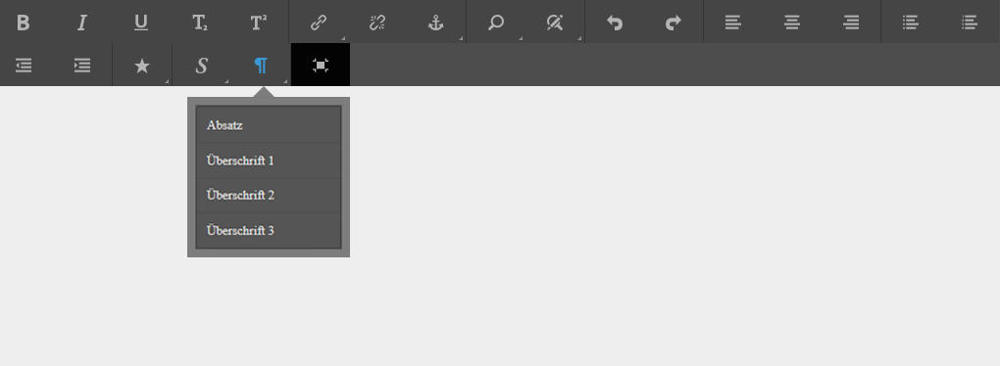
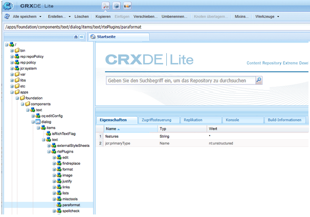

# RTE konfigurieren, um barrierefreie Webseiten und Websites zu erstellen.{#configure-rte-for-accessibility}

Adobe Experience Manager unterstützt viele Standard-Barrierefreiheitsmerkmale in Übereinstimmung mit verschiedenen Barrierefreiheitsstandards. Darüber hinaus können Entwickler die Funktionen anpassen oder erweitern, die die Erstellung barrierefreier Inhalte mithilfe von Experience Manager-Komponenten unterstützen, die den RTE-Editor (RTE) verwenden.

Beim Entwerfen von Webseiten und Hinzufügen von Inhalten zu den Seiten können die Inhaltsentwickler und Autoren Funktionen der RTE verwenden, um barrierefreie Informationen bereitzustellen. Fügen Sie beispielsweise Strukturinformationen über Überschriften und Absatzelemente hinzu.

Um diese Funktionen zu konfigurieren und anzupassen, konfigurieren Sie die RTE-Plugins](#configure-the-plugin-features) für die Komponente. [ Beispielsweise können Sie mit dem Plugin `paraformat` zusätzliche semantische Elemente auf Blockebene hinzufügen, einschließlich der Erweiterung der Anzahl der Überschriftenebenen, die standardmäßig über die grundlegenden `H1`-, `H2`- und `H3`-Elemente hinaus unterstützt werden.

Die RTE ist in verschiedenen Komponenten für die Touch-aktivierte Benutzeroberfläche und die Classic-Benutzeroberfläche verfügbar. Die primäre Komponente, die die RTE verwendet, ist jedoch die Komponente **Text**, die für beide Schnittstellen verfügbar ist. Die folgenden Abbildungen zeigen die RTE mit einer Reihe von Plugins aktiviert, einschließlich `paraformat`:



*Abbildung: Die Komponente &quot;Text&quot;in der Touch-fähigen Benutzeroberfläche.*


*Abbildung: Die Komponente &quot;Text&quot;in der Benutzeroberfläche &quot;Klassisch&quot;.*

Die Unterschiede zwischen den RTE-Funktionen, die in den verschiedenen Benutzeroberflächen verfügbar sind, finden Sie unter [Plugins und deren Funktionen](/help/sites-administering/rich-text-editor.md#aboutplugins).

## Konfigurieren der Plug-in-Funktionen {#configure-the-plugin-features}

Eine vollständige Anleitung zum Konfigurieren der RTE finden Sie auf der Seite [Rich Text Editor](/help/sites-administering/rich-text-editor.md) konfigurieren. Dies deckt alles ab, einschließlich der wichtigen Schritte:

* [Plugins und die Funktionen](/help/sites-administering/rich-text-editor.md#aboutplugins).
* [Konfigurationsspeicherorte](/help/sites-administering/rich-text-editor.md#understand-the-configuration-paths-and-locations).
* [Aktivieren eines Plug-ins und Konfigurieren der features-Eigenschaft](/help/sites-administering/rich-text-editor.md#enable-rte-functionalities-by-activating-plug-ins).
* [Konfigurieren anderer RTE-Funktionen](/help/sites-administering/rich-text-editor.md#enable-rte-functionalities-by-activating-plug-ins).

Wenn Sie ein Plugin in der entsprechenden `rtePlugins`-Unterverzweigung in der CRXDE Lite konfigurieren, können Sie entweder alle oder bestimmte Funktionen für dieses Plugin aktivieren.



### Beispiel: Geben Sie im RTE-Auswahlfeld {#example-specifying-paragraph-formats-available-in-rte-selection-field} verfügbare Absatzformate an

Es können wie folgt neue semantische Blockformate zur Auswahl bereitgestellt werden:

1. Legen Sie den [Konfigurationsspeicherort](/help/sites-administering/rich-text-editor.md#understand-the-configuration-paths-and-locations) abhängig von Ihrem RTE fest und navigieren Sie dorthin.
1. [Aktivieren Sie das Absatzauswahlfeld](/help/sites-administering/rich-text-editor.md) durch die [Aktivierung des Plug-ins](/help/sites-administering/rich-text-editor.md#enable-rte-functionalities-by-activating-plug-ins).
1. [Geben Sie die Formate an, die Sie im Absatzauswahlfeld zur Verfügung haben möchten](/help/sites-administering/rich-text-editor.md).
1. Die Absatzformate sind dann für den Autor der Inhalte aus den Auswahlfeldern im RTE verfügbar. Auf sie kann wie folgt zugegriffen werden:

   * Verwenden des Absatz-Kopfzeilensymbols in der Touch-fähigen Benutzeroberfläche.
   * Verwenden des Felds **Format** (Popup-Selektor) in der klassischen Benutzeroberfläche.

Mit Strukturelementen, die im RTE über die Absatzformatoptionen verfügbar sind, stellt AEM eine gute Grundlage für die Entwicklung barrierefreier Inhalte bereit. Inhaltsautoren können den RTE für die Formatierung der Schriftgröße, der Farben oder anderer verwandter Attribute verwenden und dadurch die Erstellung einer Inline-Formatierung verhindern. Stattdessen müssen sie entsprechende Strukturelemente wie Überschriften auswählen und über die Option „Arten“ ausgewählte globale Formatarten verwenden. Dies sorgt für ein sauberes Markup, mehr Optionen für Benutzer, die die Suche mit ihren eigenen Formatvorlagen durchführen, sowie korrekt strukturierte Inhalte.

## Verwendung der Quellbearbeitungsfunktion {#use-of-the-source-edit-feature}

In einigen Fällen halten Inhaltsautoren es für erforderlich, den mithilfe des RTE erstellten HTML-Quell-Code zu untersuchen und anzupassen. So kann beispielsweise ein innerhalb des RTE erstellter Inhalt ein zusätzliches Markup erfordern, um Compliance mit WCAG 2.0 sicherzustellen. Dies lässt sich mit der Option [Quellenbearbeitung](/help/sites-administering/rich-text-editor.md#aboutplugins) des RTE umsetzen. Sie können die Funktion [`sourceedit` im Plug-in `misctools` angeben](/help/sites-administering/rich-text-editor.md#aboutplugins).

>[!CAUTION]
>
>Gehen Sie beim Verwenden der Funktion `sourceedit` sorgfältig vor. Tippfehler und/oder nicht unterstützte Funktionen können zusätzliche Probleme hervorrufen.

## hinzufügen Unterstützung für weitere HTML-Elemente und -Attribute {#add-support-for-more-html-elements-and-attributes}

Um die Barrierefreiheitsfunktionen von AEM weiter auszubauen, ist es möglich, die vorhandenen Komponenten basierend auf dem RTE (wie die Komponenten **Text** und **Tabelle**) um zusätzliche Elemente und Attribute zu erweitern.

Das folgende Verfahren veranschaulicht, wie die Komponente **Tabelle** durch ein **Caption**-Element erweitert wird, das Benutzern der Hilfstechnologie Informationen über eine Datentabelle bereitstellt:

### Beispiel: Fügen Sie die Beschriftung zum Dialogfeld &quot;Tabelleneigenschaften&quot;hinzu. {#example-adding-the-caption-to-the-table-properties-dialog}

Fügen Sie im Konstruktor von `TablePropertiesDialog` ein zusätzliches Texteingabefeld hinzu, dass für die Bearbeitung der Beschriftung verwendet wird. Beachten Sie, dass `itemId` auf `caption` (d. h. den Namen des DOM-Attributs) gesetzt werden muss, um den Inhalt automatisch zu verarbeiten.

Legen Sie unter **Tabelle** das Attribut explizit auf/aus dem DOM-Element fest oder entfernen Sie es. Der Wert wird vom Dialogfeld im `config`-Objekt weitergegeben. Beachten Sie, dass DOM-Attribute mithilfe der entsprechenden `CQ.form.rte.Common`-Methoden (`com` ist kurz für `CQ.form.rte.Common`) festgelegt/entfernt werden sollten, um die üblichen Fallstricke bei Browserimplementierungen zu vermeiden.

>[!NOTE]
>
>Dieses Verfahren ist nur für die klassische Benutzeroberfläche geeignet.

### Beispiel: Barrierefreies HTML erstellen, wenn Hervorhebung in Text {#create-accessible-html-for-text} verwendet wird

RTE kann die Tags `strong` und `em` anstelle von `b` und `i` verwenden. hinzufügen Sie den folgenden Knoten als Geschwister mit den Knoten `uiSettings` und `rtePlugins` im Dialogfeld.

```HTML
<htmlRules jcr:primaryType="nt:unstructured">
    <docType jcr:primaryType="nt:unstructured">
        <typeConfig jcr:primaryType="nt:unstructured"
                useSemanticMarkup="{Boolean}true">
            <semanticMarkupMap
                    b="strong"
                    i="em"/>
        </typeConfig>
    </docType>
</htmlRules>
```

### Schrittweise Anweisungen {#step-by-step-instructions}

1. Starten Sie CRXDE Lite. Zum Beispiel: [http://localhost:4502/crx/de/](http://localhost:4502/crx/de/)
1. Kopieren:

   `/libs/cq/ui/widgets/source/widgets/form/rte/commands/Table.js`

   in:

   `/apps/cq/ui/widgets/source/widgets/form/rte/commands/Table.js`

   >[!NOTE]
   >
   >Sie müssen Zwischenordner erstellen, falls diese nicht bereits vorhanden sind.

1. Kopieren:

   `/libs/cq/ui/widgets/source/widgets/form/rte/plugins/TablePropertiesDialog.js`

   in:

   `/apps/cq/ui/widgets/source/widgets/form/rte/plugins/TablePropertiesDialog.js`.

1. Öffnen Sie die folgende Datei zur Bearbeitung (durch Doppelklicken öffnen):

   `/apps/cq/ui/widgets/source/widgets/form/rte/plugins/TablePropertiesDialog.js`

1. In der `constructor`-Methode, vor dem Lesen der Zeilen:

   ```
   var dialogRef = this;
   ```

   Fügen Sie den folgenden Code hinzu:

   ```
   editItems.push({
       "itemId": "caption",
       "name": "caption",
       "xtype": "textfield",
       "fieldLabel": CQ.I18n.getMessage("Caption"),
       "value": (this.table && this.table.caption ? this.table.caption.textContent : "")
   });
   ```

1. Öffnen Sie die folgende Datei:

   `/apps/cq/ui/widgets/source/widgets/form/rte/commands/Table.js`.

1. hinzufügen Sie den folgenden Code am Ende der `transferConfigToTable`-Methode:

   ```
   /**
    * Adds Caption Element
   */
   var captionElement;
   if (dom.firstChild && dom.firstChild.tagName.toLowerCase() == "caption")
   {
      captionElement = dom.firstChild;
   }
   if (config.caption)
   {
       var captionTextNode = document.createTextNode(config.caption)
       if (captionElement)
       {
          dom.replaceNode(captionElement.firstChild,captionTextNode);
       } else
       {
           captionElement = document.createElement("caption");
           captionElement.appendChild(captionTextNode);
           if (dom.childNodes.length>0)
           {
              dom.insertBefore(captionElement, dom.firstChild);
           } else
           {
              dom.appendChild(captionElement);
           }
       }
   } else if (captionElement)
   {
     dom.removeChild(captionElement);
   }
   ```

1. Speichern Sie Ihre Änderungen mithilfe von **Alle speichern…**

>[!NOTE]
>
>Ein „Nur Text“-Feld ist die einzige zulässige Eingabeart für den Wert des „caption“-Elements. Sie können jedes beliebige ExtJS-Widget verwenden, das den Wert der Beschriftung über die `getValue()`-Methode bereitstellt.
>
>Um Bearbeitungsfunktionen für weitere Elemente und Attribute hinzuzufügen, stellen Sie sicher, dass sowohl:
>
>* Die `itemId`-Eigenschaft für jedes entsprechende Feld wird auf den Namen des entsprechenden DOM-Attributs (`TablePropertiesDialog`) eingestellt.
>* Das Attribut explizit für das DOM-Element festgelegt und/oder entfernt wird (`Table`).


>[!MORELIKETHIS]
>
>* [Kurzanleitung zu WCAG 2.0](/help/managing/qg-wcag.md)
>* [Erstellen von barrierefreiem Inhalt (WCAG 2.0-Konformität)](/help/sites-authoring/creating-accessible-content.md)

