# Integrieren von Salesforce {#integrating-with-salesforce}

Eine Integration von Salesforce in Adobe Experience Manager (AEM) bietet Lead-Management-Funktionen und nutzt die von Salesforce direkt bereitgestellten, vorhandenen Funktionen. Sie können AEM so konfigurieren, dass Leads in Salesforce gepostet und Komponenten erstellt werden, die direkt von Salesforce aus auf die Daten zugreifen.

Die bidirektionale und erweiterbare Integration zwischen AEM und Salesforce ermöglicht:

* Organisationen, Daten in vollem Umfang zu nutzen und zu ändern, um so das Kundenerlebnis zu optimieren
* die Einbindung der Marketing-Abteilung in Vertriebstätigkeiten
* Organisationen, Daten automatisch an einen Salesforce-Datenspeicher zu übermitteln und von diesem zu empfangen

Dieses Dokument beschäftigt sich mit den folgenden Themen:

* Wie werden Salesforce-Cloud-Services konfiguriert? (Wie wird AEM zur Integration mit Salesforce konfiguriert?)
* Wie werden Salesforce-Lead/-Kontaktdaten in ClientContext und zur Personalisierung genutzt?
* Wie wird das Salesforce-Workflow-Modell zum Posten von AEM-Benutzenden als Leads in Salesforce genutzt?
* Wie wird eine Komponente erstellt, die Daten aus Salesforce anzeigt?

## Konfigurieren von AEM zur Integration mit Salesforce {#configuring-aem-to-integrate-with-salesforce}

Um AEM für die Integration mit Salesforce zu konfigurieren, müssen Sie zunächst eine Fernzugriffsanwendung in Salesforce konfigurieren. Konfigurieren Sie dann den Salesforce-Cloud-Service, um auf diese Fernzugriffsanwendung zu verweisen.

>[!NOTE]
>
>Sie können ein kostenloses Entwicklerkonto in Salesforce anlegen.

So konfigurieren Sie AEM für die Integration mit Salesforce:

>[!CAUTION]
>
>Sie müssen das [Salesforce Force-API](https://experience.adobe.com/#/downloads/content/software-distribution/en/aem.html?fulltext=salesforce*&amp;orderby=%40jcr%3Acontent%2Fjcr%3AlastModified&amp;orderby.sort=desc&amp;layout=list&amp;p.offset=0&amp;p.limit=2&amp;package=%2Fcontent%2Fsoftware-distribution%2Fen%2Fdetails.html%2Fcontent%2Fdam%2Faem%2Fpublic%2Fadobe%2Fpackages%2Fcq650%2Ffeaturepack%2Fcom.adobe.cq.mcm.salesforce.content-1.0.4.zip)-Integrationspaket installieren, bevor Sie mit dem Vorgang fortfahren können. Weitere Informationen zum Arbeiten mit Paketen finden Sie auf der Seite [Arbeiten mit Paketen](/help/sites-administering/package-manager.md#package-share).

1. Navigieren Sie in AEM zu **Cloud-Services**. Klicken Sie unter „Services von Dritten“ auf **Jetzt konfigurieren** unter **Salesforce**.

   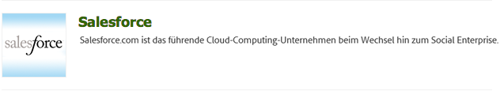

1. Erstellen Sie eine Konfiguration, z. B. **developer**.

   >[!NOTE]
   >
   >Die neue Konfiguration leitet auf eine neue Seite um: **http://localhost:4502/etc/cloudservices/salesforce/developer.html**. Dies ist genau der Wert, den Sie in der Rückruf-URL beim Erstellen der Fernzugriffsanwendung in Salesforce angeben müssen. Diese Werte müssen übereinstimmen.

1. Melden Sie sich bei Ihrem Salesforce-Konto an. (Wenn Sie noch kein Konto haben, erstellen Sie eines unter [https://developer.force.com](https://developer.salesforce.com).)
1. Navigieren Sie in Salesforce zu **Erstellen** > **Apps**, um zur Option **Verbundene Apps** zu gelangen (in den Salesforce-Vorgängerversionen war der Workflow **Bereitstellen** > **Fernzugriff**).
1. Klicken Sie auf **Neu**, um AEM mit Salesforce zu verbinden.

   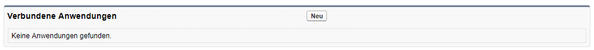

1. Geben Sie die entsprechenden Daten in die Felder **Name der verbundenen App**, **API-Name** und **E-Mail-Adresse des Kontakts** ein. Wählen Sie das Kontrollkästchen **OAuth-Einstellungen aktivieren** aus und geben Sie die **Rückruf-URL** ein. Fügen Sie dann einen OAuth-Umfang hinzu (beispielsweise vollständigen Zugriff). Die Rückruf-URL sieht in etwa folgendermaßen aus: `http://localhost:4502/etc/cloudservices/salesforce/developer.html`

   Ändern Sie den Server-Namen/die Port-Nummer und den Seitennamen, sodass sie Ihrer Konfiguration entsprechen.

   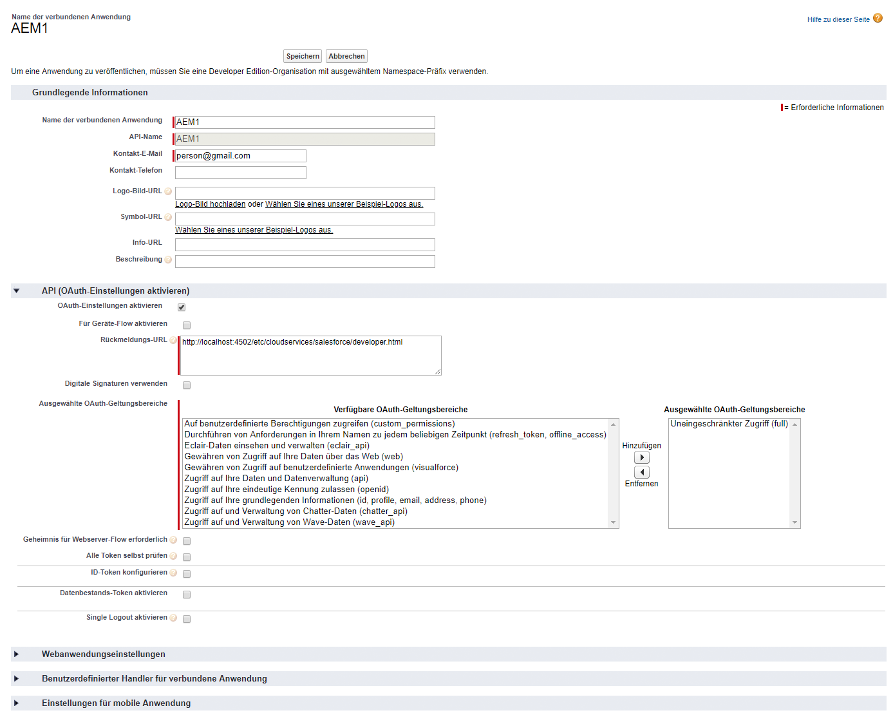

1. Klicken Sie auf **Speichern**, um die Salesforce-Konfiguration zu speichern. Salesforce erstellt einen **Kundenschlüssel** und ein **Kundengeheimnis**, die Sie für die AEM-Konfiguration benötigen.

   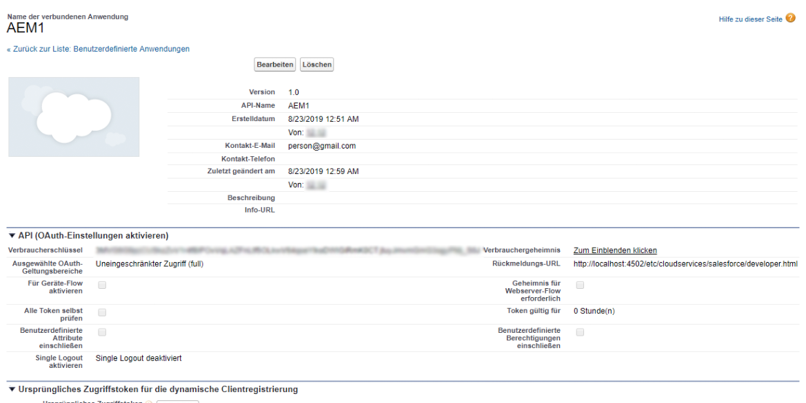

   >[!NOTE]
   >
   >Warten Sie einige (bis zu 15) Minuten, bis die Fernzugriffsanwendung in Salesforce aktiviert wird.

1. Navigieren Sie in AEM zu **Cloud-Services** und dann zu der Salesforce-Konfiguration, die Sie zuvor erstellt haben (beispielsweise **developer**). Klicken Sie auf **Bearbeiten** und geben Sie den Kundenschlüssel und das Kundengeheimnis von salesforce.com ein.

   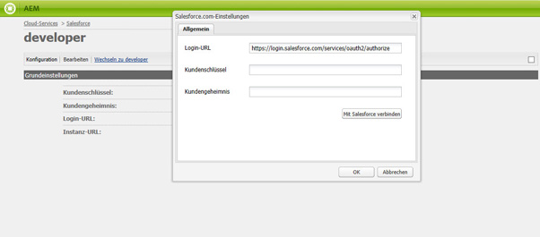

   | Login-URL | Dies ist der Salesforce-Autorisierungsendpunkt. Der Wert ist bereits ausgefüllt und kann in den meisten Fällen verwendet werden. |
   |---|---|
   | Kundenschlüssel | Geben Sie den Wert ein, den Sie von der Seite für die Registrierung bei der Fernzugriffsanwendung in salesforce.com abgerufen haben. |
   | Kundengeheimnis | Geben Sie den Wert ein, den Sie von der Seite für die Registrierung bei der Fernzugriffsanwendung in salesforce.com abgerufen haben. |

1. Klicken Sie zum Verbinden auf **Mit Salesforce verbinden**. Salesforce verlangt, dass Sie Ihrer Konfiguration erlauben, sich mit Salesforce zu verbinden.

   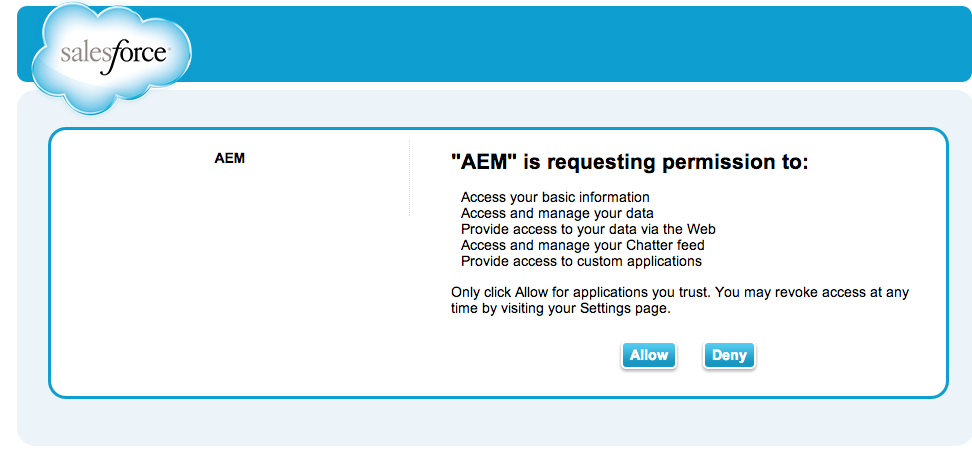

   In AEM wird ein Bestätigungsdialogfeld mit der Meldung geöffnet, dass die Verbindung hergestellt wurde.

1. Navigieren Sie zur Stammseite Ihrer Website und klicken Sie auf **Seiteneigenschaften**. Wählen Sie dann **Cloud-Services** aus und fügen Sie **Salesforce** hinzu. Wählen Sie die richtige Konfiguration aus (beispielsweise **developer**).

   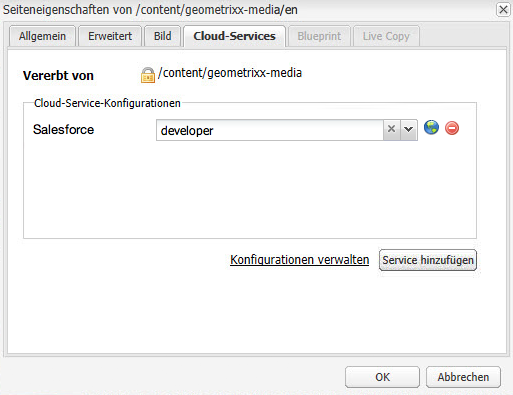

   Jetzt können Sie das Workflow-Modell verwenden, um Leads an Salesforce zu posten und Komponenten zu erstellen, welche auf die Daten aus Salesforce zugreifen.

## Exportieren von AEM-Benutzenden als Salesforce-Leads {#exporting-aem-users-as-salesforce-leads}

Wenn Sie eine AEM-Benutzerin oder einen AEM-Benutzer als Salesforce-Lead exportieren möchten, müssen Sie den Workflow so konfigurieren, dass Leads an Salesforce gepostet werden.

Exportieren von AEM-Benutzenden als Salesforce-Leads:

1. Navigieren Sie zum Salesforce-Workflow unter `http://localhost:4502/workflow`. Klicken Sie dazu mit der rechten Maustaste auf den Workflow **Salesforce.com-Export** und klicken Sie dann auf **Start**.

   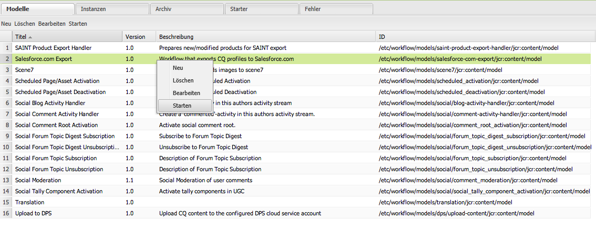

1. Wählen Sie die AEM-Benutzerin oder den AEM-Benutzer, die bzw. den Sie als Lead erstellen möchten, als **Payload** für diesen Workflow (Startseite > „Benutzer“) aus. Stellen Sie sicher, dass Sie den Profilknoten dieser Person auswählen, da er Informationen, wie **givenName** und **familyName** enthält, die den Feldern **FirstName** und **LastName** des Salesforce-Leads zugeordnet sind.

   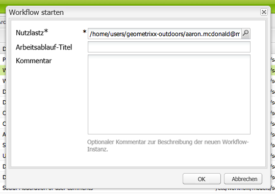

   >[!NOTE]
   >
   >Vor Beginn dieses Workflows gibt es bestimmte Pflichtfelder, die ein Lead-Knoten in AEM vor der Veröffentlichung bei Salesforce aufweisen muss. Diese sind **givenName**, **familyName**, **company** und **email**. Eine vollständige Liste der Zuordnungen zwischen AEM-Benutzenden und Salesforce-Leads finden Sie unter [Zuordnungskonfiguration zwischen AEM-Benutzer und Salesforce-Lead](#mapping-configuration-between-aem-user-and-salesforce-lead).

1. Klicken Sie auf **OK**. Die Benutzerinformationen werden nach salesforce.com exportiert.  Sie können dies unter salesforce.com überprüfen.

   >[!NOTE]
   >
   >Die Fehlerprotokolle zeigen Ihnen, ob ein Lead importiert wurde.  Überprüfen Sie das Fehlerprotokoll auf weitere Informationen.

### Konfigurieren des Workflows für den Export nach Salesforce.com {#configuring-the-salesforce-com-export-workflow}

Falls erforderlich, konfigurieren Sie den Workflow für den Export nach Salesforce.com so, dass er der korrekten Salesforce.com-Konfiguration entspricht, oder nehmen Sie andere Änderungen vor.

So konfigurieren Sie den Workflow für den Export nach Salesforce.com:

1. Navigieren Sie zu `http://localhost:4502/cf#/etc/workflow/models/salesforce-com-export.html.`

   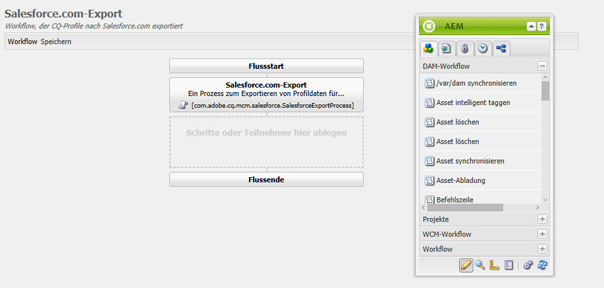

1. Öffnen Sie den Schritt „Salesforce.com-Export“ und wählen Sie die Registerkarte **Argumente** aus. Stellen Sie sicher, dass die richtige Konfiguration ausgewählt ist, und klicken Sie auf **OK**. Aktivieren Sie zudem das Kontrollkästchen, wenn Sie möchten, dass der Workflow einen Lead, der in Salesforce gelöscht wurde, neu erstellt.

   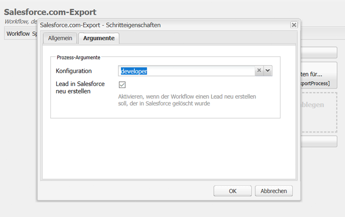

1. Klicken Sie auf **Speichern**, um Ihre Änderungen zu speichern.

   

### Zuordnungskonfiguration zwischen AEM-Benutzer und Salesforce-Lead {#mapping-configuration-between-aem-user-and-salesforce-lead}

Um die aktuelle Zuordnungskonfiguration zwischen einem AEM-Benutzer und einem Salesforce-Lead einzusehen oder zu bearbeiten, öffnen Sie den Konfigurations-Manager unter `https://<hostname>:<port>/system/console/configMgr` und suchen Sie nach **Salesforce-Lead-Zuordnungskonfiguration**.

1. Öffnen Sie den Konfigurations-Manager. Dazu klicken Sie auf **Web-Konsole** oder Sie gehen direkt zu `https://<hostname>:<port>/system/console/configMgr.`
1. Suchen Sie nach **Salesforce-Lead-Zuordnungskonfiguration**.

   

1. Ändern Sie die Zuordnungen nach Bedarf. Die Standardzuordnung folgt dem Muster **aemUserAttribute=sfLeadAttribute**. Klicken Sie auf **Speichern**, um Ihre Änderungen zu speichern.

## Konfigurieren des Salesforce-ClientContext-Speichers {#configuring-salesforce-client-context-store}

Der Salesforce-ClientContext-Speicher zeigt neben den Informationen zur derzeit angemeldeten Person, die bereits in AEM verfügbar sind, zusätzliche Informationen an. Er ruft diese zusätzlichen Informationen gemäß der Benutzerverbindung zu Salesforce aus Salesforce ab.

Konfigurieren Sie hierzu Folgendes:

1. Verknüpfen Sie eine AEM-Benutzerin oder einen AEM-Benutzer über die Salesforce Connect-Komponente mit einer Salesforce-ID.
1. Geben Sie die Salesforce-Profildaten auf der ClientContext-Seite ein, um die Eigenschaften zu konfigurieren, die Sie sehen möchten.
1. (Optional) Erstellen Sie ein Segment, welches Daten aus dem Salesforce-ClientContext-Speicher nutzt.

### Verknüpfen einer AEM-Benutzerin oder eines AEM-Benutzers mit einer Salesforce-ID {#linking-an-aem-user-with-a-salesforce-id}

Ordnen Sie eine AEM-Benutzerin oder einen AEM-Benutzer einer Salesforce-ID zu, um diese in ClientContext zu laden.  In einem praxisnahen Szenario würden Sie die Verknüpfung basierend auf den bekannten Benutzerdaten mit einer Validierung erstellen.  Zur Veranschaulichung nutzen Sie in diesem Verfahren die **Salesforce Connect**-Komponente.

1. Navigieren Sie zu einer Website in AEM, melden Sie sich an und ziehen Sie die **Salesforce Connect-Komponente** per Drag-and-Drop aus dem Sidekick.

   >[!NOTE]
   >
   >Wenn die **Salesforce Connect**-Komponente nicht verfügbar ist, wechseln Sie zur Ansicht **Design** und wählen sie aus, um sie in der Ansicht **Bearbeiten** verfügbar zu machen.

   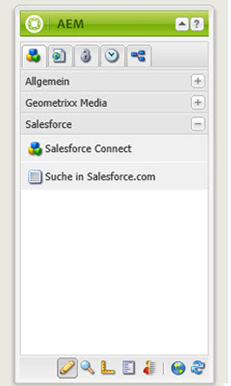

   Wenn Sie die Komponente auf die Seite ziehen, zeigt diese **Verknüpfung zu Salesforce=Aus** an.

   

   >[!NOTE]
   >
   >Diese Komponente dient nur der Veranschaulichung.  In praxisnahen Szenarien gäbe es einen weiteren Prozess zum Verknüpfen/Abgleichen von Benutzenden mit Leads.

1. Nachdem Sie die Komponente auf die Seite gezogen haben, öffnen Sie sie zum Konfigurieren.  Wählen Sie die Konfiguration, den Kontakttyp und den Salesforce-Lead oder -Kontakt. Klicken Sie dann auf **OK**.

   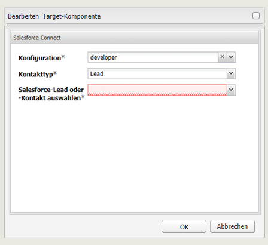

   AEM verknüpft den Benutzer mit dem Salesforce-Kontakt oder -Lead.

   

### Hinzufügen von Salesforce-Daten zu ClientContext {#adding-salesforce-data-to-client-context}

Sie können Benutzerdaten aus Salesforce in ClientContext laden, um sie für die Personalisierung zu verwenden:

1. Öffnen Sie den ClientContext, den Sie erweitern möchten, indem Sie dorthin navigieren. Beispiel: `http://localhost:4502/etc/clientcontext/default/content.html.`

   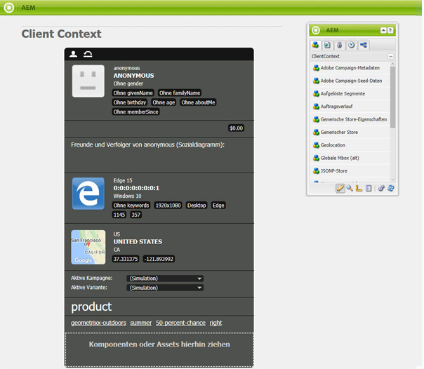

1. Ziehen Sie die **Salesforce-Profildaten**-Komponente auf den ClientContext.

   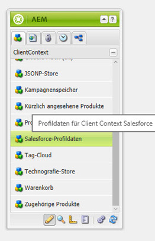

1. Öffnen Sie die Komponente, indem Sie darauf doppelklicken.  Wählen Sie **Element hinzufügen** und dann eine Eigenschaft aus der Dropdown-Liste aus. Fügen Sie beliebig viele Eigenschaften hinzu und wählen Sie **OK** aus.

   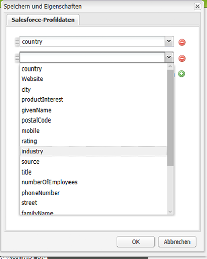

1. Jetzt können Sie die Salesforce-spezifischen Eigenschaften aus Salesforce im ClientContext sehen.

   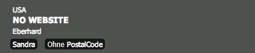

### Erstellen eines Segments mithilfe der Daten aus dem Salesforce-ClientContext-Speicher {#building-a-segment-using-data-from-salesforce-client-context-store}

Sie können ein Segment erstellen, das Daten aus dem Salesforce-ClientContext-Speicher verwendet.  Gehen Sie hierfür wie folgt vor:

1. Navigieren Sie zur Segmentierung in AEM, entweder indem Sie zu **Tools** > **Segmentierung** oder aber zu [http://localhost:4502/miscadmin#/etc/segmentation](http://localhost:4502/miscadmin#/etc/segmentation) wechseln.
1. Erstellen oder aktualisieren Sie ein Segment, um Daten aus Salesforce zu übernehmen.  Weitere Informationen erhalten Sie unter [Segmentierung](/help/sites-administering/campaign-segmentation.md).

## Suchen von Leads {#searching-leads}

Im Lieferumfang von AEM ist eine Muster-Suchkomponente enthalten, die gemäß den angegebenen Kriterien in Salesforce nach Leads sucht.  Diese Komponente zeigt Ihnen, wie Sie die Salesforce-REST-API nutzen, um nach Salesforce-Objekten zu suchen.  Um einen Aufruf an salesforce.com auszulösen, verknüpfen Sie eine Seite mit einer Salesforce-Konfiguration.

>[!NOTE]
>
>Dies ist eine Musterkomponente, die Ihnen zeigt, wie Sie die Salesforce REST API zum Abfragen von Salesforce-Objekten verwenden. Verwenden Sie sie als Beispiel, um komplexere Komponenten gemäß Ihren Anforderungen zu erstellen.

So verwenden Sie diese Komponente:

1. Navigieren Sie zu der Seite, auf der Sie diese Konfiguration verwenden möchten.  Öffnen Sie die Seiteneigenschaften und wählen Sie **Cloud-Services.** Klicken Sie auf **Services hinzufügen**. Wählen Sie dann **Salesforce** und die entsprechende Konfiguration aus und klicken Sie auf **OK**.

   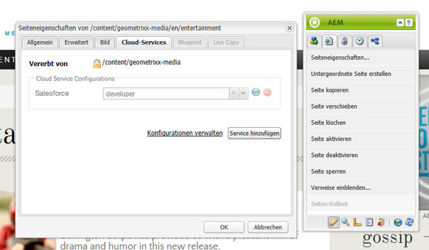

1. Ziehen Sie die Salesforce-Suchkomponente auf die Seite. (Voraussetzung ist, dass sie aktiviert wurde.  Um sie zu aktivieren, wechseln Sie zum Design-Modus und fügen Sie sie dem entsprechenden Bereich hinzu.)

   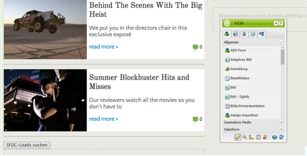

1. Öffnen Sie die Suchkomponente und legen Sie die Suchparameter fest. Klicken Sie dann auf **OK**.

   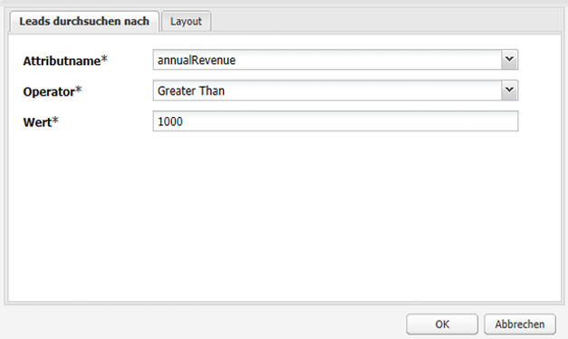

1. AEM zeigt die in Ihrer Suchkomponente aufgeführten Leads an, die den angegebenen Kriterien entsprechen.

   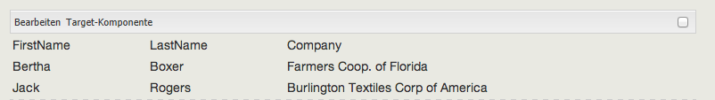
