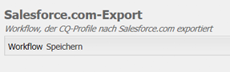

# Integration mit Salesforce {#integrating-with-salesforce}

Eine Integration von Salesforce mit AEM bietet Lead-Management-Funktionen und nutzt die von Salesforce direkt bereitgestellten, vorhandenen Funktionen. Sie können AEM so konfigurieren, dass Leads in Salesforce gepostet und Komponenten erstellt werden, welche direkt von Salesforce aus auf die Daten zugreifen.

Die bidirektionale und erweiterbare Integration zwischen AEM und Salesforce ermöglicht:

* Organisationen, Daten in vollem Umfang zu nutzen und zu aktualisieren, um so das Kundenerlebnis zu optimieren;
* die Involvierung der Marketingabteilung in Vertriebstätigkeiten;
* Organisationen, Daten automatisch an einen Salesforce-Datenspeicher zu übermitteln und von diesem zu empfangen.

Dieses Dokument beschäftigt sich mit den folgenden Themen:

* Wie Sie Salesforce-Cloud-Services konfigurieren (AEM zur Integration in Salesforce konfigurieren)
* Wie Sie Salesforce-Lead/Kontaktdaten in ClientContext und zur Personalisierung nutzen
* Wie Sie das Salesforce-Workflow-Modell zum Posten von AEM-Benutzern als Leads in Salesforce nutzen
* Wie Sie eine Komponente erstellen, die Daten aus Salesforce anzeigt

## Konfigurieren von AEM zur Integration mit Salesforce {#configuring-aem-to-integrate-with-salesforce}

Um AEM für die Integration mit Salesforce zu konfigurieren, müssen Sie zunächst eine Fernzugriffsanwendung in Salesforce konfigurieren. Konfigurieren Sie dann den Salesforce-Cloud-Service, um auf diese Fernzugriffsanwendung zu verweisen.

>[!NOTE]
>
>Sie können ein kostenloses Entwicklerkonto in Salesforce anlegen.

So konfigurieren Sie AEM für die Integration mit Salesforce:

>[!CAUTION]
>
>Sie müssen die [Salesforce Force-API](https://experience.adobe.com/#/downloads/content/software-distribution/en/aem.html?package=/content/software-distribution/en/details.html/content/dam/aem/public/adobe/packages/cq650/featurepack/com.adobe.cq.mcm.salesforce.content) Integrationspaket erstellen, bevor Sie mit dem Verfahren fortfahren. Weitere Informationen zum Arbeiten mit Paketen finden Sie unter [Arbeiten mit Paketen](/help/sites-administering/package-manager.md#package-share) Seite.

1. Navigieren Sie in AEM zu **Cloud-Services**. Klicken Sie unter „Services von Dritten“ auf **Jetzt konfigurieren** in **Salesforce**.

   

1. Erstellen Sie eine neue Konfiguration, wie beispielsweise **developer**.

   >[!NOTE]
   >
   >Die neue Konfiguration wird auf eine neue Seite umgeleitet: **http://localhost:4502/etc/cloudservices/salesforce/developer.html**. Dies ist genau der Wert, den Sie beim Erstellen der Remote-Zugriffsanwendung in Salesforce in der Callback-URL angeben müssen. Diese Werte müssen übereinstimmen.

1. Melden Sie sich bei Ihrem Salesforce-Konto an (oder erstellen Sie eines bei [https://developer.force.com](https://developer.force.com).
1. Navigieren Sie in Salesforce zu **Erstellen** > **Apps** um **Connected Apps** (in früheren Versionen von Salesforce war der Workflow **Bereitstellen** > **Remote Access**).
1. Klicken Sie auf **Neu**, um AEM mit Salesforce zu verbinden.

   

1. Geben Sie die entsprechenden Daten in die Felder **Name der verbundenen App**, **API-Name** und **E-Mail-Adresse des Kontakts** ein. Wählen Sie das Kontrollkästchen **OAuth-Einstellungen aktivieren** und geben Sie die **Rückruf-URL** ein. Fügen Sie dann einen OAuth-Umfang hinzu (beispielsweise vollständigen Zugriff). Die Callback-URL sieht in etwa so aus: `http://localhost:4502/etc/cloudservices/salesforce/developer.html`

   Ändern Sie den Servernamen/die Portnummer und die Seitennummer, sodass sie Ihrer Konfiguration entsprechen.

   

1. Klicken Sie auf **Speichern**, um die Salesforce-Konfiguration zu speichern. Salesforce erstellt einen **Verbraucherschlüssel** und ein **Kundengeheimnis**, die Sie für die AEM-Konfiguration benötigen.

   

   >[!NOTE]
   >
   >Unter Umständen müssen Sie einige Minuten (bis zu 15 Minuten) warten, bis die Fernzugriffsanwendung in Salesforce aktiviert wird.

1. Navigieren Sie in AEM zu **Cloud-Services** und dann zu der Salesforce-Konfiguration, die Sie zuvor erstellt haben (beispielsweise **developer**). Klicken Sie auf **Bearbeiten** und geben Sie den Kundenschlüssel und das Kundengeheimnis von salesforce.com ein.

   

   | Login-URL | Dies ist der Salesforce-Autorisierungsendpunkt. Der Wert ist bereits ausgefüllt und kann in den meisten Fällen verwendet werden. |
   |---|---|
   | Kundenschlüssel | Geben Sie den Wert ein, der von der Seite zur Registrierung von Remote-Zugriffsanwendungen in salesforce.com erhalten wurde. |
   | Kundengeheimnis | Geben Sie den Wert ein, der von der Seite zur Registrierung von Remote-Zugriffsanwendungen in salesforce.com erhalten wurde. |

1. Klicken Sie zum Verbinden auf **Mit Salesforce verbinden**. Salesforce verlangt, dass Sie Ihrer Konfiguration erlauben, sich mit Salesforce zu verbinden.

   

   In AEM wird ein Bestätigungsdialogfeld mit der Meldung geöffnet, dass die Verbindung hergestellt wurde.

1. Navigieren Sie zur Stammseite Ihrer Website und klicken Sie auf **Seiteneigenschaften**. Wählen Sie anschließend **Cloud Services** und hinzufügen **Salesforce** und wählen Sie die richtige Konfiguration aus (z. B. **Entwickler**).

   

   Jetzt können Sie das Workflow-Modell verwenden, um Leads an Salesforce zu posten und Komponenten zu erstellen, welche auf die Daten aus Salesforce zugreifen.

## Exportieren von AEM-Benutzern als Salesforce-Leads {#exporting-aem-users-as-salesforce-leads}

Wenn Sie einen AEM-Benutzer als Salesforce-Lead exportieren möchten, müssen Sie den Workflow so konfigurieren, dass Leads an Salesforce gepostet werden.

So exportieren Sie AEM-Benutzer als Salesforce-Leads:

1. Navigieren Sie zum Salesforce-Workflow unter `http://localhost:4502/workflow` durch Rechtsklick auf den Workflow **Salesforce.com Export** und klicken **Starten**.

   

1. Wählen Sie den AEM-Benutzer, den Sie als Lead erstellen möchten, als **Payload** für diesen Workflow (Startseite -> Benutzer). Stellen Sie sicher, dass Sie den Profilknoten des Benutzers auswählen, da er Informationen, wie **givenName**, **familyName** usw. enthält, die den Feldern **FirstName** und **LastName** des Salesforce-Leads zugeordnet sind.

   

   >[!NOTE]
   >
   >Vor Beginn dieses Workflows gibt es bestimmte Pflichtfelder, die ein Lead-Knoten in AEM vor der Veröffentlichung an Salesforce aufweisen muss. Diese **givenName**, **familyName**, **Firma** und **email**. Eine vollständige Liste der Zuordnung zwischen AEM Benutzer und Salesforce-Lead finden Sie unter [Zuordnen der Konfiguration zwischen AEM Benutzer und Slaesforce-Lead.](#mapping-configuration-between-aem-user-and-salesforce-lead)

1. Klicken Sie auf **OK**. Die Benutzerinformationen werden nach salesforce.com exportiert. Sie können dies unter salesforce.com überprüfen.

   >[!NOTE]
   >
   >Die Fehlerprotokolle zeigen Ihnen, ob ein Lead importiert wurde. Überprüfen Sie das Fehlerprotokoll auf weitere Informationen.

### Konfigurieren des Salesforce.com-Export-Workflows {#configuring-the-salesforce-com-export-workflow}

Möglicherweise müssen Sie den Salesforce.com-Export-Workflow so konfigurieren, dass er der korrekten Salesforce.com-Konfiguration entspricht, oder Sie müssen unter Umständen andere Änderungen vornehmen.

So konfigurieren SIe den Salesforce.com-Export-Workflow:

1. Navigieren Sie zu `http://localhost:4502/cf#/etc/workflow/models/salesforce-com-export.html.`

   

1. Öffnen Sie den Schritt Salesforce.com Export und wählen Sie die **Argumente** und wählen Sie die richtige Konfiguration aus und klicken Sie auf **OK**. Aktivieren Sie zudem das Kontrollkästchen, wenn Sie möchten, dass der Workflow einen Lead, der in Salesforce gelöscht wurde, neu erstellt.

   

1. Klicken Sie auf **Speichern**, um Ihre Änderungen zu speichern.

   

### Zuordnen der Konfiguration zwischen AEM-Benutzer und Salesforce Lead {#mapping-configuration-between-aem-user-and-salesforce-lead}

Um die aktuelle Zuordnungskonfiguration zwischen einem AEM Benutzer und einem Salesforce-Lead anzuzeigen oder zu bearbeiten, öffnen Sie Configuration Manager: `https://<hostname>:<port>/system/console/configMgr` und suchen Sie nach **Salesforce-Lead-Zuordnungskonfiguration**.

1. Öffnen Sie Configuration Manager durch Klicken auf **Web-Konsole** oder direkt zu `https://<hostname>:<port>/system/console/configMgr.`
1. Suchen Sie nach **Salesforce-Lead-Zuordnungskonfiguration**.

   

1. Ändern Sie die Zuordnungen nach Bedarf. Die Standardzuordnung folgt dem Muster **aemUserAttribute=sfLeadAttribute**. Klicken Sie auf **Speichern**, um Ihre Änderungen zu speichern.

## Konfigurieren des Salesforce ClientContext-Speichers {#configuring-salesforce-client-context-store}

Der Salesforce-ClientContext-Speicher zeigt neben den Informationen zum derzeit angemeldeten Benutzer, die bereits in AEM verfügbar sind, zusätzliche Informationen an. Er ruft diese zusätzlichen Informationen gemäß der Benutzerverbindung zu Salesforce aus Salesforce ab.

Dazu müssen Sie Folgendes konfigurieren:

1. Verknüpfen Sie einen AEM-Benutzer über die Salesforce Connect-Komponente mit einer Salesforce-ID.
1. Geben Sie die Salesforce-Profildaten auf der ClientContext-Seite ein, um die Eigenschaften, die Sie sehen möchten, zu konfigurieren.
1. (Optional) Erstellen Sie ein Segment, welches Daten aus dem Salesforce-ClientContext-Speicher nutzt.

### Verknüpfen eines AEM-Benutzers mit einer Salesforce-ID {#linking-an-aem-user-with-a-salesforce-id}

Sie müssen einen AEM-Benutzer einer Salesforce-ID zuordnen, um sie in ClientContext zu laden. In einem praxisnahen Szenario würden Sie die Verknüpfung basierend auf den bekannten Benutzerdaten mit einer Validierung erstellen. Zur Veranschaulichung nutzen Sie in diesem Verfahren die **Salesforce Connect**-Komponente.

1. Navigieren Sie zu einer Website in AEM, melden Sie sich an und ziehen Sie die **Salesforce Connect-Komponente** per Drag-and-Drop aus dem Sidekick.

   >[!NOTE]
   >
   >Wenn die **Salesforce Connect**-Komponente nicht verfügbar ist, wechseln Sie zur **Design**-Ansicht. Wählen Sie sie aus, um sie in der Ansicht **Bearbeiten** verfügbar zu machen.

   

   Wenn Sie die Komponente auf die Seite ziehen, zeigt diese **Verknüpfung zu Salesforce=Aus** an.

   

   >[!NOTE]
   >
   >Diese Komponente dient nur der Veranschaulichung. In praxisnahen Szenarien gäbe es einen weiteren Prozess zum Verknüpfen/Abgleichen von Benutzern mit Leads.

1. Nachdem Sie die Komponente auf die Seite gezogen haben, öffnen Sie sie zum Konfigurieren. Wählen Sie die Konfiguration, den Kontakttyp und den Salesforce-Lead oder -Kontakt. Klicken Sie auf **OK**.

   

   AEM verknüpft den Benutzer mit dem Salesforce-Kontakt oder -Lead.

   

### Hinzufügen von Salesforce-Daten zu ClientContext {#adding-salesforce-data-to-client-context}

Sie können Benutzerdaten aus Salesforce in ClientContext laden, um sie für die Personalisierung zu verwenden:

1. Öffnen Sie den Client-Kontext, den Sie erweitern möchten, indem Sie dort z. B. navigieren. `http://localhost:4502/etc/clientcontext/default/content.html.`

   

1. Ziehen Sie die Salesforce-Profildaten-Komponente auf den ClientContext.****

   

1. Doppelklicken Sie auf die Komponente, um diese zu öffnen. Wählen Sie **Element hinzufügen** und dann eine Eigenschaft aus der Dropdown-Liste aus. Fügen Sie beliebig viele Eigenschaften hinzu und wählen Sie **OK** aus.

   

1. Jetzt können Sie die Salesforce-spezifischen Eigenschaften aus Salesforce in ClientContext sehen.

   

### Erstellen eines Segments mithilfe der Daten aus dem Salesforce-ClientContext-Speicher {#building-a-segment-using-data-from-salesforce-client-context-store}

Sie können ein Segment erstellen, das Daten aus dem Salesforce-ClientContext-Speicher verwendet. Gehen Sie hierfür wie folgt vor:

1. Navigieren Sie in AEM zur Segmentierung, indem Sie entweder **Instrumente** > **Segmentierung** oder [http://localhost:4502/miscadmin#/etc/segmentation](http://localhost:4502/miscadmin#/etc/segmentation).
1. Erstellen oder aktualisieren Sie ein Segment, um Daten aus Salesforce zu übernehmen. Weitere Informationen erhalten Sie unter [Segmentierung](/help/sites-administering/campaign-segmentation.md).

## Suchen von Leads {#searching-leads}

Im Lieferumfang von AEM ist eine Muster-Suchkomponente enthalten, die gemäß den angegebenen Kriterien in Salesforce nach Leads sucht. Diese Komponente zeigt Ihnen, wie Sie die Salesforce-REST-API nutzen, um nach Salesforce-Objekten zu suchen. Sie müssen eine Seite mit einer Salesforce-Konfiguration verknüpfen, um ein Abrufen bei salesforce.com auszulösen.

>[!NOTE]
>
>Dies ist eine Beispielkomponente, die Ihnen zeigt, wie die Salesforce-REST-API zur Abfrage von Salesforce-Objekten verwendet wird. Verwenden Sie sie als Beispiel, um komplexere Komponenten gemäß Ihren Anforderungen zu erstellen.

So verwenden Sie diese Komponente:

1. Navigieren Sie zu der Seite, auf der Sie diese Konfiguration verwenden möchten. Öffnen Sie die Seiteneigenschaften und wählen Sie **Cloud-Services.** Klicken Sie auf **Services hinzufügen**. Wählen Sie dann **Salesforce** und die entsprechende Konfiguration aus und klicken Sie auf **OK**.

   

1. Ziehen Sie die Salesforce-Suchkomponente auf die Seite (sofern sie aktiviert wurde. Zum Aktivieren wechseln Sie in den Designmodus und fügen sie dem entsprechenden Bereich hinzu).

   

1. Öffnen Sie die Suchkomponente und legen Sie die Suchparameter fest. Klicken Sie dann auf **OK**.

   

1. AEM zeigt die in Ihrer Suchkomponente aufgeführten Leads an, die den angegebenen Kriterien entsprechen.

   
