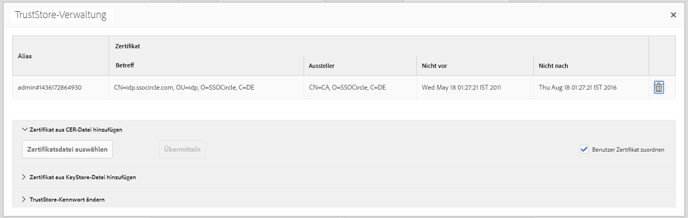
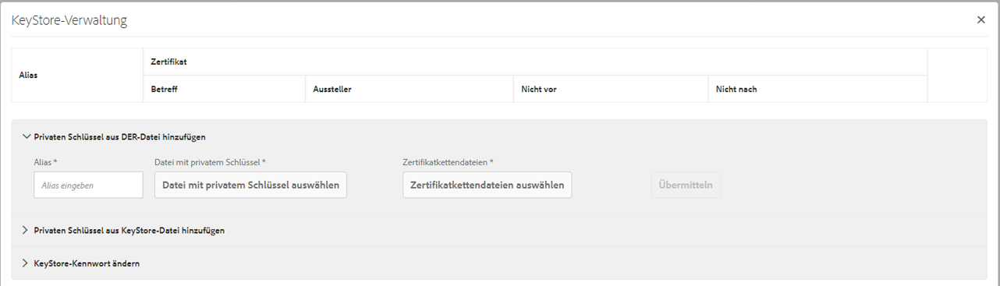

# SAML 2.0-Authentifizierungs-Handler{#saml-authentication-handler}

AEM umfasst einen [SAML](http://saml.xml.org/saml-specifications)-Authentifizierungs-Handler. Dieser Handler unterstützt das [SAML](http://saml.xml.org/saml-specifications) 2.0-Authentifizierungsanforderungsprotokoll (Web-SSO-Profil), das die `HTTP POST`-Bindung verwendet.

Folgendes wird unterstützt:

* Signierung und Verschlüsselung von Nachrichten
* Automatische Erstellung von Benutzern
* Synchronisieren von Gruppen mit vorhandenen Gruppen in AEM
* Vom Service Provider und Identity Provider initiierte Authentifizierung

Dieser Handler speichert die verschlüsselte SAML-Antwortnachricht im Benutzerknoten (`usernode/samlResponse`), um die Kommunikation mit dritten Dienstleistern zu erleichtern.

>[!NOTE]
>
>[Hier](https://helpx.adobe.com/experience-manager/kb/simple-saml-demo.html) finden Sie eine Demonstration zur Integration von AEM und SAML.
>
>Einen End-to-End-Community-Artikel finden Sie [hier](https://helpx.adobe.com/de/experience-manager/using/aem63_saml.html): Integrieren von SAML mit „Adobe Experience Manager“.

## Konfigurieren des SAML 2.0-Authentifizierungs-Handlers  {#configuring-the-saml-authentication-handler}

Die [Web-Konsole](/help/sites-deploying/configuring-osgi.md) bietet Zugriff auf die [SAML](http://saml.xml.org/saml-specifications) 2.0-Authentifizierungs-Handler-Konfiguration namens **Adobe Granite SAML 2.0 Authentication Handler**. Die folgenden Eigenschaften können festgelegt werden.

>[!NOTE]
>
>Der SAML 2.0-Authentifizierungs-Handler ist standardmäßig deaktiviert. Sie müssen mindestens eine der folgenden Eigenschaften festlegen, um den Handler zu aktivieren:
>
>* POST-URL des Identitätsanbieters
>* Entitäts-ID des Dienstleisters

>

>[!NOTE]
>
>SAML-Assertionen werden signiert und optional verschlüsselt. Damit dies funktioniert, müssen Sie zumindest das öffentliche Zertifikat des Identitätsanbieters im TrustStore angeben. Weitere Informationen finden Sie in [Hinzufügen des Identitätsanbieterzertifikats zum TrustStore](/help/sites-administering/saml-2-0-authenticationhandler.md#add-the-idp-certificate-to-the-aem-truststore).

**** PathRepository-Pfad, für den dieser Authentifizierungs-Handler von Sling verwendet werden soll. Wenn dieser leer ist, wird der Authentifizierungs-Handler deaktiviert.

**Service** RankingOSGi Framework Service Ranking -Wert, der die Reihenfolge angibt, in der dieser Dienst aufgerufen werden soll. Dies ist ein ganzzahliger Wert, wobei höhere Werte vorrangig sind.

**IDP-** ZertifikataliasDer Alias des IdP-Zertifikats im globalen TrustStore. Wenn diese Eigenschaft nicht angegeben wird, ist der Authentifizierungs-Handler deaktiviert. Im Kapitel „Identitätsanbieterzertifikat zum AEM-TrustStore hinzufügen“ weiter unten finden Sie Informationen dazu, wie Sie dies einrichten.

**Identitäts-Provider-** URL des IDP, an den die SAML-Authentifizierungsanforderung gesendet werden soll. Wenn diese Eigenschaft nicht angegeben wird, ist der Authentifizierungs-Handler deaktiviert.

>[!CAUTION]
>
>Der Hostname des Identitätsanbieters muss der OSGi-Konfiguration **Apache Sling Referrer Filter** hinzugefügt werden. Weitere Informationen finden Sie im Abschnitt [Web-Konsole](/help/sites-deploying/configuring-osgi.md).

**Entitäts-** ID des Dienstanbieters, die diesen Dienstanbieter eindeutig mit dem Identitäts-Provider identifiziert. Wenn diese Eigenschaft nicht angegeben wird, ist der Authentifizierungs-Handler deaktiviert.

**Standard-** UmleitungDer Standardspeicherort, zu dem nach erfolgreicher Authentifizierung umgeleitet wird.

>[!NOTE]
>
>Dieser Ort wird nur verwendet, wenn das Cookie `request-path` nicht festgelegt ist. Wenn Sie eine Seite unterhalb des konfigurierten Pfads ohne gültiges Anmelde-Token anfordern, wird der angeforderte Pfad in einem Cookie gespeichert
>und der Browser nach erfolgreicher Authentifizierung erneut an diesen Speicherort weitergeleitet wird.

**User-ID** AttributeDer Name des Attributs mit der Benutzer-ID, die zum Authentifizieren und Erstellen des Benutzers im CRX-Repository verwendet wird.

>[!NOTE]
>
>Die Benutzer-ID wird nicht aus dem Knoten `saml:Subject` der SAML-Assertion abgerufen, sondern aus diesem `saml:Attribute`.

**Verwenden Sie** EncryptionGibt an, ob dieser Authentifizierungs-Handler verschlüsselte SAML-Assertionen erwartet.

**CRX-** Benutzer automatisch erstellenGibt an, ob nach erfolgreicher Authentifizierung nicht vorhandene Benutzer automatisch im Repository erstellt werden sollen.

>[!CAUTION]
>
>Falls die automatische Erstellung von CRX-Benutzern deaktiviert ist, müssen die Benutzer manuell erstellt werden.

**Zu** Gruppen hinzufügenGibt an, ob ein Benutzer nach erfolgreicher Authentifizierung automatisch zu CRX-Gruppen hinzugefügt werden soll oder nicht.

**Gruppenmitgliedschaft** Der Name des saml:Attribute mit einer Liste von CRX-Gruppen, zu denen dieser Benutzer hinzugefügt werden soll.

## Identitätsanbieterzertifikat zum AEM TrustStore hinzufügen {#add-the-idp-certificate-to-the-aem-truststore}

SAML-Assertionen werden signiert und optional verschlüsselt. Damit dies funktionieren kann, müssen Sie mindestens das öffentliche Zertifikat des IdP im Repository bereitstellen. Dazu müssen Sie Folgendes tun:

1. Gehen Sie zu *http:/serveraddress:serverport/libs/granite/security/content/truststore.html*
1. Drücken Sie den Link **[!UICONTROL Create TrustStore]**
1. Geben Sie das Kennwort für den TrustStore ein und klicken Sie auf **[!UICONTROL Speichern]**.
1. Klicken Sie auf **[!UICONTROL TrustStore verwalten]**.
1. Laden Sie das IdP-Zertifikat hoch.
1. Beachten Sie das Zertifikatalias. Im Folgenden Beispiel lautet das Alias **[!UICONTROL admin#1436172864930]**.

   

## Den Dienstleisterschlüssel- und -zertifikatkette dem AEM-Schlüsselspeicher hinzufügen {#add-the-service-provider-key-and-certificate-chain-to-the-aem-keystore}

>[!NOTE]
>
>Die folgenden Schritte sind obligatorisch. Andernfalls wird die folgende Ausnahme ausgelöst: `com.adobe.granite.keystore.KeyStoreNotInitialisedException: Uninitialised system trust store`

1. Gehen Sie zu: [http://localhost:4502/libs/granite/security/content/useradmin.html](http://localhost:4502/libs/granite/security/content/useradmin.html)
1. Bearbeiten Sie den Benutzer `authentication-service`.
1. Erstellen Sie einen KeyStore, indem Sie unter **Kontoeinstellungen** auf **KeyStore erstellen** klicken.

>[!NOTE]
>
>Die folgenden Schritte sind nur erforderlich, wenn der Handler Nachrichten signieren oder entschlüsseln kann.

1. Laden Sie die Datei mit dem privaten Schlüssel hoch, indem Sie auf **Datei mit privatem Schlüssel auswählen** klicken. Der Schlüssel muss im PKCS#8-Format mit DER-Kodierung vorliegen.
1. Laden Sie durch Klicken auf **Zertifikatkettendateien auswählen** die Zertifikatdatei hoch.
1. Weisen Sie ein Alias zu, wie im Folgenden gezeigt:

   

## Logger für SAML konfigurieren {#configure-a-logger-for-saml}

Sie können einen Logger einrichten, um alle Probleme zu debuggen, die aufgrund der falschen Konfiguration von SAML entstehen können. Gehen Sie dazu wie folgt vor:

1. Wechseln Sie zur Web-Konsole unter *http://localhost:4502/system/console/configMgr*
1. Suchen Sie nach dem Eintrag **Apache Sling Logging Logger Configuration** und klicken Sie darauf.
1. Erstellen Sie einen Logger mit folgender Konfiguration:

   * **Protokollebene:** Debug
   * **Protokolldatei:** logs/saml.log
   * **Logger:** com.adobe.granite.auth.saml
