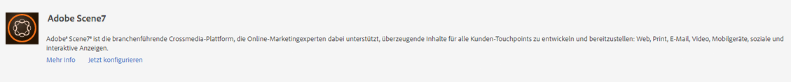
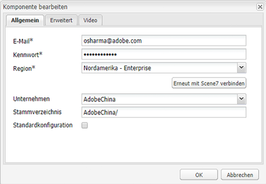
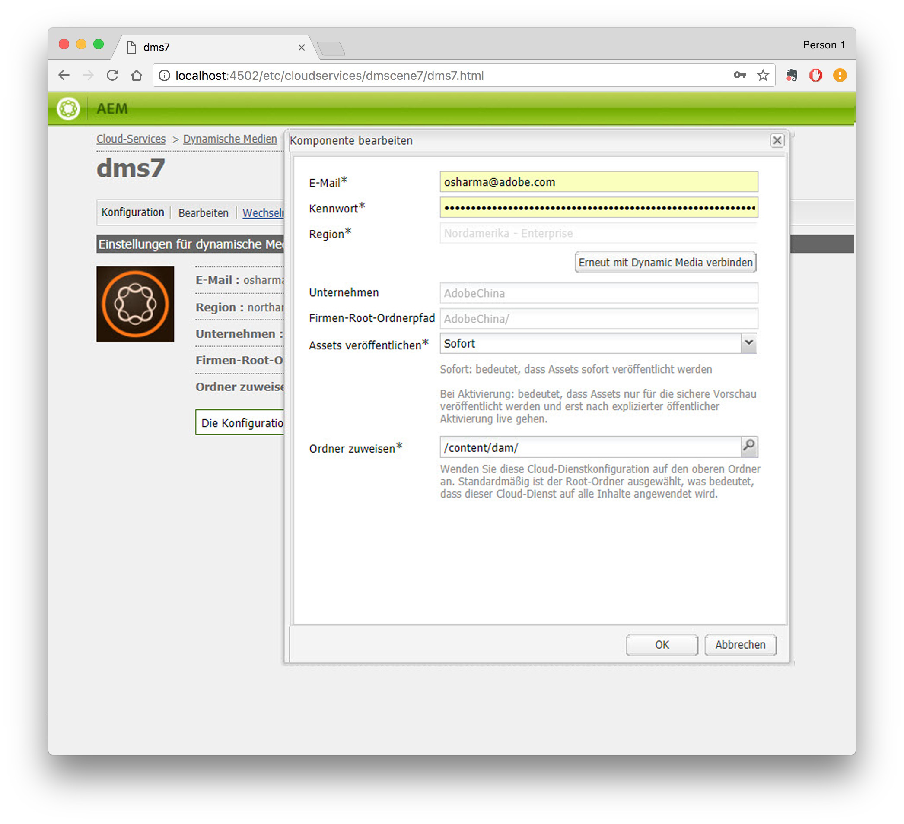
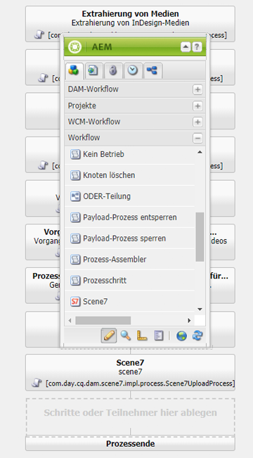
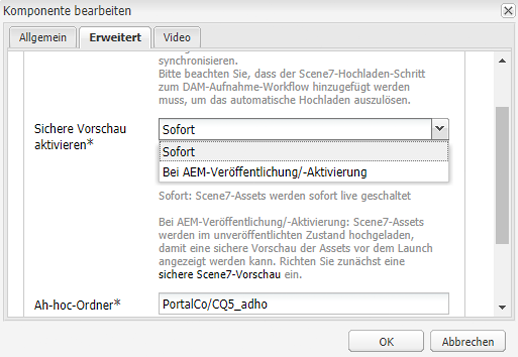
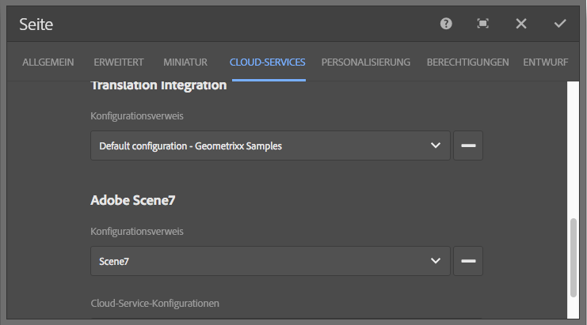
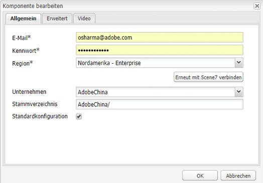
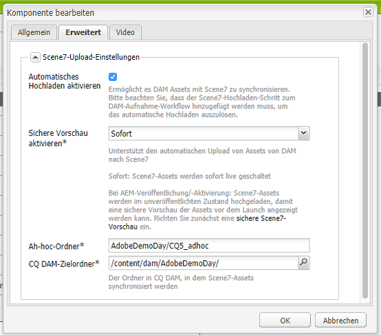

# Integrieren in Dynamic Media Classic {#integrating-with-dynamic-media-classic-scene}

Adobe Dynamic Media Classic ist eine gehostete Lösung für die Verwaltung, Erweiterung, Veröffentlichung und Bereitstellung von Rich-Media-Assets für Web-, Mobile-, E-Mail- und Internet-verbundene Anzeigen und Drucken.

Um Dynamic Media Classic zu verwenden, müssen Sie die Cloud-Konfiguration so konfigurieren, dass Dynamic Media Classic und Adobe Experience Manager Assets miteinander interagieren können. In diesem Dokument wird die Konfiguration von Experience Manager und Dynamic Media Classic beschrieben.

Informationen zur Verwendung aller Dynamic Media Classic-Komponenten auf einer Seite und zum Arbeiten mit Videos finden Sie unter [Verwenden von Dynamic Media Classic](../assets/scene7.md).

>[!NOTE]
>
>* Die DHTML-Viewer-Plattform von Dynamic Media Classic wurde am 31. Januar 2014 offiziell eingestellt. Weitere Informationen finden Sie in den häufig gestellten Fragen zum Ende der Lebensdauer für den DHTML-Viewer [DHTML .](../sites-administering/dhtml-viewer-endoflifefaqs.md)
>* Bevor Sie Dynamic Media Classic für die Verwendung mit Experience Manager konfigurieren, lesen Sie [Best Practices](#best-practices-for-integrating-scene-with-aem) für die Integration von Dynamic Media Classic mit Experience Manager.
>* Wenn Sie Dynamic Media Classic mit einer benutzerdefinierten Proxy-Konfiguration verwenden, müssen Sie beide HTTP-Client-Proxy-Konfigurationen konfigurieren, da einige Funktionen von Experience Manager die 3.x-APIs verwenden und andere die 4.x-APIs. 3.x wird mit [http://localhost:4502/system/console/configMgr/com.day.commons.httpclient](http://localhost:4502/system/console/configMgr/com.day.commons.httpclient) konfiguriert und 4.x wird mit [http://localhost:4502/system/console/configMgr/org.apache.http.proxyconfigurator](http://localhost:4502/system/console/configMgr/org.apache.http.proxyconfigurator) konfiguriert.

>

## Experience Manager/Dynamic Media Classic-Integration versus Dynamic Media {#aem-scene-integration-versus-dynamic-media}

Experience Manager haben die Wahl zwischen zwei Lösungen für die Arbeit mit Dynamic Media. Sie können eine der folgenden Optionen verwenden:

* Integrieren Sie Ihre Experience Manager-Instanz in Dynamic Media Classic.
* Verwenden Sie Dynamic Media, das in Experience Manager integriert ist.

Verwenden Sie die folgenden Kriterien, um zu bestimmen, welche Lösung ausgewählt werden soll:

* Wenn Sie Dynamic Media Classic-Bestandskunde sind, deren Rich-Media-Assets zur Veröffentlichung und Bereitstellung in Dynamic Media Classic gespeichert sind, Sie diese Assets jedoch in das Authoring von Sites (WCM) und/oder Experience Manager-Assets zur Verwaltung integrieren möchten, verwenden Sie die in diesem Dokument beschriebene [Experience Manager/Dynamic Media Classic-Punkt-zu-Punkt-Integration](#aem-scene-point-to-point-integration).****

* Wenn Sie ein **neuer** Experience Manager sind, der Rich-Media-Bereitstellungsanforderungen hat, wählen Sie die Option [Dynamic Media](#aem-dynamic-media). Diese Option ist am sinnvollsten, wenn Sie über kein vorhandenes S7-Konto verfügen und wenn Sie nicht über viele im System gespeicherte Assets verfügen.

* Verwenden Sie in bestimmten Fällen beide Lösungen. Das [Dual-Use-Szenario](/help/sites-administering/scene7.md#dual-use-scenario) beschreibt dieses Szenario.

### Experience Manager/Dynamic Media Classic Punkt-zu-Punkt-Integration {#aem-scene-point-to-point-integration}

Wenn Sie in dieser Lösung mit Assets arbeiten, nutzen Sie eine der folgenden Vorgehensweisen:

* Hochladen von Assets direkt in Dynamic Media Classic und anschließender Zugriff über den Inhaltsbrowser **Dynamic Media Classic** für die Seitenbearbeitung oder
* Laden Sie in Experience Manager Assets hoch und aktivieren Sie dann die automatische Veröffentlichung in Dynamic Media Classic. Zugriff über den Inhaltsbrowser **Assets** für die Seitenbearbeitung

Die Komponenten, die Sie für diese Integration verwenden, befinden sich im Komponentenbereich **Dynamic Media Classic** im [Designmodus](/help/sites-authoring/author-environment-tools.md#page-modes).

### Experience Manager Dynamic Media {#aem-dynamic-media}

Experience Manager Dynamic Media ist die Vereinigung von Dynamic Media Classic-Funktionen direkt innerhalb der Experience Manager-Plattform.

Wenn Sie innerhalb dieser Lösung mit Assets arbeiten, befolgen Sie diesen Workflow:

1. Laden Sie einzelne Bild- und Video-Assets direkt auf den Experience Manager hoch.
1. Kodieren Sie Videos direkt in Experience Manager.
1. Erstellen Sie bildbasierte Sets direkt in Experience Manager.
1. Fügen Sie Bildern und Videos bei Bedarf interaktive Elemente hinzu.

Die von Ihnen für Dynamic Media verwendeten Komponenten befinden sich im Komponentenbereich **[!UICONTROL Dynamic Media]** im [Designmodus](/help/sites-authoring/author-environment-tools.md#page-modes). Sie umfassen Folgendes:

* **[!UICONTROL Dynamic Media]** – Die Komponente **[!UICONTROL Dynamic Media]** ist intelligent. In Abhängigkeit davon, ob Sie ein Bild oder Video hinzufügen, haben Sie verschiedene Optionen. Die Komponente unterstützt Bildvorgaben, bildbasierte Viewer wie Bildsets sowie Rotationssets, Sets für gemischte Medien und Videos. Darüber hinaus ist der Viewer responsiv - die Größe des Bildschirms ändert sich automatisch basierend auf der Bildschirmgröße. Bei allen Viewern handelt es sich um HTML5-Viewer.

* **[!UICONTROL Interaktive Medien]**  - Die  **[!UICONTROL interaktive]** Medienkomponente eignet sich für Assets wie Karussellbanner, interaktive Bilder und interaktive Videos. Solche Assets weisen Interaktivität auf, z. B. Hotspots oder Imagemaps. Diese Komponente ist intelligent. Je nachdem, ob Sie ein Bild oder Video hinzufügen, haben Sie verschiedene Optionen. Darüber hinaus ist der Viewer responsiv - die Größe des Bildschirms ändert sich automatisch basierend auf der Bildschirmgröße. Bei allen Viewern handelt es sich um HTML5-Viewer.

### Szenario einer Doppelnutzung {#dual-use-scenario}

Standardmäßig können Sie die Dynamic Media- und Dynamic Media Classic-Integrationsfunktionen von Experience Manager gleichzeitig verwenden. In der folgenden Tabelle mit Anwendungsfällen wird beschrieben, wann Sie bestimmte Bereiche ein- und ausschalten.

So verwenden Sie Dynamic Media und Dynamic Media Classic gleichzeitig:

1. Konfigurieren Sie [Dynamic Media Classic](#creating-a-cloud-configuration-for-scene) in Cloud Services.
1. Befolgen Sie die Anleitungen, die auf Ihr jeweiliges Nutzungsszenario zutreffen:

   <table>
    <tbody>
    <tr>
    <td> </td>
    <td> </td>
    <td><strong>Dynamic Media</strong></td>
    <td> </td>
    <td><strong>Dynamic Media Classic-Integration</strong></td>
    <td> </td>
    </tr>
    <tr>
    <td><strong>Wenn Sie ...</strong></td>
    <td><strong>Anwendungsfall-Workflow</strong></td>
    <td><strong>Bildbearbeitung/Video</strong></td>
    <td><strong>Komponente „Dynamische Medien“</strong></td>
    <td><strong>S7-Inhaltsbrowser und -komponenten</strong></td>
    <td><strong>Automatisches Hochladen von Assets auf S7</strong></td>
    </tr>
    <tr>
    <td>Neu bei Sites und Dynamic Media</td>
    <td>Hochladen von Assets in Experience Manager und Verwenden der Experience Manager Dynamic Media-Komponente zum Erstellen von Assets auf Siteseiten</td>
    <td>
Ein
 
(Siehe Schritt 3)
 </td>
    <td><a href="/help/assets/adding-dynamic-media-assets-to-pages.md">Ein</a></td>
    <td>Off</td>
    <td>Aus</td>
    </tr>
    <tr>
    <td>Im Einzelhandel und neu bei Sites und Dynamic Media</td>
    <td>Laden Sie nicht produktbezogene Assets zur Verwaltung und Bereitstellung in Experience Manager hoch. Laden Sie PRODUKT-Assets in Dynamic Media Classic hoch und verwenden Sie den Dynamic Media Classic-Inhaltsbrowser in Experience Manager und in der Komponente, um Produktdetailseiten auf Sites zu erstellen.</td>
    <td>
Ein
 
(Siehe Schritt 3)
 </td>
    <td><a href="/help/assets/adding-dynamic-media-assets-to-pages.md">Ein</a></td>
    <td><a href="/help/assets/scene7.md#scene-content-browser">Ein</a></td>
    <td>Aus</td>
    </tr>
    <tr>
    <td>Neu bei Assets und Dynamic Media</td>
    <td>Hochladen von Assets in Experience Manager Assets und Verwenden des veröffentlichten URL-/Einbettungscodes aus Dynamic Media</td>
    <td>
Ein
 
(Siehe Schritt 3)
 </td>
    <td>Aus</td>
    <td>Aus</td>
    <td>Aus</td>
    </tr>
    <tr>
    <td>Neu bei Dynamic Media und Vorlagen</td>
    <td>Verwenden Sie Dynamic Media für Bildbearbeitung und Videos. Erstellen Sie Bildvorlagen in Dynamic Media Classic und verwenden Sie Dynamic Media Classic Content Finder, um Vorlagen in Sites-Seiten einzuschließen.</td>
    <td>
Ein
 
(Siehe Schritt 3)
 </td>
    <td><a href="/help/assets/adding-dynamic-media-assets-to-pages.md">Ein</a></td>
    <td><a href="/help/assets/scene7.md#scene-content-browser">Ein</a></td>
    <td>Aus</td>
    </tr>
    <tr>
    <td>Ein bestehender Dynamic Media Classic-Kunde und neu bei Sites</td>
    <td>Hochladen von Assets in Dynamic Media Classic und Verwenden des Experience Manager Dynamic Media Classic-Inhaltsbrowsers, um Assets auf Siteseiten zu suchen und zu erstellen</td>
    <td>Aus</td>
    <td>Aus</td>
    <td><a href="/help/assets/scene7.md#scene-content-browser">Ein</a></td>
    <td>Aus</td>
    </tr>
    <tr>
    <td>Ein bestehender Dynamic Media Classic-Kunde und neu bei Sites und Assets</td>
    <td>Hochladen von Assets in DAM und automatische Veröffentlichung in Dynamic Media Classic zur Bereitstellung. Verwenden Sie den Experience Manager Dynamic Media Classic-Inhaltsbrowser, um Assets auf Sites-Seiten zu suchen und zu erstellen.</td>
    <td>Aus</td>
    <td>Aus</td>
    <td><a href="/help/assets/scene7.md#scene-content-browser">Ein</a></td>
    <td>
<a href="#configuringautouploadingfromaemassets">Ein</a>
 
(Siehe Schritt 4)
 </td>
    </tr>
    <tr>
    <td>Bestehender Dynamic Media Classic-Kunde und neu bei Assets</td>
    <td>
Laden Sie Assets in Experience Manager hoch und verwenden Sie Dynamic Media, um Ausgabedarstellungen für den Download/die Freigabe zu generieren. Veröffentlichen Sie Experience Manager-Assets automatisch in Dynamic Media Classic zur Bereitstellung.
 
<strong>Wichtig:</strong> Die doppelte Verarbeitung und die in Experience Manager generierten Ausgabedarstellungen werden nicht mit Dynamic Media Classic synchronisiert.
 </td>
    <td>
Ein
 
(Siehe Schritt 3)
 </td>
    <td>Aus</td>
    <td>Aus</td>
    <td>
<a href="#configuringautouploadingfromaemassets">Ein</a>
 
(Siehe Schritt 4)
 </td>
    </tr>
    </tbody>
    </table>

1. (Optional) (siehe Tabelle mit Anwendungsfällen) - Einrichten der [Dynamic Media-Cloud-Konfiguration](/help/assets/config-dynamic.md) und [Aktivieren des Dynamic Media-Servers](/help/assets/config-dynamic.md).
1. (Optional) (siehe Tabelle mit Anwendungsfällen) - Wenn Sie die Option Automatisches Hochladen von Assets in Dynamic Media Classic aktivieren, müssen Sie Folgendes hinzufügen:

   1. Richten Sie den automatischen Upload auf Dynamic Media Classic ein.
   1. Fügen Sie den Schritt **Dynamic Media Classic Upload** hinzu, nachdem alle Dynamic Media-Workflow-Schritte *am Ende von* **DAM-Update-Asset** ausgeführt wurden ( `https://<server>:<host>/cf#/etc/workflow/models/dam/update_asset.html)`
   1. (Optional) Schränken Sie den Dynamic Media Classic-Asset-Upload nach MIME-Typ in [https://&lt;server>:&lt;port>/system/console/configMgr/com.day.cq.dam.scene7.impl.Scene7AssetMimeTypeServiceImpl](http://localhost:4502/system/console/configMgr/com.day.cq.dam.scene7.impl.Scene7AssetMimeTypeServiceImpl) ein. Asset-MIME-Typen, die nicht in dieser Liste enthalten sind, werden nicht auf den Dynamic Media Classic-Server hochgeladen.
   1. (Optional) Richten Sie Videos in der Dynamic Media Classic-Konfiguration ein. Sie können die Videokodierung für Dynamic Media oder sowohl als auch für Dynamic Media Classic gleichzeitig aktivieren. Dynamische Ausgabeformate werden für die Vorschau und Wiedergabe lokal in der Experience Manager-Instanz verwendet, während Dynamic Media Classic-Videoausgabeformate auf Dynamic Media Classic-Servern generiert und gespeichert werden. Wenden Sie beim Einrichten von Videokodierungsdiensten für Dynamic Media und Dynamic Media Classic ein [Videoverarbeitungsprofil](/help/assets/video-profiles.md) auf den Asset-Ordner von Dynamic Media Classic an.
   1. (Optional) [Sichere Vorschau in Dynamic Media Classic konfigurieren](/help/sites-administering/scene7.md#configuring-the-state-published-unpublished-of-assets-pushed-to-scene).

#### Beschränkungen {#limitations}

Wenn sowohl Dynamic Media Classic als auch Dynamic Media aktiviert sind, gelten folgende Einschränkungen:

* Das manuelle Hochladen in Dynamic Media Classic durch Auswählen eines Assets und Ziehen dieses Assets in eine Dynamic Media Classic-Komponente auf einer Experience Manager-Seite funktioniert nicht.
* Obwohl mit Experience Manager und Dynamic Media Classic synchronisierte Assets automatisch auf Dynamic Media Classic aktualisiert werden, wenn das Asset in Assets bearbeitet wird, wird ein neuer Upload nicht durch eine Rollback-Aktion Trigger. Daher erhält Dynamic Media Classic nicht die neueste Version unmittelbar nach einem Rollback. Die Lösung besteht darin, nach Abschluss des Rollbacks erneut zu bearbeiten.
* Wenn Sie Dynamic Media für einen Anwendungsfall und die Dynamic Media Classic-Integration für einen anderen verwenden müssen, damit Dynamic Media-Assets nicht mit dem Dynamic Media Classic-System interagieren, wenden Sie die Dynamic Media Classic-Konfiguration nicht auf den Ordner Dynamic Media an. Wenden Sie die Dynamic Media-Konfiguration (Verarbeitungsprofil) nicht auf einen Ordner von Dynamic Media Classic an.

## Best Practices für die Integration von Dynamic Media Classic mit Experience Manager {#best-practices-for-integrating-scene-with-aem}

Bei der Integration von Dynamic Media Classic mit Experience Manager gibt es einige wichtige Best Practices, die in den folgenden Bereichen beachtet werden müssen:

* Testen Ihrer Integration
* Hochladen von Assets direkt aus Dynamic Media Classic, empfohlen für bestimmte Szenarien

Siehe [Bekannte Einschränkungen](#known-limitations-and-design-implications).

### Testen Ihrer Integration {#test-driving-your-integration}

Adobe empfiehlt, Ihre Integration zu testen, indem Sie Ihren Stammordner nur auf einen Unterordner und nicht auf ein ganzes Unternehmen verweisen.

>[!CAUTION]
>
>Das Importieren von Assets aus einem bestehenden Dynamic Media Classic-Unternehmenskonto kann lange dauern, bis sie in Experience Manager angezeigt werden. Stellen Sie sicher, dass Sie einen Ordner in Dynamic Media Classic angeben, der nicht über zu viele Assets verfügt (z. B. hat der Stammordner häufig zu viele Assets und kann Ihr System zum Absturz bringen).

### Hochladen von Assets aus Experience Manager Assets im Vergleich zu Dynamic Media Classic {#uploading-assets-from-aem-assets-versus-from-scene}

Sie können Assets entweder mit der Funktion Assets (Digital Asset Management) oder direkt über den Dynamic Media Classic-Inhaltsbrowser in Experience Manager hochladen. Was davon Sie verwenden, hängt von den folgenden Faktoren ab:

* Dynamic Media Classic-Asset-Typen, die Experience Manager Assets noch nicht unterstützt, müssen direkt über den Dynamic Media Classic-Inhaltsbrowser auf einer Experience Manager-Website von Dynamic Media Classic hinzugefügt werden. Beispielsweise Bildvorlagen.
* Bei Asset-Typen, die sowohl von Experience Manager Assets als auch von Dynamic Media Classic unterstützt werden, hängt die Entscheidung, wie sie hochgeladen werden, von Folgendem ab:

   * Wo sich die Assets heute befinden UND
   * Wie wichtig ihre Verwaltung in einem gemeinsamen Repository ist

Wenn sich die Assets bereits in Dynamic Media Classic befinden und sie in einem gemeinsamen Repository verwaltet werden, ist es nicht wichtig, sie in Experience Manager Assets zu exportieren, um sie nur zur Bereitstellung wieder mit Dynamic Media Classic zu synchronisieren. Dies ist ein unnötiger Umweg. Andernfalls wird empfohlen, Assets in einem einzigen Repository zu speichern und nur für die Bereitstellung mit Dynamic Media Classic zu synchronisieren.

## Konfigurieren der Dynamic Media Classic-Integration {#configuring-scene-integration}

Sie können Experience Manager so konfigurieren, dass Assets in Dynamic Media Classic hochgeladen werden. Assets aus einem CQ-Zielordner können (automatisch oder manuell) von Experience Manager in ein Dynamic Media Classic-Unternehmenskonto hochgeladen werden.

>[!NOTE]
>
>Adobe empfiehlt, nur den dafür vorgesehenen Zielordner für den Import von Dynamic Media Classic-Assets zu verwenden. Digitale Assets, die sich außerhalb des Zielordners befinden, können nur in Dynamic Media Classic-Komponenten auf Seiten verwendet werden, auf denen die Dynamic Media Classic-Konfiguration aktiviert wurde. Darüber hinaus werden sie in einem Ad-hoc-Ordner in Dynamic Media Classic abgelegt. Der Ad-hoc-Ordner wird nicht mit Experience Manager synchronisiert (Assets können jedoch im Inhaltsbrowser von Dynamic Media Classic gefunden werden).

Um Dynamic Media Classic für die Integration mit Experience Manager zu konfigurieren, müssen Sie die folgenden Schritte ausführen:

1. [Definieren einer Cloud-Konfiguration](#creating-a-cloud-configuration-for-scene)  - Definiert die Zuordnung zwischen einem Dynamic Media Classic-Ordner und einem Assets-Ordner. Führen Sie diesen Schritt auch dann aus, wenn Sie nur eine unidirektionale Synchronisierung (Experience Manager Assets zu Dynamic Media Classic) wünschen.
1. [Aktivieren Sie den  **Adobe CQ s7dam DAM Listener**](#enabling-the-adobe-cq-scene-dam-listener)  - Fertig in der   OSGiconsole.
1. Wenn Sie möchten, dass Experience Manager Assets automatisch in Dynamic Media Classic hochgeladen wird, müssen Sie diese Option aktivieren und Dynamic Media Classic zum Workflow [!UICONTROL DAM Update Asset] hinzufügen. Außerdem können Sie manuell Assets hochladen.
1. Hinzufügen von Dynamic Media Classic-Komponenten zum Sidekick. Mit dieser Funktion können Benutzer Dynamic Media Classic-Komponenten auf ihren Experience Manager-Seiten verwenden.
1. [Ordnen Sie die Konfiguration der Seite im Experience Manager](#enabling-scene-for-wcm)  zu: Dieser Schritt ist erforderlich, um alle Videovorgaben anzuzeigen, die Sie in Dynamic Media Classic erstellt haben. Sie ist auch erforderlich, wenn Sie ein Asset außerhalb des CQ-Zielordners in Dynamic Media Classic veröffentlichen müssen.

In diesem Abschnitt wird die Durchführung all dieser Schritte behandelt und es werden wichtige Beschränkungen aufgeführt.

### Funktionsweise der Synchronisierung zwischen Dynamic Media Classic und Experience Manager Assets {#how-synchronization-between-scene-and-aem-assets-works}

Beim Einrichten der Synchronisierung von Experience Manager Assets und Dynamic Media Classic ist Folgendes wichtig:

#### Hochladen von Experience Manager Assets in Dynamic Media Classic {#uploading-to-scene-from-aem-assets}

* Es gibt einen bestimmten Synchronisierungsordner in Experience Manager für Dynamic Media Classic-Uploads.
* Uploads in Dynamic Media Classic können automatisiert werden, wenn die digitalen Assets im dafür vorgesehenen Synchronisierungsordner abgelegt werden.
* Die Ordner- und Unterordnerstruktur in Experience Manager wird in Dynamic Media Classic repliziert.

>[!NOTE]
>
>Experience Manager bettet alle Metadaten wie XMP ein, bevor sie in Dynamic Media Classic hochgeladen werden, sodass alle Eigenschaften auf dem Metadatenknoten in Dynamic Media Classic als XMP verfügbar sind.

#### Bekannte Beschränkungen und Designimplikationen {#known-limitations-and-design-implications}

Bei der Synchronisierung zwischen Experience Manager Assets und Dynamic Media Classic gibt es derzeit die folgenden Einschränkungen/Designauswirkungen:

<table>
 <tbody>
  <tr>
   <td><strong>Auswirkungen von Einschränkungen/Designs</strong></td>
   <td><strong>Beschreibung</strong></td>
  </tr>
  <tr>
   <td>Ein bestimmter Synchronisierungsordner (Ziel)</td>
   <td>Für Dynamic Media Classic-Uploads ist nur ein bestimmter Ordner pro Unternehmen im Experience Manager verfügbar. Sie können mehrere Konfigurationen erstellen, wenn Sie Zugriff auf mehr als ein Unternehmenskonto in Dynamic Media Classic haben müssen.</td>
  </tr>
  <tr>
   <td>Ordnerstruktur</td>
   <td>Wenn Sie einen synchronisierten Ordner mit Assets löschen, werden alle Remote-Assets von Dynamic Media Classic gelöscht, der Ordner bleibt jedoch erhalten.</td>
  </tr>
  <tr>
   <td>Ad-hoc-Ordner</td>
   <td>Assets, die sich außerhalb des Zielordners befinden und manuell in WCM in Dynamic Media Classic hochgeladen werden, werden automatisch in einem separaten Ad-hoc-Ordner in Dynamic Media Classic abgelegt. Sie konfigurieren diesen Ordner in der Cloud-Konfiguration in Experience Manager.</td>
  </tr>
  <tr>
   <td>Gemischte Medien</td>
   <td>Gemischte Mediensets werden in Experience Manager angezeigt, obwohl sie in Experience Manager nicht unterstützt werden.</td>
  </tr>
  <tr>
   <td>PDFs </td>
   <td>Generierte PDFs aus E-Katalogen in Dynamic Media Classic werden in den CQ-Zielordner importiert.</td>
  </tr>
  <tr>
   <td>Aktualisierung der Benutzeroberfläche</td>
   <td>Stellen Sie bei der Synchronisation zwischen Experience Manager und Dynamic Media Classic sicher, dass Sie die Benutzeroberfläche aktualisieren, um Änderungen anzuzeigen. </td>
  </tr>
  <tr>
   <td>Videominiaturen</td>
   <td>Beim Hochladen eines Videos in Experience Manager Assets zur Kodierung über Dynamic Media Classic kann es je nach Videoverarbeitungszeit einige Zeit dauern, bis die Videominiaturen und kodierten Videos in Experience Manager Assets verfügbar sind.</td>
  </tr>
  <tr>
   <td>Zielunterordner</td>
   <td>
Wenn Sie Unterordner im Zielordner verwenden, stellen Sie sicher, dass Sie entweder eindeutige Namen für jedes Asset verwenden (unabhängig vom Speicherort) oder Dynamic Media Classic (im Bereich "Einrichtung") so konfigurieren, dass Assets unabhängig vom Speicherort nicht überschrieben werden.
 
Andernfalls werden Assets mit demselben Namen, die in einen Dynamic Media Classic-Zielunterordner hochgeladen werden, hochgeladen, das Asset mit demselben Namen im Zielordner wird jedoch gelöscht. 
 </td>
  </tr>
 </tbody>
</table>

### Konfigurieren von Dynamic Media Classic-Servern {#configuring-scene-servers}

Wenn Sie Experience Manager hinter einem Proxy ausführen oder besondere Firewall-Einstellungen haben, müssen Sie die Hosts der verschiedenen Regionen explizit aktivieren. Server werden in `/etc/cloudservices/scene7/endpoints` in Inhalten verwaltet und können nach Bedarf angepasst werden. Tippen Sie auf eine URL und bearbeiten Sie sie, um sie bei Bedarf zu ändern. In früheren Versionen von Experience Manager waren diese Werte hartcodiert.

Wenn Sie zu `/etc/cloudservices/scene7/endpoints.html` navigieren, werden die Server aufgelistet (und können sie durch Tippen auf die URL bearbeiten):

### Erstellen einer Cloud-Konfiguration für Dynamic Media Classic {#creating-a-cloud-configuration-for-scene}

Eine Cloud-Konfiguration definiert die Zuordnung zwischen einem Ordner von Dynamic Media Classic und einem Ordner von Experience Manager Assets . Sie muss für die Synchronisierung von Experience Manager-Assets mit Dynamic Media Classic konfiguriert werden. Unter Funktionsweise der Synchronisierung finden Sie weitere Informationen.

>[!CAUTION]
>
>Das Importieren von Assets aus einem bestehenden Dynamic Media Classic-Unternehmenskonto kann lange dauern, bis sie in Experience Manager angezeigt werden. Stellen Sie sicher, dass Sie einen Ordner in Dynamic Media Classic angeben, der nicht über zu viele Assets verfügt. Beispielsweise enthält der Stammordner häufig zu viele Assets.
>
>Wenn Sie die Integration testen möchten, verweisen Sie den Stammordner nur auf einen Unterordner und nicht auf das gesamte Unternehmen.

>[!NOTE]
>
>Sie können über mehrere Konfigurationen verfügen: Eine Cloud-Konfiguration repräsentiert einen Benutzer in einem Dynamic Media Classic-Unternehmen. Wenn Sie auf andere Dynamic Media Classic-Unternehmen oder -Benutzer zugreifen möchten, müssen Sie mehrere Konfigurationen erstellen.

So konfigurieren Sie Experience Manager, um Assets in Dynamic Media Classic veröffentlichen zu können:

1. Tippen Sie auf das Symbol Experience Manager und navigieren Sie zu **[!UICONTROL Bereitstellung > Cloud Services]** , um auf die Adobe Dynamic Media Classic zuzugreifen.

1. Tippen Sie auf **[!UICONTROL Jetzt konfigurieren]**.

   

1. Geben Sie im Feld **[!UICONTROL Titel]** und optional im Feld **[!UICONTROL Name]** die entsprechenden Informationen ein. Tippen Sie auf **[!UICONTROL Erstellen]**.

   >[!NOTE]
   >
   >Wenn Sie weitere Konfigurationen erstellen, wird das Feld **[!UICONTROL Übergeordnete Konfiguration]** angezeigt.
   >
   >Ändern Sie **nicht** die übergeordnete Konfiguration. Das Ändern der übergeordneten Konfiguration kann zum Scheitern der Integration führen.

1. Geben Sie die E-Mail-Adresse, das Kennwort und die Region Ihres Dynamic Media Classic-Kontos ein und tippen Sie auf **[!UICONTROL Mit Dynamic Media Classic verbinden]**. Sie sind mit dem Dynamic Media Classic-Server verbunden und das Dialogfeld wird um weitere Optionen erweitert.

1. Geben Sie den Namen **[!UICONTROL Firma]** und **[!UICONTROL Stammverzeichnis]** ein. Diese Informationen sind der veröffentlichte Servername zusammen mit jedem Pfad, den Sie angeben möchten. Wenn Sie den veröffentlichten Servernamen nicht kennen, gehen Sie in Dynamic Media Classic zu **[!UICONTROL Einrichtung > Anwendungseinstellungen]**).

   >[!NOTE]
   >
   >Der Stammverzeichnis von Dynamic Media Classic ist der Ordner-Experience Manager von Dynamic Media Classic, mit dem eine Verbindung hergestellt wird. Es kann auf einen spezifischen Ordner eingegrenzt werden.

   >[!CAUTION]
   >
   >Je nach der Größe des Ordners Dynamic Media Classic kann der Import eines Stammordners lange dauern. Darüber hinaus können Dynamic Media Classic-Daten den Experience Manager-Speicher überschreiten. Stellen Sie sicher, dass Sie in den richtigen Ordner importieren. Der Import einer zu großen Menge von Daten kann zur Unterbrechung Ihres Systems führen.

   

1. Klicken Sie auf **[!UICONTROL OK]**. Experience Manager speichert Ihre Konfiguration.

>[!NOTE]
>
>Wenn Sie eine erneute Verbindung herstellen:
>
>* Beim erneuten Herstellen einer Verbindung zu Dynamic Media Classic bei der Veröffentlichung funktioniert das Zurücksetzen des Kennworts beim Veröffentlichen oder erneuten Verbinden nicht (kein Problem bei der Autoreninstanz).
>* Wenn Sie Werte wie Ihre Region oder Ihren Unternehmensnamen ändern, müssen Sie die Verbindung zu Dynamic Media Classic wiederherstellen. Wenn Konfigurationsoptionen geändert, aber nicht gespeichert wurden, zeigt Experience Manager fälschlicherweise immer noch an, dass die Konfiguration gültig ist. Achten Sie darauf, eine erneute Verbindung herzustellen.

>

### Aktivieren von Adobe CQ Dynamic Media Classic DAM Listener {#enabling-the-adobe-cq-scene-dam-listener}

Aktivieren Sie den Adobe CQ Dynamic Media Classic DAM-Listener, der standardmäßig deaktiviert ist.

So aktivieren Sie den Adobe CQ Dynamic Media Classic DAM-Listener:

1. Tippen Sie auf das Symbol [!UICONTROL Tools] und navigieren Sie dann zu **[!UICONTROL Vorgänge > Web Console]**. Die Web-Konsole wird geöffnet.
1. Navigieren Sie zu **[!UICONTROL Adobe CQ Dynamic Media Classic DAM Listener]** und aktivieren Sie das Kontrollkästchen **[!UICONTROL Aktiviert]** .

   

1. Tippen Sie auf **[!UICONTROL Speichern]**.

### Hinzufügen eines konfigurierbaren Timeouts zum Dynamic Media Classic-Upload-Workflow {#adding-configurable-timeout-to-scene-upload-workflow}

Wenn eine Experience Manager-Instanz für die Videokodierung über Dynamic Media Classic konfiguriert ist, gilt für jeden Upload-Auftrag standardmäßig ein 35-minütiges Timeout. Um potenziell länger laufende Videokodierungsvorgänge aufzunehmen, können Sie diese Einstellung konfigurieren:

1. Navigieren Sie zu **http://localhost:4502/system/console/configMgr/com.day.cq.dam.scene7.impl.Scene7UploadServiceImpl**.

   

1. Ändern Sie die Zahl wie gewünscht im Feld **[!UICONTROL Zeitüberschreitung bei aktiven Aufträgen]**. Jede positive Zahl wird binnen Sekunden mit der Maßeinheit akzeptiert. Standardmäßig ist diese Zahl auf 2100 gesetzt.

   >[!NOTE]
   >
   >Best Practice: Bei den meisten Assets dauert das Übernehmen höchstens einige Minuten (beispielsweise bei Bildern). In bestimmten Fällen - z. B. bei größeren Videos - erhöhen Sie den Timeout-Wert jedoch auf 7200 Sekunden (zwei Stunden), um eine lange Verarbeitungszeit zu ermöglichen. Andernfalls wird dieser Dynamic Media Classic-Upload-Auftrag in den JCR-Metadaten als **[!UICONTROL UploadFailed]** markiert.

1. Tippen Sie auf **[!UICONTROL Speichern]**.

### Automatische Ladevorgänge von Experience Manager-Assets {#autouploading-from-aem-assets}

Ab Experience Manager 6.3.2 sind Experience Manager Assets so konfiguriert, dass alle digitalen Assets, die in den Asset Manager hochgeladen wurden, auf Dynamic Media Classic aktualisiert werden, wenn sich die Assets in einem CQ-Zielordner befinden.

Wenn ein Asset zu Experience Manager Assets hinzugefügt wird, wird es automatisch hochgeladen und in Dynamic Media Classic veröffentlicht.

>[!NOTE]
>
>Die maximale Dateigröße für das automatische Hochladen von Experience Manager Assets auf Dynamic Media Classic beträgt 500 MB.

So konfigurieren Sie das automatische Hochladen aus Experience Manager-Assets:

1. Tippen Sie auf das Symbol Experience Manager und navigieren Sie zu **[!UICONTROL Bereitstellung > Cloud Services]** und tippen Sie dann unter der Überschrift Dynamic Media unter Verfügbare Konfigurationen auf **[!UICONTROL dms7 (Dynamic Media]**).
1. Tippen Sie auf die Registerkarte **[!UICONTROL Erweitert]**, aktivieren Sie das Kontrollkästchen **[!UICONTROL Automatisches Hochladen aktivieren]** und tippen Sie dann auf **[!UICONTROL OK]**. Sie müssen jetzt den Workflow DAM Asset konfigurieren, um das Hochladen auf Dynamic Media Classic einzuschließen.

   >[!NOTE]
   >
   >Informationen zum Pushen von Assets in einen nicht veröffentlichten Status finden Sie unter [Konfigurieren des Status (veröffentlicht/unveröffentlicht) von Assets, die an Dynamic Media Classic gesendet werden](#configuring-the-state-published-unpublished-of-assets-pushed-to-scene) .

   

1. Navigieren Sie zurück zur Begrüßungsseite des Experience Managers und tippen Sie auf **[!UICONTROL Workflows]**. Doppelklicken Sie auf den Workflow **DAM-Update-Asset**, um ihn zu öffnen.
1. Navigieren Sie im Sidekick zu den Komponenten **[!UICONTROL Workflow]** und wählen Sie **[!UICONTROL Dynamic Media Classic]** aus. Ziehen Sie **[!UICONTROL Dynamic Media Classic]** in den Workflow und tippen Sie auf **[!UICONTROL Speichern]**. Assets, die im Zielordner zu Experience Manager-Assets hinzugefügt wurden, werden automatisch in Dynamic Media Classic hochgeladen.

   

   >[!NOTE]
   >
   >* Wenn Assets nach der Automatisierung hinzugefügt werden und sie nicht im CQ-Zielordner platziert sind, werden sie nicht in Dynamic Media Classic hochgeladen.
   >* Experience Manager bettet alle Metadaten wie XMP ein, bevor sie in Dynamic Media Classic hochgeladen werden, sodass alle Eigenschaften auf dem Metadatenknoten in Dynamic Media Classic als XMP verfügbar sind.

### Konfigurieren des Status (veröffentlicht/unveröffentlicht) der an Dynamic Media Classic übertragenen Assets {#configuring-the-state-published-unpublished-of-assets-pushed-to-scene}

Wenn Sie Assets aus Experience Manager Assets in Dynamic Media Classic übertragen, können Sie sie entweder automatisch veröffentlichen (Standardverhalten) oder in einem nicht veröffentlichten Status auf Dynamic Media Classic übertragen.

Es ist möglich, dass Sie Assets nicht sofort in Dynamic Media Classic veröffentlichen möchten, wenn Sie sie vor der Live-Schaltung in einer Staging-Umgebung testen möchten. Sie können Experience Manager mit der sicheren Testumgebung von Dynamic Media Classic verwenden, um Assets direkt aus Assets in Dynamic Media Classic in einen nicht veröffentlichten Status zu übertragen.

Dynamic Media Classic-Assets bleiben über eine sichere Vorschau verfügbar. Nur wenn Assets in Experience Manager veröffentlicht werden, werden die Dynamic Media Classic-Assets auch in der Produktion verfügbar.

Wenn Sie Assets beim Pushen in Dynamic Media Classic sofort veröffentlichen möchten, müssen Sie keine Optionen konfigurieren. Diese Funktion ist das Standardverhalten.

Wenn Sie jedoch nicht möchten, dass Assets, die an Dynamic Media Classic gesendet werden, automatisch veröffentlicht werden, wird in diesem Abschnitt beschrieben, wie Sie Experience Manager und Dynamic Media Classic so konfigurieren, dass diese Funktion ausgeführt wird.

#### Voraussetzungen für das Pushen von Assets in Dynamic Media Classic ohne Veröffentlichung {#prerequisites-to-push-assets-to-scene-unpublished}

Bevor Sie Assets in Dynamic Media Classic übertragen können, ohne sie zu veröffentlichen, müssen Sie Folgendes einrichten:

1. [Verwenden Sie die Admin Console, um einen Support-Fall zu erstellen](https://helpx.adobe.com/de/enterprise/admin-guide.html/enterprise/using/support-for-experience-cloud.ug.html). Bitten Sie in Ihrem Support-Fall um die Aktivierung einer sicheren Vorschau für Ihr Dynamic Media Classic-Konto.
1. Folgen Sie den Anweisungen unter [Einrichten einer sicheren Vorschau für Ihr Dynamic Media Classic-Konto](https://help.adobe.com/en_US/scene7/using/WSd968ca97bf00cf72-5eeee3a113268dc80f5-8000.html).

Diese Schritte sind dieselben, die Sie ausführen würden, um sichere Testeinstellungen in Dynamic Media Classic zu erstellen.

>[!NOTE]
>
>Wenn es sich bei Ihrer Installationsumgebung um ein UNIX® 64-Bit-Betriebssystem handelt, finden Sie weitere Konfigurationsoptionen, die Sie festlegen müssen, unter [https://helpx.adobe.com/experience-manager/kb/enable-xmp-write-back-64-bit-redhat.html](https://helpx.adobe.com/experience-manager/kb/enable-xmp-write-back-64-bit-redhat.html) .

#### Bekannte Beschränkungen für das Pushen von Assets im nicht veröffentlichten Status  {#known-limitations-for-pushing-assets-in-unpublished-state}

Beachten Sie bei Verwendung dieser Funktion die folgenden Einschränkungen:

* Die Versionskontrolle wird nicht unterstützt.
* Wenn ein Asset bereits in Experience Manager veröffentlicht wurde und eine nachfolgende Version erstellt wurde, wird diese neue Version sofort live in der Produktion veröffentlicht. Die Veröffentlichung zusammen mit der Aktivierung funktioniert nur bei der ersten Veröffentlichung eines Assets.

>[!NOTE]
>
>Wenn Sie Assets sofort veröffentlichen möchten, empfiehlt es sich, **[!UICONTROL Sichere Vorschau aktivieren]** auf **[!UICONTROL Sofort]** festzulegen und die Funktion **[!UICONTROL Automatisches Hochladen aktivieren]** zu verwenden.

### Festlegen des Status der in Dynamic Media Classic übertragenen Assets als unveröffentlicht {#setting-the-state-of-assets-pushed-to-scene-as-unpublished}

>[!NOTE]
>
>Wenn ein Benutzer das Asset in Experience Manager veröffentlicht, wird das S7-Asset automatisch in das Produktions-/Live-Asset Trigger (das Asset befindet sich nicht mehr in der sicheren Vorschau/unveröffentlicht).

So legen Sie den Status der in Dynamic Media Classic übertragenen Assets auf &quot;unveröffentlicht&quot;fest:

1. Tippen Sie auf das Symbol &quot;Experience Manager&quot;, navigieren Sie zu **[!UICONTROL Bereitstellung > Cloud Services]**, tippen Sie auf **[!UICONTROL Dynamic Media Classic]** und wählen Sie Ihre Konfiguration in Dynamic Media Classic aus.
1. Tippen Sie auf die Registerkarte **[!UICONTROL Erweitert.]** Wählen Sie im Dropdown-Menü **[!UICONTROL Sichere Ansicht aktivieren]** die Option **[!UICONTROL Bei AEM-Veröffentlichungsaktivierung]** aus, um Assets ohne Veröffentlichung an Dynamic Media Classic zu pushen. (Standardmäßig ist dieser Wert auf **[!UICONTROL Sofort]** festgelegt, wobei Dynamic Media Classic-Assets sofort veröffentlicht werden.)

   Weitere Informationen zum Testen von Assets vor der Veröffentlichung finden Sie in der [Dynamic Media Classic-Dokumentation](https://help.adobe.com/en_US/scene7/using/WSd968ca97bf00cf72-5eeee3a113268dc80f5-8000.html) .

   

1. Tippen Sie auf **[!UICONTROL OK]**.

Durch die Aktivierung der sicheren Vorschau werden Ihre Assets unveröffentlicht an den sicheren Vorschauserver gesendet.

Um festzustellen, ob die sichere Vorschau aktiviert ist, navigieren Sie auf einer Seite in Experience Manager zu einer Dynamic Media Classic-Komponente. Tippen Sie auf **[!UICONTROL Bearbeiten]**. Für das Asset wird der sichere Vorschau-Server in der URL aufgeführt. Nach der Veröffentlichung in Experience Manager wird die Serverdomäne im Dateiverweis von der Vorschau-URL auf die Produktions-URL aktualisiert.

### Aktivieren von Dynamic Media Classic für WCM {#enabling-scene-for-wcm}

Die Aktivierung von Dynamic Media Classic für WCM ist aus zwei Gründen erforderlich:

* Dadurch wird die Dropdownliste mit universellen Videoprofilen für die Seitenbearbeitung aktiviert. Ohne diese Liste ist die Dropdown-Liste **[!UICONTROL Universelle Videovorgabe]** leer und kann nicht festgelegt werden.
* Wenn sich ein digitales Asset nicht im Zielordner befindet, können Sie das Asset in Dynamic Media Classic hochladen, wenn Sie Dynamic Media Classic für diese Seite in den Seiteneigenschaften aktivieren. Ziehen Sie das Asset dann per Drag-and-Drop auf eine Dynamic Media Classic-Komponente. Es gelten normale Vererbungsregeln (d. h., dass untergeordnete Seiten die Konfiguration von der übergeordneten Seite übernehmen).

Beim Aktivieren von Dynamic Media Classic für WCM gelten wie bei anderen Konfigurationen Vererbungsregeln. Sie können Dynamic Media Classic für WCM entweder in der Touch-optimierten oder in der klassischen Benutzeroberfläche aktivieren.

#### Aktivieren von Dynamic Media Classic für WCM in der Touch-optimierten Benutzeroberfläche {#enabling-scene-for-wcm-in-the-touch-optimized-user-interface}

So aktivieren Sie Dynamic Media Classic für WCM in der Touch-optimierten Benutzeroberfläche:

1. Tippen Sie auf das Symbol Experience Manager und navigieren Sie zu **[!UICONTROL Sites]** und dann zur Stammseite Ihrer Website (nicht sprachspezifisch).

1. Wählen Sie in der Symbolleiste das Symbol [!UICONTROL settings] und tippen Sie auf **[!UICONTROL Eigenschaften öffnen]**.

1. Tippen Sie auf **[!UICONTROL Cloud Services]** und tippen Sie auf **[!UICONTROL Konfiguration hinzufügen]** und wählen Sie **[!UICONTROL Dynamic Media Classic]** aus.
1. Wählen Sie in der Dropdownliste **[!UICONTROL Adobe Dynamic Media Classic]** die gewünschte Konfiguration aus und tippen Sie auf **[!UICONTROL OK]**.

   

   Videovorgaben aus dieser Konfiguration von Dynamic Media Classic sind für die Verwendung in Experience Manager mit der Dynamic Media Classic-Videokomponente auf dieser Seite und untergeordneten Seiten verfügbar.

#### Aktivieren von Dynamic Media Classic für WCM in der klassischen Benutzeroberfläche {#enabling-scene-for-wcm-in-the-classic-user-interface}

So aktivieren Sie Dynamic Media Classic für WCM in der klassischen Benutzeroberfläche:

1. Tippen Sie in Experience Manager auf **[!UICONTROL Websites]** und navigieren Sie zur Stammseite Ihrer Website (nicht sprachspezifisch).

1. Tippen Sie im Sidekick auf das Symbol **[!UICONTROL Seite]** und tippen Sie auf **[!UICONTROL Seiteneigenschaften]**.

1. Tippen Sie auf **[!UICONTROL Cloud Services > Dienste hinzufügen > Dynamic Media Classic]**.
1. Wählen Sie in der Dropdownliste **[!UICONTROL Adobe Dynamic Media Classic]** die gewünschte Konfiguration aus und tippen Sie auf **[!UICONTROL OK]**.

   Videovorgaben aus dieser Konfiguration von Dynamic Media Classic sind für die Verwendung in Experience Manager mit der Dynamic Media Classic-Videokomponente auf dieser Seite und untergeordneten Seiten verfügbar.

### Konfigurieren einer Standardkonfiguration {#configuring-a-default-configuration}

Wenn Sie mehrere Dynamic Media Classic-Konfigurationen haben, können Sie eine davon als Standard für den Dynamic Media Classic-Inhaltsbrowser festlegen.

Es kann jeweils nur eine Dynamic Media Classic-Konfiguration als Standard markiert werden. Die Standardkonfiguration besteht aus den Unternehmens-Assets, die standardmäßig im Dynamic Media Classic Content Browser angezeigt werden.

Sie können die Standardkonfiguration wie folgt konfigurieren:

1. Tippen Sie auf das Symbol &quot;Experience Manager&quot;, navigieren Sie zu **[!UICONTROL Bereitstellung > Cloud Services]**, tippen Sie auf **[!UICONTROL Dynamic Media Classic]** und wählen Sie Ihre Konfiguration in Dynamic Media Classic aus.
1. Um die Konfiguration zu öffnen, tippen Sie auf **[!UICONTROL Bearbeiten]**.

1. Aktivieren Sie auf der Registerkarte **[!UICONTROL Allgemein]** das Kontrollkästchen **[!UICONTROL Standardkonfiguration]** , um es zum Standardunternehmen und Stammverzeichnis zu machen, die im Inhaltsbrowser von Dynamic Media Classic angezeigt werden.

   

   >[!NOTE]
   >
   >Wenn es nur eine Konfiguration gibt, hat die Auswahl des Kontrollkästchens **[!UICONTROL Standardkonfiguration]** keinerlei Wirkung.

### Konfigurieren des Ad-hoc-Ordners  {#configuring-the-ad-hoc-folder}

Sie können den Ordner konfigurieren, in den Assets in Dynamic Media Classic hochgeladen werden, wenn sich das Asset nicht im CQ-Zielordner befindet. Siehe Veröffentlichen von Assets außerhalb des CQ-Zielordners.

So konfigurieren Sie den Ad-hoc-Ordner:

1. Tippen Sie auf das Symbol &quot;Experience Manager&quot;, navigieren Sie zu **[!UICONTROL Bereitstellung > Cloud Services]**, tippen Sie auf **[!UICONTROL Dynamic Media Classic]** und wählen Sie Ihre Konfiguration in Dynamic Media Classic aus.
1. Um die Konfiguration zu öffnen, tippen Sie auf **[!UICONTROL Bearbeiten]**.

1. Tippen Sie auf die Registerkarte **[!UICONTROL Erweitert.]** Im Feld **[!UICONTROL Ad-hoc-Ordner]** können Sie den **Ad-hoc**-Ordner verändern. Standardmäßig handelt es sich um **Firmenname/CQ5_adhoc**.

   

### Konfigurieren der universellen Vorgaben {#configuring-universal-presets}

Informationen zur Konfiguration der universellen Vorgaben für die Videokomponente finden Sie unter [Video](/help/assets/s7-video.md).

## Aktivierung der Unterstützung für MIME-typbasierte Assets/Dynamic Media Classic-Upload-Auftragsparameter {#enabling-mime-type-based-assets-scene-upload-job-parameter-support}

Sie können konfigurierbare Dynamic Media Classic-Upload-Auftragsparameter aktivieren, die durch die Synchronisierung von Digital Asset Manager-/Dynamic Media Classic-Assets ausgelöst werden.

Insbesondere konfigurieren Sie das akzeptierte Dateiformat nach MIME-Typ im Bereich OSGi (Open Service Gateway Initiative) des Fensters Experience Manager Web Console Configuration . Anschließend können Sie die einzelnen Upload-Auftragsparameter anpassen, die für jeden MIME-Typ im JCR (Java™ Content Repository) verwendet werden.

**MIME-Typen-basierte Assets können Sie wie folgt konfigurieren:**

1. Tippen Sie auf das Symbol Experience Manager und navigieren Sie zu **[!UICONTROL Tools > Vorgänge > Web Console]**.
1. Tippen Sie im Adobe Experience Manager Web Console Configuration-Bedienfeld im Menü **[!UICONTROL OSGi]** auf **[!UICONTROL Configuration]**.
1. Suchen Sie in der Spalte &quot;Name&quot;nach **[!UICONTROL Adobe CQ Dynamic Media Classic Asset MIME type Service]** und tippen Sie darauf, um die Konfiguration zu bearbeiten.
1. Tippen Sie im Bereich MIME-Typ-Zuordnung auf ein beliebiges Pluszeichen (+), um einen MIME-Typ hinzuzufügen.

   Siehe [Unterstützte MIME-Typen](/help/assets/assets-formats.md#supported-mime-types).

1. Geben Sie im Textfeld den neuen Namen des MIME-Typs ein.

   Geben Sie beispielsweise `<file_extension>=<mime_type>` wie in `EPS=application/postscript` ODER `PSD=image/vnd.adobe.photoshop` ein.

1. Tippen Sie in der rechten unteren Ecke des Konfigurationsfensters auf **[!UICONTROL Speichern]**.
1. Kehren Sie zu Experience Manager zurück und tippen Sie in der linken Leiste auf CRXDE Lite.
1. Navigieren Sie auf der Seite &quot;CRXDE Lite&quot;in der linken Leiste zu `/etc/cloudservices/scene7/<environment>` (ersetzen Sie `<environment>` durch den tatsächlichen Namen).
1. Erweitern Sie `<environment>` (ersetzen Sie `<environment>` durch den tatsächlichen Namen), um den Knoten `mimeTypes` anzuzeigen.
1. Tippen Sie auf den soeben hinzugefügten mimeType .

   Beispiel: `mimeTypes > application_postscript` ODER `mimeTypes > image_vnd.adobe.photoshop`.

1. Tippen Sie rechts auf der Seite &quot;CRXDE Lite&quot;auf die Registerkarte **[!UICONTROL Eigenschaften]** .
1. Geben Sie einen Dynamic Media Classic-Upload-Auftragsparameter im Wertefeld **[!UICONTROL jobParam]** an.

   Beispiel, `psprocess="rasterize"&psresolution=120` .

   Weitere Upload-Auftragsparameter, die Sie verwenden können, finden Sie in der Adobe Dynamic Media Classic Image Production System API](https://experienceleague.adobe.com/docs/dynamic-media-developer-resources/image-production-api/c-overview.html) .[

   >[!NOTE]
   >
   >Wenn Sie PSD-Dateien hochladen und als Vorlagen mit Ebenenextraktionen verarbeiten möchten, geben Sie Folgendes in das Wertefeld **[!UICONTROL jobParam]** ein:
   >
   >`process=MaintainLayers&layerNaming=AppendName&createTemplate=true`
   >
   >Stellen Sie sicher, dass Ihre PSD-Datei über &quot;Ebenen&quot;verfügt. Wenn es sich ausschließlich um ein Bild oder um ein Bild mit Maske handelt, wird es als Bild verarbeitet, da keine Ebenen zur Verarbeitung vorhanden sind.

1. Tippen Sie oben links auf der Seite &quot;CRXDE Lite&quot;auf **[!UICONTROL Alle speichern]**.

## Fehlerbehebung für die Dynamic Media Classic- und Experience Manager-Integration {#troubleshooting-scene-and-aem-integration}

Wenn Sie Probleme bei der Integration von Experience Manager mit Dynamic Media Classic haben, finden Sie in den folgenden Lösungsszenarien weitere Informationen.

**Wenn die Veröffentlichung digitaler Assets in Dynamic Media Classic fehlschlägt:**

* Überprüfen Sie, ob sich das hochgeladene Asset im Ordner **[!UICONTROL CQ target]** befindet (Sie geben diesen Ordner in der Dynamic Media Classic-Cloud-Konfiguration an).
* Ist dies nicht der Fall, müssen Sie die Cloud-Konfiguration in **[!UICONTROL Seiteneigenschaften]** für diese Seite konfigurieren, um das Hochladen in den Ordner **[!UICONTROL CQ Ad Hoc]** zu ermöglichen.

* Überprüfen Sie die Protokolle auf etwaige Informationen.

**Wenn Ihre Videovorgaben nicht angezeigt werden:**

* Stellen Sie sicher, dass Sie die Cloud-Konfiguration dieser Seite durch die **[!UICONTROL Seiteneigenschaften]** konfiguriert haben. Videovorgaben sind in der Dynamic Media Classic-Videokomponente verfügbar.

**Wenn Ihre Video-Assets nicht in Experience Manager wiedergegeben werden:**

* Stellen Sie sicher, dass Sie die richtige Videokomponente verwendet haben. Die Dynamic Media Classic-Videokomponente unterscheidet sich von der Foundation-Videokomponente. Siehe [Foundation-Videokomponente versus Dynamic Media Classic-Videokomponente](/help/assets/s7-video.md).

**Wenn neue oder geänderte Assets in Experience Manager nicht automatisch in Dynamic Media Classic hochgeladen werden:**

* Stellen Sie sicher, dass sich die Assets im CQ-Zielordner befinden. Nur Assets, die sich im CQ-Zielordner befinden, werden automatisch aktualisiert (vorausgesetzt, Sie haben Experience Manager-Assets für das automatische Hochladen von Assets konfiguriert).
* Stellen Sie sicher, dass Sie die Cloud Services-Konfiguration so konfiguriert haben, dass das automatische Hochladen aktiviert wird, und dass Sie den DAM Asset-Workflow aktualisiert und gespeichert haben, um das Hochladen von Dynamic Media Classic einzuschließen.
* Führen Sie beim Hochladen eines Bildes in einen Unterordner des Dynamic Media Classic-Zielordners einen der folgenden Schritte aus:

   * Stellen Sie sicher, dass die Namen aller Assets unabhängig von ihrem Speicherort eindeutig sind. Andernfalls wird das Asset im Hauptzielordner gelöscht und es verbleibt nur das Asset im Unterordner.
   * Ändern Sie, wie Dynamic Media Classic Assets im Setup-Bereich des Dynamic Media Classic-Kontos überschreibt. Legen Sie Dynamic Media Classic nicht so fest, dass Assets unabhängig vom Speicherort überschrieben werden, wenn Sie Assets mit demselben Namen in Unterordnern verwenden.

**Wenn Ihre gelöschten Assets oder Ordner nicht zwischen Dynamic Media Classic und Experience Manager synchronisiert werden:**

* Assets und Ordner, die in Experience Manager Assets gelöscht wurden, werden weiterhin im synchronisierten Ordner in Dynamic Media Classic angezeigt. Löschen Sie sie manuell.

**Wenn der Video-Upload fehlschlägt**

* Wenn Ihr Video-Upload fehlschlägt und Sie Experience Manager verwenden, um Videos über die Dynamic Media Classic-Integration zu kodieren, finden Sie weitere Informationen unter [Hinzufügen eines konfigurierbaren Timeouts zum Dynamic Media Classic-Upload-Workflow](#adding-configurable-timeout-to-scene-upload-workflow).

>[!CAUTION]
>
>Das Importieren von Assets aus einem bestehenden Dynamic Media Classic-Unternehmenskonto kann lange dauern, bis sie in Experience Manager angezeigt werden. Stellen Sie sicher, dass Sie einen Ordner in Dynamic Media Classic angeben, der nicht über zu viele Assets verfügt. Beispielsweise enthält der Stammordner häufig zu viele Assets.
>
>Wenn Sie die Integration testen möchten, verweisen Sie den Stammordner nur auf einen Unterordner und nicht auf das gesamte Unternehmen.
