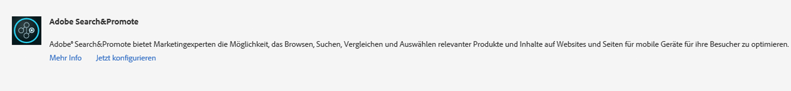
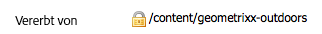

# Integrieren mit Adobe Search&amp;Promote{#integrating-with-adobe-search-promote}

Führen Sie zum Abrufen des Dienstes Adobe Search&amp;Promote von unserer Website die folgenden Aufgaben durch:

1. Geben Sie die URL der Cloud an.
1. Konfigurieren Sie die Verbindung mit dem Search&amp;Promote-Dienst.
1. Fügen Sie dem Sidekick Search&amp;Promote-Komponenten hinzu.
1. Verwenden Sie die Komponenten für die Bearbeitung des Inhalts. (Siehe [Hinzufügen von Search&amp;Promote-Funktionen zu einer Webseite](/help/sites-authoring/search-and-promote.md).)
1. Fügen Sie Ihren Seiten Banner hinzu. Bannerbilder reagieren auf Search&amp;Promote-Daten.
1. Generieren Sie eine Sitemap für den Search&amp;Promote-Dienst.

>[!NOTE]
>
>Wenn Sie Search&amp;Promote mit einer benutzerdefinierten Proxy-Konfiguration verwenden, müssen Sie beide HTTP-Client-Proxy-Konfigurationen vornehmen, da manche AEM-Funktionen 3.x-APIs verwenden und andere wiederum 4.x-APIs:
>
>* 3.x wird mit [https://localhost:4502/system/console/configMgr/com.day.commons.httpclient](https://localhost:4502/system/console/configMgr/com.day.commons.httpclient) konfiguriert.
>* 4.x ist mit [https://localhost:4502/system/console/configMgr/org.apache.http.proxyconfigurator](https://localhost:4502/system/console/configMgr/org.apache.http.proxyconfigurator) konfiguriert.

>

## Ändern der URL des Search&amp;Promote-Diensts {#changing-the-search-promote-service-url}

Die Standard-URL, die für den Search&amp;Promote-Dienst konfiguriert ist, lautet `https://searchandpromote.omniture.com/px/`. Verwenden Sie zur Verwendung eines anderen Diensts die OSGi-Konsole, um eine andere URL anzugeben.

1. Öffnen Sie die OSGi-Konsole und klicken Sie auf die Registerkarte „Konfiguration“. ([https://localhost:4502/system/console/configMgr](https://localhost:4502/system/console/configMgr))
1. Klicken Sie auf das Element „Day CQ Search&amp;Promote-Konfiguration“.
1. Geben Sie die URL in das Feld „URI des Remoteservers“ ein und klicken Sie auf „Speichern“.

## Konfigurieren der Verbindung mit Search&amp;Promote {#configuring-the-connection-to-search-promote}

Konfigurieren Sie eine oder mehrere Verbindungen mit Search&amp;Promote, sodass Ihre Webseiten mit dem Dienst interagieren können. Für die Verbindung benötigen Sie die Mitgliedsidentifikations- und Kontonummer Ihres Search&amp;Promote-Kontos.

1. Wählen Sie im Symbol **Tools** > **Bereitstellung** die Option **Cloud Services** aus.

   Hierdurch werden Sie zum Dashboard der Cloud-Services weitergeleitet. Wenn auf einem lokalen Computer die URL des Dashboards in etwa wie folgt aussieht:

   [https://localhost:4502/libs/cq/core/content/tools/cloudservices.html](https://localhost:4502/libs/cq/core/content/tools/cloudservices.html)

1. dann klicken Sie auf der Seite „Cloud Services“ auf den Search&amp;Promote-Link oder das Search&amp;Promote-Symbol.

1. Wenn Sie die Adobe-Search&amp;Promote zum ersten Mal konfigurieren, klicken Sie auf **Jetzt konfigurieren** , um den Bereich Konfiguration erstellen zu öffnen.

   Wenn Sie mehr über Search&amp;Promote erfahren möchten, klicken Sie stattdessen auf **Weitere Informationen**.

   

1. Geben Sie einen **Titel** ein, der für die Seitenautoren wiedererkennbar ist, geben Sie einen eindeutigen **Namen** ein und klicken Sie dann auf **Erstellen**.

   Das Fenster **Komponente bearbeiten** wird geöffnet.

   Darüber hinaus wird die neu erstellte Konfiguration unter **Verfügbare Konfigurationen** im **Cloud-Services-Dashboard** des Adobe Search&amp;Promote-Listenelements angezeigt.

   

1. Fügen Sie den Feldern im Dialogfeld **Komponente bearbeiten** Folgendes hinzu:

   * **Mitglieds-ID**
   * **Kontonummer**

   >[!NOTE]
   >
   >Um diese Informationen zu erhalten, müssen Sie sich zunächst bei **a1/> anmelden.**
   >
   >[https://searchandpromote.omniture.com/center/](https://searchandpromote.omniture.com/center/)
   >
   >
   >mithilfe Ihrer gültigen Seach&amp;Promote-Zugriffsberechtigung (E-Mail/Kennwort) anmelden.
   >Dann müssen Sie Ihre URL in der Adressleiste Ihres Browsers betrachten, die in etwa wie folgt aussehen sollte:
   >
   >
   >[https://searchandpromote.omniture.com/px/home/?sp_id=XXXXXXXX-spYYYYYYYY](https://searchandpromote.omniture.com/px/home/?sp_id=XXXXXXXX-spYYYYYYYY)
   >
   >**Dabei ist:**
   >
   >    * **** XXXXXXXXXX entspricht Ihrer ** Mitglieds-ID**
   >    * **** spYYYYYYYYentspricht Ihrer  **Kontonummer**

1. Klicken Sie auf **Verbinden mit Search&amp;Promote**.

   Wenn die Meldung „Verbindung erfolgreich“ angezeigt wird, klicken Sie auf **OK**.

   (Nach dem Verbinden ändert sich der Schaltflächentext in &quot;Erneut mit Search&amp;Promote verbinden&quot;.)

1. Klicken Sie auf **OK**. Die Seite mit den Search&amp;Promote-Einstellungen wird für die gerade von Ihnen erstellte Konfiguration angezeigt.

## Konfigurieren des Datenzentrums {#configuring-the-data-center}

Wenn Ihr Search&amp;Promote-Konto sich in Asien oder Europa befindet, müssen Sie das Standarddatenzentrum dahingehend ändern, dass es auf das richtige Datenzentrum verweist (das Standarddatenzentrum gilt für nordamerikanische Konten).

Sie können das Datenzentrum wie folgt konfigurieren:

1. Navigieren Sie zur Webkonsole unter `https://localhost:4502/system/console/configMgr/com.day.cq.searchpromote.impl.SearchPromoteServiceImpl` .

   

1. Ändern Sie den URI je nach Standort des Servers in einen der folgenden:

   * Nordamerika: [https://center.atomz.com/px/](https://center.atomz.com/px/)
   * EMEA: [https://center.lon5.atomz.com/px/](https://center.lon5.atomz.com/px/)
   * APAC: [https://center.sin2.atomz.com/px/](https://center.sin2.atomz.com/px/)

1. Klicken Sie auf **Speichern**.

## Hinzufügen von Search&amp;Promote-Komponenten zum Sidekick {#adding-search-promote-components-to-sidekick}

Bearbeiten Sie im Designmodus eine **par**-Komponente, sodass sie die Search&amp;Promote-Komponenten im Sidekick zulässt. (In der Dokumentation zu den [Komponenten](/help/sites-developing/components.md#addinganewcomponenttotheparagraphsystemdesignmode) finden Sie weitere Informationen.)

Weitere Informationen zur Verwendung der Komponenten finden Sie unter [Hinzufügen von Search&amp;Promote-Funktionen zu einer Webseite](/help/sites-authoring/search-and-promote.md).)

## Angeben des von Ihren Seiten verwendeten Search&amp;Promote-Dienstes {#specifying-the-search-promote-service-that-your-pages-use}

Konfigurieren Sie Webseiten so, dass diese einen spezifischen Search&amp;Promote-Dienst verwenden. Search&amp;Promote-Komponenten verwenden automatisch den Dienst ihrer Hostseite.

Wenn Sie die Search&amp;Promote-Eigenschaften für eine Hostseite konfigurieren, übernehmen alle untergeordneten Seiten die Einstellungen. Bei Bedarf können Sie die untergeordneten Seiten so konfigurieren, dass sie die übernommenen Einstellungen außer Kraft setzen.

>[!NOTE]
>
>Die Dienstverbindung muss bereits konfiguriert sein. (Siehe [Konfigurieren der Verbindung zu Search&amp;Promote](#connection).)

1. Öffnen Sie das Dialogfeld **Seiteneigenschaften**. Klicken Sie beispielsweise auf der Seite &quot;Websites&quot;mit der rechten Maustaste auf die Seite und klicken Sie auf **Eigenschaften**.
1. Klicken Sie auf die Registerkarte **Cloud-Services.**
1. Zum Deaktivieren der Vererbung der Cloud Service-Konfigurationen von einer übergeordneten Seite klicken Sie auf das Schlosssymbol neben dem Vererbungspfad.

   

1. Klicken Sie auf **Service hinzufügen**, wählen Sie **Adobe Search&amp;Promote** aus und klicken Sie auf **OK**.
1. Wählen Sie die Verbindungskonfiguration für Ihr Search&amp;Promote-Konto und klicken Sie dann auf **OK**.

## Produkt-Feed {#product-feed}

Die Search&amp;Promote-Integration ermöglicht Ihnen Folgendes:

* Verwenden der eCommerce-API, unabhängig von der zugrunde liegenden Repository-Struktur und Commerce-Plattform
* Nutzen der Index-Connector-Funktion von Search&amp;Promote zur Bereitstellung eines Produkt-Feeds im XML-Format
* Nutzen der Fernsteuerungsfunktion von Search&amp;Promote zur bedarfsabhängigen bzw. planmäßigen Durchführung von Anfragen des Produkt-Feeds
* Erstellen von Feeds für verschiedene Search&amp;Promote-Konten, konfiguriert als Cloud Service-Konfigurationen

Weitere Informationen finden Sie unter [Produkt-Feed](/help/sites-administering/product-feed.md).
