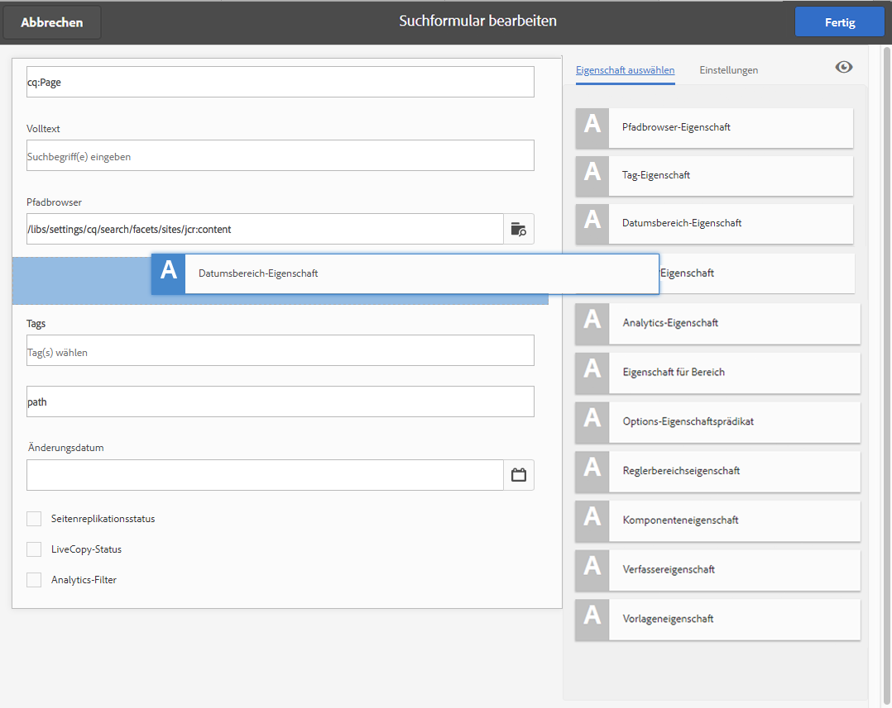

# Konfigurieren von Suchformularen{#configuring-search-forms}

Mit **Suchformularen** können Sie die Auswahl der Suchprädikate anpassen, die in den Suchbereichen der verschiedenen AEM-Konsolen und/oder in den Suchbereichen der Autorenumgebung verwendet werden. Auf diese Weise können Sie die Suchfunktion genau auf Ihre speziellen Anforderungen ausrichten.

Eine [Reihe an Prädikaten](#predicates-and-their-settings) ist vorkonfiguriert verfügbar. Sie können mehrere Eigenschaften hinzufügen, darunter das Volltextprädikat für Volltextsuchen, das Eigenschaftsprädikat für die Suche nach Assets, die mit einer einzigen von Ihnen festgelegten Eigenschaft übereinstimmen, oder das Optionsprädikat für die Suche nach Assets, die mit mindestens einem Wert übereinstimmen, den Sie für eine bestimmte Eigenschaft festgelegt haben.

Sie können die [Suchformulare konfigurieren](#configuring-your-search-forms), die in den unterschiedlichen Konsolen und im Asset-Browser (bei der Bearbeitung von Seiten) genutzt werden. Die [Dialogfelder für die Konfiguration dieser Formulare](#configuring-your-search-forms) finden Sie unter:

* **Tools**

   * **Allgemein**

      * **Suchformulare**

Wenn Sie zum ersten Mal auf diese Konsole zugreifen, weisen alle Konfigurationen ein Vorhängeschlosssymbol auf. Dieses Symbol bedeutet, dass die richtige Konfiguration die Standardkonfiguration (vorkonfiguriert) ist und nicht gelöscht werden kann. Wenn Sie die Konfiguration angepasst haben, wird das Schlosssymbol nicht mehr angezeigt – es sei denn, Sie [löschen die benutzerdefinierte Konfiguration](#deleting-a-configuration-to-reinstate-the-default); dann wird das Standardsymbol wieder aktiviert und das Vorhängeschloss angezeigt.

## Konfigurationen {#configurations}

Die verfügbaren Standardkonfigurationen sind:

* **Seiten-Editor (Dokumentensuche):**

   Diese Konfiguration definiert die Optionen, die beim Suchen nach Dokumenten im Assets-Browser verfügbar sind (beim Bearbeiten einer Seite).

* **Seiten-Editor (Bildsuche):**

   Diese Konfiguration definiert die Optionen, die beim Suchen nach Bildern im Asset-Browser (beim Bearbeiten einer Seite) verfügbar sind.

* **Seiten-Editor (Manuskriptsuche):**

   Diese Konfiguration definiert die Optionen, die bei der Suche nach Manuskripten im Assets-Browser verfügbar sind (beim Bearbeiten einer Seite).

* **Seiten-Editor (Seitensuche):**

   Diese Konfiguration definiert die Optionen, die beim Suchen nach Seiten im Asset-Browser verfügbar sind (beim Bearbeiten einer Seite).

* **Seiten-Editor (Absatzsuche):**

   Diese Konfiguration definiert die Optionen, die beim Suchen nach Absätzen im Assets-Browser verfügbar sind (beim Bearbeiten einer Seite).

* **Seiten-Editor (Produktsuche):**

   Diese Konfiguration definiert die Optionen, die beim Suchen nach Produkten im Asset-Browser verfügbar sind (beim Bearbeiten einer Seite).

* **Seiten-Editor (Scene7-Suche)**:

   Diese Konfiguration definiert die Optionen, die beim Suchen nach Scene7-Ressourcen im Asset-Browser verfügbar sind (beim Bearbeiten einer Seite).

* **Sites-Admin-Suchschiene**:

   Diese Konfiguration definiert die Suchoptionen, die dem Benutzer bei Verwendung der Suchleiste der Site-Konsole zur Verfügung stehen.

* **Seiten-Editor (Videosuche):**

   Diese Konfiguration definiert die Optionen, die beim Suchen nach Videos im Assets-Browser verfügbar sind (beim Bearbeiten einer Seite).

* **Asset-Admin-Suchschiene:**

   Diese Konfiguration definiert die Suchoptionen, die dem Benutzer bei Verwendung der Assets-Konsole zur Verfügung stehen.

* **Katalog-Admin-Suchschiene:**

   Diese Konfiguration definiert die Suchoptionen, die dem Benutzer beim Durchsuchen eines Commerce-Katalogs zur Verfügung stehen.

* **Auftrags-Admin-Suchschiene:**

   Diese Konfiguration definiert die Suchoptionen, die dem Benutzer beim Durchsuchen von Commerce-Bestellungen zur Verfügung stehen.

* **Admin-Suchleiste für Produktsammlungen:**

   Diese Konfiguration definiert die Suchoptionen, die dem Benutzer beim Durchsuchen von Commerce-Produktsammlungen zur Verfügung stehen.

* **Produkt-Admin-Suchschiene:**

   Diese Konfiguration definiert die Suchoptionen, die dem Benutzer bei der Suche nach kommerziellen Produkten zur Verfügung stehen.

* **Projekt-Admin-Suchschiene:**

   Diese Konfiguration definiert die Suchoptionen, die dem Benutzer beim Durchsuchen von Projekten zur Verfügung stehen.

## Prädikate und ihre Einstellungen {#predicates-and-their-settings}

### Eigenschaften {#predicates}

Die folgenden Prädikate stehen je nach Konfiguration zur Verfügung:

<table>
 <tbody>
  <tr>
   <th>Eigenschaft</th>
   <th>Zweck</th>
   <th>Einstellungen</th>
  </tr>
  <tr>
   <td>Analytics </td>
   <td>Such-/Filterfunktionen im Sites-Browser, wenn Analytics-basierte Daten angezeigt werden. Analysen-Suchfilter werden geladen, um die zugeordneten angepassten Analysespalten abzugleichen.</td>
   <td>
    <ul>
     <li>Feldbezeichnung</li>
     <li>Beschreibung</li>
    </ul> </td>
  </tr>
  <tr>
   <td>Asset zuletzt geändert </td>
   <td>Datum der letzten Änderung des Assets.  </td>
   <td>Eine benutzerdefinierte Prognose, die auf der Date Predicate basiert.</td>
  </tr>
  <tr>
   <td>Komponenten </td>
   <td>Ermöglicht es einem Autor, nach Seiten zu suchen/zu filtern, die eine bestimmte Komponente enthalten. Beispiel: eine Bildergalerie.  </td>
   <td>
    <ul>
     <li>Feldbezeichnung</li>
     <li>Platzhalter</li>
     <li>Eigenschaftsname*</li>
     <li>Eigenschaftstiefe</li>
     <li>Beschreibung</li>
    </ul> </td>
  </tr>
  <tr>
   <td>Datum </td>
   <td>Slider-basierte Suche von Assets basierend auf einer Datumseigenschaft.</td>
   <td>
    <ul>
     <li>Feldbezeichnung</li>
     <li>Eigenschaftsname*</li>
     <li>Beschreibung</li>
    </ul> </td>
  </tr>
  <tr>
   <td>Datum Bereich </td>
   <td>Suchen Sie Assets, die innerhalb eines angegebenen Bereichs für eine Datumseigenschaft erstellt wurden. Im Suchbereich können Sie das Start- und das Enddatum angeben.</td>
   <td>
    <ul>
     <li>Feldbezeichnung</li>
     <li>Platzhalter</li>
     <li>Eigenschaftsname*</li>
     <li>Textbereich (von)*</li>
     <li>Textbereich (bis)*</li>
     <li>Beschreibung</li>
    </ul> </td>
  </tr>
  <tr>
   <td>Gültigkeitsstatus </td>
   <td>Suchen Sie Assets nach dem Ablaufstatus.</td>
   <td>
    <ul>
     <li>Feldbezeichnung</li>
     <li>Eigenschaftsname*</li>
     <li>Beschreibung</li>
    </ul> </td>
  </tr>
  <tr>
   <td>Dateigröße </td>
   <td>Suchen Sie Assets nach ihrer Größe.</td>
   <td>
    <ul>
     <li>Feldbezeichnung</li>
     <li>Eigenschaftsname*</li>
     <li>Optionspfad</li>
     <li>Beschreibung</li>
    </ul> </td>
  </tr>
  <tr>
   <td>Volltext </td>
   <td>Sucheigenschaft für Volltextsuchen.</td>
   <td>
    <ul>
     <li>Feldbezeichnung</li>
     <li>Platzhalter</li>
     <li>Eigenschaftsname</li>
     <li>Beschreibung</li>
    </ul> </td>
  </tr>
  <tr>
   <td>Ausgeblendeter Filter</td>
   <td>Ein Filter für Eigenschaft und Wert, der für den Benutzer nicht sichtbar ist.</td>
   <td>
    <ul>
     <li>Eigenschaftsname</li>
     <li>Eigenschaftswert</li>
     <li>Beschreibung</li>
    </ul> </td>
  </tr>
  <tr>
   <td>Optionen </td>
   <td>
Die Optionen sind vom Benutzer erstellte Inhaltsknoten.
 
See <a href="#addinganoptionspredicate">Adding an Options Predicate</a> for more information.
 </td>
   <td>
    <ul>
     <li>Feldbezeichnung</li>
     <li>JSON-Pfad</li>
     <li>Eigenschaftsname*</li>
     <li>Einzelauswahl</li>
     <li>Optionspfad</li>
     <li>Beschreibung</li>
    </ul> </td>
  </tr>
  <tr>
   <td>Options-Eigenschaft </td>
   <td>Suchen Sie nach einer Eigenschaft der Option.</td>
   <td>
    <ul>
     <li>Feldbezeichnung</li>
     <li>Eigenschaftsname*</li>
     <li>Optionsknotenpfad  </li>
     <li>Einzelauswahl</li>
     <li>Beschreibung</li>
    </ul> </td>
  </tr>
  <tr>
   <td>Seite Status </td>
   <td>Suchseiten nach ihrem Status.</td>
   <td>
    <ul>
     <li>Feldbezeichnung</li>
     <li>Veröffentlichungs-Eigenschaftsname</li>
     <li>LiveCopy-Eigenschaftsname</li>
     <li>Beschreibung</li>
    </ul> </td>
  </tr>
  <tr>
   <td>Pfad </td>
   <td>Suchen Sie Assets, die sich unter einem bestimmten Pfad befinden.</td>
   <td>
    <ul>
     <li>Feldbezeichnung</li>
     <li>Suchpfad hinzufügen</li>
     <li>Beschreibung</li>
    </ul> </td>
  </tr>
  <tr>
   <td>Eigenschaft </td>
   <td>Suchen Sie nach einer angegebenen Eigenschaft.</td>
   <td>none</td>
  </tr>
  <tr>
   <td>Veröffentlichungsstatus </td>
   <td>Suchen von Assets nach ihrem Veröffentlichungsstatus</td>
   <td>
    <ul>
     <li>Feldbezeichnung</li>
     <li>Eigenschaftsname*</li>
     <li>Beschreibung</li>
    </ul> </td>
  </tr>
  <tr>
   <td>Bereich </td>
   <td>Suchen Sie Ressourcen, die innerhalb eines bestimmten Bereichs liegen. Im Suchbereich können Sie den Mindest- und den Höchstwert für den Bereich angeben.</td>
   <td>
    <ul>
     <li>Feldbezeichnung</li>
     <li>Eigenschaftsname</li>
     <li>Beschreibung</li>
    </ul> </td>
  </tr>
  <tr>
   <td>Bereichsoptionen </td>
   <td>Eine bestimmte Suche sagt für Assets voraus und entspricht der allgemeinen Slider Predicate. Ist aufgrund von Problemen mit der Abwärtskompatibilität noch verfügbar.</td>
   <td>
    <ul>
     <li>Feldbezeichnung</li>
     <li>Eigenschaftsname*</li>
     <li>Optionspfad</li>
     <li>Beschreibung</li>
    </ul> </td>
  </tr>
  <tr>
   <td>Bewertung </td>
   <td>Suchen Sie Assets nach ihrer Bewertung.  </td>
   <td>
    <ul>
     <li>Feldbezeichnung</li>
     <li>Eigenschaftsname*</li>
     <li>Optionspfad</li>
     <li>Beschreibung</li>
    </ul> </td>
  </tr>
  <tr>
   <td>Relatives Datum </td>
   <td>Search assets based on the relative date of their creation  </td>
   <td>
    <ul>
     <li>Feldbezeichnung</li>
     <li>Eigenschaftsname*</li>
     <li>Relatives Datum</li>
     <li>Beschreibung</li>
    </ul> </td>
  </tr>
  <tr>
   <td>Reglerbereich </td>
   <td>Eine allgemeine Suche sagt voraus, dass die Erweiterung des Bereichs mit der Schiebereglerfunktion vorhergesagt wird. Der Wert der gesuchten Eigenschaft muss zwischen den Grenzen des Reglers liegen.</td>
   <td>
    <ul>
     <li>Feldbezeichnung</li>
     <li>Eigenschaftsname*</li>
     <li>Beschreibung</li>
    </ul> </td>
  </tr>
  <tr>
   <td>Tag </td>
   <td>Suchen Sie Assets anhand von Tags. Sie können die Pfadeigenschaft konfigurieren, um verschiedene Tags in der Tag-Liste zu füllen.</td>
   <td>
    <ul>
     <li>Feldbezeichnung</li>
     <li>Eigenschaftsname*</li>
     <li>Optionspfad</li>
     <li>Beschreibung</li>
    </ul> </td>
  </tr>
  <tr>
   <td>Tags </td>
   <td>Suche anhand von Tags.</td>
   <td>
    <ul>
     <li>Platzhalter</li>
     <li>Eigenschaftsname*</li>
     <li>Beschreibung</li>
    </ul> </td>
  </tr>
 </tbody>
</table>

>[!NOTE]
>
>* Die allgemeinen Suchvorausschätzungen werden wie folgt definiert:
   >  `/libs/cq/gui/components/common/admin/customsearch/searchpredicates`
   >
   >
   >

* Suchvorhersagen, die sich nur auf SiteAdmin (klassische Benutzeroberfläche) beziehen, befinden sich unter:
   > `/libs/cq/gui/components/siteadmin/admin/searchpanel/searchpredicates`
   >   * Diese werden nicht mehr unterstützt und stehen nur zur Abwärtskompatibilität zur Verfügung.
>
>
This information is for reference only, you must not make changes to `/libs`.

### Prädikateinstellungen {#predicate-settings}

Je nach Prädikat stehen mehrere Einstellungen für die Konfiguration zur Verfügung:

* **Feldbezeichnung**

   Die Beschriftung, die als reduzierbare Kopfzeile oder als Feldbeschriftung der Vorhersage angezeigt wird.

* **Beschreibung**

   Beschreibende Details für den Benutzer.

* **Platzhalter**

   Leerer Text oder Platzhalter für die Vorhersage, falls kein Filtertext eingegeben wird.

* **Eigenschaftsname**

   Die Eigenschaft, nach der gesucht werden soll. It uses a relative path and the wildcards `*/*/*` specify the depth of the property relative to the `jcr:content` node (each asterisk represents one node level).

   If you want to search only on a first level child node of the resource that has the `x` property on the `jcr:content` node use `*/jcr:content/x`

* **Eigenschaftstiefe**

   Die maximale Tiefe, mit der nach dieser Eigenschaft in den Ressourcen gesucht wird. So können Sie eine Suche nach dieser Eigenschaft auf einer Ressource und rekursiven untergeordneten Elementen durchführen, bis die Ebene der untergeordneten Elemente der festgelegten Tiefe entspricht.

* **Eigenschaftswert**

   The property value as an absolute string or as an expression language; for example, `cq:Page` or

   `${empty requestPathInfo.suffix ? "/content" : requestPathInfo.suffix}`.

* **Bereichstext**

   The label of the range field in the **Date Range** predicate.

* **Optionspfad**

   Der Benutzer kann den Pfad mithilfe des Pfadbrowsers auf der Registerkarte &quot;Voreinstellung&quot;auswählen. Nach dem Auswählen können Sie mit dem Plussymbol (**+**) die Auswahl zur Liste der gültigen Optionen hinzufügen. (Entfernen lässt sich die Auswahl mit dem Minussymbol (**-**), falls erforderlich.)

   Die Optionen sind vom Benutzer erstellte Inhaltsknoten mit der folgenden Struktur:

   `(jcr:primaryType = nt:unstructured, value (String), jcr:title (String))`

* **Optionsknotenpfad** Praktisch dasselbe wie der **Optionspfad**, mit dem Unterschied, dass dieser Pfad sich im gemeinsamen Prädikatsfeld befindet, während der andere Pfad nur für Assets gilt.

* **Einzelauswahl** Wenn diese Option aktiviert ist, werden die Optionen als Kontrollkästchen gerendert, die nur eine Einzelauswahl zulassen. Wenn die Option versehentlich ausgewählt wurde, kann sie per Kontrollkästchen deaktiviert werden.

* **Veröffentlichungs- und Live Copy-Eigenschaftsname(n)** Die Bezeichnungen für die Veröffentlichungs- und Live Copy-Kontrollkästchen für das Sites-spezifische Prädikat.

* The &amp;ast; on the field labels in the **Settings** tab means the fields are required and if left blank an error message will appear

## Konfigurieren Ihrer Suchformulare {#configuring-your-search-forms}

### Erstellen/Öffnen einer benutzerdefinierten Konfiguration {#creating-opening-a-customized-configuration}

1. Navigieren Sie zu **Tools** > **Vorgänge** > **Suchformulare**.

1. Wählen Sie die Konfiguration aus, die Sie anpassen möchten.
1. Über das Symbol **Bearbeiten** können Sie die Konfiguration für die Aktualisierung öffnen.
1. Bei einer neuen Anpassung möchten Sie vermutlich [neue Prädikatfelder hinzufügen und die Einstellungen wie erforderlich festlegen](#add-edit-a-predicate-field-and-define-field-settings). Bei einer vorhandenen Anpassung können Sie ein vorhandenes Feld auswählen und [die Einstellungen aktualisieren](#add-edit-a-predicate-field-and-define-field-settings).
1. Wählen Sie **Fertig** aus, um die Konfiguration zu speichern.

   >[!NOTE]
   >
   >Die angepassten Konfigurationen werden (wie jeweils angemessen) unter folgendem Pfad gespeichert:
   >
   >* `/apps/cq/gui/content/facets/<option>`
   >* `/apps/commerce/gui/content/facets/<option>`

### Hinzufügen/Bearbeiten eines Prädikatfelds und Definieren der Feldeinstellungen {#add-edit-a-predicate-field-and-define-field-settings}

Sie können Felder hinzufügen oder bearbeiten und ihre Einstellungen definieren/aktualisieren:

1. [Öffnen Sie die angepasste Konfiguration](#creating-opening-a-customized-configuration) für die Aktualisierung.
1. Um ein neues Feld hinzuzufügen, öffnen Sie die Registerkarte **Eigenschaft auswählen** und ziehen Sie das benötigte Prädikat an den erforderlichen Ort. Beispiel: das **Datumsbereichsprädikat**:

   

1. Der nächste Schritt hängt davon ab, was Sie tun möchten:

   * Sie fügen ein neues Feld hinzu:

      Nach dem Hinzufügen der Vorhersage wird die Registerkarte **Einstellungen** geöffnet und zeigt die Eigenschaften an, die definiert werden können.

   * Sie möchten eine vorhandene Vorhersage aktualisieren:

      Wählen Sie das Feld &quot;Vorhersage&quot;(rechts) und öffnen Sie dann die Registerkarte &quot; **Einstellungen** &quot;.
   Beispiel: die Einstellungen für das **Datumsbereichprädikat**:

   

1. Nehmen Sie die erforderlichen Änderungen vor und bestätigen Sie sie mit **Fertig**.

### Anzeigen einer Vorschau der Suchkonfiguration {#previewing-the-search-configuration}

1. Wählen Sie das Vorschausymbol aus:

   

1. Daraufhin werden die Suchformulare so angezeigt, wie sie in der Suchspalte der jeweiligen Konsole (vollständig eingeblendet) zu sehen sein werden.

   

1. **Schließen** Sie die Vorschau, um zur Konfiguration zurückzukehren und sie fertigzustellen.

### Löschen eines Prädikatfelds {#deleting-a-predicate-field}

1. [Öffnen Sie die angepasste Konfiguration](#creating-opening-a-customized-configuration) für die Aktualisierung.
1. Wählen Sie das Prädikatsfeld (rechts) aus, öffnen Sie die Registerkarte **Einstellungen** und wählen Sie dann das Symbol **Löschen** (unten links) aus.

   

1. In einem Dialogfeld werden Sie dazu aufgefordert, die Löschaktion zu bestätigen.

1. Bestätigen Sie diese und andere Änderungen mit **Fertig**.

### Löschen einer Konfiguration (zur erneuten Aktivierung des Standards) {#deleting-a-configuration-to-reinstate-the-default}

Wenn Sie eine Konfiguration angepasst haben, werden die Standardwerte überschrieben. Sie können die Standardkonfiguration erneut aktivieren, indem Sie die angepasste Konfiguration löschen.

>[!NOTE]
>
>Sie können die beiden Standardkonfigurationen nicht löschen.

Das Löschen einer angepassten Konfiguration erfolgt über die Konsole:

1. Wählen Sie die benötigte Konfiguration (z. B. **Seiten-Editor (Absatzsuche)**) und anschließend das Symbol **Löschen** in der Symbolleiste aus:

   

1. Die angepasste Konfiguration wird gelöscht und die Standardkonfiguration wird erneut aktiviert. (Sie erkennen dies am Vorhängeschlosssymbol, die wieder in der Konsole angezeigt wird.)

### Hinzufügen von Optionsprädikaten {#adding-options-predicates}

Mit Optionsprädikaten (Optionen, Optionseigenschaft) können Sie ein Element konfigurieren, nach dem gesucht werden soll. Sie werden normalerweise genutzt, um etwas direkt unter der Seite zu suchen, z. B. eine Eigenschaft auf dem Seitenknoten.

Das folgende Beispiel (Suche entsprechend der Vorlage, mit der eine Seite erstellt wird) verdeutlicht die einzelnen Schritte:

1. Erstellen Sie den Knoten, der die zu suchende Eigenschaft enthält.

   Sie benötigen einen Stammknoten, der die Definitionen der einzelnen Optionen umfasst, die für Benutzer verfügbar sein sollen.

   Die Knoten für die einzelnen Optionen müssen die folgenden Eigenschaften aufweisen:

   * `jcr:title` – die Feldbezeichnung, die in der Suchschiene angezeigt werden soll
   * `value` – der Eigenschaftswert, nach dem gesucht werden soll
   

   >[!NOTE]
   >
   >You ***must*** not change anything in the `/libs` path.
   >
   >This is because the content of `/libs` is overwritten the next time you upgrade your instance (and may well be overwritten when you apply either a hotfix or feature pack).
   >
   >Die empfohlene Methode zur Konfiguration und für andere Änderungen sieht wie folgt aus:
   >
   >1. Recreate the required item, as it exists in `/libs`, under `/apps`. In diesem Fall im folgenden Verzeichnis:
   >1. `/libs/cq/gui/content/common/options/predicates`
   >1. Make any changes within `/apps.`

1. Öffnen Sie die **Suchformulare-Konsole** und wählen Sie die Konfiguration aus, die Sie aktualisieren möchten. Beispiel: **Sites-Admin-Suchschiene**.

   Klicken/tippen Sie anschließend auf das Symbol **Suchformulare bearbeiten**.

1. Fügen Sie je nach Konfiguration **Optionen** oder eine **Optionseigenschaft** zur Konfiguration hinzu.
1. Aktualisieren Sie die Felder, vor allem:

   * **Eigenschaftsname**

      Spezifizieren Sie die Knoteneigenschaft, nach der auf den Zielknoten gesucht werden soll. Beispiel:

      `jcr:content/cq:template`

   * **Optionsknotenpfad**

      Wählen Sie den Pfad, zu dem Ihre Optionen gehalten werden. Beispiel:

      `/apps/cq/gui/content/common/options/predicates/templatetype`
   

1. Wählen Sie **Fertig** aus, um die Konfiguration zu speichern.
1. Navigieren Sie zur entsprechenden Konsole (in diesem Beispiel: **Sites**) und öffnen Sie die **Suchschiene**. Die neu definierten Suchformulare werden zusammen mit den verschiedenen Optionen angezeigt. Wählen Sie die benötigte Option aus, um die Suchergebnisse anzuzeigen:

   

## Anwenderberechtigungen {#user-permissions}

In der folgenden Tabelle sind die Berechtigungen aufgeführt, die Benutzer benötigen, um Suchformulare zu bearbeiten, zu löschen und Vorschauen anzuzeigen.

<table>
 <tbody>
  <tr>
   <td><strong>Aktion</strong></td>
   <td><strong>Berechtigungen</strong></td>
  </tr>
  <tr>
   <td>Bearbeiten </td>
   <td>Lesen, Schreibberechtigungen für den <code>/apps </code>Knoten.</td>
  </tr>
  <tr>
   <td>Löschen</td>
   <td>Read, Write, Delete permissions on the <code>/apps</code> node</td>
  </tr>
  <tr>
   <td>Vorschau</td>
   <td>Read, Write, Delete permissions on the <code>/var/dam/content</code> node.  Lesen, Schreibberechtigungen für den <code>/apps</code> Knoten.</td>
  </tr>
 </tbody>
</table>

