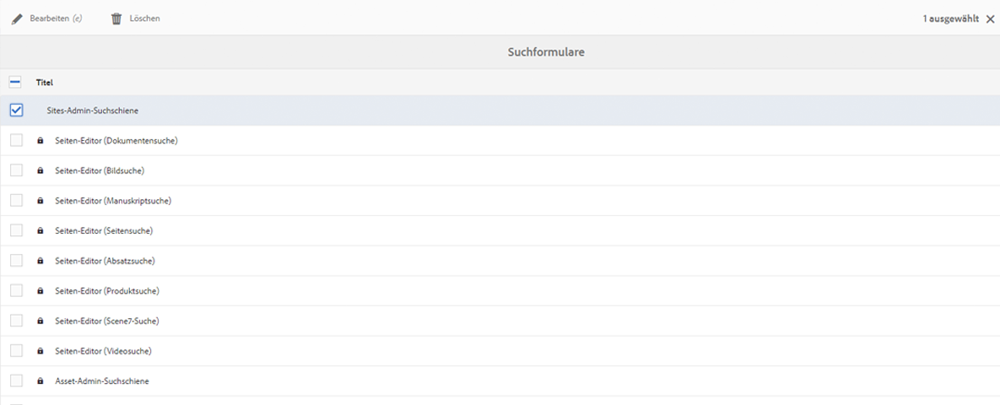

# Konfigurieren von Suchformularen{#configuring-search-forms}

Verwendung **Forms durchsuchen** um die Auswahl der Sucheigenschaften anzupassen, die in den Suchbereichen verwendet werden, die in verschiedenen AEM Konsolen und/oder Bedienfeldern der Autorenumgebung verfügbar sind. Durch das Anpassen dieser Bedienfelder ist die Suchfunktion entsprechend Ihren spezifischen Anforderungen vielseitiger.

A [Bereich der Eigenschaft](#predicates-and-their-settings)s sind standardmäßig verfügbar. Sie können mehrere Prädikate hinzufügen, darunter das Eigenschaftsprädikat für die Suche nach Assets, die mit einer einzigen von Ihnen festgelegten Eigenschaft übereinstimmen, oder das Optionsprädikat für die Suche nach Assets, die mit mindestens einem Wert übereinstimmen, den Sie für eine bestimmte Eigenschaft festgelegt haben.

Sie können [Suchformulare konfigurieren](#configuring-your-search-forms) wird in verschiedenen Konsolen und im Asset-Browser verwendet (beim Bearbeiten von Seiten). Die [Dialogfelder zum Konfigurieren dieser Formulare](#configuring-your-search-forms) Der Zugriff erfolgt über:

* **Tools**

   * **Allgemein**

      * **Suchformulare**

Wenn Sie zum ersten Mal auf diese Konsole zugreifen, sehen Sie, dass alle Konfigurationen über ein Vorhängeschlosssymbol verfügen. Dies bedeutet, dass die entsprechende Konfiguration die Standardkonfiguration (vorkonfiguriert) ist und nicht gelöscht werden kann. Nach der Anpassung der Konfiguration verschwindet die Sperre - es sei denn, Sie [Ihre benutzerdefinierte Konfiguration löschen](#deleting-a-configuration-to-reinstate-the-default), in diesem Fall werden die Standardeinstellung (und die Sperranzeige) erneut aktiviert.

## Konfigurationen {#configurations}

Die verfügbaren Standardkonfigurationen sind:

* **Seiten-Editor (Dokumentensuche):**

  Diese Konfiguration definiert die Optionen, die bei der Suche nach Dokumenten im Assets-Browser (beim Bearbeiten einer Seite) verfügbar sind.

* **Seiten-Editor (Bildsuche):**

  Diese Konfiguration definiert die Optionen, die bei der Suche nach Bildern im Assets-Browser (beim Bearbeiten einer Seite) verfügbar sind.

* **Seiten-Editor (Manuskriptsuche):**

  Diese Konfiguration definiert die Optionen, die bei der Suche nach Manuskripten im Assets-Browser (beim Bearbeiten einer Seite) verfügbar sind.

* **Seiten-Editor (Seitensuche):**

  Diese Konfiguration definiert die Optionen, die bei der Suche nach Seiten im Assets-Browser (beim Bearbeiten einer Seite) verfügbar sind.

* **Seiten-Editor (Absatzsuche):**

  Diese Konfiguration definiert die Optionen, die bei der Suche nach Absätzen im Assets-Browser (beim Bearbeiten einer Seite) verfügbar sind.

* **Seiten-Editor (Produktsuche):**

  Diese Konfiguration definiert die Optionen, die bei der Suche nach Produkten im Assets-Browser (beim Bearbeiten einer Seite) verfügbar sind.

* **Seiten-Editor (Dynamic Media Classic [früher Scene7]-Suche)**:

  Diese Konfiguration definiert die Optionen, die bei der Suche nach Scene7-Ressourcen im Assets-Browser (beim Bearbeiten einer Seite) verfügbar sind.

* **Sites-Admin-Suchleiste**:

  Diese Konfiguration definiert die Suchoptionen, die in der Suchleiste der Sites-Konsole verfügbar sind.

* **Seiten-Editor (Videosuche):**

  Diese Konfiguration definiert die Optionen, die bei der Suche nach Videos im Assets-Browser (beim Bearbeiten einer Seite) verfügbar sind.

* **Asset-Admin-Suchleiste:**

  Diese Konfiguration definiert die Suchoptionen, die in der Assets-Konsole verfügbar sind.

* **Katalog-Admin-Suchleiste:**

  Diese Konfiguration definiert die Suchoptionen, die bei der Suche nach einem Commerce-Katalog verfügbar sind.

* **Auftrags-Admin-Suchleiste:**

  Diese Konfiguration definiert die Suchoptionen, die bei der Suche nach Commerce-Bestellungen verfügbar sind.

* **Admin-Suchleiste für Produktsammlungen:**

  Diese Konfiguration definiert die Suchoptionen, die bei der Suche nach Commerce-Produktsammlungen verfügbar sind.

* **Produkt-Admin-Suchleiste:**

  Diese Konfiguration definiert die Suchoptionen, die bei der Suche nach Commerce-Produkten verfügbar sind.

* **Projekt-Admin-Suchleiste:**

  Diese Konfiguration definiert die Suchoptionen, die bei der Suche nach Projekten verfügbar sind.

## Prädikate und ihre Einstellungen {#predicates-and-their-settings}

### Prädikate {#predicates}

Die folgenden Prädikate stehen je nach Konfiguration zur Verfügung:

<table>
 <tbody>
  <tr>
   <th>Prädikat</th>
   <th>Zweck</th>
   <th>Einstellungen</th>
  </tr>
  <tr>
   <td>Analyse </td>
   <td>Such-/Filterfunktionen im Sites-Browser, wenn analysebasierte Daten angezeigt werden. Analyse-Suchfilter werden geladen, um die zugeordneten angepassten Analysespalten abzugleichen.</td>
   <td>
    <ul>
     <li>Feldbezeichnung</li>
     <li>Beschreibung</li>
    </ul> </td>
  </tr>
  <tr>
   <td>Asset zuletzt geändert </td>
   <td>Letztes Änderungsdatum des Assets.  </td>
   <td>Ein benutzerdefiniertes Prädikat, basierend auf dem Datumsprädikat.</td>
  </tr>
  <tr>
   <td>Komponenten </td>
   <td>Ermöglicht es einem Autor, nach Seiten zu suchen/zu filtern, die eine bestimmte Komponente enthalten. Beispiel: eine Bildergalerie.  </td>
   <td>
    <ul>
     <li>Feldbezeichnung</li>
     <li>Platzhalter</li>
     <li>Eigenschaftsname*</li>
     <li>Eigenschaftstiefe</li>
     <li>Beschreibung</li>
    </ul> </td>
  </tr>
  <tr>
   <td>Datum </td>
   <td>Reglerbasierte Suche nach Assets basierend auf einer Datumseigenschaft.</td>
   <td>
    <ul>
     <li>Feldbezeichnung</li>
     <li>Eigenschaftsname*</li>
     <li>Beschreibung</li>
    </ul> </td>
  </tr>
  <tr>
   <td>Datum Bereich </td>
   <td>Suche nach Assets, die innerhalb eines angegebenen Bereichs für eine Datumseigenschaft erstellt wurden. Im Suchbereich können Sie das Start- und das Enddatum angeben.</td>
   <td>
    <ul>
     <li>Feldbezeichnung</li>
     <li>Platzhalter</li>
     <li>Eigenschaftsname*</li>
     <li>Textbereich (von)*</li>
     <li>Textbereich (bis)*</li>
     <li>Beschreibung</li>
    </ul> </td>
  </tr>
  <tr>
   <td>Gültigkeitsstatus </td>
   <td>Suche nach Assets basierend auf dem Ablaufstatus.</td>
   <td>
    <ul>
     <li>Feldbezeichnung</li>
     <li>Eigenschaftsname*</li>
     <li>Beschreibung</li>
    </ul> </td>
  </tr>
  <tr>
   <td>Dateigröße </td>
   <td>Suche nach Assets basierend auf ihrer Größe.</td>
   <td>
    <ul>
     <li>Feldbezeichnung</li>
     <li>Eigenschaftsname*</li>
     <li>Optionspfad</li>
     <li>Beschreibung</li>
    </ul> </td>
  </tr>
  <tr>
   <td>Ausgeblendet Filter</td>
   <td>Ein Filter für Eigenschaft und Wert, der für den Benutzer nicht sichtbar ist.</td>
   <td>
    <ul>
     <li>Eigenschaftsname</li>
     <li>Eigenschaftswert</li>
     <li>Beschreibung</li>
    </ul> </td>
  </tr>
  <tr>
   <td>Optionen </td>
   <td>
Die Optionen sind vom Benutzer erstellte Inhaltsknoten.
 
Weitere Informationen finden Sie unter <a href="#addinganoptionspredicate">Hinzufügen eines Optionsprädikats</a>.
 </td>
   <td>
    <ul>
     <li>Feldbezeichnung</li>
     <li>JSON-Pfad</li>
     <li>Eigenschaftsname*</li>
     <li>Einzelauswahl</li>
     <li>Optionspfad</li>
     <li>Beschreibung</li>
    </ul> </td>
  </tr>
  <tr>
   <td>Options-Eigenschaft </td>
   <td>Suche nach einer Eigenschaft der Option.</td>
   <td>
    <ul>
     <li>Feldbezeichnung</li>
     <li>Eigenschaftsname*</li>
     <li>Optionsknotenpfad  </li>
     <li>Einzelauswahl</li>
     <li>Beschreibung</li>
    </ul> </td>
  </tr>
  <tr>
   <td>Seite Status </td>
   <td>Suche nach Seiten basierend auf ihrem Status.</td>
   <td>
    <ul>
     <li>Feldbezeichnung</li>
     <li>Veröffentlichungs-Eigenschaftsname</li>
     <li>LiveCopy-Eigenschaftsname</li>
     <li>Beschreibung</li>
    </ul> </td>
  </tr>
  <tr>
   <td>Pfad   </td>
   <td>Suche nach Assets unter einem bestimmten Pfad.</td>
   <td>
    <ul>
     <li>Feldbezeichnung</li>
     <li>Suchpfad hinzufügen</li>
     <li>Beschreibung</li>
    </ul> </td>
  </tr>
  <tr>
   <td>Eigenschaft </td>
   <td>Suche nach einer angegebenen Eigenschaft.</td>
   <td>keine</td>
  </tr>
  <tr>
   <td>Veröffentlichungsstatus </td>
   <td>Suche nach Assets basierend auf ihrem Veröffentlichungsstatus</td>
   <td>
    <ul>
     <li>Feldbezeichnung</li>
     <li>Eigenschaftsname*</li>
     <li>Beschreibung</li>
    </ul> </td>
  </tr>
  <tr>
   <td>Bereich </td>
   <td>Suche nach Ressourcen, die innerhalb eines bestimmten Bereichs liegen. Im Suchbereich können Sie den Mindest- und den Höchstwert für den Bereich angeben.</td>
   <td>
    <ul>
     <li>Feldbezeichnung</li>
     <li>Eigenschaftsname</li>
     <li>Beschreibung</li>
    </ul> </td>
  </tr>
  <tr>
   <td>Bereichsoptionen </td>
   <td>Ein spezifisches Suchprädikat für Assets und identisch mit dem allgemeinen Reglerprädikat. Ist aufgrund von Problemen mit der Abwärtskompatibilität noch verfügbar.</td>
   <td>
    <ul>
     <li>Feldbezeichnung</li>
     <li>Eigenschaftsname*</li>
     <li>Optionspfad</li>
     <li>Beschreibung</li>
    </ul> </td>
  </tr>
  <tr>
   <td>Bewertung </td>
   <td>Suche nach Assets basierend auf ihrer Bewertung.  </td>
   <td>
    <ul>
     <li>Feldbezeichnung</li>
     <li>Eigenschaftsname*</li>
     <li>Optionspfad</li>
     <li>Beschreibung</li>
    </ul> </td>
  </tr>
  <tr>
   <td>Relatives Datum </td>
   <td>Suche nach Assets basierend auf ihrem relativen Erstellungsdatum.  </td>
   <td>
    <ul>
     <li>Feldbezeichnung</li>
     <li>Eigenschaftsname*</li>
     <li>Relatives Datum</li>
     <li>Beschreibung</li>
    </ul> </td>
  </tr>
  <tr>
   <td>Reglerbereich </td>
   <td>Ein allgemeines Suchprädikat, das das Bereichsprädikat mit der Reglerfunktion erweitert. Der Wert der gesuchten Eigenschaft muss zwischen den Grenzen des Reglers liegen.</td>
   <td>
    <ul>
     <li>Feldbezeichnung</li>
     <li>Eigenschaftsname*</li>
     <li>Beschreibung</li>
    </ul> </td>
  </tr>
  <tr>
   <td>Tag </td>
   <td>Suche Assets basierend auf Tags. Sie können die Pfadeigenschaft konfigurieren, um verschiedene Tags in der Tag-Liste zu füllen.</td>
   <td>
    <ul>
     <li>Feldbezeichnung</li>
     <li>Eigenschaftsname*</li>
     <li>Optionspfad</li>
     <li>Beschreibung</li>
    </ul> </td>
  </tr>
  <tr>
   <td>Tags </td>
   <td>Suche basierend auf Tags.</td>
   <td>
    <ul>
     <li>Platzhalter</li>
     <li>Eigenschaftsname*</li>
     <li>Beschreibung</li>
    </ul> </td>
  </tr>
 </tbody>
</table>

>[!NOTE]
>
>* Die allgemeinen Suchprädikate sind hier definiert:
>  `/libs/cq/gui/components/common/admin/customsearch/searchpredicates`
>
>* Sucheigenschaften, die nur mit siteadmin (klassische Benutzeroberfläche) verbunden sind, befinden sich unter:
>  `/libs/cq/gui/components/siteadmin/admin/searchpanel/searchpredicates`
>   * Sie sind veraltet und nur aus Gründen der Abwärtskompatibilität verfügbar.
>
>Diese Angaben dienen nur als Referenz. Sie dürfen `/libs` nicht verändern.

### Prädikateinstellungen {#predicate-settings}

Je nach Prädikat stehen mehrere Einstellungen für die Konfiguration zur Verfügung:

* **Feldbezeichnung**

  Die Bezeichnung, die als ausblendbare Kopfzeile oder als Feldbezeichnung des Prädikats angezeigt wird.

* **Beschreibung**

  Beschreibende Informationen für die Benutzer.

* **Platzhalter**

  Leerer Text oder der Platzhalter des Prädikats, der angezeigt wird, wenn kein Filtertext eingegeben wird.

* **Eigenschaftsname**

  Die Eigenschaft, nach der gesucht werden soll. Sie nutzt einen relativen Pfad und die Platzhaltersymbole `*/*/*` geben die Tiefe der Eigenschaft in Relation zum `jcr:content`-Knoten an (jeder Asterisk steht für eine Knotenebene).

  Wenn Sie nur nach dem untergeordneten Knoten der ersten Ebene der Ressource suchen möchten, die die Eigenschaft `x` auf dem Knoten `jcr:content` aufweist, nutzen Sie `*/jcr:content/x`.

* **Eigenschaftstiefe**

  Die maximale Tiefe, die bei der Suche nach dieser Eigenschaft innerhalb der Ressourcen berücksichtigt werden soll. So können Sie eine Suche nach dieser Eigenschaft auf einer Ressource und rekursiven untergeordneten Elementen durchführen, bis die Ebene der untergeordneten Elemente der festgelegten Tiefe entspricht.

* **Eigenschaftswert**

  Der Eigenschaftswert als absolute Zeichenfolge oder als Ausdruckssprache, zum Beispiel `cq:Page` oder

  `${empty requestPathInfo.suffix ? "/content" : requestPathInfo.suffix}`.

* **Bereichstext**

  Die Bezeichnung des Bereichsfelds im Prädikat **Datumsbereich**.

* **Optionspfad**

  Die Benutzer können den Pfad mit dem Pfad-Browser auf der Registerkarte mit den Prädikatseinstellungen auswählen. Nach dem Auswählen können Sie mit dem Plussymbol (**+**) die Auswahl zur Liste der gültigen Optionen hinzufügen. (Entfernen lässt sich die Auswahl mit dem Minussymbol (**-**), falls erforderlich.)

  Die Optionen sind Inhaltsknoten, die von Benutzern erstellt werden, und weisen die folgende Struktur auf:

  `(jcr:primaryType = nt:unstructured, value (String), jcr:title (String))`

* **Optionsknotenpfad** Praktisch dasselbe wie der **Optionspfad**, mit dem Unterschied, dass dieser Pfad sich im gemeinsamen Prädikatsfeld befindet, während der andere Pfad nur für Assets gilt.

* **Einzelauswahl** Wenn diese Option aktiviert ist, werden die Optionen als Kontrollkästchen gerendert, die nur eine Einzelauswahl zulassen. Wenn die Option versehentlich ausgewählt wurde, kann sie per Kontrollkästchen deaktiviert werden.

* **Veröffentlichungs- und Live Copy-Eigenschaftsname(n)** Die Bezeichnungen für die Veröffentlichungs- und Live Copy-Kontrollkästchen für das Sites-spezifische Prädikat.

* Der Asterisk (&amp;ast;) bei den Feldbezeichnungen auf der Registerkarte **Einstellungen** kennzeichnet Pflichtfelder. Werden diese nicht ausgefüllt, wird eine Fehlermeldung angezeigt

## Konfigurieren Ihrer Suchformulare {#configuring-your-search-forms}

### Erstellen/Öffnen einer benutzerdefinierten Konfiguration {#creating-opening-a-customized-configuration}

1. Navigieren Sie zu **Tools** > **Allgemein** > **Suchformulare**.

1. Wählen Sie die Konfiguration aus, die Sie anpassen möchten.
1. Verwenden Sie die **Bearbeiten** -Symbol, um die Konfiguration für die Aktualisierung zu öffnen.
1. Bei einer neuen Anpassung möchten Sie wahrscheinlich [neue Prädikatsfelder hinzufügen und Einstellungen definieren](#add-edit-a-predicate-field-and-define-field-settings) nach Bedarf. Bei einer vorhandenen Anpassung können Sie ein vorhandenes Feld auswählen und [Einstellungen aktualisieren](#add-edit-a-predicate-field-and-define-field-settings).
1. Wählen Sie **Fertig** aus, um die Konfiguration zu speichern.

   >[!NOTE]
   >
   >Die angepassten Konfigurationen werden (wie jeweils angemessen) unter folgendem Pfad gespeichert:
   >
   >* `/apps/cq/gui/content/facets/<option>`
   >* `/apps/commerce/gui/content/facets/<option>`

### Hinzufügen/Bearbeiten eines Prädikatfelds und Definieren der Feldeinstellungen {#add-edit-a-predicate-field-and-define-field-settings}

Sie können Felder hinzufügen oder bearbeiten und deren Einstellungen definieren/aktualisieren:

1. [Öffnen Sie die benutzerdefinierte Konfiguration](#creating-opening-a-customized-configuration) für die Aktualisierung.
1. Wenn Sie ein neues Feld hinzufügen möchten, öffnen Sie die **Eigenschaft auswählen** und ziehen Sie das gewünschte Prädikat an die gewünschte Position. Beispiel: die **Datumsbereich-Eigenschaft**:

   

1. Der nächste Schritt hängt davon ab, was Sie tun möchten:

   * Sie fügen ein neues Feld hinzu:

     Nach dem Hinzufügen des Prädikats öffnet sich die Registerkarte **Einstellungen**. Dort werden die Eigenschaften angezeigt, die definiert werden können.

   * Sie aktualisieren ein vorhandenes Prädikat:

     Wählen Sie das Prädikatsfeld aus (rechts) und öffnen Sie dann die Registerkarte **Einstellungen**.

   Beispiel: die Einstellungen für die **Datumsbereich-Eigenschaft**:

   

1. Nehmen Sie die erforderlichen Änderungen vor und bestätigen Sie sie mit **Fertig**.

### Anzeigen einer Vorschau der Suchkonfiguration {#previewing-the-search-configuration}

1. Wählen Sie das Vorschausymbol aus:

   

1. Daraufhin werden die Suchformulare so angezeigt, wie sie in der Suchspalte der jeweiligen Konsole (vollständig eingeblendet) zu sehen sein werden.

   

1. **Schließen** Sie die Vorschau, um zur Konfiguration zurückzukehren und sie fertigzustellen.

### Löschen eines Prädikatfelds {#deleting-a-predicate-field}

1. [Öffnen Sie die benutzerdefinierte Konfiguration](#creating-opening-a-customized-configuration) für die Aktualisierung.
1. Wählen Sie das Prädikatsfeld aus (rechts) und öffnen Sie das **Einstellungen** und wählen Sie dann die **Löschen** Symbol (unten links).

   

1. In einem Dialogfeld werden Sie dazu aufgefordert, die Löschaktion zu bestätigen.

1. Bestätigen Sie diese und andere Änderungen mit **Fertig**.

### Löschen einer Konfiguration (zur erneuten Aktivierung des Standards) {#deleting-a-configuration-to-reinstate-the-default}

Wenn Sie eine Konfiguration angepasst haben, werden die Standardwerte überschrieben. Sie können die Standardkonfiguration erneut aktivieren, indem Sie die angepasste Konfiguration löschen.

>[!NOTE]
>
>Sie können keine der Standardkonfigurationen löschen.

Das Löschen einer angepassten Konfiguration erfolgt über die Konsole:

1. Wählen Sie die benötigte Konfiguration (z. B. **Seiten-Editor (Absatzsuche)**) und anschließend das Symbol **Löschen** in der Symbolleiste aus:

   

1. Die angepasste Konfiguration wird gelöscht und die Standardkonfiguration wird erneut aktiviert. (Sie erkennen dies am Vorhängeschlosssymbol, das wieder in der Konsole angezeigt wird.)

### Hinzufügen von Optionsprädikaten {#adding-options-predicates}

Mit Optionsprädikaten (Optionen, Optionseigenschaft) können Sie ein Element konfigurieren, nach dem gesucht werden soll. Sie werden normalerweise genutzt, um etwas direkt unter der Seite zu suchen, z. B. eine Eigenschaft auf dem Seitenknoten.

Das folgende Beispiel (Suche entsprechend der Vorlage, mit der eine Seite erstellt wird) verdeutlicht die einzelnen Schritte:

1. Erstellen Sie den Knoten, der die zu suchende Eigenschaft enthält.

   Sie benötigen einen Stammknoten, der die Definitionen der einzelnen Optionen umfasst, die für Benutzer verfügbar sein sollen.

   Die Knoten für die einzelnen Optionen müssen die folgenden Eigenschaften aufweisen:

   * `jcr:title` – die Feldbezeichnung, die in der Suchschiene angezeigt werden soll
   * `value` – der Eigenschaftswert, nach dem gesucht werden soll

   

   >[!NOTE]
   >
   >Sie dürfen ***keinerlei*** Änderungen im Pfad `/libs` vornehmen,
   >
   >da der Inhalt von `/libs` überschrieben wird, wenn Sie die Instanz das nächste Mal aktualisieren. (Außerdem kann der Inhalt auch durch Anwenden von Hotfixes oder Feature Packs überschrieben werden.)
   >
   >Die empfohlene Methode zur Konfiguration und für andere Änderungen sieht wie folgt aus:
   >
   >1. Aktivieren Sie das benötigte Element erneut so, wie es in `/libs` unter `/apps` vorhanden ist. In diesem Fall im folgenden Verzeichnis:
   >1. `/libs/cq/gui/content/common/options/predicates`
   >1. Nehmen Sie die gewünschten Änderungen in `/apps.` vor.

1. Öffnen Sie die **Suchformulare-Konsole** und wählen Sie die Konfiguration aus, die Sie aktualisieren möchten. Beispiel: **Sites-Admin-Suchleiste**.

   Klicken/tippen Sie dann auf **Suchformulare bearbeiten** Symbol.

1. Fügen Sie je nach Konfiguration eine **Optionen** oder **Options-Eigenschaft** zur Konfiguration hinzu.
1. Aktualisieren Sie die Felder, insbesondere:

   * **Eigenschaftsname**

     Geben Sie die Knoteneigenschaft an, nach der auf den Zielknoten gesucht werden soll. Beispiel:

     `jcr:content/cq:template`

   * **Optionsknotenpfad**

     Wählen Sie den Pfad des Speicherorts der Optionen aus. Beispiel:

     `/apps/cq/gui/content/common/options/predicates/templatetype`

   

1. Wählen Sie **Fertig** aus, um die Konfiguration zu speichern.
1. Navigieren Sie zur entsprechenden Konsole (in diesem Beispiel: **Sites**) und öffnen Sie die **Suche** Leiste. Die neu definierten Suchformulare werden zusammen mit den verschiedenen Optionen angezeigt. Wählen Sie die benötigte Option aus, um die Suchergebnisse anzuzeigen:

   

## Benutzerberechtigungen {#user-permissions}

In der folgenden Tabelle sind die Berechtigungen aufgeführt, die Benutzer benötigen, um Suchformulare zu bearbeiten, zu löschen und Vorschauen anzuzeigen.

<table>
 <tbody>
  <tr>
   <td><strong>Aktion</strong></td>
   <td><strong>Berechtigungen</strong></td>
  </tr>
  <tr>
   <td>Bearbeiten </td>
   <td>Lese- und Schreibberechtigungen für den Knoten <code>/apps </code>.</td>
  </tr>
  <tr>
   <td>Löschen</td>
   <td>Lese-, Schreib- und Löschberechtigungen für den Knoten <code>/apps</code>.</td>
  </tr>
  <tr>
   <td>Vorschau</td>
   <td>Lese-, Schreib- und Löschberechtigungen für den Knoten <code>/var/dam/content</code>.  Lese- und Schreibberechtigungen für den Knoten <code>/apps</code>.</td>
  </tr>
 </tbody>
</table>
