# Benutzerverwaltung und Sicherheit{#user-administration-and-security}

Dieses Kapitel beschreibt, wie Benutzerautorisierungen konfiguriert und verwaltet werden, und erläutert zudem die Theorie, auf der Authentifizierungs- und Autorisierungsvorgänge in AEM basieren.

## Benutzer und Gruppen in AEM  {#users-and-groups-in-aem}

Dieser Abschnitt behandelt ausführlicher die verschiedenen Entitäten und verwandten Konzepte, um Sie beim Konfigurieren eines einfacheren Benutzerverwaltungsansatzes zu unterstützen.

### Benutzer {#users}

Benutzer melden sich mit ihrem Konto bei AEM an. Jedes Benutzerkonto ist eindeutig und umfasst die grundlegenden Kontodetails, zusammen mit den jeweils zugewiesenen Berechtigungen.

Benutzer sind oft Mitglieder von Gruppen, was die Zuweisung dieser Berechtigungen und/oder Rechte vereinfacht.

### Gruppen {#groups}

Gruppen sind Sammlungen von Benutzern und/oder anderen Gruppen; sie werden allesamt als Mitglieder einer Gruppe bezeichnet.

Sie sollen in erster Linie Verwaltungsvorgänge vereinfachen, indem die Anzahl der zu aktualisierenden Entitäten reduziert wird, wenn die Änderung an einer Gruppe für alle Mitglieder der Gruppe übernommen wird. Gruppen spiegeln häufig Folgendes wider:

* Eine Rolle innerhalb die Anwendung; etwa ein Benutzer, der Inhalte durchsuchen darf, oder ein Benutzer, der Inhalte verteilen darf.
* Ihre eigene Organisation; Sie sollten die Rollen ggf. erweitern, um zwischen Mitwirkenden aus verschiedenen Abteilungen unterscheiden zu können, wenn diese auf unterschiedliche Zweige in der Inhaltsstruktur beschränkt sind.

Deshalb sind Gruppen an sich meist stabil, während Benutzer häufiger wechseln.

Bei entsprechender Planung und einer sauberen Struktur kann die Verwendung von Gruppen Ihrer Struktur entsprechen, sodass Sie einen klaren Überblick haben und Ihnen ein effizienter Updatemechanismus zur Verfügung steht.

### Integrierte Benutzer und Gruppen  {#built-in-users-and-groups}

AEM WCM installiert eine Reihe von Benutzern und Gruppen. Diese werden angezeigt, wenn Sie nach der Installation erstmalig auf die Sicherheitskonsole zugreifen.

In der folgenden Tabelle finden Sie eine Aufstellung der einzelnen Elemente zusammen mit:

* einer kurzen Beschreibung;
* etwaigen Empfehlungen zu erforderlichen Änderungen.

*Ändern Sie alle Standardkennwörter* (sofern Sie nicht das gesamte Konto unter gewissen Bedingungen löschen).

<table>
 <tbody>
  <tr>
   <td>Benutzer-ID</td>
   <td>Typ</td>
   <td>Beschreibung</td>
   <td>Empfehlung</td>
  </tr>
  <tr>
   <td>
admin
 
Standardkennwort: admin
 </td>
   <td>User</td>
   <td>
Systemadministratorkonto mit vollen Zugriffsrechten.
 
Dieses Konto dient zur Verbindung zwischen AEM WCM und CRX.
 
Wenn Sie dieses Konto versehentlich löschen, wird es beim Neustart des Repositorys neu erstellt (bei Standardeinrichtung).
 
Das Konto „admin“ ist eine Voraussetzung der AEM-Plattform. Folglich kann dieses Konto nicht gelöscht werden.
 </td>
   <td>
Adobe empfiehlt ausdrücklich, das für dieses Benutzerkonto vorhandene Standardkennwort zu ändern.
 
Vorzugsweise sollte dies bei der Installation geschehen, es ist aber auch später möglich.
 
Hinweis: Dieses Konto ist nicht mit dem Konto „admin“ der CQ Servlet Engine zu verwechseln.
 </td>
  </tr>
  <tr>
   <td>
anonymous
 
 
 </td>
   <td>Benutzer</td>
   <td>
Konto mit Standardrechten für nicht authentifizierten Zugriff auf eine Instanz. Dieses Konto umfasst standardmäßig minimale Zugriffsrechte.
 
Wenn Sie dieses Konto versehentlich löschen, wird es beim Start neu erstellt. Das Konto kann zwar nicht dauerhaft gelöscht, aber deaktiviert werden.
 </td>
   <td>Vermeiden Sie es, dieses Konto zu löschen oder zu deaktivieren, da dies die Funktionalität von Autoreninstanzen beeinträchtigen kann. Falls Sie aufgrund von Sicherheitsanforderungen zum Löschen des Kontos gezwungen sind, sollten Sie die Auswirkungen auf Ihr System zunächst ordnungsgemäß testen.</td>
  </tr>
  <tr>
   <td>
author
 
Standardkennwort: author
 </td>
   <td>Benutzer</td>
   <td>
Ein Autorenkonto, das zu Schreibvorgängen unter /content berechtigt ist. Es umfasst die Berechtigungen von Mitwirkenden und Surfern.
 
Eine Verwendung als Webmaster ist möglich, da auf die gesamte /content-Struktur zugegriffen werden kann.
 
Hierbei handelt es sich nicht um einen integrierten Benutzer, sondern einen weiteren Geometrixx-Demobenutzer.
 </td>
   <td>
Adobe empfiehlt, entweder das Konto vollständig zu löschen oder das Standardkennwort zu ändern.
 
Vorzugsweise sollte dies bei der Installation geschehen, es ist aber auch später möglich.
 </td>
  </tr>
  <tr>
   <td>administrators</td>
   <td>Gruppe</td>
   <td>
Gruppe, die allen Mitgliedern Administratorrechte verleiht. Nur das Konto „admin“ ist zum Bearbeiten dieser Gruppe berechtigt.
 
Hat volle Zugriffsrechte.
 </td>
   <td>Wenn Sie für einen Knoten „deny-everyone“ festlegen, haben Administratoren nur dann Zugriff, wenn dieser erneut für die Gruppe gewährt wird.</td>
  </tr>
  <tr>
   <td>content-authors</td>
   <td>Gruppe</td>
   <td>
Gruppe, die für die Inhaltsbearbeitung verantwortlich ist. Es sind Berechtigungen zum Lesen, Ändern, Erstellen und Löschen erforderlich.
 </td>
   <td>Sie können Ihre eigenen Inhaltsautorengruppen mit projektspezifischen Zugriffsrechten erstellen, sofern Sie Lese-, Änderungs-, Erstellungs- und Löschberechtigungen hinzufügen.</td>
  </tr>
  <tr>
   <td>contributor</td>
   <td>Gruppe</td>
   <td>
Grundlegende Rechte, durch die der Benutzer Inhalt schreiben kann (rein funktionsbezogen).
 
Es werden keine Rechte für die /content-Struktur zugewiesen – diese müssen den einzelnen Gruppen oder Benutzern ausdrücklich zugeordnet werden.
 </td>
   <td> </td>
  </tr>
  <tr>
   <td>dam-users</td>
   <td>Gruppe</td>
   <td>Standardmäßige Referenzgruppe für einen typischen AEM Assets-Benutzer. Mitglieder dieser Gruppe verfügen über die entsprechenden Berechtigungen, um das Hochladen/Freigeben von Assets und Sammlungen zu ermöglichen.</td>
   <td> </td>
  </tr>
  <tr>
   <td>everyone</td>
   <td>Gruppe</td>
   <td>
Jeder AEM-Benutzer ist ein Mitglied der Gruppe „everyone“, auch wenn diese Gruppe oder Mitgliedschaftsbeziehung nicht in allen Tools angezeigt wird.
 
Diese Gruppe steht für Standardrechte. Sie kann verwendet werden, um Berechtigungen für alle anzuwenden, sogar zukünftig erstellte Benutzer.
 </td>
   <td>
Ändern oder löschen Sie diese Gruppe nicht.
 
Eine Änderung dieses Kontos hat weitere Auswirkungen auf die Sicherheit.
 </td>
  </tr>
  <tr>
   <td>tag-administrators</td>
   <td>Gruppe</td>
   <td>Gruppe, die zum Bearbeiten von Tags berechtigt ist.</td>
   <td> </td>
  </tr>
  <tr>
   <td>user-administrators</td>
   <td>Gruppe</td>
   <td>Gruppe, die zur Benutzerverwaltung autorisiert, also berechtigt, Benutzer und Gruppen zu erstellen.</td>
   <td> </td>
  </tr>
  <tr>
   <td>workflow-editors</td>
   <td>Gruppe</td>
   <td>Gruppe, die zum Erstellen und Ändern von Workflow-Modellen berechtigt ist.</td>
   <td> </td>
  </tr>
  <tr>
   <td>workflow-users</td>
   <td>Gruppe</td>
   <td>
Ein an einem Workflow beteiligter Benutzer muss Mitglied der Gruppe „workflow-users“ sein. Hierdurch hat der Benutzer Vollzugriff auf /etc/workflow/instances, sodass der Benutzer die Workflow-Instanz aktualisieren kann.
 
Die Gruppe ist Teil der Standardinstallation, aber Sie müssen der Gruppe Ihre Benutzer manuell hinzufügen.
 </td>
  </tr>
 </tbody>
</table>

## Berechtigungen in AEM {#permissions-in-aem}

AEM nutzt ACLs (Access Control Lists, Zugriffssteuerungslisten), um zu ermitteln, welche Aktionen ein Benutzer oder eine Gruppe wo durchführen kann.

### Berechtigungen und ACLs {#permissions-and-acls}

Berechtigungen definieren, wer welche Aktionen für eine Ressource durchführen darf. Berechtigungen sind das Ergebnis einer Bewertung der [Zugriffssteuerung](#access-control-lists-and-how-they-are-evaluated).

Sie können die einem bestimmten Benutzer erteilten/abgelehnten Berechtigungen ändern, indem Sie die Kontrollkästchen für die einzelnen AEM [actions](security.md#actions) aktivieren oder deaktivieren. Ein Häkchen bedeutet, dass eine Aktion erlaubt ist. Kein Häkchen bedeutet, dass eine Aktion abgelehnt wird.

Wo sich das Häkchen im Raster befindet, gibt zudem an, welche Berechtigungen Benutzer in welchen AEM-Bereichen (also Pfaden) haben.

### Aktionen  {#actions}

Aktionen können auf einer Seite (für eine Ressource) durchgeführt werden. Für jede Seite in der Hierarchie können Sie angeben, zu welcher Aktion der Benutzer auf der Seite berechtigt ist.  Ermöglicht es Ihnen, eine Aktion zuzulassen oder abzulehnen.

<table>
 <tbody>
  <tr>
   <td><strong>Aktion </strong></td>
   <td><strong>Beschreibung </strong></td>
  </tr>
  <tr>
   <td>Lesen</td>
   <td>Der Benutzer darf die Seite und alle untergeordneten Seiten lesen.</td>
  </tr>
  <tr>
   <td>Ändern</td>
   <td>
Der Benutzer kann:

    <ul>
     <li>ändern Sie vorhandenen Inhalt auf der Seite und auf untergeordneten Seiten.</li>
     <li>neue Absätze auf der Seite oder auf einer untergeordneten Seite erstellen.</li>
    </ul> 
Benutzer können auf JCR-Ebene eine Ressource ändern, indem sie die zugehörigen Eigenschaften, Sperr- und Versionierungsvorgänge sowie nt-Änderungen bearbeiten. Außerdem verfügen sie über volle Schreibrechte für Knoten, die untergeordnete jcr:content-Knoten definieren, z. B. cq:Page, nt:file, cq:Asset.
 </td>
  </tr>
  <tr>
   <td>Erstellen</td>
   <td>
Der Benutzer kann:

    <ul>
     <li>eine neue Seite oder untergeordnete Seite erstellen.</li>
    </ul> 
Wenn <strong>modify</strong> verweigert wird, werden die Unterstrukturen unter jcr:content ausdrücklich ausgeschlossen, da die Erstellung von jcr:content und seinen untergeordneten Knoten als Seitenänderung betrachtet wird. Dies gilt nur für die Konten, die einen untergeordneten jcr:content-Knoten definieren.
 </td>
  </tr>
  <tr>
   <td>Löschen</td>
   <td>
Der Benutzer kann:

    <ul>
     <li>vorhandene Absätze von der Seite oder einer untergeordneten Seite löschen.</li>
     <li>eine Seite oder untergeordnete Seite löschen.</li>
    </ul> 
Wenn <strong>modify</strong> verweigert wird, werden Unterbäume unterhalb von jcr:content ausdrücklich ausgeschlossen, da das Entfernen von jcr:content und der untergeordnete Knoten als Seitenänderung gilt. Dies gilt nur für die Konten, die einen untergeordneten jcr:content-Knoten definieren.
 </td>
  </tr>
  <tr>
   <td>ACL lesen</td>
   <td>Der Benutzer kann die Zugriffssteuerungsliste der Seite oder untergeordneten Seiten lesen.</td>
  </tr>
  <tr>
   <td>ACL bearbeiten</td>
   <td>Der Benutzer kann die Zugriffssteuerungsliste der Seite oder untergeordneter Seiten ändern.</td>
  </tr>
  <tr>
   <td>Replizieren</td>
   <td>Der Benutzer kann Inhalte in einer anderen Umgebung replizieren (z. B. in der Veröffentlichungsumgebung). Die Berechtigung gilt auch für untergeordnete Seiten.</td>
  </tr>
 </tbody>
</table>

>[!NOTE]
>
>AEM generiert automatisch Benutzergruppen für die Rollenzuweisung (Inhaber, Bearbeiter, Betrachter) in [Sammlungen](/help/assets/manage-collections.md). Werden solchen Gruppen jedoch ACLs manuell hinzugefügt, kann dies zu Sicherheitsschwachstellen in AEM führen. Adobe empfiehlt, manuelles Hinzufügen von ACLs zu vermeiden.

### Zugriffssteuerungslisten und ihre Bewertung  {#access-control-lists-and-how-they-are-evaluated}

AEM WCM organisiert anhand von Zugriffssteuerungslisten (Access Control Lists, ACLs) die auf die verschiedenen Seiten angewendeten Berechtigungen.

Zugriffssteuerungslisten setzen sich aus einzelnen Berechtigungen zusammen und dienen dazu, die Reihenfolge zu bestimmen, in der diese Berechtigungen tatsächlich angewendet werden. Die Liste wird gemäß der Hierarchie der fraglichen Seiten gebildet. Diese Liste wird dann von unten nach oben durchsucht, bis die erste passende Berechtigung zum Anwenden auf eine Seite gefunden wird.

>[!NOTE]
>
>In den Beispielen sind ACLs enthalten. Sie sollten prüfen und bestimmen, welche ACLs für Ihre Anwendungen geeignet sind. Um die darin enthaltenen ACLs zu überprüfen, gehen Sie zu **CRXDE** und wählen Sie die Registerkarte **Zugriffssteuerung** für die folgenden Knoten aus:
>
>`/etc/cloudservices/facebookconnect/geometrixx-outdoorsfacebookapp`: Ermöglicht jedem Lesezugriff.
>`/etc/cloudservices/twitterconnect/geometrixx-outdoors-twitter-app`: Ermöglicht jedem Lesezugriff.
>`/home/users/geometrixx-outdoors`: Ermöglicht jedem Lesezugriff für `*/profile*` und
>`*/social/relationships/following/*`.
>
>Ihre benutzerdefinierte Anwendung kann den Zugriff für andere Beziehungen festlegen, z. B. `*/social/relationships/friend/*` oder `*/social/relationships/pending-following/*`.
>
>Wenn Sie bestimmte ACLs für Communities erstellen, können Mitgliedern, die diesen Communities beitreten, zusätzliche Berechtigungen erteilt werden. Dies kann beispielsweise der Fall sein, wenn Benutzer den Communities unter `/content/geometrixx-outdoors/en/community/hiking` oder `/content/geometrixx-outdoors/en/community/winter-sports` beitreten.

### Berechtigungsstatus {#permission-states}

>[!NOTE]
>
>Für CQ 5.3-Benutzer:
>
>Im Gegensatz zu vorherigen CQ-Versionen sollten die Rechte **Erstellen** und **Löschen** nicht mehr erteilt werden, wenn ein Benutzer lediglich in der Lage sein muss, Seiten zu ändern. Lassen Sie stattdessen die Aktion **Verändern** nur zu, wenn Benutzer Komponenten erstellen, ändern oder aus vorhandenen Seiten löschen können sollen.
>
>Aus Gründen der Rückwärtskompabilität berücksichtigen die Tests für Aktionen nicht die Sonderbehandlung von Knoten, die **jcr:content** definieren.

| **Aktion** | **Beschreibung** |
|---|---|
| Zulassen (Häkchen) | AEM WCM ermöglicht es dem Benutzer, die Aktion auf dieser Seite oder auf untergeordneten Seiten durchzuführen. |
| Ablehnen (kein Häkchen) | AEM WCM gestattet es dem Benutzer nicht, die Aktion auf dieser Seite oder auf untergeordneten Seiten durchzuführen. |

Die Berechtigungen gelten auch für untergeordnete Seiten.

Wenn eine Berechtigung nicht vom übergeordneten Knoten vererbt wird, aber mindestens über einen entsprechenden lokalen Eintrag verfügt, werden die folgenden Symbole an das Kontrollkästchen angehängt. Ein lokaler Eintrag ist ein Eintrag, der in der CRX 2.2-Benutzeroberfläche erstellt wird. (Platzhalter-ACLs können derzeit nur in CRX erstellt werden.)

Für eine Aktion unter einem bestimmten Pfad:

<table>
 <tbody>
  <tr>
   <td>* (Sternchen)</td>
   <td>Es gibt mindestens einen lokalen Eintrag (entweder effektiv oder ineffektiv). Diese Platzhalter-ACLs werden in CRX definiert.</td>
  </tr>
  <tr>
   <td>! (Ausrufezeichen)</td>
   <td>Es gibt mindestens einen Eintrag, der derzeit keine Auswirkung hat.</td>
  </tr>
 </tbody>
</table>

Wenn Sie auf das Sternchen oder Ausrufezeichen zeigen, liefert eine QuickInfo weitere Details zu den deklarierten Einträgen. Die QuickInfo ist zweigeteilt:

<table>
 <tbody>
  <tr>
   <td>Oberer Teil</td>
   <td>
Listet die effektiven Einträge auf.
 </td>
  </tr>
  <tr>
   <td>Unterer Teil</td>
   <td>Listet die nicht wirksamen Einträge auf, die anderswo im Baum einen Effekt haben können (wie durch ein spezielles Attribut angegeben, das mit dem entsprechenden ACE vorhanden ist, das den Umfang des Eintrags begrenzt). Dies kann auch ein Eintrag sein, dessen Wirkung von einem anderen Eintrag, der unter dem angegebenen Pfad oder in einem Vorgängerknoten definiert wurde, aufgehoben wurde.</td>
  </tr>
 </tbody>
</table>

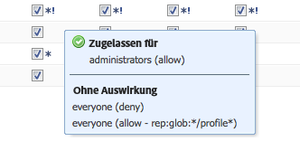

>[!NOTE]
>
>Wenn keine Berechtigungen für eine Seite definiert sind, werden alle Aktionen abgelehnt.

Nachfolgend finden Sie Empfehlungen zum Verwalten von Zugriffssteuerungslisten:

* Weisen Sie Berechtigungen nicht direkt Benutzern zu. Weisen Sie diese nur Gruppen zu.

   Hierdurch wird die Verwaltung vereinfacht, da die Anzahl der Gruppen deutlich kleiner ist als die Anzahl der Benutzer – und damit weniger Schwankungen ausgesetzt ist.

* Wenn eine Gruppe/ein Benutzer nur in der Lage sein soll, Seiten zu ändern, dürfen Sie keine Rechte zum Erstellen oder Ablehnen gewähren. Gewähren Sie in diesem Fall ausschließlich Änderungs- und Leserechte.
* Setzen Sie „Ablehnen“ sparsam ein; verwenden Sie, soweit möglich, nur „Zulassen“.

   Die Verwendung von „Ablehnen“ kann unerwartete Folgen haben, wenn die Berechtigungen in einer anderen Reihenfolge als der erwarteten angewendet werden. Wenn ein Benutzer Mitglied von mehr als einer Gruppe ist, können durch die Anweisungen vom Typ „Ablehnen“ einer Gruppe die Anweisungen vom Typ „Zulassen“ einer anderen Gruppe aufgehoben werden und umgekehrt. Es ist schwierig, in einem solchen Fall den Überblick zu behalten. Unvorhergesehene Ergebnisse sind ohne Weiteres möglich. Durch Zuweisung von „Zulassen“ lassen sich solche Konflikte hingegen ausschließen.

   Adobe empfiehlt, „Zulassen“ statt „Ablehnen“ zu verwenden. Siehe [Best Practices](#best-practices).

Stellen Sie vor dem Ändern einer dieser beiden Berechtigungen sicher, dass Sie wissen, wie diese funktionieren und miteinander verbunden sind. Informationen darüber, wie AEM WCM [Zugriffsrechte bewertet](/help/sites-administering/user-group-ac-admin.md#how-access-rights-are-evaluated), sowie Beispiele zum Einrichten von Zugriffssteuerungslisten finden Sie in der CRX-Dokumentation.

### Berechtigungen {#permissions}

Durch Berechtigungen erhalten Benutzer und Gruppen Zugriff auf AEM-Funktionen auf AEM-Seiten.

Berechtigungen werden pfadweise durch Ein-/Ausblenden der Knoten durchsucht. Außerdem können Sie die Vererbung von Berechtigungen bis zum Stammknoten nachverfolgen.

Um Berechtigungen zuzulassen oder abzulehnen, aktivieren bzw. deaktivieren Sie die entsprechenden Kontrollkästchen.

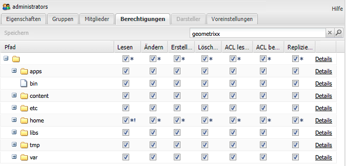

### Anzeigen detaillierter Berechtigungsinformationen {#viewing-detailed-permission-information}

Neben der Rasteransicht stellt AEM eine detaillierte Ansicht der Berechtigungen für ausgewählte Benutzer/Gruppen unter einem bestimmten Pfad bereit. Die Detailansicht liefert zusätzliche Informationen.

Zusätzlich zur Anzeige von Informationen können Sie auch den aktuellen Benutzer oder die aktuelle Gruppe in eine Gruppe einschließen oder daraus ausschließen. Siehe [Hinzufügen von Benutzern oder Gruppen beim Hinzufügen von Berechtigungen](#adding-users-or-groups-while-adding-permissions). Hier durchgeführte Änderungen werden sofort im oberen Abschnitt der Detailansicht wiedergegeben.

Zum Aufrufen der Detailansicht klicken Sie für eine(n) beliebige(n) Gruppe/Benutzer und Pfad auf der Registerkarte **Berechtigungen** auf **Details**.

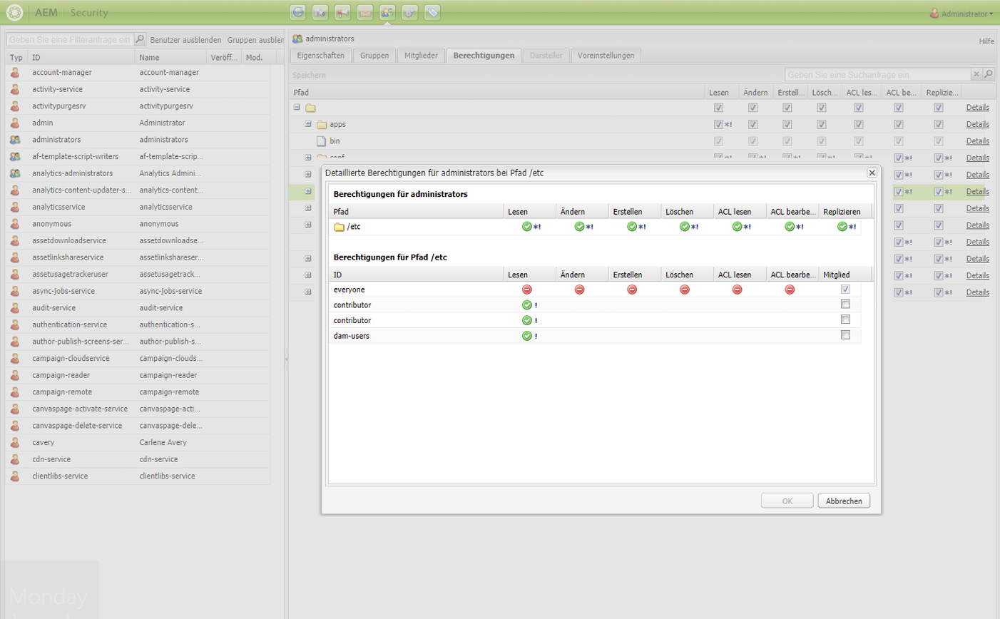

Die Details werden in zwei voneinander getrennten Bereichen angezeigt:

<table>
 <tbody>
  <tr>
   <td>Oberer Teil</td>
   <td>
Wiederholt die im Baumdiagramm angezeigten Informationen. Für jede Aktion wird über ein Symbol angezeigt, ob die Aktion zulässig oder verweigert ist:

    <ul>
     <li>kein Symbol = kein deklarierter Eintrag</li>
     <li>(Häkchen) = deklarierte Aktion (Zulassen)</li>
     <li>(-) = deklarierte Aktion (Ablehnen)</li>
    </ul> </td>
  </tr>
  <tr>
   <td>Unterer Teil</td>
   <td>
Zeigt das Raster der Benutzer und Gruppen an, das Folgendes durchführt:

    <ul>
     <li>Deklariert einen Eintrag für den angegebenen Pfad UND</li>
     <li>Ist die angegebene autorisierbare ODER eine Gruppe?</li>
    </ul> </td>
  </tr>
 </tbody>
</table>

### Stellvertretendes Agieren für andere Benutzer {#impersonating-another-user}

Mit der Funktion [Stellvertretend agieren ](/help/sites-authoring/user-properties.md#user-settings)kann ein Benutzer im Auftrag eines anderen Benutzers arbeiten.

Ein Benutzerkonto kann also andere Konten angeben, die das Benutzerkonto verwenden dürfen. Anders ausgedrückt: Wenn Benutzer B stellvertretend für Benutzer A agieren darf, dann kann Benutzer B Aktionen mit allen Kontodetails von Benutzer A durchführen.

Hierdurch kann der Stellvertreter (Darsteller) Aufgaben so abschließen, als würde er das Konto verwenden, für das er stellvertretend agiert, etwa bei Abwesenheit oder zur kurzfristigen Entlastung anderer überlasteter Benutzer.

>[!NOTE]
>
>Damit die Identität für Benutzer ohne Administratorrechte übernommen werden kann, muss der Darsteller (im obigen Fall Benutzer-B) über LESE-Berechtigungen im Pfad `/home/users` verfügen.
>
>Weitere Informationen zur Vorgehensweise finden Sie unter [Berechtigungen in AEM](/help/sites-administering/security.md#permissions-in-aem).

>[!CAUTION]
>
>Wenn ein Konto stellvertretend für ein anderes Konto agiert, ist dies nur sehr schwer zu erkennen. Ein Eintrag im Auditprotokoll gibt an, wann die Stellvertretung (Personifikation) startet und endet, aber die anderen Protokolldateien (etwa das Zugriffsprotokoll) enthalten keine Informationen darüber, dass Ereignisse stellvertretend ausgeführt wurden. Wenn also Benutzer B stellvertretend für Benutzer A agiert, sieht es so aus, als wären alle Ereignisse persönlich von Benutzer A durchgeführt worden.

>[!CAUTION]
>
>Wird stellvertretend für einen Benutzer agiert, ist es möglich, eine Seite zu sperren. Eine auf diese Weise gesperrte Seite kann nur von dem Benutzer, für den stellvertretend agiert wurde, oder von einem Benutzer mit Administratorrechten entsperrt werden.
>
>Seiten lassen sich nicht entsperren, indem stellvertretend für den Benutzer agiert wird, der die Seite gesperrt hat.

### Best Practices {#best-practices}

Im Folgenden werden Best Practices für die Arbeit mit Berechtigungen und Rechten beschrieben:

| Rule | Grund |
|--- |--- |
| *Benutzergruppen* | Vermeiden Sie die Zuweisung von Zugriffsrechten für einzelne Benutzer. Dafür gibt es mehrere Gründe:<ul><li>Da Sie viel mehr Benutzer als Gruppen haben, vereinfachen Gruppen die Struktur.</li><li>Gruppen bieten einen Überblick über alle Konten.</li> <li>Die Vererbung ist bei Gruppen einfacher.</li><li>Benutzer kommen und gehen. Gruppen sind auf Langfristigkeit ausgelegt.</li></ul> |
| *Positiv sein* | Verwenden Sie immer Anweisungen vom Typ Zulassen , um die Rechte der Gruppe anzugeben (sofern möglich). Vermeiden Sie Anweisungen vom Typ „Ablehnen“. Gruppen werden der Reihe nach bewertet und diese Reihenfolge kann je nach Benutzer unterschiedlich definiert sein. Mit anderen Worten: Sie haben womöglich nur wenig Kontrolle über die Reihenfolge, in der die Anweisungen implementiert und bewertet werden. Wenn Sie ausschließlich Anweisungen vom Typ „Zulassen“ verwenden, spielt die Reihenfolge keine Rolle. |
| *Einfach halten* | Wenn Sie bei der Konfiguration einer Neuinstallation etwas Zeit investieren und nachdenken, wird dies gut bezahlt. Eine klare Struktur vereinfacht die fortlaufende Wartung und Verwaltung, sodass sowohl aktuelle Kollegen als auch Nachfolger die Implementierung problemlos verstehen können. |
| *Test* | Verwenden Sie eine Testinstallation, um zu üben und sicherzustellen, dass Sie die Beziehungen zwischen den verschiedenen Benutzern und Gruppen verstehen. |
| *Standardbenutzer/Gruppen* | Aktualisieren Sie die Standardbenutzer und -gruppen immer sofort nach der Installation, um Sicherheitsprobleme zu vermeiden. |

## Verwalten von Benutzern und Gruppen {#managing-users-and-groups}

Benutzer umfassen Anwender des Systems und von Fremdsystemen, die Anfragen an das System stellen.

Eine Gruppe beinhaltet mehrere Benutzer.

Benutzer und Gruppen können über die Funktion „Benutzerverwaltung“ in der Sicherheitskonsole konfiguriert werden.

### Zugreifen auf die Benutzerverwaltung über die Sicherheitskonsole  {#accessing-user-administration-with-the-security-console}

Der Zugriff auf alle Benutzer, Gruppen, und verbundenen Berechtigungen erfolgt über die Sicherheitskonsole. Alle in diesem Abschnitte beschriebenen Vorgehensweisen werden in diesem Fenster durchgeführt.

Um auf die AEM WCM-Sicherheit zuzugreifen, führen Sie einen der folgenden Schritte aus:

* Klicken Sie im Begrüßungsbildschirm oder in verschiedenen anderen Bereichen in AEM auf das Sicherheitssymbol:

* Navigieren Sie direkt zu `https://<server>:<port>/useradmin`. Achten Sie darauf, sich als Administrator bei AEM anzumelden.

Es wird folgendes Fenster angezeigt:

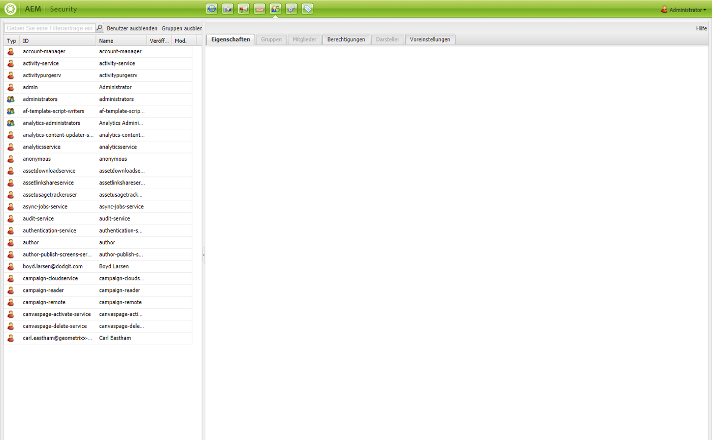

In der linken Struktur sehen Sie alle aktuell im System vorhandenen Benutzer und Gruppen. Sie können die anzuzeigenden Spalten auswählen, den Inhalt der Spalten sortieren und sogar die Reihenfolge ändern, in der die Spalten angezeigt werden, indem Sie die Spaltenüberschrift an eine neue Position ziehen.

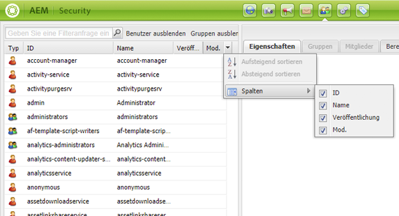

Über die Registerkarten können Sie auf verschiedene Konfigurationen zugreifen:

<!-- ??? in table below. -->

| Tab | Beschreibung |
|--- |--- |
| Filterfeld | Ein Mechanismus zum Filtern der aufgelisteten Benutzer und/oder Gruppen. Siehe [Filtern von Benutzern und Gruppen](#filtering-users-and-groups). |
| Benutzer ausblenden | Ein Umschalter, durch den alle aufgeführten Benutzer ausgeblendet werden, sodass nur Gruppen verbleiben. Siehe [Ausblenden von Benutzern und Gruppen](#hiding-users-and-groups). |
| Gruppen ausblenden | Ein Umschalter, durch den alle aufgelisteten Gruppen ausgeblendet werden, sodass nur Benutzer übrig bleiben. Siehe [Ausblenden von Benutzern und Gruppen](#hiding-users-and-groups). |
| Bearbeiten | Ein Menü, über das Sie Benutzer oder Gruppen erstellen und löschen sowie aktivieren und deaktivieren können. Siehe [Erstellen von Benutzern und Gruppen](#creating-users-and-groups) und [Löschen von Benutzern und Gruppen](#deleting-users-and-groups). |
| Eigenschaften | Listet Informationen über den Benutzer oder die Gruppe auf, die E-Mail-Informationen, eine Beschreibung und Namensinformationen enthalten können. Außerdem können Sie das Kennwort des Benutzers ändern. Siehe [Erstellen von Benutzern und Gruppen](#creating-users-and-groups), [Ändern von Benutzer- und Gruppeneigenschaften](#modifying-user-and-group-properties) und [Ändern eines Benutzerkennworts](#changing-a-user-password). |
| Gruppen | Listet alle Gruppen auf, zu denen der ausgewählte Benutzer oder die ausgewählte Gruppe gehört. Sie können den ausgewählten Benutzer oder die ausgewählte Gruppe zusätzlichen Gruppen zuweisen oder aus Gruppen entfernen. Siehe [Gruppen](#adding-users-or-groups-to-a-group). |
| Mitglieder | Nur für Gruppen verfügbar. Es werden nur die Mitglieder einer bestimmten Gruppe aufgeführt. Siehe [Mitglieder](#members-adding-users-or-groups-to-a-group). |
| Berechtigungen | Sie können einem Benutzer oder einer Gruppe Berechtigungen zuweisen. Hiermit können Sie Folgendes steuern:<ul><li>Berechtigungen für bestimmte Seiten/Knoten. Siehe [Festlegen von Berechtigungen](#setting-permissions). </li><li>Berechtigungen zum Erstellen und Löschen von Seiten und zur Änderung der Hierarchie. ??? Sie können [Berechtigungen zuweisen](#settingprivileges), z. B. Hierarchieänderungen, mit denen Sie Seiten erstellen und löschen können.</li><li>Berechtigungen im Zusammenhang mit [Replikationsberechtigungen](#setting-replication-privileges) (normalerweise vom Autor zur Veröffentlichung) entsprechend einem Pfad.</li></ul> |
| Darsteller | Ermöglicht es einem anderen Benutzer, die Identität des Kontos zu übernehmen. Dies ist nützlich, wenn ein Benutzer stellvertretend für einen anderen Benutzer agieren soll. Siehe [Identität von Benutzern annehmen](#impersonating-another-user). |
| Preferences | Legt [Voreinstellungen für die Gruppe oder den Benutzer](#setting-user-and-group-preferences) fest. etwa Sprachvoreinstellungen. |

### Filtern von Benutzern und Gruppen {#filtering-users-and-groups}

Sie können die Liste durch Eingabe eines Filterausdrucks filtern, der alle nicht dem Ausdruck entsprechenden Benutzer und Gruppen ausblendet. Sie können Benutzer und Gruppen auch über die Schaltflächen [„Benutzer ausblenden“ und „Gruppen ausblenden“](#hiding-users-and-groups) ausblenden.

So filtern Sie Benutzer oder Gruppen:

1. Geben Sie in der linken Strukturliste an der vorgesehenen Stelle den Filterausdruck ein. Durch Eingabe von **admin** werden beispielsweise alle Benutzer und Gruppen, die diese Zeichenfolge enthalten, angezeigt.
1. Klicken Sie auf die Lupe, um die Liste zu filtern.

   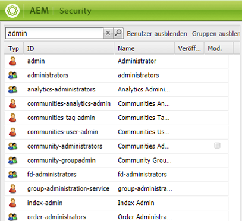

1. Klicken Sie auf **x**, um alle Filter zu entfernen.

### Ausblenden von Benutzern und Gruppen {#hiding-users-and-groups}

Benutzer oder Gruppen auszublenden, ist eine weitere Möglichkeit, um die Liste aller Benutzer und Gruppen in einem System zu filtern. Es gibt zwei Umschaltmechanismen. Durch Klicken auf „Benutzer ausblenden“ können Sie alle Benutzer ausblenden, durch Klicken auf „Gruppen ausblenden“ alle Gruppen. (Es ist nicht möglich, Benutzer und Gruppen gleichzeitig auszublenden.) Informationen zum Filtern der Liste mit einem Filterausdruck finden Sie unter [Filtern von Benutzern und Gruppen](#filtering-users-and-groups).

So blenden Sie Benutzer und Gruppen aus:

1. Klicken Sie in der **Sicherheitskonsole** auf **Benutzer ausblenden** oder **Gruppen ausblenden**. Die ausgewählte Schaltfläche wird hervorgehoben.

   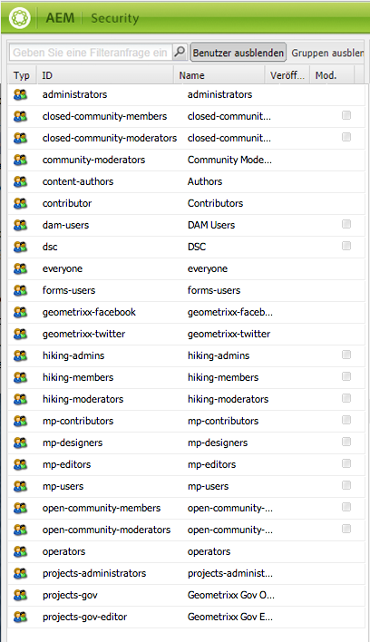

1. Damit die Benutzer oder Gruppen wieder angezeigt werden, klicken Sie erneut auf die entsprechende Schaltfläche.

### Erstellen von Benutzern und Gruppen {#creating-users-and-groups}

So erstellen Sie einen neuen Benutzer oder eine neue Gruppe:

1. Klicken Sie in der Strukturliste der **Sicherheitskonsole** auf **Bearbeiten** und dann entweder auf **Benutzer erstellen** oder **Gruppe erstellen**.

   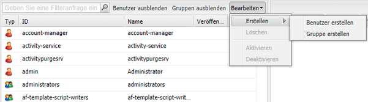

1. Geben Sie jeweils die zum Erstellen eines Benutzers oder einer Gruppe erforderlichen Details ein.

   * Bei Auswahl von **Benutzer erstellen** geben Sie die Anmeldungskennung, den Vor- und Nachnamen, die E-Mail-Adresse und ein Kennwort ein. Standardmäßig erstellt AEM einen Pfad basierend auf dem ersten Buchstaben des Nachnamens. Sie können aber auch einen anderen Pfad festlegen.

   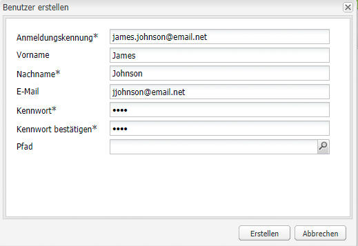

   * Bei Auswahl von **Gruppe erstellen** geben Sie eine Gruppenkennung und eine optionale Beschreibung ein.

   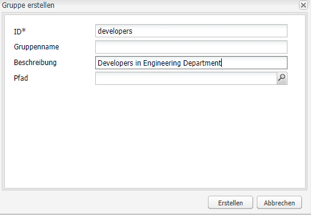

1. Klicken Sie auf **Erstellen**. Der von Ihnen erstellte Benutzer bzw. die von Ihnen erstellte Gruppe wird in der Strukturliste angezeigt.

### Löschen von Benutzern und Gruppen  {#deleting-users-and-groups}

So löschen Sie einen Benutzer oder eine Gruppe:

1. Wählen Sie in der **Sicherheitskonsole** den zu löschenden Benutzer bzw. die zu löschende Gruppe aus. Wenn mehrere Elemente gelöscht werden sollen, wählen Sie diese durch Klicken bei gedrückter Umschalt- oder Strg-Taste aus.
1. Klicken Sie auf **Bearbeiten** und wählen Sie dann „Löschen“. AEM WCM fragt, ob Sie den Benutzer oder die Gruppe löschen möchten.
1. Klicken Sie auf **OK**, um den Vorgang zu bestätigen, oder auf „Abbrechen“, um die Aktion abzubrechen.

### Ändern von Benutzer- und Gruppeneigenschaften {#modifying-user-and-group-properties}

So ändern Sie Benutzer- und Gruppeneigenschaften:

1. Doppelklicken Sie in der **Sicherheitskonsole** auf den Namen des zu ändernden Benutzers bzw. der zu ändernden Gruppe.

1. Klicken Sie auf die Registerkarte **Eigenschaften**, nehmen Sie die erforderlichen Änderungen vor und klicken Sie auf **Speichern**.

   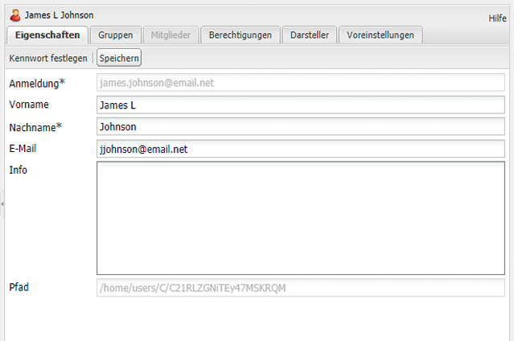

>[!NOTE]
>
>Der Pfad des Benutzers wird unten in den Benutzereigenschaften angezeigt. Er ist unveränderbar.

### Ändern von Benutzerkennwörtern {#changing-a-user-password}

Gehen Sie wie folgt vor, um das Kennwort eines Benutzers zu ändern.

>[!NOTE]
>
>Sie können die Sicherheitskonsole nicht verwenden, um das Administratorkennwort zu ändern. Um das Kennwort für das Admin-Konto zu ändern, verwenden Sie die unter „Granite-Vorgänge“ bereitgestellte [Benutzerkonsole.](/help/sites-administering/granite-user-group-admin.md#changing-the-password-for-an-existing-user)
>
>Wenn Sie AEM Forms on JEE verwenden, verwenden Sie nicht die folgenden Anweisungen, um das Kennwort zu ändern. Verwenden Sie stattdessen AEM Forms on JEE Admin Console (/adminui), um das Kennwort zu ändern.

1. Doppelklicken Sie in der **Sicherheitskonsole** auf den Namen des Benutzers, dessen Kennwort geändert werden soll.
1. Klicken Sie auf die Registerkarte **Eigenschaften** (sofern noch nicht aktiv).
1. Klicken Sie auf **Kennwort festlegen**. Daraufhin wird das Fenster „Kennwort festlegen“ geöffnet, in dem Sie das Kennwort ändern können.

   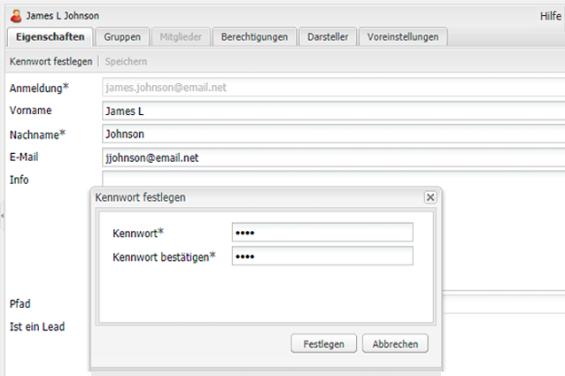

1. Geben Sie das neue Kennwort zweimal ein. Da es nicht als Klartext angezeigt wird, dient dies zur Bestätigung. Wenn die Eingaben nicht übereinstimmen, zeigt das System einen Fehler an.
1. Klicken Sie auf **Festlegen**, um das neue Kennwort für das Konto zu aktivieren.

### Hinzufügen von Benutzern oder Gruppen zu einer Gruppe  {#adding-users-or-groups-to-a-group}

AEM bietet drei Möglichkeiten, um einer vorhandenen Gruppe Benutzer oder Gruppen hinzuzufügen:

* Über das Gruppenprofil können Sie Mitglieder (Benutzer oder Gruppen) hinzufügen.
* Über das Mitgliederprofil können Sie Gruppen Mitglieder hinzufügen.
* Beim Arbeiten an Berechtigungen können Sie Gruppen Mitglieder hinzufügen.

### Gruppen – Hinzufügen von Benutzern oder Gruppen zu einer Gruppe  {#groups-adding-users-or-groups-to-a-group}

Auf der Registerkarte **Gruppen** wird angezeigt, zu welchen Gruppen das aktuelle Konto gehört. Hier können Sie einer Gruppe das ausgewählte Konto hinzuzufügen:

1. Doppelklicken Sie auf den Namen des Kontos (Benutzer oder Gruppe), das einer Gruppe zugewiesen werden soll.
1. Klicken Sie auf die Registerkarte **Gruppen**. Daraufhin wird eine Liste der Gruppen angezeigt, denen das Konto bereits angehört.
1. Klicken Sie in der Strukturliste auf den Namen der Gruppe, die dem Konto hinzugefügt werden soll, und ziehen Sie die Gruppe in den Bereich **Gruppen**. (Wenn mehrere Benutzer hinzugefügt werden sollen, klicken Sie bei gedrückter Umschalt- oder Strg-Taste auf die entsprechenden Namen und ziehen Sie diese.)

   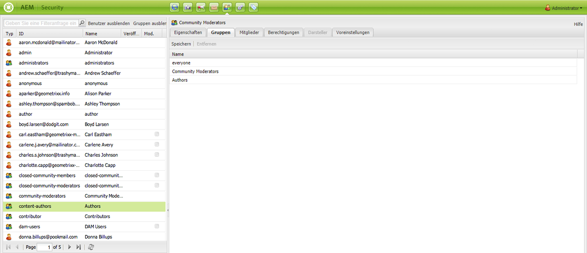

1. Klicken Sie auf **Speichern**, um Ihre Änderungen zu speichern.

### Mitglieder – Hinzufügen von Benutzern oder Gruppen zu einer Gruppe {#members-adding-users-or-groups-to-a-group}

Auf der Registerkarte **Mitglieder**, die nur für Gruppen verwendet werden kann, wird angezeigt, welche Benutzer und Gruppen zur aktuellen Gruppe gehören. Hier können Sie einer Gruppe Konten hinzufügen:

1. Doppelklicken Sie auf den Namen der Gruppe, der Mitglieder hinzugefügt werden sollen.
1. Klicken Sie auf die Registerkarte **Mitglieder**. Daraufhin wird eine Liste der Mitglieder angezeigt, die bereits zu dieser Gruppe gehören.
1. Klicken Sie in der Strukturliste auf den Namen des Mitglieds, das der Gruppe hinzugefügt werden soll, und ziehen Sie das Mitglied in den Bereich **Mitglieder**. (Wenn mehrere Benutzer hinzugefügt werden sollen, klicken Sie bei gedrückter Umschalt- oder Strg-Taste auf die entsprechenden Namen und ziehen Sie diese.)

   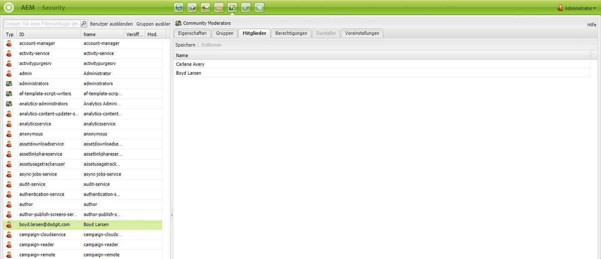

1. Klicken Sie auf **Speichern**, um Ihre Änderungen zu speichern.

### Hinzufügen von Benutzern oder Gruppen beim Hinzufügen von Berechtigungen {#adding-users-or-groups-while-adding-permissions}

So fügen Sie einer Gruppe unter einem bestimmten Pfad Mitglieder hinzu:

1. Doppelklicken Sie auf den Namen der Gruppen oder Benutzer, denen Benutzer hinzugefügt werden sollen.

1. Klicken Sie auf die Registerkarte **Berechtigungen**.

1. Navigieren Sie zu dem Pfad, dem Berechtigungen hinzugefügt werden sollen, und klicken Sie auf **Details**. Im unteren Abschnitt des Detailfensters finden Sie Informationen darüber, wer Berechtigungen für diese Seite besitzt.

   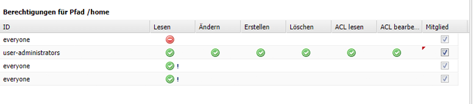

1. Aktivieren Sie das Kontrollkästchen in der Spalte **Mitglied** für die Mitglieder, die Berechtigungen für diesen Pfad erhalten sollen. Deaktivieren Sie das Kontrollkästchen für die Mitglieder, denen Berechtigungen entzogen werden sollen. In der von Ihnen geänderten Zelle wird ein rotes Dreieck angezeigt.
1. Klicken Sie auf **OK**, um die Änderungen zu speichern.

### Entfernen von Benutzern oder Gruppen aus Gruppen {#removing-users-or-groups-from-groups}

AEM bietet drei Möglichkeiten, um Benutzer oder Gruppen aus einer Gruppe zu entfernen:

* Über das Gruppenprofil können Sie Mitglieder (Benutzer oder Gruppen) entfernen.
* Über das Mitgliederprofil können Sie Mitglieder aus Gruppen entfernen.
* Beim Arbeiten an Berechtigungen können Sie Mitglieder aus Gruppen entfernen.

### Gruppen – Entfernen von Benutzern oder Gruppen aus Gruppen {#groups-removing-users-or-groups-from-groups}

So entfernen Sie ein Benutzer- oder Gruppenkonto aus einer Gruppe:

1. Doppelklicken Sie auf den Namen des Gruppen- oder Benutzerkontos, das aus einer Gruppe entfernt werden soll.
1. Klicken Sie auf die Registerkarte **Gruppen**. Sie sehen, welchen Gruppen das ausgewählte Konto angehört.
1. Klicken Sie im Bereich **Gruppen** auf den Namen des Benutzer- oder Gruppenkontos, das aus der Gruppe entfernt werden soll, und klicken Sie auf **Entfernen**. (Wenn mehrere Konten entfernt werden sollen, klicken Sie bei gedrückter Umschalt- oder Strg-Taste auf die entsprechenden Namen und dann auf **Entfernen**.)

   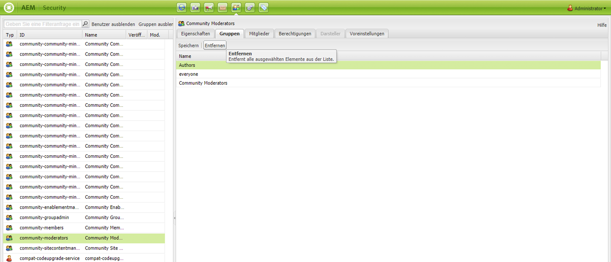

1. Klicken Sie auf **Speichern**, um Ihre Änderungen zu speichern.

### Mitglieder – Entfernen von Benutzern oder Gruppen aus Gruppen {#members-removing-users-or-groups-from-groups}

So entfernen Sie Konten aus einer Gruppe:

1. Doppelklicken Sie auf den Namen der Gruppe, aus der Mitglieder entfernt werden sollen.
1. Klicken Sie auf die Registerkarte **Mitglieder**. Daraufhin wird eine Liste der Mitglieder angezeigt, die bereits zu dieser Gruppe gehören.
1. Klicken Sie im Bereich **Mitglieder** auf den Namen des Mitglieds, das aus der Gruppe entfernt werden soll, und klicken Sie auf **Entfernen**. (Wenn mehrere Benutzer entfernt werden sollen, klicken Sie bei gedrückter Umschalt- oder Strg-Taste auf die entsprechenden Namen und dann auf **Entfernen**.)

   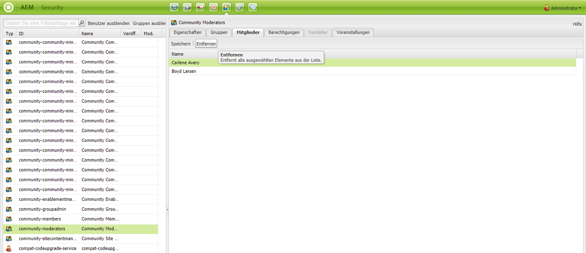

1. Klicken Sie auf **Speichern**, um Ihre Änderungen zu speichern.

### Entfernen von Benutzern oder Gruppen beim Hinzufügen von Berechtigungen {#removing-users-or-groups-while-adding-permissions}

So entfernen Sie Mitglieder aus einer Gruppe unter einem bestimmten Pfad:

1. Doppelklicken Sie auf den Namen der Gruppen oder Benutzer, für die Benutzer entfernt werden sollen.

1. Klicken Sie auf die Registerkarte **Berechtigungen**.

1. Navigieren Sie zu dem Pfad, dem Berechtigungen entfernt werden sollen, und klicken Sie auf **Details**. Im unteren Abschnitt des Detailfensters finden Sie Informationen darüber, wer Berechtigungen für diese Seite besitzt.

   

1. Aktivieren Sie das Kontrollkästchen in der Spalte **Mitglied** für die Mitglieder, die Berechtigungen für diesen Pfad erhalten sollen. Deaktivieren Sie das Kontrollkästchen für die Mitglieder, denen Berechtigungen entzogen werden sollen. In der von Ihnen geänderten Zelle wird ein rotes Dreieck angezeigt.
1. Klicken Sie auf **OK**, um die Änderungen zu speichern.

### Benutzersynchronisierung {#user-synchronization}

Wenn es sich bei der Bereitstellung um eine [Veröffentlichungsfarm](/help/sites-deploying/recommended-deploys.md#tarmk-farm) handelt, müssen Benutzer und Gruppen zwischen allen Veröffentlichungsknoten synchronisiert werden.

Informationen zur Benutzersynchronisierung und deren Aktivierung finden Sie unter [Benutzersynchronisierung](/help/sites-administering/sync.md).

## Verwalten von Berechtigungen  {#managing-permissions}

>[!NOTE]
>
>Adobe hat eine neue Hauptansicht für die Berechtigungsverwaltung eingeführt, die auf einer Touch-Benutzeroberfläche basiert. Weitere Informationen zu ihrer Verwendung finden Sie [auf dieser Seite](/help/sites-administering/touch-ui-principal-view.md).

Dieser Abschnitt beschreibt, wie Berechtigungen, darunter auch die zur Replikation, festgelegt werden.

### Festlegen von Berechtigungen {#setting-permissions}

Durch Berechtigungen können Benutzer bestimmte Aktionen für Ressourcen unter bestimmten Pfade durchführen. Dazu gehört auch das Erstellen oder Löschen von Seiten.

So fügen Sie Berechtigungen hinzu bzw. ändern oder löschen diese:

1. Doppelklicken Sie in der **Sicherheitskonsole** auf den Namen des Benutzers bzw. der Gruppe, für den bzw. die Berechtigungen festgelegt werden sollen, oder [suchen Sie nach Knoten](#searching-for-nodes).

1. Klicken Sie auf die Registerkarte **Berechtigungen**.

   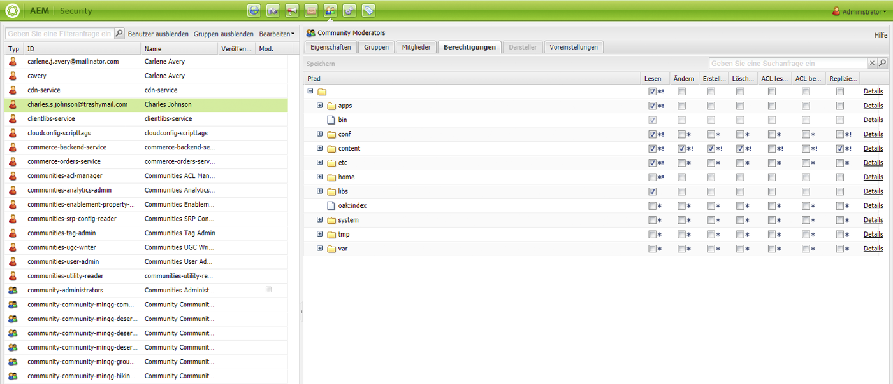

1. Aktivieren Sie im Strukturraster das entsprechende Kontrollkästchen, um zuzulassen, dass der ausgewählte Benutzer oder die ausgewählte Gruppe eine Aktion durchführen kann, oder deaktivieren Sie das entsprechende Kontrollkästchen, um abzulehnen, dass der ausgewählte Benutzer oder die ausgewählte Gruppe eine Aktion durchführen kann. Um weitere Informationen zu erhalten, klicken Sie auf **Details**.

1. Klicken Sie abschließend auf **Speichern**.

### Festlegen von Replikationsberechtigungen {#setting-replication-privileges}

Die Replikationsberechtigung bezeichnet das Recht zur Veröffentlichung von Inhalten. Sie kann für Gruppen und Benutzer festgelegt werden.

>[!NOTE]
>
>* Alle auf eine Gruppe angewendeten Replikationsrechte gelten für alle Benutzer in dieser Gruppe.
>* Die Replikationsberechtigungen eines Benutzers ersetzen die Replikationsberechtigungen einer Gruppe.
>* Die Replikationsrechte „Zulassen“ haben Vorrang vor den Replikationsrechten „Ablehnen“. Weitere Informationen finden Sie unter [Berechtigungen in AEM](#permissions-in-aem) .

>

So legen Sie Replikationsberechtigungen fest:

1. Wählen Sie den Benutzer oder die Gruppe aus der Liste aus, doppelklicken Sie zum Öffnen und klicken Sie auf **Berechtigungen**.
1. Navigieren Sie im Raster zu dem Pfad, unter dem der Benutzer Replikationsberechtigungen besitzen soll, oder [suchen Sie nach Knoten.](#searching-for-nodes)

1. Aktivieren Sie in der Spalte **Replizieren** im ausgewählten Pfad das Kontrollkästchen, um eine Replikationsberechtigung für diesen Benutzer oder diese Gruppe hinzuzufügen, oder deaktivieren Sie das Kontrollkästchen, um die Replikationsberechtigung aufzuheben. In AEM wird ein rotes Dreieck dort angezeigt, wo Sie Änderungen vorgenommen, aber noch nicht gespeichert haben.

   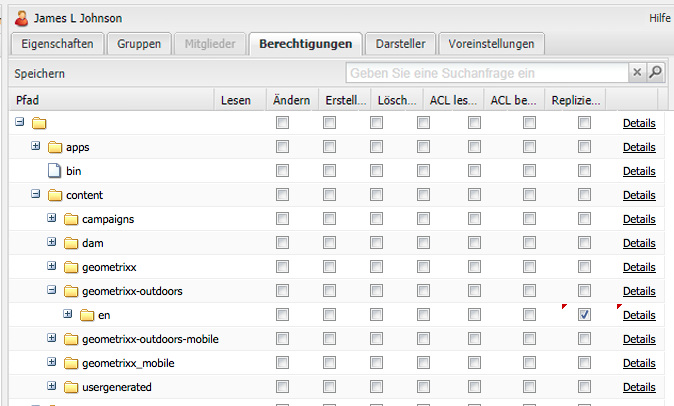

1. Klicken Sie auf **Speichern**, um Ihre Änderungen zu speichern.

### Suchen nach Knoten  {#searching-for-nodes}

Beim Hinzufügen oder Entfernen von Berechtigungen können Sie Knoten durchsuchen oder nach Knoten suchen.

Es gibt zwei verschiedene Typen von Pfadsuchvorgängen:

* Pfadsuche – Wenn die Suchzeichenfolge mit „/“ beginnt, wird nach den direkt untergeordneten Knoten des angegebenen Pfads gesucht:

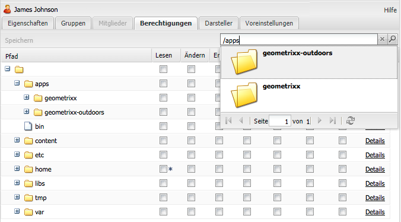

Im Suchfeld stehen Ihnen folgende Möglichkeiten zur Verfügung:

| Aktion | Funktion |
|--- |--- |
| Nach-rechts-Pfeiltaste | Auswahl eines Unterknotens im Suchergebnis |
| Nach-unten-Pfeiltaste | Startet die Suche erneut. |
| Eingabetaste | Wählt einen Unterknoten aus und lädt ihn in den Ordner |

* Volltextsuche – Wenn die Suchzeichenfolge nicht mit „/“ beginnt, wird eine Volltextsuche in allen Knoten unter dem Pfad /content ausgeführt.

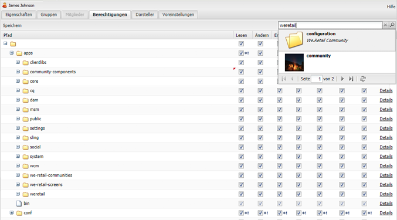

So führen Sie eine Pfad- oder Volltextsuche durch:

1. Wählen Sie in der Sicherheitskonsole einen Benutzer oder eine Gruppe aus und klicken Sie dann auf die Registerkarte **Berechtigungen**.

1. Geben Sie einen Suchbegriff in das Suchfeld ein.

### Stellvertretendes Agieren für Benutzer {#impersonating-users}

Sie können einen oder mehr Benutzer angeben, die stellvertretend für den aktuellen Benutzer agieren dürfen. Dies bedeutet, dass diese Benutzer von ihren eigenen Kontoeinstellungen zu denen des aktuellen Benutzers wechseln und in dessen Auftrag handeln können.

Seien Sie beim Verwenden dieser Funktion vorsichtig, da sie es Benutzern ermöglicht, Aktionen durchzuführen, zu denen sie selbst nicht berechtigt sind. Wenn Benutzer für einen anderen Benutzer stellvertretend agieren, werden sie benachrichtigt, dass sie nicht mit dem eigenen Profil angemeldet sind.

Diese Funktion empfiehlt sich für verschiedene Szenarien, z. B.:

* Wenn Sie nicht im Büro sind, können Sie während Ihrer Abwesenheit einen anderen Benutzer stellvertretend agieren lassen. Mithilfe dieser Funktion können Sie sicherstellen, dass ein anderer Benutzer über Ihre Zugriffsrechte verfügt und Sie weder ein Benutzerprofil ändern noch Ihr Kennwort herausgeben müssen.
* Sie können die Funktion zum Debuggen verwenden, etwa um nachzuvollziehen, wie eine Website für Benutzer mit beschränkten Zugriffsrechten aussieht. Wenn ein Benutzer technische Probleme meldet, können Sie außerdem stellvertretend für diesen Benutzer agieren, um das Problem zu diagnostizieren und zu beheben.

So agieren Sie stellvertretend für einen vorhandenen Benutzer:

1. Wählen Sie in der Strukturliste den Namen des Benutzers aus, dem andere Benutzer zum stellvertretenden Agieren zugewiesen werden sollen. Doppelklicken Sie zum Öffnen darauf.
1. Klicken Sie auf die Registerkarte **Darsteller**.
1. Klicken Sie auf den Benutzer, der stellvertretend für den ausgewählten Benutzer agieren können soll. Ziehen Sie den Benutzer (der stellvertretend agieren wird) aus der Liste in den Bereich „Darsteller“. Der Name wird in der Liste angezeigt.

   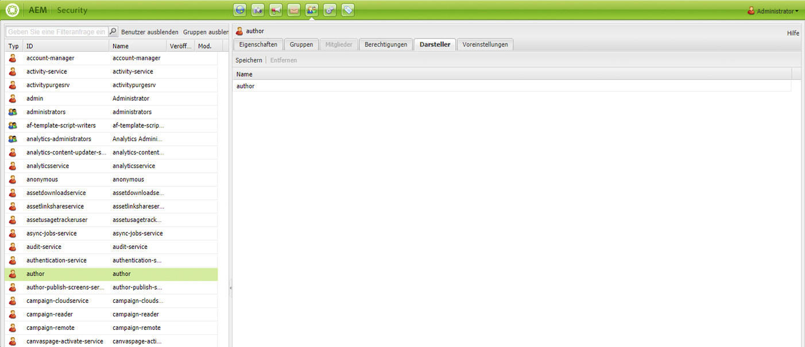

1. Klicken Sie auf **Speichern**.

### Festlegen von Benutzer- und Gruppenvoreinstellungen {#setting-user-and-group-preferences}

So legen Sie Benutzer- und Gruppenvoreinstellungen fest, einschließlich Voreinstellungen für die Sprache, Fensterverwaltung und Symbolleiste:

1. Wählen Sie in der linken Struktur den Benutzer bzw. die Gruppe aus, dessen bzw. deren Voreinstellungen geändert werden sollen. Um mehrere Benutzer oder Gruppen auszuwählen, klicken Sie bei gedrückter Strg- oder Umschalttaste.
1. Klicken Sie auf die Registerkarte **Voreinstellungen**.

   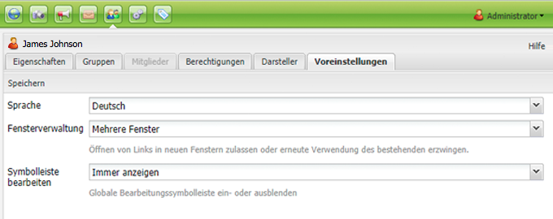

1. Nehmen Sie nach Bedarf Änderungen an den Gruppen- oder Benutzereinstellungen vor und klicken Sie abschließend auf **Speichern**.

### Einrichten von Benutzern oder Administratoren mit der Berechtigung zum Verwalten anderer Benutzer  {#setting-users-or-administrators-to-have-the-privilege-to-manage-other-users}

So richten Sie Benutzer oder Administratoren mit Berechtigungen zum Löschen/Aktivieren/Deaktivieren anderer Benutzer ein:

1. Fügen Sie den Benutzer, der zum Verwalten anderer Benutzer berechtigt werden soll, der Administratorgruppe hinzu und speichern Sie Ihre Änderungen.

   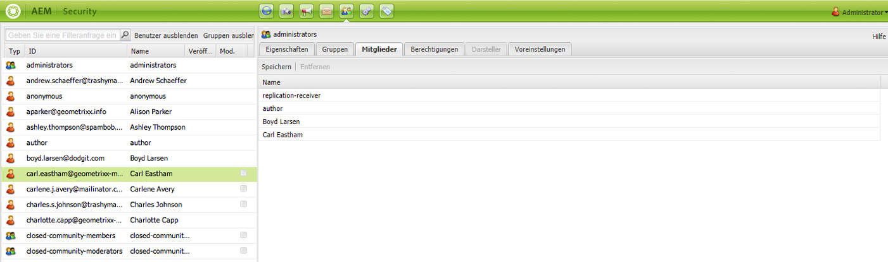

1. Navigieren Sie auf der Registerkarte **Berechtigungen** des Benutzers zu „/“ und aktivieren Sie in der Spalte „Replizieren“ das Kontrollkästchen zum Zulassen einer Replikation unter „/“. Klicken Sie dann auf **Speichern**.

   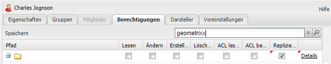

   Der ausgewählte Benutzer ist nun in der Lage, Benutzer zu deaktivieren, zu aktivieren, zu löschen und zu erstellen.

### Erweitern von Berechtigungen auf Projektebene  {#extending-privileges-on-a-project-level}

Wenn Sie anwendungsspezifische Berechtigungen umsetzen möchten, finden Sie im Folgenden alle erforderlichen Informationen zur Implementierung benutzerdefinierter Berechtigungen und zu ihrer CQ-weiten Durchsetzung:

Die Berechtigung zur Änderung der Hierarchie wird durch eine Kombination von jcr-Berechtigungen abgedeckt. Die Replikationsberechtigung erhält den Namen **crx:replicate** , der zusammen mit anderen Berechtigungen für das jcr-Repository gespeichert/ausgewertet wird. Sie wird jedoch nicht auf jcr-Ebene durchgesetzt.

Die Definition und Registrierung von benutzerdefinierten Berechtigungen ist ab Version 2.4 offiziell Bestandteil der [Jackrabbit API](https://jackrabbit.apache.org/api/2.8/org/apache/jackrabbit/api/security/authorization/PrivilegeManager.html) (siehe auch [JCR-2887](https://issues.apache.org/jira/browse/JCR-2887)). Die weitere Verwendung wird durch die JCR-Zugriffssteuerungsverwaltung abgedeckt, z. B. definiert durch [JSR 283](https://jcp.org/en/jsr/detail?id=283) (Abschnitt 16). Außerdem definiert die Jackrabbit-API verschiedene Erweiterungen.

Der Mechanismus zur Registrierung von Berechtigungen spiegelt sich in der Benutzeroberfläche unter **Repository-Konfiguration** wider.

Die Registrierung neuer (benutzerdefinierter) Berechtigungen ist selbst durch eine integrierte Berechtigung geschützt, die auf Repository-Ebene (in JCR: Übergeben von &quot;null&quot;als Parameter &quot;absPath&quot;in die ac-mgt-API (weitere Informationen finden Sie unter jsr 333 ). Standardmäßig wird **admin** und allen Mitgliedern von Administratoren diese Berechtigung gewährt.

>[!NOTE]
>
>Zwar erfolgen im Rahmen der Implementierung sowohl die Validierung als auch die Bewertung der benutzerdefinierten Berechtigungen, durchgesetzt werden sie jedoch nur in Form von Aggregaten integrierter Berechtigungen.
