# Konfigurieren der Segmentierung mit ContextHub {#configuring-segmentation-with-contexthub}

>[!NOTE]
>
>Dieser Abschnitt beschreibt das Konfigurieren der Segmentierung unter Verwendung von ContextHub. Wenn Sie die ClientContext-Funktion verwenden, rufen Sie die entsprechende Dokumentation zum [Konfigurieren der Segmentierung für ClientContext](/help/sites-administering/campaign-segmentation.md) auf.


Die Segmentierung ist bei der Erstellung einer Kampagne eine grundlegende Überlegung. Unter [Verwalten von Zielgruppen](/help/sites-authoring/managing-audiences.md) finden Sie Informationen zur Funktionsweise der Segmentierung sowie zu Schlüsselbegriffen.

Je nach den von Ihnen bereits zu den Besuchern Ihrer Site erfassten Informationen sowie je nach Ihren angepeilten Zielen müssen Sie die erforderlichen Segmente und Strategien für Ihre zielgerichteten Inhalte festlegen.

Diese Segmente werden dann verwendet, um einem Besucher gezielt bestimmte Inhalte anzuzeigen. Dieser Inhalt wird im Abschnitt [Personalisierung](/help/sites-authoring/personalization.md) der Website verwaltet. Hier festgelegte [Aktivitäten](/help/sites-authoring/activitylib.md) können auf jeder Seite einbezogen werden – und sie können bestimmen, auf welches Besuchersegment die spezialisierten Inhalte angewendet werden sollen.

AEM ermöglicht Ihnen die einfache Personalisierung Ihres Benutzererlebnisses. Außerdem können Sie damit die Ergebnisse Ihrer Segmentdefinitionen überprüfen.

## Zugriff auf Segmente {#accessing-segments}

Die [Zielgruppen-Konsole](/help/sites-authoring/managing-audiences.md) wird verwendet, um Segmente für ContextHub oder ClientContext sowie Zielgruppen für Ihr Adobe Target-Konto zu verwalten. Diese Dokumentation befasst sich mit der Verwaltung von Segmenten für ContextHub. Weitere Informationen zu [ClientContext-Segmenten](/help/sites-administering/campaign-segmentation.md) und Adobe Target-Segmenten finden Sie in der entsprechenden Dokumentation.

Zum Zugriff auf Ihre Segmente wählen Sie in der globalen Navigation die Optionen **Navigation > Personalisierung > Zielgruppen** aus.

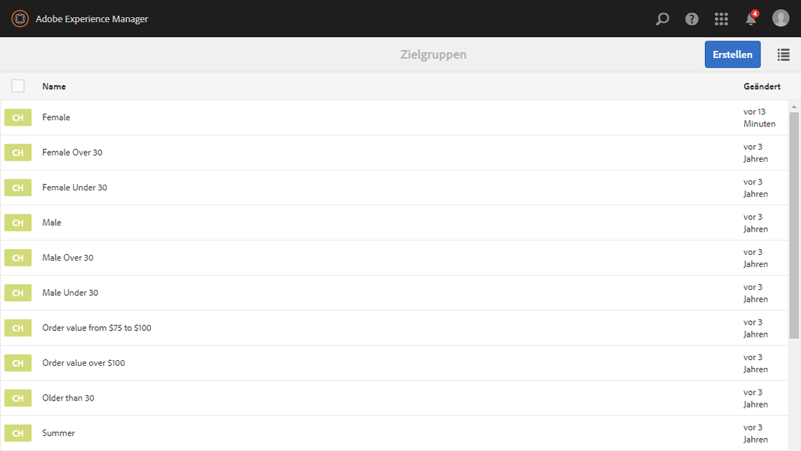

## Segmenteditor {#segment-editor}

Der **Segmenteditor** ermöglicht Ihnen die einfache Veränderung eines Segments. Wählen Sie zur Bearbeitung eines Segments ein Segment aus der [Liste von Segmenten](/help/sites-administering/segmentation.md#accessing-segments) aus und klicken Sie auf die Schaltfläche **Bearbeiten**.

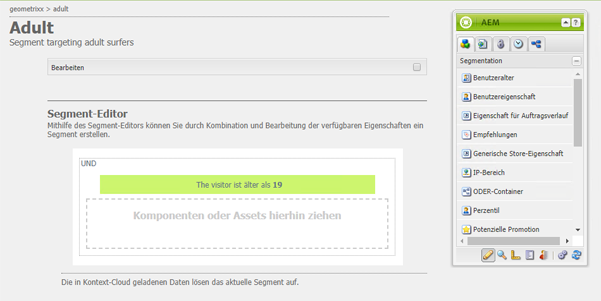

Mithilfe des Komponenten-Browsers können Sie **UND**- und **ODER**-Container zur Festlegung der Segmentlogik und anschließend zusätzliche Komponenten zum Vergleich von Eigenschaften und Werten oder Referenzskripts oder anderen Segmenten zur Definition der Auswahlkriterien (siehe [Erstellen eines neuen Segments](#creating-a-new-segment)) hinzufügen, um das genaue Szenario für die Auswahl des Segments festzulegen.

Wenn die gesamte Anweisung mit „true“ bewertet wurde, wird das Segment aufgelöst. Falls mehrere Segmente zutreffen, wird außerdem der Faktor **Verstärken** verwendet. Weitere Informationen zum Faktor [Verstärken finden Sie unter ](/help/sites-administering/campaign-segmentation.md#boost-factor) unter Erstellen eines neuen Segments](#creating-a-new-segment) .[

>[!CAUTION]
>
>Der Segmenteditor prüft nicht auf Zirkelbezüge. Ein Beispiel hierfür wäre, wenn Segment A auf ein anderes Segment B verweist, das wiederum auf Segment A verweist. Sie müssen sicherstellen, dass Ihre Segmente keine Zirkelbezüge enthalten.

### Container {#containers}

Die folgenden Container sind standardmäßig verfügbar und ermöglichen Ihnen die Gruppierung von Vergleichen und Verweisen zum Zweck einer booleschen Bewertung. Sie können vom Komponentenbrowser in den Editor gezogen werden. Im folgenden Abschnitt [Verwenden von UND- und ODER-Containern](/help/sites-administering/segmentation.md#using-and-and-or-containers) erhalten Sie weitere Informationen.

<table>
 <tbody>
  <tr>
   <td>UND-Container<br /> </td>
   <td>Der boolesche UND-Operator<br /> </td>
  </tr>
  <tr>
   <td>ODER-Container<br /> </td>
   <td>Der boolesche ODER-Operator</td>
  </tr>
 </tbody>
</table>

### Vergleiche {#comparisons}

Die folgenden Segmentvergleiche sind standardmäßig für die Bewertung der Segmenteigenschaften verfügbar. Sie können vom Komponentenbrowser in den Editor gezogen werden.

<table>
 <tbody>
  <tr>
   <td>Eigenschaft-Wert<br /> </td>
   <td>Vergleicht eine Eigenschaft eines Geschäfts mit einem definierten Wert<br /> </td>
  </tr>
  <tr>
   <td>Eigenschaft-Eigenschaft</td>
   <td>Vergleicht eine Eigenschaft eines Geschäfts mit einer anderen Eigenschaft<br /> </td>
  </tr>
  <tr>
   <td>Eigenschaft-Segment-Referenz</td>
   <td>Vergleicht eine Eigenschaft eines Geschäfts mit einem anderen referenzierten Segment<br /> </td>
  </tr>
  <tr>
   <td>Eigenschaft-Skript-Referenz</td>
   <td>Vergleicht eine Eigenschaft eines Geschäfts mit den Ergebnissen eines Skripts<br /> </td>
  </tr>
  <tr>
   <td>Segment-Referenz-Skript-Referenz</td>
   <td>Vergleicht ein referenziertes Segment mit den Ergebnissen eines Skripts<br /> </td>
  </tr>
 </tbody>
</table>

>[!NOTE]
>
>Ist der Datentyp beim Vergleich von Werten nicht festgesetzt (d. h. auf „auto detect“ eingestellt), vergleicht die Segmentierungs-Engine von ContextHub die Werte einfach auf die Art und Weise, wie auch JavaScript es tun würde. Sie verteilt keine Werte an die erwarteten Typen, was zu irreführenden Ergebnissen führen kann. Beispiel:
>
>`null < 30 // will return true`
>
>Daher sollten Sie beim [Erstellen eines Segments](/help/sites-administering/segmentation.md#creating-a-new-segment) immer einen **Datentyp** auswählen, wenn die Typen der verglichenen Werte bekannt sind. Beispiel:
>
>Beim Vergleich der Eigenschaft `profile/age` wissen Sie bereits, dass der verglichene Typ **number** sein wird. Selbst wenn `profile/age` nicht festgelegt ist, wird ein Vergleich von `profile/age` unter 30 wie erwartet **false** ergeben.

### Verweise {#references}

Die folgenden Verweise sind standardmäßig für die direkte Verknüpfung eines Skripts oder eines anderen Segments verfügbar. Sie können vom Komponentenbrowser in den Editor gezogen werden.

<table>
 <tbody>
  <tr>
   <td>Segment-Referenz<br /> </td>
   <td>Bewerten Sie das referenzierte Segment.</td>
  </tr>
  <tr>
   <td>Skript-Referenz</td>
   <td>Bewerten Sie das referenzierte Skript. Weitere Informationen finden Sie im folgenden Abschnitt <a href="/help/sites-administering/segmentation.md#using-script-references">Verwenden von Skript-Referenzen</a>.</td>
  </tr>
 </tbody>
</table>

## Erstellen eines neuen Segments {#creating-a-new-segment}

So legen Sie Ihr neues Segment fest:

1. Navigieren Sie nach dem [Zugriff auf die Segmente](/help/sites-administering/segmentation.md#accessing-segments) [zu dem Ordner](#organizing-segments), in dem Sie das Segment erstellen möchten, oder belassen Sie es im Stammverzeichnis.

1. Klicken oder tippen Sie auf die Schaltfläche Erstellen und wählen Sie **ContextHub-Segment erstellen** aus.

   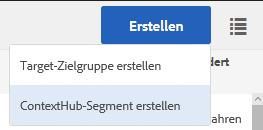

1. Geben Sie unter **Neues ContextHub-Segment** einen Titel für das Segment sowie bei Bedarf einen Verstärkungswert ein und tippen oder klicken Sie auf **Erstellen**.

   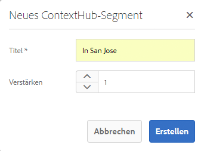

   Jedes Segment verfügt über einen Verstärkungsparameter, der als Gewichtungsfaktor verwendet wird. Eine höhere Zahl zeigt an, dass das Segment in Instanzen mit mehreren gültigen Segmenten bei der Auswahl gegenüber einem Segment mit einer niedrigeren Zahl bevorzugt wird.

   * Mindestwert: `0`
   * Höchstwert: `1000000`

1. Ziehen Sie einen Vergleich oder Verweis in den Segmenteditor. Der Vergleich oder Verweis wird dann im standardmäßigen UND-Container angezeigt.
1. Doppelklicken oder tippen Sie auf die Konfigurationsoption des neuen Verweises oder Segments, um die spezifischen Parameter zu bearbeiten. In diesem Beispiel prüfen wir auf Personen in San José.

   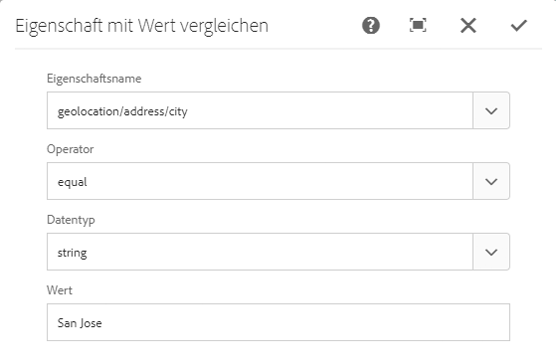

   Legen Sie möglichst immer einen **Datentyp** fest, um die ordnungsgemäße Bewertung Ihrer Vergleiche sicherzustellen. Weitere Informationen finden Sie unter [Vergleiche](/help/sites-administering/segmentation.md#comparisons).

1. Klicken Sie auf **OK**, um Ihre Definition zu speichern:
1. Fügen Sie bei Bedarf weitere Komponenten hinzu. Sie können boolesche Ausdrücke anhand der Containerkomponenten für UND- und ODER-Vergleiche formulieren (siehe [Verwenden von UND- und ODER-Containern](/help/sites-administering/segmentation.md#using-and-and-or-containers) weiter unten). Mit dem Segmenteditor können Sie nicht mehr benötigte Komponenten löschen oder diese an neue Positionen innerhalb der Anweisung ziehen.

### Verwenden von UND- und ODER-Containern   {#using-and-and-or-containers}

Mithilfe von UND- und ODER-Containerkomponenten können Sie komplexe Segmente in AEM erstellen. Hierbei ist es hilfreich, sich einige grundlegende Punkte bewusst zu machen:

* Die oberste Ebene der Definition ist immer der ursprünglich erstellte UND-Container. Dies kann nicht verändert werden, hat allerdings auch keine Auswirkungen auf den Rest der Segmentdefinition.
* Stellen Sie sicher, dass die Verschachtelung Ihrer Container Sinn ergibt. Die Container können als die Klammern Ihres booleschen Ausdrucks betrachtet werden.

Das folgende Beispiel wird zur Auswahl von Besuchern verwendet, die zu unserer wichtigsten Alterszielgruppe gehören:

Männlich und zwischen 30 und 59

ODER

Weiblich und zwischen 30 und 59

Beginnen Sie damit, eine ODER-Container-Komponente innerhalb des standardmäßigen UND-Containers zu platzieren. Innerhalb des ODER-Containers fügen Sie zwei UND-Container hinzu. In beiden können Sie die Eigenschaften- oder Referenzkomponenten hinzufügen.

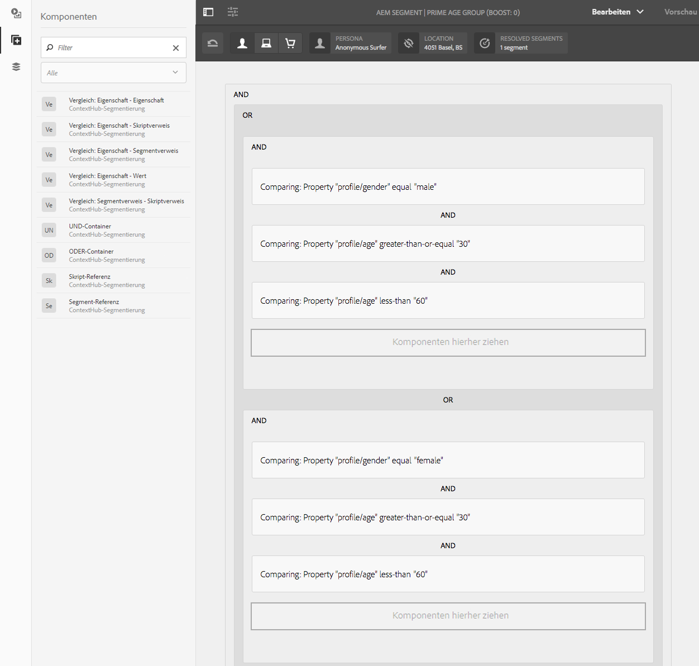

### Verwenden von Skript-Referenzen {#using-script-references}

Durch die Verwendung der Skript-Referenzkomponente kann die Bewertung einer Segmenteigenschaft an ein externes Skript delegiert werden. Sobald das Skript ordnungsgemäß konfiguriert ist, kann es als eine beliebige andere Komponente einer Segmentbedingung verwendet werden.

#### Definieren eines Skripts für einen Verweis   {#defining-a-script-to-reference}

1. Fügen Sie die Datei zur clientlib `contexthub.segment-engine.scripts` hinzu.
1. Implementieren Sie eine Funktion, durch die ein Wert ausgegeben wird. Beispiel:

   ```
   ContextHub.console.log(ContextHub.Shared.timestamp(), '[loading] contexthub.segment-engine.scripts - script.profile-info.js');
   
   (function() {
       'use strict';
   
       /**
        * Sample script returning profile information. Returns user info if data is available, false otherwise.
        *
        * @returns {Boolean}
        */
       var getProfileInfo = function() {
           /* let the SegmentEngine know when script should be re-run */
           this.dependOn(ContextHub.SegmentEngine.Property('profile/age'));
           this.dependOn(ContextHub.SegmentEngine.Property('profile/givenName'));
   
           /* variables */
           var name = ContextHub.get('profile/givenName');
           var age = ContextHub.get('profile/age');
   
           return name === 'Joe' && age === 123;
       };
   
       /* register function */
       ContextHub.SegmentEngine.ScriptManager.register('getProfileInfo', getProfileInfo);
   
   })();
   ```

1. Registrieren Sie das Skript bei `ContextHub.SegmentEngine.ScriptManager.register`.

Wenn das Skript von zusätzlichen Eigenschaften abhängig ist, sollte dieses `this.dependOn()` abrufen. Wenn das Skript beispielsweise von `profile/age` abhängt:

```
this.dependOn(ContextHub.SegmentEngine.Property('profile/age'));
```

#### Verweisen auf ein Skript {#referencing-a-script}

1. Erstellen Sie ein ContextHub-Segment.
1. Fügen Sie eine **Skript-Referenz**-Komponente an der gewünschten Stelle des Segments hinzu.
1. Öffnen Sie das Dialogfeld der **Skript-Referenz**-Komponente. Ist das Skript [ordnungsgemäß konfiguriert](/help/sites-administering/segmentation.md#defining-a-script-to-reference), sollte es im Dropdown-Menü **Skriptname** verfügbar sein.

## Organisieren von Segmenten {#organizing-segments}

Wenn Sie viele Segmente haben, kann es schwierig werden, sie als flache Liste zu verwalten. In solchen Fällen kann es sinnvoll sein, Ordner zu erstellen, um Ihre Segmente zu verwalten.

### Erstellen eines neuen Ordners {#create-folder}

1. Klicken oder tippen Sie nach dem [Zugriff auf die Segmente](#accessing-segments) auf die Schaltfläche **Erstellen** und wählen Sie **Ordner** aus.

   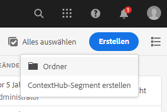

1. Geben Sie einen **Titel** und einen **Namen** für Ihren Ordner an.
   * Der **Titel** sollte beschreibend sein.
   * Der **Name** wird zum Knotennamen im Repository.
      * Er wird automatisch auf der Grundlage des Titels generiert und gemäß den [AEM-Namenskonventionen](/help/sites-developing/naming-conventions.md) angepasst.
      * Er kann bei Bedarf angepasst werden.

   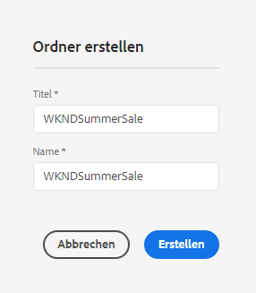

1. Tippen oder klicken Sie auf **Erstellen**.

   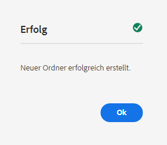

1. Der Ordner wird in der Liste der Segmente angezeigt.
   * Die Sortierung Ihrer Spalten beeinflusst, wo in der Liste der neue Ordner erscheint.
   * Sie können auf die Spaltenüberschriften tippen oder klicken, um die Sortierung anzupassen.
      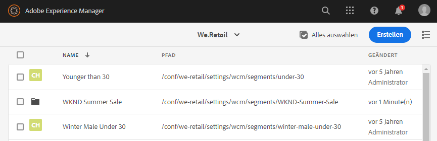

### Ändern vorhandener Ordner {#modify-folders}

1. Klicken oder tippen Sie mach dem [Zugriff auf die Segmente](#accessing-segments) auf den Ordner, den Sie ändern möchten, um ihn auszuwählen.

   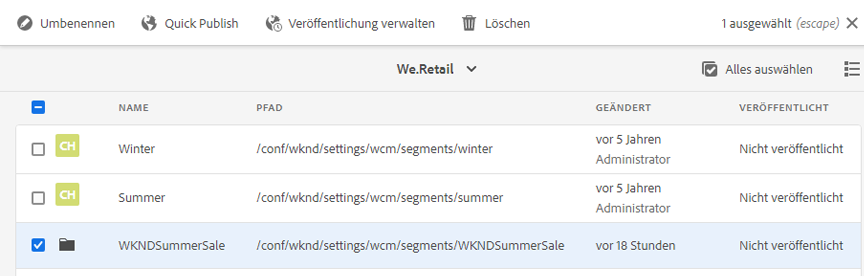

1. Tippen oder klicken Sie auf **Umbenennen** in der Symbolleiste, um den Ordner umzubenennen.

1. Geben Sie einen neuen **Ordnertitel** and und tippen oder klicken Sie auf **Speichern**.

   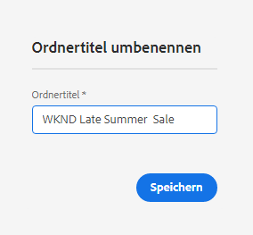

>[!NOTE]
>
>Beim Umbenennen von Ordnern kann nur der Titel geändert werden. Der Name kann nicht geändert werden.

### Löschen eines Ordners

1. Klicken oder tippen Sie mach dem [Zugriff auf die Segmente](#accessing-segments) auf den Ordner, den Sie ändern möchten, um ihn auszuwählen.

   

1. Tippen oder klicken Sie auf **Löschen** in der Symbolleiste, um den Ordner zu löschen.

1. In einem Dialogfeld wird eine Liste der zum Löschen ausgewählten Ordner angezeigt.

   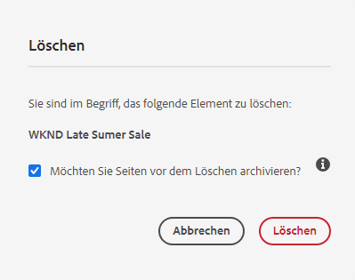

   * Tippen oder klicken Sie zum Bestätigen auf **Löschen**.
   * Tippen oder klicken Sie zum Abbrechen auf **Abbrechen**.

1. Wenn einer der ausgewählten Ordner Unterordner oder Segmente enthält, muss deren Löschung bestätigt werden.

   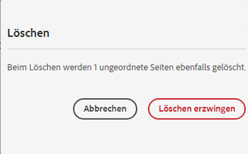

   * Tippen oder klicken Sie zum Bestätigen auf **Löschen erzwingen**.
   * Tippen oder klicken Sie zum Abbrechen auf **Abbrechen**.

>[!NOTE]
>
> Es ist nicht möglich, ein Segment von einem Ordner in einen anderen zu verschieben.

## Testen der Anwendung eines Segments   {#testing-the-application-of-a-segment}

Sobald das Segment definiert wurde, können die potenziellen Ergebnisse mithilfe von **[ContextHub](/help/sites-authoring/ch-previewing.md) getestet werden.**

1. Vorschau einer Seite
1. Klicken Sie auf das ContextHub-Symbol, damit die ContextHub-Symbolleiste angezeigt wird.
1. Wählen Sie eine Rolle aus, die mit dem von Ihnen erstellten Segment übereinstimmt.
1. Der ContextHub löst die entsprechenden Elemente für die ausgewählte Rolle auf.

Unsere einfache Segmentdefinition zur Identifikation von Benutzern in unserer wichtigsten Alterszielgruppe ist beispielsweise eine einfache Segmentdefinition, die auf dem Alter und Geschlecht des Benutzers basiert. Das Laden einer spezifischen Rolle, die mit diesen Kriterien übereinstimmt, zeigt, ob das Segment erfolgreich aufgelöst wurde:

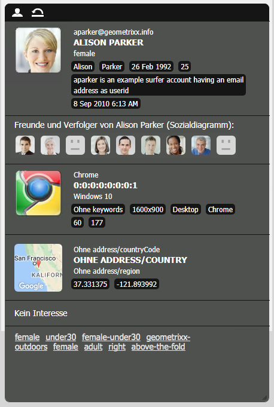

Oder ob es nicht aufgelöst wurde:

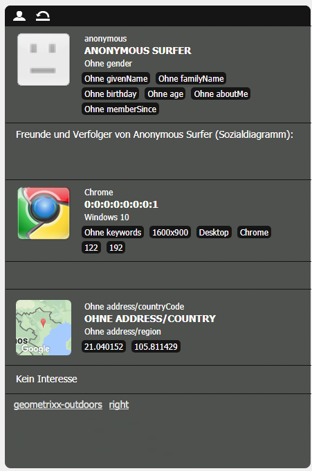

>[!NOTE]
>
>Alle Eigenschaften werden sofort aufgelöst, obwohl die meisten sich nur beim erneuten Laden der Seite ändern.

Solche Tests können auch zu Inhaltsseiten und in Kombination mit gezieltem Inhalt und damit verbundenen **Aktivitäten** und **Erlebnissen** durchgeführt werden.

Wenn Sie mithilfe des obigen Beispiels zum Segment zur wichtigsten Alterszielgruppe eine Aktivität und ein Erlebnis eingerichtet haben, können Sie Ihr Segment ganz einfach mit der Aktivität testen. Weitere Details zur Einrichtung einer Aktivität finden Sie in der entsprechenden [Dokumentation zur Bearbeitung gezielter Inhalte](/help/sites-authoring/content-targeting-touch.md).

1. Im Bearbeitungsmodus einer Seite, auf der Sie gezielte Inhalte eingerichtet haben, können Sie anhand des Pfeilsymbols auf dem Inhalt erkennen, dass es sich um gezielten Inhalt handelt.

   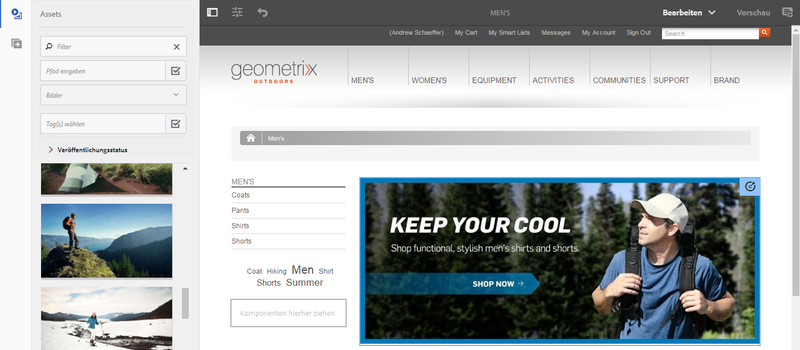

1. Wechseln Sie in den Vorschaumodus und anschließend mithilfe von ContextHub zu einer Rolle, die nicht mit der für das Erlebnis konfigurierten Segmentierung übereinstimmt.

   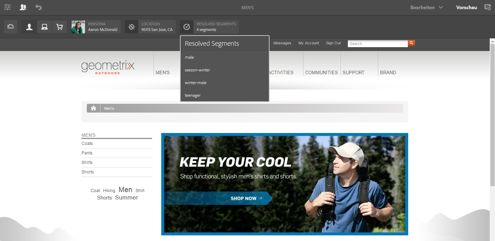

1. Wechseln Sie zu einer Rolle, die nicht mit der für das Erlebnis konfigurierten Segmentierung übereinstimmt, und sehen Sie, wie sich das Erlebnis entsprechend verändert.

   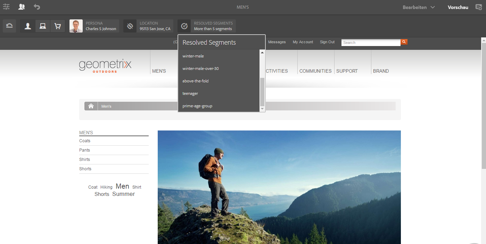

## Verwenden Ihres Segments   {#using-your-segment}

Segmente werden zur Steuerung des tatsächlichen Inhalts verwendet, der spezifischen Zielgruppen angezeigt wird. Unter [Verwalten von Zielgruppen](/help/sites-authoring/managing-audiences.md) finden Sie weitere Informationen zu Zielgruppen und Segmenten; unter [Bearbeiten gezielter Inhalte](/help/sites-authoring/content-targeting-touch.md) finden Sie weitere Informationen zur Nutzung von Zielgruppen und Segmenten zur gezielten Platzierung von Inhalten.
