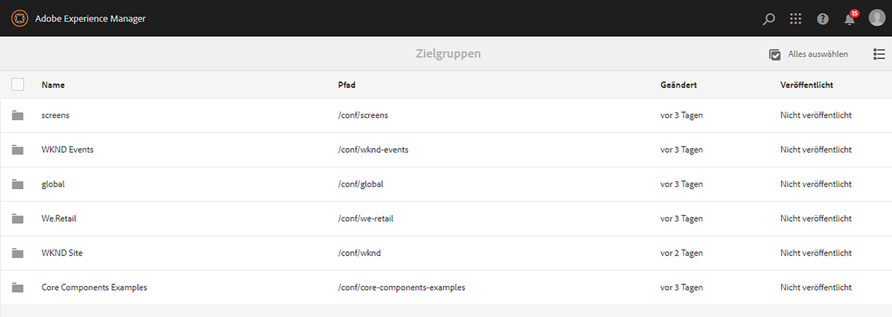
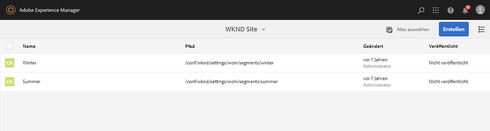

# Konfigurieren der Segmentierung mit ContextHub{#configuring-segmentation-with-contexthub}

>[!NOTE]
>
>In diesem Abschnitt wird beschrieben, wie Sie die Segmentierungsfunktion mit ContextHub konfigurieren. Wenn Sie die ClientContext-Funktion verwenden, finden Sie weitere Informationen in der entsprechenden Dokumentation zum [Konfigurieren der Segmentierungsfunktion für ClientContext](/help/sites-administering/campaign-segmentation.md).
>

Die Segmentierung ist bei der Erstellung einer Kampagne eine grundlegende Überlegung. Unter [Verwalten von Zielgruppen](/help/sites-authoring/managing-audiences.md) finden Sie Informationen zur Funktionsweise der Segmentierung sowie zu Schlüsselbegriffen.

Je nach den Informationen, die Sie bereits über die Besucherinnen und Besucher Ihrer Site gesammelt haben, und den Zielen, die Sie erreichen wollen, müssen Sie die erforderlichen Segmente und Strategien für Ihre zielgerichteten Inhalte festlegen.

Diese Segmente werden dann verwendet, um einer Besucherin oder einem Besucher gezielt bestimmte Inhalte anzuzeigen. Dieser Inhalt wird im Abschnitt [Personalisierung](/help/sites-authoring/personalization.md) der Website verwaltet. Hier festgelegte [Aktivitäten](/help/sites-authoring/activitylib.md) können auf jeder Seite einbezogen werden – und sie können bestimmen, auf welches Besuchersegment die spezialisierten Inhalte angewendet werden sollen.

AEM ermöglicht Ihnen eine einfache Personalisierung des Anwendererlebnisses. Außerdem können Sie die Ergebnisse Ihrer Segmentdefinitionen überprüfen.

## Zugriff auf Segmente {#accessing-segments}

Die [Zielgruppenkonsole](/help/sites-authoring/managing-audiences.md) wird verwendet, um Segmente für ContextHub oder ClientContext sowie Zielgruppen für Ihr Adobe Target-Konto zu verwalten. Diese Dokumentation befasst sich mit der Verwaltung von Segmenten für ContextHub. Weitere Informationen zu [ClientContext-Segmenten](/help/sites-administering/campaign-segmentation.md) und Adobe Target-Segmenten finden Sie in der entsprechenden Dokumentation.

Um auf Ihre Segmente zuzugreifen, müssen Sie Ihre Konfiguration auswählen. Wählen Sie in der globalen Navigation **Navigation > Personalisierung > Zielgruppen**. Ihnen werden die verfügbaren Konfigurationen angezeigt:



Wählen Sie Ihre Konfiguration aus, um die Segmente anzuzeigen, z. B. die WKND-Site:



## Segmenteditor {#segment-editor}

Mit dem **Segmenteditor** können Sie ein Segment einfach ändern. Wählen Sie zur Bearbeitung eines Segments ein Segment aus der [Liste von Segmenten](/help/sites-administering/segmentation.md#accessing-segments) aus und klicken Sie auf die Schaltfläche **Bearbeiten**.


Mithilfe des Komponenten-Browsers können Sie **UND**- und **ODER**-Container zur Festlegung der Segmentlogik und anschließend zusätzliche Komponenten zum Vergleich von Eigenschaften und Werten oder Referenzskripts oder anderen Segmenten zur Definition der Auswahlkriterien (siehe [Erstellen eines neuen Segments](#creating-a-new-segment)) hinzufügen, um das genaue Szenario für die Auswahl des Segments festzulegen.

Wenn die gesamte Anweisung mit „true“ bewertet wurde, wird das Segment aufgelöst. Wenn mehrere anwendbare Segmente vorhanden sind, wird außerdem der Faktor **Verstärken** verwendet. Unter [Erstellen eines neuen Segments](#creating-a-new-segment) finden Sie weitere Details zum [Faktor „Verstärken“](/help/sites-administering/campaign-segmentation.md#boost-factor).

>[!CAUTION]
>
>Der Segmenteditor prüft nicht auf Zirkelbezüge. Ein Beispiel hierfür wäre, wenn Segment A auf ein anderes Segment B verweist, das wiederum auf Segment A verweist. Stellen Sie sicher, dass Ihre Segmente keine Zirkelbezüge enthalten.

### Container {#containers}

Die folgenden Container sind standardmäßig verfügbar und ermöglichen es Ihnen, Gruppenvergleiche und Verweise zur booleschen Auswertung zusammenzufassen. Sie können vom Komponenten-Browser in den Editor gezogen werden. Im folgenden Abschnitt [Verwenden von UND- und ODER-Containern](/help/sites-administering/segmentation.md#using-and-and-or-containers) erhalten Sie weitere Informationen.

<table>
 <tbody>
  <tr>
   <td>UND-Container<br /> </td>
   <td>Der boolesche UND-Operator<br /> </td>
  </tr>
  <tr>
   <td>ODER-Container<br /> </td>
   <td>Der boolesche ODER-Operator</td>
  </tr>
 </tbody>
</table>

### Vergleiche {#comparisons}

Die folgenden Segmentvergleiche sind standardmäßig verfügbar, um Segmenteigenschaften auszuwerten. Sie können vom Komponenten-Browser in den Editor gezogen werden.

<table>
 <tbody>
  <tr>
   <td>Eigenschaft-Wert<br /> </td>
   <td>Vergleicht eine Eigenschaft eines Geschäfts mit einem definierten Wert<br /> </td>
  </tr>
  <tr>
   <td>Eigenschaft-Eigenschaft</td>
   <td>Vergleicht eine Eigenschaft eines Stores mit einer anderen Eigenschaft<br /> </td>
  </tr>
  <tr>
   <td>Eigenschaft-Segment-Referenz</td>
   <td>Vergleicht eine Eigenschaft eines Stores mit einem anderen referenzierten Segment<br /> </td>
  </tr>
  <tr>
   <td>Eigenschaft-Skript-Referenz</td>
   <td>Vergleicht eine Eigenschaft eines Stores mit den Ergebnissen eines Skripts<br /> </td>
  </tr>
  <tr>
   <td>Segment-Referenz-Skript-Referenz</td>
   <td>Vergleicht ein referenziertes Segment mit den Ergebnissen eines Skripts<br /> </td>
  </tr>
 </tbody>
</table>

>[!NOTE]
>
>Ist der Datentyp beim Vergleich von Werten nicht festgesetzt (d. h. auf „auto detect“ eingestellt), vergleicht die Segmentierungs-Engine von ContextHub die Werte einfach auf die Art und Weise, wie auch JavaScript es tun würde. Werte werden nicht auf die erwarteten Typen übertragen, was zu irreführenden Ergebnissen führen kann. Beispiel:
>
>`null < 30 // will return true`
>
>Daher sollten Sie beim [Erstellen eines Segments](/help/sites-administering/segmentation.md#creating-a-new-segment) immer einen **Datentyp** auswählen, wenn die Typen der verglichenen Werte bekannt sind. Beispiel:
>
>Beim Vergleich der Eigenschaft `profile/age` wissen Sie bereits, dass der verglichene Typ **number** sein wird. Selbst wenn `profile/age` nicht festgelegt ist, wird ein Vergleich von `profile/age` unter 30 wie erwartet **false** ergeben.

### Verweise {#references}

Die folgenden Verweise sind standardmäßig verfügbar, um eine direkte Verknüpfung zu einem Skript oder einem anderen Segment herzustellen. Sie können vom Komponenten-Browser in den Editor gezogen werden.

<table>
 <tbody>
  <tr>
   <td>Segment-Referenz<br /> </td>
   <td>Bewerten Sie das referenzierte Segment.</td>
  </tr>
  <tr>
   <td>Skript-Referenz</td>
   <td>Bewerten Sie das referenzierte Skript. Weitere Informationen finden Sie im folgenden Abschnitt <a href="/help/sites-administering/segmentation.md#using-script-references">Verwenden von Skript-Referenzen</a>.</td>
  </tr>
 </tbody>
</table>

## Erstellen eines neuen Segments {#creating-a-new-segment}

Festlegen eines neuen Segments

1. Nachdem Sie [auf die Segmente zugegriffen haben](/help/sites-administering/segmentation.md#accessing-segments), [navigieren Sie zum Ordner](#organizing-segments), in dem Sie das Segment erstellen möchten.

1. Klicken Sie auf die Schaltfläche „Erstellen“ und wählen Sie **ContextHub-Segment erstellen** aus.

   

1. Geben Sie unter **Neues ContextHub-Segment** einen Titel für das Segment sowie bei Bedarf einen Verstärkungswert ein und klicken Sie auf **Erstellen**.

   

   Jedes Segment verfügt über einen Verstärkungsparameter, der als Gewichtungsfaktor verwendet wird. Eine höhere Zahl zeigt an, dass das Segment in Instanzen mit mehreren gültigen Segmenten bei der Auswahl gegenüber einem Segment mit einer niedrigeren Zahl bevorzugt wird.

   * Mindestwert: `0`
   * Höchstwert: `1000000`

1. Ziehen Sie einen Vergleich oder Verweis in den Segmenteditor. Der Vergleich bzw. Verweis wird dann im standardmäßigen UND-Container angezeigt.
1. Doppelklicken Sie auf die Konfigurationsoption des neuen Verweises oder Segments, um die spezifischen Parameter zu bearbeiten. In diesem Beispiel prüfen wir auf Personen in San José.

   

   Legen Sie möglichst immer einen **Datentyp** fest, um sicherzustellen, dass Ihre Vergleiche richtig ausgewertet werden. Weitere Informationen finden Sie unter [Vergleiche](/help/sites-administering/segmentation.md#comparisons).

1. Klicken Sie auf **OK**, um die Definition zu speichern:
1. Fügen Sie bei Bedarf weitere Komponenten hinzu. Sie können boolesche Ausdrücke mithilfe der Container-Komponenten für UND- und ODER-Vergleiche formulieren (siehe [Verwenden von UND- und ODER-Containern](/help/sites-administering/segmentation.md#using-and-and-or-containers) unten). Mit dem Segmenteditor können Sie nicht mehr benötigte Komponenten löschen oder diese an neue Positionen innerhalb der Anweisung ziehen.

### Verwenden von UND- und ODER-Containern {#using-and-and-or-containers}

Mithilfe der UND- und ODER-Container-Komponenten können Sie komplexe Segmente in AEM erstellen. Hierbei ist es hilfreich, sich einige grundlegende Punkte bewusst zu machen:

* Die oberste Ebene der Definition ist immer der ursprünglich erstellte UND-Container. Dies kann nicht verändert werden, hat allerdings auch keine Auswirkungen auf den Rest der Segmentdefinition.
* Stellen Sie sicher, dass die Verschachtelung Ihres Containers sinnvoll ist. Die Container können als die Klammern Ihres booleschen Ausdrucks betrachtet werden.

Das folgende Beispiel wird zur Auswahl von Besucherinnen und Besuchern verwendet, die zu unserer wichtigsten Alterszielgruppe gehören:

Männlich und zwischen 30 und 59 Jahren

ODER

Weiblich und zwischen 30 und 59 Jahren

Beginnen Sie damit, eine ODER-Container-Komponente innerhalb des standardmäßigen UND-Containers zu platzieren. Fügen Sie innerhalb des ODER-Containers zwei UND-Container hinzu und in diesen wiederum die Eigenschafts- oder Verweiskomponenten.


### Verwenden von Skript-Referenzen {#using-script-references}

Mithilfe der Komponente „Skript-Referenz“ kann die Auswertung einer Segmenteigenschaft an ein externes Skript delegiert werden. Sobald das Skript ordnungsgemäß konfiguriert ist, kann es wie jede andere beliebige Komponente einer Segmentbedingung verwendet werden.

#### Definieren eines Skripts für einen Verweis {#defining-a-script-to-reference}

1. Fügen Sie die Datei zur clientlib `contexthub.segment-engine.scripts` hinzu.
1. Implementieren Sie eine Funktion, die einen Wert zurückgibt. Beispiel:

   ```
   ContextHub.console.log(ContextHub.Shared.timestamp(), '[loading] contexthub.segment-engine.scripts - script.profile-info.js');
   
   (function() {
       'use strict';
   
       /**
        * Sample script returning profile information. Returns user info if data is available, false otherwise.
        *
        * @returns {Boolean}
        */
       var getProfileInfo = function() {
           /* let the SegmentEngine know when script should be re-run */
           this.dependOn(ContextHub.SegmentEngine.Property('profile/age'));
           this.dependOn(ContextHub.SegmentEngine.Property('profile/givenName'));
   
           /* variables */
           var name = ContextHub.get('profile/givenName');
           var age = ContextHub.get('profile/age');
   
           return name === 'Joe' && age === 123;
       };
   
       /* register function */
       ContextHub.SegmentEngine.ScriptManager.register('getProfileInfo', getProfileInfo);
   
   })();
   ```

1. Registrieren Sie das Skript bei `ContextHub.SegmentEngine.ScriptManager.register`.

Wenn das Skript von zusätzlichen Eigenschaften abhängig ist, sollte dieses `this.dependOn()` abrufen. Wenn das Skript beispielsweise von `profile/age` abhängt:

```
this.dependOn(ContextHub.SegmentEngine.Property('profile/age'));
```

#### Verweisen auf ein Skript {#referencing-a-script}

1. Erstellen Sie ein ContextHub-Segment.
1. Fügen Sie die Komponente **Skript-Referenz** an der gewünschten Stelle des Segments hinzu.
1. Öffnen Sie das Dialogfeld „Bearbeiten“ der Komponente **Skript-Referenz**. Sofern [ordnungsgemäß konfiguriert](/help/sites-administering/segmentation.md#defining-a-script-to-reference), sollte das Skript in der Dropdown-Liste **Skriptname** verfügbar sein.

## Organisieren von Segmenten {#organizing-segments}

Wenn Sie viele Segmente haben, kann es schwierig werden, sie als flache Liste zu verwalten. In solchen Fällen kann es sinnvoll sein, Ordner zu erstellen, um Ihre Segmente zu verwalten.

### Erstellen eines neuen Ordners {#create-folder}

1. Klicken Sie nach dem [Zugriff auf die Segmente](#accessing-segments) auf die Schaltfläche **Erstellen** und wählen Sie **Ordner** aus.

   

1. Geben Sie einen **Titel** und einen **Namen** für Ihren Ordner an.
   * Der **Titel** sollte beschreibend sein.
   * Der **Name** wird zum Knotennamen im Repository.
      * Er wird automatisch auf der Grundlage des Titels generiert und gemäß den [AEM-Benennungskonventionen](/help/sites-developing/naming-conventions.md) angepasst.
      * Er kann bei Bedarf angepasst werden.

   

1. Klicken Sie auf **Erstellen**.

   

1. Der Ordner wird in der Liste der Segmente angezeigt.
   * Die Sortierung Ihrer Spalten beeinflusst, wo in der Liste der neue Ordner erscheint.
   * Sie können auf die Spaltenüberschriften klicken, um die Sortierung anzupassen.
     

### Ändern vorhandener Ordner {#modify-folders}

1. Klicken Sie nach dem [Zugriff auf die Segmente](#accessing-segments) auf den Ordner, den Sie ändern möchten, um ihn auszuwählen.

   

1. Wählen Sie in der Symbolleiste **Umbenennen** aus, um den Ordner umzubenennen.

1. Geben Sie einen neuen **Ordnertitel** an und klicken Sie auf **Speichern**.

   

>[!NOTE]
>
>Beim Umbenennen von Ordnern kann nur der Titel geändert werden. Der Name kann nicht geändert werden.

### Löschen eines Ordners

1. Klicken Sie nach dem [Zugriff auf die Segmente](#accessing-segments) auf den Ordner, den Sie ändern möchten, um ihn auszuwählen.

   

1. Klicken Sie in der Symbolleiste auf **Löschen**, um den Ordner zu löschen.

1. In einem Dialogfeld wird eine Liste der zum Löschen ausgewählten Ordner angezeigt.

   

   * Klicken Sie zum Bestätigen auf **Löschen**.
   * Klicken Sie zum Abbrechen auf **Abbrechen**.

1. Wenn einer der ausgewählten Ordner Unterordner oder Segmente enthält, muss deren Löschung bestätigt werden.

   

   * Klicken Sie zum Bestätigen auf **Löschen erzwingen**.
   * Klicken Sie zum Abbrechen auf **Abbrechen**.

>[!NOTE]
>
>Es ist nicht möglich, ein Segment von einem Ordner in einen anderen zu verschieben.

## Testen der Anwendung eines Segments {#testing-the-application-of-a-segment}

Sobald das Segment definiert wurde, können die potenziellen Ergebnisse mithilfe von **[ContextHub](/help/sites-authoring/ch-previewing.md) getestet werden.**

1. Zeigen Sie eine Seite in einer Vorschau an.
1. Klicken Sie auf das ContextHub-Symbol, um die ContextHub-Symbolleiste anzuzeigen.
1. Wählen Sie eine Persona aus, die mit dem von Ihnen erstellten Segment übereinstimmt.
1. ContextHub löst die entsprechenden Elemente für die ausgewählte Persona auf.

Unsere einfache Segmentdefinition zur Identifikation von Benutzenden in unserer wichtigsten Altersgruppe ist beispielsweise eine, die einfach auf dem Alter und Geschlecht der Person basiert. Das Laden einer spezifischen Rolle, die mit diesen Kriterien übereinstimmt, zeigt, ob das Segment erfolgreich aufgelöst wurde:


Oder ob es nicht aufgelöst wurde:


>[!NOTE]
>
>Alle Merkmale werden sofort aufgelöst, obwohl die meisten sich nur beim erneuten Laden der Seite ändern.

Solche Tests können auch auf Inhaltsseiten und in Kombination mit gezielten Inhalten und damit verbundenen **Aktivitäten** und **Erlebnissen** durchgeführt werden.

Wenn Sie mithilfe des obigen Beispiels zum Segment der wichtigsten Altersgruppe eine Aktivität und ein Erlebnis eingerichtet haben, können Sie Ihr Segment ganz einfach mit der Aktivität testen. Weitere Informationen zum Einrichten einer Aktivität finden Sie in der entsprechenden [Dokumentation zum Verfassen zielgerichteter Inhalte](/help/sites-authoring/content-targeting-touch.md).

1. Im Bearbeitungsmodus einer Seite, auf der Sie gezielte Inhalte eingerichtet haben, können Sie anhand des Pfeilsymbols auf dem Inhalt erkennen, dass es sich um gezielten Inhalt handelt.

   

1. Wechseln Sie in den Vorschaumodus und anschließend mithilfe von ContextHub zu einer Rolle, die nicht mit der für das Erlebnis konfigurierten Segmentierung übereinstimmt.

   

1. Wechseln Sie zu einer Rolle, die nicht mit der für das Erlebnis konfigurierten Segmentierung übereinstimmt, und sehen Sie, wie sich das Erlebnis entsprechend verändert.

   

## Verwenden Ihres Segments {#using-your-segment}

Segmente werden zur Steuerung des tatsächlichen Inhalts verwendet, der bestimmen Zielgruppen angezeigt wird. Unter [Verwalten von Zielgruppen](/help/sites-authoring/managing-audiences.md) finden Sie weitere Informationen zu Zielgruppen und Segmenten; unter [Bearbeiten gezielter Inhalte](/help/sites-authoring/content-targeting-touch.md) finden Sie weitere Informationen zur Nutzung von Zielgruppen und Segmenten zur gezielten Platzierung von Inhalten.
