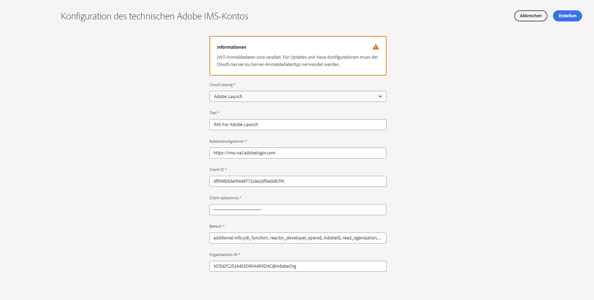
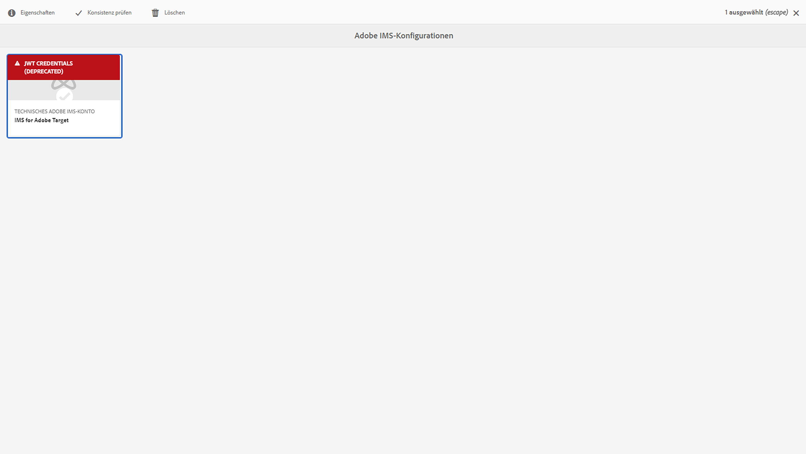
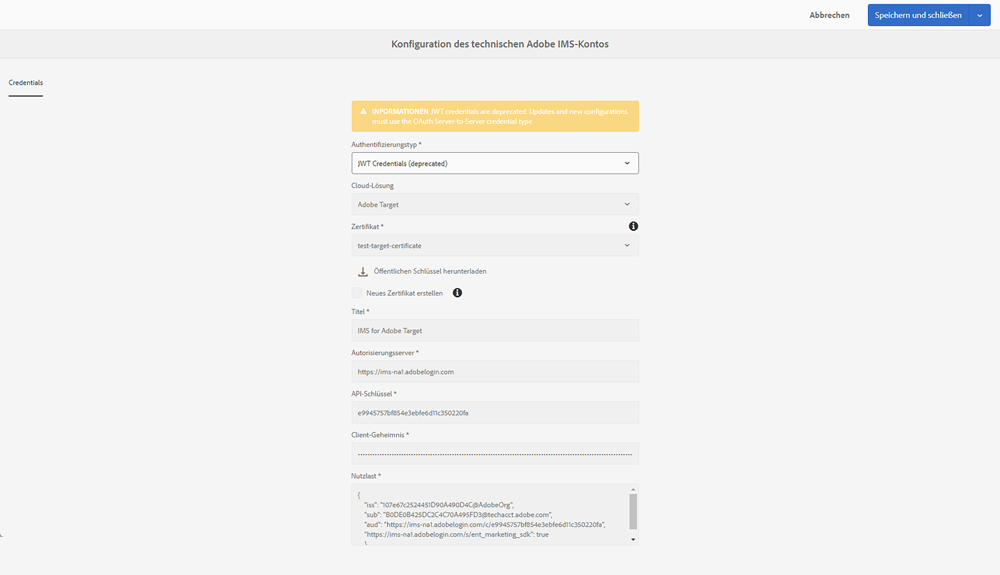
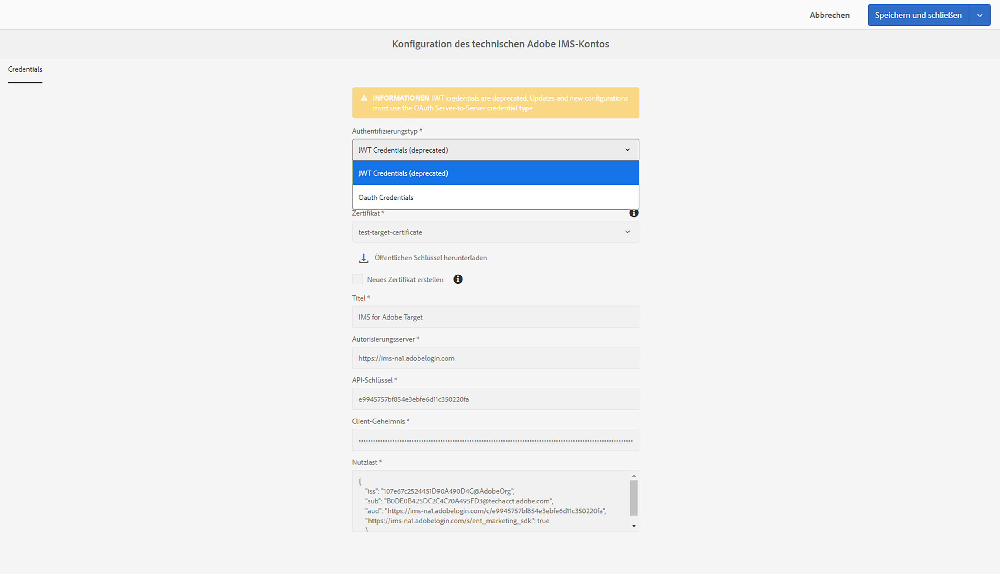
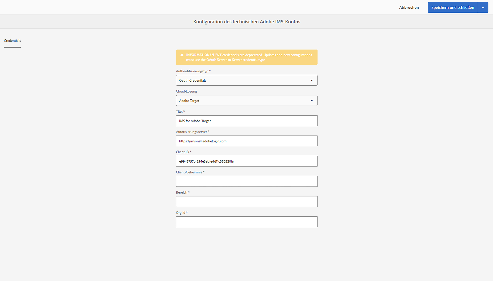

# Einrichten von IMS-Integrationen für AEM {#setting-up-ims-integrations-for-aem}

<!--

>[!NOTE]
>
>Adobe customers use [Adobe Developer Console](https://developer.adobe.com/console) to generate credentials that enable access to various APIs. Customers select from various credential types ranging from OAuth Server-to-Server to Single-Page App. One of those credential types, Service Account (JWT) credentials, has been deprecated in favor of the OAuth Server-to-Server credentials with Service Pack 20. This change can be back ported to older Service Packs, starting with Service Pack 11 up to Service Pack 20 with the use of a hotfix that you can download here. -->

Adobe Experience Manager (AEM) kann mit vielen anderen Adobe-Lösungen integriert werden. Zum Beispiel Adobe Target, Adobe Analytics und vielen weiteren.

Die Integrationen verwenden eine IMS-Integration, die mit S2S OAuth konfiguriert ist.

* Nach der Erstellung:

   * [Anmeldedaten in der Developer Console](#credentials-in-the-developer-console)

* Anschließend können Sie:

   * Eine (neue) [OAuth-Konfiguration](#creating-oauth-configuration) erstellen

   * [Eine vorhandene JWT-Konfiguration in eine OAuth-Konfiguration migrieren](#migrating-existing-JWT-configuration-to-oauth)

>[!CAUTION]
>
>Zuvor wurden Konfigurationen mit [JWT-Anmeldedaten erstellt, die in der Adobe Developer Console nicht mehr unterstützt werden](/help/sites-administering/jwt-credentials-deprecation-in-adobe-developer-console.md).
>
>Solche Konfigurationen können nicht mehr erstellt oder aktualisiert werden, können aber zu OAuth-Konfigurationen migriert werden.

## Anmeldedaten in der Developer Console {#credentials-in-the-developer-console}

Als ersten Schritt müssen Sie die OAuth-Anmeldedaten in der Adobe Developer Console konfigurieren.

Weitere Informationen dazu finden Sie in der Dokumentation zur Developer Console, abhängig von Ihren Anforderungen:

* Übersicht:

   * [Server-zu-Server-Authentifizierung](https://developer.adobe.com/developer-console/docs/guides/authentication/ServerToServerAuthentication/)

* Erstellen von neuen OAuth-Anmeldedaten:

   * [OAuth-Implementierungshandbuch für Server-zu-Server-Anmeldedaten](https://developer.adobe.com/developer-console/docs/guides/authentication/ServerToServerAuthentication/implementation/)

* Migration von vorhandenen JWT-Anmeldedaten zu OAuth-Anmeldedaten:

   * [Migration von JWT-Anmeldedaten (Service Account) zu OAuth-Server-zu-Server-Anmeldedaten](https://developer.adobe.com/developer-console/docs/guides/authentication/ServerToServerAuthentication/migration/)

Zum Beispiel:

## Erstellen einer OAuth-Konfiguration {#creating-oauth-configuration}

So erstellen Sie eine neue Adobe IMS-Integration mithilfe von OAuth:

1. Navigieren Sie in AEM zu **Tools** > **Sicherheit** > **Adobe IMS-Integration**.

1. Wählen Sie **Erstellen** aus.

1. Schließen Sie die Konfiguration basierend auf Details aus der [Developer Console](https://developer.adobe.com/developer-console/docs/guides/authentication/ServerToServerAuthentication/implementation/) ab. Zum Beispiel:

   

1. **Speichern** Sie Ihre Änderungen.

## Migration einer vorhandenen JWT-Konfiguration zu einer OAuth-Konfiguration {#migrating-existing-JWT-configuration-to-oauth}

So migrieren Sie eine vorhandene Adobe IMS-Integration basierend auf JWT-Anmeldedaten:

>[!NOTE]
>
>Dieses Beispiel zeigt eine IMS-Konfiguration für Launch.

1. Navigieren Sie in AEM zu **Tools** > **Sicherheit** > **Adobe IMS-Integration**.

1. Wählen Sie die zu migrierende JWT-Konfiguration aus. JWT-Konfigurationen sind mit einer Warnung gekennzeichnet: **JWT-Anmeldedaten (nicht mehr unterstützt)**.

1. Wählen Sie **Eigenschaften** aus.

   

1. Die Konfiguration wird als schreibgeschützt geöffnet:

   

1. Wählen Sie **OAuth** aus der Dropdown-Liste **Authentifizierungstyp** aus:

   

1. Die verfügbaren Eigenschaften werden aktualisiert. Verwenden Sie Details aus der Developer Console, um sie zu vervollständigen:

   

1. Verwenden Sie **Speichern und schließen**, um Ihre Aktualisierungen beizubehalten.
Wenn Sie zur Konsole zurückkehren, ist die Warnung **JWT-Anmeldedaten (nicht mehr unterstützt)** verschwunden.