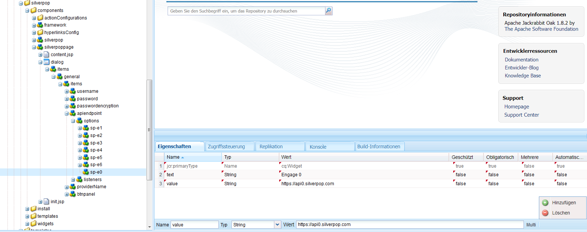
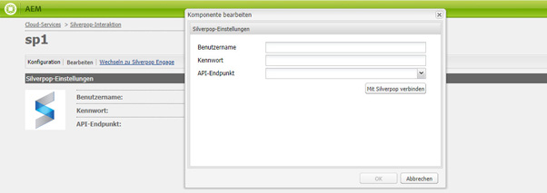

# Integrieren mit Silverpop Engage{#integrating-with-silverpop-engage}

>[!NOTE]
>
>Silverpop Engage wird **nicht** standardmäßig bereitgestellt. Sie müssen das [Silverpop-Integrationspaket](https://www.adobeaemcloud.com/content/marketplace/marketplaceProxy.html?packagePath=/content/companies/public/adobe/packages/aem620/product/cq-mcm-integrations-silverpop-content) von Package Share herunterladen und auf Ihrer Instanz installieren. Nachdem Sie das Paket installiert haben, können Sie es wie in diesem Dokument beschrieben konfigurieren.

Durch die Integration von AEM mit Silverpop Engage können Sie in AEM erstellte E-Mails verwalten und versenden. Außerdem können Sie die Lead-Management-Funktionen von Silverpop über AEM Formulare auf AEM Seiten verwenden.

Mit der Integration verfügen Sie über die folgenden Funktionen:

* Die Möglichkeit, E-Mails in AEM zu erstellen und zur Verteilung in Silverpop zu veröffentlichen.
* Die Möglichkeit, für ein AEM-Formular eine Aktion zum Erstellen eines Silverpop-Abonnenten festzulegen.

Nachdem Silverpop Engage konfiguriert wurde, können Sie Newsletter oder E-Mails über Silverpop Engage veröffentlichen.

## Erstellen einer Silverpop-Konfiguration {#creating-a-silverpop-configuration}

Sie können Silverpop-Konfigurationen über **Cloud-Services**, **Tools** oder **API-Endpunkte** hinzufügen. Alle Methoden werden in diesem Abschnitt beschrieben.

### Konfigurieren von Silverpop über Cloud-Services  {#configuring-silverpop-via-cloudservices}

Gehen Sie wie folgt vor, um in Cloud-Services eine Silverpop-Konfiguration zu erstellen:

1. Tippen oder klicken Sie in AEM auf **Tools**> **Bereitstellung** > **Cloud-Services**. (Oder direkt auf `https://<hostname>:<port>/etc/cloudservices.html` zugreifen.)
1. Klicken Sie unter &quot;Drittanbieterdienste&quot;auf **Silverop Engage** und dann auf **Configure**. Das Fenster für die Silverpop-Konfiguration wird geöffnet.

   >[!NOTE]
   >
   >Silverpop Engage ist nur dann unter den Drittanbieterdiensten als Option verfügbar, wenn Sie das Paket von Package Share herunterladen.

1. Geben Sie einen Titel und optional einen Namen ein und klicken Sie auf **Erstellen**. Das Konfigurationsfenster &quot;Silverpop-Einstellungen&quot;wird geöffnet.
1. Geben Sie den Benutzernamen und das Kennwort ein und wählen Sie in der Dropdown-Liste einen API-Endpunkt aus.
1. Klicken Sie auf **Mit Silverpop verbinden.** Wenn die Verbindungsherstellung erfolgreich war, wird in einem Dialogfeld ein entsprechender Hinweis angezeigt. Klicken Sie auf **OK**, um das Fenster zu beenden. Sie können zu Silverpop gehen, indem Sie auf **Navigieren Sie zu Silverpop Engage** klicken.
1. Silverpop wurde konfiguriert. Sie können die Konfiguration bearbeiten, indem Sie auf **Bearbeiten** klicken.
1. Außerdem kann das Framework von Silverpop Engage für personalisierte Aktionen konfiguriert werden, indem der Titel und der Name (optional) angegeben werden. Wenn Sie auf „Erstellen“ klicken, wird das Framework für die bereits konfigurierte Silverpop-Verbindung erstellt.

   Importierte Datenerweiterungsspalten können später über die AEM-Komponente für **Text und Personalisierung** verwendet werden.

### Konfigurieren von Silverpop über „Tools“  {#configuring-silverpop-via-tools}

Gehen Sie wie folgt vor, um eine Silverpop-Konfiguration über „Tools“ zu erstellen:

1. Tippen oder klicken Sie in AEM auf **Tools**> **Bereitstellung** > **Cloud-Services**. Oder navigieren Sie direkt dorthin, indem Sie zu `https://<hostname>:<port>/misadmin#/etc` gehen.
1. Wählen Sie **Tools**, **Cloud Service-Konfigurationen** und dann **Silverpop Engage**.
1. Wählen Sie **Neu**, um das Fenster **Seite erstellen** zu öffnen.

   

1. Geben Sie den **Titel** und optional den **Namen** ein und klicken Sie auf **Erstellen**.
1. Geben Sie die Konfigurationsinformationen ein, wie in Schritt 4 des vorherigen Verfahrens beschrieben. Führen Sie die Schritte dieses Verfahrens aus, um die Konfiguration von Silverpop abzuschließen.

### Hinzufügen mehrerer Konfigurationen  {#adding-multiple-configurations}

So fügen Sie mehrere Konfigurationen hinzu:

1. Klicken Sie auf der Startseite auf **Cloud-Services** und dann auf **Silverpop Engage**. Klicken Sie auf die Schaltfläche **Konfigurationen anzeigen** , die angezeigt wird, wenn eine oder mehrere Silverpop-Konfigurationen verfügbar sind. Alle verfügbaren Konfigurationen werden aufgeführt.
1. Klicken Sie auf das Pluszeichen (**+**) neben „Verfügbare Konfigurationen“. Das Fenster **Konfiguration erstellen** wird geöffnet. Führen Sie die Schritte des vorherigen Konfigurationsverfahrens aus, um eine neue Konfiguration zu erstellen.

### Konfigurieren von API-Endpunkten für die Verbindungsherstellung mit Silverpop  {#configuring-api-end-points-for-connecting-to-silverpop}

Derzeit verfügt AEM über sechs ungeschützte Endpunkte (Engage 1 bis 6). Mit Silverpop werden jetzt zwei neue Endpunkte und geänderte Verbindungsendpunkte für die bestehenden Endpunkte bereitgestellt.

Gehen Sie wie folgt vor, um die API-Endpunkte zu konfigurieren:

1. Gehen Sie zu `/libs/mcm/silverpop/components/silverpoppage/dialog/items/general/items/apiendpoint/options node` auf `https://<hostname>:<port>/crxde.`
1. Klicken Sie mit der rechten Maustaste und wählen Sie **Erstellen** und dann **Knoten erstellen**.
1. Geben Sie **Name** als `sp-e0` ein und wählen Sie **Typ** als `cq:Widget` aus.
1. Fügen Sie dem neu hinzugefügten Knoten zwei Eigenschaften hinzu:

   1. **Name**:  `text`,  **Typ**:  `String`,  **Wert**:  `Engage 0`
   1. **Name**:  `value`,  **Typ**:  `String`,  **Wert**:  `https://api0.silverpop.com`

   

   Klicken Sie auf die Schaltfläche „Alle speichern“.

1. Erstellen Sie einen weiteren Knoten mit **Name** als `sp-e7` und **Typ** als `cq:Widget`.

   Fügen Sie dem neu hinzugefügten Knoten zwei Eigenschaften hinzu:

   1. **Name**:  `text`,  **Typ**:  `String`,  **Wert**:  `Pilot`
   1. **Name**:  `value`,  **Typ**:  `String`,  **Wert**:  `https://apipilot.silverpop.com/XMLAPI`

1. Um die vorhandenen API-Endpunkte (Engage 1 bis 6) zu ändern, klicken Sie jeweils darauf und ersetzen die Werte wie folgt:

   | **Knotenname** | **Vorhandener Endpunktwert** | **Neuer Endpunktwert** |
   |---|---|---|
   | sp-e1 | https://api.engage1.silverpop.com/XMLAPI | https://api1.silverpop.com |
   | sp-e2 | https://api.engage2.silverpop.com/XMLAPI | https://api2.silverpop.com |
   | sp-e3 | https://api.engage3.silverpop.com/XMLAPI | https://api3.silverpop.com |
   | sp-e4 | https://api.engage4.silverpop.com/XMLAPI | https://api4.silverpop.com |
   | sp-e5 | https://api.engage5.silverpop.com/XMLAPI | https://api5.silverpop.com |
   | sp-e6 | https://api.pilot.silverpop.com/XMLAPI | https://api6.silverpop.com |

1. Klicken Sie auf **Alle speichern**. AEM kann die Verbindung mit Silverpop nun über geschützte Endpunkte herstellen.

   
