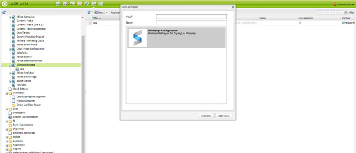

# Integrieren mit Silverpop Engage{#integrating-with-silverpop-engage}

<!-- THIS ENTIRE TOPIC APPEARS OBSOLETE BECAUSE SILVERPOP NO LONGER EXISTS AND THERE ARE NO REDIRECTS FOR THE DOWNLOAD URL BELOW THAT IS 404.
>[!NOTE]
>
>Silverpop integration is **not** available out of the box. Download the Silverpop integration package `https://www.adobeaemcloud.com/content/marketplace/marketplaceProxy.html?packagePath=/content/companies/public/adobe/packages/aem620/product/cq-mcm-integrations-silverpop-content` from Package Share and install it on your instance. After you have installed the package, you can configure it as described in this document. -->

Durch die Integration von AEM mit Silverpop Engage können Sie in AEM erstellte E-Mails per Silverpop verwalten und senden. Darüber hinaus können Sie die Lead-Management-Funktionen von Silverpop über AEM Formulare auf AEM Seiten verwenden.

Die Integration bietet die folgenden Funktionen:

* Die Möglichkeit, E-Mails in AEM zu erstellen und zur Verteilung in Silverpop zu veröffentlichen.
* Die Möglichkeit, die Aktion eines AEM Formulars festzulegen, um einen Silverpop-Abonnenten zu erstellen.

Nachdem Silverpop Engage konfiguriert wurde, können Sie Newsletter oder E-Mails über Silverpop Engage veröffentlichen.

## Erstellen einer Silverpop-Konfiguration {#creating-a-silverpop-configuration}

Silverpop-Konfigurationen können über **Cloud Services**, **Tools** oder **API-Endpunkte** hinzugefügt werden. Alle Methoden werden in diesem Abschnitt beschrieben.

### Konfigurieren von Silverpop über Cloud-Services {#configuring-silverpop-via-cloudservices}

So erstellen Sie eine Silverpop-Konfiguration in Cloud-Services:

1. Klicken Sie AEM auf **Instrumente** > **Implementierung** > **Cloud Service**. (Oder gehen Sie direkt zu `https://<hostname>:<port>/etc/cloudservices.html`.)
1. Klicken Sie unter den Drittanbieterdiensten auf **Silverpop Engage** und dann auf **Konfigurieren**. Das Silverpop-Konfigurationsfenster öffnet sich.

   >[!NOTE]
   >
   >Silverpop Engage ist nicht als Option unter Drittanbieterdiensten verfügbar, es sei denn, Sie laden das Paket von Package Share herunter.

1. Geben Sie einen Titel und optional einen Namen ein und klicken Sie auf **Erstellen**. Das Konfigurationsfenster mit den **Silverpop-Einstellungen** wird geöffnet.
1. Geben Sie den Benutzernamen und das Passwort ein und wählen Sie einen API-Endpunkt aus der Dropdown-Liste aus.
1. Klicken Sie auf **Mit Silverpop verbinden.** Wenn Sie eine erfolgreiche Verbindung hergestellt haben, wird ein Erfolgsdialogfeld angezeigt. Klicken Sie auf **OK**, um das Fenster zu schließen. Sie können auf Silverpop zugreifen, indem Sie auf **Wechseln zu Silverpop Engage** klicken.
1. Silverpop wurde konfiguriert. Sie können die Konfiguration bearbeiten, indem Sie auf **Bearbeiten** klicken.
1. Außerdem kann das Silverpop Engage-Framework für personalisierte Aktionen konfiguriert werden, indem Titel und Name angegeben werden (optional). Wenn Sie auf „Erstellen“ klicken, wird das Framework für die bereits konfigurierte Silverpop-Verbindung erstellt.

   Importierte Datenerweiterungsspalten können später über die AEM-Komponente **Text und Personalisierung** verwendet werden.

### Konfigurieren von Silverpop über Tools {#configuring-silverpop-via-tools}

So erstellen Sie eine Silverpop-Konfiguration in Tools:

1. Klicken Sie AEM auf **Instrumente** > **Implementierung** > **Cloud Service**. Oder navigieren Sie über `https://<hostname>:<port>/misadmin#/etc` direkt dorthin.
1. Wählen Sie **Tools**, **Cloud Service-Konfigurationen** und dann **Silverpop Engage**.
1. Klicken Sie auf **Neu**.

   

1. Geben Sie im Fenster **Seite erstellen** den **Titel** und optional den **Namen** ein, und klicken Sie auf **Erstellen**.
1. Geben Sie die Konfigurationsinformationen ein, wie in Schritt 4 des vorherigen Verfahrens beschrieben. Führen Sie dieses Verfahren aus, damit Sie die Konfiguration von Silverpop abschließen können.

### Hinzufügen mehrerer Konfigurationen {#adding-multiple-configurations}

So fügen Sie mehrere Konfigurationen hinzu:

1. Klicken Sie auf der Startseite auf **Cloud Services** und dann auf **Silverpop Engage**. Klicken Sie auf die Schaltfläche **Konfigurationen anzeigen**, die eingeblendet wird, wenn mindestens eine Silverpop-Konfiguration verfügbar ist. Alle verfügbaren Konfigurationen werden aufgelistet.
1. Klicken Sie auf das Pluszeichen **(+)** neben „Verfügbare Konfigurationen“. Das Fenster **Konfigurationen erstellen** wird geöffnet. Befolgen Sie die vorherigen Konfigurationsschritte, damit Sie eine Konfiguration erstellen können.

### Konfigurieren von API-Endpunkten für die Verbindung mit Silverpop {#configuring-api-end-points-for-connecting-to-silverpop}

Derzeit verfügt AEM über sechs ungesicherte Endpunkte (Engage 1 bis 6). Silverpop bietet nun zwei neue Endpunkte und veränderte Verbindungsendpunkte für die bestehenden Endpunkte.

Gehen Sie wie folgt vor, um die API-Endpunkte zu konfigurieren:

1. Navigieren Sie zu `/libs/mcm/silverpop/components/silverpoppage/dialog/items/general/items/apiendpoint/options node` auf `https://<hostname>:<port>/crxde.`
1. Klicken Sie mit der rechten Maustaste und wählen Sie **Erstellen** und dann **Knoten erstellen**.
1. Geben Sie unter **Name** den Namen `sp-e0` ein und wählen Sie unter **Typ** den Typ `cq:Widget` aus.
1. Fügen Sie dem neu hinzugefügten Knoten zwei Eigenschaften hinzu:

   1. **Name**: `text`, **Typ**: `String`, **Wert**: `Engage 0`
   1. **Name**: `value`, **Typ**: `String`, **Wert**: `https://api0.silverpop.com`

   

   Klicken Sie auf „Alle speichern“.

1. Erstellen Sie einen weiteren Knoten, für den Sie unter **Name** den Namen `sp-e7` und unter **Typ** den Typ `cq:Widget` angeben.

   Fügen Sie dem neu hinzugefügten Knoten zwei Eigenschaften hinzu:

   1. **Name**: `text`, **Typ**: `String`, **Wert**: `Pilot`
   1. **Name**: `value`, **Typ**: `String`, **Wert**: `https://apipilot.silverpop.com/XMLAPI`

1. Um die vorhandenen API-Endpunkte (Engage 1 bis 6) zu ändern, klicken Sie jeweils darauf und ersetzen die Werte wie folgt:

   | **Knotenname** | **Vorhandener Endpunktwert** | **Neuer Endpunktwert** |
   |---|---|---|
   | sp-e1 | `https://api.engage1.silverpop.com/XMLAPI` | `https://api1.silverpop.com` |
   | sp-e2 | `https://api.engage2.silverpop.com/XMLAPI` | `https://api2.silverpop.com` |
   | sp-e3 | `https://api.engage3.silverpop.com/XMLAPI` | `https://api3.silverpop.com` |
   | sp-e4 | `https://api.engage4.silverpop.com/XMLAPI` | `https://api4.silverpop.com` |
   | sp-e5 | `https://api.engage5.silverpop.com/XMLAPI` | `https://api5.silverpop.com` |
   | sp-e6 | `https://api.pilot.silverpop.com/XMLAPI` | `https://api6.silverpop.com` |

1. Klicken Sie auf **Alle speichern**. AEM ist nun bereit, über gesicherte Endpunkte eine Verbindung mit Silverpop herzustellen.

   
