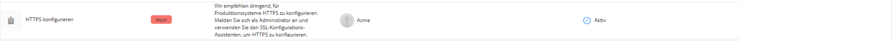
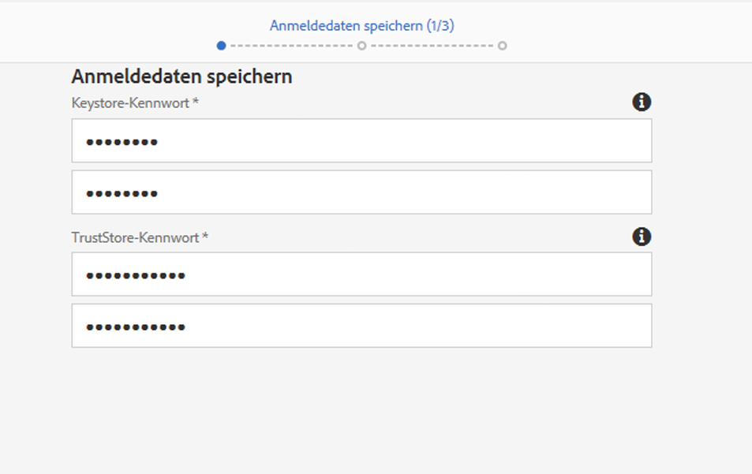
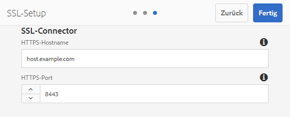

# Die Funktion „SSL By Default“ (SSL als Standard){#ssl-by-default}

Um die Sicherheit von AEM kontinuierlich zu verbessern, hat Adobe eine Funktion namens &quot;SSL By Default&quot;eingeführt. Der Zweck dieser Funktion ist, die Verwendung von HTTPS zum Herstellen einer Verbindung zu AEM-Instanzen zu fördern.

## Aktivieren der Funktion „SSL By Default“ (SSL als Standard)  {#enabling-ssl-by-default}

Sie beginnen mit der Konfiguration der Funktion „SSL By Default“ (SSL als Standard), indem Sie auf Ihrem AEM-Startbildschirm im Posteingang auf die relevante Nachricht klicken. Drücken Sie zum Aufrufen des Posteingangs auf das Glockensymbol in der oberen rechten Ecke des Bildschirms. Klicken Sie dann auf **Alles anzeigen**. Daraufhin wird eine Liste mit allen Warnungen, die in einer Listenansicht angeordnet sind, angezeigt.

Wählen Sie in der Liste die Warnung **HTTPS konfigurieren** aus und öffnen Sie sie:



>[!NOTE]
>
>Wenn der Warnhinweis **HTTPS** im Posteingang nicht vorhanden ist, können Sie direkt zum HTTPS-Assistenten navigieren, indem Sie zu *<http://serveraddress:serverport/libs/granite/security/content/sslConfig.html?item=configuration%2fconfiguressl&_charset_=utf-8>* navigieren.

Ein Dienstbenutzer mit dem Namen **ssl-service** wurde für diese Funktion erstellt. Nach dem Öffnen des Warnhinweises werden Sie durch den folgenden Konfigurationsassistenten geführt:

1. Richten Sie als Erstes die Store-Anmeldedaten ein. Dies sind die Anmeldeinformationen für den Key Store des Systembenutzers **ssl-service**, der den privaten Schlüssel und den Trust Store für den HTTPS-Listener enthält.

   

1. Nachdem Sie die Anmeldedaten eingeben haben, klicken Sie in der oberen rechten Ecke der Seite auf **Weiter**. Laden Sie dann den zugehörigen privaten Schlüssel und das Zertifikat für die SSL-Verbindung hoch.

   

   >[!NOTE]
   >
   >Weitere Informationen dazu, wie Sie einen privaten Schlüssel und ein Zertifikat für die Verwendung im Assistenten erzeugen, finden Sie in [diesem nachfolgenden Verfahren](/help/sites-administering/ssl-by-default.md#generating-a-private-key-certificate-pair-to-use-with-the-wizard).

1. Geben Sie anschließend den HTTPS-Hostnamen und den TCP-Port für den HTTPS-Listener an.

   

## Automatisieren der Funktion „SSL By Default“ (SSL als Standard){#automating-ssl-by-default}

Die Funktion „SSL By Default“ (SSL als Standard) kann auf drei Arten automatisiert werden.

### Über HTTP POST  {#via-http-post}

Bei der ersten Methode wird ein Post an den SSLSetup-Server gesendet, der vom Konfigurationsassistenten verwendet wird:

```shell
POST /libs/granite/security/post/sslSetup.html
```

Sie können die folgende Payload in Ihrem POST verwenden, um die Konfiguration zu automatisieren:

```xml
------WebKitFormBoundaryyBO4ArmGlcfdGDbs
Content-Disposition: form-data; name="keystorePassword"

test
------WebKitFormBoundaryyBO4ArmGlcfdGDbs
Content-Disposition: form-data; name="keystorePasswordConfirm"
test
------WebKitFormBoundaryyBO4ArmGlcfdGDbs
Content-Disposition: form-data; name="truststorePassword"
test
------WebKitFormBoundaryyBO4ArmGlcfdGDbs
Content-Disposition: form-data; name="truststorePasswordConfirm"
test
------WebKitFormBoundaryyBO4ArmGlcfdGDbs
Content-Disposition: form-data; name="privatekeyFile"; filename="server.der"
Content-Type: application/x-x509-ca-cert

------WebKitFormBoundaryyBO4ArmGlcfdGDbs
Content-Disposition: form-data; name="certificateFile"; filename="server.crt"
Content-Type: application/x-x509-ca-cert

------WebKitFormBoundaryyBO4ArmGlcfdGDbs
Content-Disposition: form-data; name="httpsPort"
8443
```

Das Servlet antwortet wie jedes Sling-POST-Servlet mit „200 OK“ oder einem HTTP-Fehlerstatuscode. Details zum Status finden Sie im HTML-Hauptteil der Antwort.

Nachstehend finden Sie Beispiele für eine erfolgreiche Antwort und einen Fehler.

**ERFOLGSBEISPIEL**  (Status = 200):

```xml
<!DOCTYPE html>
<html lang='en'>
<head>
<title>OK</title>
</head>
<body>
<h1>OK</h1>
<dl>
<dt class='foundation-form-response-status-code'>Status</dt>
<dd>200</dd>
<dt class='foundation-form-response-status-message'>Message</dt>
<dd>SSL successfully configured</dd>
<dt class='foundation-form-response-title'>Title</dt>
<dd>OK</dd>
<dt class='foundation-form-response-description'>Description</dt>
<dd>HTTPS has been configured on port 8443. The private key and
certificate were stored in the key store of the user ssl-service.
Please take note of the key store password you provided. You will need
it for any subsequent updating of the private key or certificate.</dd>
</dl>
<h2>Links</h2>
<ul class='foundation-form-response-links'>
<li><a class='foundation-form-response-redirect' href='/'>Done</a></li>
</ul>
</body>
</html>
```

**FEHLERBEISPIEL**  (Status = 500):

```xml
<!DOCTYPE html>
<html lang='en'>
<head>
<title>Error</title>
</head>
<body>
<h1>Error</h1>
<dl>
<dt class='foundation-form-response-status-code'>Status</dt>
<dd>500</dd>
<dt class='foundation-form-response-status-message'>Message</dt>
<dd>The provided file is not a valid key, DER format expected</dd>
<dt class='foundation-form-response-title'>Title</dt>
<dd>Error</dd>
</dl>
</body>
</html>
```

### Über ein Paket {#via-package}

Alternativ können Sie das SSL-Setup auch automatisieren, indem Sie ein Paket hochladen, das bereits diese erforderlichen Elemente enthält:

* Den KeyStore des Benutzers „ssl-service“. Dieser befindet sich unter */home/users/system/security/ssl-service/keystore* im Repository.
* Die `GraniteSslConnectorFactory`-Konfiguration

### Generieren eines Paares aus privatem Schlüssel/Zertifikat für die Verwendung im Assistenten {#generating-a-private-key-certificate-pair-to-use-with-the-wizard}

Nachstehend finden Sie ein Beispiel für das Erstellen eines selbstsignierten Zertifikats im DER-Format, das der SSL-Assistent verwenden kann. Installieren Sie OpenSSL auf der Basis des Betriebssystems, öffnen Sie die OpenSSL-Eingabeaufforderung und ändern Sie den Ordner in den Ordner, in dem Sie den privaten Schlüssel/Zertifikat generieren möchten.

>[!NOTE]
>
>Die Verwendung eines selbstsignierten Zertifikats dient hier lediglich zu Beispielszwecken. Ein solches Zertifikat sollte in Produktionsumgebungen nicht verwendet werden.

1. Erstellen Sie zuerst den privaten Schlüssel:

   ```shell
   openssl genrsa -aes256 -out localhostprivate.key 4096
   openssl rsa -in localhostprivate.key -out localhostprivate.key
   ```

1. Erstellen Sie dann eine Certificate Signing Request (CSR) mithilfe des privaten Schlüssels:

   ```shell
   openssl req -sha256 -new -key localhostprivate.key -out localhost.csr -subj "/CN=localhost"
   ```

1. Generieren Sie das SSL-Zertifikat und melden Sie sich mit dem privaten Schlüssel an. In diesem Beispiel läuft dieser in einem Jahr ab jetzt ab:

   ```shell
   openssl x509 -req -days 365 -in localhost.csr -signkey localhostprivate.key -out localhost.crt
   ```

Konvertieren Sie den privaten Schlüssel in ein DER-Format. Der SSL-Assistent benötigt den Schlüssel im DER-Format:

```shell
openssl pkcs8 -topk8 -inform PEM -outform DER -in localhostprivate.key -out localhostprivate.der -nocrypt
```

Abschließend laden Sie **localhostprivate.der** als privaten Schlüssel und **localhost.crt** als SSL-Zertifikat, wie in Schritt 2 des grafischen SSL-Assistenten am Anfang dieser Seite beschrieben, hoch.

### Aktualisieren der SSL-Konfiguration über cURL  {#updating-the-ssl-configuration-via-curl}

>[!NOTE]
>
>Eine zentrale Liste mit hilfreichen cURL-Befehlen in AEM finden Sie unter [Verwenden von cURL mit AEM](https://helpx.adobe.com/experience-manager/6-4/sites/administering/using/curl.html) .

Sie können die SSL-Konfiguration auch automatisieren, indem Sie das cURL-Tool verwenden. Posten Sie dazu die Konfigurationsparameter an diese URL:

*https://&lt;serveraddress>:&lt;serverport>/libs/granite/security/post/sslSetup.html*

Nachfolgend sind die Parameter aufgeführt, mit denen Sie die zahlreichen Einstellungen im Konfigurationsassistenten ändern können:

* `-F "keystorePassword=password"` - das Keystore-Kennwort;

* `-F "keystorePasswordConfirm=password"` - Bestätigen Sie das KeyStore-Kennwort.

* `-F "truststorePassword=password"` - das TrustStore-Kennwort;

* `-F "truststorePasswordConfirm=password"` - das TrustStore-Kennwort bestätigen;

* `-F "privatekeyFile=@localhostprivate.der"` - den privaten Schlüssel angeben;

* `-F "certificateFile=@localhost.crt"` - die Bescheinigung anzugeben;

* `-F "httpsHostname=host.example.com"`- den Hostnamen angeben;
* `-F "httpsPort=8443"` - der Anschluss, an dem der HTTPS-Listener funktioniert.

>[!NOTE]
>
>Die schnellste Art, cURL auszuführen, um die SSL-Konfiguration zu automatisieren, ist über den Ordner, in dem sich die DER- und CRT-Dateien befinden. Alternativ dazu können Sie den vollständigen Pfad in den Argumenten `privatekeyFile` und „certificateFile“ festlegen.
>
>Sie müssen auch authentifiziert sein, um die Aktualisierung durchzuführen. Stellen Sie daher sicher, dass Sie den cURL-Befehl mit dem Parameter `-u user:passeword` anhängen.
>
>Ein richtiger cURL-Post-Befehl sieht wie folgt aus:

```shell
curl -u user:password -F "keystorePassword=password" -F "keystorePasswordConfirm=password" -F "truststorePassword=password" -F "truststorePasswordConfirm=password" -F "privatekeyFile=@localhostprivate.der" -F "certificateFile=@localhost.crt" -F "httpsHostname=host.example.com" -F "httpsPort=8443" https://host:port/libs/granite/security/post/sslSetup.html
```

#### Mehrere Zertifikate mit cURL  {#multiple-certificates-using-curl}

Sie können eine Kette von Zertifikaten an das Servlet senden, indem Sie den Parameter „certificateFile“ wie folgt wiederholen:

`-F "certificateFile=@root.crt" -F "certificateFile=@localhost.crt"..`

Stellen Sie nach Ausführung des Befehls sicher, dass alle Zertifikate an den Keystore gesendet wurden. Überprüfen Sie den Keystore:[ http://localhost:4502/libs/granite/security/content/userEditor.html/home/users/system/security/ssl-service](http://localhost:4502/libs/granite/security/content/userEditor.html/home/users/system/security/ssl-service)
