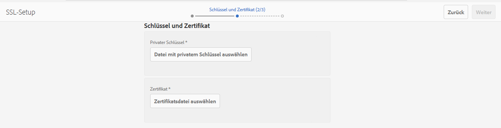

# SSL/TLS standardmäßig{#ssl-tls-by-default}

Im Bestreben, die Sicherheit von AEM kontinuierlich weiter zu verbessern, hat Adobe eine Funktion namens „SSL By Default“ (SSL als Standard) eingeführt. Der Zweck besteht darin, die Verwendung von HTTPS zur Verbindung mit AEM Instanzen zu fördern.

## SSL/TLS standardmäßig aktivieren {#enabling-ssl-tls-by-default}

Sie können mit der Konfiguration von SSL/TLS standardmäßig beginnen, indem Sie in Ihrem AEM-Startbildschirm auf die entsprechende Posteingangsnachricht klicken. Um den Posteingang zu erreichen, drücken Sie auf das Glockensymbol in der oberen rechten Ecke des Bildschirms. Klicken Sie dann auf **Alle anzeigen**. Dadurch wird eine Liste aller in einer Listenansicht bestellten Warnungen angezeigt.

Wählen Sie in der Liste die **HTTPS konfigurieren** alert:


>[!NOTE]
>
>Wenn die Warnung **HTTPS konfigurieren** nicht im Posteingang vorhanden ist, können Sie direkt zum HTTPS-Assistenten navigieren, indem Sie *<http://serveraddress:serverport/libs/granite/security/content/sslConfig.html?item=configuration%2fconfiguressl&_charset_=utf-8>* aufrufen.

Ein Service-Benutzer mit dem Namen **ssl-service** wurde für diese Funktion erstellt. Nachdem Sie die Warnung geöffnet haben, werden Sie durch den folgenden Konfigurationsassistenten geleitet:

1. Richten Sie zunächst die Store-Anmeldedaten ein. Dies sind Anmeldedaten für den KeyStore des Systembenutzers **ssl-service**, der den privaten Schlüssel und den TrustStore für den HTTPS-Listener enthält.

   

1. Nachdem Sie die Anmeldedaten eingegeben haben, klicken Sie auf **Nächste** in der oberen rechten Ecke der Seite. Laden Sie dann den zugehörigen privaten Schlüssel und das zugehörige Zertifikat für die SSL-Verbindung hoch.

   

   >[!NOTE]
   >
   >Weitere Informationen dazu, wie Sie einen privaten Schlüssel und ein Zertifikat für die Verwendung im Assistenten erzeugen, finden Sie in [diesem Verfahren](/help/sites-administering/ssl-by-default.md#generating-a-private-key-certificate-pair-to-use-with-the-wizard).

1. Geben Sie anschließend den HTTPS-Hostnamen und den TCP-Port für den HTTPS-Listener an.

   

## Standardmäßige Automatisierung von SSL/TLS {#automating-ssl-tls-by-default}

Es gibt drei Möglichkeiten, SSL/TLS standardmäßig zu automatisieren.

### Über HTTP-POST {#via-http-post}

Die erste Methode umfasst das Posten auf dem SSLSetup-Server, der vom Konfigurationsassistenten verwendet wird:

```shell
POST /libs/granite/security/post/sslSetup.html
```

Sie können die folgende Payload in Ihrer POST verwenden, um die Konfiguration zu automatisieren:

```xml
------WebKitFormBoundaryyBO4ArmGlcfdGDbs
Content-Disposition: form-data; name="keystorePassword"

test
------WebKitFormBoundaryyBO4ArmGlcfdGDbs
Content-Disposition: form-data; name="keystorePasswordConfirm"
test
------WebKitFormBoundaryyBO4ArmGlcfdGDbs
Content-Disposition: form-data; name="truststorePassword"
test
------WebKitFormBoundaryyBO4ArmGlcfdGDbs
Content-Disposition: form-data; name="truststorePasswordConfirm"
test
------WebKitFormBoundaryyBO4ArmGlcfdGDbs
Content-Disposition: form-data; name="privatekeyFile"; filename="server.der"
Content-Type: application/x-x509-ca-cert

------WebKitFormBoundaryyBO4ArmGlcfdGDbs
Content-Disposition: form-data; name="certificateFile"; filename="server.crt"
Content-Type: application/x-x509-ca-cert

------WebKitFormBoundaryyBO4ArmGlcfdGDbs
Content-Disposition: form-data; name="httpsPort"
8443
```

Das Servlet antwortet wie jedes Sling-POST-Servlet mit 200 OK oder einem Fehler-HTTP-Statuscode. Details zum Status finden Sie im HTML-Textkörper der Antwort.

Im Folgenden finden Sie Beispiele für eine erfolgreiche Antwort und einen Fehler.

**BEISPIEL FÜR EINE ERFOLGREICHE ANTWORT** (Status = 200):

```xml
<!DOCTYPE html>
<html lang='en'>
<head>
<title>OK</title>
</head>
<body>
<h1>OK</h1>
<dl>
<dt class='foundation-form-response-status-code'>Status</dt>
<dd>200</dd>
<dt class='foundation-form-response-status-message'>Message</dt>
<dd>SSL successfully configured</dd>
<dt class='foundation-form-response-title'>Title</dt>
<dd>OK</dd>
<dt class='foundation-form-response-description'>Description</dt>
<dd>HTTPS has been configured on port 8443. The private key and
certificate were stored in the key store of the user ssl-service.
Please take note of the key store password you provided. You will need
it for any subsequent updating of the private key or certificate.</dd>
</dl>
<h2>Links</h2>
<ul class='foundation-form-response-links'>
<li><a class='foundation-form-response-redirect' href='/'>Done</a></li>
</ul>
</body>
</html>
```

**BEISPIEL FÜR EINEN FEHLER** (Status = 500):

```xml
<!DOCTYPE html>
<html lang='en'>
<head>
<title>Error</title>
</head>
<body>
<h1>Error</h1>
<dl>
<dt class='foundation-form-response-status-code'>Status</dt>
<dd>500</dd>
<dt class='foundation-form-response-status-message'>Message</dt>
<dd>The provided file is not a valid key, DER format expected</dd>
<dt class='foundation-form-response-title'>Title</dt>
<dd>Error</dd>
</dl>
</body>
</html>
```

### Über Package {#via-package}

Alternativ können Sie die SSL-Einrichtung automatisieren, indem Sie ein Paket hochladen, das bereits die folgenden erforderlichen Elemente enthält:

* Der Keystore des ssl-service-Benutzers. Dies befindet sich unter */home/users/system/security/ssl-service/keystore* im Repository.
* Die `GraniteSslConnectorFactory`-Konfiguration

### Generieren eines Paares aus privatem Schlüssel/Zertifikat für die Verwendung im Assistenten {#generating-a-private-key-certificate-pair-to-use-with-the-wizard}

Unten finden Sie ein Beispiel für die Erstellung eines selbstsignierten Zertifikats im DER-Format, das der SSL-/TLS-Assistent verwenden kann. Installieren Sie OpenSSL basierend auf dem Betriebssystem, öffnen Sie die OpenSSL-Eingabeaufforderung und ändern Sie das Verzeichnis in den Ordner, in dem Sie den privaten Schlüssel/das Zertifikat generieren möchten.

>[!NOTE]
>
>Die Verwendung eines selbstsignierten Zertifikats dient hier lediglich zu Beispielszwecken. Ein solches Zertifikat sollte in Produktionsumgebungen nicht verwendet werden.

1. Erstellen Sie zunächst den privaten Schlüssel:

   ```shell
   openssl genrsa -aes256 -out localhostprivate.key 4096
   openssl rsa -in localhostprivate.key -out localhostprivate.key
   ```

1. Generieren Sie dann mithilfe des privaten Schlüssels ein Certificate Signing Request (CSR):

   ```shell
   openssl req -sha256 -new -key localhostprivate.key -out localhost.csr -subj "/CN=localhost"
   ```

1. Generieren Sie das SSL-Zertifikat und signieren Sie es mit dem privaten Schlüssel. In diesem Beispiel läuft in einem Jahr ab:

   ```shell
   openssl x509 -req -days 365 -in localhost.csr -signkey localhostprivate.key -out localhost.crt
   ```

Konvertieren Sie den privaten Schlüssel in das DER-Format. Dies liegt daran, dass der SSL-Assistent den Schlüssel im DER-Format erfordert:

```shell
openssl pkcs8 -topk8 -inform PEM -outform DER -in localhostprivate.key -out localhostprivate.der -nocrypt
```

Laden Sie abschließend die **localhostprivate.der** als privaten Schlüssel und **localhost.crt** als SSL-/TLS-Zertifikat in Schritt 2 des grafischen SSL/TLS-Assistenten, der am Anfang dieser Seite beschrieben wird.

### Aktualisieren der SSL-/TLS-Konfiguration über cURL {#updating-the-ssl-tls-configuration-via-curl}

>[!NOTE]
>
>Eine zentrale Liste mit nützlichen cURL-Befehlen in AEM finden Sie unter [Verwenden von cURL in AEM](https://helpx.adobe.com/de/experience-manager/6-4/sites/administering/using/curl.html).

Sie können die SSL-/TLS-Konfiguration auch mithilfe des cURL-Tools automatisieren. Sie können dies tun, indem Sie die Konfigurationsparameter an diese URL senden:

*https://&lt;Server-Adresse>:&lt;Serverport>/libs/granite/security/post/sslSetup.html*

Nachfolgend sind die Parameter aufgeführt, mit denen Sie die zahlreichen Einstellungen im Konfigurationsassistenten ändern können:

* `-F "keystorePassword=password"` – KeyStore-Kennwort

* `-F "keystorePasswordConfirm=password"` – Bestätigung des KeyStore-Kennworts

* `-F "truststorePassword=password"` – TrustStore-Kennwort

* `-F "truststorePasswordConfirm=password"` – Bestätigung des TrustStore-Kennworts

* `-F "privatekeyFile=@localhostprivate.der"` – Angabe des privaten Schlüssels

* `-F "certificateFile=@localhost.crt"` – Angabe des Zertifikats

* `-F "httpsHostname=host.example.com"` – Angabe des Host-Namens
* `-F "httpsPort=8443"` – Port, den der HTTPS-Listener abhört

>[!NOTE]
>
>Die schnellste Möglichkeit, cURL zur Automatisierung der SSL/TLS-Konfiguration auszuführen, ist der Ordner, in dem sich die DER- und CRT-Dateien befinden. Alternativ dazu können Sie den vollständigen Pfad in den Argumenten `privatekeyFile` und „certificateFile“ festlegen.
>
>Sie müssen außerdem authentifiziert werden, damit die Aktualisierung durchgeführt werden kann. Stellen Sie daher sicher, dass Sie den cURL-Befehl mit dem Parameter `-u user:passeword` anhängen.
>
>Ein korrekter cURL-Post-Befehl sollte wie folgt aussehen:

```shell
curl -u user:password -F "keystorePassword=password" -F "keystorePasswordConfirm=password" -F "truststorePassword=password" -F "truststorePasswordConfirm=password" -F "privatekeyFile=@localhostprivate.der" -F "certificateFile=@localhost.crt" -F "httpsHostname=host.example.com" -F "httpsPort=8443" https://host:port/libs/granite/security/post/sslSetup.html
```

#### Mehrere Zertifikate mit cURL {#multiple-certificates-using-curl}

Sie können dem Servlet eine Kette von Zertifikaten senden, indem Sie den Parameter certificateFile wie folgt wiederholen:

`-F "certificateFile=@root.crt" -F "certificateFile=@localhost.crt"..`

Stellen Sie nach Ausführung des Befehls sicher, dass alle Zertifikate an den KeyStore gesendet wurden. Überprüfen Sie den KeyStore:
[http://localhost:4502/libs/granite/security/content/userEditor.html/home/users/system/security/ssl-service](http://localhost:4502/libs/granite/security/content/userEditor.html/home/users/system/security/ssl-service)

### Aktivieren einer TLS 1.3-Verbindung {#enabling-tls-connection}

1. Navigieren Sie zur Web-Konsole .
1. Navigieren Sie dann zu **OSGi** - **Konfiguration** - **Adobe Granite SSL Connector Factory**
1. Navigieren Sie zu **Enthaltene Chiffre-Suites** und fügen Sie die folgenden Einträge hinzu. Sie können jede Ergänzung bestätigen, indem Sie auf &quot;**+**&quot; auf der linken Seite des Felds, nachdem jede in hinzugefügt wurde:

   * `TLS_AES_256_GCM_SHA384`
   * `TLS_AES_128_GCM_SHA256`
   * `TLS_CHACHA20_POLY1305_SHA256`
   * `TLS_AES_128_CCM_SHA256`
   * `TLS_AES_128_CCM_8_SHA256`