# Verwalten von Tags  {#administering-tags}

Tags bieten eine schnelle und einfache Methode zur Klassifizierung von Inhalten innerhalb einer Website. Sie können Sie sich als Stichwörter oder Bezeichnungen (Metadaten) vorstellen, mit denen sich Inhalte schneller finden lassen als über die normale Suche.

In Adobe Experience Manager (AEM) kann ein Tag eine Eigenschaft von

* einem Inhaltsknoten für eine Seite (siehe [Verwenden von Tags](/help/sites-authoring/tags.md))

* einem Metadatenknoten für ein Asset (siehe [Verwalten von Metadaten für digitale Assets](/help/assets/metadata.md))

Neben Seiten und Assets werden Tags für AEM Communities-Funktionen genutzt.

* benutzergenerierte Inhalte (siehe [Taggen von benutzergenerierten Inhalten)](/help/communities/tag-ugc.md)

* Aktivierungsressourcen (siehe [Tagging von Aktivierungsressourcen)](/help/communities/functions.md#catalog-function)

## Tag-Funktionen {#tag-features}

Zu den Funktionen von Tags in AEM gehören u. a. folgende:

* Tags können in verschiedene Namespaces gruppiert werden. Derartige Hierarchien ermöglichen das Aufstellen von Klassifikationsschemen. Diese Klassifikationsschemen werden global in AEM verwendet.
* Die wesentliche Einschränkung für neu erstellte Tags besteht darin, dass sie in einem bestimmten Namespace eindeutig sein müssen.
* Der Titel eines Tags sollte keine Trennzeichen des Tag-Pfads enthalten (falls doch vorhanden, werden sie nicht angezeigt).

   * Doppelpunkt `:` - Trennt das Namespace-Tag
   * Schrägstrich `/` - Trennzeichen für Untertags

* Tags können von Autoren und Websitebesuchern angewendet werden. Unabhängig davon, wer die Tags erstellt hat, stehen alle Arten von Tags zur Verfügung, um sie einer Seite hinzuzufügen oder wenn man die Tags durchsucht.
* Tags können von Mitgliedern der Gruppe &quot;Tag-Administratoren&quot;und Mitgliedern mit Änderungsrechten für `/content/cq:tags` erstellt und ihre Taxonomie geändert werden.

   * Ein Tag, das untergeordnete Tags enthält, bezeichnet man als Container-Tag.
   * Ein Tag, das kein Container-Tag ist, wird Leaf-Tag genannt.
   * Ein Tag-Namespace ist entweder ein Leaf-Tag oder ein Container-Tag.

* Tags werden von der [Such-Komponente](https://helpx.adobe.com/experience-manager/core-components/using/quick-search.html) genutzt, um das Suchen von Inhalten zu vereinfachen.
* Tags werden von der [Teaser-Komponente](https://helpx.adobe.com/experience-manager/core-components/using/teaser.html) verwendet, bei der die Tag-Cloud eines Benutzers überwacht wird, um gezielte Inhalte bereitzustellen.
* Wenn Tagging bei Ihren Inhalten wichtig ist:

   * Stellen Sie sicher, dass Tags in den Paketen enthalten sind, die sie verwenden.
   * Stellen Sie sicher, dass die [Tag-Berechtigungen](#setting-tag-permissions) Lesezugriff gewähren.

## Tagging-Konsole {#tagging-console}

Über die Tagging-Konsole können Sie Tags und ihre Klassifikationsschemen erstellen und verwalten. Ein Ziel besteht darin, zu vermeiden, dass viele ähnliche Tags sich auf dieselbe Sache beziehen, z. B. Seite und Seiten oder Fußbekleidung und Schuhe.

Um Tags zu verwalten, teilen Sie sie in Namespaces ein, prüfen Sie vor der Erstellung neuer Tags die Nutzung vorhandener und organisieren Sie die Tags neu, ohne sie von den Inhalten zu lösen, mit denen sie aktuell verknüpft sind.

So greifen Sie auf die Tagging-Konsole zu:

* In der Autoreninstanz:
* Melden Sie sich mit Administratorrechten an.
* Über die globale Navigation:

   * auswählen **`Tools`**
   * auswählen **`General`**
   * auswählen **`Tagging`**

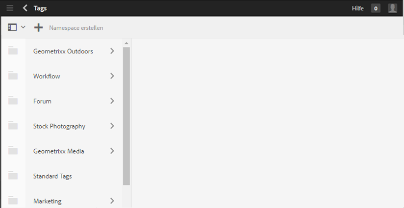

### Erstellen eines Namespace {#creating-a-namespace}

Um einen neuen Namespace zu erstellen, wählen Sie das Symbol **`Create Namespace`** aus.

Der Namespace selbst ist ein Tag und muss keine untergeordneten Tags enthalten. Um jedoch mit dem Erstellen eines Klassifikationsschemas fortzufahren, [erstellen Sie untergeordnete Tags](#creating-tags), bei denen es sich um Leaf-Tags oder Container-Tags handeln kann.

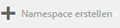 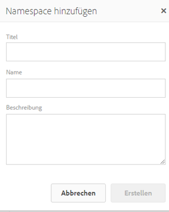

* **Titel**

   *(erforderlich)* Ein Anzeigetitel für den Namespace.

* **Name**
   *(optional)* Ein Name für den Namespace. Wenn Sie keinen festlegen, wird ein gültiger Knotenname aus dem Titel erstellt. Siehe [TagID](/help/sites-developing/framework.md#tagid).

* **Beschreibung**

   *(optional)* Eine Beschreibung des Namespace.

Wenn Sie die erforderlichen Informationen eingegeben haben:

* Wählen Sie **Erstellen** aus.

### Vorgänge bei Tags  {#operations-on-tags}

Wenn Sie einen Namespace oder ein anderes Tag auswählen, werden die folgenden Vorgänge zur Verfügung gestellt:

* [Eigenschaften anzeigen](#viewing-tag-properties)
* [Verweise](#showing-tag-references)
* [Tag erstellen](#creating-tags)
* [Bearbeiten](#editing-tags)
* [Verschieben](#moving-tags)
* [Zusammenführen](#merging-tags)
* [Veröffentlichen](#publishing-tags)
* [Veröffentlichung rückgängig machen](#unpublishing-tags)
* [Löschen](#deleting-tags)

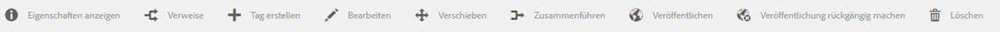

Wenn das Browser-Fenster nicht groß genug ist, um alle Symbole anzuzeigen, werden die Symbole ganz rechts unter einem **`... More`**-Symbol gruppiert, wodurch bei Auswahl eine Dropdown-Liste der ausgeblendeten Vorgangssymbole angezeigt wird.

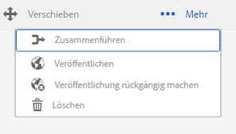

### Auswählen eines Namespace-Tags {#selecting-a-namespace-tag}

Wenn ein Namespace keine Tags enthält, werden bei der ersten Auswahl die Eigenschaften rechts angezeigt, andernfalls die untergeordneten Tags. Jedes ausgewählte Tag zeigt entweder die enthaltenen Tags an oder seine Eigenschaften, wenn es über keine untergeordneten Tags verfügt.

Um ein oder mehrere Tags für die Vorgänge auszuwählen, wählen Sie nur das Symbol neben dem Titel aus. Wenn Sie den Titel auswählen, werden nur die Eigenschaften angezeigt. Wenn Sie das Tag öffnen, werden seine Inhalte angezeigt.

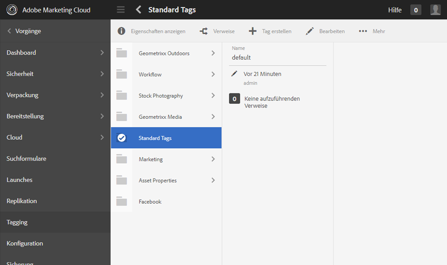 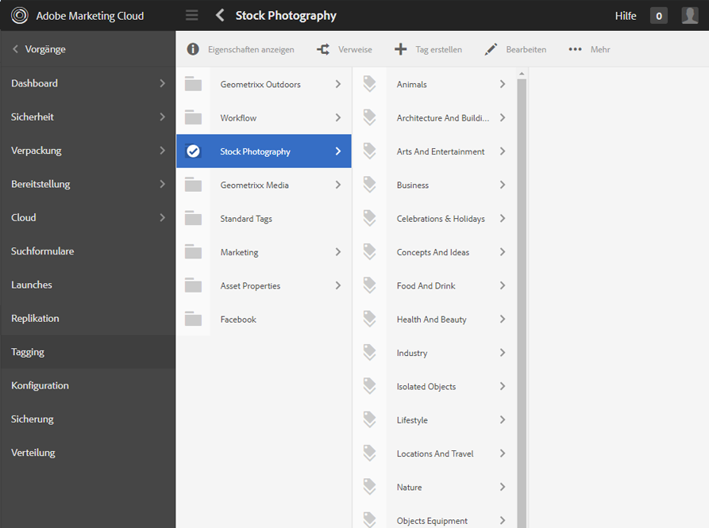

### Anzeigen der Tag-Eigenschaften {#viewing-tag-properties}

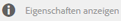

Wenn ein Namespace oder ein anderes Tag ausgewählt wird, wird durch Auswahl des Symbols **`View Properties`** Informationen zu `name`, zum Zeitpunkt der letzten Bearbeitung und zur Anzahl der Verweise angezeigt. Bei veröffentlichten Tags werden die Zeit der letzten Veröffentlichung und die ID des Herausgebers angezeigt. Diese Informationen werden in einer Spalte links von der Tag-Spalte angezeigt.

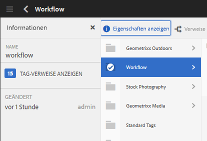

### Anzeigen von Tag-Referenzen {#showing-tag-references}

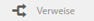

Wenn Sie einen Namespace oder ein anderes Tag ausgewählt haben, klicken Sie auf das Symbol **Verweise**, um die Inhalte zu ermitteln, denen das Tag zugewiesen wurde.

Zunächst wird die Anzahl der zugewiesenen Tags angezeigt.

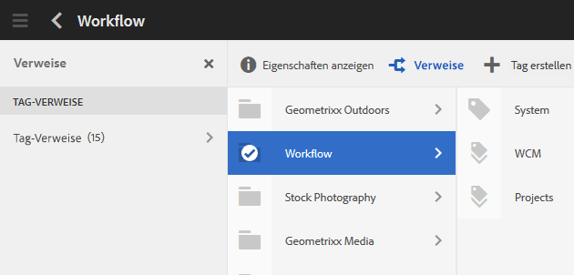

Wenn Sie den Pfeil rechts neben der Zahl auswählen, werden die Verweisnamen aufgeführt.

Der Pfad zum Verweis wird als Tooltip angezeigt, wenn Sie mit dem Mauszeiger über eine Referenz fahren.

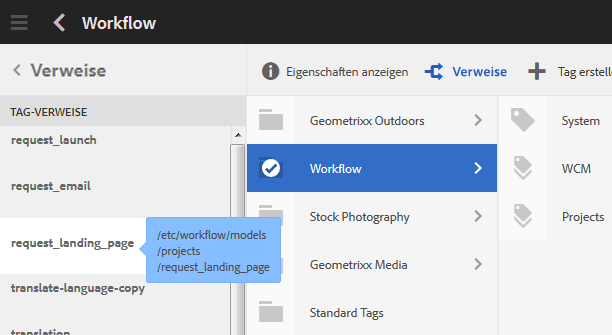

### Erstellen von Tags {#creating-tags}

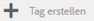

Wenn ein Namespace oder ein anderes Tag ausgewählt wird (durch Auswahl des Symbols neben dem Titel), kann ein untergeordnetes Tag für das aktuelle Tag erstellt werden, indem Sie das Symbol **`Create Tag`** auswählen.

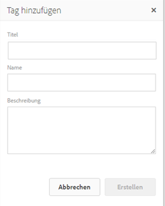

* **Titel**
* (erforderlich) *Ein Anzeigetitel für das Tag.

* **Name**
* (optional) *Ein Name für das Tag. Wenn Sie keinen festlegen, wird ein gültiger Knotenname aus dem Titel erstellt. Siehe [TagID](/help/sites-developing/framework.md#tagid).

* **Beschreibung**
* (optional) *Eine Beschreibung des Tags.

Wenn Sie die erforderlichen Informationen eingegeben haben:

* Wählen Sie **Erstellen** aus.

### Bearbeiten von Tags  {#editing-tags}

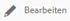

Wenn Sie einen Namespace oder ein anderes Tag ausgewählt haben, können Sie den Titel, die Beschreibung und die Lokalisierungen des Titels ändern, indem Sie das Symbol **`Edit`**auswählen.

Wenn Sie die Änderungen vorgenommen haben, klicken Sie auf **Speichern**.

Weitere Informationen zum Hinzufügen von Sprachübersetzungen finden Sie im Abschnitt [Verwalten von Tags in verschiedenen Sprachen](#managing-tags-in-different-languages).

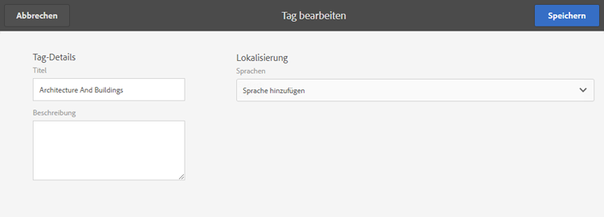

### Verschieben von Tags {#moving-tags}

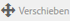

Wenn ein Namespace oder ein anderes Tag ausgewählt ist, können Tag-Administratoren und Entwickler die Taxonomie bereinigen, indem sie das Tag an einen neuen Speicherort verschieben oder umbenennen. **`Move`** Wenn es sich bei dem ausgewählten Tag um ein Container-Tag handelt, werden beim Verschieben auch die untergeordneten Tags verschoben.

>[!NOTE]
>
>Es wird empfohlen, dass Autoren nur die [Bearbeitung](#editing-tags) des `title`-Tags des Tags zulassen dürfen, nicht um Tags zu verschieben oder umzubenennen.

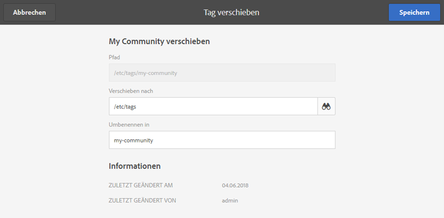

* **Pfad**

   *(schreibgeschützt)* Der aktuelle Pfad zum ausgewählten Tag.

* **Verschieben nach** Wählen Sie den neuen Pfad aus, in den das Tag verschoben werden soll.

* **Umbenennen**
in zeigt zunächst den aktuellen 
`name`des Tags. Ein neuer `name`kann eingegeben werden.

* Klicken Sie auf **Speichern**.

### Zusammenführen von Tags {#merging-tags}

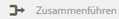

Das Zusammenführen von Tags kann sich anbieten, wenn im Klassifikationsschema Duplikate vorhanden sind. Wenn Tag A mit Tag B zusammengeführt wird, werden alle mit Tag A gekennzeichneten Seiten mit Tag B gekennzeichnet und Tag A steht den Autoren nicht mehr zur Verfügung.

Wenn ein Namespace oder ein anderes Tag ausgewählt ist, wird durch Auswahl des Symbols **Zusammenführen** ein Bereich geöffnet, in dem der Pfad für die Zusammenführung ausgewählt werden kann.

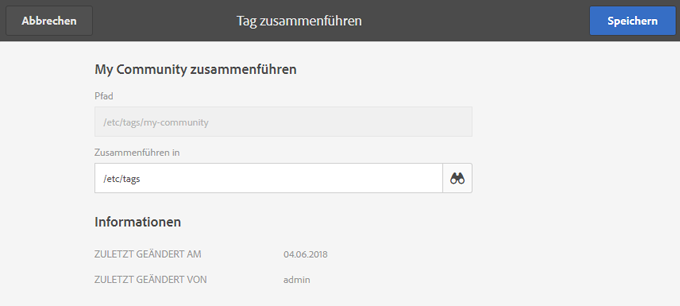

* **Pfad**

   *(schreibgeschützt)* Der Pfad des Tags, das ausgewählt wurde, um mit einem anderen Tag zusammengeführt zu werden.

* **Zusammenführen in** Wählen Sie den Pfad des Tags aus, mit dem das erste Tag zusammengeführt werden soll.

>[!NOTE]
>
>Nach der Zusammenführung ist der ursprünglich ausgewählte **Pfad** (virtuell) nicht mehr vorhanden.
>
>Wenn ein referenziertes Tag verschoben oder zusammengeführt wird, wird es nicht physisch gelöscht, sodass die Verweise beibehalten werden können.

### Veröffentlichen von Tags {#publishing-tags}

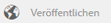

Wenn ein Namespace oder ein anderes Tag ausgewählt ist, wählen Sie das Symbol **Veröffentlichen** aus, um das Tag in der Veröffentlichungsumgebung zu aktivieren. Ähnlich wie bei Seiteninhalten wird nur das ausgewählte Tag veröffentlicht, gleich, ob es sich um ein Container-Tag handelt oder nicht.

Um ein Klassifikationsschema (einen Namespace und untergeordnete Tags) zu veröffentlichen, empfehlen wir, ein [Paket](/help/sites-administering/package-manager.md) des Namespace zu erstellen (siehe [Klassifikationsschema-Stammknoten](/help/sites-developing/framework.md#taxonomy-root-node)). Stellen Sie sicher, dass Sie [Berechtigungen](#setting-tag-permissions) auf den Namespace anwenden, bevor Sie das Paket erstellen.

### Rückgängigmachen der Veröffentlichung {#unpublishing-tags}

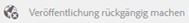

Wenn ein Namespace oder ein anderes Tag ausgewählt ist, wird durch Auswahl des Symbols **Veröffentlichung rückgängig machen** das Tag in der Autorenumgebung deaktiviert und aus der Veröffentlichungsumgebung entfernt. Ähnlich wie der `Delete`Vorgang werden alle untergeordneten Tags in der Autorenumgebung deaktiviert und aus der Veröffentlichungsumgebung entfernt, wenn das ausgewählte Tag ein Container-Tag ist.

### Löschen von Tags {#deleting-tags}

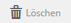

Wenn ein Namespace oder ein anderes Tag ausgewählt ist, wird durch Auswahl des Symbols **Löschen** das Tag dauerhaft aus der Autorenumgebung entfernt. Wenn das Tag veröffentlicht war, wird es auch von der Veröffentlichungsumgebung entfernt. Wenn es sich bei dem ausgewählten Tag um ein Container-Tag handelt, werden alle untergeordneten Tags ebenfalls entfernt.

## Festlegen der Tag-Berechtigungen {#setting-tag-permissions}

Tag-Berechtigungen sind [&#39;secure (standardmäßig)&#39;](/help/sites-administering/production-ready.md); eine Best Practice für die Veröffentlichungsumgebung, bei der Leseberechtigungen explizit für Tags zulässig sein müssen. Erreicht wird dies, indem nach dem Festlegen der Berechtigungen in der Autorenumgebung ein Paket vom Tag-Namespace erstellt und anschließend auf allen Veröffentlichungsinstanzen installiert wird.

* Bei der Autoreninstanz:

   * Melden Sie sich mit Administratorrechten an.
   * Greifen Sie auf die [Sicherheitskonsole](/help/sites-administering/security.md#accessing-user-administration-with-the-security-console) zu,

      * z. B. unter http://localhost:4502/useradmin.
   * Wählen Sie im linken Bedienfeld die Gruppe oder die Benutzer aus, für die die [Leseberechtigung](/help/sites-administering/security.md#permissions) gelten soll.
   * Suchen Sie im rechten Bereich den **Pfad **zum Tag-Namespace

      * Beispiel: `/content/cq:tags/mycommunity`
   * Wählen Sie `checkbox`in der Spalte **Read** aus.
   * Wählen Sie **Speichern** aus

* Stellen Sie sicher, dass alle Veröffentlichungsinstanzen dieselben Berechtigungen aufweisen.

   * Erstellen Sie dazu beispielsweise [ein Paket](/help/sites-administering/package-manager.md#package-manager) des Namespace auf der Autoreninstanz.

      * Wählen Sie auf der Registerkarte `Advanced` für `AC Handling` `Overwrite`
   * Replizieren Sie das Paket.

      * Wählen Sie `Replicate` aus dem Paketmanager aus.

## Verwalten von Tags in verschiedenen Sprachen {#managing-tags-in-different-languages}

Die Eigenschaft `title` eines Tags kann in verschiedene Sprachen übersetzt werden. Nach der Übersetzung kann das entsprechende Tag `title`entsprechend der Benutzersprache oder der Seitensprache angezeigt werden.

### Festlegen von Tag-Titeln in verschiedenen Sprachen {#defining-tag-titles-in-multiple-languages}

Im Folgenden wird beschrieben, wie Sie die `title`des Tags **Animals** aus dem Englischen ins Deutsche und Französische übersetzen.

Wählen Sie zunächst das Tag unter dem Namespace **Stock Fotografy** aus und wählen Sie das Symbol **`Edit`**aus (siehe Abschnitt [Bearbeiten von Tags](#editing-tags) ).

Im Bedienfeld „Tag bearbeiten“ können Sie die Sprachen auswählen, in die der Tag-Titel übersetzt werden soll.

Für jede ausgewählte Sprache wird ein Texteingabefeld angezeigt, in das Sie den übersetzten Titel eingeben können.

Wenn Sie alle Übersetzungen eingegeben haben, klicken Sie auf **Speichern**, um den Bearbeitungsmodus zu verlassen.

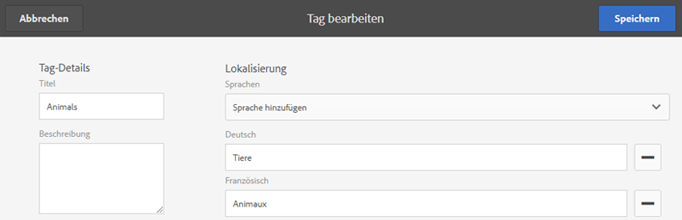

Grundsätzlich wird die Sprache für das Tag entsprechend der Sprache der Seite ausgewählt, wenn vorhanden. Wird das Widget [`tag` in anderen Fällen verwendet (z. B. in Formularen oder Dialogfeldern), hängt die Tag-Sprache vom Kontext ab.](/help/sites-developing/building.md#tagging-on-the-client-side)

Statt der Spracheinstellung der Seite verwendet die Tagging-Konsole die Spracheinstellung des Benutzers. Für einen Benutzer, der als Sprache in den Benutzereinstellungen Französisch ausgewählt hat, wird das Tag „Tiere“ als „Animaux“ in der Tagging-Konsole angezeigt.

Informationen zum Hinzufügen einer neuen Sprache zum Dialogfeld finden Sie unter [Hinzufügen einer neuen Sprache zum Dialogfeld &quot;Tag bearbeiten&quot;](/help/sites-developing/building.md#adding-a-new-language-to-the-edit-tag-dialog).

>[!NOTE]
>
>Die Tag-Cloud und die Meta-Schlüsselwörter in der Standardseitenkomponente verwenden das lokalisierte Tag `titles`basierend auf der Seitensprache, sofern verfügbar.

## Ressourcen {#resources}

* [Tagging für Entwickler](/help/sites-developing/tags.md)

   Informationen zum Tagging-Framework sowie zum Erweitern und Einschließen von Tags in benutzerdefinierten Anwendungen.

* [Tagging-Konsole der klassischen Benutzeroberfläche](/help/sites-administering/classic-console.md)
