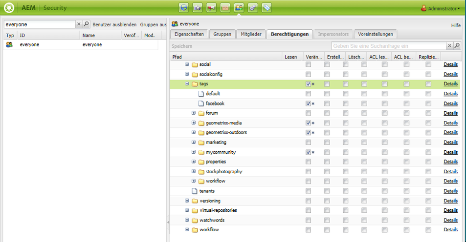

# Verwalten von Tags {#administering-tags}

Tags bieten eine schnelle und einfache Methode zur Klassifizierung von Inhalten innerhalb einer Website. Sie können als Keywords oder Beschriftungen (Metadaten) betrachtet werden, mit denen Inhalte schneller als durch eine Suche gefunden werden können.

Bei Adobe Experience Manager (AEM) kann ein Tag die Eigenschaft sein von:

* einem Inhaltsknoten für eine Seite (siehe [Verwenden von Tags](/help/sites-authoring/tags.md))

* einem Metadatenknoten für ein Asset (siehe [Verwalten von Metadaten für digitale Assets](/help/assets/metadata.md))

Neben Seiten und Assets werden Tags für AEM Communities-Funktionen genutzt.

* benutzergenerierte Inhalte (siehe [Taggen von benutzergenerierten Inhalten)](/help/communities/tag-ugc.md)

* Aktivierungsressourcen (siehe [Tagging von Aktivierungsressourcen](/help/communities/functions.md#catalog-function))

## Tag-Funktionen {#tag-features}

Zu den Funktionen von Tags in AEM gehören u. a. folgende:

* Tags können in verschiedene Namespaces gruppiert werden. Solche Hierarchien ermöglichen die Erstellung von Taxonomien. Diese Taxonomien sind AEM global.
* Die Haupteinschränkung für neu erstellte Tags besteht darin, dass sie innerhalb eines bestimmten Namespace eindeutig sein müssen.
* Der Titel eines Tags sollte keine Trennzeichen für den Tag-Pfad enthalten (und wird auch nicht angezeigt, wenn vorhanden)

   * Doppelpunkt `:` – Trennzeichen bei Namespace-Tags
   * Schrägstrich `/` – Trennzeichen bei untergeordneten Tags

* Tags können von Autoren und Website-Besuchern angewendet werden. Unabhängig vom Ersteller werden alle Arten von Tags zur Auswahl bereitgestellt, sowohl bei der Zuweisung zu einer Seite als auch bei der Suche.
* Mitglieder der Benutzergruppe „Tag-Administratoren“ und Mitglieder, die Bearbeitungsrechte für `/content/cq:tags` haben, können Tags erstellen und ihre Klassifikationsschemata ändern.

   * Ein Tag, das untergeordnete Tags enthält, wird als Container-Tag bezeichnet
   * Ein Tag, das kein Container-Tag ist, wird als Leaf-Tag bezeichnet
   * Ein Tag-Namespace ist entweder ein Leaf- oder Container-Tag

* Tags werden von der [Such-Komponente](https://helpx.adobe.com/de/experience-manager/core-components/using/quick-search.html) genutzt, um das Suchen von Inhalten zu vereinfachen.
* Tags werden von der [Teaser-Komponente](https://helpx.adobe.com/de/experience-manager/core-components/using/teaser.html) verwendet, bei der die Tag-Cloud eines Benutzers überwacht wird, um gezielte Inhalte bereitzustellen.
* Wenn Tagging ein wichtiger Aspekt Ihres Inhalts ist

   * Stellen Sie sicher, dass Sie Tags mit den Seiten verpacken, die sie verwenden
   * Stellen Sie sicher [Tag-Berechtigungen](#setting-tag-permissions) Lesezugriff aktivieren

## Tagging-Konsole {#tagging-console}

Die Tagging-Konsole wird zum Erstellen und Verwalten von Tags und deren Taxonomien verwendet. Ein Ziel besteht darin, zu vermeiden, dass viele ähnliche Tags sich auf dieselbe Sache beziehen, z. B. Seite und Seiten oder Fußbekleidung und Schuhe.

Tags werden verwaltet, indem sie in Namespaces gruppiert, die Verwendung vorhandener Tags vor der Erstellung neuer Tags überprüft und neu organisiert werden, ohne die Verbindung zwischen dem Tag und dem aktuell referenzierten Inhalt zu trennen.

So greifen Sie auf die Tagging-Konsole zu:

* in der Autoreninstanz
* Anmelden mit Administratorrechten
* von der globalen Navigation

   * Wählen Sie **`Tools`** aus.
   * Wählen Sie **`General`** aus.
   * Wählen Sie **`Tagging`** aus.

### Erstellen eines Namespace {#creating-a-namespace}

Um einen Namespace zu erstellen, wählen Sie die **`Create Namespace`** Symbol.

Der Namespace selbst ist ein Tag und muss keine untergeordneten Tags enthalten. Um jedoch mit dem Erstellen eines Klassifikationsschemas fortzufahren, [erstellen Sie untergeordnete Tags](#creating-tags), bei denen es sich um Leaf-Tags oder Container-Tags handeln kann.

 

* **Titel**
  *(erforderlich)* Ein Anzeigetitel für den Namespace.

* **Name**
  *(optional)* Ein Name für den Namespace. Wenn Sie keinen festlegen, wird ein gültiger Knotenname aus dem Titel erstellt. Siehe [TagID](/help/sites-developing/framework.md#tagid).

* **Beschreibung**
  *(optional)* Eine Beschreibung des Namespace.

Nach Eingabe der erforderlichen Informationen

* select **Erstellen**

### Vorgänge für Tags {#operations-on-tags}

Wenn Sie einen Namespace oder ein anderes Tag auswählen, werden die folgenden Vorgänge zur Verfügung gestellt:

* [Eigenschaften anzeigen](#viewing-tag-properties)
* [Verweise](#showing-tag-references)
* [Tag erstellen](#creating-tags)
* [Bearbeiten](#editing-tags)
* [Verschieben](#moving-tags)
* [Zusammenführen](#merging-tags)
* [Veröffentlichen](#publishing-tags)
* [Veröffentlichung aufheben](#unpublishing-tags)
* [Löschen](#deleting-tags)

Wenn das Browser-Fenster nicht groß genug ist, um alle Symbole anzuzeigen, werden die Symbole, die am weitesten rechts platziert sind, zusammen unter dem Symbol **`... More`** gruppiert. Wenn Sie auf dieses Symbol klicken, wird eine Dropdown-Liste der ausgeblendeten Vorgangssymbole angezeigt.

### Namespace-Tag auswählen {#selecting-a-namespace-tag}

Wenn der Namespace zum ersten Mal keine Tags enthält, werden die Eigenschaften auf der rechten Seite angezeigt. Andernfalls werden die untergeordneten Tags angezeigt. Jedes ausgewählte Tag zeigt entweder die enthaltenen Tags an oder seine Eigenschaften, wenn es über keine untergeordneten Tags verfügt.

Um ein oder mehrere Tags für die Vorgänge auszuwählen, wählen Sie nur das Symbol neben dem Titel aus. Wenn Sie den Titel auswählen, werden nur die Eigenschaften angezeigt. Wenn Sie das Tag öffnen, werden seine Inhalte angezeigt.

 

### Anzeigen der Tag-Eigenschaften {#viewing-tag-properties}

Wenn Sie einen Namespace oder ein anderes Tag ausgewählt haben, klicken Sie auf das Symbol **`View Properties`**. Daraufhin werden Informationen zu `name`, zum Zeitpunkt der letzten Bearbeitung und zur Anzahl der Verweise angezeigt. Bei veröffentlichten Tags werden die Zeit der letzten Veröffentlichung und die ID des Herausgebers angezeigt. Diese Informationen werden in einer Spalte links von der Tag-Spalte angezeigt.

### Anzeigen von Tag-Referenzen {#showing-tag-references}

Wenn Sie einen Namespace oder ein anderes Tag ausgewählt haben, klicken Sie auf das Symbol **Verweise**, um die Inhalte zu ermitteln, denen das Tag zugewiesen wurde.

Zunächst wird die Anzahl der zugewiesenen Tags angezeigt.

Durch Auswahl des Pfeils rechts neben der Zählung werden die Referenznamen aufgelistet.

Der Pfad zum Verweis wird als QuickInfo angezeigt, wenn Sie den Mauszeiger über einen Verweis bewegen.

### Erstellen von Tags {#creating-tags}

Wenn Sie einen Namespace oder ein anderes Tag ausgewählt haben (indem Sie auf das Symbol neben dem Titel geklickt haben), können Sie für dieses Tag ein untergeordnetes Tag erstellen. Klicken Sie dazu auf das Symbol **`Create Tag`**.

* **Titel**
*(erforderlich)* Ein Anzeigetitel für das Tag.

* **Name**
*(optional) *Ein Name für das Tag. Wenn Sie keinen festlegen, wird ein gültiger Knotenname aus dem Titel erstellt. Siehe [TagID](/help/sites-developing/framework.md#tagid).

* **Beschreibung**
*(optional) *Eine Beschreibung des Tags.

Nach Eingabe der erforderlichen Informationen

* select **Erstellen**

### Bearbeiten von Tags {#editing-tags}

Wenn Sie einen Namespace oder ein anderes Tag ausgewählt haben, können Sie den Titel und die Beschreibung ändern und Lokalisierungen des Titels angeben. Klicken Sie dazu auf das Symbol **`Edit`**.

Wenn Sie die Änderungen vorgenommen haben, klicken Sie auf **Speichern**.

Detaillierte Informationen zum Hinzufügen von Übersetzungen finden Sie im Abschnitt [Verwalten von Tags in verschiedenen Sprachen](#managing-tags-in-different-languages).

### Verschieben von Tags {#moving-tags}

Wenn ein Namespace oder ein anderes Tag ausgewählt wurden, können Tag-Admins und Entwicklerinnen und Entwickler das Klassifikationsschema bereinigen, indem sie mit dem Symbol **`Move`** das Tag an einen anderen Ort verschieben oder es umbenennen. Wenn es sich bei dem ausgewählten Tag um ein Container-Tag handelt, werden beim Verschieben auch die untergeordneten Tags verschoben.

>[!NOTE]
>
>Wir empfehlen, Autoren nur die Berechtigung zum [Bearbeiten](#editing-tags) des `title` des Tags zu gewähren, nicht zum Verschieben oder Umbenennen von Tags.

* **Pfad**
  *(Lesezugriff)* Der aktuelle Pfad zum ausgewählten Tag.

* **Verschieben nach**
Wählen Sie den neuen Pfad aus, in den das Tag verschoben werden soll.

* **Umbenennen in**
Zeigt zunächst den aktuellen `name`-Wert des Tags an. Sie können einen neuen `name`-Wert eingeben.

* Wählen Sie **Speichern** aus.

### Zusammenführen von Tags {#merging-tags}

Das Zusammenführen von Tags kann sich anbieten, wenn im Klassifikationsschema Duplikate vorhanden sind. Wenn Tag A mit Tag B zusammengeführt wird, werden alle mit Tag A getaggten Seiten mit Tag B versehen und Tag A steht Autoren nicht mehr zur Verfügung.

Wenn ein Namespace oder ein anderes Tag ausgewählt wird, wählen Sie die **Zusammenführen** -Symbol öffnet ein Bedienfeld, in dem der Pfad, zu dem zusammengeführt werden soll, ausgewählt werden kann.

* **Pfad**
  *(Lesezugriff)* Der Pfad des ausgewählten Tags, das mit einem anderen Tag zusammengeführt werden soll.

* **Zusammenführen in**
Wählen Sie den Pfad des Tags aus, mit dem das erste Tag zusammengeführt werden soll.

>[!NOTE]
>
>Nach der Zusammenführung ist der ursprünglich ausgewählte **Pfad** (virtuell) nicht mehr vorhanden.
>
>Wenn ein referenziertes Tag verschoben oder zusammengeführt wird, wird es nicht physisch gelöscht, sodass Verweise beibehalten werden können.

### Veröffentlichen von Tags {#publishing-tags}

Wenn Sie einen Namespace oder ein anderes Tag ausgewählt haben, klicken Sie auf das Symbol **Veröffentlichen**, um das Tag in der Veröffentlichungsumgebung zu aktivieren. Ähnlich wie bei Seiteninhalten wird nur das ausgewählte Tag veröffentlicht. Es ist unerheblich, ob es sich um ein Container-Tag handelt oder nicht.

Um ein Klassifikationsschema (einen Namespace und untergeordnete Tags) zu veröffentlichen, empfehlen wir, ein [Paket](/help/sites-administering/package-manager.md) des Namespace zu erstellen (siehe [Klassifikationsschema-Stammknoten](/help/sites-developing/framework.md#taxonomy-root-node)). Stellen Sie sicher, dass Sie [Berechtigungen](#setting-tag-permissions) auf den Namespace anwenden, bevor Sie das Paket erstellen.

### Rückgängigmachen der Veröffentlichung {#unpublishing-tags}

Wenn Sie einen Namespace oder ein anderes Tag ausgewählt haben, klicken Sie auf das Symbol **Veröffentlichung rückgängig machen**. Dadurch wird das Tag in der Autorenumgebung deaktiviert und von der Veröffentlichungsumgebung entfernt. Ähnlich wie beim Vorgang `Delete` werden bei einem Container-Tag auch alle untergeordneten Tags in der Autorenumgebung deaktiviert und von der Veröffentlichungsumgebung entfernt.

### Löschen von Tags {#deleting-tags}

Wenn Sie einen Namespace oder ein anderes Tag ausgewählt haben, klicken Sie auf das Symbol **Löschen**, um das Tag endgültig aus der Autorenumgebung zu löschen. Wenn das Tag veröffentlicht war, wird es auch aus der Veröffentlichungsumgebung entfernt. Wenn es sich bei dem ausgewählten Tag um ein Container-Tag handelt, werden alle untergeordneten Tags ebenfalls entfernt.

## Festlegen der Tag-Berechtigungen {#setting-tag-permissions}

Tag-Berechtigungen sind [standardmäßig sicher](/help/sites-administering/production-ready.md). Dies ist eine Best Practice für die Veröffentlichungsumgebung, bei der Schreibberechtigungen explizit für Tags zugelassen werden muss. Erreicht wird dies, indem nach dem Festlegen der Berechtigungen in der Autorenumgebung ein Paket vom Tag-Namespace erstellt und anschließend auf allen Veröffentlichungsinstanzen installiert wird.

* auf Autoreninstanz

   * Anmelden mit Administratorrechten
   * auf die [Sicherheitskonsole](/help/sites-administering/security.md#accessing-user-administration-with-the-security-console),

      * Navigieren Sie beispielsweise zu http://localhost:4502/useradmin .

   * im linken Bereich die Gruppe (oder den Benutzer) auswählen, für die [Leseberechtigung](/help/sites-administering/security.md#permissions) wird
   * Suchen Sie im rechten Bedienfeld den **Pfad** für den Tag-Namespace,

      * Beispiel: `/content/cq:tags/mycommunity`

   * Aktivieren Sie `checkbox` in der Spalte **Lesen**.
   * Wählen Sie **Speichern** aus

* sicherstellen, dass alle Veröffentlichungsinstanzen über dieselben Berechtigungen verfügen

   * Ein Ansatz ist [Package erstellen](/help/sites-administering/package-manager.md#package-manager) Namespace im Autorenmodus

      * Wählen Sie auf der Registerkarte `Advanced` für `AC Handling` die Option `Overwrite` aus.

   * Replizieren Sie das Paket.

      * Wählen Sie im Package Manager `Replicate` aus.

## Verwalten von Tags in verschiedenen Sprachen {#managing-tags-in-different-languages}

Die Eigenschaft `title` eines Tags kann in verschiedene Sprachen übersetzt werden. Nach der Übersetzung kann der entsprechende `title` des Tags entsprechend der Sprache des Benutzers oder der Seite angezeigt werden.

### Festlegen von Tag-Titeln in verschiedenen Sprachen {#defining-tag-titles-in-multiple-languages}

Im folgenden Beispiel wird erklärt, wie Sie den `title` des Tags **Tiere** aus der deutschen in die englische und französische Sprache übersetzen.

Wählen Sie zunächst das Tag im Namespace **Stockfotografie** aus und klicken Sie auf das Symbol **`Edit`** (siehe Abschnitt [Bearbeiten von Tags](#editing-tags)).

Im Bedienfeld Tag bearbeiten können Sie Sprachen auswählen, in die der Tag-Titel lokalisiert werden soll.

Da jede Sprache ausgewählt ist, wird ein Textfeld angezeigt, in das der übersetzte Titel eingegeben werden kann.

Wenn Sie alle Übersetzungen eingegeben haben, klicken Sie auf **Speichern**, um den Bearbeitungsmodus zu verlassen.

Grundsätzlich wird die Sprache für das Tag entsprechend der Sprache der Seite ausgewählt, wenn vorhanden. Wenn die Variable [`tag` Widget](/help/sites-developing/building.md#tagging-on-the-client-side) in anderen Fällen verwendet wird (z. B. in Formularen oder in Dialogfeldern), hängt die Tag-Sprache vom Kontext ab.

Statt der Spracheinstellung der Seite verwendet die Tagging-Konsole die Spracheinstellung des Benutzers. Für einen Benutzer, der als Sprache in den Benutzereinstellungen Französisch ausgewählt hat, wird das Tag „Tiere“ als „Animaux“ in der Tagging-Konsole angezeigt.

Wenn Sie eine neue Sprache zum Dialogfeld hinzufügen möchten, finden Sie detaillierte Informationen unter [Hinzufügen einer neuen Sprache zum Dialogfeld „Tag bearbeiten“](/help/sites-developing/building.md#adding-a-new-language-to-the-edit-tag-dialog).

>[!NOTE]
>
>Die Tag-Cloud und die Meta-Schlüsselwörter in der Standard-Seitenkomponente verwenden die lokalisierten Tag-`titles` basierend auf der Seitensprache, sofern sie festgelegt ist.

## Ressourcen {#resources}

* [Tagging für Entwickler](/help/sites-developing/tags.md)

  Informationen zum Tagging-Framework sowie zum Erweitern und Einschließen von Tags in benutzerdefinierten Anwendungen.

* [Tagging-Konsole der klassischen Benutzeroberfläche](/help/sites-administering/classic-console.md)
