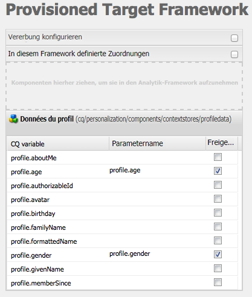
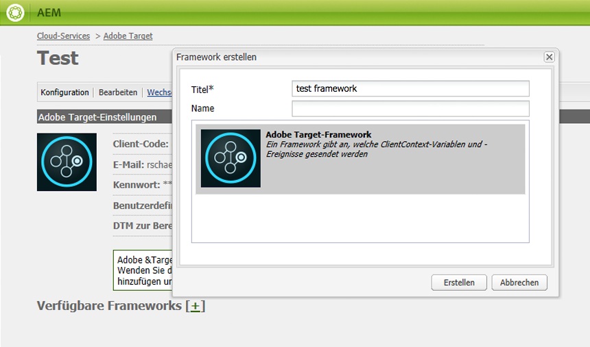
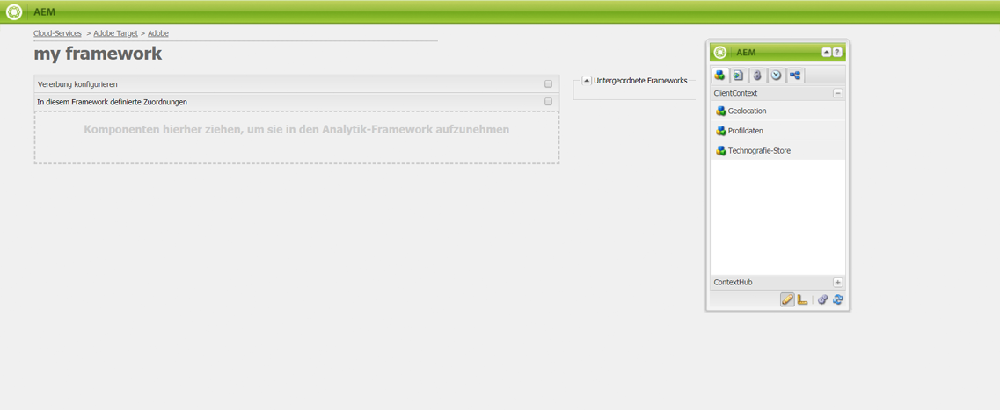
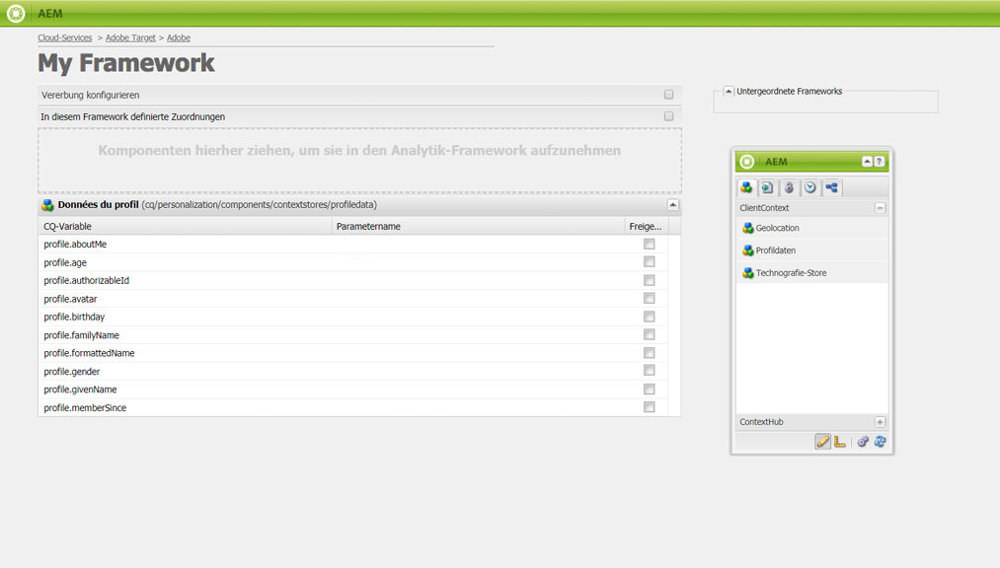
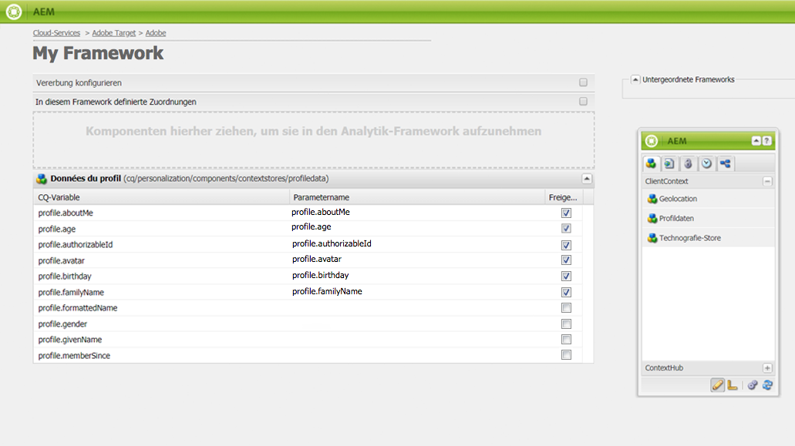
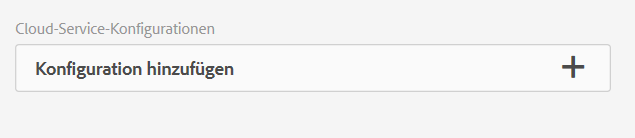

# Manuelles Konfigurieren der Integration mit Adobe Target {#manually-configuring-the-integration-with-adobe-target}

Sie können entweder die Konfigurationen für den Opt-in-Assistenten ändern, die Sie während der Nutzung des Assistenten vorgenommen haben, oder Sie können die Integration mit Adobe Target manuell durchführen, ohne den Assistenten zu nutzen.

## Ändern der Konfigurationen für den Opt-in-Assistenten {#modifying-the-opt-in-wizard-configurations}

Der [Opt-in-Assistent](/help/sites-administering/opt-in.md), den [AEM in Adobe Target](/help/sites-administering/target.md) integriert, erstellt automatisch eine Target-Cloud-Konfiguration mit dem Namen &quot;Bereitgestellte Target-Konfiguration&quot;. Außerdem erstellt der Assistent ein Target-Framework für die Cloud-Konfiguration mit dem Namen „Bereitgestelltes Target-Framework“. Sie können die Eigenschaften der Cloud-Konfiguration und des Frameworks bei Bedarf ändern.

Darüber hinaus können Sie Adobe Target auch als Quelle für die Berichterstellung für bestimmte Inhalte konfigurieren, indem Sie die „A4T-Analyse-Cloud-Konfiguration“ konfigurieren.

Um die Cloud-Konfiguration und das Framework zu finden, navigieren Sie zu **Cloud Services** über **Tools** > **Bereitstellung** > **Cloud**. ([http://localhost:4502/libs/cq/core/content/tools/cloudservices.html](http://localhost:4502/libs/cq/core/content/tools/cloudservices.html)) Klicken oder tippen Sie unterhalb von Adobe Target auf **Konfigurationen anzeigen**.

### Eigenschaften der bereitgestellten Target-Konfiguration {#provisioned-target-configuration-properties}

Die folgenden Eigenschaftswerte werden in der Cloud-Konfiguration „Bereitgestellte Target-Konfiguration“ verwendet, die vom Opt-in-Assistenten erstellt wird:

* **Client-Code:** Wie im Opt-in-Assistenten eingegeben.
* **E-Mail:** Wie im Opt-in-Assistenten eingegeben.
* **Kennwort:** Wie im Opt-in-Assistenten eingegeben.
* **API-Typ:** REST
* **Segmente aus Adobe Target synchronisieren:** Ausgewählt.

* **Client-Bibliothek:** mbox.js.
* **Verwenden Sie DTM zur Bereitstellung der Client-Bibliothek:** Nicht ausgewählt. Wählen Sie diese Option aus, wenn Sie [DTM](/help/sites-administering/dtm.md) oder ein anderes Tag-Management-System verwenden, um die Datei mbox.js oder AT.js zu hosten. Adobe empfiehlt zum Bereitstellen der Bibliothek die Verwendung von DTM anstelle von AEM.

* **Benutzerdefinierte mbox.js:** Keine Angabe, sodass die standardmäßige mbox.js-Datei verwendet wird. Geben Sie bei Bedarf eine benutzerdefinierte Version der Datei „mbox.js“ an. Sie wird nur angezeigt, wenn Sie „mbox.js“ ausgewählt haben.
* **Benutzerdefiniertes AT.js:** Keine Angabe, sodass die standardmäßige AT.js-Datei verwendet wird. Geben Sie bei Bedarf eine benutzerdefinierte Version der Datei „AT.js“ an. Sie wird nur angezeigt, wenn Sie „AT.js“ ausgewählt haben.

>[!NOTE]
>
>In AEM 6.3 können Sie die Target-Bibliotheksdatei [AT.JS](https://docs.adobe.com/content/help/en/target/using/implement-target/client-side/mbox-implement/mbox-download.html) auswählen. Hierbei handelt es sich um eine neue Implementierungsbibliothek für Adobe Target, die sowohl für typische Webimplementierungen als auch für Einzelseitenanwendungen entwickelt wurde.
>
>„AT.js“ bietet im Vergleich zur Bibliothek „mbox.js“ viele Verbesserungen, z. B.:
>
>* Verbesserte Seitenladezeiten für Web-Implementierungen
>* Verbesserte Sicherheit
>* Bessere Implementierungsoptionen für Einzelseitenanwendungen
>* „AT.js“ enthält die Komponenten, die in „target.js“ enthalten waren, sodass „target.js“ nicht mehr aufgerufen wird.


### Eigenschaften von „Bereitgestelltes Target-Framework“ {#provisioned-target-framework-properties}

Das bereitgestellte Target-Framework, das vom Opt-in-Assistenten erstellt wird, ist für das Senden von Kontextdaten aus dem Profildatenspeicher konfiguriert. Die Datenelemente zu Alter und Geschlecht aus dem Speicher werden standardmäßig an Target gesendet. Es kann sein, dass für Ihre Lösung zusätzliche Parameter gesendet werden müssen.



Sie können das Framework so konfigurieren, dass zusätzliche Kontextinformationen an Target gesendet werden, wie unter [Hinzufügen eines Target-Frameworks](/help/sites-administering/target-configuring.md#adding-a-target-framework) beschrieben.

### Konfigurieren der A4T-Analyse-Cloud-Konfiguration {#configuring-a-t-analytics-cloud-configuration}

Sie können Adobe Target so konfigurieren, dass Adobe Analytics als Quelle für die Berichterstellung zu bestimmten Inhalten verwendet wird.

>[!NOTE]
>
>User-Credential Authentication (Legacy) funktioniert nicht mit A4T (sowohl für Target als auch Analytics). Daher sollten Kunden die IMS-Authentifizierung anstelle der Authentifizierung mit Benutzerberechtigungen verwenden.

Hierfür müssen Sie angeben, mit welcher A4T-Cloud-Konfiguration Ihre Adobe Target-Cloud-Konfiguration verbunden werden soll:

1. Navigieren Sie zu **Cloud Services** über das AEM **Logo** > **Tools** > **Bereitstellung** > **Cloud Services**.
1. Klicken Sie im Abschnitt **Adobe Target** auf **Jetzt konfigurieren**.
1. Stellen Sie erneut eine Verbindung mit Ihrer Adobe Target-Konfiguration her.
1. Wählen Sie im Dropdown-Menü **A4T-Analyse-Cloud-Konfiguration** das Framework aus.

   >[!NOTE]
   >
   >Es sind nur Analysekonfigurationen verfügbar, die für A4T aktiviert sind.
   >
   >Beim Konfigurieren von A4T mit AEM kann es vorkommen, dass der Eintrag „Konfigurationsverweis fehlt“ angezeigt wird. Gehen Sie wie folgt vor, um das Analyse-Framework auszuwählen:
   >
   >1. Navigieren Sie zu **Tools** > **Allgemein** > **CRXDE Lite**.
   1. Navigieren Sie zu [1] (siehe unten).
   1. Legen Sie die Eigenschaft **disable** auf **false** fest.
   1. Tippen oder klicken Sie auf **Alle speichern**.


[1]

```
   >/libs/cq/analytics/components/testandtargetpage/dialog/items/tabs/items/tab1_general/items/a4tAnalyticsConfig
```


Klicken Sie auf **OK**. Beim Verwenden von Adobe Target für Inhalte können Sie die [Quelle für die Berichterstellung auswählen](/help/sites-authoring/content-targeting-touch.md).

## Manuelles Integrieren mit Adobe Target {#manually-integrating-with-adobe-target}

Sie können das Integrieren mit Adobe Target auch manuell durchführen, anstatt den Opt-in-Assistenten zu verwenden.

>[!NOTE]
Die Target-Bibliotheksdatei [AT.JS](https://docs.adobe.com/content/help/en/target/using/implement-target/client-side/mbox-implement/mbox-download.html) ist eine neue Implementierungsbibliothek für Adobe Target, die sowohl für typische Webimplementierungen als auch für Einzelseitenanwendungen entwickelt wurde. Adobe empfiehlt, anstelle von „mbox.js“ die Datei „AT.js“ als Client-Bibliothek zu verwenden.
„AT.js“ bietet im Vergleich zur Bibliothek „mbox.js“ viele Verbesserungen, z. B.:
* Verbesserte Seitenladezeiten für Web-Implementierungen
* Verbesserte Sicherheit
* Bessere Implementierungsoptionen für Einzelseitenanwendungen
* „AT.js“ enthält die Komponenten, die in „target.js“ enthalten waren, sodass „target.js“ nicht mehr aufgerufen wird.
Sie können im Dropdown-Menü **Client-Bibliothek** die Datei „AT.js“ oder „mbox.js“ auswählen.

### Erstellen einer Target-Cloud-Konfiguration {#creating-a-target-cloud-configuration}

Erstellen Sie eine Target-Cloud-Konfiguration, um für AEM die Interaktion mit Adobe Target zu ermöglichen. Zum Erstellen der Konfiguration geben Sie den Adobe Target-Client-Code und die Benutzeranmeldeinformationen an.

Sie erstellen die Target-Cloud-Konfiguration nur einmal, da Sie die Konfiguration mehreren AEM-Kampagnen zuordnen können. Erstellen Sie eine Konfiguration für jeden Client-Code, falls Sie über mehrere Adobe Target-Client-Codes verfügen.

Sie können die Cloud-Konfiguration so konfigurieren, dass Segmente aus Adobe Target synchronisiert werden. Wenn Sie die Synchronisierung aktivieren, werden die Segmente im Hintergrund aus Target importiert, sobald die Cloud-Konfiguration gespeichert wurde.

Verwenden Sie das folgende Verfahren, um eine Target-Cloud-Konfiguration in AEM zu erstellen:

1. Navigieren Sie zu **Cloud Services** über das AEM **Logo** > **Tools** > **Bereitstellung** > **Cloud Services**. ([http://localhost:4502/libs/cq/core/content/tools/cloudservices.html](http://localhost:4502/libs/cq/core/content/tools/cloudservices.html))

   Die Übersichtsseite **Adobe Marketing Cloud** wird geöffnet.

1. Klicken Sie im Abschnitt **Adobe Target** auf **Jetzt konfigurieren**.
1. Im Dialogfeld **Konfiguration erstellen** :

   1. Geben Sie der Konfiguration **Titel**.
   1. Wählen Sie die Vorlage **Adobe Target Configuration** aus.
   1. Klicken Sie auf **Erstellen**.

   Das Dialogfeld „Bearbeiten“ wird geöffnet.

   

   >[!NOTE]
   Beim Konfigurieren von A4T mit AEM kann es vorkommen, dass der Eintrag „Konfigurationsverweis fehlt“ angezeigt wird. Gehen Sie wie folgt vor, um das Analyse-Framework auszuwählen:
   1. Navigieren Sie zu **Tools** > **Allgemein** > **CRXDE Lite**.
   1. Navigieren Sie zu **/libs/cq/analytics/components/testandtargetpage/dialog/items/tabs/items/tab1_general/items/a4tAnalyticsConfig**
   1. Legen Sie die Eigenschaft **disable** auf **false** fest.
   1. Tippen oder klicken Sie auf **Alle speichern**.


1. Geben Sie im Dialogfeld Werte für diese Eigenschaften an.

   * **Client-Code**: Der Client-Code des Target-Kontos.
   * **E-Mail**: Die E-Mail-Adresse des Target-Kontos.
   * **Kennwort**: Das Kennwort des Target-Kontos.
   * **API-Typ**: Entweder „REST“ oder „XML“.
   * **A4T-Analyse-Cloud-Konfiguration**: Wählen Sie die Analyse-Cloud-Konfiguration aus, die für Target-Aktivitätsziele und -metriken verwendet wird. Sie benötigen sie, wenn Sie Adobe Analytics als Quelle für die Berichterstellung für bestimmte Inhalte verwenden. Wenn Ihre Cloud-Konfiguration nicht angezeigt wird, finden Sie weitere Informationen unter [Konfigurieren der A4T-Analytics Cloud-Konfiguration](#configuring-a-t-analytics-cloud-configuration).

   * **Präzise Zielgruppenbestimmung verwenden:** Standardmäßig ist dieses Kontrollkästchen aktiviert. Bei Aktivierung dieser Option wird für die Cloud Service-Konfiguration gewartet, bis das Laden des Kontexts erfolgt ist, bevor der Inhalt geladen wird. Siehe Hinweis unten.
   * **Segmente aus Adobe Target synchronisieren:** Wählen Sie diese Option, um in Target definierte Segmente herunterzuladen und in AEM zu verwenden. Sie müssen diese Option auswählen, wenn die Eigenschaft „API-Typ“ auf „REST“ festgelegt ist, da Inline-Segmente nicht unterstützt werden und Sie immer Segmente aus Target verwenden müssen. (Beachten Sie, dass der AEM-Begriff „Segment“ hier dem Target-Begriff „Zielgruppe“ entspricht.)
   * **Client-Bibliothek:** Wählen Sie aus, ob die mbox.js- oder AT.js-Client-Bibliothek verwendet werden soll.
   * **DTM zur Bereitstellung der Client-Bibliothek**  verwenden - Wählen Sie diese Option, um entweder AT.js oder mbox.js aus DTM oder einem anderen Tag-Management-System zu verwenden. Sie müssen [die DTM-Integration](/help/sites-administering/dtm.md) konfigurieren, um diese Option verwenden zu können. Adobe empfiehlt zum Bereitstellen der Bibliothek die Verwendung von DTM anstelle von AEM.
   * **Benutzerdefinierte mbox.js**: Lassen Sie dieses Feld leer, wenn Sie das Feld „DTM“ aktiviert haben oder die standardmäßige Datei „mbox.js“ verwenden möchten. Alternativ hierzu können Sie Ihre benutzerdefinierte Datei „mbox.js“ hochladen. Sie wird nur angezeigt, wenn Sie „mbox.js“ ausgewählt haben.
   * **Benutzerdefiniertes AT.js**: Lassen Sie dieses Feld leer, wenn Sie das Feld „DTM“ aktiviert haben oder die standardmäßige Datei „AT.js“ verwenden möchten. Alternativ hierzu können Sie Ihre benutzerdefinierte Datei „AT.js“ hochladen. Sie wird nur angezeigt, wenn Sie „AT.js“ ausgewählt haben.

   >[!NOTE]
   Wenn Sie den Opt-in für den Adobe Target-Konfigurationsassistenten durchführen, wird die „präzise Zielgruppenerfassung“ aktiviert.
   Präzise Zielgruppenerfassung bedeutet, dass für die Cloud Service-Konfiguration gewartet wird, bis das Laden des Kontexts erfolgt ist, bevor der Inhalt geladen wird. Daher kann es in Bezug auf die Leistung bei der präzisen Zielgruppenerfassung zu einer Verzögerung von einigen Millisekunden kommen, bevor das Laden des Inhalts erfolgt.
   Die präzise Zielgruppenerfassung ist auf der Autoreninstanz immer aktiviert. Auf der Veröffentlichungsinstanz können Sie die präzise Zielgruppenerfassung aber global deaktivieren, indem Sie in der Cloud Service-Konfiguration das Häkchen neben „Präzise Zielgruppenerfassung“ entfernen (**http://localhost:4502/etc/cloudservices.html**). Außerdem können Sie die präzise Zielgruppenerfassung unabhängig von Ihrer Einstellung in der Cloud Service-Konfiguration auch für einzelne Komponenten ein- oder ausschalten.
   Wenn Sie Komponenten als Ziel ***bereits*** angegeben haben und diese Einstellung dann ändern, wirken sich Ihre Änderungen nicht auf diese Komponenten aus. Sie müssen alle Änderungen an dieser Komponente direkt vornehmen.

1. Klicken Sie auf **Mit Target verbinden**, um die Verbindung mit Target zu initialisieren. Wenn die Verbindung erfolgreich hergestellt wurde, wird die Meldung **Verbindung erfolgreich** angezeigt. Klicken Sie auf **OK** und dann auf **OK.**

   Falls Sie keine Verbindung mit Target herstellen können, helfen Ihnen die Informationen im Abschnitt zur [Fehlerbehebung](/help/sites-administering/target-configuring.md#troubleshooting-target-connection-problems) weiter.

### Hinzufügen eines Target-Frameworks {#adding-a-target-framework}

Nachdem Sie die Target-Cloud-Konfiguration konfiguriert haben, können Sie ein Target-Framework hinzufügen. Das Framework identifiziert die Standardparameter, die von den verfügbaren [ClientContext](/help/sites-administering/client-context.md)- oder [ContextHub](/help/sites-developing/ch-configuring.md)-Komponenten an Adobe Target gesendet werden. Target nutzt die Parameter, um die Segmente zu ermitteln, die für den aktuellen Kontext gelten.

Sie können für eine Target-Konfiguration mehrere Frameworks erstellen. Mehrere Frameworks sind nützlich, wenn Sie für unterschiedliche Abschnitte Ihrer Website jeweils einen anderen Parametersatz an Target senden müssen. Erstellen Sie ein Framework für jeden Parametersatz, der gesendet werden muss. Ordnen Sie die einzelnen Abschnitte Ihrer Website jeweils dem passenden Framework zu. Beachten Sie, dass für eine Webseite nur jeweils ein Framework verwendet werden kann.

1. Klicken Sie auf Ihrer Target-Konfigurationsseite auf das Pluszeichen **+** neben Verfügbare Frameworks.
1. Geben Sie im Dialogfeld &quot;Framework erstellen&quot;einen **Titel** an, wählen Sie das **Adobe Target Framework** aus und klicken Sie auf **Erstellen**.

   

   Die Framework-Seite wird geöffnet. Der Sidekick stellt Komponenten bereit, die Informationen aus dem [ClientContext](/help/sites-administering/client-context.md) oder [ContextHub](/help/sites-developing/ch-configuring.md) darstellen, den Sie zuordnen können.

   

1. Ziehen Sie die ClientContext-Komponente mit den Daten, die Sie für die Zuordnung nutzen möchten, auf das Ablageziel. Alternativ hierzu können Sie die **ContextHub-Store**-Komponente auf das Framework ziehen.

   >[!NOTE]
   Bei der Zuordnung werden Parameter über einfache Zeichenfolgen an mbox übergeben. Es ist nicht möglich, Arrays aus ContextHub zuzuordnen.

   Wenn Sie beispielsweise **Profildaten** für Ihre Site-Besucher verwenden möchten, um Ihre Target-Kampagne zu steuern, ziehen Sie die Komponente **Profildaten** auf die Seite. Es werden die Profildatenvariablen angezeigt, die für die Zuordnung zu Target-Parametern verfügbar sind.

   

1. Wählen Sie die Variablen aus, die für das Adobe Target-System sichtbar sein sollen, indem Sie das Kontrollkästchen **Freigeben** in den entsprechenden Spalten auswählen.

   

   >[!NOTE]
   Parameter können nur in einer Richtung synchronisiert werden: von AEM nach Adobe Target.

Ihr Framework wird erstellt. Verwenden Sie die Sidekick-Option **Framework aktivieren**, um das Framework auf der Veröffentlichungsinstanz zu replizieren.

### Zuordnen von Aktivitäten zur Target-Cloud-Konfiguration  {#associating-activities-with-the-target-cloud-configuration}

Verknüpfen Sie Ihre [AEM Aktivitäten](/help/sites-authoring/activitylib.md) mit Ihrer Target-Cloud-Konfiguration, damit Sie die Aktivitäten in [Adobe Target](https://docs.adobe.com/content/help/en/target/using/experiences/offers/manage-content.html) spiegeln können.

>[!NOTE]
Welche Aktivitätstypen zur Verfügung stehen, hängt von folgenden Faktoren ab:
* Bei Aktivierung der Option **xt_only** im Adobe Target-Mandanten (Client-Code), der auf AEM-Seite für die Verbindung zu Adobe Target verwendet wird, können Sie in AEM ausschließlich **XT-Aktivitäten** erstellen.
* Ist die Option **xt_only** **nicht** im Adobe Target-Mandanten (Client-Code) aktiviert, können Sie in AEM **sowohl** XT- als auch A/B-Aktivitäten erstellen.
**Zusätzlicher Hinweis:** Bei der Option **xt_only** handelt es sich um eine Einstellung, die auf einen bestimmten Target-Mandanten (Clientcode) angewendet wird und nur in Adobe Target bearbeitet werden kann. Die Option kann in AEM nicht aktiviert oder deaktiviert werden.

### Zuordnen des Target-Frameworks zu Ihrer Website {#associating-the-target-framework-with-your-site}

Nachdem Sie in AEM ein Target-Framework erstellt haben, können Sie dem Framework Ihre Webseiten zuordnen. Die als Ziel angegebenen Komponenten auf den Seiten senden die per Framework definierten Daten zu Tracking-Zwecken an Adobe Target. (Siehe [Content-Targeting](/help/sites-authoring/content-targeting-touch.md).)

Wenn Sie dem Framework eine Seite zuordnen, erben die untergeordneten Seiten die Zuordnung.

1. Navigieren Sie in der Konsole **Sites** zu der Site, die Sie konfigurieren möchten.
1. Wählen Sie entweder [Schnellaktionen](/help/sites-authoring/basic-handling.md#quick-actions) oder [Auswahlmodus](/help/sites-authoring/basic-handling.md) **Eigenschaften anzeigen** aus.
1. Wählen Sie die Registerkarte **Cloud-Services** aus.
1. Tippen/klicken Sie auf **Bearbeiten**.
1. Klicken oder tippen Sie unter **Cloud Service-Konfigurationen** auf **Konfiguration hinzufügen** und wählen Sie **Adobe Target** aus.

   

1. Wählen Sie das gewünschten Framework unter **Konfigurationsverweis** aus.

   >[!NOTE]
   Achten Sie darauf, dass Sie das von Ihnen erstellte **Framework** und nicht die Target-Cloud-Konfiguration auswählen, unter der die Erstellung durchgeführt wurde.

1. Klicken oder tippen Sie auf **Fertig**.
1. Aktivieren Sie die Stammseite der Website, um sie auf dem Veröffentlichungsserver zu replizieren. (Siehe [Veröffentlichen von Seiten](/help/sites-authoring/publishing-pages.md).)

   >[!NOTE]
   Falls das Framework, das Sie an die Seite angefügt haben, noch nicht aktiviert war, wird ein Assistent geöffnet, mit dem Sie hierfür die Veröffentlichung durchführen können.

## Durchführen der Fehlerbehebung für Target-Verbindungsprobleme {#troubleshooting-target-connection-problems}

Führen Sie die folgenden Aufgaben aus, um Probleme zu behandeln, die bei der Verbindungsherstellung mit Target auftreten:

* Stellen Sie sicher, dass die von Ihnen angegebenen Benutzeranmeldeinformationen korrekt sind.
* Vergewissern Sie sich, dass die AEM-Instanz eine Verbindung mit dem Target-Server herstellen kann. Achten Sie beispielsweise darauf, dass Firewallregeln nicht zu einer Blockierung von ausgehenden AEM-Verbindungen führen oder dass AEM für die Verwendung erforderlicher Proxys konfiguriert ist.
* Suchen Sie im AEM-Fehlerprotokoll nach hilfreichen Meldungen. Die Datei „error.log“ ist im Verzeichnis **crx-quickstart/logs** enthalten, in dem AEM installiert ist.
* Beim Bearbeiten der Aktivität in Adobe Target zeigt die URL auf „localhost“. Umgehen Sie dies, indem Sie den AEM-Externalizer auf die richtige URL festlegen.
