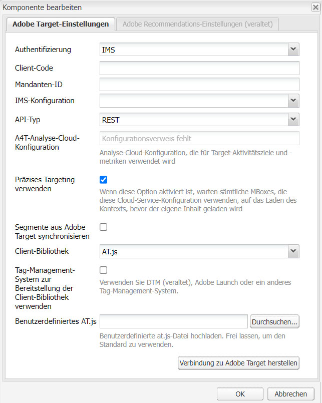

# Manuelles Konfigurieren der Integration mit Adobe Target {#manually-configuring-the-integration-with-adobe-target}

Sie können entweder die Einstellungen des Opt-in-Assistenten ändern, die Sie beim Verwenden des Assistenten vorgenommen haben, oder Sie können die Integration mit Adobe Target manuell vornehmen, ohne den Assistenten zu verwenden.

## Ändern der Konfigurationen für den Opt-in-Assistenten {#modifying-the-opt-in-wizard-configurations}

Der [Opt-in-Assistent](/help/sites-administering/opt-in.md), mit dem [AEM mit Adobe Target integriert wird](/help/sites-administering/target.md), erstellt automatisch eine Target-Cloud-Konfiguration mit dem Namen „Bereitgestellte Target-Konfiguration“. Der Assistent erstellt außerdem ein Target-Framework für die Cloud-Konfiguration mit dem Namen Bereitgestelltes Target-Framework. Sie können bei Bedarf die Eigenschaften der Cloud-Konfiguration und des Frameworks ändern.

Darüber hinaus können Sie Adobe Target auch als Quelle für das Reporting für bestimmte Inhalte konfigurieren, indem Sie die „A4T-Analytics-Cloud-Konfiguration“ konfigurieren.

Navigieren Sie über **Tools** > **Implementierung** > **Cloud** zu **Cloud-Services**, um die Cloud-Konfiguration und das Framework zu ermitteln. ([http://localhost:4502/libs/cq/core/content/tools/cloudservices.html](http://localhost:4502/libs/cq/core/content/tools/cloudservices.html)) Klicken oder tippen Sie unterhalb von Adobe Target auf **Konfigurationen anzeigen**.

### Eigenschaften der bereitgestellten Target-Konfiguration {#provisioned-target-configuration-properties}

Die folgenden Eigenschaftswerte werden in der vom Opt-in-Assistenten erstellten Cloud-Konfiguration der bereitgestellten Target-Konfiguration verwendet:

* **Client-Code:** Wie im Opt-in-Assistenten eingegeben
* **E-Mail:** Wie im Opt-in-Assistenten eingegeben
* **Kennwort:** Wie im Opt-in-Assistenten eingegeben
* **API-Typ:** REST
* **Segmente aus Adobe Target synchronisieren:** Ausgewählt

* **Client-Bibliothek:** mbox.js
* **DTM zur Bereitstellung der Client-Bibliothek verwenden:** Nicht ausgewählt Wählen Sie diese Option aus, wenn Sie [DTM](/help/sites-administering/dtm.md) oder ein anderes System für das Tag-Management nutzen, um die Datei „mbox.js“ oder „AT.js“ zu hosten. Adobe empfiehlt zum Bereitstellen der Bibliothek die Verwendung von DTM anstelle von AEM.

* **Benutzerdefinierte mbox.js:** Keine Angabe, sodass die standardmäßige Datei „mbox.js“ verwendet wird. Geben Sie bei Bedarf eine benutzerdefinierte mbox.js-Datei an, die Sie verwenden möchten. Wird nur angezeigt, wenn Sie mbox.js ausgewählt haben.
* **Benutzerdefinierte AT.js:** Keine Angabe, sodass die standardmäßige Datei „AT.js“ verwendet wird. Geben Sie bei Bedarf eine benutzerdefinierte AT.js-Datei an, die Sie verwenden möchten. Sie wird nur angezeigt, wenn Sie „AT.js“ ausgewählt haben.

>[!NOTE]
>
>In AEM 6.3 können Sie die Target-Bibliotheksdatei [AT.js](https://developer.adobe.com/target/implement/client-side/atjs/atjs-functions/mboxcreate-atjs/) auswählen. Dies ist eine neue Implementierungsbibliothek für Adobe Target, die sowohl für typische Web-Implementierungen als auch für Single Page Applications (SPA) ausgelegt ist.
>
>AT.js bietet gegenüber der mbox.js -Bibliothek verschiedene Verbesserungen:
>
>* Verbesserte Seitenladezeiten für Webimplementierungen
>* Verbesserte Sicherheit
>* Bessere Implementierungsoptionen für Single Page Applications (SPA)
>* AT.js enthält die Komponenten, die sich in target.js befanden, weshalb kein Aufruf mehr an Target erfolgt.


<!-- OLD URL WHICH IS 404 https://experienceleague.adobe.com/docs/target/using/implement-target/client-side/mbox-implement/mbox-download.html -->

### Bereitgestellte Target-Framework-Eigenschaften {#provisioned-target-framework-properties}

Das vom Opt-in-Assistenten erstellte bereitgestellte Target-Framework ist so konfiguriert, dass Kontextdaten aus dem Profildatenspeicher gesendet werden. Die Datenelemente für Alter und Geschlecht des Stores werden standardmäßig an Target gesendet. Ihre Lösung erfordert wahrscheinlich, dass zusätzliche Parameter gesendet werden.


Sie können das Framework so konfigurieren, dass zusätzliche Kontextinformationen an Target gesendet werden, wie unter [Hinzufügen eines Target-Frameworks](/help/sites-administering/target-configuring.md#adding-a-target-framework).

### Konfigurieren der A4T-Analytics-Cloud-Konfiguration {#configuring-a-t-analytics-cloud-configuration}

Sie können Adobe Target so konfigurieren, dass Adobe Analytics als Quelle für das Reporting zu bestimmten Inhalten verwendet wird.

>[!NOTE]
>
>Die Authentifizierung mit Benutzerberechtigungen (veraltet) funktioniert nicht mit A4T (sowohl für Target als auch Analytics). Daher sollten Kunden die IMS-Authentifizierung anstelle der Authentifizierung mit Benutzerberechtigungen verwenden.

Geben Sie dazu an, mit welcher A4T-Cloud-Konfiguration Ihre Adobe Target-Cloud-Konfiguration verbunden werden soll:

1. Navigieren Sie über das **AEM-Logo** und **Tools** > **Implementierung** > **Cloud-Services** zu **Cloud-Services**.
1. Klicken Sie im Abschnitt **Adobe Target** auf **Jetzt konfigurieren**.
1. Stellen Sie eine erneute Verbindung zu Ihrer Adobe Target-Konfiguration her.
1. Wählen Sie im Dropdown-Menü **A4T-Analytics-Cloud-Konfiguration** das Framework aus.

   >[!NOTE]
   >
   >Es sind nur Analytics-Konfigurationen verfügbar, die für A4T aktiviert sind.
   >
   >Beim Konfigurieren von A4T mit AEM kann es vorkommen, dass der Eintrag „Konfigurationsverweis fehlt“ angezeigt wird. Gehen Sie wie folgt vor, um das Analytics-Framework auswählen zu können:
   >
   >1. Navigieren Sie zu **Tools** > **Allgemein** > **CRXDE Lite**.
   1. Navigieren Sie zum [Dialogfeld „A4T-Analytics-Konfiguration“](#a4t-analytics-config-dialog) (siehe unten)
   1. Legen Sie die Eigenschaft **deaktivieren** auf **false** fest.
   1. Tippen oder klicken Sie auf **Alle speichern**.


#### Dialogfeld „A4T-Analytics-Konfiguration“ {#a4t-analytics-config-dialog}

```xml
/libs/cq/analytics/components/testandtargetpage/dialog/items/tabs/items/tab1_general/items/a4tAnalyticsConfig
```



Klicken Sie auf **OK**. Beim Verwenden von Adobe Target für Inhalte können Sie die [Quelle für das Reporting auswählen](/help/sites-authoring/content-targeting-touch.md).

## Manuelle Integration mit Adobe Target {#manually-integrating-with-adobe-target}

Integrieren Sie manuell mit Adobe Target, anstatt den Opt-in-Assistenten zu verwenden.

>[!NOTE]
Die Target-Bibliotheksdatei [AT.js](https://developer.adobe.com/target/implement/client-side/atjs/atjs-functions/mboxcreate-atjs/) ist die neue Implementierungsbibliothek für Adobe Target. Sie ist sowohl auf typische Web-Implementierungen als auch auf Single Page Applications (SPA) ausgelegt. Adobe empfiehlt die Verwendung von AT.js anstelle von mbox.js als Client-Bibliothek.
AT.js bietet gegenüber der mbox.js -Bibliothek verschiedene Verbesserungen:
* Verbesserte Seitenladezeiten für Webimplementierungen
* Verbesserte Sicherheit
* Bessere Implementierungsoptionen für Single Page Applications (SPA)
* &quot;AT.js&quot;enthält die Komponenten, die sich in &quot;target.js&quot;befanden, weshalb kein Aufruf mehr an &quot;target.js&quot;erfolgt
>
Sie können im Dropdown-Menü **Client-Bibliothek** die Datei „AT.js“ oder „mbox.js“ auswählen.

<!-- OLD URL from above was 404 https://experienceleague.adobe.com/docs/target/using/implement-target/client-side/mbox-implement/mbox-download.html -->

### Erstellen einer Target Cloud-Konfiguration {#creating-a-target-cloud-configuration}

Erstellen Sie eine Target-Cloud-Konfiguration, damit AEM mit Adobe Target interagieren können. Um die Konfiguration zu erstellen, geben Sie den Adobe Target-Clientcode und die Benutzeranmeldeinformationen an.

Sie erstellen die Target-Cloud-Konfiguration nur einmal, da Sie die Konfiguration mit mehreren AEM Kampagnen verknüpfen können. Wenn Sie mehrere Adobe Target-Clientcodes haben, erstellen Sie für jeden Clientcode eine Konfiguration.

Sie können die Cloud-Konfiguration so konfigurieren, dass Segmente aus Adobe Target synchronisiert werden. Wenn Sie die Synchronisierung aktivieren, werden Segmente beim Speichern der Cloud-Konfiguration aus Target im Hintergrund importiert.

Gehen Sie wie folgt vor, um eine Target-Cloud-Konfiguration in AEM zu erstellen:

1. Navigieren Sie zu **Cloud Services** über das **AEM-Logo** > **Tools** > **Cloud-Services** > **Legacy-Cloud-Services**. ([http://localhost:4502/libs/cq/core/content/tools/cloudservices.html](http://localhost:4502/libs/cq/core/content/tools/cloudservices.html))

   Die Übersichtsseite **Cloud-Services** wird geöffnet.

1. Klicken Sie im Abschnitt **Adobe Target** auf **Jetzt konfigurieren**.
1. Im Dialogfeld **Konfiguration erstellen**:

   1. Geben Sie der Konfiguration einen **Titel**.
   1. Wählen Sie die Vorlage **Adobe Target-Konfiguration** aus.
   1. Klicken Sie auf **Erstellen**.

   Das Dialogfeld „Bearbeiten“ wird geöffnet.

   

   >[!NOTE]
   Beim Konfigurieren von A4T mit AEM kann es vorkommen, dass der Eintrag „Konfigurationsverweis fehlt“ angezeigt wird. Gehen Sie wie folgt vor, um das Analytics-Framework auswählen zu können:
   1. Navigieren Sie zu **Tools** > **Allgemein** > **CRXDE Lite**.
   1. Navigieren Sie zu **/libs/cq/analytics/components/testandtargetpage/dialog/items/tabs/items/tab1_general/items/a4tAnalyticsConfig**.
   1. Legen Sie die Eigenschaft **deaktivieren** auf **false** fest.
   1. Tippen oder klicken Sie auf **Alle speichern**.


1. Geben Sie im Dialogfeld Werte für diese Eigenschaften an.

   * **Client-Code**: Der Client-Code des Target-Kontos
   * **E-Mail**: die E-Mail-Adresse des Target-Kontos.
   * **Passwort**: das Target-Kontokennwort.
   * **API-Typ**: entweder REST oder XML
   * **A4T Analytics Cloud-Konfiguration**: Wählen Sie die Analytics Cloud-Konfiguration aus, die für Zielaktivitätsziele und -metriken verwendet wird. Sie benötigen diese Konfiguration, wenn Sie beim Targeting von Inhalten Adobe Analytics als Berichtsquelle verwenden. Falls Ihre Cloud-Konfiguration nicht angezeigt wird, hilft Ihnen der Hinweis unter [Konfigurieren der A4T-Analytics-Cloud-Konfiguration](#configuring-a-t-analytics-cloud-configuration) weiter.

   * **Präzises Targeting verwenden**: Dieses Kontrollkästchen ist standardmäßig aktiviert. Wenn diese Option aktiviert ist, wartet die Cloud Service-Konfiguration darauf, dass der Kontext geladen wird, bevor Inhalte geladen werden. Siehe Hinweis, der folgt.
   * **Segmente aus Adobe Target synchronisieren:** Wählen Sie diese Option aus, damit Sie in Target definierte Segmente herunterladen und in AEM verwenden können. Wählen Sie diese Option aus, wenn die Eigenschaft &quot;API-Typ&quot;REST ist, da Inline-Segmente nicht unterstützt werden und Sie Segmente aus Target verwenden müssen. (Der AEM Begriff &quot;Segment&quot;entspricht der Zielgruppe.)
   * **Client-Bibliothek**: Wählen Sie aus, ob Sie die Client-Bibliothek „mbox.js“ oder „AT.js“ verwenden möchten.
   * **Verwenden von DTM zur Bereitstellung der Client-Bibliothek** - Wählen Sie diese Option, um entweder AT.js oder mbox.js aus DTM oder einem anderen Tag-Management-System zu verwenden. Konfigurieren [die DTM-Integration](/help/sites-administering/dtm.md) , um diese Option zu verwenden. Adobe empfiehlt zum Bereitstellen der Bibliothek die Verwendung von DTM anstelle von AEM.
   * **Benutzerdefinierte mbox.js**: Lassen Sie das Feld leer, wenn Sie das DTM-Feld aktiviert haben oder die standardmäßige mbox.js verwenden möchten. Alternativ können Sie Ihre benutzerdefinierte mbox.js hochladen. Wird nur angezeigt, wenn Sie mbox.js ausgewählt haben.
   * **Benutzerdefinierte at.js**: Lassen Sie das Feld leer, wenn Sie das DTM-Feld aktiviert haben oder die standardmäßige AT.js-Datei verwenden möchten. Alternativ hierzu können Sie Ihre benutzerdefinierte Datei „AT.js“ hochladen. Sie wird nur angezeigt, wenn Sie „AT.js“ ausgewählt haben.

   >[!NOTE]
   Wenn Sie den Opt-in für den Adobe Target-Konfigurationsassistenten durchführen, wird die „präzise Zielgruppenerfassung“ aktiviert.
   Präzise Zielgruppenerfassung bedeutet, dass für die Cloud Service-Konfiguration gewartet wird, bis das Laden des Kontexts erfolgt ist, bevor der Inhalt geladen wird. Aus diesem Grund kann eine präzise Zielgruppenbestimmung hinsichtlich der Leistung eine Verzögerung von einigen Millisekunden vor dem Laden von Inhalten verursachen.
   Die präzise Zielgruppenerfassung ist auf der Autoreninstanz immer aktiviert. Auf der Veröffentlichungsinstanz können Sie die präzise Zielgruppenerfassung aber global deaktivieren, indem Sie in der Cloud Service-Konfiguration das Häkchen neben „Präzise Zielgruppenerfassung“ entfernen (**http://localhost:4502/etc/cloudservices.html**). Sie können das präzise Targeting auch für einzelne Komponenten aktivieren und deaktivieren, unabhängig von Ihrer Einstellung in der Cloud Service-Konfiguration.
   Wenn Sie ***bereits*** Zielkomponenten erstellt haben und Sie diese Einstellung ändern, wirken sich Ihre Änderungen nicht auf diese Komponenten aus. Ändern Sie diese Komponenten direkt.

1. Klicken Sie auf **Mit Target verbinden**, um die Verbindung mit Target zu initialisieren. Wenn die Verbindungsherstellung erfolgreich war, wird die Meldung **Die Verbindung wurde hergestellt** angezeigt. Klicken Sie auf **OK** und dann auf **OK.**

   Wenn Sie keine Verbindung zu Target herstellen können, finden Sie unter [Fehlerbehebung](/help/sites-administering/target-configuring.md#troubleshooting-target-connection-problems) Abschnitt.

### Hinzufügen eines Target-Frameworks {#adding-a-target-framework}

Nachdem Sie die Target-Cloud-Konfiguration konfiguriert haben, fügen Sie ein Target-Framework hinzu. Das Framework identifiziert die Standardparameter, die von der verfügbaren [ClientContext](/help/sites-administering/client-context.md) oder [ContextHub](/help/sites-developing/ch-configuring.md) Komponenten. Target verwendet die Parameter, um die Segmente zu bestimmen, die für den aktuellen Kontext gelten.

Sie können mehrere Frameworks für eine einzelne Target-Konfiguration erstellen. Mehrere Frameworks sind nützlich, wenn Sie für verschiedene Abschnitte Ihrer Website einen anderen Parametersatz an Target senden müssen. Erstellen Sie ein Framework für jeden Satz von Parametern, die Sie senden. Verknüpfen Sie jeden Bereich Ihrer Website mit dem entsprechenden Framework. Eine Webseite kann jeweils nur ein Framework verwenden.

1. Klicken Sie auf der Seite für die Target-Konfiguration auf das Pluszeichen (**+**) neben „Verfügbare Frameworks“.
1. Geben Sie im Dialogfeld „Framework erstellen“ einen **Titel** an, wählen Sie die Option **Adobe Target-Framework** und klicken Sie auf **Erstellen**.

   

   Die Framework-Seite wird geöffnet. Der Sidekick verfügt über Komponenten mit Informationen zu [Client-Kontext](/help/sites-administering/client-context.md) oder [ContextHub](/help/sites-developing/ch-configuring.md), die Sie zuordnen können.

   

1. Ziehen Sie die ClientContext-Komponente mit den Daten, die Sie für die Zuordnung nutzen möchten, auf das Ablageziel. Alternativ hierzu können Sie die **ContextHub-Store**-Komponente auf das Framework ziehen.

   >[!NOTE]
   Bei der Zuordnung werden Parameter über einfache Zeichenfolgen an eine Mbox übergeben. Arrays können nicht über ContextHub zugeordnet werden.

   Verwenden Sie beispielsweise **Profildaten** über Ihre Site-Besucher, um Ihre Target-Kampagne zu steuern, ziehen Sie die **Profildaten** -Komponente auf der Seite. Es werden die Profildatenvariablen angezeigt, die für die Zuordnung zu Target-Parametern verfügbar sind.

   

1. Wählen Sie die Variablen aus, die für das Adobe Target-System sichtbar sein sollen, indem Sie das Kontrollkästchen **Freigeben** in den entsprechenden Spalten auswählen.

   

   >[!NOTE]
   Die Synchronisierung von Parametern ist nur eine Möglichkeit - von AEM zu Adobe Target.

Ihr Framework wird erstellt. Um das Framework auf der Veröffentlichungsinstanz zu replizieren, verwenden Sie die **Framework aktivieren** aus dem Sidekick.

### Verknüpfen von Aktivitäten mit der Target Cloud-Konfiguration  {#associating-activities-with-the-target-cloud-configuration}

Ordnen Sie Ihre [AEM-Aktivitäten](/help/sites-authoring/activitylib.md) Ihrer Target-Cloud-Konfiguration zu, damit Sie die Aktivitäten in [Adobe Target](https://experienceleague.adobe.com/docs/target/using/experiences/offers/manage-content.html?lang=de) spiegeln können.

>[!NOTE]
Welche Aktivitätstypen zur Verfügung stehen, hängt von folgenden Faktoren ab:
* Wenn die Variable **xt_only** ist für den Adobe Target-Mandanten (Clientcode) aktiviert, der auf der AEM für die Verbindung mit Adobe Target verwendet wird. Anschließend können Sie **only** XT-Aktivitäten in AEM.
* Wenn die Variable **xt_only** Option ist **not** im Adobe Target-Mandanten aktiviert ist (Clientcode), können Sie **both** XT- und A/B-Aktivitäten in AEM.
>
**Zusätzliche Anmerkung:** **xt_only** ist eine Einstellung, die auf einen bestimmten Target-Mandanten (Client-Code) angewendet wird und nur direkt in Adobe Target geändert werden kann. Die Option kann in AEM nicht aktiviert oder deaktiviert werden.

### Verknüpfen des Target-Frameworks mit Ihrer Site {#associating-the-target-framework-with-your-site}

Nachdem Sie ein Target-Framework in AEM erstellt haben, verknüpfen Sie Ihre Webseiten mit dem Framework. Die Targeting-Komponenten auf den Seiten senden die durch das Framework definierten Daten zur Nachverfolgung an Adobe Target. (Siehe [Content-Targeting](/help/sites-authoring/content-targeting-touch.md).)

Wenn Sie dem Framework eine Seite zuordnen, erben die untergeordneten Seiten die Zuordnung.

1. Navigieren Sie in der **Sites-Konsole** zu der Website, die Sie konfigurieren möchten.
1. Wählen Sie über [Schnellaktionen](/help/sites-authoring/basic-handling.md#quick-actions) oder den [Auswahlmodus](/help/sites-authoring/basic-handling.md) die Option **Eigenschaften anzeigen**.
1. Wählen Sie die Registerkarte **Cloud-Services** aus.
1. Tippen/klicken Sie auf **Bearbeiten**.
1. Tippen/klicken **Konfiguration hinzufügen** under **Cloud Service-Konfigurationen** und wählen Sie **Adobe Target**.

   

1. Wählen Sie das Framework aus, das Sie unter **Konfigurationsreferenz**.

   >[!NOTE]
   Stellen Sie sicher, dass Sie die spezifische **Framework** die Sie erstellt haben und nicht die Target-Cloud-Konfiguration, unter der sie erstellt wurde.

1. Klicken oder tippen Sie auf **Fertig**.
1. Aktivieren Sie die Stammseite der Website, damit Sie sie auf dem Veröffentlichungsserver replizieren. (Siehe [Veröffentlichen von Seiten](/help/sites-authoring/publishing-pages.md).

   >[!NOTE]
   Wenn das Framework, das Sie an die Seite angehängt haben, noch nicht aktiviert wurde, wird ein Assistent geöffnet, mit dem Sie es auch veröffentlichen können.

## Beheben von Problemen bei der Target-Verbindung {#troubleshooting-target-connection-problems}

Um Probleme zu beheben, die beim Herstellen einer Verbindung mit Target auftreten, können Sie die folgenden Aufgaben ausführen:

* Stellen Sie sicher, dass die von Ihnen angegebenen Benutzeranmeldeinformationen korrekt sind.
* Stellen Sie sicher, dass die AEM-Instanz eine Verbindung zum Target-Server herstellen kann. Vergewissern Sie sich beispielsweise, dass Firewall-Regeln ausgehende AEM nicht blockieren oder dass AEM für die Verwendung der erforderlichen Proxys konfiguriert ist.
* Suchen Sie im AEM nach hilfreichen Meldungen. Die Datei &quot;error.log&quot;befindet sich im **crx-quickstart/logs** Verzeichnis, in dem AEM installiert ist.
* Bei der Bearbeitung der Aktivität in Adobe Target verweist die URL auf localhost. Um dieses Verständnis zu umgehen, setzen Sie den AEM Externalizer auf die richtige URL.
