# Verbesserungen an der Übersetzung{#translation-enhancements}

Diese Seite enthält inkrementelle Verbesserungen und Anpassungen für die Funktionen der AEM-Übersetzungsverwaltung.

## Automatisierung von Übersetzungsprojekten {#translation-project-automation}

Es wurden Optionen zur Verbesserung der Produktivität bei der Arbeit mit Übersetzungsprojekten hinzugefügt, z. B. zum automatischen Hervorheben und Löschen von Übersetzungsstarts und zum Planen der wiederholten Ausführung eines Übersetzungsprojekts.

1. Klicken oder tippen Sie in Ihrem Übersetzungsprojekt unten auf der Kachel **Zusammenfassung der Übersetzung** auf die Auslassungspunkte.

   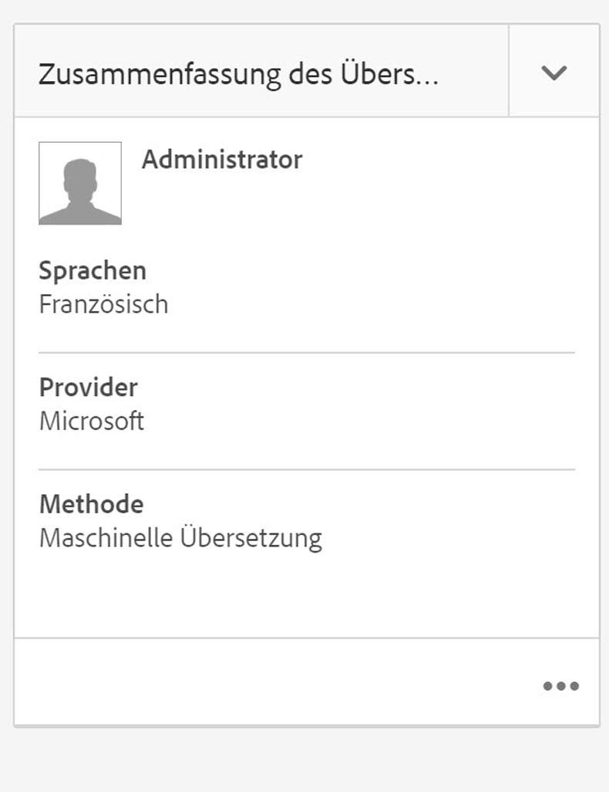

1. Wechseln Sie zur Registerkarte **Erweitert**. Unten können Sie die Option **Übersetzungsstarts automatisch hervorheben** wählen.

   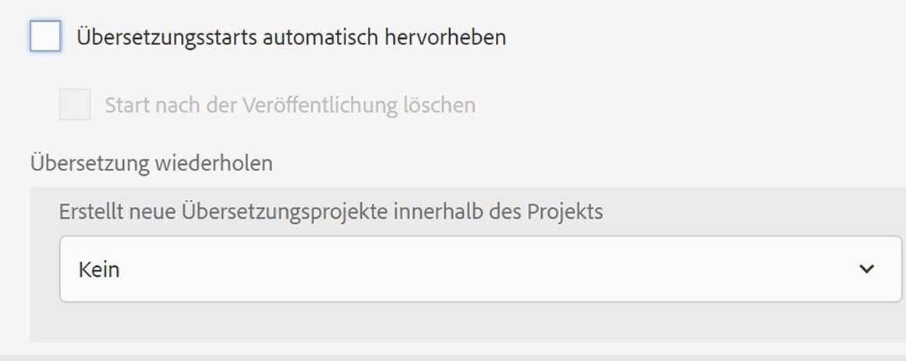

1. Optional können Sie auswählen, ob Übersetzungsstarts nach Erhalt des Übersetzungsinhalts automatisch hervorgehoben und gelöscht werden sollen.

   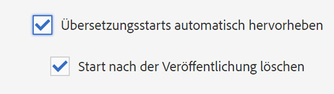

1. Um die wiederholte Ausführung eines Übersetzungsprojekts festzulegen, wählen Sie die Häufigkeit in der Dropdown-Liste **Übersetzung wiederholen** aus. Bei der wiederholten Projektausführung werden Übersetzungsaufträge in den angegebenen Intervallen automatisch erstellt und ausgeführt.

   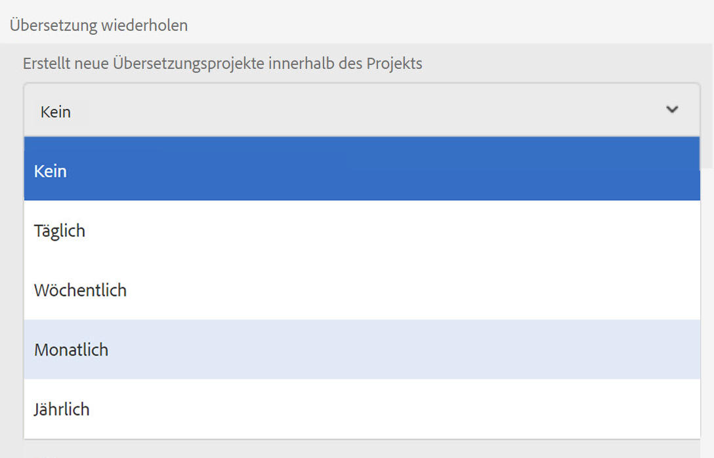

## Mehrsprachige Übersetzungsprojekte {#multilingual-translation-projects}

Es ist möglich, mehrere Zielsprachen in einem Übersetzungsprojekt zu konfigurieren, um die Anzahl der insgesamt erstellten Übersetzungsprojekte zu reduzieren.

1. Klicken oder tippen Sie in Ihrem Übersetzungsprojekt unten auf der Kachel **Zusammenfassung der Übersetzung** auf die Punkte.

   

1. Wechseln Sie zur Registerkarte **Erweitert**. Unter **Zielgruppe** können Sie mehrere Sprachen hinzufügen.

   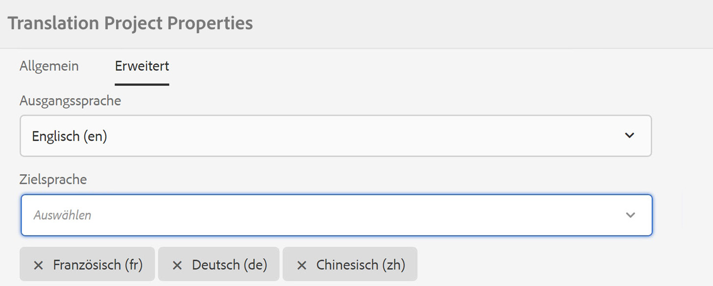

1. Falls Sie die Übersetzung über die Verweisleiste in Sites initiieren, können Sie alternativ hierzu Sprachen hinzufügen und die Option **Mehrsprachiges Übersetzungsprojekt erstellen** wählen.

   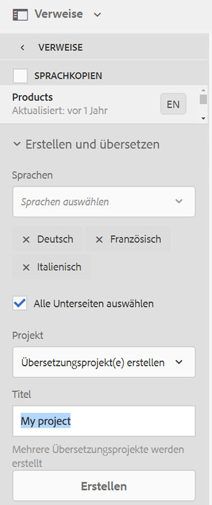

1. Im Projekt werden Übersetzungsaufträge für jede Zielsprache erstellt. Sie können entweder einzeln im Projekt oder gemeinsam gestartet werden, indem das Projekt global auf der Admin-Ebene für Projekte ausgeführt wird.

   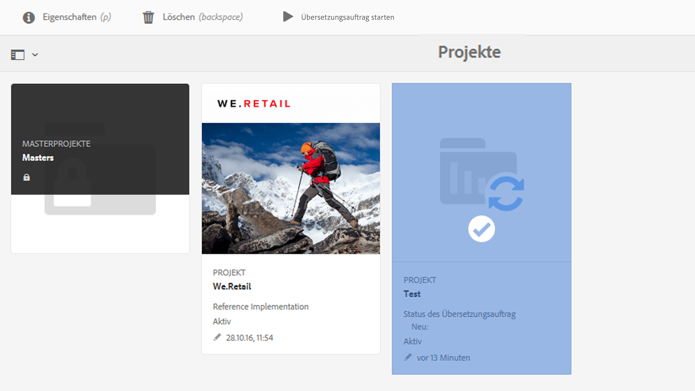

## Translation-Memory-Aktualisierungen {#translation-memory-updates}

Für manuelle Bearbeitungen von übersetzten Inhalten kann wieder eine Synchronisierung mit dem System für die Übersetzungsverwaltung (Translation Management System, TMS) durchgeführt werden, um das Translation Memory zu trainieren.

1. Wählen Sie in der Site-Konsole nach dem Aktualisieren des Textinhalts auf einer übersetzten Seite **Translation Memory** aktualisieren.

   

1. In einer Listenansicht werden die Quelle und die Übersetzung für jede bearbeitete Textkomponente nebeneinander verglichen. Wählen Sie aus, welche Übersetzungsaktualisierungen mit dem Translation Memory synchronisiert werden sollen, und wählen Sie **Speicher aktualisieren**.

   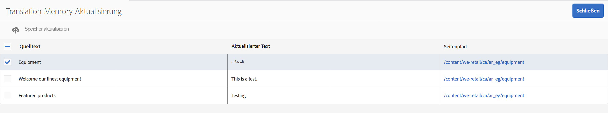

   >[!NOTE]
   >
   >AEM sendet eine XML-Darstellung der ausgewählten Zeichenfolgen zurück an das Translation Management System.

## Sprachkopien auf mehreren Ebenen {#language-copies-on-multiple-levels}

Sie können Sprach-Stämme jetzt unter Knoten gruppieren, z. B. nach Region. Diese werden weiterhin als Stämme von Sprachkopien erkannt.

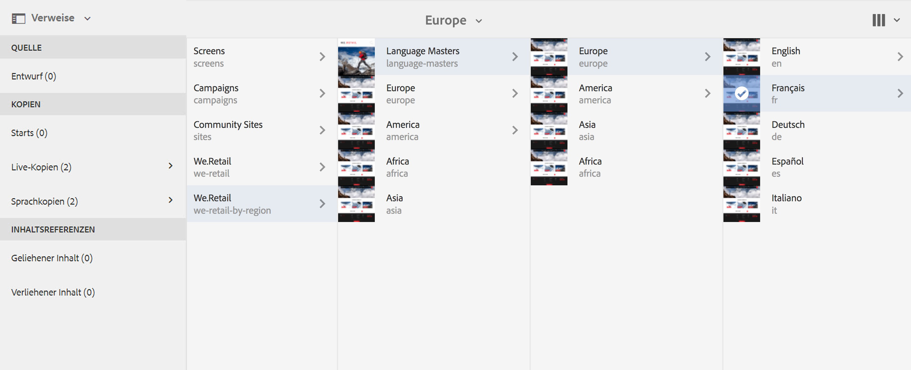

>[!CAUTION]
>
>Hierbei ist nur eine Ebene zulässig. Im folgenden Beispiel ist es nicht zulässig, dass die „es“-Seite in eine Sprachkopie aufgelöst wird:
>
>* `/content/we-retail/language-masters/en`
>* `/content/we-retail/language-masters/americas/central-america/es`

>
>
Die Sprachkopie `es` wird nicht erkannt, da sie zwei Ebenen (americas/central-america) vom Knoten `en` entfernt ist.

>[!NOTE]
>
>Sprach-Stämme können einen beliebigen Seitennamen haben. Es muss nicht immer nur der ISO-Code der Sprache sein. AEM prüft stets zuerst den Pfad und den Namen, aber wenn der Seitenname keinen Hinweis auf eine Sprache enthält, überprüft AEM die Eigenschaft cq:language der Seite, um die Sprache zu identifizieren.

## Meldung zum Übersetzungsstatus {#translation-status-reporting}

In der Sites-Listenansicht können Sie jetzt eine Eigenschaft auswählen, mit der angegeben wird, ob für eine Seite der Status „Übersetzt“ oder „In Übersetzung“ gilt oder ob sie noch nicht übersetzt wurde. Sie können dies wie folgt anzeigen:

1. Wechseln Sie in Sites zur **Listenansicht**.

   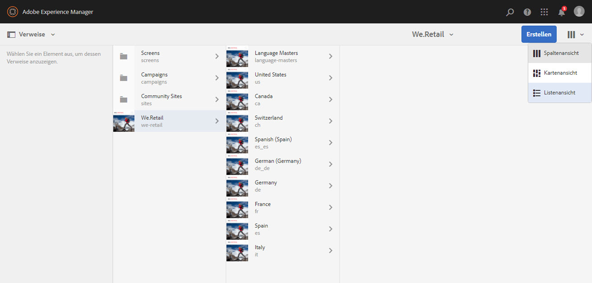

1. Klicken oder tippen Sie auf **Anzeigeeinstellungen**.

   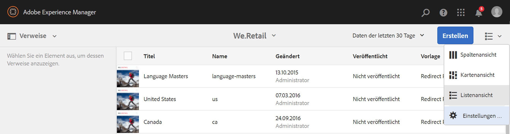

1. Aktivieren Sie unter **Übersetzung** das Kontrollkästchen **Übersetzt** und tippen bzw. klicken Sie auf **Aktualisieren**.

   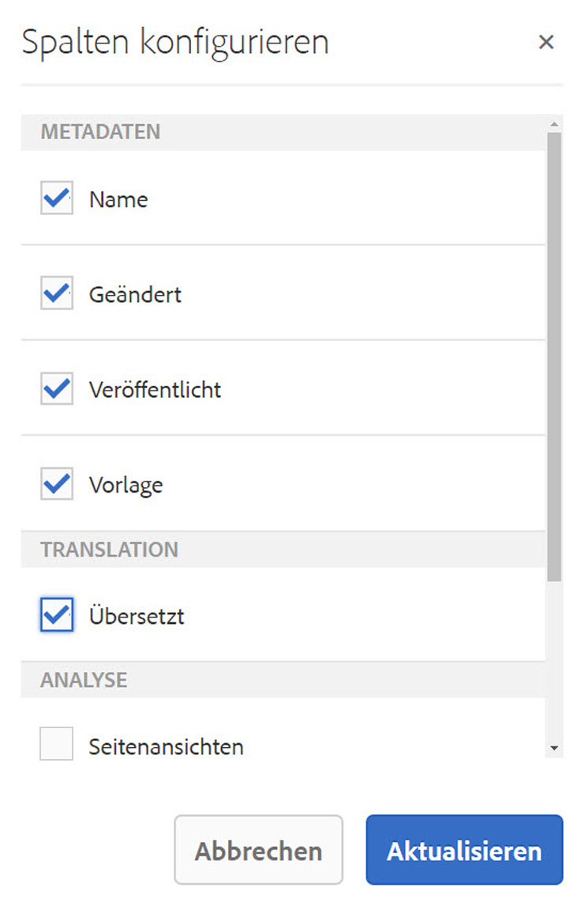

Die Spalte **Übersetzt** mit dem Übersetzungsstatus der Seiten wird angezeigt.

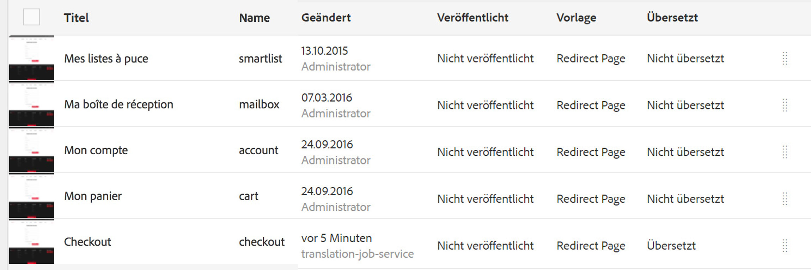

