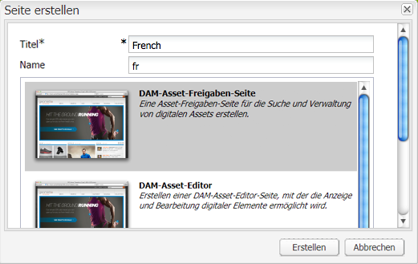
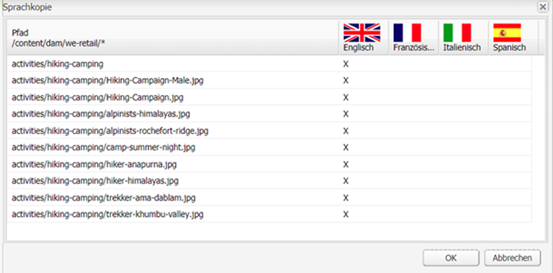
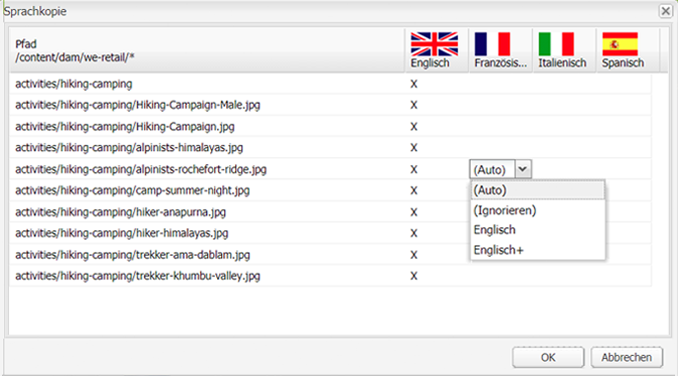

# Erstellen eines Sprach-Stamms mithilfe der klassischen Benutzeroberfläche{#creating-a-language-root-using-the-classic-ui}

Im folgenden Verfahren wird die klassische Benutzeroberfläche zum Erstellen eines Sprach-Stamms einer Website verwendet. Weitere Informationen hierzu finden Sie unter [Erstellen eines Sprach-Stamms](/help/sites-administering/tc-prep.md#creating-a-language-root).

1. Wählen Sie in der Websites-Konsole in der Baumstruktur „Websites“ die Stammseite der Website aus. ([http://localhost:4502/siteadmin#](http://localhost:4502/siteadmin#))
1. Fügt eine neue untergeordnete Seite hinzu, welche die Sprachversion der Website darstellt:

   1. Klicken Sie auf „Neu“ > „Neue Seite“.
   1. Geben Sie in das Dialogfeld den Titel und den Namen ein. Der Name muss im Format `<language-code>` oder `<language-code>_<country-code>` sein, z. B. en, en_US, en_us, en_GB, en_gb.

      * Der unterstützte Sprachcode ist ein aus zwei Buchstaben bestehender Code in Kleinbuchstaben gemäß ISO-639-1
      * Der unterstützte Ländercode ist ein aus zwei Buchstaben bestehender Code in Klein- oder Großbuchstaben gemäß ISO-3166
   1. Wählen Sie die Vorlage aus und klicken Sie auf „Erstellen“.

   

1. Wählen Sie in der Websites-Konsole in der Baumstruktur „Websites“ die Stammseite der Website aus.
1. Wählen Sie im Menü „Tools“ die Option „Sprachkopie“.

   

   Das Dialogfeld „Sprachkopie“ zeigt eine Matrix der verfügbaren Sprachversionen und der Webseiten. Ein x in einer Sprachspalte bedeutet, dass die Seite in dieser Sprache verfügbar ist.

   

1. Zum Kopieren einer vorhandenen Seite oder der Seitenbaumstruktur in eine Sprachversion wählen Sie die Zelle für diese Seite in der Sprachspalte aus. Klicken Sie auf den Pfeil und wählen Sie dann zum Erstellen die gewünschte Art der Kopie aus.

   Im folgenden Beispiel wird die Seite „Ausrüstung“/„Sonnenbrille“/„Irian“ in die französische Sprachversion kopiert.

   

   | Art der Sprachkopie | Beschreibung |
   |---|---|
   | auto | Verwendet das Verhalten von übergeordneten Seiten |
   | ignore | Erstellt keine Kopie dieser Seite und ihrer untergeordneten Elemente |
   | `<language>+` (z. B. Französisch+) | Kopiert die Seite und alle untergeordneten Elemente aus dieser Sprache |
   | `<language>` (z. B. Französisch) | Kopiert nur die Seite aus dieser Sprache |

1. Klicken Sie auf „OK“, um das Dialogfeld zu schließen.
1. Klicken Sie im nächsten Dialogfeld auf „Ja“, um die Kopie zu bestätigen.
