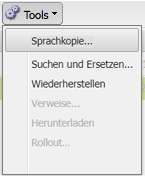

# Erstellen eines Sprachstamms mithilfe der klassischen Benutzeroberfläche{#creating-a-language-root-using-the-classic-ui}

Im folgenden Verfahren wird die klassische Benutzeroberfläche verwendet, um einen Sprachstamm einer Site zu erstellen. Weitere Informationen finden Sie unter [Erstellen eines Sprachstamms](/help/sites-administering/tc-prep.md#creating-a-language-root).

1. Wählen Sie in der Websites-Konsole in der Website-Struktur die Stammseite der Site aus. ([http://localhost:4502/siteadmin#](http://localhost:4502/siteadmin#))
1. Fügen Sie eine neue untergeordnete Seite hinzu, die die Sprachversion der Site darstellt:

   1. Klicken Sie auf Neu > Neue Seite.
   1. Geben Sie in das Dialogfeld den Titel und den Namen ein. Der Name muss im Format `<language-code>` oder `<language-code>_<country-code>`, zum Beispiel en, en_US, en_us, en_GB, en_gb.

      * Der unterstützte Sprachcode ist ein aus zwei Buchstaben bestehender Code in Kleinbuchstaben gemäß ISO-639-1.
      * Der unterstützte Ländercode ist ein aus zwei Buchstaben bestehender Code in Kleinbuchstaben oder Großbuchstaben gemäß ISO 3166.

   1. Wählen Sie die Vorlage aus und klicken Sie auf Erstellen .

   

1. Wählen Sie in der Websites-Konsole in der Website-Struktur die Stammseite der Site aus.
1. Wählen Sie im Menü Tools die Option Sprachkopie aus.

   

   Das Dialogfeld Sprachkopie zeigt eine Matrix der verfügbaren Sprachversionen und Webseiten an. Ein x in einer Sprachspalte bedeutet, dass die Seite in dieser Sprache verfügbar ist.

   

1. Um eine vorhandene Seite oder Seitenstruktur in eine Sprachversion zu kopieren, wählen Sie die Zelle für diese Seite in der Sprachspalte aus. Klicken Sie auf den Pfeil und wählen Sie den Typ der zu erstellenden Kopie aus.

   Im folgenden Beispiel wird die Seite &quot;Ausrüstung/Sonnenbrille/Irian&quot;in die französische Sprachversion kopiert.

   

   | Art der Sprachkopie | Beschreibung |
   |---|---|
   | auto | Übernimmt das Verhalten der übergeordneten Seiten |
   | ignore | Erstellt keine Kopie dieser Seite und ihrer untergeordneten Elemente |
   | `<language>+` (z. B. Französisch+) | Kopiert die Seite und alle untergeordneten Elemente aus dieser Sprache |
   | `<language>` (z. B. Französisch) | Kopiert nur die Seite aus dieser Sprache |

1. Klicken Sie auf „OK“, um das Dialogfeld zu schließen.
1. Klicken Sie im nächsten Dialogfeld auf Ja , um die Kopie zu bestätigen.
